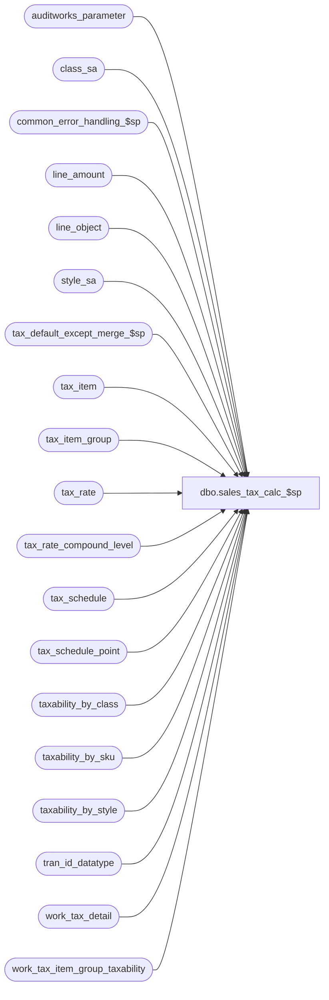

# dbo.sales_tax_calc_$sp

**Database:** auditworks_external  
**Server:** bedrockdb01  

## Architecture Diagram



## Table Dependencies

| Referenced Table |
|---|
| auditworks_parameter |
| class_sa |
| common_error_handling_$sp |
| line_amount |
| line_object |
| style_sa |
| tax_default_except_merge_$sp |
| tax_item |
| tax_item_group |
| tax_rate |
| tax_rate_compound_level |
| tax_schedule |
| tax_schedule_point |
| taxability_by_class |
| taxability_by_sku |
| taxability_by_style |
| tran_id_datatype |
| work_tax_detail |
| work_tax_item_group_taxability |

## Stored Procedure Code

```sql
create proc dbo.sales_tax_calc_$sp 
( 
  @process_id                   binary(16),
  @user_id                      int,
  @function_no                  smallint,	--22=DayEnd, 37=manual-function-pre-audit-tax, 38=edit-pre-audit-tax, 161=Tax Rebuild, 
  @class_exception_flag         tinyint,
  @sku_exception_flag           tinyint,
  @style_exception_flag         tinyint,
  @item_group_exception_flag    tinyint,
  @tax_rounding_method          tinyint,
  @log_flag                     tinyint,
  @stream_no                    tinyint,
  @errmsg                       nvarchar(2000) OUTPUT
)

AS

/*
PROC NAME: sales_tax_calc_$sp
     DESC: Common routine to calculate tax amounts at transaction and line levels
           Called by sales_tax_main_$sp, edit_pre_audit_tax_$sp, pre_audit_tax_$sp, sales_tax_rebuild_$sp
           
           Whenever possible, the tax collected for each tax-level in a transaction is allocated to the individual items in the
           transaction based on the tax expected associated with each line.  This provides a perfectly accurate allocation
           whenever the tax collected at POS is correct and the best allocation possible whenever the tax collected is only slightly
           incorrect (for example, because of the wrong rate having been used).  
	   -Allocate tax charged to items sold and tax refunded to items returned, based on tax expected on sales and returns respectively 
	    (if both charged and refunded tax collected lines exist and both items sold and items returned with tax expected exist).
           -Allocate tax charged or refunded to all taxable items in the transactions based on tax expected (if only charged or refunded but not both are given).

           This is not possible in even exchange transactions where the net tax expected is zero however, so in this case:
	   -Allocate tax charged to items sold and tax refunded to items returned, based on share of taxable sales and returns respectively 
	    (if both charged and refunded tax collected lines exist and both taxable items sold and taxable items returned exist).
           -Allocate tax charged or refunded to all taxable items in the transactions based on share of taxable total (if only charged or refunded but not both are given and taxable items exist).
                      
           Whenever tax collected at POS is dramatically incorrect however (charging/refunding tax on items which are not taxable, charging
           tax for a tax-level which does not exist in the jurisdiction in question, charging tax when tax should have been refunded, 
           refunding tax when tax should have been charged, etc),
           the system is forced to use another allocation basis from the following list:
           -Allocate tax charged to items sold and tax refunded to items returned, evenly
           -Allocate tax charged or refunded to all items, evenly or based on price
           
           Also, in exchange transactions where only net tax is specified (i.e. tax charged or refunded are present but not both),
           if allocating net tax collected based on share of expected and/or share of taxable amounts would result in an effective rate of more than 25%,
           allocate to same-sign items only.
  HISTORY:
Date     Name           Def#  Desc
Jul08,14 Vicci     TFS-77254  When applying rounding difference take into account that work_tax_detail is the combined_tax_rate is part of the 
                              uniqueness criteria for work_tax_detail in the case where both above and below threshold rates apply to the same line item.
Jun16,14 Vicci     TFS-75199  Don't run the merge when called by Edit if this has been disabled since the new tax configuration may only take effect
                              in the future and the Edit may therefore not need it to process its current batch of transactions;
                              (parameter would only be set for clients with excessively large tax master tables).
Oct28,13 Vicci        147679  Support below-threshold-rate in combination with tax-on-excess option.
May09,13 Paul         143544  improve performance of update that sets tax_item_group_id
May08,13 Vicci        143836  If a tax override detail with category = 3 (Tax Exempt) but Taxable = 1 is encountered, use exemption_tax_rate_code instead of tax_rate_code.
Mar12,13 Vicci        142495  Don't run the merge when called by manual functions if this has been disabled since the UI times out after 5 minutes
                              (parameter would only be set for clients with excessively large tax master tables).
Nov01,12 Vicci        139395  Corrected where-clause of case 60 (since it only handles the case where the expected is 0 
                      and the total tax collected sign does not match the total taxable sign BUT THERE ARE SOME ITEMS WITH THE RIGHT SIGN) to exclude
                              transactions where tax has been collected but there are no items sold (or refunded with no items returned).
Nov28,11 Vicci      1-47UXP9  Recognize tax lines with $0 to allow transaction to say to "prorate refund to return and charge to sale" even when the amount for one type is zero.
                              Also, if the net tax expected which forms the basis of the tax collected allocation is less than a cent,
                              treat it as though it were 0.  Also, in an exchange transaction with only actaul tax charged or refunded but not both, if the
                              share of the actual tax that would be allocated to sales is > 25% of the sales (or the share that would be allocated to the returns
                              is > 25% of the returns) then allocate to same sign only instead of to both sales and returns.
Nov16,11 Paul         131244  change datatype of @merge_type to smallint to avoid error when value is negative, use FASTFORWARD and NOLOCK hints
Oct14,11 Vicci        130464  Ensure that the same rate as was exported to Coalition is used when looking up a rate by tax item group.
Jun28,11 Vicci      1-475N4G  Avoid divide by zero when transaction total is zero (i.e. only give-away items exist in transaction).
Jun07,11 Vicci      1-470O4U  Ensure tax collected updates to work_tax_detail are mutually exclusive since although work-tax-detail
                              tax amounts get zeroed out as they are applied, the source #line_tax_rate retains its value and they
                              get doubled up if applied more than once.
Apr14,11 Vicci      1-46OHIV  Allocate penny rounding differences more accurately to avoid "expected vs collected" variances being reported where
                              none exist.
Dec14,10 Vicci        120654  Set tax_item_group_id to support Avalara export and potential new S/A reporting.
Sep15,10 Vicci        120892  Add option to allocate transaction tax to item level on a per-order basis to support ES.
Oct15,09 Vicci      1-43GV32  Modify tax exception lookup to include original purchase date of return in its criteria
Oct02,08 Phu          104451  Apply 1-3YJQ75 to SA5. Handle the case of having a bigger penny diff than the recipient to fix subledger imbalance.
May06,08 Phu          101035  Handle the case of having tax charged on net returns or tax refunded on net sales to fix subledger out of balance.
Apr23,08 Vicci      1-38MDAZ  Support tax-stripping of prices including multiple tax levels.
Mar26,08 Vicci      1-38MDAZ  Support multiple tax-on-tax levels, tax-schedules, rule-level rounding methods, 
                              and use unit price not extended price for threshold tax.
Nov14,07 Phu           94993  Allocate penny diff to taxable line or non taxable line.
Oct04,07 Phu           93464  Apply 93250 to SA5. Facilitate subledger posting when GL account is setup by tax jurisdiction.
Aug06,07 Phu           90389  Apply 1-3Q94KK to SA5. Allocate penny diff to taxable line and not to tax line.
Jan22,07 Phu         DV-1354  Apply 81550 to SA5. Correct 79090 and adjust penny diff for rounding by trans.
Dec05,06 Paul        DV-1347  Apply 61094 to SA5, corrected group by
Nov08,06 Phu         DV-1350  Retrofit 4.1 D#79090 to 5.0. Allow exchange for different/same tax jurisdictions.
Apr29,05 Paul        DV-1234  expand transaction_id to use tran_id_datatype
Dec13,04 David       DV-1191  Improve performance by adding hints.
Sep15,04 IanK        DV-1146  Change user_name to user_id
Apr28,04 Maryam      DV-1071  Changed @process_id from tinyint to binary(16) and receive @user_name 
                              pass both variables to the common_error_handling_$sp.
Nov08,06 Phu           79090  Undo 1-3FXR81. Allow exchange for different/same tax jurisdictions.
Nov03,06 Daphna     1-3FXR81  Insert new col with tax_line_id to prevent duplicates in posting
Oct26,05 Shapoor       61094  Round to 2 decimal place for taxable_fee_amount,taxable_merchandise_amount 
                     and taxable_expense_amount in work_tax_detail (for tax stripping)
Apr07,04 Phu     26964/27387  Tax collected not retrieved for even exchange tran + tax_strip on + rounding by transaction
Oct06,03 David   15968/16023  Avoid error divide by 0 when ttr.row_count = 0.
May02,03 David          5667  Set tax category properly when modifying archived transaction.
Apr23,03 David          7320  Handle even exchange trnx with no return detail
Apr04,03 Maryam      1-GLVX5  Allow using stock keeping unit level tax item group for tax calculations
Feb10,03 Phu            6065  Correct error: insert null into #store_date in build_subledger_$sp
Dec19,02 Phu            5327  Post ordered trans to tax_detail, prorate tax collected to nontaxable if required
Dec13,02 Phu            5353  Fix wrong tax collected for the same tax level with different tax rate code
Dec07,02 Phu         1-GCX2X  Calculate taxes where returned and sold items are in one tran or when modifying archived trans
Dec03,02 Phu         1-FULQT  Prorate tax collected based on tax expected over total tax expected or net amount over total net amount
Aug29,02 Phu         1-E3LUO  Correct MSSQL error 8154: table 'work_tax_detail' is ambiguous
Aug01,02 Phu         1-E3LUO  Allow one tax_on_tax_level having different tax_on_combined_rate in one transaction
                              to fix duplicate key insert on work_tax_round
Apr25,02 Phu         1-C9P5S  Pre Audit tax
Nov30,01 Phu		8931  Error handling
NOV07,01 Daphna		8915  Remove redundant insert to work_tax_round.override_tax_category 
                              to prevent duplicate row error
Oct02,01 Maryam         8810  Author
*/

DECLARE
	@errno				int,
	@message_id			int,
	@object_name			nvarchar(255),
	@operation_name			nvarchar(100),
	@process_name			nvarchar(100),
	@rows				int,
	@expected_rows			int,
	@updated_rows			int,
	@tax_on_tax_level_flag		tinyint,
	@tax_strip_flag			tinyint,
	@compound_order			int,
	@cursor_open			tinyint,
	@transaction_id			tran_id_datatype,
	@line_id			numeric(5,0),
	@tax_level			tinyint,
	@tax_category			tinyint,
	@tax_paid_flag			tinyint,
	@tax_amount_collected		line_amount,
	@tran_penny_diff		numeric(12,2),
	@amount_adjustment		line_amount,
	@penny_diff_balance		line_amount,
	@start_loop 			tinyint,
	@next_line_id			numeric(5,0),
	@min_tax_strip_level		tinyint,  --1-38MDAZstrip
	@max_tax_strip_level		tinyint,  --1-38MDAZstrip
	@reference_type			tinyint,
	@reference_no			nvarchar(80),
	@tax_jurisdiction 		nchar(5),
	@av_mod_flag 			smallint,
	@tax_rate_code 			tinyint,
	@tax_sign 			smallint,
	@rate_penny_diff		money,
	@rate_penny_diff_applied	money,
	@prior_transaction_id		tran_id_datatype,
	@prior_tax_level		tinyint, 
	@prior_tax_jurisdiction		nchar(5),
	@prior_reference_type		tinyint,
	@prior_reference_no		nvarchar(80),
	@prior_av_mod_flag		smallint,
	@prior_tax_paid_flag		tinyint,
	@prior_tax_rate_code		tinyint,
	@prior_tax_rate_sign		smallint,
	@merge_type			smallint,
	@combined_tax_rate	        numeric(6,4)  

SELECT @tax_on_tax_level_flag = 0,
       @message_id = 201068,
       @process_name = 'sales_tax_calc_$sp',
       @item_group_exception_flag = 0, -- will be recalculated later in this proc
       @merge_type = -1  /* if rebuild is required, merge tax default, taxability by item group including historical entries and save results under process_id -1 */

/* set the tax_rate_code from taxability_by_class if applies */
IF @class_exception_flag = 1
BEGIN
    UPDATE work_tax_detail
       SET tax_rate_code = td.tax_rate_code
      FROM work_tax_detail wt, taxability_by_class td
     WHERE wt.process_id = @process_id
       AND wt.class_code != 0
       AND wt.tax_jurisdiction = td.tax_jurisdiction
       AND wt.tax_level = td.tax_level
       AND wt.class_code = td.class_code
       AND wt.upc_lookup_division = td.upc_lookup_division
       AND ISNULL (wt.return_from_date, wt.transaction_date) >= td.effective_from_date
       AND (ISNULL (wt.return_from_date, wt.transaction_date) <= td.effective_until_date OR td.effective_until_date IS NULL)
  	
    SELECT @errno = @@error
    IF @errno <> 0
      BEGIN
	SELECT @errmsg = 'Failed to update work_tax_detail. (class)',
	       @object_name = 'work_tax_detail',
	       @operation_name = 'UPDATE'
	GOTO error
      END
END
 

/* If applies set the tax_rate_code from taxability_by_style */
IF @style_exception_flag = 1
  BEGIN
    UPDATE work_tax_detail
       SET tax_rate_code = td.tax_rate_code
      FROM work_tax_detail wt, taxability_by_style td
     WHERE wt.process_id = @process_id
       AND wt.style_reference_id != 0
       AND wt.tax_jurisdiction = td.tax_jurisdiction
       AND wt.tax_level = td.tax_level
       AND wt.style_reference_id = td.style_reference_id
       AND wt.upc_lookup_division = td.upc_lookup_division
       AND ISNULL(wt.return_from_date, wt.transaction_date) >= td.effective_from_date
       AND (ISNULL(wt.return_from_date, wt.transaction_date) <= td.effective_until_date OR td.effective_until_date IS NULL)
  
    SELECT @errno = @@error
    IF @errno <> 0
      BEGIN
	SELECT @errmsg = 'Failed to update work_tax_detail. (style)',
	       @object_name = 'work_tax_detail',
	       @operation_name = 'UPDATE'
	GOTO error
      END
  END

/* If applies set the tax_rate_code from taxability_by_sku */
IF @sku_exception_flag = 1
  BEGIN
    UPDATE work_tax_detail
       SET tax_rate_code = td.tax_rate_code
      FROM work_tax_detail wt, taxability_by_sku td
     WHERE wt.process_id = @process_id
       AND wt.sku_id != 0
       AND wt.tax_jurisdiction = td.tax_jurisdiction
       AND wt.tax_level = td.tax_level
       AND wt.sku_id = td.sku_id
       AND wt.upc_lookup_division = td.upc_lookup_division
       AND ISNULL(wt.return_from_date, wt.transaction_date) >= td.effective_from_date
       AND (ISNULL(wt.return_from_date, wt.transaction_date) <= td.effective_until_date OR td.effective_until_date IS NULL)
       
    SELECT @errno = @@error
    IF @errno <> 0
      BEGIN
	SELECT @errmsg = 'Failed to update work_tax_detail. (sku)',
	       @object_name = 'work_tax_detail',
	       @operation_name = 'UPDATE'
	GOTO error
      END
  END

/* Support Avalara tax export and S/A tax reporting possibilities.
   Will update using 2 inner join update queries first in order to improve performance when the master tables are large. */

IF EXISTS (SELECT 1 FROM tax_item_group)
BEGIN
	  SELECT @errmsg = 'Failed to set tax_item_group_id (tax_item)',
		 @object_name = 'work_tax_detail',
		 @operation_name = 'UPDATE'

	UPDATE work_tax_detail
	   SET tax_item_group_id = ti.tax_item_group_id 
	  FROM work_tax_detail wt
	       INNER JOIN tax_item ti
	         ON (wt.sku_id = ti.sku_id
	        AND wt.upc_lookup_division = ti.upc_lookup_division
	 AND ti.tax_item_group_id IS NOT NULL)
	 WHERE wt.process_id = @process_id
	   AND wt.line_object_type <> 5
	   AND wt.tax_item_group_id IS NULL

	SELECT @errno = @@error, @item_group_exception_flag = SIGN(@@rowcount)
	IF @errno <> 0
	BEGIN
	  GOTO error
	END

	  SELECT @errmsg = 'Failed to set tax_item_group_id (style_sa)'
	UPDATE work_tax_detail
	   SET tax_item_group_id = s.tax_item_group_id 
	  FROM work_tax_detail wt
	       INNER JOIN style_sa s
	         ON (wt.style_reference_id = s.style_reference_id
	        AND wt.upc_lookup_division = s.upc_lookup_division
	        AND s.tax_item_group_id IS NOT NULL)
	 WHERE wt.process_id = @process_id
	   AND wt.line_object_type <> 5
	   AND wt.tax_item_group_id IS NULL

	SELECT @errno = @@error, @item_group_exception_flag = @item_group_exception_flag + SIGN(@@rowcount)
	IF @errno <> 0
	BEGIN
	  GOTO error
	END

	  SELECT @errmsg = 'Failed to set tax_item_group_id (line_object)'
	UPDATE work_tax_detail
	   SET tax_item_group_id = COALESCE(c.tax_item_group_id, o.tax_item_group_id) 
	  FROM work_tax_detail wt
	       LEFT OUTER JOIN line_object o
	         ON wt.line_object = o.line_object
	       LEFT OUTER JOIN class_sa c
	         ON wt.class_code = c.class_code
	        AND wt.upc_lookup_division = c.upc_lookup_division
	 WHERE wt.process_id = @process_id
	   AND wt.line_object_type <> 5
	   AND wt.tax_item_group_id IS NULL
	   AND COALESCE(c.tax_item_group_id, o.tax_item_group_id) IS NOT NULL

	SELECT @errno = @@error, @item_group_exception_flag = @item_group_exception_flag + SIGN(@@rowcount)
	IF @errno <> 0
	BEGIN
	  GOTO error
	END

	SELECT @item_group_exception_flag = SIGN(@item_group_exception_flag)
  END -- If exists .. tax_item_group

/* If any tax-item-groups have been identified for trans in work_tax_detail, then set the tax_rate_code from the merge of the tax_default 
    and taxability_by_item_group settings for the item groups */
IF @item_group_exception_flag = 1 
   AND (@function_no <> 37 OR NOT EXISTS (SELECT 1
	                	            FROM auditworks_parameter
	                	           WHERE par_name = 'disable_manual_tax_merge'
	                	             AND par_value = '1'))
   AND (@function_no <> 38 OR NOT EXISTS (SELECT 1
	                	            FROM auditworks_parameter
	                	           WHERE par_name = 'disable_edit_tax_merge'
	                	             AND par_value = '1'))
BEGIN
  EXEC tax_default_except_merge_$sp @errmsg OUTPUT, @merge_type, null, 1
  SELECT @errno = @@error
  IF @errno != 0
  BEGIN
    IF @errmsg IS NULL /* then */
      SELECT @errmsg = 'Failed to determine taxability of tax-item-groups and populate work_tax_item_group_taxability'
    SELECT @object_name = 'tax_default_except_merge_$sp',
           @operation_name = 'EXECUTE'
    GOTO error
  END

  UPDATE work_tax_detail
     SET tax_rate_code = td.tax_rate_code
    FROM work_tax_detail wt, work_tax_item_group_taxability td WITH (NOLOCK)
   WHERE wt.process_id = @process_id
     AND td.process_id = -1  --i.e. the semi-permanent copy of the taxability settings derived by tax_default_except_merge_$sp
     AND wt.tax_item_group_id = td.tax_item_group_id
     AND wt.tax_jurisdiction = td.tax_jurisdiction
     AND wt.tax_level = td.tax_level
     AND ISNULL(wt.return_from_date, wt.transaction_date) >= td.effective_from_date
     AND (ISNULL(wt.return_from_date, wt.transaction_date) <= td.effective_until_date OR td.effective_until_date IS NULL)

  SELECT @errno = @@error
  IF @errno <> 0
  BEGIN
    SELECT @errmsg = 'Failed to update work_tax_detail with taxability by item group information',
	   @object_name = 'work_tax_detail',
	   @operation_name = 'UPDATE'
    GOTO error
  END
END

UPDATE work_tax_detail
   SET tax_rate_code = ex.tax_rate_code
  FROM work_tax_detail wt 
       INNER JOIN tax_rate tr
          ON wt.tax_jurisdiction = tr.tax_jurisdiction
      AND wt.tax_level = tr.tax_level	
         AND wt.tax_rate_code = tr.tax_rate_code
         AND ISNULL (wt.return_from_date, wt.transaction_date) >= tr.effective_from_date
         AND (tr.effective_until_date IS NULL OR ISNULL(wt.return_from_date, wt.transaction_date) <= tr.effective_until_date)
         AND tr.exemption_tax_rate_code IS NOT NULL
       INNER JOIN tax_rate ex  --to ensure exemption_tax_rate_code is valid
          ON tr.tax_jurisdiction = ex.tax_jurisdiction
         AND tr.tax_level = ex.tax_level	
         AND tr.exemption_tax_rate_code = ex.tax_rate_code
         AND ISNULL (wt.return_from_date, wt.transaction_date) >= ex.effective_from_date
         AND (ex.effective_until_date IS NULL OR ISNULL(wt.return_from_date, wt.transaction_date) <= ex.effective_until_date)
 WHERE wt.process_id = @process_id
   AND wt.tax_category = 3 --tax exempt
   AND wt.taxable = 1
SELECT @errno = @@error
IF @errno <> 0
BEGIN
  SELECT @errmsg = 'Failed to update work_tax_detail with exemption tax rate code information.',
  @object_name = 'work_tax_detail',
	 @operation_name = 'UPDATE'
  GOTO error
END

/* The next two updates will set the combined_rate. It either contains the combined_rate or 
   the below_threshold_combined_rate. Ex.: Given a threshold_amount of $100, a combined_rate
   of 8% and a below_threshold_combined_rate of %4  IF the amount is $90 then the 
   combined_rate will be %4 - if the amount is $120, then the combined_rate is %8.
   If the tax_on_threshold_excess = TRUE and the amount is $120 the amount be split (reducing it to $20 
   with an additional work_tax_detail entry made for $100 with the below_threshold_combined_rate).
   IF the below_threshold_combined_rate = 0 then the combined_rate is automatically used.   
*/

UPDATE work_tax_detail
   SET combined_tax_rate = IsNull(CASE WHEN (tr.below_threshold_combined_rate > 0 AND 
                                             ABS(wt.amount / wt.units) <= tr.threshold_amount ) -- 1-38MDAZ
			               THEN tr.below_threshold_combined_rate 
                                       ELSE tr.combined_rate 
                                  END, 0),  --even if amount is <= threshold, it should display under combined rate but as non-taxable when below rate is 0.
       threshold_amount = COALESCE(hp.highest_point_amount, tr.threshold_amount, 0), -- 1-38MDAZ
       tax_on_threshold_excess = CASE WHEN (tr.below_threshold_combined_rate > 0 AND ABS(wt.amount / wt.units) <= tr.threshold_amount ) 
                                      THEN 0 
                                      ELSE ISNULL(tr.tax_on_threshold_excess, 0) END,  --concept of "on excess" only applies when price exceeds threshhold
       tax_on_full_amount = CASE WHEN (tr.below_threshold_combined_rate > 0 AND ABS(wt.amount / wt.units) <= tr.threshold_amount ) 
                                 THEN 1 
                                 ELSE 1 - ISNULL(tr.tax_on_threshold_excess, 1) END,
       tax_on_tax_level = ISNULL(tr.tax_on_tax_level, 0),
       below_threshold_combined_rate = ISNULL(tr.below_threshold_combined_rate ,0),
       item_tax_strip_flag = ISNULL(tr.item_tax_strip_flag,0),
       tax_schedule_id = tr.tax_schedule_id, -- 1-38MDAZ
       transaction_level_tax_calc = tr.transaction_level_tax_calc, -- 1-38MDAZ
       compound_order = CASE WHEN tr.item_tax_strip_flag = 1 
                             THEN tr.compound_order * -1
                             ELSE tr.compound_order 
                        END, -- 1-38MDAZstrip
       effective_from_date = tr.effective_from_date 
  FROM work_tax_detail wt 
       INNER JOIN tax_rate tr
          ON wt.tax_jurisdiction = tr.tax_jurisdiction
         AND wt.tax_level = tr.tax_level	
         AND wt.tax_rate_code = tr.tax_rate_code
         AND ISNULL (wt.return_from_date, wt.transaction_date) >= tr.effective_from_date
         AND (tr.effective_until_date IS NULL OR ISNULL(wt.return_from_date, wt.transaction_date) <= tr.effective_until_date)
       LEFT OUTER JOIN (SELECT hp.tax_schedule_id, MAX(hp.to_threshold_amount) highest_point_amount
                          FROM tax_schedule_point hp
                         GROUP BY hp.tax_schedule_id) hp  -- 1-38MDAZ
         ON tr.tax_schedule_id = hp.tax_schedule_id
 WHERE wt.process_id = @process_id
   AND wt.tax_rate_code <> 0

SELECT @errno = @@error
IF @errno <> 0
BEGIN
  SELECT @errmsg = 'Failed to update work_tax_detail with tax_rate info.',
         @object_name = 'work_tax_detail',
	 @operation_name = 'UPDATE'
  GOTO error
END

-- In the case of a return set the tax_category to override when either the rate or threshold_amount or schedule
-- associated with the original date is different than the current rate or threshold_amount.  
UPDATE work_tax_detail
   SET tax_category = (FLOOR(tax_category / 100) * 100) + 2
  FROM work_tax_detail wt, tax_rate tr
 WHERE wt.process_id = @process_id
   AND wt.return_from_date IS NOT NULL --
   AND (wt.combined_tax_rate <> IsNull(CASE WHEN (tr.below_threshold_combined_rate > 0 AND 
                                             ABS(wt.amount / wt.units) <= tr.threshold_amount ) 
                                       THEN tr.below_threshold_combined_rate 
                                       ELSE tr.combined_rate 
                                  END, 0) -- 1-38MDAZ
        OR (wt.threshold_amount <> tr.threshold_amount AND wt.tax_schedule_id IS NULL)
        OR IsNull(wt.tax_schedule_id, -1) <> IsNull(tr.tax_schedule_id, -1)) -- 1-38MDAZ
   AND wt.tax_rate_code <> 0
   AND wt.tax_jurisdiction = tr.tax_jurisdiction
   AND wt.tax_level = tr.tax_level	
   AND wt.tax_rate_code = tr.tax_rate_code
   AND wt.transaction_date >= tr.effective_from_date
   AND (tr.effective_until_date IS NULL OR wt.transaction_date <= tr.effective_until_date)
   AND wt.tax_category IN (0,100) -- 100 = Standard Taxability: archive mod  

SELECT @errno = @@error
IF @errno <> 0
BEGIN
  SELECT @errmsg = 'Failed to set tax_category.',
	 @object_name = 'work_tax_detail',
	 @operation_name = 'UPDATE'
  GOTO error
END

SELECT @tax_on_tax_level_flag = SIGN(ISNULL(MAX(tax_on_tax_level), 0)),
       @tax_strip_flag = SIGN(ISNULL(MAX(item_tax_strip_flag), 0)),
       @min_tax_strip_level = MIN(CASE WHEN item_tax_strip_flag = 1 THEN tax_level ELSE NULL END),  --1-38MDAZstrip
       @max_tax_strip_level = MAX(CASE WHEN item_tax_strip_flag = 1 THEN tax_level ELSE NULL END)  --1-38MDAZstrip
 FROM work_tax_detail WITH (NOLOCK)
WHERE process_id = @process_id

SELECT @errno = @@error
IF @errno <> 0
BEGIN
  SELECT @errmsg = 'Failed to select tax_on_tax_level, item_tax_strip_flag from work_tax_detail.',
	 @object_name = 'work_tax_detail',
	 @operation_name = 'SELECT'
  GOTO error
END

--1-38MDAZstrip
IF @min_tax_strip_level <> @max_tax_strip_level  
BEGIN
  UPDATE work_tax_detail
     SET strip_rate = q.strip_rate
    FROM work_tax_detail wt,
         (SELECT transaction_id, line_id, line_object, compound_order, SUM(combined_tax_rate) strip_rate
            FROM work_tax_detail
           WHERE process_id = @process_id
             AND item_tax_strip_flag = 1
             AND line_object_type <> 5
           GROUP BY transaction_id, line_id, line_object, compound_order) q
   WHERE wt.process_id = @process_id
     AND wt.item_tax_strip_flag = 1
     AND wt.line_object_type <> 5
     AND wt.transaction_id = q.transaction_id
     AND wt.line_id = q.line_id
     AND wt.line_object = q.line_object
     AND wt.compound_order = q.compound_order

  SELECT @errno = @@error
  IF @errno <> 0
  BEGIN
    SELECT @errmsg = 'Failed to determine total taxes included in price for each compound level',
  	   @object_name = 'work_tax_detail',
	   @operation_name = 'UPDATE'
    GOTO error
  END
END --IF @min_tax_strip_level <> @max_tax_strip_level i.e. if multi-level tax stripping exists

INSERT into work_tax_detail(
       process_id,
       transaction_id,
       line_id,
       tax_level,
       tax_jurisdiction,
       tax_category,
       transaction_date,
       store_no,
       amount,
       tax_sign,
       gl_effect,
       line_object,
       line_object_type,
       tax_rate_code,
       combined_tax_rate,
       threshold_amount,
       tax_on_threshold_excess,
       tax_on_full_amount,
       taxable_merchandise_amount,
       taxable_fee_amount,
       taxable_expense_amount,
       nontaxable_merchandise_amount,
       nontaxable_fee_amount,
       tax_amount_collected,
       tax_amount_paid,
       tax_amount_expected,
       tax_on_tax_level,
       tax_on_tax_rate_code,
       tax_on_combined_rate,
       taxable,
       class_code,
       style_reference_id,
       sku_id,
       upc_lookup_division,
       below_threshold_combined_rate,
       return_from_date,
       override_tax_category,
       tax_paid_flag,
       header_override_flag,
       item_tax_strip_flag,
  all_tax_override_flag,
       max_applied_by_line_id,
       units,
       tax_schedule_id,
       transaction_level_tax_calc,
       compound_order,
       on_tax_amt_expected,
       effective_from_date,
       strip_rate,
       penny_adjusted,
       track_tax,
       reference_type,
       reference_no,
       tax_item_group_id,
       fulfillment_store_no,
       tax_amount_collected_unrounded)
SELECT process_id,
       transaction_id,
       line_id,
       tax_level,
       tax_jurisdiction,
       tax_category,
       transaction_date,
       store_no,
       threshold_amount,
       tax_sign,
       gl_effect,
       line_object,
       line_object_type,
       tax_rate_code,
       below_threshold_combined_rate, --combined_tax_rate for this portion of price is the below threhhold rate.
       threshold_amount * units * sign(amount),  --amount
       0,  --tax_on_threshold_excess (since amount has been reduced to that to which the below threshold rate applies for this row, the rate is now on full amount of line
       1,  --tax_on_full_amount
       taxable_merchandise_amount,
       taxable_fee_amount,
       taxable_expense_amount,
       nontaxable_merchandise_amount,
       nontaxable_fee_amount,
       tax_amount_collected,
       tax_amount_paid,
       tax_amount_expected,
       tax_on_tax_level,
       tax_on_tax_rate_code,
       tax_on_combined_rate,
       taxable,
       class_code,
       style_reference_id,
       sku_id,
       upc_lookup_division,
       below_threshold_combined_rate,
       return_from_date,
       override_tax_category,
       tax_paid_flag,
       header_override_flag,
       item_tax_strip_flag,
       all_tax_override_flag,
       max_applied_by_line_id,
       units,
       tax_schedule_id,
       transaction_level_tax_calc,
       compound_order,
       on_tax_amt_expected,
       effective_from_date,
       strip_rate,
       penny_adjusted,
       track_tax,
       reference_type,
       reference_no,
       tax_item_group_id,
       fulfillment_store_no,
       tax_amount_collected_unrounded
  FROM work_tax_detail 
 WHERE process_id = @process_id
   AND below_threshold_combined_rate > 0
   AND tax_on_threshold_excess = 1
   AND tax_schedule_id IS NULL
   AND threshold_amount > 0 
   AND below_threshold_combined_rate <> combined_tax_rate  
  SELECT @errno = @@error
  IF @errno <> 0
  BEGIN
    SELECT @errmsg = 'Failed to split line with price above threshold by adding line with its below threshhold component. ',
  	   @object_name = 'work_tax_detail',
	   @operation_name = 'INSERT'
    GOTO error
  END       

DECLARE compound_order_cursor CURSOR FAST_FORWARD
    FOR
 SELECT DISTINCT compound_order
   FROM work_tax_detail WITH (NOLOCK)
  WHERE process_id = @process_id
  ORDER BY compound_order

OPEN compound_order_cursor
SELECT @cursor_open = 1
  
FETCH compound_order_cursor
 INTO @compound_order

WHILE @@fetch_status = 0 
BEGIN

-- 1-38MDAZ
-- If the rate code uses a tax schedule, look up the transaction total or the item price for the rate code in the
-- schedule to determine the tax amount and/or effective rate 
-- See \\nsbnet\share\Dev\Projects\Features\0388-SA-ODC SA5 PBTM Port\WIP\BA\SRD.SA5_PBTM_ODC_Port.TaxConfiguration.doc
-- for calculation explanation.
-- Note that if rounding by transaction, the tax amount looked up is that for the transaction not for the individual item,
-- and when rounding by item the tax amount looked up is that for 1 item not the extended amount.
-- Note that tax-stripping is not supported in conjunction with schedules.
/*
C                    Use the tax-amount associated with the taxable amount or the default tax-rate if the taxable amount exceeds the upper limit of the top schedule point
RC                   Use the tax-rate associated with the taxable amount or the default tax-rate if the taxable amount exceeds the upper limit of the top schedule point
RS                   Multiply the integer portion of the taxable amount divided by the highest upper limit by the top schedule point's upper limit times its tax rate and add the tax rate associated with the remainder times the remainder.
RT                   Fraction the taxable amount based on the upper limit of each schedule point defined, applying the rate associated with each tier and applying the default rate to any amount in excess of the highest upper limit
S                    Multiply the integer portion of the taxable amount divided by the highest upper limit by the top schedule point's tax amount and add the tax amount associated with the remainder.
T                    Fraction the taxable amount based on the upper limits of each schedule point defined, adding the tax amounts associated with each tier and applying the default rate to any amount in excess of the highest upper limit
*/
  UPDATE work_tax_detail
     SET tax_amount_expected = CASE WHEN (wt.amount + wt.on_tax_amt_expected) = 0 THEN 0 --avoid divide by zero
			       ELSE 
			 ROUND(CASE s.tax_schedule_type
                               WHEN 'C' THEN IsNull(sign(wt.amount) * p.tax_amount * ((wt.amount + wt.on_tax_amt_expected)/IsNull(q.trans_amount + q.on_trans_tax_amt_expected, (wt.amount + wt.on_tax_amt_expected) / wt.units)), wt.combined_tax_rate/100 * (wt.amount + wt.on_tax_amt_expected))
                               WHEN 'S' THEN (FLOOR(ABS(IsNull((q.trans_amount + q.on_trans_tax_amt_expected), (wt.amount + wt.on_tax_amt_expected) / wt.units)) 
                                                    / wt.threshold_amount) * IsNull(hp.tax_amount, 0) 
                                              + IsNull(p.tax_amount, 0))
                                             * sign(wt.amount) * ((wt.amount + wt.on_tax_amt_expected)/IsNull((q.trans_amount + q.on_trans_tax_amt_expected), (wt.amount + wt.on_tax_amt_expected)/wt.units))
                               WHEN 'RS' THEN (FLOOR(ABS(IsNull(q.trans_amount, wt.amount / wt.units)) 
                                                    / wt.threshold_amount) * wt.threshold_amount * IsNull(hp.tax_rate/100, 0) 
                                               + IsNull(p.tax_rate/100, 0) * 
          					(ABS(IsNull((q.trans_amount + q.on_trans_tax_amt_expected), (wt.amount + wt.on_tax_amt_expected) / wt.units)) -
				             (FLOOR(ABS(IsNull((q.trans_amount + q.on_trans_tax_amt_expected), (wt.amount + wt.on_tax_amt_expected) / wt.units)) / 
                                                wt.threshold_amount) * wt.threshold_amount)))
                                             * sign(wt.amount) * ((wt.amount + wt.on_tax_amt_expected)/IsNull((q.trans_amount + q.on_trans_tax_amt_expected), (wt.amount + wt.on_tax_amt_expected)/wt.units))
                               WHEN 'RC' THEN IsNull(p.tax_rate, wt.combined_tax_rate)/100 * (wt.amount + wt.on_tax_amt_expected) * IsNull(wt.taxable, 1)
                               ELSE 0
                               END
                               ,CASE WHEN (transaction_level_tax_calc = 1
                                           OR (transaction_level_tax_calc IS NULL AND @tax_rounding_method = 1))
                            THEN 4 
                                     ELSE 2
                                END)
			  END,
		         combined_tax_rate = CASE s.tax_schedule_type
		                     WHEN 'RC' THEN IsNull(p.tax_rate, wt.combined_tax_rate)
				              ELSE wt.combined_tax_rate
		                             END
    FROM work_tax_detail wt
         INNER JOIN tax_schedule s
            ON wt.tax_schedule_id = s.tax_schedule_id
           AND s.tax_schedule_type in ('S', 'C', 'RC', 'RS')
          LEFT OUTER JOIN (SELECT transaction_id, tax_level, tax_jurisdiction, tax_rate_code, tax_sign, sum(amount) trans_amount, sum(on_tax_amt_expected) on_trans_tax_amt_expected
                            FROM work_tax_detail			
                            WHERE process_id = @process_id
           AND tax_rate_code <> 0
                              AND tax_schedule_id IS NOT NULL
                              AND (transaction_level_tax_calc = 1
                                   OR (transaction_level_tax_calc IS NULL AND @tax_rounding_method = 1))
                            GROUP BY transaction_id, tax_level, tax_jurisdiction, tax_rate_code, tax_sign) q
            ON wt.transaction_id = q.transaction_id
           AND wt.tax_level = q.tax_level
           AND wt.tax_jurisdiction = q.tax_jurisdiction
           AND wt.tax_rate_code = q.tax_rate_code
           AND wt.tax_sign = q.tax_sign
         LEFT OUTER JOIN tax_schedule_point hp
            ON s.tax_schedule_type in ('S', 'RS')
           AND wt.tax_schedule_id = hp.tax_schedule_id
           AND wt.threshold_amount = hp.to_threshold_amount
         LEFT OUTER JOIN tax_schedule_point p
            ON wt.tax_schedule_id = p.tax_schedule_id
           AND ABS(IsNull((q.trans_amount + q.on_trans_tax_amt_expected), (wt.amount + wt.on_tax_amt_expected) / wt.units)) -
               CASE WHEN s.tax_schedule_type in ('S', 'RS')
                    THEN FLOOR(ABS(IsNull((q.trans_amount + q.on_trans_tax_amt_expected), (wt.amount + wt.on_tax_amt_expected) / wt.units)) / wt.threshold_amount) * wt.threshold_amount
                    ELSE 0
               END >= p.from_threshold_amount
           AND ABS(IsNull((q.trans_amount + q.on_trans_tax_amt_expected), (wt.amount + wt.on_tax_amt_expected) / wt.units)) -
               CASE WHEN s.tax_schedule_type in ('S', 'RS')
                    THEN FLOOR(ABS(IsNull((q.trans_amount + q.on_trans_tax_amt_expected), (wt.amount + wt.on_tax_amt_expected) / wt.units)) / wt.threshold_amount) * wt.threshold_amount
                    ELSE 0
               END <= p.to_threshold_amount
   WHERE wt.process_id = @process_id
     AND compound_order = @compound_order
     AND wt.tax_rate_code <> 0
     AND wt.tax_schedule_id IS NOT NULL --
     AND wt.threshold_amount > 0  --if it is zero then this implies there are no schedule points defined.
     AND (IsNull(wt.taxable, 1) <> 0 OR s.tax_schedule_type = 'RC')

  SELECT @errno = @@error
  IF @errno <> 0
  BEGIN
    SELECT @errmsg = 'Failed to set schedule-dependent tax_amount',
  	   @object_name = 'work_tax_detail',
	   @operation_name = 'UPDATE'
    GOTO error
  END

  /* if taxable was not already set from tax_override_detail set it based on the tax_rate_code
     and combined_tax_rate. */
  UPDATE work_tax_detail
     SET taxable = SIGN (tax_rate_code) * SIGN(combined_tax_rate + ABS(tax_amount_expected)) -- 1-38MDAZ
   WHERE taxable IS NULL --
     AND process_id = @process_id
     AND compound_order = @compound_order

  SELECT @errno = @@error
  IF @errno <> 0
  BEGIN
    SELECT @errmsg = 'Failed to update work_tax_detail. (taxable)',
  	   @object_name = 'work_tax_detail',
 	   @operation_name = 'UPDATE'
    GOTO error
  END

  UPDATE work_tax_detail
     SET nontaxable_merchandise_amount = SIGN(amount) * ABS(amount * (1 - SIGN(ABS(line_object_type - 1 )))),
         nontaxable_fee_amount = SIGN(amount) * ABS(amount * (1 - SIGN(ABS(line_object_type - 2 )))),
         tax_amount_collected = SIGN(amount) * ABS(amount * (1 - SIGN(ABS(line_object_type - 5 )))),
         tax_amount_expected = 0
   WHERE (taxable = 0 OR ( ABS(amount / units) <= threshold_amount AND tax_schedule_id IS NULL AND below_threshold_combined_rate = 0 ))  --1-38MDAZ
     AND process_id = @process_id
     AND compound_order = @compound_order

  SELECT @errno = @@error
  IF @errno <> 0
  BEGIN
    SELECT @errmsg = 'Failed to update work_tax_detail with non-taxable information.',
  	   @object_name = 'work_tax_detail',
 	   @operation_name = 'UPDATE'
    GOTO error
  END

  /* Tax stripping in conjunction with tax-schedule usage is not supported */
  /* Note : if below_threshold_combined_rate <> 0 then portion of price below threshold is not non-taxable even when tax_on_threshold_excess = 1 (it was instead split to a separate line above) */
  UPDATE work_tax_detail
     SET nontaxable_merchandise_amount = CASE WHEN tax_schedule_id IS NULL AND below_threshold_combined_rate = 0
                                              THEN SIGN(amount) 
                                                   * ABS(threshold_amount * units * tax_on_threshold_excess * (1 - SIGN (ABS(line_object_type - 1)))) 
                                              ELSE 0 END,
         nontaxable_fee_amount = CASE WHEN tax_schedule_id IS NULL AND below_threshold_combined_rate = 0 THEN SIGN(amount) * ABS(threshold_amount * units * tax_on_threshold_excess * (1 - SIGN (ABS(line_object_type - 2 )))) ELSE 0 END,
         taxable_merchandise_amount = 
                 ROUND(SIGN(amount) 
                       * ABS((convert(numeric(12,4),
                                      (amount/(1+(IsNull(strip_rate, combined_tax_rate)/100)*SIGN(item_tax_strip_flag)) * tax_on_full_amount)
                                     ) +
                                     (convert(numeric(12,4),
                                              (amount - CASE WHEN tax_schedule_id IS NULL THEN (threshold_amount*units) ELSE 0 END)
                                              /(1+(IsNull(strip_rate, combined_tax_rate)/100)*SIGN(item_tax_strip_flag))
                                             ) * tax_on_threshold_excess
                                     )
                             ) 
                              * (1 - SIGN(ABS(line_object_type - 1 )))
                            ), 2),
         taxable_fee_amount = ROUND(SIGN(amount) * ABS((convert(numeric(12,4),(amount/(1+(IsNull(strip_rate, combined_tax_rate)/100)*SIGN(item_tax_strip_flag)) * tax_on_full_amount)) +
                                      (convert(numeric(12,4),(amount - CASE WHEN tax_schedule_id IS NULL THEN (threshold_amount*units) ELSE 0 END)/(1+(IsNull(strip_rate, combined_tax_rate)/100)*SIGN(item_tax_strip_flag))) * tax_on_threshold_excess))  * (1 - SIGN(ABS(line_object_type - 2 )))), 2),
         taxable_expense_amount = ROUND(SIGN(amount) * ABS((convert(numeric(12,4),(amount/(1+(IsNull(strip_rate, combined_tax_rate)/100)*SIGN(item_tax_strip_flag)) * tax_on_full_amount)) +
             (convert(numeric(12,4),(amount - CASE WHEN tax_schedule_id IS NULL THEN (threshold_amount*units) ELSE 0 END)/(1+(IsNull(strip_rate, combined_tax_rate)/100)*SIGN(item_tax_strip_flag))) * tax_on_threshold_excess)) * (1 - SIGN(ABS(line_object_type - 7 )))), 2),
         tax_amount_collected = SIGN(amount) * ABS(amount * (1 - SIGN(ABS(line_object_type - 5 ))))
   WHERE taxable = 1 
     AND (ABS(amount/units) > threshold_amount OR below_threshold_combined_rate <> 0 OR tax_schedule_id IS NOT NULL) --1-38MDAZ
     AND process_id = @process_id
     AND compound_order = @compound_order

  SELECT @errno = @@error
  IF @errno <> 0
  BEGIN
    SELECT @errmsg = 'Failed to update classify work_tax_detail amounts as taxable/non-taxable/tax',
  	   @object_name = 'work_tax_detail',
           @operation_name = 'UPDATE'
    GOTO error
  END

  UPDATE work_tax_detail
    SET tax_amount_expected = CASE WHEN item_tax_strip_flag = 0 OR COALESCE(strip_rate, combined_tax_rate) <> combined_tax_rate
                                   THEN ROUND((taxable_merchandise_amount + taxable_fee_amount + taxable_expense_amount + on_tax_amt_expected) *
	             	                        (combined_tax_rate / 100), 
		              		       CASE WHEN (transaction_level_tax_calc = 1
                                                          OR (transaction_level_tax_calc IS NULL AND @tax_rounding_method = 1)) AND item_tax_strip_flag = 0
                                                    THEN 4 
                 ELSE 2
                                 END)
                                    ELSE amount - (taxable_merchandise_amount + taxable_fee_amount + taxable_expense_amount + on_tax_amt_expected)
                               END,
         tax_amount_paid = CASE WHEN item_tax_strip_flag = 1 AND tax_paid_flag = 1
                           THEN CASE WHEN strip_rate <> combined_tax_rate
                                     THEN ROUND((taxable_merchandise_amount + taxable_fee_amount + taxable_expense_amount + on_tax_amt_expected) *
	             	                              (combined_tax_rate / 100), 
		  CASE WHEN (transaction_level_tax_calc = 1
                                                                OR (transaction_level_tax_calc IS NULL AND @tax_rounding_method = 1)) AND item_tax_strip_flag = 0
                                                          THEN 4 
                                                          ELSE 2
                                                     END)
                                          ELSE amount - (taxable_merchandise_amount + taxable_fee_amount + taxable_expense_amount + on_tax_amt_expected)
                                          END
                                ELSE 0
                           END,
         tax_amount_collected = CASE WHEN item_tax_strip_flag = 1 AND tax_paid_flag = 0
                                     THEN CASE WHEN strip_rate <> combined_tax_rate
                                               THEN ROUND((taxable_merchandise_amount + taxable_fee_amount + taxable_expense_amount + on_tax_amt_expected) *
	             	                                   (combined_tax_rate / 100), 
		                                          CASE WHEN (transaction_level_tax_calc = 1
                                                                     OR (transaction_level_tax_calc IS NULL AND @tax_rounding_method = 1)) AND item_tax_strip_flag = 0
                                                               THEN 4 
                                                               ELSE 2
                                                          END)
                                               ELSE amount - (taxable_merchandise_amount + taxable_fee_amount + taxable_expense_amount + on_tax_amt_expected)
                  		          END
            			     ELSE 0
                                END
   WHERE process_id = @process_id
     AND compound_order = @compound_order 
     AND tax_schedule_id IS NULL
     AND tax_rate_code > 0
     AND taxable = 1

  SELECT @errno = @@error
  IF @errno <> 0
  BEGIN
    SELECT @errmsg = 'Failed to update work_tax_detail tax_amount_expected',
	   @object_name = 'work_tax_detail',
	   @operation_name = 'UPDATE'
    GOTO error
  END

-- Add the lower level tax amount to the taxable amount of the higher levels in the case of compound tax.
  IF @tax_on_tax_level_flag = 1
  BEGIN
    UPDATE work_tax_detail
       SET tax_on_combined_rate = wt.tax_on_combined_rate + wt2.tax_on_combined_rate,
           on_tax_amt_expected = wt.on_tax_amt_expected + wt2.on_tax_amt_expected
      FROM work_tax_detail wt,
          (SELECT wh.transaction_id, wh.line_id, wh.line_object, wh.tax_jurisdiction, wh.tax_level, 
                   SUM(wl.combined_tax_rate + (wl.combined_tax_rate * wl.tax_on_combined_rate / 100)) tax_on_combined_rate, SUM(wl.tax_amount_expected) on_tax_amt_expected
            FROM work_tax_detail wh WITH (NOLOCK)
                   LEFT OUTER JOIN tax_rate_compound_level cl WITH (NOLOCK)
                      ON wh.tax_jurisdiction = cl.tax_jurisdiction
                     AND wh.tax_level = cl.tax_level
                     AND wh.tax_rate_code = cl.tax_rate_code
                     AND wh.effective_from_date = cl.effective_from_date
                     AND wh.tax_on_tax_level = 255
                   INNER JOIN work_tax_detail wl WITH (NOLOCK)
                      ON wl.process_id = @process_id
   AND wl.compound_order = @compound_order
                     AND wl.transaction_id = wh.transaction_id
                     AND wl.line_id = wh.line_id
                     AND wl.line_object = wh.line_object
                     AND wl.tax_jurisdiction = wh.tax_jurisdiction
                     AND wl.tax_level = IsNull(cl.tax_on_tax_level, wh.tax_on_tax_level)
             WHERE wh.process_id = @process_id
               AND wh.compound_order > @compound_order
               AND wh.tax_on_tax_level > 0
               AND wh.tax_rate_code > 0 
               AND IsNull(wh.taxable, 1) = 1
               AND wh.item_tax_strip_flag = 0
             GROUP BY wh.transaction_id, wh.line_id, wh.line_object, wh.tax_jurisdiction, wh.tax_level) wt2
     WHERE wt.process_id = @process_id
       AND wt.compound_order > @compound_order 
       AND wt.tax_on_tax_level > 0
       AND wt.tax_rate_code > 0 
       AND IsNull(wt.taxable, 1) = 1
       AND wt.item_tax_strip_flag = 0
       AND wt.transaction_id = wt2.transaction_id
       AND wt.line_id = wt2.line_id
       AND wt.line_object = wt2.line_object
       AND wt.tax_jurisdiction = wt2.tax_jurisdiction
       AND wt.tax_level = wt2.tax_level

    SELECT @errno = @@error
    IF @errno <> 0
    BEGIN
      SELECT @errmsg = 'Failed to update work_tax_detail with tax_on_tax information.',
             @object_name = 'work_tax_detail',
             @operation_name = 'UPDATE'
      GOTO error
    END

    IF @tax_strip_flag = 1
    BEGIN
      --Deducted tax stripped from the tax-inclusive-price for current compound level from the tax-inclusive-price
      --of compound levels upon which the current tax was charged (note for non-compound tax stripping this was handled 
      --differently i.e. via the strip_rate above)
      UPDATE work_tax_detail
         SET amount = wt.amount - wt2.tax_amount_expected
        FROM work_tax_detail wt,
            (SELECT wh.transaction_id, wh.line_id, wh.line_object, wh.tax_jurisdiction, 
                     IsNull(cl.tax_on_tax_level, wh.tax_on_tax_level) as tax_on_tax_level, 
                     SUM(wh.tax_amount_expected) as tax_amount_expected
            FROM work_tax_detail wh WITH (NOLOCK)
                     LEFT OUTER JOIN tax_rate_compound_level cl WITH (NOLOCK)
                             ON (wh.tax_jurisdiction = cl.tax_jurisdiction
                            AND wh.tax_level = cl.tax_level
                            AND wh.tax_rate_code = cl.tax_rate_code
                            AND wh.effective_from_date = cl.effective_from_date
                            AND wh.tax_on_tax_level = 255)
               WHERE wh.process_id = @process_id
                 AND wh.compound_order = @compound_order
                 AND wh.tax_on_tax_level > 0
                 AND wh.item_tax_strip_flag = 1
                 AND wh.tax_rate_code > 0 
   AND IsNull(wh.taxable, 1) = 1
               GROUP BY wh.transaction_id, wh.line_id, wh.line_object, wh.tax_jurisdiction, IsNull(cl.tax_on_tax_level, wh.tax_on_tax_level)) wt2
       WHERE wt.process_id = @process_id
         AND wt.compound_order > @compound_order
         AND wt.item_tax_strip_flag = 1
         AND wt.transaction_id = wt2.transaction_id
   AND wt.line_id = wt2.line_id
         AND wt.line_object = wt2.line_object
         AND wt.tax_jurisdiction = wt2.tax_jurisdiction
         AND wt.tax_level = wt2.tax_on_tax_level

    SELECT @errno = @@error
    IF @errno <> 0
    BEGIN
      SELECT @errmsg = 'Failed to update work_tax_detail with tax_on_tax information.',
             @object_name = 'work_tax_detail',
             @operation_name = 'UPDATE'
      GOTO error
    END

      --Deduct the tax stripped from the current tax from the taxable amount of any tax-inclusive tax level which 
      --charges tax-on-tax on top of the current level.
      UPDATE work_tax_detail
         SET tax_on_combined_rate = wt.tax_on_combined_rate + wt2.tax_on_combined_rate,
  taxable_merchandise_amount = CASE WHEN wt.taxable_merchandise_amount = 0 THEN 0 
                                               ELSE wt.taxable_merchandise_amount - wt2.on_tax_amt_expected
                                          END,
          taxable_fee_amount = CASE WHEN wt.taxable_fee_amount = 0 THEN 0 
                                       ELSE wt.taxable_fee_amount - wt2.on_tax_amt_expected
				  END,
             taxable_expense_amount = CASE WHEN wt.taxable_expense_amount = 0 THEN 0 
         ELSE wt.taxable_expense_amount - wt2.on_tax_amt_expected
                                      END
        FROM work_tax_detail wt,
            (SELECT wh.transaction_id, wh.line_id, wh.line_object, wh.tax_jurisdiction, wh.tax_level, 
                     SUM(wl.combined_tax_rate) as tax_on_combined_rate, SUM(wl.tax_amount_expected) as on_tax_amt_expected
                FROM work_tax_detail wh WITH (NOLOCK)
                     LEFT OUTER JOIN tax_rate_compound_level cl WITH (NOLOCK)
                      ON wh.tax_jurisdiction = cl.tax_jurisdiction
                     AND wh.tax_level = cl.tax_level
                     AND wh.tax_rate_code = cl.tax_rate_code
                     AND wh.effective_from_date = cl.effective_from_date
                     AND wh.tax_on_tax_level = 255
                INNER JOIN work_tax_detail wl WITH (NOLOCK)
                      ON wl.process_id = @process_id
                     AND wl.compound_order = @compound_order
                     AND wl.item_tax_strip_flag = 1
                     AND wl.transaction_id = wh.transaction_id
                     AND wl.line_id = wh.line_id
                     AND wl.line_object = wh.line_object
                     AND wl.tax_jurisdiction = wh.tax_jurisdiction
                     AND wl.tax_level = IsNull(cl.tax_on_tax_level, wh.tax_on_tax_level)
                     AND wl.tax_rate_code > 0 
                     AND IsNull(wl.taxable, 1) = 1
             WHERE wh.process_id = @process_id
               AND wh.compound_order < @compound_order --remember compound order is reversed for tax stripping
               AND wh.tax_on_tax_level > 0
               AND wh.item_tax_strip_flag = 1
               AND wh.tax_rate_code > 0 
               AND IsNull(wh.taxable, 1) = 1
             GROUP BY wh.transaction_id, wh.line_id, wh.line_object, wh.tax_jurisdiction, wh.tax_level) wt2
     WHERE wt.process_id = @process_id
       AND wt.compound_order < @compound_order  --remember compound order is reversed for tax stripping
       AND wt.tax_on_tax_level > 0
       AND wt.item_tax_strip_flag = 1
       AND wt.tax_rate_code > 0 
       AND IsNull(wt.taxable, 1) = 1
       AND wt.transaction_id = wt2.transaction_id
       AND wt.line_id = wt2.line_id
       AND wt.line_object = wt2.line_object
       AND wt.tax_jurisdiction = wt2.tax_jurisdiction
       AND wt.tax_level = wt2.tax_level

      SELECT @errno = @@error
      IF @errno <> 0
      BEGIN
        SELECT @errmsg = 'Failed to update work_tax_detail taxable amount of prior compound level with stripped tax amount of current level.',
               @object_name = 'work_tax_detail',
               @operation_name = 'UPDATE'
        GOTO error
      END
    END --IF @tax_strip_flag = 1
  END --IF @tax_on_tax_level_flag = 1

  FETCH compound_order_cursor
  INTO @compound_order
END /* while not end of compound_order_cursor */

CLOSE compound_order_cursor
DEALLOCATE compound_order_cursor 
SELECT @cursor_open = 0

CREATE TABLE #line_tax_rate (
       transaction_id                 numeric(14,0) not null,  -- tran_id_datatype
       tax_level                      tinyint       not null,
       av_mod_flag                    tinyint     not null,
       max_tax_paid_flag              tinyint       null,
       total_tax_charged      numeric(12,4) not null,
       total_tax_refunded             numeric(12,4) not null,
       total_tax_expected_for_sold    numeric(12,4) not null,
       total_tax_expected_for_return  numeric(12,4) not null,
       total_taxable_sold             numeric(12,4) not null,
       total_taxable_returned         numeric(12,4) not null,
       taxable_items                  int    not null,
       tran_penny_diff          numeric(12,2) not null,
       has_tax_charged_line           int           not null,
       has_tax_refunded_line          int           not null,
       max_amount_with_line_id        numeric(18,0) null,
       max_non_tax_amt_with_line_id   numeric(18,0) null,
       max_tax_charged_line_id        numeric(5,0) null,
       max_tax_refunded_line_id       numeric(5,0)  null,
       reference_type 		      tinyint       not null,
       reference_no		      nvarchar(80)   not null )
SELECT @errno = @@error
IF @errno <> 0 
BEGIN
  SELECT @errmsg = 'Failed to create temp table.',
         @object_name = '#line_tax_rate',
         @operation_name = 'CREATE'
  GOTO error  
END

INSERT INTO #line_tax_rate (
       transaction_id,
       tax_level,
       av_mod_flag,
       max_tax_paid_flag,
       total_tax_charged,
       total_tax_refunded,
       total_tax_expected_for_sold,
       total_tax_expected_for_return,
       total_taxable_sold,
       total_taxable_returned,
       taxable_items,
       tran_penny_diff,
       has_tax_charged_line,
       has_tax_refunded_line,
       max_amount_with_line_id,
       max_non_tax_amt_with_line_id,
       max_tax_charged_line_id,
       max_tax_refunded_line_id,
       reference_type,
       reference_no )
SELECT
       transaction_id,
       tax_level,
       SIGN(FLOOR(tax_category / 100)), -- av_mod_flag
       MAX(tax_paid_flag), -- max_tax_paid_flag
      -- all total amount have no sign (except tran_penny_diff),
         -- but will assume to have negative for sold/charged; positive for returned/refunded when doing calculating. 
  SUM (tax_amount_collected * SIGN(1 - tax_sign)), -- total_tax_charged
       SUM (tax_amount_collected * SIGN(1 + tax_sign)), -- total_tax_refunded

       SUM(tax_amount_expected * SIGN(1 - tax_sign)), -- total_tax_expected_for_sold
       SUM(tax_amount_expected * SIGN(1 + tax_sign)), -- total_tax_expected_for_return

       SUM (amount * SIGN(1 - tax_sign) * SIGN(ABS(5 - line_object_type))), -- total_taxable_sold
       SUM (amount * SIGN(1 + tax_sign) * SIGN(ABS(5 - line_object_type))), -- total_taxable_returned
         
       SUM(SIGN(ABS(taxable) * SIGN(ABS(5 - line_object_type)))), -- taxable_items
       0, -- tran_penny_diff

       SUM(SIGN(1 - tax_sign) * (1 - SIGN(ABS(5 - line_object_type)))), -- has_tax_charged_line
       SUM(SIGN(1 + tax_sign) * (1 - SIGN(ABS(5 - line_object_type)))), -- has_tax_refunded_line

       -- max_amount_with_line_id: to find the line_id that has maximum $ amount to pro-rate penny difference.
       MAX(CONVERT(NUMERIC(18, 0), amount * SIGN(ABS(5 - line_object_type)) * SIGN(ABS((taxable_merchandise_amount + taxable_fee_amount + taxable_expense_amount) * gl_effect))) * 100000 + line_id),
       MAX(CONVERT(NUMERIC(18, 0), amount * SIGN(ABS(5 - line_object_type)) * SIGN(ABS((nontaxable_merchandise_amount + nontaxable_fee_amount) * gl_effect))) * 100000 + line_id),

       MAX(SIGN(1 - tax_sign) * line_id * (1 - SIGN(ABS(5 - line_object_type)))), -- max line_id of tax charged
       MAX(SIGN(1 + tax_sign) * line_id * (1 - SIGN(ABS(5 - line_object_type)))),  -- max line_id of tax refunded
       reference_type,
       reference_no
  FROM work_tax_detail WITH (NOLOCK)
 WHERE process_id = @process_id
   AND item_tax_strip_flag = 0 -- not tax strip
   AND (amount <> 0 OR line_object_type = 5)  --1-47UXP9:  include $0 tax line to allow them to say to prorate refund to return and charge to sale even when the amount for one type is zero.
 GROUP BY transaction_id, tax_level, SIGN(FLOOR(tax_category / 100)), 
       reference_type, reference_no

SELECT @errno = @@error, @rows = @@rowcount
IF @errno <> 0
BEGIN
  SELECT @errmsg = 'Failed to insert #line_tax_rate from work_tax_detail.',
         @object_name = '#line_tax_rate',
         @operation_name = 'INSERT'
  GOTO error
END

-- Assign merchandise/fee/expence lines their share of tax_collected and zero out
-- tax collected line itself.
IF @rows > 0 -- true in most cases, unless the store-date contains only tax strip items.
BEGIN
  -- If the max_amount_with_line_id = max_tax_charged_line_id, this implies the transaction is non-taxable,
  -- then we try to find max_amount_with_line_id for the non_taxable items
  UPDATE #line_tax_rate
     SET max_amount_with_line_id = max_non_tax_amt_with_line_id
   WHERE (max_amount_with_line_id = max_tax_charged_line_id AND has_tax_charged_line = 1)
      OR (max_amount_with_line_id = max_tax_refunded_line_id AND has_tax_refunded_line = 1)

  SELECT @errno = @@error
  IF @errno <> 0
  BEGIN
    SELECT @errmsg = 'Failed to set max_amount_with_line_id for non-taxable.',
	   @object_name = '#line_tax_rate',
	   @operation_name = 'UPDATE'
    GOTO error
  END

  SELECT @expected_rows = COUNT(transaction_id)
    FROM work_tax_detail
   WHERE process_id = @process_id
     AND item_tax_strip_flag = 0
  SELECT @errno = @@error
  IF @errno <> 0
  BEGIN
    SELECT @errmsg = 'Failed to select count(transaction_id) from work_tax_detail.',
	   @object_name = 'work_tax_detail',
	   @operation_name = 'SELECT'
    GOTO error
  END

    -- In the case of an exchange transaction where only the net tax is provided (not separate lines for charged vs refunded),
    -- if the collected tax * (expected tax on the sales total / expected tax on the net) > 25% of the sales total (implies a tax rate of more than 25%)
    -- deem allocating across both sales and returns to be an unreasonable allocation method and force allocation method to be to same sign items only instead
    -- by pretending that both charged and refunded tax were given
    --1-47UXP9
  UPDATE #line_tax_rate
     SET has_tax_charged_line = 1,
         has_tax_refunded_line = 1
   WHERE ((has_tax_charged_line = 0 AND has_tax_refunded_line <> 0) OR (has_tax_charged_line <> 0 AND has_tax_refunded_line = 0))
     AND ((total_tax_expected_for_return - total_tax_expected_for_sold <> 0
           AND total_tax_expected_for_return <> 0 AND total_tax_expected_for_sold <> 0  --i.e. would have been allocate to both sales and returns 
           AND ((total_tax_charged * total_tax_expected_for_sold / CASE WHEN total_tax_expected_for_return - total_tax_expected_for_sold = 0 THEN 1 ELSE ABS(total_tax_expected_for_return - total_tax_expected_for_sold) END
              > 0.25 * total_taxable_sold)
           OR
           (total_tax_refunded * total_tax_expected_for_return / CASE WHEN total_tax_expected_for_return - total_tax_expected_for_sold = 0 THEN 1 ELSE ABS(total_tax_expected_for_return - total_tax_expected_for_sold) END
            > 0.25 * total_taxable_returned)
          ))
          OR
          (total_tax_expected_for_return - total_tax_expected_for_sold = 0 
           AND total_taxable_returned - total_taxable_sold <> 0
           AND total_taxable_returned <> 0 AND total_taxable_sold <> 0  --i.e. would have been allocate to both sales and returns 
           AND ((total_tax_charged * total_taxable_sold / CASE WHEN total_taxable_returned - total_taxable_sold = 0 THEN 1 ELSE ABS(total_taxable_returned - total_taxable_sold) END
              > 0.25 * total_taxable_sold)
           OR
           (total_tax_refunded * total_taxable_returned / CASE WHEN total_taxable_returned - total_taxable_sold = 0 THEN 1 ELSE ABS(total_taxable_returned - total_taxable_sold) END
            > 0.25 * total_taxable_returned)
          ))
          )
  SELECT @errno = @@error
  IF @errno <> 0
  BEGIN
    SELECT @errmsg = 'Failed to pretend both tax charged and refunded were given.',
	   @object_name = 'work_tax_detail',
	   @operation_name = 'UPDATE'
    GOTO error
  END
      -- total tax collected: total_tax_refunded - total_tax_charged
      -- total tax expected: total_tax_expected_for_return - total_tax_expected_for_sold
      -- total taxable amount: total_taxable_returned - total_taxable_sold

      -- Begin of handling transactions having either tax charged or tax refunded and not both

      -- If total tax expected is NOT zero and has the same sign as the tax collected, total tax collected is prorated

      -- based on: total tax collected * (tax_amount_expected / total tax expected)
  --case 40
  UPDATE work_tax_detail
     SET tax_amount_collected   = SIGN(ABS(5 - wt.line_object_type)) * ROUND((wt.tax_amount_collected + CONVERT(NUMERIC(12,4), (ABS(ltr.total_tax_refunded - ltr.total_tax_charged) * wt.tax_amount_expected) / ABS(ltr.total_tax_expected_for_return - ltr.total_tax_expected_for_sold) )), 2) * (1 - max_tax_paid_flag),
         tax_amount_collected_unrounded   = CASE WHEN wt.line_object_type = 5 THEN 0 ELSE ((wt.tax_amount_collected + CONVERT(NUMERIC(12,4), (ABS(ltr.total_tax_refunded - ltr.total_tax_charged) * wt.tax_amount_expected) / ABS(ltr.total_tax_expected_for_return - ltr.total_tax_expected_for_sold) ))) * (1 - max_tax_paid_flag) END,
         tax_amount_paid        = SIGN(ABS(5 - wt.line_object_type)) * ROUND((wt.tax_amount_paid      + CONVERT(NUMERIC(12,4), (ABS(ltr.total_tax_refunded - ltr.total_tax_charged) * wt.tax_amount_expected) / ABS(ltr.total_tax_expected_for_return - ltr.total_tax_expected_for_sold) )), 2) * max_tax_paid_flag,
         max_applied_by_line_id = ((ltr.max_tax_charged_line_id * SIGN(ABS(ltr.has_tax_charged_line))) + (ltr.max_tax_refunded_line_id * SIGN(ABS(ltr.has_tax_refunded_line))))
    FROM #line_tax_rate ltr, work_tax_detail wt WITH (INDEX = work_tax_detail_x1)
       -- trans has either tax collected / refunded line and not both
   WHERE ((ltr.has_tax_charged_line = 0 AND ltr.has_tax_refunded_line <> 0) OR (ltr.has_tax_charged_line <> 0 AND ltr.has_tax_refunded_line = 0))
     AND ROUND((ltr.total_tax_expected_for_return - ltr.total_tax_expected_for_sold), 2) <> 0  -- total tax expected  --1-47UXP9
     AND SIGN(ltr.total_tax_expected_for_return - ltr.total_tax_expected_for_sold) = SIGN(ltr.total_tax_refunded - ltr.total_tax_charged)
     AND ltr.transaction_id = wt.transaction_id
     AND ltr.av_mod_flag = SIGN(FLOOR(wt.tax_category / 100))
     AND ltr.tax_level = wt.tax_level
     AND ltr.reference_type = wt.reference_type
     AND ltr.reference_no = wt.reference_no
     AND wt.item_tax_strip_flag = 0
     AND wt.process_id = @process_id

  SELECT @errno = @@error, @updated_rows = @@rowcount
  IF @errno <> 0
  BEGIN
    SELECT @errmsg = 'Failed to update work_tax_detail FROM #line_tax_rate where total tax expected <> 0.',
	   @object_name = 'work_tax_detail',
  	   @operation_name = 'UPDATE'
    GOTO error
  END

      -- If total tax expected is zero due to zero rate, total tax collected is prorated
      -- based on:   total tax collected * (merch/fee/expense amount / total merch/fee/expense amount) if sign of total tax collected matches sign of total merch/fee/expense amount
      -- instead of: total tax collected * (tax_amount_expected / total tax expected)
  IF @updated_rows < @expected_rows
  BEGIN
  --case 50
    UPDATE work_tax_detail
       SET tax_amount_collected   = SIGN(ABS(5 - wt.line_object_type)) * ROUND((wt.tax_amount_collected + CONVERT(NUMERIC(12,4), (ABS(ltr.total_tax_refunded - ltr.total_tax_charged) * wt.amount) / ABS(ltr.total_taxable_returned - ltr.total_taxable_sold) )), 2) * (1 - max_tax_paid_flag),
           tax_amount_collected_unrounded   = CASE WHEN wt.line_object_type = 5 THEN 0 ELSE ((wt.tax_amount_collected + CONVERT(NUMERIC(12,4), (ABS(ltr.total_tax_refunded - ltr.total_tax_charged) * wt.amount) / ABS(ltr.total_taxable_returned - ltr.total_taxable_sold) ))) * (1 - max_tax_paid_flag) END, 
           tax_amount_paid        = SIGN(ABS(5 - wt.line_object_type)) * ROUND((wt.tax_amount_paid      + CONVERT(NUMERIC(12,4), (ABS(ltr.total_tax_refunded - ltr.total_tax_charged) * wt.amount) / ABS(ltr.total_taxable_returned - ltr.total_taxable_sold) )), 2) * max_tax_paid_flag,
           max_applied_by_line_id = ((ltr.max_tax_charged_line_id * SIGN(ABS(ltr.has_tax_charged_line))) + (ltr.max_tax_refunded_line_id * SIGN(ABS(ltr.has_tax_refunded_line))))
      FROM #line_tax_rate ltr, work_tax_detail wt WITH (INDEX = work_tax_detail_x1)
       -- trans has either tax collected / refunded line and not both
     WHERE ((ltr.has_tax_charged_line = 0 AND ltr.has_tax_refunded_line <> 0) OR (ltr.has_tax_charged_line <> 0 AND ltr.has_tax_refunded_line = 0))
       AND ROUND((ltr.total_tax_expected_for_return - ltr.total_tax_expected_for_sold), 2) = 0 -- total tax expected --1-47UXP9
       AND (ltr.total_taxable_returned - ltr.total_taxable_sold) <> 0  -- total taxable amount or total net amount
       AND SIGN(ltr.total_taxable_returned - ltr.total_taxable_sold) = SIGN(ltr.total_tax_refunded - ltr.total_tax_charged)
       AND ltr.transaction_id = wt.transaction_id
       AND ltr.av_mod_flag = SIGN(FLOOR(wt.tax_category / 100))
       AND ltr.tax_level = wt.tax_level
       AND ltr.reference_type = wt.reference_type
       AND ltr.reference_no = wt.reference_no
       AND wt.item_tax_strip_flag = 0
       AND wt.process_id = @process_id

    SELECT @errno = @@error, @updated_rows = @updated_rows + @@rowcount
    IF @errno <> 0
    BEGIN
      SELECT @errmsg = 'Failed to update work_tax_detail FROM #line_tax_rate where total tax expected = 0 and sign of total taxable amounts matches sign of total taxes.',
	     @object_name = 'work_tax_detail',
	     @operation_name = 'UPDATE'
      GOTO error
    END
  END  --IF @updated_rows < @expected_rows

      -- If total tax expected is zero due to zero rate, total tax collected is prorated
      -- based on:   total tax collected charged * (merch/fee/expense amount charged / total merch/fee/expense amount charged) 
      --             if sign of total tax collected doesn't match sign of total merch/fee/expense amount but there are items with the right sign to apply the tax to
      -- instead of: total tax collected * (tax_amount_expected / total tax expected)
  IF @updated_rows < @expected_rows
  BEGIN
    --case 60
    UPDATE work_tax_detail
       SET tax_amount_collected
          = CASE WHEN wt.tax_sign = -1 
              THEN CASE WHEN ltr.total_taxable_sold <> 0 
                     THEN SIGN(ABS(5 - wt.line_object_type)) * ROUND((wt.tax_amount_collected + CONVERT(NUMERIC(12,4), (ABS(ltr.total_tax_charged) * wt.amount) / ABS(ltr.total_taxable_sold))), 2) * (1 - max_tax_paid_flag)
                   ELSE 0
   END
         ELSE CASE WHEN ltr.total_taxable_returned <> 0
                   THEN SIGN(ABS(5 - wt.line_object_type)) * ROUND((wt.tax_amount_collected + CONVERT(NUMERIC(12,4), (ABS(ltr.total_tax_refunded) * wt.amount) / ABS(ltr.total_taxable_returned))), 2) * (1 - max_tax_paid_flag)
                 ELSE 0
                 END
            END,
     tax_amount_collected_unrounded
 = CASE WHEN wt.line_object_type = 5 THEN 0 
               ELSE 
                 CASE WHEN wt.tax_sign = -1 
                   THEN CASE WHEN ltr.total_taxable_sold <> 0 
                          THEN ((wt.tax_amount_collected + CONVERT(NUMERIC(12,4), (ABS(ltr.total_tax_charged) * wt.amount) / ABS(ltr.total_taxable_sold)))) * (1 - max_tax_paid_flag)
                        ELSE 0
                        END
                 ELSE CASE WHEN ltr.total_taxable_returned <> 0
                        THEN ((wt.tax_amount_collected + CONVERT(NUMERIC(12,4), (ABS(ltr.total_tax_refunded) * wt.amount) / ABS(ltr.total_taxable_returned)))) * (1 - max_tax_paid_flag)
                      ELSE 0
                      END
                 END
               END,
         tax_amount_paid 
             = CASE WHEN wt.tax_sign = -1 
                 THEN CASE WHEN ltr.total_taxable_sold <> 0 
                        THEN SIGN(ABS(5 - wt.line_object_type)) * ROUND((wt.tax_amount_paid + CONVERT(NUMERIC(12,4), (ABS(ltr.total_tax_charged) * wt.amount) / ABS(ltr.total_taxable_sold))), 2) * max_tax_paid_flag
                      ELSE 0
                      END
               ELSE CASE WHEN ltr.total_taxable_returned <> 0
     THEN SIGN(ABS(5 - wt.line_object_type)) * ROUND((wt.tax_amount_paid + CONVERT(NUMERIC(12,4), (ABS(ltr.total_tax_refunded) * wt.amount) / ABS(ltr.total_taxable_returned))), 2) * max_tax_paid_flag
                    ELSE 0
                    END
               END,

         max_applied_by_line_id
             = CASE WHEN wt.tax_sign = -1 
                 THEN (ltr.max_tax_charged_line_id * SIGN(ABS(ltr.has_tax_charged_line))) 
               ELSE (ltr.max_tax_refunded_line_id * SIGN(ABS(ltr.has_tax_refunded_line)))
               END
      FROM #line_tax_rate ltr, work_tax_detail wt WITH (INDEX = work_tax_detail_x1)
       -- trans has either tax collected / refunded line and not both
     WHERE ((ltr.has_tax_charged_line = 0 AND ltr.has_tax_refunded_line <> 0) OR (ltr.has_tax_charged_line <> 0 AND ltr.has_tax_refunded_line = 0))
       AND (ROUND((ltr.total_tax_expected_for_return - ltr.total_tax_expected_for_sold), 2) = 0 -- total tax expected  --1-47UXP9
             OR (SIGN(ltr.total_tax_expected_for_return - ltr.total_tax_expected_for_sold) <> SIGN(ltr.total_tax_refunded - ltr.total_tax_charged)))
       --139395  Added the check on total taxto avoid case 60 picking up case where tax is charged but there are no items sold at all
       AND (   (ltr.total_taxable_returned <> 0 AND ltr.total_tax_refunded <> 0)
            OR (ltr.total_taxable_sold <> 0 AND ltr.total_tax_charged <> 0))
       AND SIGN(ltr.total_taxable_returned - ltr.total_taxable_sold) <> SIGN(ltr.total_tax_refunded - ltr.total_tax_charged)
       AND ltr.transaction_id = wt.transaction_id
       AND ltr.av_mod_flag = SIGN(FLOOR(wt.tax_category / 100))
       AND ltr.tax_level = wt.tax_level
       AND ltr.reference_type = wt.reference_type
       AND ltr.reference_no = wt.reference_no
       AND wt.item_tax_strip_flag = 0
       AND wt.process_id = @process_id

    SELECT @errno = @@error, @updated_rows = @updated_rows + @@rowcount
    IF @errno <> 0
    BEGIN
      SELECT @errmsg = 'Failed to update work_tax_detail FROM #line_tax_rate where total tax expected = 0 and sign of total taxable amounts does not matches sign of total taxes but there are some items with the right sign to apply the tax to.',
	     @object_name = 'work_tax_detail',
	     @operation_name = 'UPDATE'
      GOTO error
    END

  END  --IF @updated_rows < @expected_rows

    -- If total tax expected AND total taxable amount is zero due to even exchange with no return detail, total tax collected is prorated
    -- based on the SIGN(total tax collected). If the sign is positive (tax was refunded), prorate to all positive amounts 
    -- lines (merchandise returned). If the sign is negative (tax was charged), then prorate to all negative lines (merchandise sold).
    -- This can happen in the case where a trnx only have sales tax and tender line but no merch lines.

    -- If total tax expected AND total net amount is zero, AND total tax collected > 0,
    -- total tax collected is prorated based on total_positive_amt to all positive amounts.
  IF @updated_rows < @expected_rows
  BEGIN
    --case 70
    UPDATE work_tax_detail
       SET tax_amount_collected
         = SIGN(ABS(5 - wt.line_object_type)) * ROUND((wt.tax_amount_collected + CONVERT(NUMERIC(12,4), (ABS(ltr.total_tax_refunded - ltr.total_tax_charged) * wt.amount) / ltr.total_taxable_returned )), 2) * (1 - max_tax_paid_flag),
           tax_amount_collected_unrounded
             = CASE WHEN wt.line_object_type = 5 THEN 0 
               ELSE ((wt.tax_amount_collected + CONVERT(NUMERIC(12,4), (ABS(ltr.total_tax_refunded - ltr.total_tax_charged) * wt.amount) / ltr.total_taxable_returned ))) * (1 - max_tax_paid_flag)
               END,
           tax_amount_paid
             = SIGN(ABS(5 - wt.line_object_type)) * ROUND((wt.tax_amount_paid + CONVERT(NUMERIC(12,4), (ABS(ltr.total_tax_refunded - ltr.total_tax_charged) * wt.amount) / ltr.total_taxable_returned )), 2) * max_tax_paid_flag,
           max_applied_by_line_id
             = ((ltr.max_tax_charged_line_id * SIGN(ABS(ltr.has_tax_charged_line))) + (ltr.max_tax_refunded_line_id * SIGN(ABS(ltr.has_tax_refunded_line))))
      FROM #line_tax_rate ltr, work_tax_detail wt WITH (INDEX = work_tax_detail_x1)
       -- trans has either tax collected / refunded line and not both
     WHERE ((ltr.has_tax_charged_line = 0 AND ltr.has_tax_refunded_line <> 0) OR (ltr.has_tax_charged_line <> 0 AND ltr.has_tax_refunded_line = 0))
       AND ROUND((ltr.total_tax_expected_for_return - ltr.total_tax_expected_for_sold), 2) = 0  -- total tax expected --1-47UXP9
       AND (ltr.total_taxable_returned - ltr.total_taxable_sold) = 0 -- even exchange (total taxable amount or total net amount = 0)
       AND (ltr.total_tax_refunded - ltr.total_tax_charged) > 0 -- total tax collected
       AND ltr.total_taxable_returned <> 0
       AND ltr.transaction_id = wt.transaction_id
       AND ltr.av_mod_flag = SIGN(FLOOR(wt.tax_category / 100))
       AND ltr.tax_level = wt.tax_level
       AND ltr.reference_type = wt.reference_type
       AND ltr.reference_no = wt.reference_no
       AND wt.item_tax_strip_flag = 0
       AND wt.process_id = @process_id
       AND (wt.amount * tax_sign) > 0 -- Prorate to positive amount lines only
       --extra clause just added to ensure mutually exclusive from preceding update (case 60)  1-470O4U
       AND SIGN(ltr.total_taxable_returned - ltr.total_taxable_sold) = SIGN(ltr.total_tax_refunded - ltr.total_tax_charged)

    SELECT @errno = @@error, @updated_rows = @updated_rows + @@rowcount
    IF @errno <> 0
    BEGIN
      SELECT @errmsg = 'FROM #line_tax_rate in case of even exchange with no return detail and tax has been refunded',
	     @object_name = 'work_tax_detail',
	     @operation_name = 'UPDATE'
      GOTO error
    END
  END  --IF @updated_rows < @expected_rows

      -- If total tax expected AND total net amount is zero, AND total_collected < 0, 
      -- total tax collected is prorated based on total_negative_amt to all negative amounts.
  IF @updated_rows < @expected_rows
  BEGIN
    --case 80
    UPDATE work_tax_detail
       SET tax_amount_collected 
             = SIGN(ABS(5 - wt.line_object_type)) * ROUND((wt.tax_amount_collected + CONVERT(NUMERIC(12,4), (ABS(ltr.total_tax_refunded - ltr.total_tax_charged) * wt.amount) / ltr.total_taxable_sold )), 2) * (1 - max_tax_paid_flag),
           tax_amount_collected_unrounded
             = CASE WHEN wt.line_object_type = 5 THEN 0
               ELSE ((wt.tax_amount_collected + CONVERT(NUMERIC(12,4), (ABS(ltr.total_tax_refunded - ltr.total_tax_charged) * wt.amount) / ltr.total_taxable_sold ))) * (1 - max_tax_paid_flag)
               END,
           tax_amount_paid
             = SIGN(ABS(5 - wt.line_object_type)) * ROUND((wt.tax_amount_paid + CONVERT(NUMERIC(12,4), (ABS(ltr.total_tax_refunded - ltr.total_tax_charged) * wt.amount) / ltr.total_taxable_sold )), 2) * max_tax_paid_flag,
           /* Need ABS(ltr.total_tax_refunded - ltr.total_tax_charged) because (total_tax_refunded - total_tax_charged) is -ve. Do not need in previous statement because both (total_tax_refunded - ltr.total_tax_charged) and the denominator has the same sign. */
           max_applied_by_line_id
             = ((ltr.max_tax_charged_line_id * SIGN(ABS(ltr.has_tax_charged_line))) + (ltr.max_tax_refunded_line_id * SIGN(ABS(ltr.has_tax_refunded_line))))
      FROM #line_tax_rate ltr, work_tax_detail wt WITH (INDEX = work_tax_detail_x1)
       -- trans has either tax collected / refunded line and not both
  WHERE ((ltr.has_tax_charged_line = 0 AND ltr.has_tax_refunded_line <> 0) OR (ltr.has_tax_charged_line <> 0 AND ltr.has_tax_refunded_line = 0))
       AND ROUND((ltr.total_tax_expected_for_return - ltr.total_tax_expected_for_sold), 2) = 0  -- total tax expected  --1-47UXP9
       AND (ltr.total_taxable_returned - ltr.total_taxable_sold) = 0 -- even exchange (total taxable amount or total net amount = 0)
       AND (ltr.total_tax_refunded - ltr.total_tax_charged) < 0 -- total tax collected
       AND ltr.total_taxable_sold <> 0
       AND ltr.transaction_id = wt.transaction_id
       AND ltr.av_mod_flag = SIGN(FLOOR(wt.tax_category / 100))
       AND ltr.tax_level = wt.tax_level
       AND ltr.reference_type = wt.reference_type AND ltr.reference_no = wt.reference_no
       AND wt.item_tax_strip_flag = 0
       AND wt.process_id = @process_id
       AND (wt.amount * tax_sign) < 0 -- Prorate to negative amount lines only
       --extra clause just added to ensure mutually exclusive from preceding update (case 60)  1-470O4U
       AND SIGN(ltr.total_taxable_returned - ltr.total_taxable_sold) = SIGN(ltr.total_tax_refunded - ltr.total_tax_charged)

    SELECT @errno = @@error, @updated_rows = @updated_rows + @@rowcount
    IF @errno <> 0
    BEGIN
      SELECT @errmsg = 'FROM #line_tax_rate in case of even exchange with no return detail and tax has been charged',
	     @object_name = 'work_tax_detail',
	     @operation_name = 'UPDATE'
      GOTO error
    END
  END  --IF @updated_rows < @expected_rows

      -- End of handling transactions having either tax charged or tax refunded and not both


      -- Begin of handling transactions having both tax charged and tax refunded.

      -- CANNOT use CASE statement because we have both total tax charged <> 0 and total tax refunded <> 0 for exchange.

      -- Exchange (has tax collected and refunded), total tax charged is prorated
      -- based on: total tax charged * tax amount expected / total tax expected for sold 
  IF @updated_rows < @expected_rows
  BEGIN
    --case 90    
    UPDATE work_tax_detail
       SET tax_amount_collected
             = SIGN(ABS(5 - wt.line_object_type)) * ROUND((wt.tax_amount_collected + CONVERT(NUMERIC(12,4), (ltr.total_tax_charged * wt.tax_amount_expected) / ltr.total_tax_expected_for_sold)), 2) * (1 - max_tax_paid_flag),
     tax_amount_collected_unrounded
             = CASE WHEN wt.line_object_type = 5 THEN 0
               ELSE ((wt.tax_amount_collected + CONVERT(NUMERIC(12,4), (ltr.total_tax_charged * wt.tax_amount_expected) / ltr.total_tax_expected_for_sold))) * (1 - max_tax_paid_flag)
               END,
           tax_amount_paid
     = SIGN(ABS(5 - wt.line_object_type)) * ROUND((wt.tax_amount_paid + CONVERT(NUMERIC(12,4), (ltr.total_tax_charged * wt.tax_amount_expected) / ltr.total_tax_expected_for_sold)), 2) * max_tax_paid_flag,
           max_applied_by_line_id = ltr.max_tax_charged_line_id
      FROM #line_tax_rate ltr, work_tax_detail wt WITH (INDEX = work_tax_detail_x1)
  WHERE ltr.has_tax_charged_line > 0
       AND ltr.has_tax_refunded_line > 0
       AND ltr.total_tax_expected_for_sold <> 0
       AND ltr.transaction_id = wt.transaction_id
       AND ltr.av_mod_flag = SIGN(FLOOR(wt.tax_category / 100))
       AND ltr.tax_level = wt.tax_level
       AND ltr.reference_type = wt.reference_type
       AND ltr.reference_no = wt.reference_no
       AND wt.tax_sign = -1  -- allocate tax charged based on total_tax_expected_for_sold
       AND wt.item_tax_strip_flag = 0
       AND wt.process_id = @process_id

    SELECT @errno = @@error, @updated_rows = @updated_rows + @@rowcount
    IF @errno <> 0
    BEGIN
      SELECT @errmsg = 'Failed to update work_tax_detail FROM #line_tax_rate in case of even exchange where total_tax_expected_for_sold <> 0.',
	     @object_name = 'work_tax_detail',
	     @operation_name = 'UPDATE'
      GOTO error
    END
  END --IF @updated_rows < @expected_rows

      -- Exchange (has tax collected and refunded), total tax charged is prorated
      -- based on: total tax refunded * tax_amount_expected / total tax expected for return
  IF @updated_rows < @expected_rows
  BEGIN
    --case 100
    UPDATE work_tax_detail
      SET tax_amount_collected
     = SIGN(ABS(5 - wt.line_object_type)) * ROUND((wt.tax_amount_collected + CONVERT(NUMERIC(12,4), (ltr.total_tax_refunded * wt.tax_amount_expected) / ltr.total_tax_expected_for_return)), 2) * (1 - max_tax_paid_flag),
           tax_amount_collected_unrounded
             = CASE WHEN wt.line_object_type = 5 THEN 0
               ELSE ((wt.tax_amount_collected + CONVERT(NUMERIC(12,4), (ltr.total_tax_refunded * wt.tax_amount_expected) / ltr.total_tax_expected_for_return))) * (1 - max_tax_paid_flag)
               END,
           tax_amount_paid
             = SIGN(ABS(5 - wt.line_object_type)) * ROUND((wt.tax_amount_paid + CONVERT(NUMERIC(12,4), (ltr.total_tax_refunded * wt.tax_amount_expected) / ltr.total_tax_expected_for_return)), 2) * max_tax_paid_flag,
           max_applied_by_line_id = ltr.max_tax_refunded_line_id
      FROM #line_tax_rate ltr, work_tax_detail wt WITH (INDEX = work_tax_detail_x1)
     WHERE ltr.has_tax_charged_line > 0
       AND ltr.has_tax_refunded_line > 0
       AND ltr.total_tax_expected_for_return <> 0
       AND ltr.transaction_id = wt.transaction_id
       AND ltr.av_mod_flag = SIGN(FLOOR(wt.tax_category / 100))
       AND ltr.tax_level = wt.tax_level
       AND ltr.reference_type = wt.reference_type
       AND ltr.reference_no = wt.reference_no
       AND wt.tax_sign = 1  -- allocate tax refunded based on total_tax_expected_for_return
       AND wt.item_tax_strip_flag = 0
       AND wt.process_id = @process_id         

    SELECT @errno = @@error, @updated_rows = @updated_rows + @@rowcount
    IF @errno <> 0
    BEGIN
      SELECT @errmsg = 'Failed to update work_tax_detail FROM #line_tax_rate in case of even exchange where total_tax_expected_for_return <> 0.',
	     @object_name = 'work_tax_detail',
	     @operation_name = 'UPDATE'
      GOTO error
    END
  END --IF @updated_rows < @expected_rows

      -- Exchange (has tax collected and refunded), total tax charged is prorated
      -- based on: total tax charged * taxable sold / total taxable sold 
  IF @updated_rows < @expected_rows
  BEGIN   
    --case 110 
    UPDATE work_tax_detail
       SET tax_amount_collected
             = SIGN(ABS(5 - wt.line_object_type)) * ROUND((wt.tax_amount_collected + CONVERT(NUMERIC(12,4), (ltr.total_tax_charged * wt.amount) / ltr.total_taxable_sold)), 2) * (1 - max_tax_paid_flag),
           tax_amount_collected_unrounded
     = CASE WHEN wt.line_object_type = 5 THEN 0
               ELSE ((wt.tax_amount_collected + CONVERT(NUMERIC(12,4), (ltr.total_tax_charged * wt.amount) / ltr.total_taxable_sold))) * (1 - max_tax_paid_flag)
               END,
           tax_amount_paid
             = SIGN(ABS(5 - wt.line_object_type)) * ROUND((wt.tax_amount_paid + CONVERT(NUMERIC(12,4), (ltr.total_tax_charged * wt.amount) / ltr.total_taxable_sold)), 2) * max_tax_paid_flag,
           max_applied_by_line_id = ltr.max_tax_charged_line_id
      FROM #line_tax_rate ltr, work_tax_detail wt WITH (INDEX = work_tax_detail_x1)
     WHERE ltr.has_tax_charged_line > 0
       AND ltr.has_tax_refunded_line > 0
       AND ltr.total_taxable_sold <> 0
       AND ltr.total_tax_expected_for_sold = 0
       AND ltr.transaction_id = wt.transaction_id
       AND ltr.av_mod_flag = SIGN(FLOOR(wt.tax_category / 100))
       AND ltr.tax_level = wt.tax_level
       AND ltr.reference_type = wt.reference_type AND ltr.reference_no = wt.reference_no
       AND wt.tax_sign = -1  -- allocate tax charged to taxable sold items
       AND wt.item_tax_strip_flag = 0
       AND wt.process_id = @process_id

    SELECT @errno = @@error, @updated_rows = @updated_rows + @@rowcount
    IF @errno <> 0
    BEGIN
      SELECT @errmsg = 'Failed to update work_tax_detail FROM #line_tax_rate in case of even exchange where total_taxable_sold <> 0.',
	     @object_name = 'work_tax_detail',
	     @operation_name = 'UPDATE'
      GOTO error
    END
  END --IF @updated_rows < @expected_rows

 -- Exchange (has tax collected and refunded), total tax refunded is prorated
      -- based on: total tax refunded * taxable returned / total taxable returned
  IF @updated_rows < @expected_rows
  BEGIN
    --case 120
    UPDATE work_tax_detail
       SET tax_amount_collected
             = SIGN(ABS(5 - wt.line_object_type)) * ROUND((wt.tax_amount_collected + CONVERT(NUMERIC(12,4), (ltr.total_tax_refunded * wt.amount) / ltr.total_taxable_returned)), 2) * (1 - max_tax_paid_flag),
           tax_amount_collected_unrounded
             = CASE WHEN wt.line_object_type = 5 THEN 0
               ELSE ((wt.tax_amount_collected + CONVERT(NUMERIC(12,4), (ltr.total_tax_refunded * wt.amount) / ltr.total_taxable_returned))) * (1 - max_tax_paid_flag)
               END,
           tax_amount_paid
             = SIGN(ABS(5 - wt.line_object_type)) * ROUND((wt.tax_amount_paid + CONVERT(NUMERIC(12,4), (ltr.total_tax_refunded * wt.amount) / ltr.total_taxable_returned)), 2) * max_tax_paid_flag,
           max_applied_by_line_id = ltr.max_tax_refunded_line_id
      FROM #line_tax_rate ltr, work_tax_detail wt WITH (INDEX = work_tax_detail_x1)
     WHERE ltr.has_tax_charged_line > 0
       AND ltr.has_tax_refunded_line > 0
       AND ltr.total_taxable_returned <> 0
       AND ltr.total_tax_expected_for_return = 0
       AND ltr.transaction_id = wt.transaction_id
       AND ltr.av_mod_flag = SIGN(FLOOR(wt.tax_category / 100))
       AND ltr.tax_level = wt.tax_level
       AND ltr.reference_type = wt.reference_type
       AND ltr.reference_no = wt.reference_no
       AND wt.tax_sign = 1  -- allocate tax refunded to taxable returned items
       AND wt.item_tax_strip_flag = 0
       AND wt.process_id = @process_id      

    SELECT @errno = @@error, @updated_rows = @updated_rows + @@rowcount
    IF @errno <> 0
    BEGIN
      SELECT @errmsg = 'Failed to update work_tax_detail FROM #line_tax_rate in case of even exchange where total_taxable_returned <> 0.',
	     @object_name = 'work_tax_detail',
         @operation_name = 'UPDATE'
      GOTO error
    END
  END --IF @updated_rows < @expected_rows
      -- End of handling transactions having both tax charged and tax refunded

      -- If total tax expected and total net amount are zero, tax collected is divided equally among the taxable items.
  IF @updated_rows < @expected_rows
  BEGIN
    --case 130
 UPDATE work_tax_detail
       SET tax_amount_collected
             = SIGN(ABS(5 - wt.line_object_type)) * ROUND((wt.tax_amount_collected + CONVERT(NUMERIC(12,4), ABS(ltr.total_tax_refunded - ltr.total_tax_charged) / ltr.taxable_items)), 2) * (1 - max_tax_paid_flag),
           tax_amount_collected_unrounded
             = CASE WHEN wt.line_object_type = 5 THEN 0
               ELSE ((wt.tax_amount_collected + CONVERT(NUMERIC(12,4), ABS(ltr.total_tax_refunded - ltr.total_tax_charged) / ltr.taxable_items))) * (1 - max_tax_paid_flag)
               END,
           tax_amount_paid
             = SIGN(ABS(5 - wt.line_object_type)) * ROUND((wt.tax_amount_paid + CONVERT(NUMERIC(12,4), ABS(ltr.total_tax_refunded - ltr.total_tax_charged) / ltr.taxable_items)), 2) * max_tax_paid_flag,
            /* max_applied_by_line_id is set to max_tax_charged_line_id if total_tax_charged >= total_tax_refunded, else max_tax_refunded_line_id. */
           max_applied_by_line_id
             = (ltr.max_tax_charged_line_id * SIGN(SIGN(ltr.total_tax_charged - ltr.total_tax_refunded) + 1))
           + (ltr.max_tax_refunded_line_id * (1 - SIGN(SIGN(ltr.total_tax_charged - ltr.total_tax_refunded) + 1)))
      FROM #line_tax_rate ltr, work_tax_detail wt WITH (INDEX = work_tax_detail_x1)
     WHERE ROUND((ltr.total_tax_expected_for_return - ltr.total_tax_expected_for_sold), 2) = 0 -- total tax expected  --1-47UXP9
       AND ltr.total_taxable_sold = 0
       AND ltr.total_taxable_returned = 0 --  1-470O4U:  net being 0 already handled in cases 60, 70, 80
    AND (ltr.total_tax_charged - ltr.total_tax_refunded) <> 0 -- total tax collected
       AND ltr.taxable_items <> 0
       AND ltr.transaction_id = wt.transaction_id
       AND ltr.av_mod_flag = SIGN(FLOOR(wt.tax_category / 100))
       AND ltr.tax_level = wt.tax_level
       AND ltr.reference_type = wt.reference_type
       AND ltr.reference_no = wt.reference_no
       AND wt.item_tax_strip_flag = 0
       AND wt.process_id = @process_id
    SELECT @errno = @@error
    IF @errno <> 0
    BEGIN
      SELECT @errmsg = 'Failed to update work_tax_detail FROM #line_tax_rate where taxable_items <> 0.',
	     @object_name = 'work_tax_detail',
	     @operation_name = 'UPDATE'
      GOTO error
    END
  END --IF @updated_rows < @expected_rows
 
--1-46OHIV.  Rounding differences between the actual fractional-cent tax collected by line and the rounded tax-collected by line may occur which
--           can add up when a transaction has multiple lines.
--Distribute difference between rounded and unrounded tax collected to as many lines as possible to avoid a single line being hit with an adjustment that would cause an expected vs collected variance when none exists in total.
  
  DECLARE rounding_error_cursor CURSOR FAST_FORWARD
      FOR
   SELECT q.transaction_id, q.tax_level, q.tax_jurisdiction, q.reference_type, q.reference_no, q.av_mod_flag,
          q.tax_paid_flag, q.tax_rate_code, q.tax_sign, q.difference_in_pennies, w.line_id, w.combined_tax_rate
     FROM (SELECT wt.transaction_id, wt.tax_level, wt.tax_jurisdiction, wt.reference_type, wt.reference_no,
                  SIGN(FLOOR(wt.tax_category / 100)) av_mod_flag, wt.tax_paid_flag, wt.tax_rate_code, wt.tax_sign,
                  ROUND(SUM(wt.tax_amount_collected - wt.tax_amount_collected_unrounded), 2) * 100 as difference_in_pennies,
                  COUNT(wt.line_id) as line_count      
             FROM work_tax_detail wt WITH (NOLOCK)
            WHERE wt.process_id = @process_id
              AND wt.item_tax_strip_flag = 0 -- not tax strip
              AND wt.tax_amount_collected_unrounded <> 0
              AND wt.tax_amount_collected_unrounded IS NOT NULL
            GROUP BY wt.transaction_id, wt.tax_level, wt.tax_jurisdiction, wt.reference_type, wt.reference_no,
                  SIGN(FLOOR(wt.tax_category / 100)), wt.tax_paid_flag, wt.tax_rate_code, wt.tax_sign
       HAVING ABS(SUM(wt.tax_amount_collected - wt.tax_amount_collected_unrounded)) >= 0.01
              AND COUNT(wt.line_id) > 1 ) q
    INNER JOIN work_tax_detail w WITH (NOLOCK)
       ON w.process_id = @process_id
      AND w.item_tax_strip_flag = 0 -- not tax strip
      AND w.tax_amount_collected_unrounded <> 0
      AND w.tax_amount_collected_unrounded IS NOT NULL
    AND q.transaction_id = w.transaction_id
      AND q.tax_level = w.tax_level
      AND q.tax_jurisdiction = w.tax_jurisdiction
      AND q.reference_type = w.reference_type
      AND (q.reference_no = w.reference_no OR (q.reference_no IS NULL and w.reference_no IS NULL))
      AND q.av_mod_flag = SIGN(FLOOR(w.tax_category / 100))
      AND q.tax_paid_flag = w.tax_paid_flag
      AND q.tax_rate_code = w.tax_rate_code
      AND q.tax_sign = w.tax_sign
   AND SIGN(w.tax_amount_collected - w.tax_amount_collected_unrounded) = SIGN(difference_in_pennies)
    ORDER BY q.transaction_id, q.tax_level, q.tax_jurisdiction, q.reference_type, q.reference_no, q.av_mod_flag,
          q.tax_paid_flag, q.tax_rate_code, q.tax_sign, 
          ABS(w.tax_amount_collected - w.tax_amount_collected_unrounded) DESC --apply the adjustment to the line(s) with the biggest rounding error
          
  OPEN rounding_error_cursor
  SELECT @cursor_open = 2 

  FETCH rounding_error_cursor
   INTO @transaction_id,
        @tax_level,
        @tax_jurisdiction,
        @reference_type,
        @reference_no,
        @av_mod_flag,
        @tax_paid_flag,
        @tax_rate_code,
        @tax_sign,
        @rate_penny_diff,        
	@line_id,
	@combined_tax_rate

  WHILE @@fetch_status = 0 
  BEGIN
    --if new rounding difference to be applied
    IF @prior_transaction_id IS NULL OR @transaction_id <> @prior_transaction_id
       OR @tax_level <> @prior_tax_level
       OR @tax_jurisdiction <> @prior_tax_jurisdiction
       OR @reference_type <> @prior_reference_type
       OR COALESCE(@reference_no, 'N/A') <> COALESCE(@prior_reference_no, 'N/A')
       OR @av_mod_flag <> @prior_av_mod_flag
       OR @tax_paid_flag <> @prior_tax_paid_flag
       OR @tax_rate_code <> @prior_tax_rate_code
       OR @tax_sign <> @prior_tax_rate_sign
    BEGIN       
      SELECT @rate_penny_diff_applied = 0
    END
    
    --if penny rounding difference has not yet been fully applied, continue to allocate it
    IF @rate_penny_diff <> @rate_penny_diff_applied 
    BEGIN
      UPDATE work_tax_detail
         SET tax_amount_collected = tax_amount_collected - sign(@rate_penny_diff)/100
       WHERE transaction_id = @transaction_id
         AND tax_level = @tax_level
         AND tax_jurisdiction = @tax_jurisdiction
         AND COALESCE(reference_no, 'N/A') = COALESCE(@reference_no, 'N/A')
         AND reference_type = @reference_type
         AND SIGN(FLOOR(tax_category / 100)) = @av_mod_flag
         AND tax_paid_flag = @tax_paid_flag
         AND tax_rate_code = @tax_rate_code 
         AND tax_sign = @tax_sign 
         AND line_id = @line_id
         AND combined_tax_rate = @combined_tax_rate
      SELECT @errno = @@error
      IF @errno <> 0
      BEGIN
        SELECT @errmsg = 'Failed to allocate a cent to the tax collected',
	       @object_name = 'work_tax_detail',
	       @operation_name = 'UPDATE'
        GOTO error
      END

      SELECT @rate_penny_diff_applied = @rate_penny_diff_applied + sign(@rate_penny_diff)
    END  --IF @rate_penny_diff < @rate_penny_diff_applied 
	
    SELECT @prior_transaction_id = @transaction_id,
           @prior_tax_level = @tax_level,
           @prior_tax_jurisdiction = @tax_jurisdiction,
           @prior_reference_type = @reference_type,
           @prior_reference_no = @reference_no,
           @prior_av_mod_flag = @av_mod_flag,
           @prior_tax_paid_flag = @tax_paid_flag,
           @prior_tax_rate_code = @tax_rate_code, 
           @prior_tax_rate_sign = @tax_sign 

  FETCH rounding_error_cursor
     INTO @transaction_id,
          @tax_level,
          @tax_jurisdiction,
          @reference_type,
          @reference_no,
          @av_mod_flag,
          @tax_paid_flag,
          @tax_rate_code,
          @tax_sign,
          @rate_penny_diff,        
	  @line_id,
	  @combined_tax_rate
  END --while not end of rounding_error_cursor

  CLOSE rounding_error_cursor
  DEALLOCATE rounding_error_cursor
  SELECT @cursor_open = 0 
  
  --If allocation of rounding differences above was not sufficient to bring the applied and actual tax collected in line, then apply any remaining variance to the biggest amount

      -- Find out penny difference between total tax of the transaction and total tax allocated,
      -- and adjust it to the highest amount.
  UPDATE #line_tax_rate
     SET tran_penny_diff = (ltr.total_tax_refunded - ltr.total_tax_charged) -
                           (SELECT ISNULL(ROUND(SUM(((wt.tax_amount_collected * tax_sign) * (1 - wt.tax_paid_flag)) + (wt.tax_amount_paid * tax_sign * wt.tax_paid_flag)), 2), 0)
                   FROM work_tax_detail wt WITH (INDEX = work_tax_detail_x1)
          WHERE wt.process_id = @process_id
                               AND wt.item_tax_strip_flag = 0 -- not tax strip
                               AND wt.transaction_id = ltr.transaction_id
                               AND wt.tax_level = ltr.tax_level
                               AND wt.reference_type = ltr.reference_type
                               AND wt.reference_no = ltr.reference_no
                               AND SIGN(FLOOR(wt.tax_category / 100)) = ltr.av_mod_flag
                        AND wt.tax_paid_flag = ltr.max_tax_paid_flag)
    FROM #line_tax_rate ltr
  SELECT @errno = @@error
  IF @errno <> 0
  BEGIN
    SELECT @errmsg = 'Failed to update #line_tax_rate for tran_penny_diff.',
           @object_name = '#line_tax_rate',
           @operation_name = 'UPDATE'
    GOTO error
  END

  IF EXISTS (SELECT 1 FROM #line_tax_rate WHERE tran_penny_diff <> 0)
  BEGIN
      -- Correctly find the line_id that has the highest amount to pro-rate penny difference.
    UPDATE #line_tax_rate
       SET max_amount_with_line_id = (SELECT MAX(ROUND(wt.amount, 2) * SIGN(ABS(5 - wt.line_object_type)) * 100000 + wt.line_id)
                                   FROM work_tax_detail wt
                                   WHERE wt.process_id = @process_id
                                   AND wt.item_tax_strip_flag = 0 -- not tax strip
                                   AND wt.transaction_id = ltr.transaction_id
                                   AND wt.tax_level = ltr.tax_level
                                   AND wt.reference_type = ltr.reference_type
                                   AND wt.reference_no = ltr.reference_no
                                   AND SIGN(FLOOR(wt.tax_category / 100)) = ltr.av_mod_flag
                                   AND wt.tax_paid_flag = ltr.max_tax_paid_flag
                                   AND wt.tax_amount_collected <> 0)
    FROM #line_tax_rate ltr, work_tax_detail wt
    WHERE ltr.tran_penny_diff != 0
      AND wt.process_id = @process_id
      AND wt.item_tax_strip_flag = 0 -- not tax strip
      AND wt.transaction_id = ltr.transaction_id
      AND wt.tax_level = ltr.tax_level
      AND wt.reference_type = ltr.reference_type
      AND wt.reference_no = ltr.reference_no
      AND SIGN(FLOOR(wt.tax_category / 100)) = ltr.av_mod_flag
      AND wt.tax_paid_flag = ltr.max_tax_paid_flag
      AND wt.tax_amount_collected <> 0

    SELECT @errno = @@error
    IF @errno <> 0
    BEGIN
      SELECT @errmsg = 'Failed to set max_amount_with_line_id',
             @object_name = '#line_tax_rate',
             @operation_name = 'UPDATE'
      GOTO error
    END

    DECLARE penny_diff_crsr CURSOR FAST_FORWARD
    FOR
    SELECT
      wt.transaction_id,
      wt.line_id,
      wt.tax_level,
      wt.reference_type,
      wt.reference_no, 
      wt.tax_category,
      wt.tax_paid_flag,
      MAX(wt.tax_amount_collected * wt.tax_sign),  --max since there can be both above and below rates for the same line
      ltr.tran_penny_diff
    FROM #line_tax_rate ltr, work_tax_detail wt WITH (INDEX = work_tax_detail_x1 NOLOCK)
    WHERE ltr.tran_penny_diff != 0
    AND ltr.transaction_id = wt.transaction_id
    AND ltr.tax_level = wt.tax_level
    AND ltr.reference_type = wt.reference_type
    AND ltr.reference_no = wt.reference_no
    AND ltr.av_mod_flag = SIGN(FLOOR(wt.tax_category / 100))
    AND ltr.max_tax_paid_flag = wt.tax_paid_flag
    AND CONVERT(NUMERIC(5, 0), ltr.max_amount_with_line_id - (ROUND((ltr.max_amount_with_line_id / 100000), 2) * 100000)) = wt.line_id
    AND wt.process_id = @process_id
    AND wt.item_tax_strip_flag = 0 -- not tax strip
    GROUP BY
      wt.transaction_id,
      wt.line_id,
      wt.tax_level,
      wt.reference_type,
      wt.reference_no, 
      wt.tax_category,
      wt.tax_paid_flag,
      ltr.tran_penny_diff

    SELECT @errno = @@error
    IF @errno <> 0
    BEGIN
      SELECT @errmsg = 'Unable to declare cursor',
             @object_name = 'penny_diff_crsr',
             @operation_name = 'DECLARE'
      GOTO error
    END

    OPEN penny_diff_crsr
    SELECT @errno = @@error
    IF @errno <> 0
    BEGIN
      SELECT @errmsg = 'Unable to open cursor',
             @object_name = 'penny_diff_crsr',
             @operation_name = 'OPEN'
	 GOTO error
    END
    SELECT @cursor_open = 3

    WHILE 2 = 2
    BEGIN
      FETCH penny_diff_crsr INTO
        @transaction_id,
        @line_id,
        @tax_level,
        @reference_type,
        @reference_no,
        @tax_category,
        @tax_paid_flag,
        @tax_amount_collected,  -- sign included
        @tran_penny_diff        -- sign included

   IF @@fetch_status <> 0
        BREAK

      SELECT @start_loop = 1,
             @penny_diff_balance = @tran_penny_diff

      WHILE @penny_diff_balance != 0
      BEGIN
        IF @start_loop = 1
          SELECT @next_line_id = @line_id
        ELSE
         BEGIN
            SELECT @next_line_id = MAX(line_id)
            FROM work_tax_detail
            WHERE transaction_id = @transaction_id
            AND tax_level = @tax_level
            AND reference_type = @reference_type
            AND reference_no = @reference_no 
            AND tax_category = @tax_category
            AND tax_paid_flag = @tax_paid_flag
            AND item_tax_strip_flag = 0
            AND tax_amount_collected != 0
            AND line_object_type != 5
            AND penny_adjusted IS NULL

            SELECT @errno = @@error
            IF @errno <> 0
            BEGIN
              SELECT @errmsg = 'Unable to retrieve max(line_id)',
                     @object_name = 'work_tax_detail',
                     @operation_name = 'SELECT'
              GOTO error
            END

            IF @next_line_id IS NULL
              BREAK

            SELECT @tax_amount_collected = MAX(tax_amount_collected * tax_sign) --max since there can be both above and below rates for the same line
            FROM work_tax_detail
            WHERE transaction_id = @transaction_id
            AND line_id = @next_line_id
            AND tax_level = @tax_level
            AND reference_type = @reference_type
            AND reference_no = @reference_no 
            AND tax_category = @tax_category
            AND tax_paid_flag = @tax_paid_flag
            AND penny_adjusted IS NULL

            SELECT @errno = @@error
            IF @errno <> 0
            BEGIN
              SELECT @errmsg = 'Unable to retrieve tax_amount_collected',
                     @object_name = 'work_tax_detail',
                     @operation_name = 'SELECT'
              GOTO error
            END

          END  -- else of if @start_loop = 1

        SELECT @start_loop = 0

        IF ABS(@penny_diff_balance) > ABS(@tax_amount_collected)
          SELECT @amount_adjustment = ABS(@tax_amount_collected) * SIGN(@penny_diff_balance)
        ELSE
          SELECT @amount_adjustment = @penny_diff_balance

        SELECT @penny_diff_balance = @penny_diff_balance - @amount_adjustment
        SELECT @amount_adjustment = (@amount_adjustment * SIGN(@tax_amount_collected)) + ABS(@tax_amount_collected)

        UPDATE work_tax_detail
        SET tax_amount_collected = ABS(@amount_adjustment), -- need to do ABS because tax_amount_collected does not have sign
	      penny_adjusted = 1
        WHERE transaction_id = @transaction_id
        AND line_id = @next_line_id
        AND tax_level = @tax_level
        AND reference_type = @reference_type
        AND reference_no = @reference_no 
        AND tax_category = @tax_category
        AND tax_paid_flag = @tax_paid_flag
        AND tax_amount_collected * tax_sign = @tax_amount_collected  --since there can be both above and below rates for the same line

        SELECT @errno = @@error
        IF @errno <> 0
        BEGIN
          SELECT @errmsg = 'Unable to set tax_amount_collected (2)',
                 @object_name = 'work_tax_detail',
                 @operation_name = 'UPDATE'
          GOTO error
        END

        UPDATE #line_tax_rate
           SET tran_penny_diff = @penny_diff_balance -- include the sign
        WHERE transaction_id = @transaction_id
        AND CONVERT(NUMERIC(5, 0), max_amount_with_line_id - (ROUND((max_amount_with_line_id / 100000), 2) * 100000)) = @line_id
        AND tax_level = @tax_level
        AND reference_type = @reference_type 
        AND reference_no = @reference_no
        AND av_mod_flag = SIGN(FLOOR(@tax_category / 100))
        AND max_tax_paid_flag = @tax_paid_flag

        SELECT @errno = @@error
        IF @errno <> 0
        BEGIN
          SELECT @errmsg = 'Unable to set tran_penny_diff (2)',
                 @object_name = '#line_tax_rate',
                 @operation_name = 'UPDATE'
          GOTO error
        END

      END -- WHILE @penny_diff_balance != 0

    END -- while 2 = 2

    CLOSE penny_diff_crsr
    SELECT @errno = @@error
    IF @errno != 0
    BEGIN
      SELECT @errmsg = 'Failed to close cursor',
             @object_name = 'penny_diff_crsr',
	 @operation_name = 'CLOSE'
	 GOTO error
    END

    DEALLOCATE penny_diff_crsr
    SELECT @cursor_open = 0

  END -- IF EXISTS (SELECT 1 FROM #line_tax_rate WHERE tran_penny_diff <> 0)
END -- if @rows > 0

DROP TABLE #line_tax_rate
SELECT @errno = @@error
IF @errno <> 0
BEGIN
  SELECT @errmsg = 'Unable to drop table #line_tax_rate.',
         @object_name = '#line_tax_rate',
         @operation_name = 'DROP'
  GOTO error
END

RETURN

error:
  IF @cursor_open = 1
  BEGIN
    CLOSE compound_order_cursor
    DEALLOCATE compound_order_cursor 
    SELECT @cursor_open = 0
  END

  IF @cursor_open = 2
  BEGIN
    CLOSE rounding_error_cursor
    DEALLOCATE rounding_error_cursor 
    SELECT @cursor_open = 0
  END

  IF @cursor_open = 3
  BEGIN
    CLOSE penny_diff_crsr
    DEALLOCATE penny_diff_crsr
    SELECT @cursor_open = 0
  END

  EXEC common_error_handling_$sp @function_no, @errno, @errmsg, 0, @message_id, 
       @process_name, @object_name, @operation_name, @log_flag, @stream_no, 0, null,
       0, null, null, null, null, null, null, 0, @process_id, @user_id
	
  RETURN
```

