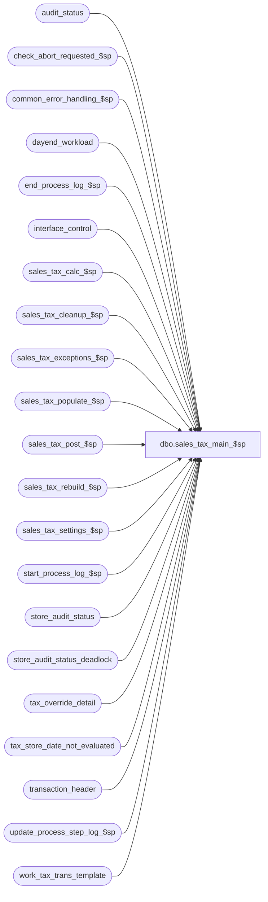

# dbo.sales_tax_main_$sp

**Database:** auditworks_external  
**Server:** bedrockdb01  

## Architecture Diagram



## Table Dependencies

| Referenced Table |
|---|
| audit_status |
| check_abort_requested_$sp |
| common_error_handling_$sp |
| dayend_workload |
| end_process_log_$sp |
| interface_control |
| sales_tax_calc_$sp |
| sales_tax_cleanup_$sp |
| sales_tax_exceptions_$sp |
| sales_tax_populate_$sp |
| sales_tax_post_$sp |
| sales_tax_rebuild_$sp |
| sales_tax_settings_$sp |
| start_process_log_$sp |
| store_audit_status |
| store_audit_status_deadlock |
| tax_override_detail |
| tax_store_date_not_evaluated |
| transaction_header |
| update_process_step_log_$sp |
| work_tax_trans_template |

## Stored Procedure Code

```sql
create proc [dbo].[sales_tax_main_$sp] 
( @process_id				 binary(16),
  @dayend_process_id                     tinyint = NULL,
  @errmsg                                nvarchar(255) OUTPUT,
  @rebuild_flag                          tinyint = 0,
  @excluded_dayend_from_time             int = 0,
  @excluded_dayend_to_time               int = 0
)

AS

/*
PROC NAME: sales_tax_main_$sp
     DESC: Posts accepted sales/returns to sales tax tracking tables.
           Called by day_end_posting_$sp.

  HISTORY:
Date     Name		Def#  Desc
May03,10 Vicci        117571  Support update_timing for Tax having been switched from Dayend to Edit without a clean cutoff.
Sep05,07 Paul        DV-1363  Apply 74673 to SA5
Dec13,04 David       DV-1191  Improve performance by adding hints.
Oct07,04 David       DV-1146  Pass NULL to parameter user_id.
Jul09,04 Maryam      DV-1071  Receive @process_id and pass it to the sub procs.
Jul12.06 Vicci         74673  Add col to #tax_transactions for outer join to header level tax overrides
    (MSQ port by Daphna)      use ANSI STD for outerjoin
Sep18,03 Maryam        13686  Pass two new parameters for excluded dayend time and call check_abort_requested_$sp
                              to check whether abort has been requested either by the system or user. pass
                              @dayend_process_id, @errmsg OUTPUT to sales_tax_rebuild_$sp.
Dec19,02 Phu            5327  Move exception after post to make use of available info
Dec07,02 Phu         1-GCX2X  Move begin tran
Nov04,02 Phu         1-GE7ZT  Correct error: insert null into #store_date in build_subledger_$sp
Aug01,02 Phu         1-E3LUO  Fix error: commit without begin tran in MSSQL
May08,02 Winnie	     1-C2Q5L  Add abort logic to dayend, set @process_start_time.
Apr25,02 Phu         1-C9P5S  Pre audit tax
Apr23,02 Phu         1-CKO55  To set verified flag in issue_list table to yes if auto_verify_dayend_issues is on
Jan31,02 Winnie	     1-ALE95  Tax not being rebuild due to wrong condition when exiting tax_posting_crsr.
Nov30,01 Phu            8931  Progress monitor and error handling
NOV07,01 Daphna         8915  populate #tax_exception_list.tax_category from work_tax_round.tax_category
                              (work_tax_round.override_tax_category no longer populated in 
                              sales_tax_calc_$sp)
Oct03,01 Maryam         8810  Call sales_tax_calc_$sp.
Aug10,01 Maryam         8283  Handle header level attachment for return also fix a bug of double posting
                              layaways.(Introduced in defect 6795). Report discrepancy when the difference
                              is > 0.01 instead of >= 0.01
NOV15,01 Daphna         8956  Retrofit of 8915: Remove redundant insert of override_tax_category
                              to work_tax_round 
                              Insert work_tax_round.tax_category to tax_exception_list                              
Jul13,01 Maryam         8334  convert threshold_amount to float when updating work_tax_detail
                              to prevent error 3624(truncation error).
Jul03,01 Maryam         8164  Handle the new taxability_by_item_group option.	
Jun15,01 Maryam         8088  compare work_tax_detail.combined_tax_rate with
                              tax_rate.below_threshold_combined_rate when it was setting 
                              the tax_category to override for returns when there is threshold_amount.
May14,01 Maryam		7444  Defined a new parameter indicating whether it is called by the DayEnd Rebuild
			      or by the Dayend Tax Posting. Insert to issue list and update auditworks_system_flag
			      and do the rebuild of tax from archived transactions.
May02,01 Maryam         7601  Handle the case of tax_exempt for maritime stores.
May02,01 Danj/Maryam    7626  Changed Drop statement to Truncate for #tax_trans
Apr23,01 Maryam         7590  When interface_applicability is controlled by program, get list of
                              transactions to be posted from transaction_header. Properly insert
                            the tax_category to av_tax_detail.
Mar28,01 Maryam         7489  Fixed the bug which was introduced in defect 6795 where tax_jurisdiction
                              and tax_category was dropped in the join between #tran_prorate and work_tax_round.
Feb14,01 Maryam         7281  Populate table work_tax_exception_jur which is used by build_subledger_$sp.
Feb06,01 Maryam         7301  Add error traps when selecting from interface_applicability and from auditworks_parameter.
Jan15,01 Maryam 	7205  Add tax_strip_flag to av_tax_detail table also update dayend_workload
			      to set tax_strip_flag.  	
Dec18,00 Paul		7119  Change @tax_rounding_method to tinyint for performance
Nov17,00 Maryam         6795  Made the use of interface applicability optional; required only if 
                              the client wants to prevent Merch/fee/tax/expense feed tax Tracking.
                              Make sure of minimum execution when tax_tracking module is turned off.
                              log tax detail if Tax striping or G/L accounts by taxability are used.
                              retain tax information in the case of Translate providing tax override detail
                              record for one tax level, but not for the other level. 
                              implement item tax striping and also prorate tax_amount_collected based on
                              jurisdiction/category and ...
                              NOTE : tax may only be striped on one level per jurisdiction
                           
Sep14,00 Maryam         6648  Properly handle different combined_rate for the same rate code.
Sep04,00 Maryam         6608  Correct the tax_rate lookup to make use of return_detail.return_from_date.
                              Set the rate_changed_flag when either the rate or threshold_amount 
                              associated with the original date is different than the current rate or threshold_amount.  

Jul07,00 Vicci		6510 Correct bug introduced by defect 5088 whereby row count for
				#tax_exception_list gets overlayed with that of #line_prorate
				causing its usage as a condition for the transaction_header 
				tax_override_flag update to fail.
May23,00 Paul		6339  remove outer join to discount_detail in subquery for compatibility
			      with Sybase 11.9.0 . Also improve performance by avoiding
			      recalculation of discount amount whenever possible.
May02,00 Paul		6251  remove unnecessary from clause in update
Apr20,00 Maryam		5088  Prorate Tax_collected to rate_codes in Transaction
                              based on total_collected * (tax_amount_expected/total_expected)
                              or update if there is one rate_code in transaction.
Apr03,00 Maryam		6162  Extracted info about upc_lookup_division.
Mar30,00 Maryam 	6058  build additional work table by transaction_id to 
                               calculate tax rounded to nearest penny by
                               transaction.added ROUND(...) for tax_amount_expected.     
Mar01,00 Phu		5900  Change @@fetch_status > 0 to @@fetch_status <> 0 for MS SQL compatibility
Feb28,00 Louise	 	5983  Added logic to support a below_threshold_combined_rate.
                        	Note : cannot have a tax_on_tax_level OR a tax_on_threshold_excess
                               	  along with a below_threshold_combined_rate
                               	NOT YET SUPPORTED.
13-Aug-99 Vicci de T	5242 Modified exceptions to set rate-code even in override cases;
				modified setting of taxability flag to treat rate-codes with
				  rates of 0% as 'non-taxable'.
02-Jul-99 Vicci de T	4986 modified datatype of @zero_filler_n to match tax-rate
18-Jun-99 Daphna F	4876 add comparison of tran date to effective date range
				  on update of #tax_detail table for tax_on_combined_rate
18-Feb-9 Paul S			last modified
25-Aug-97 David		n/a  author version 1.19  
  
*/

DECLARE
	@applicability_method		tinyint,
	@class_exception_flag		tinyint,
	@cursor_open			tinyint,
	@date_reject_id			tinyint,
	@errno				int,
	@exception_jurisdiction_check	tinyint,
	@item_group_exception_flag      tinyint,
	@include_expense		tinyint,
	@include_pickup			tinyint,
	@lookup_segment_flag            tinyint,
	@log_flag			tinyint,
	@log_tax_detail                 tinyint,
	@log_tax_override		tinyint,
	@message_id			int,
	@object_name			nvarchar(255),
	@operation_name			nvarchar(100),
	@process_log_entry 		tinyint,
	@process_name			nvarchar(100),
	@process_no 			smallint,
	@process_start_time		datetime,
	@process_timestamp 		float,
	@rows				int,
	@sales_date			smalldatetime,
	@sku_exception_flag		tinyint,
	@store_no			int,
	@style_exception_flag		tinyint,
	@tax_default_check		tinyint,
	@tax_jurisdiction		nchar(5),
	@tax_rounding_method		tinyint,
	@tax_strip_flag                 tinyint,
	@trans_count 			int,
	@transaction_count 		int,
	@unapplied_discounts_exist	tinyint,
	@update_timing 			smallint,
	@update_timing_rollout 		smallint,
        @abort_flag			tinyint


SELECT @message_id = 201068,
       @process_name = 'sales_tax_main_$sp',
       @process_no = 22,
       @log_flag = 1,
       @tax_default_check = 0, -- tax verification is not required for post audit tax
       @exception_jurisdiction_check = 0,
       @abort_flag = 0
       
-- Rebuild will be run just in stream  1
IF @rebuild_flag <> 0 AND @dayend_process_id = 1
BEGIN
  EXEC sales_tax_rebuild_$sp @process_id, @errmsg OUTPUT, @excluded_dayend_from_time, @excluded_dayend_to_time
  SELECT @errno = @@error
  IF @errno != 0
  BEGIN
    IF @errmsg IS NULL --
      SELECT @errmsg = 'Failed to execute procedure sales_tax_rebuild_$sp.'
    SELECT @object_name = 'sales_tax_rebuild_$sp',
           @operation_name = 'EXECUTE'
    GOTO error
  END
  RETURN
END

SELECT @process_start_time = getdate()

IF @dayend_process_id IS NULL 
  RETURN

EXEC sales_tax_settings_$sp @process_id, NULL, @applicability_method OUTPUT, @update_timing OUTPUT,
     @class_exception_flag OUTPUT, @sku_exception_flag OUTPUT,
     @style_exception_flag OUTPUT, @item_group_exception_flag OUTPUT,
     @lookup_segment_flag OUTPUT, @include_expense OUTPUT, @include_pickup OUTPUT, 
     @unapplied_discounts_exist OUTPUT, @tax_rounding_method OUTPUT,
     @log_tax_detail OUTPUT, @errmsg OUTPUT, @process_no

SELECT @errno = @@error
IF @errno <> 0
  BEGIN
    SELECT @errmsg = ISNULL(@errmsg, 'Unable to execute stored proc sales_tax_settings_$sp'),
           @object_name = 'sales_tax_settings_$sp',
           @operation_name = 'EXECUTE'
    GOTO error
  END

SELECT transaction_id, store_no, transaction_date, transaction_category,
       log_tax_override, store_tax_jurisdiction,
       tod_tax_jurisdiction, header_override_flag, all_tax_override_flag
  INTO #tax_transactions
  FROM work_tax_trans_template WITH (NOLOCK)

SELECT @errno = @@error
IF @errno != 0
  BEGIN
    SELECT @errmsg = 'Failed to create temp table #tax_transactions.',
	   @object_name = '#tax_transactions',
	   @operation_name = 'CREATE'
    GOTO error
  END

CREATE TABLE #store_status
( store_no int not null,
  sales_date smalldatetime not null,
  date_reject_id tinyint not null,
  tax_jurisdiction nchar(5) not null,
  log_tax_override tinyint null)	

SELECT @errno = @@error
IF @errno != 0
  BEGIN
    SELECT @errmsg = 'Failed to create temp table #store_status.',
	   @object_name = '#store_status',
	   @operation_name = 'CREATE'
    GOTO error
  END

/* take a snapshot of dayend_workload in order to minimize duration of locks */
INSERT #store_status(
           store_no,
           sales_date,
           date_reject_id,
           tax_jurisdiction,
 log_tax_override)
  SELECT
           store_no,
	   sales_date,
	   date_reject_id,
	   tax_jurisdiction,
	   log_tax_override	
      FROM dayend_workload WITH (NOLOCK)
     WHERE dayend_process_id = @dayend_process_id
       AND store_audit_status = 310

    SELECT @rows = @@rowcount,
         @errno = @@error
    IF @errno <> 0
    BEGIN
      SELECT @errmsg = 'Unable to insert into table #store_status',
	     @object_name = '#store_status',
	     @operation_name = 'INSERT'
      GOTO error
    END
    
    IF @rows = 0
      RETURN

SELECT
	@process_log_entry = 0,
	@process_timestamp = 0,
	@transaction_count = 0
	
EXEC start_process_log_$sp @process_no, @process_timestamp OUTPUT,
	@errmsg OUTPUT, @dayend_process_id, @process_start_time

SELECT @errno = @@error
IF @errno <> 0
  BEGIN
	SELECT @object_name = 'start_process_log_$sp',
	       @operation_name = 'EXECUTE'
	IF @errmsg IS NULL 
          SELECT @errmsg = 'Failed to execute start_process_log_$sp.'
	GOTO error
  END

SELECT @process_log_entry = 1

IF @update_timing = 0 -- Tax Tracking module is turned off
BEGIN
    BEGIN TRANSACTION
    
    UPDATE store_audit_status_deadlock
       SET function_no = 18,
           status_date = getdate()

    SELECT @errno = @@error
    IF @errno <> 0
      BEGIN
        SELECT @errmsg = 'Unable to update store_audit_status_deadlock(1).',
	       @object_name = 'store_audit_status_deadlock',
	       @operation_name = 'UPDATE'
        GOTO error
      END

    UPDATE audit_status 
       SET audit_status = 320
      FROM #store_status s WITH (NOLOCK), audit_status a 
     WHERE s.sales_date = a.sales_date
       AND s.store_no = a.store_no
       AND s.date_reject_id = a.date_reject_id
       AND a.audit_status = 310

    SELECT @errno = @@error
    IF @errno <> 0
      BEGIN
        SELECT @errmsg = 'Failed to update audit_status with status 320 (1).',
	       @object_name = 'audit_status',
	       @operation_name = 'UPDATE'
        GOTO error
      END

    UPDATE store_audit_status 
       SET store_audit_status = 320
      FROM #store_status s WITH (NOLOCK), store_audit_status a 
     WHERE s.sales_date = a.sales_date
       AND s.store_no = a.store_no
       AND s.date_reject_id = a.date_reject_id
       AND a.store_audit_status = 310

    SELECT @errno = @@error
    IF @errno <> 0
      BEGIN
        SELECT @errmsg = 'Failed to update store_audit_status with status 320 (1).',
	       @object_name = 'store_audit_status',
	       @operation_name = 'UPDATE'
        GOTO error
      END

    UPDATE dayend_workload
       SET store_audit_status = 320
      FROM #store_status s WITH (NOLOCK), dayend_workload d 
     WHERE dayend_process_id = @dayend_process_id
       AND s.store_no = d.store_no
       AND s.sales_date = d.sales_date
       AND s.date_reject_id = d.date_reject_id
       AND d.store_audit_status = 310

    SELECT @errno = @@error
    IF @errno <> 0
      BEGIN
        SELECT @errmsg = 'Unable to set store_audit_status to 320 in dayend_workload (4).',
	       @object_name = 'dayend_workload',
	       @operation_name = 'UPDATE'
        GOTO error
      END

    EXEC end_process_log_$sp @process_no, @process_timestamp, @transaction_count

    SELECT @errno = @@error
    IF @errno != 0
	BEGIN
	SELECT @errmsg = 'Unable to execute stored procedure end_process_log_$sp',
		@object_name = 'end_process_log_$sp',
		@operation_name = 'EXECUTE'
        GOTO error
    END

    COMMIT TRANSACTION 
    RETURN 
END /* IF @update_timing = 0 */


DECLARE tax_posting_crsr CURSOR FAST_FORWARD
    FOR
 SELECT store_no,
        sales_date,
        date_reject_id,
        tax_jurisdiction,
        log_tax_override
   FROM #store_status
	
OPEN tax_posting_crsr

SELECT @errno = @@error
IF @errno != 0
  BEGIN
    SELECT @errmsg = 'Failed to open cursor tax_posting_crsr.',
	   @object_name = 'tax_posting_crsr',
	   @operation_name = 'OPEN'
    GOTO error
  END

SELECT @cursor_open = 1

WHILE 1=1
BEGIN

  FETCH tax_posting_crsr INTO
	@store_no,
	@sales_date,
	@date_reject_id,
	@tax_jurisdiction,
	@log_tax_override

  IF @@fetch_status <> 0
    BREAK

  EXEC check_abort_requested_$sp @dayend_process_id, @process_id, @process_no,
                        @excluded_dayend_from_time, @excluded_dayend_to_time, @errmsg OUTPUT

  SELECT @errno = @@error
  IF @errno != 0 
    BEGIN
      IF @errmsg IS NULL
        SELECT @errmsg = 'Failed to execute stored procedure check_abort_requested_$sp'
      SELECT @object_name = 'check_abort_requested_$sp',
             @operation_name = 'EXECUTE'
      GOTO error
    END

  IF @update_timing = 6 AND EXISTS (SELECT 1 
  				      FROM tax_store_date_not_evaluated 
  				     WHERE store_no = @store_no 
  				       AND transaction_date = @sales_date) --Pre audit tax not fully rolled out
    SELECT @update_timing_rollout = 3
  ELSE
    SELECT @update_timing_rollout = @update_timing
    
  IF @update_timing_rollout = 6 -- Pre audit tax, build tax_tracking from tax_detail
  BEGIN
    SELECT @trans_count = 0, @tax_strip_flag = 0

    EXEC sales_tax_post_$sp @process_id, NULL, @process_no, @update_timing_rollout,
         @tax_rounding_method, @log_tax_detail, @lookup_segment_flag,
         @store_no, @sales_date, @dayend_process_id, @tax_strip_flag OUTPUT,
         @trans_count OUTPUT, @errmsg OUTPUT

    SELECT @errno = @@error
    IF @errno <> 0
    BEGIN
      SELECT @errmsg = ISNULL(@errmsg, 'Unable to execute stored proc sales_tax_post_$sp'),
             @object_name = 'sales_tax_post_$sp',
             @operation_name = 'EXECUTE'
      GOTO error
    END

    SELECT @transaction_count = @transaction_count + @trans_count

    IF @log_tax_override > 0
    BEGIN
      EXEC sales_tax_exceptions_$sp @process_id, @process_no, @update_timing_rollout, @tax_rounding_method,
           @log_tax_override, @store_no, @sales_date, @errmsg OUTPUT

      SELECT @errno = @@error
      IF @errno <> 0
      BEGIN
        SELECT @errmsg = ISNULL(@errmsg, 'Unable to execute stored proc sales_tax_exceptions_$sp'),
               @object_name = 'sales_tax_exceptions_$sp',
               @operation_name = 'EXECUTE'
        GOTO error
      END
    END -- if @log_tax_override > 0

-- Don't need to call sales_tax_cleanup_$sp here

    GOTO end_of_batch
  END -- if @update_timing_rollout = 6
  ELSE -- post audit tax
  BEGIN
    TRUNCATE TABLE #tax_transactions

    SELECT @errno = @@error
    IF @errno != 0
    BEGIN
      SELECT @errmsg = 'Failed to truncate table #tax_transactions.',
             @object_name = '#tax_transactions',
             @operation_name = 'TRUNCATE'
      GOTO error
    END

    SELECT @tax_strip_flag = 0

/* get list of tax transactions to be posted */

    IF @applicability_method = 0
      INSERT #tax_transactions(
           transaction_id,
           store_no,
           transaction_date,
           transaction_category,
           log_tax_override,
           store_tax_jurisdiction,
           tod_tax_jurisdiction,
           header_override_flag,
           all_tax_override_flag)      
      SELECT th.transaction_id,
           th.store_no,
           th.transaction_date,
           th.transaction_category,
           @log_tax_override,
           @tax_jurisdiction,
           MAX(tod.exception_tax_jurisdiction), 
           1 - SIGN(MIN(tod.line_id)),
           1 - SIGN(MIN(tod.tax_level))
      FROM transaction_header th WITH (NOLOCK)
      INNER JOIN interface_control ic WITH (NOLOCK)
            ON ic.interface_id = 12 
            AND ic.interface_status_flag = 3    
            AND th.transaction_id = ic.transaction_id
      LEFT OUTER JOIN  tax_override_detail tod WITH (NOLOCK)
            ON th.transaction_id = tod.transaction_id
            AND tod.line_id = 0
     WHERE store_no = @store_no
      AND transaction_date = @sales_date
      AND date_reject_id = @date_reject_id
      AND transaction_void_flag IN (0,8)        
      GROUP BY th.transaction_id, th.store_no, th.transaction_date, th.transaction_category
    ELSE 
      INSERT #tax_transactions(
           transaction_id,
           store_no,
           transaction_date,
           transaction_category,
           log_tax_override,
           store_tax_jurisdiction,
           tod_tax_jurisdiction,
           header_override_flag,
           all_tax_override_flag)
      SELECT th.transaction_id,
           th.store_no,
           th.transaction_date,
           th.transaction_category,
           @log_tax_override,
           @tax_jurisdiction,
         MAX(tod.exception_tax_jurisdiction),
           1 - SIGN(MIN(tod.line_id)),
           1 - SIGN(MIN(tod.tax_level))
      FROM transaction_header th WITH (NOLOCK)
      LEFT OUTER JOIN  tax_override_detail tod WITH (NOLOCK)
           ON th.transaction_id = tod.transaction_id
           AND tod.line_id = 0
      WHERE store_no = @store_no
      AND transaction_date = @sales_date
      AND date_reject_id = @date_reject_id    
      AND transaction_void_flag IN (0,8)
      GROUP BY th.transaction_id, th.store_no, th.transaction_date, th.transaction_category

    SELECT @errno = @@error,
           @rows = @@rowcount
    IF @errno <> 0
    BEGIN
      SELECT @errmsg = 'Unabled to insert into table #tax_transactions.',
             @object_name = '#tax_transactions',
             @operation_name = 'INSERT'
      GOTO error
    END
  
    IF @rows > 0
    BEGIN
      EXEC sales_tax_populate_$sp @process_id, NULL, @process_no, @applicability_method,
           @class_exception_flag, @sku_exception_flag, @style_exception_flag,
           @item_group_exception_flag, @include_expense, @include_pickup,
           @unapplied_discounts_exist, @tax_default_check, @exception_jurisdiction_check,
           @errmsg OUTPUT

      SELECT @errno = @@error
      IF @errno <> 0
      BEGIN
        SELECT @errmsg = ISNULL(@errmsg, 'Unable to execute stored proc sales_tax_populate_$sp'),
               @object_name = 'sales_tax_populate_$sp',
               @operation_name = 'EXECUTE'
        GOTO error
      END

      EXEC sales_tax_calc_$sp @process_id, NULL, @process_no, @class_exception_flag,
           @sku_exception_flag, @style_exception_flag, @item_group_exception_flag,
           @tax_rounding_method, @log_flag, @dayend_process_id, @errmsg OUTPUT

      SELECT @errno = @@error
      IF @errno <> 0
      BEGIN
        SELECT @errmsg = ISNULL(@errmsg, 'Unable to execute stored proc sales_tax_calc_$sp'),
               @object_name = 'sales_tax_calc_$sp',
               @operation_name = 'EXECUTE'
        GOTO error
      END

      SELECT @trans_count = 0, @tax_strip_flag = 0

      EXEC sales_tax_post_$sp @process_id, NULL, @process_no, @update_timing_rollout,
           @tax_rounding_method, @log_tax_detail, @lookup_segment_flag,
           @store_no, @sales_date, @dayend_process_id, @tax_strip_flag OUTPUT,
           @trans_count OUTPUT, @errmsg OUTPUT

      SELECT @errno = @@error
      IF @errno <> 0
      BEGIN
        SELECT @errmsg = ISNULL(@errmsg, 'Unable to execute stored proc sales_tax_post_$sp'),
               @object_name = 'sales_tax_post_$sp',
               @operation_name = 'EXECUTE'
        GOTO error
      END
      SELECT @transaction_count = @transaction_count + @trans_count

      IF @log_tax_override > 0
      BEGIN
        EXEC sales_tax_exceptions_$sp @process_id, @process_no, @update_timing_rollout, @tax_rounding_method,
             @log_tax_override, @store_no, @sales_date, @errmsg OUTPUT

        SELECT @errno = @@error
        IF @errno <> 0
        BEGIN
          SELECT @errmsg = ISNULL(@errmsg, 'Unable to execute stored proc sales_tax_exceptions_$sp'),
              @object_name = 'sales_tax_exceptions_$sp',
                 @operation_name = 'EXECUTE'
          GOTO error
        END
      END -- if @log_tax_override > 0

      EXEC sales_tax_cleanup_$sp @process_id, NULL, @process_no, @tax_rounding_method,
           @dayend_process_id, @errmsg OUTPUT

      SELECT @errno = @@error
      IF @errno <> 0
      BEGIN
        SELECT @errmsg = ISNULL(@errmsg, 'Unable to execute stored proc sales_tax_cleanup_$sp'),
               @object_name = 'sales_tax_cleanup_$sp',
               @operation_name = 'EXECUTE'
        GOTO error
      END

    END -- if @rows > 0
  END -- else of if @update_timing_rollout = 6

end_of_batch:

  BEGIN TRAN
  UPDATE store_audit_status_deadlock
  SET function_no = 18,
      status_date = getdate()

  SELECT @errno = @@error
  IF @errno <> 0
  BEGIN
    SELECT @errmsg = 'Unable to update store_audit_status_deadlock.',
	   @object_name = 'store_audit_status_deadlock',
	   @operation_name = 'UPDATE'
    GOTO error
  END

  UPDATE audit_status 
  SET audit_status = 320
  WHERE sales_date = @sales_date
  AND store_no = @store_no
  AND date_reject_id = @date_reject_id
  AND audit_status = 310

  SELECT @errno = @@error
  IF @errno <> 0
  BEGIN
    SELECT @errmsg = 'Failed to update audit_status with status 320.',
	   @object_name = 'audit_status',
	   @operation_name = 'UPDATE'
    GOTO error
  END

  UPDATE store_audit_status 
  SET store_audit_status = 320
  WHERE sales_date = @sales_date
  AND store_no = @store_no
  AND date_reject_id = @date_reject_id
  AND store_audit_status = 310

  SELECT @errno = @@error
  IF @errno <> 0
  BEGIN
    SELECT @errmsg = 'Failed to update store_audit_status with status 320.',
	   @object_name = 'store_audit_status',
	   @operation_name = 'UPDATE'
    GOTO error
  END

  UPDATE dayend_workload
  SET store_audit_status = 320,
       tax_strip_flag = SIGN(tax_strip_flag + @tax_strip_flag)
  WHERE dayend_process_id = @dayend_process_id
  AND store_no = @store_no
  AND sales_date = @sales_date
  AND date_reject_id = @date_reject_id
  AND store_audit_status = 310

  SELECT @errno = @@error
  IF @errno <> 0
  BEGIN
    SELECT @errmsg = 'Unable to set store_audit_status to 320 in dayend_workload.',
	   @object_name = 'dayend_workload',
	   @operation_name = 'UPDATE'
    GOTO error
  END

  COMMIT TRANSACTION

  EXEC update_process_step_log_$sp 18, @dayend_process_id, 36, NULL, NULL, NULL 
  SELECT @errno = @@error
  IF @errno != 0
    BEGIN
     SELECT @errmsg = 'Failed to execute stored proc update_process_step_log_$sp for step 36',
	    @object_name = 'update_process_step_log_$sp',
	    @operation_name = 'EXECUTE'
     GOTO error
    END

END /* While 1=1 */

CLOSE tax_posting_crsr
DEALLOCATE tax_posting_crsr

SELECT @cursor_open = 0 -- all cursors closed 

IF @process_log_entry = 1
BEGIN
  EXEC end_process_log_$sp @process_no, @process_timestamp, @transaction_count
  SELECT @errno = @@error
  IF @errno != 0
    BEGIN
      SELECT @errmsg = 'Unable to execute stored procedure end_process_log_$sp',
             @object_name = 'end_process_log_$sp',
	     @operation_name = 'EXECUTE'
      GOTO error
  END
END


RETURN


error:

	IF @cursor_open = 1
	  BEGIN
	   CLOSE tax_posting_crsr
	   DEALLOCATE tax_posting_crsr
	  END

	EXEC common_error_handling_$sp @process_no, @errno, @errmsg, @abort_flag, @message_id, 
	@process_name, @object_name, @operation_name, @log_flag, @dayend_process_id, @process_log_entry,
	@process_timestamp, @transaction_count 
	RETURN
```

