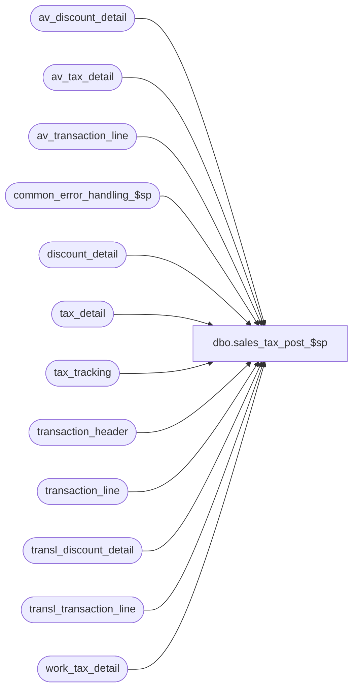

# dbo.sales_tax_post_$sp

**Database:** auditworks_external  
**Server:** bedrockdb01  

## Architecture Diagram



## Table Dependencies

| Referenced Table |
|---|
| av_discount_detail |
| av_tax_detail |
| av_transaction_line |
| common_error_handling_$sp |
| discount_detail |
| tax_detail |
| tax_tracking |
| transaction_header |
| transaction_line |
| transl_discount_detail |
| transl_transaction_line |
| work_tax_detail |

## Stored Procedure Code

```sql
create proc dbo.sales_tax_post_$sp ( @process_id			binary(16),
  @user_id                      int,
  @function_no			smallint,
  @update_timing		smallint,
  @tax_rounding_method		tinyint,
  @log_tax_detail		tinyint,
  @lookup_segment_flag		tinyint,
  @store_no			int = null, -- required only when rebuild or pre audit from dayend
  @transaction_date		smalldatetime = null, -- required only when rebuild or pre audit from dayend
  @stream_no			tinyint = 1,
  @tax_strip_flag		tinyint OUTPUT,
  @trans_count			int OUTPUT,
  @errmsg			nvarchar(255) OUTPUT
)

AS

/*
PROC NAME: sales_tax_post_$sp  - 5.0 SA version (5.1 version has transaction_date in av_tax_detail)
     DESC: Post sales tax info to tax_detail, tax_tracking, av_tax_detail tables,
           depending on the value of @tax_post_type which is determined by
           @update_timing and @function_no:

           Rounding by line:
             @tax_post_type = 1:     post to tax_detail from work_tax_detail
             @tax_post_type = 1, 4:  post to tax_detail from work_tax_detail
             @tax_post_type = 2:     post to tax_tracking from tax_detail
             @tax_post_type = 3, 4:  post to tax_tracking from work_tax_detail
                            = 3      post to av_tax_detail from work_tax_detail (if log_tax_detail is on)

           Rounding by transaction:
             @tax_post_type = 11, 14: post to tax_detail from work_tax_detail
             @tax_post_type = 13, 14: post to tax_tracking from work_tax_detail
                            = 13      post to av_tax_detail from work_tax_detail (if log_tax_detail is on)

           Called by sales_tax_main_$sp, sales_tax_rebuild_$sp, pre_audit_tax_$sp, edit_pre_audit_tax_$sp

           For SA5.0 only, a SA_PART version of this proc must also be updated.
           For SA5.1 and higher, this version makes the SA_PART version obsolete.

Please ensure that the proc script contains the following at the top in order to support scaleout:
SET ANSI_NULLS ON
SET ANSI_WARNINGS ON

  HISTORY:
Date     Name		Def#  Desc
--Watch out:  remember transaction_date for av_tax_detail for S/A 5.1+
Mar31,14 Vicci         61711  Correct calculation of discount's share of tax to include ALL tax levels stripped (discount's share is disc over merch net of both expensed and applied discounts and all levels of tax to be stripped)
Feb27,14 Vicci         61711  Log share of merch/fee tax detail for tax stripping attributable to discounts under applied by line ID 
                              to support tax stripping from correct G/L account (split between merch and disc account instead of all under merch).
Oct28,13 Vicci        147679  Comparison of amount to threshold must take units into account.
Mar21,11 Paul         121025  Create SA5.1 version that inserts transaction_date column in av_tax_detail. SA_PART version now obsolete
Dec14,10 Vicci        120654  Log fulfillment_store_no, below_threshhold_flag, tax_item_group_id, originating_date to tax_detail
Jul21,09 Vicci        109078  Only log tax-tracking for rows with track_tax = 1 (others are order creations where
                              tax is calculated but is not to be posted because the fulfillment is being posted).
Feb13,09 Vicci	       75984  Populate tax_detail/av_tax_detail even when item is 100% discounted.
Oct12,07 Phu         DV-1366  Apply 93385 to SA5. Post to tax_tracking whether the log_tax_detail is on or off.
Oct04,07 Phu           93464  Apply 93250 to SA5. Facilitate subledger posting when GL account is setup by tax jurisdiction.
Jan22,07 Phu         DV-1354  Apply 81550 to SA5. Correct 79090 and adjust penny diff for rounding by trans.
Dec05,06 Paul        DV-1347  Apply 77700 to SA5
Nov08,06 Phu         DV-1350  Apply 79090 to SA5. Allow exchange for different/same tax jurisdictions.
Oct25,06 Phu           77931  Fix outer join for SQL 2005 Mode 90.
Dec14,04 David       DV-1191  Improve performance by adding hints.
Sep15,04 IanK        DV-1146  Use user_id
Apr28,04 Maryam      DV-1071  Changed @process_id from tinyint to binary(16) and pass to the common_error_handling_$sp.
Nov08,06 Phu           79090  Undo 1-3FXR81. Allow exchange for different/same tax jurisdictions.
Nov03,06 Daphna     1-3FXR81  Correct special case insert to work_tax_detail_round for when tax_collected <> 0
                              and use tax_line_id for line_id
Sep28.06 Daphna        77700  Do not insert to av_tax_detail when logging parameter is off
Oct06,03 David   15968/16023  Handle case when tax line has tax collected but the detail lines are missing or belong to another tax level.
Apr23,03 David         7320  Handle even exchange trnx with no return detail when rounding by transaction
Apr07,03 Phu            7461  Correct wrong tax collected/expected due to rounding from tax_detail to tax_tracking
Feb10,03 Phu            6065  Correct error: insert null into #store_date in build_subledger_$sp
Feb04,03 Phu            5933  Exclude tax paid/expenses from tax collected
Dec19,02 Phu            5327  Post ordered trans to tax_detail, prorate tax collected to nontaxable if required
Dec10,02 Phu            5283  Do not create entry in tax_detail if taxable and nontaxable amounts are zeros
Dec07,02 Phu         1-GCX2X  Calculate taxes where returned and sold items are in one tran or when modifying archived trans
Dec03,02 Phu         1-FULQT  Calculate tax amount based on taxable amounts if tax rate is not zero or nontaxable amount if tax rate is zero
Nov28,02 Phu         1-GYY7Y  Fix duplicate key inserted in tax_detail
Aug01,02 Phu         1-E3LUO  Allow one tax_on_tax_level having different tax_on_combined_rate in one transaction
Apr25,02 Phu         1-C9P5S  Pre Audit tax

*/

DECLARE
	@errno				int,
	@message_id			int,
	@min_store_no			int,
	@object_name			nvarchar(255),
	@operation_name			nvarchar(100),
	@tax_post_type			smallint,
	@process_name			nvarchar(100),
	@rows				int

SELECT @message_id = 201068,
       @process_name = 'sales_tax_post_$sp'

IF @tax_rounding_method = 2 -- rounding at line level
BEGIN
  IF @update_timing = 6 -- pre audit tax
    SELECT @tax_post_type = (2 * (1 - SIGN(ABS(@function_no - 22)))) +
                            (3 * (1 - SIGN(ABS(@function_no - 161)))) +
                            (1 * (1 - (SIGN(ABS(@function_no - 37))) * SIGN(ABS(@function_no - 38))))
  ELSE
    SELECT @tax_post_type = (3 * (1 - SIGN(ABS(@function_no - 161)))) +
                            (4 * (1 - SIGN(ABS(@function_no - 22))))
END -- if @tax_rounding_method = 2
ELSE
BEGIN -- rounding at transaction_level
  IF @update_timing = 6 -- pre audit tax
    SELECT @tax_post_type = (2 * (1 - SIGN(ABS(@function_no - 22)))) +
                            (13 * (1 - SIGN(ABS(@function_no - 161)))) +
                            (11 * (1 - (SIGN(ABS(@function_no - 37))) * SIGN(ABS(@function_no - 38))))
  ELSE
    SELECT @tax_post_type = (13 * (1 - SIGN(ABS(@function_no - 161)))) +
                            (14 * (1 - SIGN(ABS(@function_no - 22))))
END -- else of if @tax_rounding_method = 2

IF @tax_post_type IN (1, 4)
BEGIN
  DELETE tax_detail
    FROM work_tax_detail wt WITH (NOLOCK), tax_detail td
   WHERE wt.process_id = @process_id
     AND wt.transaction_id = td.transaction_id
  SELECT @errno = @@error
  IF @errno <> 0
  BEGIN
    SELECT @errmsg = 'Unable to delete tax_detail from work_tax_detail.',
           @object_name = 'tax_detail',
           @operation_name = 'DELETE'
    GOTO error
  END

  INSERT INTO tax_detail (
        transaction_id,
        line_id,
        tax_level,
        tax_jurisdiction,
        tax_category,
        tax_rate_code,
        taxable_amount,
        tax_amount,
        combined_rate,
        nontaxable_amount,
        tax_amount_expected,
        tax_on_tax_level,
        tax_on_combined_rate,
        line_object_type,
 tax_strip_flag,
        gl_effect,
        max_applied_by_line_id,
        track_tax,
        tax_item_group_id,
        originating_date,
        fulfillment_store_no,  --store from which transfer of ownership passed to client
        above_threshold_flag )
  SELECT
        transaction_id,
        line_id,
        tax_level,
        tax_jurisdiction,
        tax_category,
        tax_rate_code,
        taxable_fee_amount + taxable_merchandise_amount + taxable_expense_amount,
        tax_amount_collected + tax_amount_paid,
        combined_tax_rate,
        nontaxable_merchandise_amount + nontaxable_fee_amount,
        tax_amount_expected,
        tax_on_tax_level,
        tax_on_combined_rate,
        line_object_type,
        item_tax_strip_flag,
        gl_effect,
        max_applied_by_line_id,
        track_tax,
        tax_item_group_id,
        COALESCE(return_from_date, transaction_date), 
        fulfillment_store_no,  --store from which transfer of ownership passed to client
        CASE WHEN ABS(amount/units) > threshold_amount THEN 1 ELSE 0 END above_threshold_flag
   FROM work_tax_detail WITH (NOLOCK)
  WHERE process_id = @process_id
   /* Handle the case where there is a tax collected/refunded only in a transaction (i.e. no taxable/nontaxable items) */
  AND ((taxable_fee_amount + taxable_merchandise_amount + taxable_expense_amount +
        nontaxable_merchandise_amount + nontaxable_fee_amount + tax_amount_collected + tax_amount_paid <> 0)
       OR
       (amount = 0 and line_object_type in (1,2)))

  SELECT @errno = @@error
  IF @errno <> 0
  BEGIN
    SELECT @errmsg = 'Unable to insert rows into tax_detail table from work_tax_detail for @tax_post_type IN (1, 4).',
           @object_name = 'tax_detail',
           @operation_name = 'INSERT'
    GOTO error
  END

  --61711 Add entries for share of tax stripped attributable to discounts
  --      Note:  taxable/non-taxable amounts not logged quite right in case of threshold or tax=on-tax stripping, 
  --             Although these entries don't got to tax tracking, they are just to support Subledger posting to diff account for merch vs disc, subledger posting looks at taxable vs non-taxable amounts
  IF @function_no  = 38  --Edit pre-audit tax
  BEGIN
    INSERT INTO tax_detail (
           transaction_id,
           line_id,
           tax_level,
           tax_jurisdiction,
           tax_category,
           tax_rate_code,
           taxable_amount,
           tax_amount,
           combined_rate,
           nontaxable_amount,
           tax_amount_expected,
           tax_on_tax_level,
           tax_on_combined_rate,
           line_object_type,
           tax_strip_flag,
           gl_effect,
           max_applied_by_line_id,  --applied by tax line
           track_tax,
           tax_item_group_id,
           originating_date,
           fulfillment_store_no,  --store from which transfer of ownership passed to client
           above_threshold_flag,
           applied_by_line_id )  ----applied by disc line
    SELECT
           w.transaction_id,
           w.line_id,
           w.tax_level,
           w.tax_jurisdiction,
           w.tax_category,
           w.tax_rate_code,
           --Note, taxable/non-taxable breakout does not support tax stripping based on threshold amount
           (ABS(d.pos_discount_amount-d.pos_discount_amount_adj) * d.discount_amount_sign) 
                        - ROUND(((ABS(d.pos_discount_amount-d.pos_discount_amount_adj) * d.discount_amount_sign) / (w.taxable_merchandise_amount + w.taxable_fee_amount + w.taxable_expense_amount + w.nontaxable_merchandise_amount + w.nontaxable_fee_amount 
                                                          + (SELECT SUM(wt.tax_amount_expected) FROM work_tax_detail wt 
                                                              WHERE wt.item_tax_strip_flag = 1 AND w.process_id = wt.process_id AND w.transaction_id = wt.transaction_id AND w.line_id = wt.line_id))) 
                             * (w.tax_amount_expected), 2), --taxable_amount = disc amt - tax stripped
           ROUND(((ABS(d.pos_discount_amount-d.pos_discount_amount_adj) * d.discount_amount_sign) / (w.taxable_merchandise_amount + w.taxable_fee_amount + w.taxable_expense_amount + w.nontaxable_merchandise_amount + w.nontaxable_fee_amount 
                                                          + (SELECT SUM(wt.tax_amount_expected) FROM work_tax_detail wt 
                                                              WHERE wt.item_tax_strip_flag = 1 AND w.process_id = wt.process_id AND w.transaction_id = wt.transaction_id AND w.line_id = wt.line_id))) 
                  * (w.tax_amount_collected + tax_amount_paid), 2),  --tax_amount
      w.combined_tax_rate,
           0,  --nontaxable_amount
           ROUND(((ABS(d.pos_discount_amount-d.pos_discount_amount_adj) * d.discount_amount_sign) / (w.taxable_merchandise_amount + w.taxable_fee_amount + w.taxable_expense_amount + w.nontaxable_merchandise_amount + w.nontaxable_fee_amount 
                                                          + (SELECT SUM(wt.tax_amount_expected) FROM work_tax_detail wt 
                                                              WHERE wt.item_tax_strip_flag = 1 AND w.process_id = wt.process_id AND w.transaction_id = wt.transaction_id AND w.line_id = wt.line_id))) 
                  * (w.tax_amount_expected), 2),  --tax_amount_expected
           w.tax_on_tax_level,
           w.tax_on_combined_rate,
           w.line_object_type,
           w.item_tax_strip_flag,
           w.gl_effect,
           w.max_applied_by_line_id,
           w.track_tax,
           w.tax_item_group_id,
           COALESCE(w.return_from_date, w.transaction_date), 
           w.fulfillment_store_no,  --store from which transfer of ownership passed to client
           CASE WHEN ABS(w.amount/w.units) > w.threshold_amount THEN 1 ELSE 0 END above_threshold_flag,
           d.applied_by_line_id 
     FROM work_tax_detail w WITH (NOLOCK)
           INNER JOIN transl_discount_detail d WITH (NOLOCK)
              ON w.transaction_id = d.transaction_id
             AND w.line_id = d.line_id
           INNER JOIN transl_transaction_line dl WITH (NOLOCK)
              ON d.transaction_id = dl.transaction_id
             AND d.applied_by_line_id = dl.line_id
             AND dl.line_void_flag = 0
    WHERE w.process_id = @process_id
      AND w.item_tax_strip_flag = 1
      AND w.tax_amount_expected <> 0
    SELECT @errno = @@error
    IF @errno <> 0
    BEGIN
      SELECT @errmsg = 'Unable to insert rows into tax_detail table from work_tax_detail for Edit tax stripping off discounts for @tax_post_type IN (1, 4).',
             @object_name = 'tax_detail',
             @operation_name = 'INSERT'
      GOTO error
    END  
  END  --IF @function_no = 38
  ELSE 
  BEGIN
    INSERT INTO tax_detail (
           transaction_id,
           line_id,
           tax_level,
           tax_jurisdiction,
           tax_category,
           tax_rate_code,
           taxable_amount,
           tax_amount,
           combined_rate,
           nontaxable_amount,
           tax_amount_expected,
           tax_on_tax_level,
           tax_on_combined_rate,
           line_object_type,
           tax_strip_flag,
           gl_effect,
           max_applied_by_line_id,  --applied by tax line
           track_tax,
           tax_item_group_id,
           originating_date,
           fulfillment_store_no,  --store from which transfer of ownership passed to client
           above_threshold_flag,
           applied_by_line_id )  ----applied by disc line
    SELECT
           w.transaction_id,
           w.line_id,
           w.tax_level,
           w.tax_jurisdiction,
           w.tax_category,
           w.tax_rate_code,
           --Note, taxable/non-taxable breakout does not support tax stripping based on threshold amount
           d.pos_discount_amount 
                        - ROUND((d.pos_discount_amount / (w.taxable_merchandise_amount + w.taxable_fee_amount + w.taxable_expense_amount + w.nontaxable_merchandise_amount + w.nontaxable_fee_amount 
                                                          + (SELECT SUM(wt.tax_amount_expected) FROM work_tax_detail wt 
                                                              WHERE wt.item_tax_strip_flag = 1 AND w.process_id = wt.process_id AND w.transaction_id = wt.transaction_id AND w.line_id = wt.line_id))) 
                             * (w.tax_amount_expected), 2), --taxable_amount = disc amt - tax stripped
           ROUND((d.pos_discount_amount / (w.taxable_merchandise_amount + w.taxable_fee_amount + w.taxable_expense_amount + w.nontaxable_merchandise_amount + w.nontaxable_fee_amount 
                                                          + (SELECT SUM(wt.tax_amount_expected) FROM work_tax_detail wt 
                                                              WHERE wt.item_tax_strip_flag = 1 AND w.process_id = wt.process_id AND w.transaction_id = wt.transaction_id AND w.line_id = wt.line_id))) 
                  * (w.tax_amount_collected + tax_amount_paid), 2),  --tax_amount  discount share is disc over merch net of disc and all levels of tax to be stripped
           w.combined_tax_rate,
           0,  --nontaxable_amount
           ROUND((d.pos_discount_amount / (w.taxable_merchandise_amount + w.taxable_fee_amount + w.taxable_expense_amount + w.nontaxable_merchandise_amount + w.nontaxable_fee_amount 
                                                          + (SELECT SUM(wt.tax_amount_expected) FROM work_tax_detail wt 
                                                              WHERE wt.item_tax_strip_flag = 1 AND w.process_id = wt.process_id AND w.transaction_id = wt.transaction_id AND w.line_id = wt.line_id))) 
                  * (w.tax_amount_expected), 2),  --tax_amount_expected
           w.tax_on_tax_level,
           w.tax_on_combined_rate,
           w.line_object_type,
           w.item_tax_strip_flag,
           w.gl_effect,
           w.max_applied_by_line_id,
           w.track_tax,
           w.tax_item_group_id,
           COALESCE(w.return_from_date, w.transaction_date), 
           w.fulfillment_store_no,  --store from which transfer of ownership passed to client
           CASE WHEN ABS(w.amount/w.units) > w.threshold_amount THEN 1 ELSE 0 END above_threshold_flag,
           d.applied_by_line_id 
     FROM work_tax_detail w WITH (NOLOCK)
           INNER JOIN discount_detail d WITH (NOLOCK)
              ON w.transaction_id = d.transaction_id
             AND w.line_id = d.line_id
           INNER JOIN transaction_line dl WITH (NOLOCK)
              ON d.transaction_id = dl.transaction_id
             AND d.applied_by_line_id = dl.line_id
             AND dl.line_void_flag = 0
    WHERE w.process_id = @process_id
      AND w.item_tax_strip_flag = 1
      AND w.tax_amount_expected <> 0
    SELECT @errno = @@error
    IF @errno <> 0
    BEGIN
      SELECT @errmsg = 'Unable to insert rows into tax_detail table from work_tax_detail for tax stripping off discounts for @tax_post_type IN (1, 4).',
             @object_name = 'tax_detail',
             @operation_name = 'INSERT'
      GOTO error
    END
  END  --ELSE of IF @function_no = 38
END -- if @tax_post_type IN (1, 4)

IF @tax_post_type IN (2, 3, 4, 13, 14)
BEGIN
  SELECT @min_store_no = MIN(store_no)
  FROM tax_tracking WITH (NOLOCK)
  WHERE store_no = @store_no
  AND transaction_date = @transaction_date

  SELECT @errno = @@error
  IF @errno <> 0
  BEGIN
    SELECT @errmsg = 'Unable to select min(store_no) from tax_tracking table.',
           @object_name = 'tax_tracking',
           @operation_name = 'SELECT'
    GOTO error
  END

  IF @min_store_no IS NOT NULL --
  BEGIN
 DELETE FROM tax_tracking
    WHERE store_no = @store_no
    AND transaction_date = @transaction_date

    SELECT @errno = @@error
    IF @errno <> 0
    BEGIN
      SELECT @errmsg = 'Unable to delete from tax_tracking table.',
             @object_name = 'tax_tracking',
             @operation_name = 'DELETE'
      GOTO error
    END
  END
END -- if @tax_post_type IN (2, 3, 4, 13, 14)

IF @tax_post_type = 2
BEGIN
  IF @tax_rounding_method = 1 -- rounding at transaction level
  BEGIN
    INSERT tax_tracking (
        tax_level,
        store_no,
        tax_category,
        tax_jurisdiction,
        tax_rate_code,
        combined_rate,
        tax_on_tax_level,
        tax_on_combined_rate,
        transaction_date,
        taxable_merchandise_amount,
        taxable_fee_amount,
        nontaxable_merchandise_amount,
        nontaxable_fee_amount,
        tax_amount_collected,
        tax_amount_expected,
        taxable_expense_amount,
        tax_amount_paid )
    SELECT
        tax_level,
        @store_no,
        tax_category,
        tax_jurisdiction,
        tax_rate_code,
        combined_rate,
        tax_on_tax_level,
        tax_on_combined_rate,
        @transaction_date,
        ROUND(SUM (taxable_amount * gl_effect * (1 - (SIGN(ABS(line_object_type - 1))))), 2),
        ROUND(SUM (taxable_amount * gl_effect * (1 - (SIGN(ABS(line_object_type - 2))))), 2),
        ROUND(SUM (nontaxable_amount * gl_effect * (1 - (SIGN(ABS(line_object_type - 1))))), 2),
        ROUND(SUM (nontaxable_amount * gl_effect * (1 - (SIGN(ABS(line_object_type - 2))))), 2),
        ROUND(SUM (tax_amount * gl_effect * (SIGN(ABS(line_object_type - 7)))), 2),
        ROUND(SUM (tax_amount_expected * gl_effect), 2),
        ROUND(SUM (taxable_amount * gl_effect * (1 - (SIGN(ABS(line_object_type - 7))))), 2),
        ROUND(SUM (tax_amount * gl_effect * (1 - (SIGN(ABS(line_object_type - 7))))), 2)
    FROM tax_detail d WITH (NOLOCK), transaction_header h WITH (NOLOCK)
    WHERE h.store_no = @store_no
    AND h.transaction_date = @transaction_date
    AND h.transaction_void_flag IN (0,8)
    AND h.date_reject_id = 0
    AND h.transaction_id = d.transaction_id
    AND d.track_tax = 1 
    AND d.applied_by_line_id IS NULL  --61711
    GROUP BY
        tax_level,
        tax_category,
        tax_jurisdiction,
        tax_rate_code,
     combined_rate,
        tax_on_tax_level,
        tax_on_combined_rate
  END
  ELSE  -- rounding at line level
  BEGIN
    INSERT tax_tracking (
        tax_level,
        store_no,
        tax_category,
        tax_jurisdiction,
        tax_rate_code,
        combined_rate,
        tax_on_tax_level,
        tax_on_combined_rate,
        transaction_date,
        taxable_merchandise_amount,
        taxable_fee_amount,
        nontaxable_merchandise_amount,
        nontaxable_fee_amount,
        tax_amount_collected,
        tax_amount_expected,
        taxable_expense_amount,
        tax_amount_paid )
    SELECT
        tax_level,
        @store_no,
        tax_category,
        tax_jurisdiction,
        tax_rate_code,
        combined_rate,
        tax_on_tax_level,
        tax_on_combined_rate,
        @transaction_date,
        SUM (ROUND(taxable_amount * gl_effect * (1 - (SIGN(ABS(line_object_type - 1)))), 2)),
        SUM (ROUND(taxable_amount * gl_effect * (1 - (SIGN(ABS(line_object_type - 2)))), 2)),
        SUM (ROUND(nontaxable_amount * gl_effect * (1 - (SIGN(ABS(line_object_type - 1)))), 2)),
        SUM (ROUND(nontaxable_amount * gl_effect * (1 - (SIGN(ABS(line_object_type - 2)))), 2)),
        SUM (ROUND(tax_amount * gl_effect * (SIGN(ABS(line_object_type - 7))), 2)),
        SUM (ROUND(tax_amount_expected * gl_effect, 2)),
        SUM (ROUND(taxable_amount * gl_effect * (1 - (SIGN(ABS(line_object_type - 7)))), 2)),
        SUM (ROUND(tax_amount * gl_effect * (1 - (SIGN(ABS(line_object_type - 7)))), 2))
    FROM tax_detail d WITH (NOLOCK), transaction_header h WITH (NOLOCK)
    WHERE h.store_no = @store_no
    AND h.transaction_date = @transaction_date
    AND h.transaction_void_flag IN (0,8)
    AND h.date_reject_id = 0
    AND h.transaction_id = d.transaction_id
    AND d.track_tax = 1 
    AND d.applied_by_line_id IS NULL  --61711
    GROUP BY
        tax_level,
        tax_category,
        tax_jurisdiction,
        tax_rate_code,
        combined_rate,
        tax_on_tax_level,
        tax_on_combined_rate
  END

  SELECT @errno = @@error, @trans_count = @@rowcount
  IF @errno <> 0
  BEGIN
    SELECT @errmsg = 'Unable to insert rows into tax_tracking table from tax_detail, transaction_header.',
           @object_name = 'tax_tracking',
           @operation_name = 'INSERT'
    GOTO error
  END

  SELECT @tax_strip_flag = SIGN(ISNULL(MAX(d.tax_strip_flag), 0))
  FROM tax_detail d WITH (NOLOCK), transaction_header h WITH (NOLOCK)
  WHERE h.store_no = @store_no
  AND h.transaction_date = @transaction_date
  AND h.transaction_void_flag IN (0,8)
  AND h.date_reject_id = 0
  AND h.transaction_id = d.transaction_id

  SELECT @errno = @@error
  IF @errno <> 0
  BEGIN
    SELECT @errmsg = 'Unable to select tax_strip_flag from tax_detail.',
           @object_name = 'tax_detail',
           @operation_name = 'SELECT'
    GOTO error
  END

END -- if i_tax_post_type = 2

IF @tax_post_type IN (3, 13)
BEGIN
  DELETE av_tax_detail
  FROM av_tax_detail t, work_tax_detail wt WITH (NOLOCK)
  WHERE wt.process_id = @process_id
  AND wt.transaction_id = t.av_transaction_id

  SELECT @errno = @@error
  IF @errno <> 0
  BEGIN
    SELECT @errmsg = 'Unable to delete av_tax_detail table.',
           @object_name = 'av_tax_detail',
           @operation_name = 'DELETE'
    GOTO error
  END

END -- if @tax_post_type IN (3, 13) and @function_no = 161

IF @tax_post_type IN (3, 4, 13, 14)
BEGIN
  SELECT @tax_strip_flag = SIGN(ISNULL(MAX(item_tax_strip_flag), 0))
  FROM work_tax_detail WITH (NOLOCK)
  WHERE process_id = @process_id

  SELECT @errno = @@error
  IF @errno <> 0
  BEGIN
  SELECT @errmsg = 'Unable to select item_tax_strip_flag from work_tax_detail.',
          @object_name = 'work_tax_detail',
           @operation_name = 'SELECT'
    GOTO error
  END
END -- if @tax_post_type IN (3, 4, 13, 14)

IF @tax_post_type IN (3, 4)
BEGIN

  INSERT tax_tracking (
      tax_level,
      store_no,
      tax_category,
      tax_jurisdiction,
      tax_rate_code,
      combined_rate,
      tax_on_tax_level,
      tax_on_combined_rate,
      transaction_date,
      taxable_merchandise_amount,
      taxable_fee_amount,
      nontaxable_merchandise_amount,
      nontaxable_fee_amount,
      tax_amount_collected,
      tax_amount_expected,
      taxable_expense_amount,
      tax_amount_paid )
  SELECT
      tax_level,
      store_no,
      tax_category,
      tax_jurisdiction,
      tax_rate_code,
      combined_tax_rate,
      tax_on_tax_level,
      tax_on_combined_rate,
      transaction_date,
      SUM(ROUND(taxable_merchandise_amount * gl_effect, 2)),
      SUM(ROUND(taxable_fee_amount * gl_effect, 2)),
      SUM(ROUND(nontaxable_merchandise_amount * gl_effect, 2)),
      SUM(ROUND(nontaxable_fee_amount * gl_effect, 2)),
      SUM(ROUND(tax_amount_collected * gl_effect, 2)),
      SUM(ROUND(tax_amount_expected * gl_effect, 2)),
      SUM(ROUND(taxable_expense_amount * gl_effect, 2)),
      SUM(ROUND(tax_amount_paid * gl_effect, 2))
  FROM work_tax_detail WITH (NOLOCK)
  WHERE process_id = @process_id
  AND ((taxable_fee_amount + taxable_merchandise_amount + taxable_expense_amount +
        nontaxable_merchandise_amount + nontaxable_fee_amount + tax_amount_collected + tax_amount_paid <> 0)
       OR
       (amount = 0 AND line_object_type IN (1,2)))
  AND track_tax = 1 
  GROUP BY
      tax_level,
      store_no,
  tax_category,
      tax_jurisdiction,
      tax_rate_code,
      combined_tax_rate,
      tax_on_tax_level,
      tax_on_combined_rate,
      transaction_date

  SELECT @errno = @@error, @trans_count = @@rowcount
  IF @errno <> 0
  BEGIN
    SELECT @errmsg = 'Unable to insert rows into tax_tracking table from work_tax_detail for @tax_post_type IN (3, 4).',
           @object_name = 'tax_tracking',
           @operation_name = 'INSERT'
    GOTO error
  END

  IF @tax_post_type = 3
  BEGIN
    INSERT INTO av_tax_detail (
        av_transaction_id,
        line_id,
        tax_level,
        tax_jurisdiction,
        tax_category,
        tax_rate_code,
        taxable_amount,
        tax_amount,
        combined_rate,
        nontaxable_amount,
        tax_amount_expected,
        tax_on_tax_level,
        tax_on_combined_rate,
        line_object_type,
        tax_strip_flag,
        gl_effect,
        max_applied_by_line_id,
        track_tax,
        tax_item_group_id,
        originating_date,
        fulfillment_store_no,  --store from which transfer of ownership passed to client
        above_threshold_flag,
        transaction_date )
    SELECT
        transaction_id,
        line_id,
        tax_level,
        tax_jurisdiction,
        tax_category,
        tax_rate_code,
        taxable_merchandise_amount + taxable_fee_amount + taxable_expense_amount,
        tax_amount_collected + tax_amount_paid,
        combined_tax_rate,
        nontaxable_merchandise_amount + nontaxable_fee_amount,
        tax_amount_expected,
        tax_on_tax_level,
        tax_on_combined_rate,
        line_object_type,
        item_tax_strip_flag,
        gl_effect,
        max_applied_by_line_id,
        track_tax,
        tax_item_group_id,
        COALESCE(return_from_date, transaction_date), 
        fulfillment_store_no,  --store from which transfer of ownership passed to client
        CASE WHEN ABS(amount) > threshold_amount THEN 1 ELSE 0 END,
        transaction_date
    FROM work_tax_detail WITH (NOLOCK)
    WHERE process_id = @process_id
-- Handle the case where there is a tax collected/refunded only in a transaction (i.e. no taxable/nontaxable items).
    AND ((taxable_fee_amount + taxable_merchandise_amount + taxable_expense_amount +
          nontaxable_merchandise_amount + nontaxable_fee_amount + tax_amount_collected + tax_amount_paid <> 0)
         OR
         (amount = 0 AND line_object_type IN (1,2)))
    AND (item_tax_strip_flag = 1 OR @tax_rounding_method = 2 OR @log_tax_detail >= 1 OR @lookup_segment_flag = 1)
    SELECT @errno = @@error
    IF @errno <> 0
    BEGIN
      SELECT @errmsg = 'Unable to insert rows into av_tax_detail table from work_tax_detail for @tax_post_type = 3.',
             @object_name = 'av_tax_detail',
             @operation_name = 'INSERT'
      GOTO error
    END

    --61711 Add entries for share of tax stripped attributable to discounts
    --      Note:  taxable/non-taxable amounts not logged quite right in case of threshold or tax=on-tax stripping, 
    --             Although these entries don't got to tax tracking, they are just to support Subledger posting to diff account for merch vs disc, subledger posting looks at taxable vs non-taxable amounts
    INSERT INTO av_tax_detail (
        av_transaction_id,
        line_id,
        tax_level,
        tax_jurisdiction,
        tax_category,
        tax_rate_code,
        taxable_amount,
        tax_amount,
        combined_rate,
        nontaxable_amount,
        tax_amount_expected,
        tax_on_tax_level,
        tax_on_combined_rate,
        line_object_type,
        tax_strip_flag,
        gl_effect,
        max_applied_by_line_id,
        track_tax,
        tax_item_group_id,
        originating_date,
        fulfillment_store_no,  --store from which transfer of ownership passed to client
        above_threshold_flag,
        applied_by_line_id,
        transaction_date
         )
    SELECT
        w.transaction_id,
        w.line_id,
        w.tax_level,
        w.tax_jurisdiction,
        w.tax_category,
        w.tax_rate_code,
        d.pos_discount_amount 
         - ROUND((d.pos_discount_amount / (w.taxable_merchandise_amount + w.taxable_fee_amount + w.taxable_expense_amount + w.nontaxable_merchandise_amount + w.nontaxable_fee_amount 
                                                          + (SELECT SUM(wt.tax_amount_expected) FROM work_tax_detail wt 
                                                              WHERE wt.item_tax_strip_flag = 1 AND w.process_id = wt.process_id AND w.transaction_id = wt.transaction_id AND w.line_id = wt.line_id))) 
                 * (w.tax_amount_collected + w.tax_amount_paid), 2),  --taxable_amount = disc amt - its share of tax stripped
        ROUND((d.pos_discount_amount / (w.taxable_merchandise_amount + w.taxable_fee_amount + w.taxable_expense_amount + w.nontaxable_merchandise_amount + w.nontaxable_fee_amount 
                                                          + (SELECT SUM(wt.tax_amount_expected) FROM work_tax_detail wt 
                                                              WHERE wt.item_tax_strip_flag = 1 AND w.process_id = wt.process_id AND w.transaction_id = wt.transaction_id AND w.line_id = wt.line_id))) 
               * (w.tax_amount_collected + w.tax_amount_paid), 2),  --tax_amount  discount share is disc over merch net of disc and all levels of tax to be stripped
        w.combined_tax_rate,
        0,
        ROUND((d.pos_discount_amount / (w.taxable_merchandise_amount + w.taxable_fee_amount + w.taxable_expense_amount + w.nontaxable_merchandise_amount + w.nontaxable_fee_amount 
                                                          + (SELECT SUM(wt.tax_amount_expected) FROM work_tax_detail wt 
                                                              WHERE wt.item_tax_strip_flag = 1 AND w.process_id = wt.process_id AND w.transaction_id = wt.transaction_id AND w.line_id = wt.line_id))) 
               * w.tax_amount_expected, 2),
        w.tax_on_tax_level,
        w.tax_on_combined_rate,
        w.line_object_type,
        w.item_tax_strip_flag,
        w.gl_effect,
        w.max_applied_by_line_id,
        w.track_tax,
        w.tax_item_group_id,
        COALESCE(w.return_from_date, w.transaction_date), 
        w.fulfillment_store_no,  --store from which transfer of ownership passed to client
        CASE WHEN ABS(w.amount) > w.threshold_amount THEN 1 ELSE 0 END, 
        d.applied_by_line_id,
        w.transaction_date
    FROM work_tax_detail w WITH (NOLOCK)
         INNER JOIN av_discount_detail d WITH (NOLOCK)
            ON w.transaction_id = d.av_transaction_id
           AND w.line_id = d.line_id
        INNER JOIN av_transaction_line dl WITH (NOLOCK)
           ON d.av_transaction_id = dl.av_transaction_id
          AND d.applied_by_line_id = dl.line_id
          AND dl.line_void_flag = 0
    WHERE w.process_id = @process_id
      AND w.item_tax_strip_flag = 1
      AND w.tax_amount_expected <> 0
    SELECT @errno = @@error
    IF @errno <> 0
    BEGIN
      SELECT @errmsg = 'Unable to insert rows into av_tax_detail table discount rows from work_tax_detail for @tax_post_type = 3.',
             @object_name = 'av_tax_detail',
             @operation_name = 'INSERT'
      GOTO error
    END
    
    
  END -- if @tax_post_type = 3
END -- if @tax_post_type in (3, 4)

IF @tax_post_type >= 11
BEGIN

  IF @tax_post_type IN (11, 14)
  BEGIN
    DELETE tax_detail
    FROM work_tax_detail wt WITH (NOLOCK), tax_detail td
    WHERE wt.process_id = @process_id
    AND wt.transaction_id = td.transaction_id

    SELECT @errno = @@error
    IF @errno <> 0
    BEGIN
      SELECT @errmsg = 'Unable to delete tax_detail from work_tax_detail (2).',
             @object_name = 'tax_detail',
      @operation_name = 'DELETE'
      GOTO error
    END

    INSERT INTO tax_detail (
        transaction_id,
        line_id,
        tax_level,
        tax_jurisdiction,
        tax_category,
        tax_rate_code,
        taxable_amount,
        tax_amount,
        combined_rate,
        nontaxable_amount,
        tax_amount_expected,
        tax_on_tax_level,
        tax_on_combined_rate,
        line_object_type,
        tax_strip_flag,
        gl_effect,
        max_applied_by_line_id,
        track_tax,
        tax_item_group_id,
        originating_date,
        fulfillment_store_no,  --store from which transfer of ownership passed to client
        above_threshold_flag  )
    SELECT
        transaction_id,
        line_id,
        tax_level,
        tax_jurisdiction,
        tax_category,
        tax_rate_code,
        taxable_merchandise_amount + taxable_fee_amount + taxable_expense_amount,
        tax_amount_collected + tax_amount_paid,
        combined_tax_rate,
        nontaxable_merchandise_amount + nontaxable_fee_amount,
        tax_amount_expected,
        tax_on_tax_level,
        tax_on_combined_rate,
        line_object_type,
        item_tax_strip_flag,
        gl_effect,
        max_applied_by_line_id,
        track_tax,
        tax_item_group_id,
        COALESCE(return_from_date, transaction_date), 
        fulfillment_store_no,  --store from which transfer of ownership passed to client
        CASE WHEN ABS(amount) > threshold_amount THEN 1 ELSE 0 END 
    FROM work_tax_detail WITH (NOLOCK)
    WHERE process_id = @process_id
    AND ((taxable_fee_amount + taxable_merchandise_amount + taxable_expense_amount +
          nontaxable_merchandise_amount + nontaxable_fee_amount + tax_amount_collected + tax_amount_paid <> 0)
         OR
         (amount = 0 and line_object_type in (1,2)))

    SELECT @errno = @@error
    IF @errno <> 0
    BEGIN
      SELECT @errmsg = 'Unable to insert tax_detail from work_tax_detail for @tax_post_type IN (11, 14).',
             @object_name = 'tax_detail',
             @operation_name = 'INSERT'
      GOTO error
    END

    --61711 Add entries for share of tax stripped attributable to discounts
    --      Note:  taxable/non-taxable amounts not logged quite right in case of threshold or tax=on-tax stripping, 
    --             Although these entries don't got to tax tracking, they are just to support Subledger posting to diff account for merch vs disc, subledger posting looks at taxable vs non-taxable amounts
    IF @function_no = 38  --Edit pre-audit tax
    BEGIN
      INSERT INTO tax_detail (
             transaction_id,
             line_id,
             tax_level,
             tax_jurisdiction,
             tax_category,
             tax_rate_code,
             taxable_amount,
             tax_amount,
             combined_rate,
             nontaxable_amount,
             tax_amount_expected,
             tax_on_tax_level,
             tax_on_combined_rate,
   line_object_type,
             tax_strip_flag,
             gl_effect,
             max_applied_by_line_id,
             track_tax,
             tax_item_group_id,
             originating_date,
             fulfillment_store_no,  --store from which transfer of ownership passed to client
             above_threshold_flag,
             applied_by_line_id  )
      SELECT w.transaction_id,
             w.line_id,
             w.tax_level,
             w.tax_jurisdiction,
             w.tax_category,
             w.tax_rate_code,
             (ABS(d.pos_discount_amount-d.pos_discount_amount_adj) * d.discount_amount_sign)
               - (ROUND(((ABS(d.pos_discount_amount-d.pos_discount_amount_adj) * d.discount_amount_sign) / (w.taxable_merchandise_amount + w.taxable_fee_amount + w.taxable_expense_amount + w.nontaxable_merchandise_amount + w.nontaxable_fee_amount 
         + (SELECT SUM(wt.tax_amount_expected) FROM work_tax_detail wt 
                                                              WHERE wt.item_tax_strip_flag = 1 AND w.process_id = wt.process_id AND w.transaction_id = wt.transaction_id AND w.line_id = wt.line_id))) 
		   * (w.tax_amount_collected + w.tax_amount_paid), 2) ), --taxable_amount = disc amount - disount's share of tax stripped
             ROUND(((ABS(d.pos_discount_amount-d.pos_discount_amount_adj) * d.discount_amount_sign) / (w.taxable_merchandise_amount + w.taxable_fee_amount + w.taxable_expense_amount + w.nontaxable_merchandise_amount + w.nontaxable_fee_amount 
                                                          + (SELECT SUM(wt.tax_amount_expected) FROM work_tax_detail wt 
                                                              WHERE wt.item_tax_strip_flag = 1 AND w.process_id = wt.process_id AND w.transaction_id = wt.transaction_id AND w.line_id = wt.line_id))) 
                    * (w.tax_amount_collected + w.tax_amount_paid), 2),  --tax_amount
             w.combined_tax_rate,
             0, --nontaxable_amount
             ROUND(((ABS(d.pos_discount_amount-d.pos_discount_amount_adj) * d.discount_amount_sign) / (w.taxable_merchandise_amount + w.taxable_fee_amount + w.taxable_expense_amount + w.nontaxable_merchandise_amount + w.nontaxable_fee_amount 
                                                          + (SELECT SUM(wt.tax_amount_expected) FROM work_tax_detail wt 
                                                              WHERE wt.item_tax_strip_flag = 1 AND w.process_id = wt.process_id AND w.transaction_id = wt.transaction_id AND w.line_id = wt.line_id))) 
                    * (w.tax_amount_expected), 2),  --tax_amount_expected
             w.tax_on_tax_level,
             w.tax_on_combined_rate,
             w.line_object_type,
             w.item_tax_strip_flag,
             w.gl_effect,
             w.max_applied_by_line_id,
             w.track_tax,
             w.tax_item_group_id,
             COALESCE(w.return_from_date, w.transaction_date), 
             w.fulfillment_store_no,  --store from which transfer of ownership passed to client
             CASE WHEN ABS(w.amount) > w.threshold_amount THEN 1 ELSE 0 END,
             d.applied_by_line_id
        FROM work_tax_detail w WITH (NOLOCK)
             INNER JOIN transl_discount_detail d WITH (NOLOCK)
                ON w.transaction_id = d.transaction_id
               AND w.line_id = d.line_id
             INNER JOIN transl_transaction_line dl WITH (NOLOCK)
                ON d.transaction_id = dl.transaction_id
               AND d.applied_by_line_id = dl.line_id
               AND dl.line_void_flag = 0
       WHERE w.process_id = @process_id
         AND w.item_tax_strip_flag = 1
         AND w.tax_amount_expected <> 0
      SELECT @errno = @@error
      IF @errno <> 0
      BEGIN
        SELECT @errmsg = 'Unable to insert tax_detail from work_tax_detail for discounts for @tax_post_type IN (11, 14).',
               @object_name = 'tax_detail',
               @operation_name = 'INSERT'
        GOTO error
      END
    END --IF @function_no = 38
    ELSE
    BEGIN
      INSERT INTO tax_detail (
             transaction_id,
             line_id,
             tax_level,
             tax_jurisdiction,
             tax_category,
             tax_rate_code,
             taxable_amount,
             tax_amount,
             combined_rate,
             nontaxable_amount,
             tax_amount_expected,
             tax_on_tax_level,
             tax_on_combined_rate,
             line_object_type,
             tax_strip_flag,
             gl_effect,
             max_applied_by_line_id,
             track_tax,
             tax_item_group_id,
             originating_date,
             fulfillment_store_no,  --store from which transfer of ownership passed to client
             above_threshold_flag,
    applied_by_line_id  )
      SELECT w.transaction_id,
             w.line_id,
             w.tax_level,
             w.tax_jurisdiction,
             w.tax_category,
             w.tax_rate_code,
             d.pos_discount_amount
               - (ROUND((d.pos_discount_amount / (w.taxable_merchandise_amount + w.taxable_fee_amount + w.taxable_expense_amount + w.nontaxable_merchandise_amount + w.nontaxable_fee_amount 
                                                          + (SELECT SUM(wt.tax_amount_expected) FROM work_tax_detail wt 
                                                              WHERE wt.item_tax_strip_flag = 1 AND w.process_id = wt.process_id AND w.transaction_id = wt.transaction_id AND w.line_id = wt.line_id))) 
		   * (w.tax_amount_collected + w.tax_amount_paid), 2) ), --taxable_amount = disc amount - disount's share of tax stripped
             ROUND((d.pos_discount_amount / (w.taxable_merchandise_amount + w.taxable_fee_amount + w.taxable_expense_amount + w.nontaxable_merchandise_amount + w.nontaxable_fee_amount 
                                                          + (SELECT SUM(wt.tax_amount_expected) FROM work_tax_detail wt 
                                                              WHERE wt.item_tax_strip_flag = 1 AND w.process_id = wt.process_id AND w.transaction_id = wt.transaction_id AND w.line_id = wt.line_id))) 
                    * (w.tax_amount_collected + w.tax_amount_paid), 2),  --tax_amount  discount share is disc over merch net of disc and all levels of tax to be stripped
             w.combined_tax_rate,
             0, --nontaxable_amount
             ROUND((d.pos_discount_amount / (w.taxable_merchandise_amount + w.taxable_fee_amount + w.taxable_expense_amount + w.nontaxable_merchandise_amount + w.nontaxable_fee_amount 
                                                          + (SELECT SUM(wt.tax_amount_expected) FROM work_tax_detail wt 
                                                              WHERE wt.item_tax_strip_flag = 1 AND w.process_id = wt.process_id AND w.transaction_id = wt.transaction_id AND w.line_id = wt.line_id))) 
                    * (w.tax_amount_expected), 2),  --tax_amount_expected 
             w.tax_on_tax_level,
             w.tax_on_combined_rate,
             w.line_object_type,
             w.item_tax_strip_flag,
             w.gl_effect,
             w.max_applied_by_line_id,
             w.track_tax,
             w.tax_item_group_id,
             COALESCE(w.return_from_date, w.transaction_date), 
             w.fulfillment_store_no,  --store from which transfer of ownership passed to client
             CASE WHEN ABS(w.amount) > w.threshold_amount THEN 1 ELSE 0 END,
             d.applied_by_line_id
        FROM work_tax_detail w WITH (NOLOCK)
             INNER JOIN discount_detail d WITH (NOLOCK)
                ON w.transaction_id = d.transaction_id
               AND w.line_id = d.line_id
             INNER JOIN transaction_line dl WITH (NOLOCK)
                ON d.transaction_id = dl.transaction_id
               AND d.applied_by_line_id = dl.line_id
               AND dl.line_void_flag = 0
       WHERE w.process_id = @process_id
         AND w.item_tax_strip_flag = 1
         AND w.tax_amount_expected <> 0
      SELECT @errno = @@error
      IF @errno <> 0
      BEGIN
        SELECT @errmsg = 'Unable to insert tax_detail from work_tax_detail for discounts for @tax_post_type IN (11, 14).',
               @object_name = 'tax_detail',
               @operation_name = 'INSERT'
        GOTO error
      END    
    END  --ELSE of IF @function_no = 38
  END -- if i_tax_post_type IN (11, 14)

  IF @tax_post_type IN (13, 14)
  BEGIN
    INSERT tax_tracking (
      tax_level,
      store_no,
      tax_category,
      tax_jurisdiction,
      tax_rate_code,
      combined_rate,
      tax_on_tax_level,
      tax_on_combined_rate,
      transaction_date,
      taxable_merchandise_amount,
      taxable_fee_amount,
      nontaxable_merchandise_amount,
      nontaxable_fee_amount,
      tax_amount_collected,
      tax_amount_expected,
      taxable_expense_amount,
      tax_amount_paid )
    SELECT
      tax_level,
      @store_no,
      tax_category,
      tax_jurisdiction,
      tax_rate_code,
      combined_tax_rate,
      tax_on_tax_level,
      tax_on_combined_rate,
      @transaction_date,
      ROUND(SUM(taxable_merchandise_amount * gl_effect), 2),
      ROUND(SUM(taxable_fee_amount * gl_effect), 2),
      ROUND(SUM(nontaxable_merchandise_amount * gl_effect), 2),
      ROUND(SUM(nontaxable_fee_amount * gl_effect), 2),
      ROUND(SUM(tax_amount_collected * gl_effect), 2),
      ROUND(SUM(tax_amount_expected * gl_effect), 2),
      ROUND(SUM(taxable_expense_amount * gl_effect), 2),
      ROUND(SUM(tax_amount_paid * gl_effect), 2)
    FROM work_tax_detail WITH (NOLOCK)
    WHERE process_id = @process_id
    AND ((taxable_fee_amount + taxable_merchandise_amount + taxable_expense_amount +
         nontaxable_merchandise_amount + nontaxable_fee_amount + tax_amount_collected + tax_amount_paid <> 0)
         OR
         (amount = 0 and line_object_type in (1,2)))
    AND track_tax = 1 
    GROUP BY
      tax_level,
      tax_category,
      tax_jurisdiction,
      tax_rate_code,
      combined_tax_rate,
      tax_on_tax_level,
      tax_on_combined_rate

    SELECT @errno = @@error
    IF @errno <> 0
    BEGIN
      SELECT @errmsg = 'Unable to insert rows into tax_tracking table from work_tax_detail for @tax_post_type IN (13, 14).',
             @object_name = 'tax_tracking',
             @operation_name = 'INSERT'
      GOTO error
    END
    
    IF @tax_post_type = 13
    BEGIN
    INSERT INTO av_tax_detail (
        av_transaction_id,
        line_id,
        tax_level,
        tax_jurisdiction,
        tax_category,
        tax_rate_code,
        taxable_amount,
        tax_amount,
        combined_rate,
        nontaxable_amount,
        tax_amount_expected,
        tax_on_tax_level,
        tax_on_combined_rate,
        line_object_type,
        tax_strip_flag,
        gl_effect,
        max_applied_by_line_id,
        track_tax,
        tax_item_group_id,
        originating_date,
        fulfillment_store_no,  --store from which transfer of ownership passed to client
        above_threshold_flag,
        transaction_date )
    SELECT
        transaction_id,
        line_id,
        tax_level,
        tax_jurisdiction,
        tax_category,
        tax_rate_code,
        taxable_merchandise_amount + taxable_fee_amount + taxable_expense_amount,
        tax_amount_collected + tax_amount_paid,
        combined_tax_rate,
        nontaxable_merchandise_amount + nontaxable_fee_amount,
        tax_amount_expected,
        tax_on_tax_level,
        tax_on_combined_rate,
        line_object_type,
        item_tax_strip_flag,
        gl_effect,
        max_applied_by_line_id,
        track_tax,
        tax_item_group_id,
        COALESCE(return_from_date, transaction_date), 
        fulfillment_store_no,  --store from which transfer of ownership passed to client
        CASE WHEN ABS(amount) > threshold_amount THEN 1 ELSE 0 END above_threshold_flag,
        transaction_date
    FROM work_tax_detail WITH (NOLOCK)
    WHERE process_id = @process_id
    AND ((taxable_fee_amount + taxable_merchandise_amount + taxable_expense_amount +
          nontaxable_merchandise_amount + nontaxable_fee_amount + tax_amount_collected + tax_amount_paid <> 0)
         OR
         (amount = 0 and line_object_type in (1,2)))
    AND (item_tax_strip_flag = 1 OR @tax_rounding_method = 2 OR @log_tax_detail >= 1 OR @lookup_segment_flag = 1)

      SELECT @errno = @@error
      IF @errno <> 0
      BEGIN
        SELECT @errmsg = 'Unable to insert rows into av_tax_detail table from work_tax_detail for @tax_post_type = 13.',
              @object_name = 'av_tax_detail',
               @operation_name = 'INSERT'
        GOTO error
      END

    --61711 Add entries for share of tax stripped attributable to discounts
    --      Note:  taxable/non-taxable amounts not logged quite right in case of threshold or tax=on-tax stripping, 
    --             Although these entries don't got to tax tracking, they are just to support Subledger posting to diff account for merch vs disc, subledger posting looks at taxable vs non-taxable amounts
    INSERT INTO av_tax_detail (
        av_transaction_id,
        line_id,
        tax_level,
        tax_jurisdiction,
        tax_category,
        tax_rate_code,
        taxable_amount,
        tax_amount,
        combined_rate,
        nontaxable_amount,
        tax_amount_expected,
        tax_on_tax_level,
        tax_on_combined_rate,
        line_object_type,
        tax_strip_flag,
        gl_effect,
        max_applied_by_line_id,   --applied by tax line
        track_tax,
        tax_item_group_id,
        originating_date,
        fulfillment_store_no,  --store from which transfer of ownership passed to client
        above_threshold_flag,
        applied_by_line_id,	  --applied by disc line
        transaction_date )
    SELECT
        w.transaction_id,
        w.line_id,
        w.tax_level,
        w.tax_jurisdiction,
        w.tax_category,
        w.tax_rate_code,
        d.pos_discount_amount 
          - ROUND((d.pos_discount_amount / (w.taxable_merchandise_amount + w.taxable_fee_amount + w.taxable_expense_amount + w.nontaxable_merchandise_amount + w.nontaxable_fee_amount 
                                                          + (SELECT SUM(wt.tax_amount_expected) FROM work_tax_detail wt 
                                                              WHERE wt.item_tax_strip_flag = 1 AND w.process_id = wt.process_id AND w.transaction_id = wt.transaction_id AND w.line_id = wt.line_id))) 
                  * tax_amount_expected, 2),  --taxable_amount = disc amt - tax stripped
        ROUND((d.pos_discount_amount / (w.taxable_merchandise_amount + w.taxable_fee_amount + w.taxable_expense_amount + w.nontaxable_merchandise_amount + w.nontaxable_fee_amount 
                                                          + (SELECT SUM(wt.tax_amount_expected) FROM work_tax_detail wt 
                                                              WHERE wt.item_tax_strip_flag = 1 AND w.process_id = wt.process_id AND w.transaction_id = wt.transaction_id AND w.line_id = wt.line_id))) 
               * (w.tax_amount_collected + w.tax_amount_paid), 2),  --tax_amount discount share is disc over merch net of disc and all levels of tax to be stripped
        w.combined_tax_rate,
        0,  --nontaxable_amount
        ROUND((d.pos_discount_amount / (w.taxable_merchandise_amount + w.taxable_fee_amount + w.taxable_expense_amount + w.nontaxable_merchandise_amount + w.nontaxable_fee_amount 
                                                          + (SELECT SUM(wt.tax_amount_expected) FROM work_tax_detail wt 
                                                              WHERE wt.item_tax_strip_flag = 1 AND w.process_id = wt.process_id AND w.transaction_id = wt.transaction_id AND w.line_id = wt.line_id))) 
               * w.tax_amount_expected, 2),  --tax_amount_expected
        w.tax_on_tax_level,
        w.tax_on_combined_rate,
        w.line_object_type,
        w.item_tax_strip_flag,
        w.gl_effect,
        w.max_applied_by_line_id,
        w.track_tax,
        w.tax_item_group_id,
        COALESCE(w.return_from_date, w.transaction_date), 
        w.fulfillment_store_no,  --store from which transfer of ownership passed to client
        CASE WHEN ABS(w.amount) > w.threshold_amount THEN 1 ELSE 0 END above_threshold_flag,
        d.applied_by_line_id,
        w.transaction_date
    FROM work_tax_detail w WITH (NOLOCK)
         INNER JOIN av_discount_detail d WITH (NOLOCK)
            ON w.transaction_id = d.av_transaction_id
   AND w.line_id = d.line_id 
        INNER JOIN av_transaction_line dl WITH (NOLOCK)
           ON d.av_transaction_id = dl.av_transaction_id
          AND d.applied_by_line_id = dl.line_id
          AND dl.line_void_flag = 0
    WHERE w.process_id = @process_id
      AND w.item_tax_strip_flag = 1
      AND w.tax_amount_expected <> 0
      SELECT @errno = @@error
      IF @errno <> 0
      BEGIN
        SELECT @errmsg = 'Unable to insert discount rows into av_tax_detail table from work_tax_detail for @tax_post_type = 13.',
               @object_name = 'av_tax_detail',
               @operation_name = 'INSERT'
        GOTO error
      END
      
    END -- if @tax_post_type = 13
  END -- if @tax_post_type IN (13, 14)
END -- if @tax_post_type >= 11


RETURN


error:
	EXEC common_error_handling_$sp @function_no, @errno, @errmsg, 0, @message_id, 
	@process_name, @object_name, @operation_name, 0, @stream_no, 0, null,
	0, null, null, null, null, null, null, 0, @process_id, @user_id
	RETURN
```

