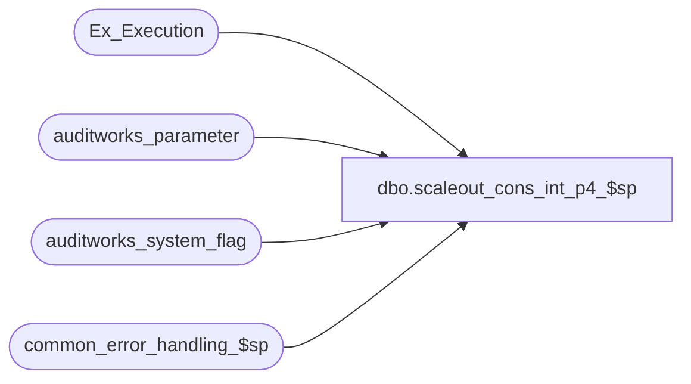

# dbo.scaleout_cons_int_p4_$sp

**Database:** auditworks_external  
**Server:** bedrockdb01  

## Architecture Diagram



## Table Dependencies

| Referenced Table |
|---|
| Ex_Execution |
| auditworks_parameter |
| auditworks_system_flag |
| common_error_handling_$sp |

## Stored Procedure Code

```sql
create proc [dbo].[scaleout_cons_int_p4_$sp] (@i_min_serial_no numeric(14,0)
,@i_max_serial_no numeric(14,0)
,@i_execution_id  integer)

AS

/*********************************************************************************
Proc name:	scaleout_cons_int_p4_$sp

Description:	Posts final in Consolidated Sales Audit db.
		Stored proc runs in Consolidated Sales Audit db.
		Interface transactions are inserted in batches.
		Proc, if aborted, will restart from where it left off.
		Called from susm. 

To monitor the process:
		Value of status_code in table Ex_Execution

To stop the process:
		UPDATE Ex_Execution set verified = getdate() 
		WHERE status_code <> 0
		AND queue_id = @queue_id

HISTORY:
Date     Name           Def# Desc
Jul19,11 Paul         115308 improve error recovery
Jan29,09 Paul         107623 improved error handling
Jun03,05 Sab	     DV-1254 Changed input parameter names to be @i_
Mar17,05 Sab/Paul    DV-1218 Posts transactions in Consolidated Sales Audit db.

**********************************************************************************/
DECLARE
@errmsg			nvarchar(255),
@errno			integer,
@object_id		integer,
@object_name		nvarchar(255),
@operation_name		nvarchar(100),
@process_name		nvarchar(100),
@process_no 		smallint,
@queue_id		integer,
@rows			int


SET NOCOUNT ON

SELECT @object_id = 1,
	@object_name = ' ',
	@operation_name = 'post',
	@process_no = 28,
	@process_name = 'scaleout_cons_int_p4_$sp'

SELECT @queue_id = par_value
  FROM auditworks_parameter
 WHERE par_name = 'scaleout_interface_id'

SELECT @errno = @@error, @rows = @@rowcount
IF @errno != 0 OR @rows = 0
  BEGIN
	SELECT @errmsg = 'Failed to retrieve scaleout_interface_id',
		@object_name = 'auditworks_parameter',
		@operation_name = 'SELECT'
	GOTO error
  END

-- flag batch as successful
UPDATE Ex_Execution
  SET status_code = 0
 WHERE queue_id = @queue_id
   AND execution_id = @i_execution_id
   AND object_id = @object_id
   AND from_serial_no = @i_min_serial_no
   AND to_serial_no = @i_max_serial_no

SELECT @errno = @@error
IF @errno != 0
  BEGIN
	SELECT @errmsg = 'Failed to update Ex_Execution',
		@object_name = 'Ex_Execution',
		@operation_name = 'UPDATE'
	GOTO error
  END

/* update status for error recovery purposes */

UPDATE auditworks_system_flag 
 SET flag_numeric_value = 0 -- batch successful
WHERE flag_name = 'scaleout_cons_posting_status'

SELECT @errno = @@error
IF @errno != 0
  BEGIN
	SELECT @errmsg = 'Failed to set status_flag',
		@object_name = 'auditworks_system_flag',
		@operation_name = 'UPDATE'
	GOTO error
  END

RETURN 1

error:

	EXEC common_error_handling_$sp @process_no, @errno, @errmsg, 0, 201068, 
	@process_name, @object_name, @operation_name, 1, 1, 
	0, 0, 0
	RETURN -300
```

