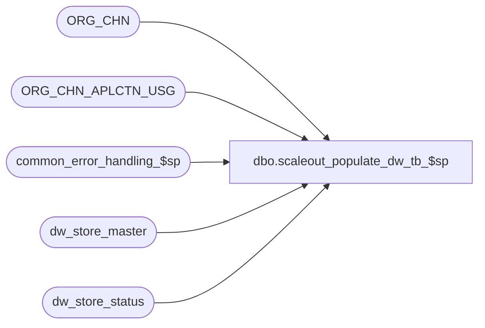

# dbo.scaleout_populate_dw_tb_$sp

**Database:** auditworks_external  
**Server:** bedrockdb01  

## Architecture Diagram



## Table Dependencies

| Referenced Table |
|---|
| ORG_CHN |
| ORG_CHN_APLCTN_USG |
| common_error_handling_$sp |
| dw_store_master |
| dw_store_status |

## Stored Procedure Code

```sql
create proc dbo.scaleout_populate_dw_tb_$sp (
@instance_id	numeric(5,0),
@sales_date	smalldatetime)

AS

/* 
PROC NAME: scaleout_populate_dw_tb_$sp
DESC: EDIT - This procedure will be executed on the consolidated server to populate the tables dw_store_master
	     and dw_store_status. This procedure will populate the dw_store_master table using the ORG_CHN table.
	     Then additional rows will be inserted to the dw_store_status table for the passed in sales_date.
	     The intent is to maximize performance by inserting all stores for one sales_date into 
	     dw_store_status using a single insert.
	     Called by edit_header_$sp on each peripheral.

	This proc is compatible with both SA 5.0 and 5.1

HISTORY:  
Date     Name           Def# Desc
May14,13 Paul         143853 remove return logic since calling proc already does it. Use try .. catch
Mar26,07 Phu           84682 Fix incorrect outer join done by D#77931.
Oct25,06 Phu           77931 Fix outer join for SQL 2005 Mode 90.
Mar21,05 Sab         DV-1191 Run on consolidated server to populate tables dw_store_master and dw_store_status
*/

DECLARE 
  @added_stores_flag		tinyint,
  @cnt_dw_store			numeric(12,0),
  @cnt_store			numeric(12,0),
  @date				smalldatetime,
  @errmsg			nvarchar(255),
  @errno				int,
  @object_name			nvarchar(255),
  @operation_name			nvarchar(100)

SELECT @added_stores_flag = 0,
	@operation_name = 'INSERT';

BEGIN TRY

/* Check to see if stores have been added or deleted. */
SELECT @cnt_store = COUNT(1)
  FROM ORG_CHN_APLCTN_USG u, ORG_CHN c
 WHERE c.ACTV = 1
   AND c.ORG_CHN_NUM = u.ORG_CHN_NUM
   AND u.VLDTY = 1
   AND u.APLCTN_ID = 300;

BEGIN TRANSACTION

/* Get exclusive lock in order to serialize possible simultaneous calls of this proc */
SELECT @cnt_dw_store = COUNT(1)
  FROM dw_store_master WITH (TABLOCKX);

IF @cnt_store <> @cnt_dw_store
BEGIN
  SELECT @added_stores_flag = 1,
	@errmsg = 'Failed to INSERT dw_store_master',
	@object_name = 'dw_store_master';

  -- add the new stores to dw_store_master
  INSERT INTO dw_store_master (
	 store_no,
	 instance_id,
	 source_media_rec_recovery_id)
  SELECT c.ORG_CHN_NUM,
	 @instance_id,
	 0
    FROM ORG_CHN_APLCTN_USG u, ORG_CHN c
   WHERE c.ACTV = 1
     AND c.ORG_CHN_NUM = u.ORG_CHN_NUM
     AND u.VLDTY = 1
     AND u.APLCTN_ID = 300
     AND c.ORG_CHN_NUM NOT IN (SELECT store_no FROM dw_store_master);

  -- delete rows for stores that are no longer active or have been removed
  SELECT @operation_name = 'DELETE'

  DELETE FROM dw_store_master
   WHERE store_no NOT IN (SELECT c.ORG_CHN_NUM
			    FROM ORG_CHN_APLCTN_USG u, ORG_CHN c
			   WHERE c.ACTV = 1
			     AND c.ORG_CHN_NUM = u.ORG_CHN_NUM
			     AND u.VLDTY = 1
			     AND u.APLCTN_ID = 300);

END -- If @cnt_store <> @cnt_dw_store


/* insert entries for all active stores. For stores that are not yet edited, assign ownership
   to current @instance_id to allow reporting of missing reg by only one instance */
SELECT @object_name = 'dw_store_status',
	@operation_name = 'INSERT',
	@errmsg = 'Failed to INSERT dw_store_status'
	
INSERT INTO dw_store_status (
		  store_no,
		  sales_date,
		  store_status,
		  instance_id,
		  source_media_rec_recovery_id)
SELECT m.store_no,
	  @sales_date,
	  0,
	  CASE WHEN m.instance_id = 0 THEN @instance_id
	     ELSE m.instance_id END,
	  0
  FROM dw_store_master m
 WHERE store_no NOT IN (SELECT DISTINCT store_no
	                 FROM dw_store_status
	                 WHERE sales_date = @sales_date);

  /* dup error should already be prevented by exclusive lock */

COMMIT TRANSACTION

RETURN

END TRY

BEGIN CATCH
error:   /* global error handler */

	SELECT @errno = ERROR_NUMBER()
	SELECT @errmsg = COALESCE(@errmsg, ' ') + ERROR_MESSAGE()

	EXEC common_error_handling_$sp 1, @errno, @errmsg, 0, 201068, 'scaleout_populate_dw_tb_$sp', 
		@object_name, @operation_name, 1, 1, 0, null, 0
	RETURN

END CATCH
```

