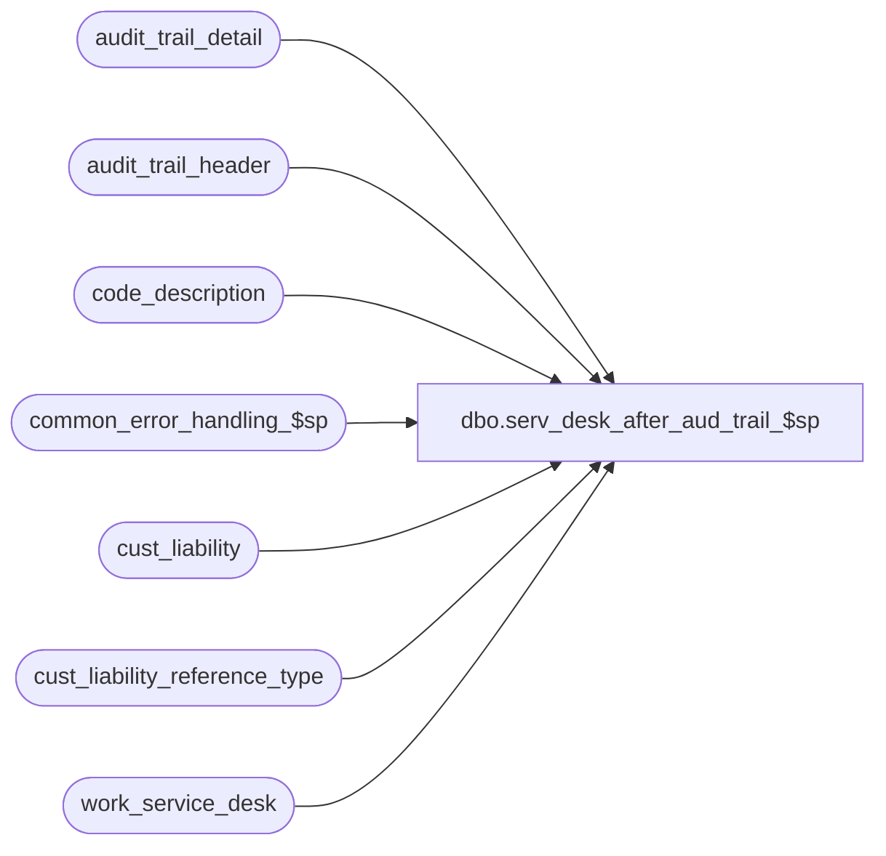

# dbo.serv_desk_after_aud_trail_$sp

**Database:** auditworks_external  
**Server:** bedrockdb01  

## Architecture Diagram



## Table Dependencies

| Referenced Table |
|---|
| audit_trail_detail |
| audit_trail_header |
| code_description |
| common_error_handling_$sp |
| cust_liability |
| cust_liability_reference_type |
| work_service_desk |

## Stored Procedure Code

```sql
create proc [dbo].[serv_desk_after_aud_trail_$sp] @process_id		int,
@errmsg			nvarchar(100) OUTPUT

AS
DECLARE
@abort_flag		tinyint,
@entry_id		numeric(12,0),
@errno			int,
@expiry_date            smalldatetime,  -- DEF 1-FHSK1
@key_value		nvarchar(255),
@key_value_descr	nvarchar(255),
@key_store_no		int,
@last_modified_by_pos	datetime,
@log_error_flag		tinyint,
@message_id		int,
@object_name		nvarchar(255),
@operation_name     	nvarchar(100),
@process_name		nvarchar(100),
@process_no		int,
@pos_status	    	tinyint,
@pos_amount_1		money,	
@pos_amount_2		money,	
@pos_amount_3		money,	
@reference_type     	smallint,
@reference_no		nvarchar(20),
@store_no		int,
@table_name		nvarchar(25)

/* 
PROC NAME: serv_desk_before_aud_trail_$sp
PROC DESC: This procedure logs the 'after' of the SERVICE DESK transaction
           to the audit_trail_detail.
           Entry_date_time is used to record the last_modified_by_pos datetime

HISTORY:
Date		Name		Def#	Desc
Mar03,03        Maryam          6478    Change the process no to be 250 instead of 241.
SEP26,02        Daphna       1-FHSK1    add expiry_date to audit_trail_detail
SEP05,02        Daphna       AW-8812    set abort flag = 3 to skip raise error
MAY31-02	Daphna       AW-8812    author
Apr19,02 	Winnie       1-CD0IX	R3 error handling

*/

SELECT @message_id = 201068,
       @process_no = 250,
       @process_name = 'serv_desk_after_aud_trail_$sp',
       @log_error_flag = 1,
       @entry_id = 0,
       @abort_flag = 3  -- skip raise error 


SELECT @entry_id = entry_id
  FROM work_service_desk
 WHERE process_id = @process_id
   
SELECT @errno = @@error
IF @errno <> 0
BEGIN
  SELECT @errmsg= 'entry_id',
         @object_name = 'work_service_desk',
         @operation_name = 'SELECT'
  GOTO error       
END 

IF @entry_id = 0  -- not found
BEGIN
  SELECT @errno = 201068,
         @errmsg = 'entry_id NOT found for this process_id',
         @object_name = 'work_service_desk',
         @operation_name = 'SELECT'
  GOTO error
END
  
SELECT @reference_no = reference_no,
       @reference_type = reference_type,
       @store_no = store_no
  FROM audit_trail_header
 WHERE entry_id = @entry_id          
 
SELECT @errno = @@error
IF @errno <> 0
BEGIN
  SELECT @errmsg= 'reference_no, reference_type, store_no',
         @object_name = 'audit_trail_header',
         @operation_name = 'SELECT'
  GOTO error       
END 

SELECT @key_store_no = ( @store_no * unique_by_store_key ) -1 + unique_by_store_key
  FROM cust_liability_reference_type
 WHERE reference_type = @reference_type 

SELECT @errno = @@error
IF @errno <> 0
BEGIN
  SELECT @errmsg= '@key_store_no',
         @object_name = 'cust_liability_reference_type',
         @operation_name = 'SELECT'
  GOTO error       
END 

SELECT @pos_status = pos_status,
       @pos_amount_1 = pos_amount_1,
       @pos_amount_2 = pos_amount_2,
       @pos_amount_3 = pos_amount_3,
       @last_modified_by_pos = last_modified_by_pos,
       @expiry_date = expiry_date
  FROM cust_liability cl
 WHERE reference_type = @reference_type
   AND reference_no = @reference_no
   AND key_store_no = @key_store_no

SELECT @errno = @@error
IF @errno != 0
BEGIN
  SELECT @errmsg = '@pos_status ETC',
         @object_name = 'cust_liability',
         @operation_name = 'SELECT'
  GOTO error
END             

-- update pos_status after value   
UPDATE audit_trail_detail
   SET after_value = CONVERT(VARCHAR, @pos_status),
       after_description = (SELECT code_display_descr   
                              FROM code_description
                             WHERE @pos_status = code
                               AND code_type = 251)  -- pos status
WHERE entry_id = @entry_id
  AND column_name = 'pos_status'

SELECT @errno = @@error
IF @errno != 0
BEGIN
  SELECT @errmsg = 'after_value =  pos_status',
         @object_name = 'audit_trail_detail',
 @operation_name = 'UPDATE' 
  GOTO error
END

-- pos_amount_1 after value 
UPDATE audit_trail_detail
   SET after_value = CONVERT(VARCHAR, @pos_amount_1)
 WHERE entry_id = @entry_id
   AND column_name = 'pos_amount_1'
 
SELECT @errno = @@error
IF @errno != 0
BEGIN
  SELECT @errmsg = 'after_value = pos_amount_1',
         @object_name = 'audit_trail_detail',
         @operation_name = 'UPDATE' 
  GOTO error
END

-- pos_amount_2   
UPDATE audit_trail_detail
   SET after_value = CONVERT(VARCHAR, @pos_amount_2)
 WHERE entry_id = @entry_id
   AND column_name = 'pos_amount_2'

SELECT @errno = @@error
IF @errno != 0
BEGIN
  SELECT @errmsg = 'after_value = pos_amount_2',
         @object_name = 'audit_trail_detail',
         @operation_name = 'UPDATE' 
  GOTO error
END

-- pos_amount_3 
UPDATE audit_trail_detail
   SET after_value = CONVERT(VARCHAR, @pos_amount_3)
 WHERE entry_id = @entry_id
   AND column_name = 'pos_amount_3'

SELECT @errno = @@error
IF @errno != 0
BEGIN
  SELECT @errmsg = 'after_value = pos_amount_3',
         @object_name = 'audit_trail_detail',
         @operation_name = 'UPDATE' 
  GOTO error
END
    
-- expiry_date
UPDATE audit_trail_detail
   SET after_value = CONVERT(VARCHAR, @expiry_date, 106)
 WHERE entry_id = @entry_id
   AND column_name = 'expiry_date'

SELECT @errno = @@error
IF @errno != 0
BEGIN
  SELECT @errmsg = 'after_value = expiry_date',
         @object_name = 'audit_trail_detail',
         @operation_name = 'UPDATE' 
  GOTO error
END
    
-- entry_date_time = last_modified_by_pos 
UPDATE audit_trail_header
   SET entry_date_time = @last_modified_by_pos
 WHERE entry_id = @entry_id

SELECT @errno = @@error
IF @errno != 0
BEGIN
  SELECT @errmsg = 'entry_date_time = last_modified_by_pos',
         @object_name = 'audit_trail_header',
         @operation_name = 'UPDATE' 
  GOTO error
END

-- delete work_service_desk   
DELETE work_service_desk
 WHERE process_id = @process_id
   AND entry_id = @entry_id

SELECT @errno = @@error
IF @errno != 0
BEGIN
  SELECT @errmsg = 'match @process_id, @entry_id',
         @object_name = 'work_service_desk',
         @operation_name = 'DELETE' 
  GOTO error
END

  	
RETURN @errno	

error:   /* Common error handler. */


EXEC common_error_handling_$sp @process_no, @errno, @errmsg, @abort_flag, @message_id,
                @process_name, @object_name, @operation_name, 0 
        
SELECT @errmsg = @process_name + ' - ' + @errmsg

	
RETURN @errno
```

