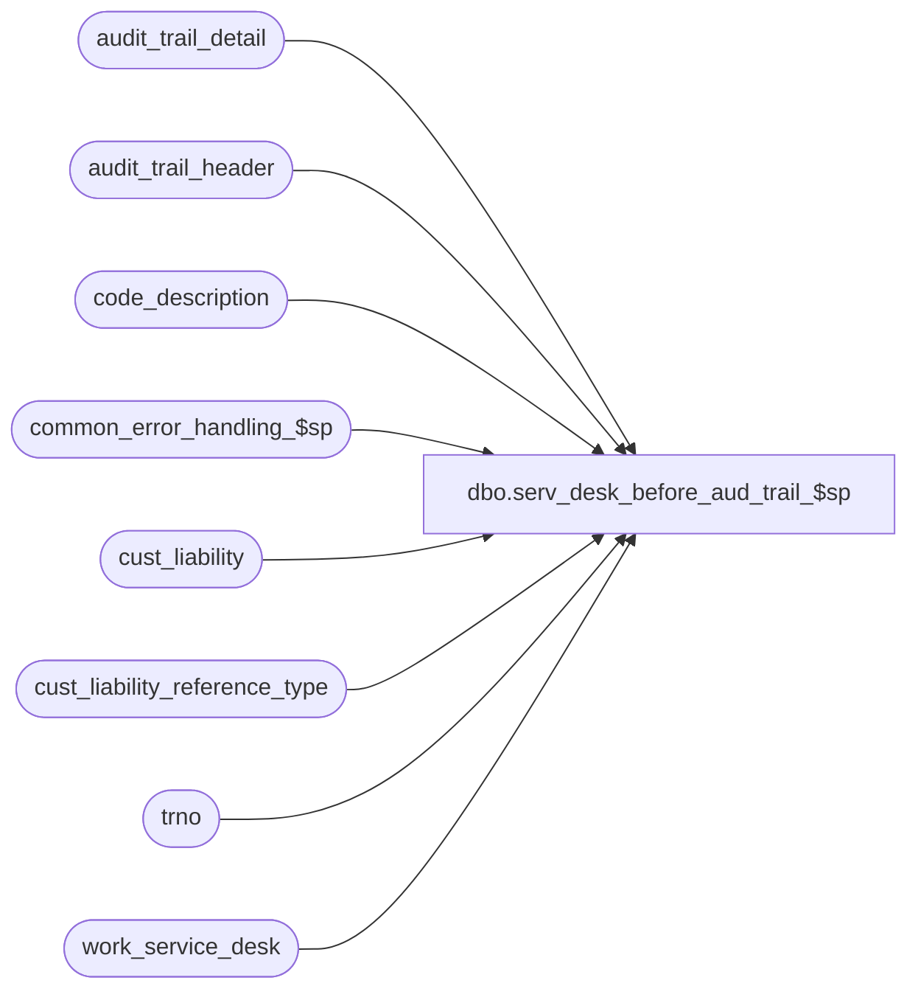

# dbo.serv_desk_before_aud_trail_$sp

**Database:** auditworks_external  
**Server:** bedrockdb01  

## Architecture Diagram



## Table Dependencies

| Referenced Table |
|---|
| audit_trail_detail |
| audit_trail_header |
| code_description |
| common_error_handling_$sp |
| cust_liability |
| cust_liability_reference_type |
| trno |
| work_service_desk |

## Stored Procedure Code

```sql
create proc [dbo].[serv_desk_before_aud_trail_$sp] @store_no		int,
@register_no		smallint,
@transaction_no		trno,
@transaction_series	nchar,
@cashier_no		int,
@reference_type		smallint,
@reference_no         	nvarchar(20),
@notes			nvarchar(255),
@user_name		nvarchar(25),
@errmsg			nvarchar(100) OUTPUT,
@process_id		int,   -- random generated by FE
@transaction_date	smalldatetime

AS
DECLARE
@abort_flag		tinyint,
@action			tinyint,
@entry_id		numeric(12,0),
@errno			int,
@expiry_date            smalldatetime,  -- DEF 1-FHSK1
@function_no		int,
@key_value		nvarchar(255),
@key_value_descr	nvarchar(255),
@key_store_no		int,
@length                 tinyint,  -- DEF 1-FHSK1
@message_id		int,
@object_name		nvarchar(255),
@operation_name     	nvarchar(100),
@pos_status             tinyint,
@pos_amount_1		money,
@pos_amount_2		money,
@pos_amount_3		money,
@process_name		nvarchar(100),
@rows			tinyint,
@table_name		nvarchar(25)

/* 
PROC NAME: serv_desk_before_aud_trail_$sp
PROC DESC: This procedure logs the 'before' of the SERVICE DESK transaction
           to the audit_trail.
           Action is defaulted to 2 (update), and is corrected to 1 (insert) where
           applicable in serv_desk_after_aud_trail_$sp

HISTORY:
Date	    Name         Def#	Desc
Mar03,03    Maryam       6478   Change the function no to be 250 instead of 241.
SEP25,02    Daphna    1-FHSK1	pad reference_no for insert to audit_trail_header and 
                                lookup in cust_liability
                                add expiry_date to audit_trail_detail
SEP05,02    Daphna    AW-8812	set abort flag = 3 to skip raise error
MAY31,02    Daphna    AW-8812   author
*/


SELECT @table_name = 'cust_liability',
       @function_no = 250,   -- Voucher Service 
       @action = 2,  -- update
       @process_name = 'serv_desk_before_aud_trail_$sp',
       @message_id = 201068,
       @abort_flag = 3  -- skip raise error
 
SELECT @key_store_no = ( @store_no * unique_by_store_key ) -1 + unique_by_store_key,
       @length = reference_no_length   -- DEF 1-FHSK1
  FROM cust_liability_reference_type
 WHERE reference_type = @reference_type 
    
SELECT @errno = @@error
IF @errno <> 0
BEGIN 
  SELECT @errmsg = 'key_store_no',
         @object_name = 'cust_liability_reference_type',
         @operation_name = 'SELECT'
  GOTO error       
END         
             
SELECT @key_value =  CONVERT(nvarchar, @reference_type)
          	      + '/' + @reference_no
          	      + '/' + CONVERT(nvarchar, @key_store_no)

	
SELECT @key_value_descr =  cd.code_display_descr + '/' +  @reference_no  
             + '/' + CONVERT(nvarchar, @key_store_no) 		
  FROM code_description cd
 WHERE cd.code_type = 22  -- ref type
   AND cd.code = @reference_type

SELECT @errno = @@error
IF @errno <> 0
BEGIN 
   SELECT @errmsg = 'key_value_descr',
          @object_name = 'code_description',
          @operation_name = 'SELECT'
   GOTO error       
END         

SELECT @pos_status = pos_status,
       @pos_amount_1 = pos_amount_1,
       @pos_amount_2 = pos_amount_2,
       @pos_amount_3 = pos_amount_3,
       @expiry_date = expiry_date  -- DEF 1-FHSK1
  FROM cust_liability cl
 WHERE reference_type = @reference_type
   AND reference_no = RIGHT('00000000000000000000' + @reference_no, @length)  -- DEF 1-FHSK1
   AND key_store_no = @key_store_no

SELECT @errno = @@error,
       @rows = @@rowcount
IF @errno != 0
BEGIN
  SELECT @errmsg = '@pos_status ETC',
         @object_name = 'cust_liability',
         @operation_name = 'SELECT'
  GOTO error
END


IF  @rows = 0  -- voucher doesn't exist in table
  SELECT @action = 1  -- insert

--DEF 1-FHSK1: pad reference_no according to ref_type 
INSERT audit_trail_header (
       entry_date,
       table_name,
       table_key,
       table_key_descr,
       user_name,
       action,
       function_no,
       store_no,
       register_no,
       transaction_date,
       transaction_no,
       transaction_series,
       cashier_no,
       reference_type,
       reference_no)
VALUES (getdate(),
       @table_name,
       @key_value,
       @key_value_descr,
       @user_name,
       @action,
       @function_no,
       @store_no,
       @register_no,
       @transaction_date,
       @transaction_no,
       @transaction_series,
       @cashier_no,
       @reference_type,
       RIGHT('00000000000000000000' + @reference_no, @length))  -- DEF 1-FHSK1
SELECT @errno = @@error,
       @entry_id = @@identity
IF @errno != 0
BEGIN
  SELECT @errmsg = '@table_name ETC',
         @object_name = 'audit_trail_header',
         @operation_name = 'INSERT'
  GOTO error
END

IF @action = 1
BEGIN
  --insert pos_status  
  INSERT audit_trail_detail
         (entry_id,column_name)
  VALUES ( @entry_id, 'pos_status')

  SELECT @errno = @@error
  IF @errno != 0
  BEGIN
    SELECT @errmsg = 'before_value = pos_status, no status',
           @object_name = 'audit_trail_detail',
           @operation_name = 'INSERT'      
    GOTO error
  END

  -- pos_amount_1   
  INSERT audit_trail_detail 
         (entry_id, column_name)
  VALUES( @entry_id, 'pos_amount_1')

  SELECT @errno = @@error
  IF @errno != 0
  BEGIN
    SELECT @errmsg = 'before_value = pos_amount_1, no amt',
   	      @object_name = 'audit_trail_detail',
	      @operation_name = 'INSERT'
    GOTO error
  END

  -- pos_amount_2   
  INSERT audit_trail_detail
         (entry_id, column_name)
  VALUES (@entry_id,'pos_amount_2')

  SELECT @errno = @@error
  IF @errno != 0
  BEGIN
    SELECT @errmsg = 'before_value = pos_amount_2, no amt',
           @object_name = 'audit_trail_detail',
	      @operation_name = 'INSERT' 
    GOTO error
  END

  -- pos_amount_3   
  INSERT audit_trail_detail 
         (entry_id, column_name)
  VALUES (@entry_id,'pos_amount_3')

  SELECT @errno = @@error
  IF @errno != 0
  BEGIN
    SELECT @errmsg = 'before_value = pos_amount_3, no amt',
    	      @object_name = 'audit_trail_detail',
	      @operation_name = 'INSERT' 
    GOTO error
  END
  
   -- expiry_date
  INSERT audit_trail_detail 
         (entry_id, column_name)
  VALUES (@entry_id,'expiry_date')

  SELECT @errno = @@error
  IF @errno != 0
  BEGIN
    SELECT @errmsg = 'before_value = expiry_date, no date',
    	      @object_name = 'audit_trail_detail',
	      @operation_name = 'INSERT' 
    GOTO error
  END
  
END
ELSE  -- @action = 2   -- update existing voucher, INSERT detail rows
BEGIN  
   
  --insert pos_status  
  INSERT audit_trail_detail (
         entry_id,
         column_name,
         before_value,
         before_description)
 SELECT  @entry_id,
        'pos_status',
        CONVERT(VARCHAR, @pos_status),
        cd.code_display_descr
   FROM code_description cd
  WHERE @pos_status = cd.code
    AND cd.code_type = 251  -- pos status

  SELECT @errno = @@error
  IF @errno != 0
  BEGIN
    SELECT @errmsg = 'before_value = pos_status',
           @object_name = 'audit_trail_detail',
           @operation_name = 'INSERT'      
    GOTO error
  END

  -- pos_amount_1   
  INSERT audit_trail_detail (
	 entry_id,
	 column_name,
	 before_value)
  VALUES( @entry_id,
	 'pos_amount_1',
	 CONVERT(VARCHAR, @pos_amount_1))

  SELECT @errno = @@error
  IF @errno != 0
  BEGIN
    SELECT @errmsg = 'before_value = pos_amount_1',
   	      @object_name = 'audit_trail_detail',
	      @operation_name = 'INSERT'
    GOTO error
  END

  -- pos_amount_2   
  INSERT audit_trail_detail (
	 entry_id,
	 column_name,
	 before_value)
  VALUES (@entry_id,
	 'pos_amount_2',
	 CONVERT(VARCHAR, @pos_amount_2))

  SELECT @errno = @@error
  IF @errno != 0
  BEGIN
    SELECT @errmsg = 'before_value = pos_amount_2',
           @object_name = 'audit_trail_detail',
	      @operation_name = 'INSERT' 
    GOTO error
  END

  -- pos_amount_3   
  INSERT audit_trail_detail (
	 entry_id,
	 column_name,
	 before_value)
  VALUES (@entry_id,
	 'pos_amount_3',
	  CONVERT(VARCHAR, @pos_amount_3))

  SELECT @errno = @@error
  IF @errno != 0
  BEGIN
    SELECT @errmsg = 'before_value = pos_amount_3',
    	      @object_name = 'audit_trail_detail',
	      @operation_name = 'INSERT' 
    GOTO error
  END
  
   -- expiry_date
  INSERT audit_trail_detail (
	 entry_id,
	 column_name,
	 before_value)
  VALUES (@entry_id,
	 'expiry_date',
	  CONVERT(VARCHAR, @expiry_date, 106))

  SELECT @errno = @@error
  IF @errno != 0
  BEGIN
    SELECT @errmsg = 'before_value = pos_amount_3',
    	      @object_name = 'audit_trail_detail',
	      @operation_name = 'INSERT' 
    GOTO error
  END

END  -- INSERT DETAILS

-- notes 
IF  @notes <> ' '  -- not empty
BEGIN
  INSERT audit_trail_detail (
         entry_id,
         column_name,
         after_value)
  VALUES(@entry_id,
	'notes',
  	@notes)
 
  SELECT @errno = @@error
  IF @errno != 0
  BEGIN
    SELECT @errmsg = 'after_value = notes',
     	   @object_name = 'audit_trail_detail',
           @operation_name = 'INSERT' 
    GOTO error
  END
END -- notes are not blank  

  
--log random # and entry_id 
INSERT work_service_desk (process_id, entry_id, audit_trail_date)
VALUES (@process_id, @entry_id, getdate())

SELECT @errno = @@error
IF @errno != 0
BEGIN
  SELECT @errmsg = '@process_id, @entry_id',
         @object_name = 'work_service_desk',
         @operation_name = 'INSERT' 
  GOTO error
END
  
RETURN @errno

error:   /* Common error handler. */

EXEC common_error_handling_$sp @function_no, @errno, @errmsg, @abort_flag, @message_id,
                @process_name, @object_name, @operation_name, 0 

SELECT @errmsg = @process_name + ' - ' + @errmsg

RETURN @errno
```

