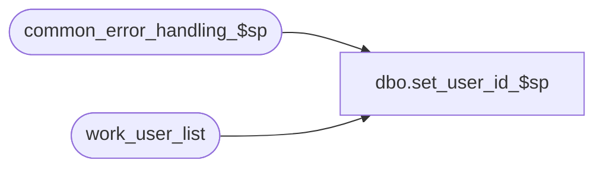

# dbo.set_user_id_$sp

**Database:** auditworks_external  
**Server:** bedrockdb01  

## Architecture Diagram



## Table Dependencies

| Referenced Table |
|---|
| common_error_handling_$sp |
| work_user_list |

## Stored Procedure Code

```sql
create proc [dbo].[set_user_id_$sp] 
@user_id		int -- Foundation user_id

AS

/* Proc Name: set_user_id_$sp
   Description: creates/updates a row in work_user_list for the current spid in order to store the passed in @user_id.
     The row is will be read by tm triggers in order to identify the user when all users use the same rdbms login.
     The row is never deleted but it will be re-used since the spid will generally be re-used.
     Not applicable to Oracle since client info can be used to store the user_id as a string.
   Called from SA5 Powerbuilder after login .

HISTORY: 

Date     Name           Defect# Desc
May31,06 Paul           DV-1338 author

*/

DECLARE @errmsg			nvarchar(255),
	@errno			int,
	@object_name		nvarchar(255),
	@process_id		int,
	@process_name		nvarchar(100),
	@operation_name		nvarchar(100),
	@message_id		int,
	@rows			int

SELECT  @process_name = 'set_user_id_$sp',
        @message_id = 201068,
        @process_id = @@spid

UPDATE work_user_list
  SET user_id = @user_id
 WHERE rdbms_spid = @process_id

SELECT @errno = @@error, @rows = @@rowcount
IF @errno != 0
  BEGIN
      SELECT @errmsg = 'Failed to UPDATE work_user_list',
	     @object_name = 'work_user_list',
	     @operation_name = 'UPDATE'
      GOTO error
  END

IF @rows = 0
  BEGIN
   INSERT INTO work_user_list (
	user_id,
	rdbms_spid )
   VALUES (
	@user_id,
	@process_id)

   SELECT @errno = @@error
   IF @errno != 0
     BEGIN
      SELECT @errmsg = 'Failed to insert work_user_list',
	     @object_name = 'work_user_list',
	     @operation_name = 'INSERT'
      GOTO error
     END
  END

RETURN

error:   /* Common error handler. */

        EXEC common_error_handling_$sp 0, @errno, @errmsg, 0, @message_id, 
             @process_name, @object_name, @operation_name, 0, 1, 0, null, 0, 
	     null, null, null, null, null, null, 0, @process_id, @user_id

	RETURN
```

