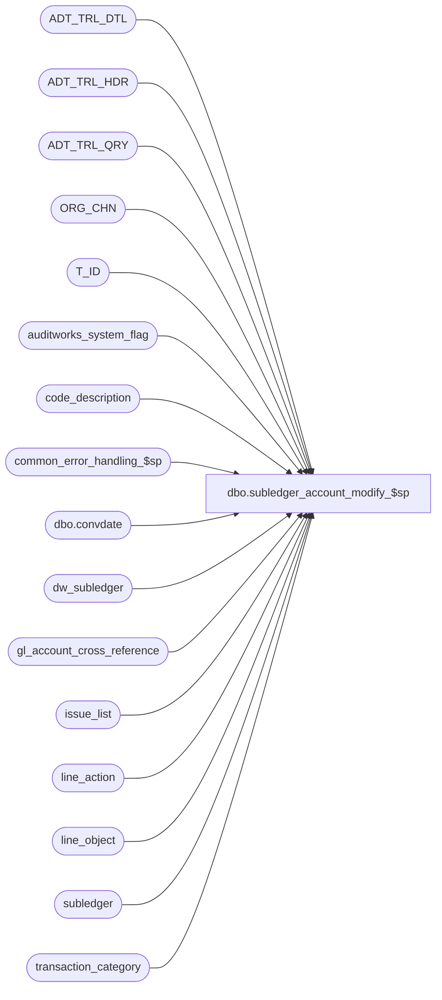

# dbo.subledger_account_modify_$sp

**Database:** auditworks_external  
**Server:** bedrockdb01  

## Architecture Diagram



## Table Dependencies

| Referenced Table |
|---|
| ADT_TRL_DTL |
| ADT_TRL_HDR |
| ADT_TRL_QRY |
| ORG_CHN |
| T_ID |
| auditworks_system_flag |
| code_description |
| common_error_handling_$sp |
| dbo.convdate |
| dw_subledger |
| gl_account_cross_reference |
| issue_list |
| line_action |
| line_object |
| subledger |
| transaction_category |

## Stored Procedure Code

```sql
create proc [dbo].[subledger_account_modify_$sp] ( @process_id                   binary(16),
  @user_id                      int,
  @replacement_gl_account_no	nvarchar(160),	--new G/L account number
  @temp_table_name		nvarchar(30),	--contains list of subledger details meeting Subledger Analysis retrieval criteria
  @gl_account_id		int,		--old G/L account ID as identified in drill-down row
  @store_no			int = null,	--as identified in drill-down row if this detail was included in analysis
  @transaction_date		smalldatetime = null,	--as identified in drill-down row if this detail was included in analysis
  @transaction_category		tinyint = null,	--as identified in drill-down row if this detail was included in analysis
  @line_object			smallint = null,--as identified in drill-down row if this detail was included in analysis
  @line_action			tinyint = null,	--as identified in drill-down row if this detail was included in analysis
  @data_source			tinyint = null,	--as identified in drill-down row if this detail was included in analysis
  @posting_datetime		datetime = null,--as identified in drill-down row if this detail was included in analysis
  @posting_status 		tinyint = null, --as identified in drill-down row if this detail was included in analysis
  @gl_posting_datetime 		datetime = null,--as identified in drill-down row if this detail was included in analysis
  @partial_amount		money = null )  -- null if full amount to be reassigned, otherwise set to amount to be reassigned

AS

/* 
Proc name : subledger_account_modify_$sp
Desc: Called by front-end when user wishes to correct an invalid G/L account, passing in the replacement G/L account to
      be used to update subledger, the temp table containing the list of subledger details supporting the Subledger 
      Analysis information presented to the user (taking into account his audit-group and query criteria), the fields
      identifying the summary rows selected from the UI for modification, and optionally a partial_amount if only a 
      portion of the lowest level subledger amount is to be reassigned to the replacement account.
      Note, the UI populates the temp table based on Consolidated, but calls this proc on peripheral.

HISTORY:  
Date     Name           Def# Desc
Aug22,12 Vicci        137795 Remove SET NOCOUNT OFF from after the call to the common error handling to avoid @@error being reset before the calling proc can see it.
Jan18,12 Vicci        132439 Remove references to CRDM user-defined string datatypes from S/A since CRDM is not changing them to support unicode.
Jun17,11 Phu          127717 Fix gl account numbers are logged as scientific notation in ADT_TRL_DTL.OLD_VAL and NEW_VAL.
May17,11 Paul         121798 Unicode.
May09,11 Vicci        126816 Correct Transaction / Unit allocation in the case of a partial amount transfer.  
			     Log last_modified_date_time.  Keep transaction qty integer.
			     Take scaleout into account.
Jun17,10 Vicci        102089 Revision to support dayend issue list logging for invalid accounts.
Jun16,08 Vicci        102089 Author

*** must script with ANSI_NULLS ON, ANSI_WARNINGS ON due to scaleout

*/

CREATE TABLE #work_subledger_acct_mod (
       currency_code nvarchar(3) null, 
       gl_account_id int not null, 
       store_no int not null, 
       line_object smallint not null, 
       line_action tinyint not null, 
       transaction_date smalldatetime not null, 
       posting_datetime datetime null, 
       gl_posting_status tinyint null, 
       gl_posting_datetime datetime null, 
       transaction_qty int not null, 
       units real not null, 
       amount money not null, 
       original_amount money null, 
       fiscal_year smallint not null,
       period tinyint not null,
       gl_company int not null,
       transaction_category tinyint not null,
       store_balance_group tinyint not null,
       data_source tinyint null)

DECLARE
  -- error handling
  @errmsg                     nvarchar(255),
  @errno                      int,
  @errno2                     int,
  @errnum                     int,
@instance_id		      int,
  @process_name               nvarchar(100),
  @operation_name             nvarchar(100),
  @object_name nvarchar(255),
  @message_id                 int,
  @log_error_flag             tinyint,
  -- new audit trail tables
  @ENTRY_ID			T_ID,
  @TBL_NAME			nvarchar(255),
  @TBL_KEY			nvarchar(255),
  @TBL_KEY_RSRC_NAME		nvarchar(255),
  @TBL_KEY_RSRC_PRMS		nvarchar(255),
  @sep                        nchar(1),
  @current_date datetime, 
  @process_no                 smallint,
  @replacement_gl_account_id  int,
  @gl_account_no              nvarchar(160),
  @sql_command 		      nvarchar(3000),
  @rows			      int,
  @scaleout_flag	      int,
  @db_name		      nvarchar(30),
  @dblink_name		      nvarchar(128),
  @invalid_account_flag	      tinyint,
  @replacement_invalid_acct_flag tinyint 

SET NOCOUNT ON
SET ANSI_NULLS ON
SET ANSI_WARNINGS ON

SELECT  @errmsg             	= NULL,
        @process_no         	= 74,
        @process_name		= 'subledger_account_modify_$sp',
        @message_id 		= 201068,
        @log_error_flag		= 0,  -- not called by smartload
	@sep 			= nchar(12), -- audit trail seperator
        @current_date 		= getdate(),
        @ENTRY_ID		= NEWID(),
        @TBL_NAME		= 'SUBLEDGER',
        @TBL_KEY_RSRC_NAME	= 'TK_GL_ACCO_TRAN_DATE_STOR_TRAN_CATE_LINE_OBJE_LINE_ACTI_DATA_SOUR_POST_DATE'

SELECT @instance_id = CONVERT(int,flag_numeric_value)
  FROM auditworks_system_flag
 WHERE flag_name = 'instance_id'
SELECT @rows = @@rowcount, @errno = @@error
IF @errno != 0 or @rows = 0
   BEGIN
    SELECT @errmsg = 'Failed to select instance_id from auditworks_system_flag',
           @object_name = 'auditworks_system_flag',
           @operation_name = 'SELECT'
    GOTO error
  END
  
SELECT @rows = 0

SELECT @sql_command = '
INSERT into #work_subledger_acct_mod(
       currency_code,
       gl_account_id,
       store_no,
       line_object,
       line_action,
       transaction_date,
       posting_datetime,
       gl_posting_status,
       gl_posting_datetime,
       transaction_qty,
       units,
       amount,
       original_amount,
       fiscal_year,
       period,
       gl_company,
       transaction_category,
       store_balance_group,
       data_source)
SELECT currency_code,
       gl_account_id,
       store_no,
       line_object,
       line_action,
       transaction_date,
       posting_datetime,
       gl_posting_status,
       gl_posting_datetime,
       transaction_qty,
       units,
       amount,
       original_amount,
       fiscal_year,
       period,
       gl_company,
       transaction_category,
       store_balance_group,
       data_source
    FROM ' + @temp_table_name + ' t
   WHERE t.gl_account_id = @gl_account_id 
     AND (t.store_no = @store_no OR @store_no IS NULL)
     AND (t.transaction_date = @transaction_date OR @transaction_date IS NULL)
     AND (t.transaction_category = @transaction_category OR @transaction_category IS NULL)
     AND (t.line_object = @line_object OR @line_object IS NULL)
     AND (t.line_action = @line_action OR @line_action IS NULL)
     AND (t.gl_posting_status = @posting_status OR @posting_status IS NULL)
     AND (t.posting_datetime = @posting_datetime OR @posting_datetime IS NULL)
     AND (t.data_source = @data_source OR @data_source IS NULL)
     AND (t.gl_posting_datetime = @gl_posting_datetime OR @gl_posting_datetime IS NULL)
SELECT @errno = @@error, @rows = @@rowcount'

EXEC sp_executesql @sql_command, 
  N'@gl_account_id int, @store_no int, @transaction_date smalldatetime, @transaction_category tinyint, @line_object smallint, @line_action	tinyint, @data_source tinyint, @posting_datetime datetime, @posting_status tinyint, @gl_posting_datetime datetime, @errno int OUT, @rows int OUT', 
  @gl_account_id, @store_no, @transaction_date, @transaction_category, @line_object, @line_action, @data_source, @posting_datetime, @posting_status, @gl_posting_datetime, @errno OUT, @rows OUT
SELECT @errno2 = @@error
IF @errno <> 0 OR @errno2 <> 0
BEGIN
  PRINT @sql_command
  IF @errno2 <> 0 SELECT @errno = @errno2
  SELECT @errmsg = 'Failed to create list of subledger entries to be modified',
         @object_name = '#work_subledger_acct_mod',
         @operation_name = 'INSERT'
    GOTO error
END

IF @rows > 1 AND @partial_amount IS NOT NULL
  BEGIN
    SELECT @message_id = 201684,
           @errno = 201684,
           @errmsg = 'More than one subledger entry meets the criteria specified.  Partial amount adjustments are only permitted for single entry selections.',
           @object_name = 'subledger',
  	   @operation_name = 'SELECT'
     GOTO error
  END   
SELECT @gl_account_no = gl_account_no, @invalid_account_flag = invalid_account_flag 
  FROM gl_account_cross_reference
 WHERE gl_account_id = @gl_account_id
SELECT @errno = @@error
IF @errno <> 0
BEGIN
   SELECT @errmsg = 'Failed to determine GL Account number corresponding to invalid account ID to be corrected',
          @object_name = 'gl_account_cross_reference',
          @operation_name = 'SELECT'
   GOTO error
END

IF @gl_account_no IS NULL
  SELECT @gl_account_no = ''
  
SELECT @replacement_gl_account_id = gl_account_id, @replacement_invalid_acct_flag = invalid_account_flag 
  FROM gl_account_cross_reference
 WHERE gl_account_no = @replacement_gl_account_no
SELECT @errno = @@error
IF @errno <> 0
BEGIN
   SELECT @errmsg = 'Failed to determine GL Account ID of replacement GL account number',
          @object_name = 'gl_account_cross_reference',
          @operation_name = 'SELECT'
   GOTO error
END

IF @replacement_gl_account_id IS NULL
BEGIN
  SELECT @scaleout_flag = CONVERT(int,flag_numeric_value)
    FROM auditworks_system_flag
   WHERE flag_name = 'scaleout_flag' 
  SELECT @rows = @@rowcount, @errno = @@error
  IF @errno != 0 or @rows = 0
  BEGIN
    SELECT @errmsg = 'Failed to select scaleout_flag from auditworks_system_flag',
           @object_name = 'auditworks_system_flag',
          @operation_name = 'SELECT'
    GOTO error
  END
  
  SELECT @replacement_invalid_acct_flag = CASE WHEN @replacement_gl_account_no = '0' THEN 1 ELSE 0 END
  
  SELECT @scaleout_flag = 0  --purposefully pretend scaleout does not apply, since special handling is NOT required
                             --given that gl_account_cross_reference has been turned into a view instead of table
                             --that receives replication.
  IF @scaleout_flag IN (0,2)
  BEGIN
    INSERT into gl_account_cross_reference(
           gl_account_id,
           gl_account_no,
           invalid_account_flag)
    SELECT q.replacement_gl_account_id,
           @replacement_gl_account_no,
           @replacement_invalid_acct_flag
      FROM (SELECT IsNull(MAX(gl_account_id), 0) + 1 replacement_gl_account_id
              FROM gl_account_cross_reference) q
     WHERE ISNULL(LTRIM(RTRIM(@replacement_gl_account_no)), '') <> ''
       AND NOT EXISTS (SELECT 1 FROM gl_account_cross_reference WHERE gl_account_no = @replacement_gl_account_no)
    SELECT @errno = @@error
    IF @errno <> 0
    BEGIN
       SELECT @errmsg = 'Failed to create new GL Account ID associated with replacement GL account number',
              @object_name = 'gl_account_cross_reference',
              @operation_name = 'INSERT'
       GOTO error
    END

    SELECT @replacement_gl_account_id = gl_account_id
      FROM gl_account_cross_reference
     WHERE gl_account_no = @replacement_gl_account_no
    SELECT @errno = @@error
    IF @errno <> 0
    BEGIN
       SELECT @errmsg = 'Failed to determine newly created GL Account ID of replacement GL account number',
              @object_name = 'gl_account_cross_reference',
              @operation_name = 'SELECT'
       GOTO error
    END
  END  --IF @scaleout_flag IN (0,2)
  ELSE
  BEGIN
    SELECT @sql_command = N'INSERT into ' + @db_name + 'gl_account_cross_reference' + @dblink_name + ' (
               gl_account_id,
       gl_account_no,
               invalid_account_flag)
        SELECT q.replacement_gl_account_id,
               @replacement_gl_account_no,
               CASE WHEN @replacement_gl_account_no = ''0'' THEN 1 ELSE 0 END
          FROM (SELECT NVL(MAX(gl_account_id), 0) + 1 replacement_gl_account_id
                  FROM ' + @db_name + 'gl_account_cross_reference' + @dblink_name + ' ) q
         WHERE IsNull(LTRIM(RTRIM(@replacement_gl_account_no)), '') <> ''
           AND NOT EXISTS (SELECT 1 
                             FROM ' + @db_name + 'gl_account_cross_reference' + @dblink_name + '  
                            WHERE gl_account_no = @replacement_gl_account_no)
        SELECT @errno = @@error
        SELECT @replacement_gl_account_id = gl_account_id 
          FROM gl_account_cross_reference
         WHERE gl_account_no = @replacement_gl_account_no'
    EXEC sp_executesql @sql_command, 
    N'@replacement_gl_account_no nvarchar(160), @replacement_gl_account_id int OUT, @errno int OUT', 
         @replacement_gl_account_no, @replacement_gl_account_id OUT, @errno OUT
    SELECT @errno2 = @@error
    IF @errno <> 0 OR @errno2 <> 0
    BEGIN
      PRINT @sql_command
      IF @errno2 <> 0 SELECT @errno = @errno2
      SELECT @errmsg = 'Failed to create new GL Account ID associated with replacement GL account number via dynamic SQL',
             @object_name = 'gl_account_cross_reference',
             @operation_name = 'INSERT'
      GOTO error
    END
  END --ELSE of IF @scaleout_flag IN (0,2)
  
  IF @replacement_gl_account_id IS NULL
  BEGIN
    SELECT @message_id = 201684,
           @errno = 201684,
           @errmsg = 'Invalid replacement GL account number passed',
           @object_name = '@replacement_gl_account_no',
  	   @operation_name = 'SELECT'
     GOTO error
  END   
END --IF @replacement_gl_account_id IS NULL

IF @replacement_gl_account_id = @gl_account_id
  GOTO cleanup
  
      INSERT ADT_TRL_HDR (
  	     ENTRY_ID,
	     ENTRY_DATE_TIME,
	     USER_ID,
	     APP_ID,
	     ROOT_TBL_NAME,
	     ROOT_TBL_KEY,
	     ROOT_TBL_KEY_RSRC_NAME,
	     ROOT_TBL_KEY_RSRC_PRMS,
	     FNCTN_NUM,
	     ADT_CMNT) 
      SELECT @ENTRY_ID,
	     @current_date,
	     @user_id,
	     300,
	     @TBL_NAME, 
	     substring(CONVERT(nvarchar, @gl_account_id) 
	      + @sep + IsNull(dbo.convdate(@transaction_date), '')
	      + @sep + IsNull(CONVERT(nvarchar, @store_no), '') 
	      + @sep + IsNull(CONVERT(nvarchar, @transaction_category), '')
	      + @sep + IsNull(CONVERT(nvarchar, @line_object), '')
	      + @sep + IsNull(CONVERT(nvarchar, @line_action), '')
	      + @sep + IsNull(CONVERT(nvarchar, @data_source), '')
	      + @sep + IsNull(dbo.convdate(@posting_datetime), ''), 1, 255),
 	     @TBL_KEY_RSRC_NAME,
	     substring(x.gl_account_no
	      + @sep + IsNull(dbo.convdate(@transaction_date), '')
	      + @sep + COALESCE(o.ORG_CHN_SHRT_NAME, CONVERT(nvarchar, @store_no), '') 
	      + @sep + COALESCE(t.description, CONVERT(nvarchar, @transaction_category), '')
	      + @sep + COALESCE(l.line_object_description, CONVERT(nvarchar, @line_object), '')
	     + @sep + COALESCE(a.line_action_display_descr, CONVERT(nvarchar, @line_action), '')
	      + @sep + COALESCE(c.code_display_descr, CONVERT(nvarchar, @data_source), '')
	      + @sep + IsNull(dbo.convdate(@posting_datetime), ''), 1, 255),
	      @process_no,
	      NULL
	 FROM (SELECT @gl_account_no gl_account_no) x
	      LEFT OUTER JOIN ORG_CHN o WITH (NOLOCK)
	        ON @store_no = o.ORG_CHN_NUM  
	      LEFT OUTER JOIN transaction_category t WITH (NOLOCK)
	        ON @transaction_category = t.transaction_category
	      LEFT OUTER JOIN line_object l WITH (NOLOCK)
	        ON @line_object = l.line_object
	      LEFT OUTER JOIN line_action a  WITH (NOLOCK)
	        ON @line_action = a.line_action
	      LEFT OUTER JOIN code_description c WITH (NOLOCK)
	        ON 206 = c.code_type
	       AND @data_source = c.code
      SELECT @errno = @@error
      IF @errno !=0
      BEGIN
        SELECT  @errmsg = 'Failed to log audit trail header entry for G/L account correction',
		@operation_name = 'INSERT',
		@object_name = 'ADT_TRL_HDR'
        GOTO error
     END       

      INSERT ADT_TRL_DTL (
		ENTRY_ID,
		TBL_NAME,
		TBL_KEY,
		TBL_KEY_RSRC_NAME,	
		TBL_KEY_RSRC_PRMS,
		ACTN_CODE,
		CLMN_NAME,
		OLD_VAL,
		NEW_VAL)
      SELECT @ENTRY_ID,
	     @TBL_NAME, 
	      substring(CONVERT(nvarchar, @gl_account_id) 
	      + @sep + IsNull(dbo.convdate(t.transaction_date), '')
	      + @sep + IsNull(CONVERT(nvarchar, t.store_no), '') 
	      + @sep + IsNull(CONVERT(nvarchar, t.transaction_category), '')
	 + @sep + IsNull(CONVERT(nvarchar, t.line_object), '')
	      + @sep + IsNull(CONVERT(nvarchar, t.line_action), '')
	      + @sep + IsNull(CONVERT(nvarchar, t.data_source), '')
	      + @sep + IsNull(dbo.convdate(t.posting_datetime), ''), 1, 255),
 	  @TBL_KEY_RSRC_NAME,
	     substring(@gl_account_no
	      + @sep + IsNull(dbo.convdate(t.transaction_date), '')
	      + @sep + COALESCE(o.ORG_CHN_SHRT_NAME, CONVERT(nvarchar, t.store_no), '') 
	      + @sep + COALESCE(tc.description, CONVERT(nvarchar, t.transaction_category), '')
	      + @sep + COALESCE(l.line_object_description, CONVERT(nvarchar, t.line_object), '')
	      + @sep + COALESCE(a.line_action_display_descr, CONVERT(nvarchar, t.line_action), '')
	      + @sep + COALESCE(c.code_display_descr, CONVERT(nvarchar, t.data_source), '')
	      + @sep + IsNull(dbo.convdate(t.posting_datetime), ''), 1, 255),
	      'M',
	      ISNULL(pq.CLMN_NAME, 'GL_ACCOUNT_NO'),
	      CASE ISNULL(pq.CLMN_NAME, 'GL_ACCOUNT_NO')
	           WHEN 'AMOUNT' THEN CONVERT(nvarchar, t.original_amount)
	           WHEN 'UNITS' THEN CONVERT(nvarchar, t.units)
	           WHEN 'TRANSACTION_QTY' THEN CONVERT(nvarchar, t.transaction_qty)
	           ELSE @gl_account_no
	      END,  --OLD_VAL
	      CASE ISNULL(pq.CLMN_NAME, 'GL_ACCOUNT_NO')
	           WHEN 'AMOUNT' THEN CONVERT(nvarchar, t.original_amount - (@partial_amount * sign(t.original_amount)))
	           WHEN 'UNITS' THEN CASE WHEN t.original_amount = 0 OR @partial_amount = ABS(t.original_amount)
                                	  THEN CONVERT(nvarchar, 0)
                                          ELSE CONVERT(nvarchar, t.units - ((@partial_amount/ABS(t.original_amount)) * t.units)) END
	           WHEN 'TRANSACTION_QTY' THEN CASE WHEN t.original_amount = 0 OR @partial_amount = ABS(t.original_amount)
                                	            THEN CONVERT(nvarchar, 0)
                                                    ELSE CONVERT(nvarchar, t.transaction_qty - ROUND(((@partial_amount/ABS(t.original_amount)) * t.transaction_qty), 0)) END
	           ELSE @replacement_gl_account_no
	      END  --NEW_VAL
    FROM #work_subledger_acct_mod t
         LEFT OUTER JOIN (SELECT 'AMOUNT' CLMN_NAME
                          UNION 
                          SELECT 'UNITS' CLMN_NAME
                          UNION
                          SELECT 'TRANSACTION_QTY' CLMN_NAME) pq
           ON @partial_amount IS NOT NULL
	      LEFT OUTER JOIN ORG_CHN o WITH (NOLOCK)
	        ON t.store_no = o.ORG_CHN_NUM
	      LEFT OUTER JOIN transaction_category tc WITH (NOLOCK)
	        ON t.transaction_category = tc.transaction_category
	      LEFT OUTER JOIN line_object l WITH (NOLOCK)
	        ON t.line_object = l.line_object
	      LEFT OUTER JOIN line_action a WITH (NOLOCK)
	        ON t.line_action = a.line_action
	      LEFT OUTER JOIN code_description c WITH (NOLOCK)
	        ON 206 = c.code_type
	       AND t.data_source = c.code         
   WHERE t.gl_posting_status = 0 --not yet interfaced to G/L
      SELECT @errno = @@error
IF @errno !=0
      BEGIN
        SELECT  @errmsg = 'Failed to log audit trail detail entry for G/L account correction modification',
		@operation_name = 'INSERT',
		@object_name = 'ADT_TRL_DTL'
        GOTO error
      END       

      INSERT ADT_TRL_DTL (
		ENTRY_ID,
		TBL_NAME,
		TBL_KEY,
		TBL_KEY_RSRC_NAME,	
		TBL_KEY_RSRC_PRMS,
		ACTN_CODE,
		CLMN_NAME,
		OLD_VAL,
		NEW_VAL)
      SELECT @ENTRY_ID,
	     @TBL_NAME, 
	     substring( CONVERT(nvarchar, CASE WHEN c.code = -1 THEN t.gl_account_id ELSE @replacement_gl_account_id END) 
	      + @sep + IsNull(dbo.convdate(t.transaction_date), '')
	      + @sep + IsNull(CONVERT(nvarchar, t.store_no), '') 
	      + @sep + IsNull(CONVERT(nvarchar, t.transaction_category), '')
	   + @sep + IsNull(CONVERT(nvarchar, t.line_object), '')
	      + @sep + IsNull(CONVERT(nvarchar, t.line_action), '')
	      + @sep + IsNull(CONVERT(nvarchar, t.data_source), '')
	      + @sep + IsNull(dbo.convdate(t.posting_datetime), ''), 1, 255),
 	     @TBL_KEY_RSRC_NAME,
	     substring(CASE WHEN c.code = -1 THEN @gl_account_no ELSE @replacement_gl_account_no END
	      + @sep + IsNull(dbo.convdate(t.transaction_date), '')
	      + @sep + COALESCE(o.ORG_CHN_SHRT_NAME, CONVERT(nvarchar, t.store_no), '') 
	      + @sep + COALESCE(tc.description, CONVERT(nvarchar, t.transaction_category), '')
	      + @sep + COALESCE(l.line_object_description, CONVERT(nvarchar, t.line_object), '')
	      + @sep + COALESCE(a.line_action_display_descr, CONVERT(nvarchar, t.line_action), '')
	      + @sep + COALESCE(cd.code_display_descr, CONVERT(nvarchar, t.data_source), '')
	      + @sep + IsNull(dbo.convdate(t.posting_datetime), ''), 1, 255), 
	      'A',
	      pq.CLMN_NAME,
	      NULL,  --OLD_VAL
	      CASE pq.CLMN_NAME
	           WHEN 'AMOUNT' THEN CONVERT(nvarchar, IsNull(@partial_amount * sign(t.original_amount), t.original_amount) * c.code)

	           WHEN 'UNITS' THEN CASE WHEN @partial_amount IS NULL OR t.units = 0 OR t.original_amount = 0 OR @partial_amount = ABS(t.original_amount)
                                	  THEN CONVERT(nvarchar, t.units)
                                          ELSE CONVERT(nvarchar, t.units * (@partial_amount / ABS(t.original_amount)) * c.code)  END
	           WHEN 'TRANSACTION_QTY' THEN CASE WHEN t.original_amount = 0 OR @partial_amount = ABS(t.original_amount) OR @partial_amount IS NULL OR t.transaction_qty = 0
                                	            THEN CONVERT(nvarchar, t.transaction_qty)
                                                    ELSE CONVERT(nvarchar, ROUND(t.transaction_qty * (@partial_amount / ABS(t.original_amount)), 0) * c.code) END
	      END  --NEW_VAL
    FROM #work_subledger_acct_mod t
         INNER JOIN code_description c WITH (NOLOCK)
            ON c.code_type = 47 
           AND (c.code = 1 OR (code = -1 AND t.gl_posting_status > 0))  --note, in the case of a partial amount, if the entry hasn't posted to G/L it will be updated instead of a reversing entry being created
         INNER JOIN (SELECT 'AMOUNT' CLMN_NAME
                     UNION 
      SELECT 'UNITS' CLMN_NAME
                     UNION
                     SELECT 'TRANSACTION_QTY' CLMN_NAME) pq
            ON pq.CLMN_NAME IS NOT NULL
	      LEFT OUTER JOIN ORG_CHN o WITH (NOLOCK)
	        ON t.store_no = o.ORG_CHN_NUM
	      LEFT OUTER JOIN transaction_category tc WITH (NOLOCK)
	        ON t.transaction_category = tc.transaction_category
	      LEFT OUTER JOIN line_object l WITH (NOLOCK)
	        ON t.line_object = l.line_object
	      LEFT OUTER JOIN line_action a WITH (NOLOCK)
	        ON t.line_action = a.line_action
	      LEFT OUTER JOIN code_description cd WITH (NOLOCK)
	        ON 206 = cd.code_type
	       AND t.data_source = cd.code         
   WHERE (t.amount <> 0 OR t.units <> 0 OR t.transaction_qty <> 0)
     AND (t.gl_posting_status > 0 --interfaced to G/L 
          OR @partial_amount IS NOT NULL)
    SELECT @errno = @@error
      IF @errno !=0
      BEGIN
        SELECT  @errmsg = 'Failed to log audit trail detail entry for G/L account correction modification',
		@operation_name = 'INSERT',
		@object_name = 'ADT_TRL_DTL'
        GOTO error
      END       

      INSERT ADT_TRL_QRY (
	     ENTRY_ID,
	     QRY_KEY_NUM,
	     KEY_PART_VAL_1,
	     KEY_PART_VAL_2,
	     KEY_PART_VAL_3,
	     KEY_PART_VAL_4,
	     KEY_PART_VAL_5,
	     KEY_PART_VAL_6,
	     KEY_PART_VAL_7)
      SELECT DISTINCT
             @ENTRY_ID,
	     303, 
	     CONVERT(nvarchar, CASE t.gl_posting_status WHEN 0 THEN @gl_account_no ELSE CASE WHEN c.code = -1 THEN @gl_account_no ELSE @replacement_gl_account_no END END),
	     dbo.convdate(t.transaction_date),
	     CONVERT(nvarchar, t.store_no),
	     CONVERT(nvarchar, t.transaction_category),
	     CONVERT(nvarchar, t.line_object), 
	     CONVERT(nvarchar, t.line_action),
	     CONVERT(nvarchar, t.data_source)
    FROM #work_subledger_acct_mod t
         LEFT JOIN code_description c WITH (NOLOCK)
            ON c.code_type = 47 
           AND (c.code = 1 OR (code = -1 AND t.gl_posting_status > 0))  --note, in the case of a partial amount, if the entry hasn't posted to G/L it will be updated instead of a reversing entry being created
   
    WHERE ((t.amount <> 0 OR t.units <> 0 OR t.transaction_qty <> 0)
           AND (t.gl_posting_status > 0 --interfaced to G/L 
                OR @partial_amount IS NOT NULL))
    OR t.gl_posting_status = 0 --not yet interfaced to G/L
      SELECT @errno = @@error
      IF @errno !=0
      BEGIN
        SELECT @errmsg = 'Failed to log G/L account correction audit trail query key',
		@operation_name = 'INSERT',
		@object_name = 'ADT_TRL_QRY'
        GOTO error
      END

BEGIN TRANSACTION  

IF @partial_amount IS NULL OR IsNull(@posting_status, 0) = 0
BEGIN
  IF @instance_id > 0  --i.e. on peripheral in scaleout environment
  BEGIN
    SET XACT_ABORT ON
    
    BEGIN TRY
    UPDATE dw_subledger
       SET gl_account_id = CASE WHEN @partial_amount IS NULL 
                              THEN @replacement_gl_account_id 
                              ELSE dw_subledger.gl_account_id 	END,
           amount = CASE WHEN @partial_amount IS NULL 
                       THEN dw_subledger.amount 
                       ELSE dw_subledger.amount - (@partial_amount * sign(dw_subledger.amount)) 	END,
           units = CASE WHEN @partial_amount IS NULL 
                      THEN dw_subledger.units 
                      ELSE CASE WHEN dw_subledger.amount = 0 OR @partial_amount = ABS(dw_subledger.amount)
                                THEN 0
                                ELSE dw_subledger.units - ((@partial_amount/ABS(dw_subledger.amount)) * dw_subledger.units) END	END,
           transaction_qty = CASE WHEN @partial_amount IS NULL 
                                THEN dw_subledger.transaction_qty 
                                ELSE CASE WHEN dw_subledger.amount = 0 OR @partial_amount = ABS(dw_subledger.amount)
                                          THEN 0
                                          ELSE dw_subledger.transaction_qty - ROUND(((@partial_amount/ABS(dw_subledger.amount)) * dw_subledger.transaction_qty), 0)  END END,
           last_modified_date_time = @current_date
      FROM #work_subledger_acct_mod t
     WHERE t.gl_posting_status = 0 --not yet interfaced to G/L
       AND dw_subledger.gl_account_id = t.gl_account_id
       AND dw_subledger.store_no = t.store_no
       AND dw_subledger.transaction_date = t.transaction_date
       AND dw_subledger.transaction_category = t.transaction_category
       AND dw_subledger.line_object = t.line_object
       AND dw_subledger.line_action = t.line_action
       AND dw_subledger.posting_status = t.gl_posting_status
       AND (dw_subledger.posting_datetime = t.posting_datetime OR (dw_subledger.posting_datetime IS NULL AND t.posting_datetime IS NULL))
       AND (dw_subledger.data_source = t.data_source OR (dw_subledger.data_source IS NULL AND t.data_source IS NULL))
       AND (dw_subledger.gl_posting_datetime = t.gl_posting_datetime OR (dw_subledger.gl_posting_datetime IS NULL AND t.gl_posting_datetime IS NULL))     
    END TRY
    BEGIN CATCH
      SELECT @errno = ERROR_NUMBER()
    END CATCH
    IF @errno <> 0
    BEGIN
      SELECT @errmsg = 'Failed to replace Subledger G/L account on consolidated',
             @object_name = 'dw_subledger',
             @operation_name = 'UPDATE'
      GOTO error
    END
    SET XACT_ABORT OFF
  END  --IF @intance_id > 0
  
  UPDATE subledger
     SET gl_account_id = CASE WHEN @partial_amount IS NULL 
                              THEN @replacement_gl_account_id 
                              ELSE subledger.gl_account_id 	END,
         amount = CASE WHEN @partial_amount IS NULL 
                       THEN subledger.amount 
                       ELSE subledger.amount - (@partial_amount * sign(subledger.amount)) 	END,
         units = CASE WHEN @partial_amount IS NULL 
                      THEN subledger.units 
                      ELSE CASE WHEN subledger.amount = 0 OR @partial_amount = ABS(subledger.amount)
                                THEN 0
                                ELSE subledger.units - ((@partial_amount/ABS(subledger.amount)) * subledger.units) END	END,
         transaction_qty = CASE WHEN @partial_amount IS NULL 
                                THEN subledger.transaction_qty 
                                ELSE CASE WHEN subledger.amount = 0 OR @partial_amount = ABS(subledger.amount)
                                          THEN 0
                                          ELSE subledger.transaction_qty - ROUND(((@partial_amount/ABS(subledger.amount)) * subledger.transaction_qty), 0)  END END,
         last_modified_date_time = @current_date
    FROM #work_subledger_acct_mod t
   WHERE t.gl_posting_status = 0 --not yet interfaced to G/L
     AND subledger.gl_account_id = t.gl_account_id
     AND subledger.store_no = t.store_no
     AND subledger.transaction_date = t.transaction_date
     AND subledger.transaction_category = t.transaction_category
     AND subledger.line_object = t.line_object
     AND subledger.line_action = t.line_action
     AND subledger.posting_status = t.gl_posting_status
     AND (subledger.posting_datetime = t.posting_datetime OR (subledger.posting_datetime IS NULL AND t.posting_datetime IS NULL))
     AND (subledger.data_source = t.data_source OR (subledger.data_source IS NULL AND t.data_source IS NULL))
     AND (subledger.gl_posting_datetime = t.gl_posting_datetime OR (subledger.gl_posting_datetime IS NULL AND t.gl_posting_datetime IS NULL))     
  SELECT @errno = @@error
  IF @errno <> 0
  BEGIN
     SELECT @errmsg = 'Failed to replace Subledger G/L account',
            @object_name = 'subledger',
            @operation_name = 'UPDATE'
     GOTO error
  END
END  --IF @partial_amount IS NULL OR IsNull(@posting_status, 0) = 0

IF IsNull(@posting_status, 1) > 0 OR @partial_amount IS NOT NULL
BEGIN
  IF @instance_id > 0  --i.e. on peripheral in scaleout environment
  BEGIN
    SET XACT_ABORT ON
    
    BEGIN TRY
    INSERT into dw_subledger(
           fiscal_year,
           period,
           gl_company,
           gl_account_id,
           store_no,
           transaction_date,
           transaction_category,
           line_object,
           line_action,
           amount,
           units,
           transaction_qty,
           store_balance_group,
           posting_status,
           register_no,
           posting_datetime,
           data_source,
           gl_posting_datetime,
           last_modified_date_time)
    SELECT t.fiscal_year,
           t.period,
           t.gl_company,
           CASE WHEN c.code = -1 THEN t.gl_account_id ELSE @replacement_gl_account_id END gl_account_id,
           t.store_no,
           t.transaction_date,
           t.transaction_category,
           t.line_object,
           t.line_action,
           IsNull(@partial_amount * sign(t.original_amount), t.original_amount) * c.code amount,
           CASE WHEN @partial_amount IS NULL OR t.units = 0 OR t.original_amount = 0 OR @partial_amount = ABS(t.original_amount)
       	        THEN t.units
     	        ELSE t.units * (@partial_amount / ABS(t.original_amount)) END * c.code units,
           CASE WHEN @partial_amount IS NULL OR t.transaction_qty = 0 OR t.original_amount = 0 OR @partial_amount = ABS(t.original_amount)
                THEN t.transaction_qty 
                ELSE ROUND(t.transaction_qty * (@partial_amount / ABS(t.original_amount)), 0) END * c.code transaction_qty,
           t.store_balance_group,
           0 posting_status,  --not yet interfaced to G/L
           0,
           CASE WHEN t.gl_posting_status = 0 THEN t.posting_datetime ELSE @current_date END,
           t.data_source,
           NULL gl_posting_datetime,
           @current_date 
      FROM #work_subledger_acct_mod t
           INNER JOIN code_description c WITH (NOLOCK)
              ON c.code_type = 47 
             AND (c.code = 1 OR (code = -1 AND t.gl_posting_status > 0))  --note, in the case of a partial amount, if the entry hasn't posted to G/L it will be updated instead of a reversing entry being created
     WHERE (t.amount <> 0 OR t.units <> 0 OR t.transaction_qty <> 0)
       AND (t.gl_posting_status > 0 --interfaced to G/L 
            OR @partial_amount IS NOT NULL)
    END TRY
    BEGIN CATCH
      SELECT @errno = ERROR_NUMBER()
    END CATCH
    IF @errno <> 0
    BEGIN
       SELECT @errmsg = 'Failed to create Subledger entries transferring amounts from one G/L account to another on consolidated',
              @object_name = 'dw_subledger',
              @operation_name = 'UPDATE'
       GOTO error
    END
    SET XACT_ABORT OFF
  END  --IF @instance_id > 0

  INSERT into subledger(
         fiscal_year,
         period,
         gl_company,
         gl_account_id,
         store_no,
         transaction_date,
         transaction_category,
         line_object,
         line_action,
         amount,
         units,
         transaction_qty,
         store_balance_group,
         posting_status,
         register_no,
         posting_datetime,
         data_source,
         gl_posting_datetime,
         last_modified_date_time)
  SELECT t.fiscal_year,
         t.period,
         t.gl_company,
         CASE WHEN c.code = -1 THEN t.gl_account_id ELSE @replacement_gl_account_id END gl_account_id,
         t.store_no,
         t.transaction_date,
         t.transaction_category,
         t.line_object,
         t.line_action,
         IsNull(@partial_amount * sign(t.original_amount), t.original_amount) * c.code amount,
         CASE WHEN @partial_amount IS NULL OR t.units = 0 OR t.original_amount = 0 OR @partial_amount = ABS(t.original_amount)
     	      THEN t.units
     	      ELSE t.units * (@partial_amount / ABS(t.original_amount)) END * c.code units,
         CASE WHEN @partial_amount IS NULL OR t.transaction_qty = 0 OR t.original_amount = 0 OR @partial_amount = ABS(t.original_amount)
              THEN t.transaction_qty 
              ELSE ROUND(t.transaction_qty * (@partial_amount / ABS(t.original_amount)), 0) END * c.code transaction_qty,
         t.store_balance_group,
         0 posting_status,  --not yet interfaced to G/L
         0,
         CASE WHEN t.gl_posting_status = 0 THEN t.posting_datetime ELSE @current_date END,
         t.data_source,
         NULL gl_posting_datetime,
         @current_date 
    FROM #work_subledger_acct_mod t
         INNER JOIN code_description c WITH (NOLOCK)
            ON c.code_type = 47 
           AND (c.code = 1 OR (code = -1 AND t.gl_posting_status > 0))  --note, in the case of a partial amount, if the entry hasn't posted to G/L it will be updated instead of a reversing entry being created
   WHERE (t.amount <> 0 OR t.units <> 0 OR t.transaction_qty <> 0)
     AND (t.gl_posting_status > 0 --interfaced to G/L 
          OR @partial_amount IS NOT NULL)
  SELECT @errno = @@error
  IF @errno <> 0
  BEGIN
     SELECT @errmsg = 'Failed to create Subledger entries transferring amounts from one G/L account to another',
            @object_name = 'subledger',
            @operation_name = 'UPDATE'
     GOTO error
  END
END --IF IsNull(@posting_status, 1) > 0 OR @partial_amount IS NOT NULL

IF @invalid_account_flag = 1 and @replacement_invalid_acct_flag = 0
BEGIN
  UPDATE issue_list
     SET verified = 1,
  	 verified_date = getdate() 
    FROM (SELECT store_no, transaction_date, transaction_category, line_object, line_action
            FROM subledger t
           WHERE t.gl_account_id = @gl_account_id 
             AND (t.store_no = @store_no OR @store_no IS NULL)
             AND (t.transaction_date = @transaction_date OR @transaction_date IS NULL)
             AND (t.transaction_category = @transaction_category OR @transaction_category IS NULL)
             AND (t.line_object = @line_object OR @line_object IS NULL)
             AND (t.line_action = @line_action OR @line_action IS NULL)
           GROUP BY store_no, transaction_date, transaction_category, line_object, line_action
          HAVING IsNull(SUM(amount), 0) = 0 AND IsNull(SUM(units), 0) = 0) w
    WHERE issue_list.issue_type = 2  --invalid G/L account
      AND @gl_account_no = issue_list.gl_account_no
      AND w.store_no = issue_list.store_no
      AND w.transaction_date = issue_list.transaction_date
      AND issue_list.tax_level = 0
      AND issue_list.transaction_category = w.transaction_category
      AND issue_list.line_object = w.line_object 
      AND issue_list.line_action = w.line_action
      AND verified = 0
  SELECT @errno = @@error
  IF @errno <> 0
  BEGIN
    SELECT @errmsg = 'Failed to mark issues concerning invalid accounts for which the balance is now zero as verified.',
           @object_name = 'issue_list',
           @operation_name = 'UPDATE'
    GOTO error
  END
END  --IF @invalid_account_flag = 1 and @replacement_invalid_acct_flag = 0

COMMIT TRANSACTION

cleanup:   
DROP TABLE #work_subledger_acct_mod

SET NOCOUNT OFF

RETURN


error:   /* Common error handler */

     IF @@trancount > 0
		ROLLBACK TRANSACTION

     DROP TABLE #work_subledger_acct_mod

     DELETE ADT_TRL_HDR
     WHERE ENTRY_ID = @ENTRY_ID

     DELETE ADT_TRL_DTL
     WHERE ENTRY_ID = @ENTRY_ID

    DELETE ADT_TRL_QRY
     WHERE ENTRY_ID = @ENTRY_ID

     SET NOCOUNT OFF

     EXEC common_error_handling_$sp @process_no, @errno, @errmsg, 0, @message_id,
                @process_name, @object_name, @operation_name, @log_error_flag, 1,
          0, null, 0, null, null, null, null, null, null, 0, @process_id, @user_id

     RETURN
```

