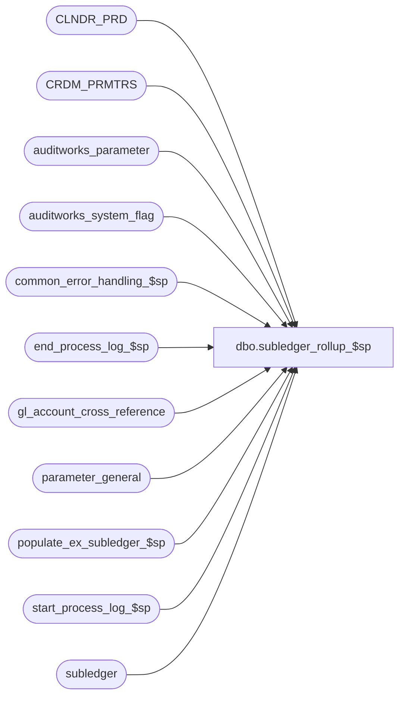

# dbo.subledger_rollup_$sp

**Database:** auditworks_external  
**Server:** bedrockdb01  

## Architecture Diagram



## Table Dependencies

| Referenced Table |
|---|
| CLNDR_PRD |
| CRDM_PRMTRS |
| auditworks_parameter |
| auditworks_system_flag |
| common_error_handling_$sp |
| end_process_log_$sp |
| gl_account_cross_reference |
| parameter_general |
| populate_ex_subledger_$sp |
| start_process_log_$sp |
| subledger |

## Stored Procedure Code

```sql
create proc dbo.subledger_rollup_$sp 
AS

/* Proc Name: subledger_rollup_$sp
** Desc: To rollup the subledger account amounts by subledger_rollup_types
** 	 on account number for a specified number of periods.
** 	 Called from period_end_$sp.

HISTORY
Date       Name               Def#  Desc
Feb05,15   Paul S            94760  check whether running in external archive db
Jun20,14   Ian K             63833  If external archive in use then copy details over before purging
Jan21,14   Paul             147019  Use try catch, use TOP for SQL 2014 compatability
Feb06,12   Paul S           132468  improved performance for large volume sites, removed obsolete temp table and cursor
Jan12,12   Paul S           132256  added print statements, check calendar existence
Nov06,06   Paul              74790  read CRDM_PRMTRS to get CLNDR_ID
May04,05   Sab             DV-1254  For scaleout, added logic to allow peripheral servers to rollup subledger.
Dec14,04   David           DV-1191  Improve performance by adding hints.
May12,04   David           DV-1071  Use new Calendar table.
Nov24,03   David     1-QR0OH/19200  Add BEGIN TRANSACTION before DELETE subledger
Jun03,02   Winnie          1-CD0IX  standardize R3.5 error handling.
Nov30,2001 Phu                8931  Error handling
Jul18,2001 Shapoor            8076  Add new fields that were added to the subledger table into the rollup.
Jun05,2001 Shapoor            7568  Correct the logic of the purge of subledger periods retained and 
                                    move the cleanup from day_end_purge_$sp to subledger_rollup_$sp.
Mar01,2000 Phu                5900  Change @@fetch_status > 0 to @@fetch_status <> 0 for MS SQL compatibility
*/

DECLARE
	@calendar_date				smalldatetime,
	@clndr_id				binary(16),
	@counter				int,
	@cursor_open				tinyint,
	@cutoff_date 				smalldatetime,
	@delete_before_date			smalldatetime,
	@errline				int,
	@errmsg 				nvarchar(2000),
	@errmsg2 				nvarchar(2000),
	@errmsg3 				nvarchar(2000),
	@errno 					int,
	@external_archive_flag			int,
	@external_archive_in_use			int,
	@ext_subledger_periods			int,
	@instance_id				int,
	@last_date_closed			smalldatetime,
	@lvl_month				binary(16),
	@maxdate 				smalldatetime,
	@max_subledger_date			smalldatetime,
	@mindate 				smalldatetime,
	@message_id				int,
	@object_name				nvarchar(255),
	@operation_name				nvarchar(100),
	@period 				tinyint,
	@period_ending_date 			smalldatetime,
	@period_end_date			smalldatetime,
	@periods_to_delete			int,
	@posting_status 			tinyint,
	@process_log_entry 			tinyint,
	@process_name				nvarchar(100),
	@process_no 				smallint,
	@process_timestamp 			float,
	@rows 					int,
	@row_count				int,
	@scaleout_flag				int,
	@subledger_periods			int,
	@trace_msg				nvarchar(255),
	@transaction_count 			numeric(12,0),
	@transaction_date				smalldatetime;

SELECT 	@posting_status = 1,
	@process_no = 207,
	@process_log_entry = 0,
	@process_timestamp = 0,
	@transaction_count = 0,
	@external_archive_in_use = 0,
	@external_archive_flag = 0,
	@message_id = 201068,
	@process_name = 'subledger_rollup_$sp';

BEGIN TRY

      SELECT @errmsg = 'Unable to select from parameter_general',
	     @object_name = 'parameter_general',
	     @operation_name = 'SELECT';
  SELECT @last_date_closed  = last_date_closed,
         @period_end_date   = period_end_date,
         @subledger_periods = subledger_periods
    FROM parameter_general;

  SELECT @errmsg = 'Unable to select calendar id',
           @object_name = 'CRDM_PRMTRS',
           @operation_name = 'SELECT';
SELECT @clndr_id = PRMTR_VAL_BIN
  FROM CRDM_PRMTRS
 WHERE PRMTR_NAME = 'GL_PSTNG_CLNDR_ID';

SELECT @rows = @@rowcount;
IF @rows = 0 OR @clndr_id IS NULL
  BEGIN
   SELECT @errno = 201612;
   GOTO business_error;
  END;

    SELECT @errmsg = 'Unable to select month level type id',
           @object_name = 'auditworks_parameter';
SELECT @lvl_month = par_bin_value
    FROM auditworks_parameter
   WHERE par_name = 'clndr_lvl_month';

SELECT @rows = @@rowcount;
IF @rows = 0
  BEGIN
    SELECT @errno = 201612;
    GOTO business_error;
  END;

/* Check whether external database is in use */

  SELECT @errmsg = 'Unable to select external_archive_in_use from auditworks_system_flag',
	 @object_name = 'auditworks_system_flag';
SELECT @external_archive_in_use = flag_numeric_value
  FROM auditworks_system_flag
 WHERE flag_name = 'external_archive_in_use';

IF @external_archive_in_use IS NULL
  SELECT @external_archive_in_use = 0;

  SELECT @errmsg = 'Unable to select external_archive_flag';
SELECT @external_archive_flag = flag_numeric_value
  FROM auditworks_system_flag
 WHERE flag_name = 'external_archive_flag';
  
  SELECT @errmsg = 'Failed to select scaleout_flag from auditworks_system_flag';
SELECT @scaleout_flag = CONVERT(int,flag_numeric_value)
  FROM auditworks_system_flag
 WHERE flag_name = 'scaleout_flag';

  SELECT @errmsg = 'Failed to select instance_id from auditworks_system_flag';
SELECT @instance_id = CONVERT(int,flag_numeric_value)
 FROM auditworks_system_flag
   WHERE flag_name = 'instance_id';

  SELECT @errmsg = 'Unable to select ext_archive_days_retained',
	 @object_name = 'auditworks_parameter',
	 @operation_name = 'SELECT';
SELECT @ext_subledger_periods = CONVERT(int,par_value)
  FROM auditworks_parameter
  WHERE par_name = 'ext_subledger_periods';

/* If running in external archive db, use retention days for extended archive subledger */

IF @external_archive_flag = 1
  SELECT @subledger_periods = @ext_subledger_periods;

IF @scaleout_flag = 1 AND @instance_id <> 0
    SELECT @posting_status = 0;

SELECT @trace_msg = CHAR(13) + CHAR(10) + ':LOG ===> Subledger Purge Batching Begins : ' + CONVERT(char, getdate(), 8);
PRINT @trace_msg;

      SELECT @errmsg = 'Unable to find calendar entries (max_subledger_date)',
	     @object_name = 'CLNDR_PRD',
	     @operation_name = 'SELECT';
  SELECT @max_subledger_date = DATEADD( dd, -1, CONVERT(SMALLDATETIME, CONVERT(NVARCHAR, MAX(END_DATE_TIME), 101)) )
    FROM CLNDR_PRD
   WHERE CLNDR_ID = @clndr_id
     AND CLNDR_LVL_TYPE_ID = @lvl_month
     AND CONVERT(SMALLDATETIME, CONVERT(NVARCHAR, END_DATE_TIME, 101)) <= @last_date_closed;

  IF @max_subledger_date IS NULL
    BEGIN
      SELECT @errmsg = 'Unable to find calendar entries (max_subledger_date)',
	     @object_name = 'CLNDR_PRD',
	     @operation_name = 'SELECT',
	     @errno = 201612;
      GOTO business_error;
    END;

	SELECT @errmsg = 'Unable to create table #rollup_summary',
	       @object_name = '#rollup_summary',
	       @operation_name = 'CREATE';
  CREATE TABLE #rollup_summary (   
	fiscal_year 			smallint 	not null,
	period 				tinyint 	not null,
	gl_company 			tinyint 	not null,
	gl_account_id 			int 		not null,
	store_no 			int 		not null,
	transaction_date 		smalldatetime 	not null,
	transaction_category 		tinyint 	not null,
	line_object 			smallint 	not null,
	line_action 			tinyint 	not null,
	amount 				money 		not null,
	units 				real 		not null,
	transaction_qty 		int 		not null,
	store_balance_group 		tinyint 	not null,
        posting_datetime                datetime        default getdate() not null,
        data_source                     tinyint         not null  );

	 SELECT @errmsg = 'Unable to create table #cal_date',
	       @object_name = '#cal_date';
  CREATE TABLE #cal_date (
	calendar_date 			smalldatetime 	not null,
	period_ending_date 		smalldatetime 	not null );

	 SELECT @errmsg = 'Unable to create table #subledger_dates',
	       @object_name = '#subledger_dates';
  CREATE TABLE #subledger_dates (   
	fiscal_year 		smallint 	not null,
	period 			tinyint		not null,
	transaction_date		smalldatetime	not null);

	SELECT @errmsg = 'Unable to create table #subledger_periods',
	       @object_name = '#subledger_periods';
  CREATE TABLE #subledger_periods (   
	fiscal_year 		smallint 	not null,
	period 			tinyint		not null,
	period_end_date		smalldatetime	not null);
  
	SELECT @errmsg = 'Unable to create table #subledger_purge',
	       @object_name = '#subledger_purge';
  CREATE TABLE #subledger_purge (   
	transaction_date  smalldatetime  not null,
	row_count         int            not null);

/* TODO: May need to make logic smarter for external archive db to look only at older dates beyond regular subledger retention.
   Subledger in external db is at detail level rather than rolled up. just purge older rows ? */
  
  /* Populate #subledger_periods with a list of existing periods with their period ending dates for all closed periods.
     Will use 2 steps in order to maximize performance for high volume sites. */

	SELECT @errmsg = 'Unable to insert into table #subledger_dates',
	       @object_name = '#subledger_dates',
	       @operation_name = 'INSERT';
  INSERT INTO #subledger_dates (
                fiscal_year,
                period,
                transaction_date)
  SELECT DISTINCT fiscal_year,
                    period,
                    transaction_date
    FROM subledger WITH (NOLOCK)
   WHERE transaction_date <= @max_subledger_date;

	SELECT @errmsg = 'Unable to insert into table #subledger_periods',
	       @object_name = '#subledger_periods',
	       @operation_name = 'INSERT';
  INSERT #subledger_periods (
	fiscal_year,
	period,
	period_end_date)
  SELECT DISTINCT 
	s.fiscal_year,
	s.period,
	DATEADD( dd, -1, CONVERT(SMALLDATETIME, CONVERT(NVARCHAR, c.END_DATE_TIME, 101)) )
    FROM #subledger_dates s WITH (NOLOCK), CLNDR_PRD c WITH (NOLOCK)
   WHERE c.CLNDR_ID = @clndr_id
     AND c.CLNDR_LVL_TYPE_ID = @lvl_month
     AND s.transaction_date >= c.STRT_DATE_TIME 
     AND s.transaction_date < c.END_DATE_TIME;

  SELECT @row_count = @@rowcount;

  DROP TABLE #subledger_dates;

  IF @row_count > @subledger_periods
  BEGIN /* old periods exist in subledger that need to be purged */

    SELECT @trace_msg = CHAR(13) + CHAR(10) + ':LOG ===> Subledger Purge Begins : ' + CONVERT(char, getdate(), 8);
    PRINT @trace_msg;
  
    SELECT @periods_to_delete = @row_count - @subledger_periods,
    	   @counter = 1;
 
    /* STEP 1 : Purge oldest dates from subledger after determining the latest period ending date (delete_before_date) 
                for the periods to be purged.
	        Then all entries in subledger with a tran date <= @delete_before_date will be purged. */

    WHILE 1=1  
    BEGIN
      SELECT @delete_before_date = MIN(period_end_date)
        FROM #subledger_periods WITH (NOLOCK);

	  SELECT @errmsg = 'Unable to delete #subledger_periods',
		 @object_name = '#subledger_periods',
		 @operation_name = 'DELETE';
      DELETE #subledger_periods
       WHERE period_end_date = @delete_before_date;

      SELECT @counter = @counter + 1; 
        
      IF @counter  > @periods_to_delete  
        BREAK;
    END; -- WHILE 1=1

    IF @external_archive_in_use = 1 AND @external_archive_flag = 0
      BEGIN
       /* Copy subledger details that are about to be purged to external archive and then purge subledger */
        SELECT @errmsg = 'Unable to exec populate_ex_subledger_$sp',
		 @object_name = 'populate_ex_subledger_$sp',
		 @operation_name = 'EXECUTE';
        EXEC populate_ex_subledger_$sp @delete_before_date;
      END;
    ELSE
    BEGIN 
    -- build a work table for batching
         SELECT @errmsg = 'Failed to populate #subledger_purge.',
                 @object_name = '#subledger_purge',
                 @operation_name = 'INSERT';
      INSERT INTO #subledger_purge ( 
             transaction_date,
             row_count )
      SELECT transaction_date,
             COUNT(1)
        FROM subledger
       WHERE transaction_date <= @delete_before_date
       GROUP BY transaction_date;  

      SELECT @rows = SUM(row_count)
        FROM #subledger_purge;

      SELECT @errmsg = 'Failed to delete from Subledger.',
                 @object_name = 'subledger',
                 @operation_name = 'DELETE';

      IF @rows <= 20000
        BEGIN
         DELETE subledger
          WHERE transaction_date <= @delete_before_date;
        END;
      ELSE
       BEGIN
         SELECT @errmsg         = 'Failed to open date_list_crsr on #subledger_purge',
             @object_name   = 'date_list_crsr',
             @operation_name = 'OPEN';

        DECLARE date_list_crsr CURSOR FAST_FORWARD
        FOR SELECT transaction_date
            FROM #subledger_purge WITH (NOLOCK)
            ORDER BY transaction_date;

        OPEN date_list_crsr;

        SELECT @cursor_open = 1;

        SELECT @errmsg = 'Failed to delete one date from Subledger.',
                 @object_name = 'subledger',
                 @operation_name = 'DELETE';

        WHILE 2=2 -- delete subledger while batching by transaction_date
        BEGIN
         FETCH date_list_crsr INTO @transaction_date;

         IF @@fetch_status <> 0
           BREAK;

         SELECT @rows = 20000;

         WHILE @rows = 20000
         BEGIN
             -- this top will find rows in an order determined by the query plan
           DELETE TOP(20000) FROM subledger
            WHERE transaction_date = @transaction_date;

           SELECT @rows = @@rowcount;
         END; -- While @rows = 20000

        END; -- while 2=2

        CLOSE date_list_crsr;
        DEALLOCATE date_list_crsr;
        SELECT @cursor_open = 0;

      END; -- else of If @rows <= 20000
 
    END; -- else of if @external_archive_in_use = 1
  
  END; -- IF @row_count > @subledger_periods


  DROP TABLE #subledger_periods;

  IF @external_archive_flag = 1 /* there is no need to rollup subledger inside the external archive db, since it was already previously rolled up in SA */
    RETURN;


/* ********************************************************************************************
   STEP 2 : Subledger Rollup STARTS HERE
            Create summary rows and remove the associated detail rows for dates in periods that are older
            than the retention duration for subledger details. */

	SELECT @errmsg = 'Unable to select from parameter_general',
	       @object_name = 'parameter_general',
	       @operation_name = 'SELECT';

  SELECT @period = subledger_detail_periods,
 	 @cutoff_date = last_date_closed 
    FROM parameter_general;


  WHILE @period > 0
  BEGIN
	    SELECT @errmsg = 'Unable to get Max Date',
		   @object_name = 'CLNDR_PRD',
		   @operation_name = 'SELECT';
    SELECT @maxdate = DATEADD( dd, -1, CONVERT(SMALLDATETIME, CONVERT(NVARCHAR, MAX(END_DATE_TIME), 101)) )
      FROM CLNDR_PRD
     WHERE CLNDR_ID = @clndr_id
       AND CLNDR_LVL_TYPE_ID = @lvl_month
       AND CONVERT(SMALLDATETIME, CONVERT(NVARCHAR, END_DATE_TIME, 101)) <= @cutoff_date;

      SELECT @cutoff_date = @maxdate,
 	     @period = @period - 1;
  END; -- While @period > 0

      SELECT @errmsg = 'Unable to select from subledger',
	     @object_name = 'subledger',
	     @operation_name = 'SELECT';
  SELECT @mindate = MIN (transaction_date),
	 @maxdate = MAX (transaction_date)
    FROM subledger WITH (NOLOCK)
   WHERE transaction_date <= @cutoff_date
     AND posting_status = @posting_status;

  SELECT @rows = @@rowcount;

  IF @rows <= 0
    RETURN;

  SELECT @trace_msg = CHAR(13) + CHAR(10) + ':LOG ===> Subledger Rollup Begins : ' + CONVERT(char, getdate(), 8);
  PRINT @trace_msg;

  SELECT @calendar_date      = DATEADD (day, -1, @mindate),
         @period_ending_date = DATEADD (day, -1, @mindate);

  WHILE @calendar_date < @maxdate
  BEGIN

    SELECT @calendar_date = DATEADD (day, 1, @calendar_date);

    IF @calendar_date > @period_ending_date
    BEGIN
        SELECT @errmsg = 'Unable to find period ending date in calendar',
               @object_name = 'CLNDR_PRD',
               @operation_name = 'SELECT';
      SELECT @period_ending_date = DATEADD (day, -1, CONVERT (SMALLDATETIME, CONVERT (NVARCHAR, END_DATE_TIME, 101)) )
        FROM CLNDR_PRD
       WHERE CLNDR_ID          = @clndr_id
         AND CLNDR_LVL_TYPE_ID = @lvl_month
         AND STRT_DATE_TIME   <= @calendar_date
         AND END_DATE_TIME     > @calendar_date;

      IF @period_ending_date IS NULL
      BEGIN
        SELECT @errno = 201612;
        GOTO business_error;
      END;
    END; -- IF @calendar_date > @period_ending_date

        SELECT @errmsg = 'Unable to insert calendar date',
               @object_name = '#cal_date',
               @operation_name = 'INSERT';
    INSERT #cal_date (
	   calendar_date,
	   period_ending_date )
    VALUES (@calendar_date,
	    @period_ending_date );

  END; -- WHILE @calendar_date < @maxdate


/* Remove store detail */
	SELECT @errmsg = 'Unable to insert #rollup_summary for subledger_rollup_type = 1',
	       @object_name = '#rollup_summary',
	       @operation_name = 'INSERT';
  INSERT #rollup_summary (
	fiscal_year,
	period,
	gl_company,
	gl_account_id,
	store_no,
	transaction_date,
	transaction_category,
	line_object,
	line_action,
	amount,
	units,
	transaction_qty,
	store_balance_group,
        posting_datetime,
        data_source )
 SELECT s.fiscal_year,
	s.period,
	s.gl_company,
	s.gl_account_id,
	-1,
	s.transaction_date,
	s.transaction_category,
	s.line_object,
	s.line_action,
	SUM (s.amount),
	SUM (s.units),
	SUM (s.transaction_qty),
	s.store_balance_group,
        MAX(s.posting_datetime),
        s.data_source
   FROM subledger s WITH (NOLOCK), gl_account_cross_reference g
  WHERE s.gl_account_id = g.gl_account_id
    AND s.transaction_date >= @mindate
    AND s.transaction_date <= @maxdate
    AND s.posting_status = @posting_status
    AND g.subledger_rollup_type = 1
  GROUP BY
	s.fiscal_year,
	s.period,
	s.gl_company,
	s.gl_account_id,
	s.transaction_date,
	s.transaction_category,
	s.line_object,
	s.line_action,
	s.store_balance_group,
	s.data_source;

  SELECT @transaction_count = @transaction_count + @@rowcount;

/* Remove date detail */
      SELECT @errmsg = 'Unable to insert #rollup_summary for subledger_rollup_type = 2',
	     @object_name = '#rollup_summary',
	     @operation_name = 'INSERT';
  INSERT #rollup_summary (
	fiscal_year,
	period,
	gl_company,
	gl_account_id,
	store_no,
	transaction_date,
	transaction_category,
	line_object,
	line_action,
	amount,
	units,
	transaction_qty,
	store_balance_group,
        posting_datetime,
        data_source )
 SELECT s.fiscal_year,
	s.period,
	s.gl_company,
	s.gl_account_id,
	s.store_no,
	c.period_ending_date,
	s.transaction_category,
	s.line_object,
	s.line_action,
	SUM (s.amount),
	SUM (s.units),
	SUM (s.transaction_qty),
	s.store_balance_group,
        MAX(s.posting_datetime),
        s.data_source
   FROM #cal_date c WITH (NOLOCK), subledger s WITH (NOLOCK), gl_account_cross_reference g
  WHERE c.calendar_date = s.transaction_date
    AND s.gl_account_id = g.gl_account_id
    AND s.posting_status = @posting_status
    AND g.subledger_rollup_type = 2
  GROUP BY
	s.fiscal_year,
	s.period,
	s.gl_company,
	s.gl_account_id,
	s.store_no,
	c.period_ending_date,
	s.transaction_category,
	s.line_object,
	s.line_action,
	s.store_balance_group,
	s.data_source;

  SELECT @transaction_count = @transaction_count + @@rowcount;

/* Remove store-date detail */
	SELECT @errmsg = 'Unable to insert #rollup_summary for subledger_rollup_type = 3',
	       @object_name = '#rollup_summary',
	       @operation_name = 'INSERT';
  INSERT #rollup_summary (
	fiscal_year,
	period,
	gl_company,
	gl_account_id,
	store_no,
	transaction_date,
	transaction_category,
	line_object,
	line_action,
	amount,
	units,
	transaction_qty,
	store_balance_group,
	posting_datetime,
	data_source )
  SELECT  s.fiscal_year,
	s.period,
	s.gl_company,
	s.gl_account_id,
	-1,
	c.period_ending_date,
	s.transaction_category,
	s.line_object,
	s.line_action,
	SUM (s.amount),
	SUM (s.units),
	SUM (s.transaction_qty),
	s.store_balance_group,
	MAX(s.posting_datetime),
	s.data_source
   FROM #cal_date c WITH (NOLOCK), subledger s WITH (NOLOCK), gl_account_cross_reference g
  WHERE c.calendar_date = s.transaction_date
    AND s.gl_account_id = g.gl_account_id
    AND s.posting_status = @posting_status
    AND g.subledger_rollup_type = 3
  GROUP BY
	s.fiscal_year,
	s.period,
	s.gl_company,
	s.gl_account_id,
	c.period_ending_date,
	s.transaction_category,
	s.line_object,
	s.line_action,
	s.store_balance_group,
	s.data_source;

  SELECT @transaction_count = @transaction_count + @@rowcount;

/* Remove transaction_category-object-action detail */
	SELECT @errmsg = 'Unable to insert #rollup_summary for subledger_rollup_type = 4',
	       @object_name = '#rollup_summary',
	       @operation_name = 'INSERT';
  INSERT #rollup_summary (
	fiscal_year,
	period,
	gl_company,
	gl_account_id,
	store_no,
	transaction_date,
	transaction_category,
	line_object,
	line_action,
	amount,
	units,
	transaction_qty,
	store_balance_group,
        posting_datetime,
        data_source )
  SELECT  s.fiscal_year,
	s.period,
	s.gl_company,
	s.gl_account_id,
	s.store_no,
	s.transaction_date,
	252,
	-1,
	38,
	SUM (s.amount),
	SUM (s.units),
	SUM (s.transaction_qty),
	s.store_balance_group,
        MAX(s.posting_datetime),
        s.data_source
   FROM subledger s WITH (NOLOCK), gl_account_cross_reference g
  WHERE s.gl_account_id = g.gl_account_id 
    AND s.transaction_date >= @mindate
    AND s.transaction_date <= @maxdate
    AND s.posting_status = @posting_status
    AND g.subledger_rollup_type = 4
  GROUP BY
	s.fiscal_year,
	s.period,
	s.gl_company,
	s.gl_account_id,
	s.store_no,
	s.transaction_date,
	s.store_balance_group,
        s.data_source;

  SELECT @transaction_count = @transaction_count + @@rowcount;

/* Remove date-transaction_category-object-action detail */
	SELECT @errmsg = 'Unable to insert #rollup_summary for subledger_rollup_type = 5',
	       @object_name = '#rollup_summary',
	       @operation_name = 'INSERT';
  INSERT #rollup_summary (
	fiscal_year,
	period,
	gl_company,
	gl_account_id,
	store_no,
	transaction_date,
	transaction_category,
	line_object,
	line_action,
	amount,
	units,
	transaction_qty,
	store_balance_group,
        posting_datetime,
        data_source ) 
SELECT  s.fiscal_year,
	s.period,
	s.gl_company,
	s.gl_account_id,
	s.store_no,
	c.period_ending_date,
	252,
	-1,
	38,
	SUM (s.amount),
	SUM (s.units),
	SUM (s.transaction_qty),
	s.store_balance_group,
        MAX(s.posting_datetime),
        s.data_source
   FROM #cal_date c WITH (NOLOCK), subledger s WITH (NOLOCK), gl_account_cross_reference g
  WHERE c.calendar_date = s.transaction_date
    AND s.gl_account_id = g.gl_account_id
    AND s.posting_status = @posting_status
    AND g.subledger_rollup_type = 5
  GROUP BY
	s.fiscal_year,
	s.period,
	s.gl_company,
	s.gl_account_id,
	s.store_no,
	c.period_ending_date,
	s.store_balance_group,
        s.data_source;

  SELECT @transaction_count = @transaction_count + @@rowcount;

/* Remove store-transaction_category-object-action detail */
      SELECT @errmsg = 'Unable to insert #rollup_summary for subledger_rollup_type = 6',
	     @object_name = '#rollup_summary',
	     @operation_name = 'INSERT';
  INSERT #rollup_summary (
	fiscal_year,
	period,
	gl_company,
	gl_account_id,
	store_no,
	transaction_date,
	transaction_category,
	line_object,
	line_action,
	amount,
	units,
	transaction_qty,
	store_balance_group,
        posting_datetime,
        data_source )
 SELECT s.fiscal_year,
	s.period,
	s.gl_company,
	s.gl_account_id,
	-1,
	s.transaction_date,
	252,
	-1,
	38,
	SUM (s.amount),
	SUM (s.units),
	SUM (s.transaction_qty),
	s.store_balance_group,
        MAX(s.posting_datetime),
        s.data_source
   FROM subledger s WITH (NOLOCK), gl_account_cross_reference g
  WHERE s.gl_account_id = g.gl_account_id 
    AND s.transaction_date >= @mindate
    AND s.transaction_date <= @maxdate
    AND s.posting_status = @posting_status
    AND g.subledger_rollup_type = 6
  GROUP BY
	s.fiscal_year,
	s.period,
	s.gl_company,
	s.gl_account_id,
	s.transaction_date,
	s.store_balance_group,
        s.data_source;

  SELECT @transaction_count = @transaction_count + @@rowcount;

/* Remove all details */

      SELECT @errmsg = 'Unable to insert #rollup_summary for subledger_rollup_type = 7',
	     @object_name = '#rollup_summary',
	     @operation_name = 'INSERT';
  INSERT #rollup_summary (
	fiscal_year,
	period,
	gl_company,
	gl_account_id,
	store_no,
	transaction_date,
	transaction_category,
	line_object,
	line_action,
	amount,
	units,
	transaction_qty,
	store_balance_group,
        posting_datetime,
        data_source )
 SELECT s.fiscal_year,
	s.period,
	s.gl_company,
	s.gl_account_id,
	-1,
	c.period_ending_date,
	252,
	-1,
	38,
	SUM (s.amount),
	SUM (s.units),
	SUM (s.transaction_qty),
	s.store_balance_group,
        MAX(s.posting_datetime),
        s.data_source
   FROM #cal_date c WITH (NOLOCK), subledger s WITH (NOLOCK), gl_account_cross_reference g
  WHERE c.calendar_date = s.transaction_date
    AND s.gl_account_id = g.gl_account_id
    AND s.posting_status = @posting_status
    AND g.subledger_rollup_type = 7
  GROUP BY
	s.fiscal_year,
	s.period,
	s.gl_company,
	s.gl_account_id,
	c.period_ending_date,
	s.store_balance_group,
        s.data_source;

  SELECT @transaction_count = @transaction_count + @@rowcount;

  IF @transaction_count <= 0
    RETURN;

  EXEC start_process_log_$sp @process_no, @process_timestamp OUTPUT, @errmsg3 OUTPUT;

  SELECT @process_log_entry = 1,
	       @errmsg = 'Unable to delete subledger',
	       @object_name = 'subledger',
	       @operation_name = 'DELETE';
  BEGIN TRAN;

  DELETE subledger
    FROM subledger s, gl_account_cross_reference g
   WHERE s.gl_account_id = g.gl_account_id 
     AND s.transaction_date >= @mindate
     AND s.transaction_date <= @maxdate
     AND s.posting_status = @posting_status
     AND g.subledger_rollup_type IN (1, 2, 3, 4, 5, 6, 7);

      SELECT @errmsg = 'Unable to insert subledger from #rollup_summary',
	       @operation_name = 'INSERT';
  INSERT subledger (
	fiscal_year,
	period,
	gl_company,
	gl_account_id,
	store_no,
	transaction_date,
	transaction_category,
	line_object,
	line_action,
	amount,
	units,
	transaction_qty,
	store_balance_group,
	posting_status,
         posting_datetime,
         data_source )
 SELECT fiscal_year,
	period,
	gl_company,
	gl_account_id,
	store_no,
	transaction_date,
	transaction_category,
	line_object,
	line_action,
	amount,
	units,
	transaction_qty,
	store_balance_group,
	2,
        posting_datetime,
        data_source
   FROM #rollup_summary WITH (NOLOCK);

  COMMIT;

  SELECT @trace_msg = NCHAR(13) + NCHAR(10) + ':LOG ===> Subledger Rollup Ends : ' + CONVERT(nchar, getdate(), 8);
  PRINT @trace_msg;

  EXEC end_process_log_$sp @process_no, @process_timestamp, @transaction_count;

  DROP TABLE #rollup_summary;
  DROP TABLE #subledger_purge;
  DROP TABLE #cal_date;


  RETURN;


business_error:   /* Business Rule handler. */

  SELECT @errmsg2 = @errmsg;

	/* Could include similar cleanup code to system error trap when needed (example is from move_store_$sp).
	   However, could also exclude the cleanup code here since the outer system error catch should fire again after the exec below. */

  EXEC common_error_handling_$sp @process_no, @errno, @errmsg, 0, @message_id, 
	  @process_name, @object_name, @operation_name, 1;
	  /* Note: when the exec above raises an error, that action also fires the system error trap (below) */
	RETURN;
END TRY

BEGIN CATCH; -- trap system errors
    /* common error handling. Appending proc name here because a rollback could occur if called within a transaction. */

  SELECT @errno = ERROR_NUMBER(),
		@errline = ERROR_LINE();

  SELECT @errmsg = CONVERT(nvarchar, @errno) + ':' + @process_name + ':' + CONVERT(nvarchar, @errline) + ':'
               + COALESCE(@errmsg, ' ') + ':' + ERROR_MESSAGE();

	 /* this condition will only be true when raise error in traps above fire this general catch */
  IF @errmsg2 IS NOT NULL
	  SELECT @errmsg = @errmsg2;

  IF @cursor_open = 1
  BEGIN
      CLOSE date_list_crsr;
      DEALLOCATE date_list_crsr;
  END;
  
  EXEC common_error_handling_$sp @process_no, @errno, @errmsg, 0, @message_id, 
	  @process_name, @object_name, @operation_name, 1;

  RETURN;
END CATCH;
```

