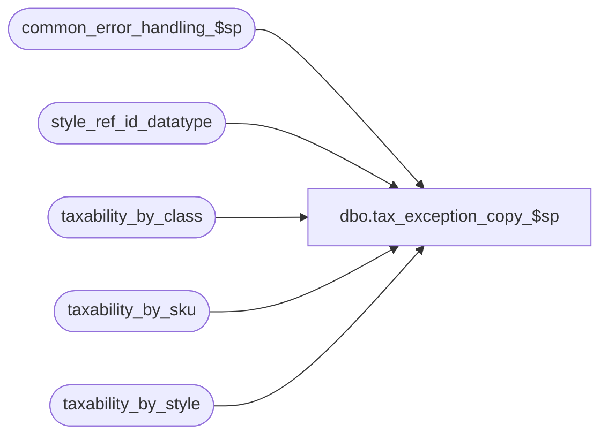

# dbo.tax_exception_copy_$sp

**Database:** auditworks_external  
**Server:** bedrockdb01  

## Architecture Diagram



## Table Dependencies

| Referenced Table |
|---|
| common_error_handling_$sp |
| style_ref_id_datatype |
| taxability_by_class |
| taxability_by_sku |
| taxability_by_style |

## Stored Procedure Code

```sql
create proc [dbo].[tax_exception_copy_$sp] @copy_tax_level tinyint = 0,  --0=all
@source_upc_lookup_division tinyint,
@source_class_code int = null,
@source_style_reference_id style_ref_id_datatype = null,
@source_sku_id numeric(14,0) = null,
@dest_upc_lookup_division tinyint,
@dest_class_code int = null,
@dest_style_reference_id style_ref_id_datatype = null,
@dest_sku_id numeric(14,0) = null
AS

/* Proc Name: tax_exception_copy_$sp
   DESC: To copy the taxability by class or style or sku definition of the source class, 
         style or sku specified to the class/style/SKU specified.
         Overlays original exception taxability settings for the destination.
         Called by Front-End.
   
HISTORY
Date     Name         Defect# Desc
MAR27,06 Vicci		68918 author
*/

DECLARE
@cursor_open			tinyint,
@errmsg				nvarchar(225),
@errno				INT,
@process_no			int,
@process_name		        nvarchar(100),
@message_id		        int,	
@object_name			nvarchar(255),
@operation_name			nvarchar(255),
@tax_jurisdiction		nchar(5), 
@tax_level			tinyint, 
@tax_rate_code			tinyint, 
@effective_from_date		smalldatetime, 
@effective_until_date		smalldatetime

SELECT @process_name = 'tax_exception_copy_$sp',
       @process_no = 0,
       @message_id = 201068,
       @object_name = 'unknown',
       @operation_name = 'unknown'

/* Delete any prior exception taxability settings of the destination class/style/sku */
IF @dest_class_code IS NOT NULL
BEGIN
  DECLARE dest_cursor CURSOR
  FOR
  SELECT DISTINCT tax_level, tax_jurisdiction, tax_rate_code, effective_from_date, effective_until_date
    FROM taxability_by_class
   WHERE class_code = @dest_class_code
     AND upc_lookup_division = @dest_upc_lookup_division
     AND (tax_level = @copy_tax_level OR @copy_tax_level = 0)
   ORDER BY effective_from_date DESC
  SELECT @errno = @@error
  IF @errno <> 0
  BEGIN
    SELECT @errmsg = 'Unable to declare taxability_by_class cursor',
           @object_name = 'dest_cursor',
           @operation_name = 'DECLARE'
    GOTO error
  END    

END --IF @dest_class_code IS NOT NULL
ELSE
BEGIN
  IF @dest_style_reference_id IS NOT NULL
  BEGIN
    DECLARE dest_cursor CURSOR
    FOR
    SELECT DISTINCT tax_level, tax_jurisdiction, tax_rate_code, effective_from_date, effective_until_date
      FROM taxability_by_style
     WHERE style_reference_id = @dest_style_reference_id
       AND upc_lookup_division = @dest_upc_lookup_division
       AND (tax_level = @copy_tax_level OR @copy_tax_level = 0)
     ORDER BY effective_from_date
    SELECT @errno = @@error
    IF @errno <> 0
    BEGIN
      SELECT @errmsg = 'Unable to declare taxability_by_style cursor',
             @object_name = 'dest_cursor',
             @operation_name = 'DECLARE'
      GOTO error
    END    
  END  --  IF @dest_style_reference_id IS NOT NULL
  ELSE
  BEGIN
    DECLARE dest_cursor CURSOR
    FOR
    SELECT DISTINCT tax_level, tax_jurisdiction, tax_rate_code, effective_from_date, effective_until_date
      FROM taxability_by_sku
     WHERE sku_id = @dest_sku_id
       AND upc_lookup_division = @dest_upc_lookup_division
       AND (tax_level = @copy_tax_level OR @copy_tax_level = 0)
     ORDER BY effective_from_date
    SELECT @errno = @@error
    IF @errno <> 0
    BEGIN
      SELECT @errmsg = 'Unable to declare taxability_by_sku cursor',
             @object_name = 'dest_cursor',
             @operation_name = 'DECLARE'
      GOTO error
    END    
  END --ELSE of IF @dest_style_reference_id IS NOT NULL
END -- ELSE of IF @class_code IS NOT NULL

OPEN dest_cursor
SELECT @cursor_open = 1
FETCH dest_cursor
 INTO @tax_level, @tax_jurisdiction, @tax_rate_code, @effective_from_date, @effective_until_date
  SELECT @errno = @@error
  IF @errno <> 0
  BEGIN
    SELECT @errmsg = 'Unable to fetch dest_cursor',
           @object_name = 'dest_cursor',
           @operation_name = 'FETCH'
    GOTO error
  END    

WHILE @@fetch_status = 0 
BEGIN
  IF @dest_class_code IS NOT NULL
  BEGIN
    DELETE taxability_by_class
     WHERE tax_jurisdiction = @tax_jurisdiction 
       AND class_code =   @dest_class_code 
       AND upc_lookup_division = @dest_upc_lookup_division 
       AND tax_level =  @tax_level 
       AND tax_rate_code = @tax_rate_code 
       AND effective_from_date = @effective_from_date 
       AND @effective_until_date = @effective_until_date 
    SELECT @errno = @@error
    IF @errno <> 0
    BEGIN
      SELECT @errmsg = 'Unable to delete taxability-by-class',
             @object_name = 'taxability_by_class',
             @operation_name = 'DELETE'
      GOTO error
    END    
  END --IF @dest_class_code IS NOT NULL
  ELSE
  BEGIN
    IF @dest_style_reference_id IS NOT NULL
    BEGIN
      DELETE taxability_by_style
       WHERE tax_jurisdiction = @tax_jurisdiction 
         AND style_reference_id =   @dest_style_reference_id 
         AND upc_lookup_division = @dest_upc_lookup_division 
         AND tax_level =  @tax_level 
         AND tax_rate_code = @tax_rate_code 
         AND effective_from_date = @effective_from_date 
         AND @effective_until_date = @effective_until_date 
      SELECT @errno = @@error
      IF @errno <> 0
      BEGIN
        SELECT @errmsg = 'Unable to delete taxability-by-style',
               @object_name = 'taxability_by_style',
               @operation_name = 'DELETE'
        GOTO error
      END    
    END --IF @dest_style_reference_id IS NOT NULL
    ELSE
    BEGIN
      IF @dest_sku_id IS NOT NULL
      BEGIN
        DELETE taxability_by_sku
         WHERE tax_jurisdiction = @tax_jurisdiction 
           AND sku_id =   @dest_sku_id 
           AND upc_lookup_division = @dest_upc_lookup_division 
           AND tax_level =  @tax_level 
           AND tax_rate_code = @tax_rate_code 
           AND effective_from_date = @effective_from_date 
           AND @effective_until_date = @effective_until_date 
        SELECT @errno = @@error
        IF @errno <> 0
        BEGIN
          SELECT @errmsg = 'Unable to delete taxability-by-sku',
                 @object_name = 'taxability_by_sku',
                 @operation_name = 'DELETE'
          GOTO error
        END    
      END --IF @dest_sku_id IS NOT NULL
    END --ELSE of IF @dest_style_reference_id IS NOT NULL
  END --ELSE of IF @dest_class_code IS NOT NULL

  FETCH dest_cursor
   INTO @tax_level, @tax_jurisdiction, @tax_rate_code, @effective_from_date, @effective_until_date
   SELECT @errno = @@error
   IF @errno <> 0
   BEGIN
     SELECT @errmsg = 'Unable to fetch dest_cursor again',
            @object_name = 'dest_cursor',
            @operation_name = 'FETCH'
     GOTO error
   END    

END /* while not end of dest_cursor */
CLOSE dest_cursor
DEALLOCATE dest_cursor 
SELECT @cursor_open = 0

/* Copy the exception taxability settings of the source class/style/sku 
   to the destination class/style/sku */
IF @source_class_code IS NOT NULL
BEGIN
  DECLARE source_cursor CURSOR
  FOR
  SELECT DISTINCT tax_level, tax_jurisdiction, tax_rate_code, effective_from_date, effective_until_date
    FROM taxability_by_class
   WHERE class_code = @source_class_code
     AND upc_lookup_division = @source_upc_lookup_division
     AND (tax_level = @copy_tax_level OR @copy_tax_level = 0)
   ORDER BY effective_from_date
END
ELSE
BEGIN
  IF @source_style_reference_id IS NOT NULL
  BEGIN
    DECLARE source_cursor CURSOR
    FOR
    SELECT DISTINCT tax_level, tax_jurisdiction, tax_rate_code, effective_from_date, effective_until_date
      FROM taxability_by_style
     WHERE style_reference_id = @source_style_reference_id
       AND upc_lookup_division = @source_upc_lookup_division
       AND (tax_level = @copy_tax_level OR @copy_tax_level = 0)
     ORDER BY effective_from_date
  END
  ELSE
  BEGIN
    DECLARE source_cursor CURSOR
  FOR
    SELECT DISTINCT tax_level, tax_jurisdiction, tax_rate_code, effective_from_date, effective_until_date
      FROM taxability_by_sku
     WHERE sku_id = @source_sku_id
       AND upc_lookup_division = @source_upc_lookup_division
       AND (tax_level = @copy_tax_level OR @copy_tax_level = 0)
     ORDER BY effective_from_date
  END
END

OPEN source_cursor
SELECT @cursor_open = 2

 FETCH source_cursor
  INTO @tax_level, @tax_jurisdiction, @tax_rate_code, @effective_from_date, @effective_until_date
  SELECT @errno = @@error
  IF @errno <> 0
  BEGIN
    SELECT @errmsg = 'Unable to fetch source_cursor',
           @object_name = 'source_cursor',
           @operation_name = 'FETCH'
    GOTO error
  END    

 WHILE @@fetch_status = 0 
 BEGIN
   IF @dest_class_code IS NOT NULL
   BEGIN
     INSERT into taxability_by_class(tax_jurisdiction,
                                class_code,
                                upc_lookup_division,
                                tax_level,
                                tax_rate_code,
                                effective_from_date,
                                effective_until_date)
     VALUES (@tax_jurisdiction,
     	     @dest_class_code,
     	     @dest_upc_lookup_division,
     	     @tax_level, 
     	     @tax_rate_code,
     	     @effective_from_date,
     	     @effective_until_date)
     SELECT @errno = @@error
     IF @errno <> 0
     BEGIN
       SELECT @errmsg = 'Unable to insert taxability_by_class',
              @object_name = 'taxability_by_class',
              @operation_name = 'INSERT'
       GOTO error
     END    
   END
   ELSE
   BEGIN
     IF @dest_style_reference_id IS NOT NULL
     BEGIN
       INSERT into taxability_by_style(tax_jurisdiction,
                                style_reference_id,
                                upc_lookup_division,
                                tax_level,
                                tax_rate_code,
                                effective_from_date,
                                effective_until_date)
       VALUES (@tax_jurisdiction,
     	     @dest_style_reference_id,
     	     @dest_upc_lookup_division,
     	     @tax_level, 
 	     @tax_rate_code,
     	     @effective_from_date,
     	     @effective_until_date)
       SELECT @errno = @@error
       IF @errno <> 0
       BEGIN
         SELECT @errmsg = 'Unable to insert taxability_by_style',
                @object_name = 'taxability_by_style',
                @operation_name = 'INSERT'
         GOTO error
       END    
     END
     ELSE
     BEGIN
       IF @dest_sku_id IS NOT NULL
       BEGIN
         INSERT into taxability_by_sku(tax_jurisdiction,
                                sku_id,
                                upc_lookup_division,
                                tax_level,
                                tax_rate_code,
                                effective_from_date,
                                effective_until_date)
         VALUES (@tax_jurisdiction,
     	     @dest_sku_id,
     	     @dest_upc_lookup_division,
     	     @tax_level, 
     	     @tax_rate_code,
     	     @effective_from_date,
     	     @effective_until_date)    
         SELECT @errno = @@error
         IF @errno <> 0
         BEGIN
           SELECT @errmsg = 'Unable to insert taxability_by_sku',
                  @object_name = 'taxability_by_sku',
                  @operation_name = 'INSERT'
           GOTO error
         END    
       END --IF @dest_sku_id IS NOT NULL
     END  --ELSE of IF @dest_style_reference_id IS NOT NULL
   END  --ELSE of IF @dest_class_code IS NOT NULL

  FETCH source_cursor
   INTO @tax_level, @tax_jurisdiction, @tax_rate_code, @effective_from_date, @effective_until_date
  SELECT @errno = @@error
  IF @errno <> 0
  BEGIN
    SELECT @errmsg = 'Unable to fetch source_cursor again',
           @object_name = 'source_cursor',
           @operation_name = 'FETCH'
    GOTO error
  END    


 END /* while not end of cursor */

CLOSE source_cursor
DEALLOCATE source_cursor 
SELECT @cursor_open = 0


RETURN

error:
	IF @cursor_open = 1
	BEGIN
	  CLOSE dest_cursor
	  DEALLOCATE dest_cursor
	END 

	IF @cursor_open = 2
	BEGIN
	  CLOSE source_cursor
	  DEALLOCATE source_cursor
	END 


	EXEC common_error_handling_$sp @process_no, @errno, @errmsg, 0, @message_id, 
	@process_name, @object_name, @operation_name, 1

	RETURN
```

