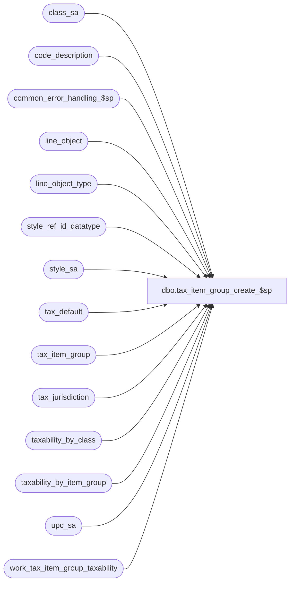

# dbo.tax_item_group_create_$sp

**Database:** auditworks_external  
**Server:** bedrockdb01  

## Architecture Diagram



## Table Dependencies

| Referenced Table |
|---|
| class_sa |
| code_description |
| common_error_handling_$sp |
| line_object |
| line_object_type |
| style_ref_id_datatype |
| style_sa |
| tax_default |
| tax_item_group |
| tax_jurisdiction |
| taxability_by_class |
| taxability_by_item_group |
| upc_sa |
| work_tax_item_group_taxability |

## Stored Procedure Code

```sql
create proc dbo.tax_item_group_create_$sp ( @errmsg		nvarchar(255) OUTPUT,
  @tax_item_group_id 	tinyint OUTPUT,
  @line_object		smallint,
  @auto_gen_datetime	datetime = null,
  @upc_lookup_division  tinyint = null,
  @class_code		int = null,
  @style_reference_id   style_ref_id_datatype = null,
  @sku_id		numeric(14,0) = null,
  @process_id		int = null)
AS

/* PROC NAME:   tax_item_group_create_$sp
**
** DESCRIPTION: Called by tax_item_group_gen_$sp.
** 		Create a new tax-item-group

HISTORY:
Date     Name      Def# Desc
Feb12,14 Vicci   149810 Exclude inactive jurisdictions.  
Sep06.06 Daphna   75320 MSSQL2005 prevent null strings
Jan09,06 Vicci	  68918 Author

*/

DECLARE
  @auto_gen_source			nvarchar(50),
  @base_language_id			smallint,
  @code					int,
  @errno		        	int,
  @function_no				tinyint,
  @item_group_count			int,
  @line_object_type			tinyint,
  @message_id				int,
  @new_tax_item_group_code		nvarchar(10),
  @object_name				nvarchar(255),
  @operation_name			nvarchar(100),
  @process_name				nvarchar(100),
  @tax_item_group_description  		nvarchar(50),
  @tax_item_group_code_prefix           nvarchar(10),
  @tax_item_group_descr_suffix          nvarchar(50),
  @user_name				nvarchar(25),
  @cursor_open				tinyint

SELECT @process_id = ISNULL(@process_id, @@spid), 
       @user_name = suser_sname(),
       @process_name = 'tax_item_group_create_$sp',
       @function_no = 209,
       @message_id = 201068,
       @auto_gen_source = 'line_object ' + convert(nvarchar, @line_object),
       @tax_item_group_description = null

/* To support multi-language, retrieve description from master tables which are in base language */
SELECT @tax_item_group_description = t.object_type_display_descr, @line_object_type = o.line_object_type
  FROM line_object o,
       line_object_type t
 WHERE o.line_object = @line_object
   AND o.line_object_type = t.line_object_type
SELECT @errno = @@error
IF @errno != 0
BEGIN
  SELECT @errmsg = 'Failed to find appropriate description for new tax-item-group',
         @object_name = 'line_object_type',
         @operation_name = 'SELECT'
  GOTO error
END

IF @line_object_type = 1
  SELECT @tax_item_group_code_prefix = 'M'
ELSE
  SELECT @tax_item_group_code_prefix = 'F'
  
IF @class_code IS NOT NULL
BEGIN
  SELECT @auto_gen_source = 'class_code ' + convert(nvarchar, @upc_lookup_division) + '.' + convert(nvarchar, @class_code)
  SELECT @tax_item_group_descr_suffix = convert(nvarchar, @class_code) + '- ' + ISNULL(class_description,'')
    FROM class_sa
   WHERE upc_lookup_division = @upc_lookup_division
     AND class_code = @class_code
  SELECT @errno = @@error
  IF @errno != 0
  BEGIN
    SELECT @errmsg = 'Failed to find appropriate description suffix for new tax-item-group',
           @object_name = 'class_sa',
           @operation_name = 'SELECT'
    GOTO error
  END
  
  IF @tax_item_group_descr_suffix = NULL
    SELECT @tax_item_group_descr_suffix = convert(nvarchar, @class_code)
END

IF @style_reference_id IS NOT NULL
BEGIN
  SELECT @auto_gen_source = 'style_reference_id ' + convert(nvarchar, @upc_lookup_division) + '.' + convert(nvarchar, @style_reference_id)
  SELECT @tax_item_group_descr_suffix = convert(nvarchar, @style_reference_id) + '- ' + ISNULL(style_code,'') + ' ' + ISNULL(style_short_description,'')
    FROM style_sa
   WHERE upc_lookup_division = @upc_lookup_division
     AND style_reference_id = @style_reference_id
  SELECT @errno = @@error
  IF @errno != 0
  BEGIN
    SELECT @errmsg = 'Failed to find appropriate description suffix for new tax-item-group for style',
           @object_name = 'style_sa',
           @operation_name = 'SELECT'
    GOTO error
  END

  IF @tax_item_group_descr_suffix = NULL
    SELECT @tax_item_group_descr_suffix = convert(nvarchar, @style_reference_id)
END

IF @sku_id IS NOT NULL
BEGIN
  SELECT @auto_gen_source = 'sku_id ' + convert(nvarchar, @upc_lookup_division) + '.' + convert(nvarchar, @sku_id)
  SELECT @tax_item_group_descr_suffix = convert(nvarchar, @sku_id) + '- ' + ISNULL(style_code,'') + ' ' + ISNULL(style_short_description,'') 
         + ' ' + ISNULL(prim_size_label,'')
    FROM upc_sa
   WHERE upc_lookup_division = @upc_lookup_division
     AND sku_id = @sku_id
  SELECT @errno = @@error
  IF @errno != 0
  BEGIN
    SELECT @errmsg = 'Failed to find appropriate description suffix for new tax-item-group for sku',
           @object_name = 'upc_sa',
           @operation_name = 'SELECT'
    GOTO error
  END

  IF @tax_item_group_descr_suffix = NULL
    SELECT @tax_item_group_descr_suffix = convert(nvarchar, @sku_id)
END
     
IF @tax_item_group_descr_suffix = NULL
BEGIN
  SELECT @tax_item_group_descr_suffix = code_display_descr
    FROM code_description
   WHERE code_type = 30
     AND code = 99
  SELECT @errno = @@error
  IF @errno != 0
  BEGIN
    SELECT @errmsg = 'Failed to find appropriate description suffix for new default tax-item-group',
           @object_name = 'code_description',
           @operation_name = 'SELECT'
    GOTO error
  END
END

SELECT @tax_item_group_description = @tax_item_group_description  + ' (' + @tax_item_group_descr_suffix + '...)'

IF @tax_item_group_id IS NULL
BEGIN
SELECT @code = max(convert(int, substring(tax_item_group_code, 2, 9))), @item_group_count = count(tax_item_group_id)
  FROM tax_item_group
 WHERE substring(tax_item_group_code, 1, 1) = @tax_item_group_code_prefix
   AND ISNUMERIC(substring(tax_item_group_code, 2, 9) ) = 1
   AND substring(tax_item_group_code, 2, 9) <> '0'
SELECT @errno = @@error
IF @errno != 0
BEGIN
  SELECT @errmsg = 'Failed to determine last tax item group code used',
         @object_name = 'tax_item_group',
         @operation_name = 'SELECT'
  GOTO error
END

IF @code IS NULL 
  SELECT @new_tax_item_group_code =   @tax_item_group_code_prefix + '1'
ELSE 
BEGIN
  SELECT @code = @code + 1
  IF @item_group_count + 1 < @code
  BEGIN
    SELECT @code = 1
    WHILE EXISTS (SELECT 1
        	    FROM tax_item_group
	           WHERE tax_item_group_code = @tax_item_group_code_prefix + convert(nvarchar, @code) )
    BEGIN
      SELECT @code = @code + 1
    END --WHILE @code < @item_group_count
  END --IF @item_group_count < @code

  SELECT @new_tax_item_group_code = @tax_item_group_code_prefix + convert(nvarchar, @code)
END --else of IF @code IS NULL 

INSERT into tax_item_group(tax_item_group_code,
                           tax_item_group_description,
                           line_object,
                           auto_gen_datetime,
                           auto_gen_source)
VALUES(@new_tax_item_group_code, @tax_item_group_description, @line_object, @auto_gen_datetime, @auto_gen_source)
SELECT @errno = @@error
IF @errno != 0
BEGIN
  SELECT @errmsg = 'Failed to create new tax-item-group',
         @object_name = 'tax_item_group',
         @operation_name = 'INSERT'
  GOTO error
END

SELECT @tax_item_group_id = tax_item_group_id
  FROM tax_item_group
 WHERE tax_item_group_code = @new_tax_item_group_code 
SELECT @errno = @@error
IF @errno != 0 
BEGIN
  SELECT @errmsg = 'Failed to determine the ID of the newly created tax-item-group',
         @object_name = 'tax_item_group',
         @operation_name = 'SELECT'
  GOTO error
END

IF @class_code IS NULL AND @style_reference_id IS NULL AND @sku_id IS NULL 
BEGIN
  INSERT INTO work_tax_item_group_taxability(process_id,
              tax_item_group_id,
	      tax_jurisdiction,
	      tax_level,
	      effective_from_date,
	      effective_until_date,
	      tax_rate_code,
	      source_code)
  SELECT @process_id, @tax_item_group_id,
     	 t.tax_jurisdiction,
     	 t.tax_level,
         t.effective_from_date,
     	 t.effective_until_date,
	 t.tax_rate_code,
	 'F'
    FROM tax_default t
         INNER JOIN tax_jurisdiction j
                ON t.tax_jurisdiction = j.tax_jurisdiction
               AND j.active_flag = 1
   WHERE t.line_object = @line_object
  SELECT @errno = @@error
  IF @errno != 0
  BEGIN
    SELECT @errmsg = 'Failed to log taxability of new tax-item-group',
           @object_name = 'work_tax_item_group_taxability',
           @operation_name = 'INSERT'
  GOTO error
  END
END --IF @class_code IS NULL

IF @class_code IS NOT NULL
BEGIN
  INSERT INTO work_tax_item_group_taxability(process_id,
              tax_item_group_id,
	      tax_jurisdiction,
	      tax_level,
	      effective_from_date,
	      effective_until_date,
	      tax_rate_code,
	      source_code)
  SELECT @process_id, @tax_item_group_id,
	 tax_jurisdiction,
         tax_level,
         effective_from_date,
         effective_until_date,
         tax_rate_code,
         source_code
    FROM #class_taxability
   WHERE upc_lookup_division = @upc_lookup_division
     AND class_code = @class_code
  SELECT @errno = @@error
  IF @errno != 0
  BEGIN
    SELECT @errmsg = 'Failed to log taxability of new tax-item-group for class',
           @object_name = 'work_tax_item_group_taxability',
           @operation_name = 'INSERT'
    GOTO error
  END
   
  INSERT into taxability_by_item_group(tax_jurisdiction,
                                     tax_item_group_id,
                                     tax_level,
                                     tax_rate_code,
                                     effective_from_date,
                                     effective_until_date)
  SELECT t.tax_jurisdiction,
	 @tax_item_group_id,
         t.tax_level,
         t.tax_rate_code,
         t.effective_from_date,
         t.effective_until_date
    FROM taxability_by_class t
         INNER JOIN tax_jurisdiction j
            ON t.tax_jurisdiction = j.tax_jurisdiction
           AND j.active_flag = 1
   WHERE t.upc_lookup_division = @upc_lookup_division
     AND t.class_code = @class_code
  SELECT @errno = @@error
  IF @errno != 0
  BEGIN
    SELECT @errmsg = 'Failed to log exception taxability of new tax-item-group for class',
           @object_name = 'taxability_by_item_group',
           @operation_name = 'INSERT'
    GOTO error
  END
    
END --IF @class_code IS NOT NULL

IF @style_reference_id IS NOT NULL
BEGIN
  INSERT INTO work_tax_item_group_taxability(process_id, 
              tax_item_group_id,
	      tax_jurisdiction,
	      tax_level,
	      effective_from_date,
	      effective_until_date,
	      tax_rate_code,
	      source_code)
  SELECT @process_id, @tax_item_group_id,
	 tax_jurisdiction,
         tax_level,
         effective_from_date,
         effective_until_date,
         tax_rate_code,
         source_code
    FROM #style_taxability
   WHERE upc_lookup_division = @upc_lookup_division
     AND style_reference_id = @style_reference_id
  SELECT @errno = @@error
  IF @errno != 0
  BEGIN
    SELECT @errmsg = 'Failed to log taxability of new tax-item-group for style',
           @object_name = 'work_tax_item_group_taxability',
           @operation_name = 'INSERT'
    GOTO error
  END
   
  INSERT into taxability_by_item_group(tax_jurisdiction,
                                     tax_item_group_id,
                                     tax_level,
                                     tax_rate_code,
                                     effective_from_date,
                                     effective_until_date)
  SELECT tax_jurisdiction,
	 @tax_item_group_id,
         tax_level,
         tax_rate_code,
         effective_from_date,
         effective_until_date
    FROM #style_taxability
   WHERE upc_lookup_division = @upc_lookup_division
     AND style_reference_id = @style_reference_id
     AND source_code like 'E%'
  SELECT @errno = @@error
  IF @errno != 0
  BEGIN
    SELECT @errmsg = 'Failed to log exception taxability of new tax-item-group for style',
 @object_name = 'taxability_by_item_group',
           @operation_name = 'INSERT'
    GOTO error
  END
END --IF @style_reference_id IS NOT NULL

IF @sku_id IS NOT NULL
BEGIN
  INSERT INTO work_tax_item_group_taxability(process_id, 
              tax_item_group_id,
	      tax_jurisdiction,
	      tax_level,
	      effective_from_date,
	      effective_until_date,
	      tax_rate_code,
	      source_code)
  SELECT @process_id, @tax_item_group_id,
	 tax_jurisdiction,
         tax_level,
         effective_from_date,
         effective_until_date,
         tax_rate_code,
         source_code
    FROM #sku_taxability
   WHERE upc_lookup_division = @upc_lookup_division
     AND sku_id = @sku_id
  SELECT @errno = @@error
  IF @errno != 0
  BEGIN
    SELECT @errmsg = 'Failed to log taxability of new tax-item-group for sku',
           @object_name = 'work_tax_item_group_taxability',
           @operation_name = 'INSERT'
    GOTO error
  END
   
  INSERT into taxability_by_item_group(tax_jurisdiction,
                                     tax_item_group_id,
                                     tax_level,
                                     tax_rate_code,
                                     effective_from_date,
                                     effective_until_date)
  SELECT tax_jurisdiction,
	 @tax_item_group_id,
         tax_level,
         tax_rate_code,
         effective_from_date,
         effective_until_date
    FROM #sku_taxability
   WHERE upc_lookup_division = @upc_lookup_division
     AND sku_id = @sku_id
     AND source_code like 'E%'
  SELECT @errno = @@error
  IF @errno != 0
  BEGIN
    SELECT @errmsg = 'Failed to log exception taxability of new tax-item-group for sku',
           @object_name = 'taxability_by_item_group',
           @operation_name = 'INSERT'
    GOTO error
  END
END --IF @sku_id IS NOT NULL

END --IF @tax_item_group_id IS NULL
ELSE --of IF @tax_item_group_id IS NULL
BEGIN
  UPDATE tax_item_group
     SET tax_item_group_description = @tax_item_group_description,
         auto_gen_datetime = @auto_gen_datetime,
         auto_gen_source = @auto_gen_source
   WHERE tax_item_group_id = @tax_item_group_id      
     AND auto_gen_datetime <> @auto_gen_datetime
     AND tax_item_group_description LIKE ' (' + substring(auto_gen_source, charindex('.', auto_gen_source) + 1, 50)
  SELECT @errno = @@error
  IF @errno != 0
  BEGIN
    SELECT @errmsg = 'Failed to modify description and auto-gen-source of tax-item-group no longer associated with item',
           @object_name = 'tax_item_group',
           @operation_name = 'UPDATE'
    GOTO error
  END
  UPDATE tax_item_group
     SET auto_gen_datetime = @auto_gen_datetime,
         auto_gen_source = @auto_gen_source
   WHERE tax_item_group_id = @tax_item_group_id      
     AND auto_gen_datetime <> @auto_gen_datetime
  SELECT @errno = @@error
  IF @errno != 0
  BEGIN
    SELECT @errmsg = 'Failed to modify auto-gen-source of tax-item-group no longer associated with item',
           @object_name = 'tax_item_group',
           @operation_name = 'UPDATE'
    GOTO error
  END

END --ELSE IF @tax_item_group_id IS NULL

RETURN

error:   /* Common error handler. */

	EXEC common_error_handling_$sp @function_no, @errno, @errmsg, 0, @message_id, 
	@process_name, @object_name, @operation_name, 0
	RETURN
```

