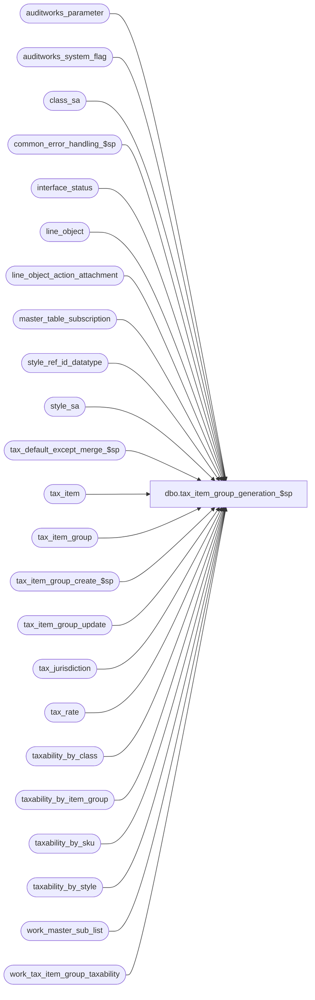

# dbo.tax_item_group_generation_$sp

**Database:** auditworks_external  
**Server:** bedrockdb01  

## Architecture Diagram



## Table Dependencies

| Referenced Table |
|---|
| auditworks_parameter |
| auditworks_system_flag |
| class_sa |
| common_error_handling_$sp |
| interface_status |
| line_object |
| line_object_action_attachment |
| master_table_subscription |
| style_ref_id_datatype |
| style_sa |
| tax_default_except_merge_$sp |
| tax_item |
| tax_item_group |
| tax_item_group_create_$sp |
| tax_item_group_update |
| tax_jurisdiction |
| tax_rate |
| taxability_by_class |
| taxability_by_item_group |
| taxability_by_sku |
| taxability_by_style |
| work_master_sub_list |
| work_tax_item_group_taxability |

## Stored Procedure Code

```sql
create proc dbo.tax_item_group_generation_$sp ( @interface_id    tinyint = NULL,
  @include_report  tinyint = 0
)

AS

/* Proc name:   tax_item_group_generation_$sp
** Description: Called by ICT_EXPORT01.
** 		Determines item taxability based on pre-existing taxability by line_object, 
** 		class, sku, style information (disregarding tax_item_group).
**		Determines item-group taxability based on pre-existing taxability by 
**		line_object, tax_item_group information.
**		Determines if item's current tax_item_group assignment meets its current
**              and historical taxability requirements.
**		If not finds another tax_item_group with compatible taxability or creates
**		a new tax_item_group if necessary.

HISTORY:
Date     Name      Def# Desc
Feb12,14 Vicci   149810 Exclude inactive jurisdictions.
Feb26,13 Vicci   142088 To avoid deadlocks, lock a shared flag prior to work_master_sub_list deletions.
Oct19,11 Vicci   130568 Handle SKU or STYLE level tax-item-group overrides being removed.  This happens when a taxability
                        by style or sku exception is removed since the only style,sku,classes evaluated to see if they need
                        to be attributed their own tax-item-group are those for which exceptions exist.
Apr07,11 Vicci   126078 Take master_table_subscription active flag into account.
Aug15,08 Paul    104042 make join compatible with SQL 2005
Sep07.06 Daphna   75320 MSSQL2005 prevent null string
Jul13,06 Maryam   69746 Fix the wrong number of parameters to was passed to tax_item_group_create_$sp in cases of 
                        class/style/sku reassignment. change if @rows = 1 to >=1 as there may be more than one upc
                        for the same sku. remove unnecessary @@rowcount.
Jan09,06 Vicci	  68918 Author

		Uses temp tables populated by tax_default_except_merge_$sp
*/

DECLARE
  @auto_gen_datetime			datetime,
  @db_id                       		int,
  @errno		        	int,
  @errmsg				nvarchar(255),
  @candidate_tax_item_group_id		numeric(10,0),
  @class_code				int,
  @code					nvarchar(9),
  @current_db_name             		nvarchar(30),
  @cursor_open				tinyint,
  @default_tax_item_group_id		numeric(10,0),
  @function_no				tinyint,
  @function_name	       		varbinary(128),
  @line_object				smallint,
  @last_posting_datetime       		datetime,
  @merge_type				tinyint,
  @message_id				int,
  @new_tax_item_group_code		nvarchar(10),
  @object_name				nvarchar(255),
  @operation_name			nvarchar(100),
  @par_value				nvarchar(1000),
  @process_id				int,
  @process_name				nvarchar(100),
  @new_assignment_code			numeric(20,0),
  @new_assignment_type			nvarchar(20),
  @retrieval_in_progress       		tinyint,
  @rows					int,
  @rows_locked				int,
  @style_reference_id			style_ref_id_datatype,
  @sku_id				numeric(14,0),
  @tax_item_group_id 			numeric(10,0),
  @taxability_rows			int,
  @upc_lookup_division			tinyint,
  @user_name				nvarchar(25),
  @rows_updated				int

IF @interface_id <> 17
  RETURN
  
SELECT @auto_gen_datetime = getdate(),
       @process_id = @@spid, 
       @current_db_name = db_name(),
       @user_name = suser_sname(),
       @process_name = 'tax_item_group_generation_$sp',
       @function_no = 209,
       @message_id = 201068,
       @merge_type = 3		--0:  merge tax default and taxability by item group;
			        --1:  merge tax default and taxability by item group, class;
				--2:  merge tax default, taxability by item group, class and style;
				--3:  merge tax default, taxability by item group, class, style and sku;

SELECT @function_name = convert(varbinary(128), @process_name)
SET CONTEXT_INFO @function_name

SELECT @retrieval_in_progress = retrieval_in_progress,
       @last_posting_datetime = last_posting_datetime
  FROM interface_status
 WHERE interface_id = @interface_id
SELECT @errno = @@error
IF @errno <> 0
BEGIN
  SELECT @errmsg = 'Failed to determine if tax-item-group auto-generation is in progress',
         @object_name = 'interface_status',
         @operation_name = 'SELECT'
  GOTO error
END

IF @retrieval_in_progress <> 0
BEGIN
  SELECT @db_id = dbid
    FROM master..sysprocesses
    WHERE spid = @@spid

  SELECT @errno = @@error
  IF @errno !=0
  BEGIN
    SELECT @errmsg = 'Unable to determine current database ID',
           @object_name = 'master..sysprocesses',
           @operation_name = 'SELECT'
    GOTO error
  END

  IF EXISTS (SELECT 1
              FROM master..sysprocesses
              WHERE context_info = @function_name
                AND spid <> @@spid
   AND dbid = @db_id
                AND db_name(dbid) = @current_db_name)
  BEGIN
    SELECT @message_id = 201682,
           @errno = 201682,
           @object_name = @process_name,
           @operation_name = 'SELECT',
           @errmsg = 'The stored procedure ' + @process_name + ' is currently running. Please verify.'
    GOTO error
  END
END  --IF @retrieval_in_progress <> 0

UPDATE interface_status
   SET retrieval_in_progress = 1, 
       last_retrieval_datetime = getdate()
 WHERE interface_id = @interface_id
SELECT @errno = @@error, @rows_locked = @@rowcount
IF @errno <> 0
BEGIN
  SELECT @errmsg = 'Failed to mark tax-time-group auto-generation as in-progress',
         @object_name = 'interface_status',
         @operation_name = 'UPDATE'
  GOTO error
END

DELETE work_tax_item_group_taxability
 WHERE process_id = @process_id
SELECT @errno = @@error
IF @errno <> 0
BEGIN
  SELECT @errmsg = 'Failed to clean work-table',
         @object_name = 'work_tax_item_group_taxability',
         @operation_name = 'DELETE'
  GOTO error
END

SELECT @par_value = substring(par_value, 1, 4)
  FROM auditworks_parameter p
 WHERE p.par_name = 'tax_item_group_auto_gen_object'
SELECT @errno = @@error
IF @errno != 0
BEGIN
  SELECT @errmsg = 'Failed to determine if a line-object has been defined to provide taxability defaults for the auto-gen process',
         @object_name = 'auditworks_parameter',
         @operation_name = 'SELECT'
  GOTO error
END

IF ISNUMERIC(@par_value) = 1 
  SELECT @line_object = convert(smallint, @par_value)
  
IF NOT EXISTS (SELECT 1 
                 FROM line_object o
                WHERE o.line_object = @line_object
                  AND o.line_object_type = 1)
BEGIN
  SELECT @errno = 202513,
         @errmsg = 'No merchandise line object has been defined for tax-item-group auto-generation.  Default taxability cannot be determined. Please define parameter.',
         @object_name = 'auditworks_parameter',
         @operation_name = 'SELECT'
  GOTO error
END

CREATE TABLE #class_taxability(
       class_code                    int not null,
       upc_lookup_division           tinyint not null,
       tax_jurisdiction              nchar(5) not null,
       tax_level                     tinyint not null,
       effective_from_date           smalldatetime not null,
       effective_until_date          smalldatetime null,
       tax_rate_code                 tinyint not null,
       source_code		     nvarchar(10) not null)
SELECT @errno = @@error
IF @errno != 0
BEGIN
  SELECT @errmsg = 'Failed to create temp table to receive results of merging taxability by class with tax-default',
         @object_name = '#class_taxability',
         @operation_name = 'CREATE'
  GOTO error
END

SELECT t.style_reference_id, t.upc_lookup_division, t.tax_jurisdiction, t.tax_level, t.effective_from_date, t.effective_until_date, t.tax_rate_code, convert(nvarchar(10), NULL) as source_code
  INTO #style_taxability
  FROM taxability_by_style t
 WHERE t.style_reference_id = -9999  --to handle style_ref_id_datatype
SELECT @errno = @@error
IF @errno != 0
BEGIN
  SELECT @errmsg = 'Failed to create temp table to receive results of merging taxability by class/style with tax-default',
    @object_name = '#style_taxability',
         @operation_name = 'CREATE'
  GOTO error
END

SELECT upc_lookup_division, style_reference_id, convert(numeric(14,0), NULL) sku_id, convert(int, NULL) class_code 
INTO #no_longer_exception
FROM tax_item_group_update
 WHERE style_reference_id = -9999  --to handle style_ref_id_datatype
SELECT @errno = @@error
IF @errno != 0
BEGIN
  SELECT @errmsg = 'Failed to create temp table to list of style, class, sku which are no longer tax exceptions',
         @object_name = '#no_longer_exception',
         @operation_name = 'CREATE'
  GOTO error
END


CREATE TABLE #sku_taxability(
       sku_id            	     numeric(14,0) not null,
       upc_lookup_division           tinyint not null,
       tax_jurisdiction              nchar(5) not null,
       tax_level                     tinyint not null,
       effective_from_date           smalldatetime not null,
       effective_until_date          smalldatetime null,
       tax_rate_code                 tinyint not null,
       source_code		     nvarchar(10))
SELECT @errno = @@error
IF @errno != 0
BEGIN
  SELECT @errmsg = 'Failed to create temp table to receive results of merging taxability by class/style/sku with tax-default',
   @object_name = '#sku_taxability',
         @operation_name = 'CREATE'
  GOTO error
END

CREATE TABLE #tax_item_group(
	tax_item_group_id	      numeric(10,0) not null, 
	line_object		      smallint null, 
	exception_flag		      tinyint not null)
SELECT @errno = @@error
IF @errno != 0
BEGIN
  SELECT @errmsg = 'Failed to create temp table to receive list of tax-item-group and whether or not they are associated with exceptions',
         @object_name = '#tax_item_group',
         @operation_name = 'CREATE'
  GOTO error
END


CREATE TABLE #item_grp_candidate(
tax_item_group_id             numeric(10, 0) not null)
SELECT @errno = @@error
IF @errno != 0
BEGIN
  SELECT @errmsg = 'Failed to create temp table for tax-item-group candidates',
         @object_name = '#item_grp_candidate',
         @operation_name = 'CREATE'
  GOTO error
END

CREATE TABLE #reassigned_tax_item_group(
      tax_item_group_id         numeric(10,0) not null,
      line_object 		smallint not null,
      new_assignment_code		numeric(20,0) null,
      new_assignment_type		nvarchar(20) null)
SELECT @errno = @@error
IF @errno != 0
BEGIN
  SELECT @errmsg = 'Failed to create temp table to receive list of tax-item-groups no longer associated with item which initially caused their creation',
         @object_name = '#reassigned_tax_item_group',
         @operation_name = 'CREATE'
  GOTO error
END


UPDATE line_object
   SET tax_item_group_id = NULL
 WHERE tax_item_group_id IS NOT NULL
   AND tax_item_group_id NOT IN (SELECT tax_item_group_id
                                   FROM tax_item_group)
SELECT @errno = @@error
IF @errno != 0
BEGIN
  SELECT @errmsg = 'Failed to repair line-object / tax-item-group assignment integrities',
         @object_name = 'line_object',
         @operation_name = 'UPDATE'
  GOTO error
END

UPDATE tax_item_group
   SET line_object = NULL
 WHERE line_object IS NOT NULL
   AND line_object NOT IN (SELECT line_object
                             FROM line_object)
SELECT @errno = @@error
IF @errno != 0
BEGIN
  SELECT @errmsg = 'Failed to repair tax-item-group / line-object assignment integrities',
         @object_name = 'tax_item_group',
         @operation_name = 'UPDATE'
  GOTO error
END

UPDATE line_object
   SET tax_item_group_id = NULL
  FROM tax_item_group t
 WHERE line_object.tax_item_group_id = t.tax_item_group_id
   AND t.line_object IS NOT NULL
   AND t.line_object <> line_object.line_object
SELECT @errno = @@error
IF @errno != 0
BEGIN
  SELECT @errmsg = 'Failed to remove conflicting line-object / tax-item-group assignments',
         @object_name = 'line_object',
         @operation_name = 'UPDATE'
GOTO error
END

EXEC tax_default_except_merge_$sp @errmsg OUTPUT, @merge_type
SELECT @errno = @@error
IF @errno != 0
BEGIN
  IF @errmsg IS NULL /* then */
    SELECT @errmsg = 'Failed to determine taxability of classes, styles, SKUs'
  SELECT @object_name = 'tax_default_except_merge_$sp',
         @operation_name = 'EXECUTE'
  GOTO error
END

/* Find or create tax item group to provide default taxability for merchandise */
SELECT @candidate_tax_item_group_id = o.tax_item_group_id
  FROM line_object o, #tax_item_group g
 WHERE o.line_object = @line_object
   AND o.tax_item_group_id = g.tax_item_group_id
   AND g.exception_flag = 0
SELECT @errno = @@error
IF @errno != 0
BEGIN
  SELECT @errmsg = 'Failed to determine which tax-item-group receives its taxability defaults from the default merch line-object',
         @object_name = 'line_object',
         @operation_name = 'SELECT'
  GOTO error
END

IF @candidate_tax_item_group_id IS NULL
BEGIN
  SELECT @candidate_tax_item_group_id = min(tax_item_group_id)
    FROM #tax_item_group
   WHERE line_object = @line_object 
     AND exception_flag = 0
  SELECT @errno = @@error
IF @errno != 0
  BEGIN
    SELECT @errmsg = 'Failed to determine which tax-item-group receives its taxability defaults from the default merch line-object and does not have exceptions',
           @object_name = 'tax_item_group',
           @operation_name = 'SELECT'
    GOTO error
  END
END --IF tax item group assigned to default line-object IS NULL or has exceptions defined for it

IF @candidate_tax_item_group_id IS NULL
BEGIN

  EXEC tax_item_group_create_$sp @errmsg OUTPUT, @candidate_tax_item_group_id OUTPUT, @line_object, @auto_gen_datetime 
  SELECT @errno = @@error
  IF @errno != 0
  BEGIN
    SELECT @errmsg = 'Failed to create new item group for class',
           @object_name = 'tax_item_group_create_$sp',
           @operation_name = 'EXECUTE'
    GOTO error
  END

END --IF tax-item-group for the default line-object has been not found

IF @candidate_tax_item_group_id IS NULL
BEGIN
  SELECT @message_id = 202513,
  	 @errmsg = 'Failed to determine tax-item-group to use for default line-object taxability',
         @object_name = 'default_tax_item_group_id',
         @operation_name = 'SELECT'
  GOTO error
END

SELECT @default_tax_item_group_id = @candidate_tax_item_group_id

UPDATE line_object
   SET tax_item_group_id = @default_tax_item_group_id
 WHERE tax_item_group_id IS NULL
   AND line_object = @line_object
SELECT @errno = @@error
IF @errno != 0
BEGIN
  SELECT @errmsg = 'Failed to associate line object providing taxability default with default tax-item-group',
         @object_name = 'line_object',
         @operation_name = 'UPDATE'
  GOTO error
END


/*  ************  Find CLASS tax-item-groups ******************* */

DECLARE class_item_group_cursor CURSOR
 FOR
SELECT upc_lookup_division, class_code, count(class_code)
  FROM #class_taxability
 GROUP BY upc_lookup_division, class_code
SELECT @errno = @@error
IF @errno != 0
BEGIN
  SELECT @errmsg = 'Failed to declare exception class cursor',
         @object_name = '#class_taxability',
         @operation_name = 'SELECT'
  GOTO error
END

OPEN class_item_group_cursor
SELECT @cursor_open = 1

FETCH class_item_group_cursor
 INTO @upc_lookup_division, @class_code, @taxability_rows
SELECT @errno = @@error
IF @errno != 0
BEGIN
  SELECT @errmsg = 'Failed to fetch class item group cursor',
         @object_name = 'class_item_group_cursor',
         @operation_name = 'FETCH'
  GOTO error
END

WHILE @@fetch_status = 0 
BEGIN

  SELECT @candidate_tax_item_group_id = NULL

  TRUNCATE TABLE #item_grp_candidate
  SELECT @errno = @@error
  IF @errno != 0
  BEGIN
    SELECT @errmsg = 'Failed to clean up list of tax item group candidates appropriate for class',
           @object_name = '#item_grp_candidate',
           @operation_name = 'TRUNCATE'
    GOTO error
  END

  INSERT INTO #item_grp_candidate(tax_item_group_id)
  SELECT g.tax_item_group_id
   FROM #class_taxability c, work_tax_item_group_taxability g
  WHERE g.process_id = @process_id
    AND c.upc_lookup_division = @upc_lookup_division
    AND c.class_code = @class_code
    AND c.tax_jurisdiction = g.tax_jurisdiction
    AND c.tax_level = g.tax_level
    AND c.tax_rate_code = g.tax_rate_code
    AND c.effective_from_date = g.effective_from_date
    AND (c.effective_until_date = g.effective_until_date
         OR (c.effective_until_date IS NULL AND g.effective_until_date IS NULL))
  GROUP BY g.tax_item_group_id
  HAVING count(g.tax_item_group_id) = @taxability_rows
  SELECT @errno = @@error
  IF @errno != 0
  BEGIN
    SELECT @errmsg = 'Failed to build list of tax item group candidates appropriate for class',
           @object_name = '#item_grp_candidate',
           @operation_name = 'INSERT'
    GOTO error
  END

  SELECT @candidate_tax_item_group_id = min(tax_item_group_id)
    FROM #item_grp_candidate
  SELECT @errno = @@error
  IF @errno != 0
  BEGIN
    SELECT @errmsg = 'Failed to find first tax item group candidate appropriate for class',
           @object_name = '#item_grp_candidate',
           @operation_name = 'SELECT'
    GOTO error
  END
    
  IF @candidate_tax_item_group_id IS NULL
  BEGIN
      EXEC tax_item_group_create_$sp @errmsg OUTPUT, @candidate_tax_item_group_id OUTPUT, @line_object, @auto_gen_datetime, @upc_lookup_division, @class_code  
      SELECT @errno = @@error
      IF @errno != 0
      BEGIN
        SELECT @errmsg = 'Failed to create new item group for class',
               @object_name = 'tax_item_group_create_$sp',
               @operation_name = 'EXECUTE'
        GOTO error
      END
  END --IF @candidate_tax_item_group_id IS NULL
  
  UPDATE class_sa
     SET tax_item_group_id = @candidate_tax_item_group_id
   WHERE upc_lookup_division = @upc_lookup_division
     AND class_code = @class_code
     AND (tax_item_group_id IS NULL or tax_item_group_id <> @candidate_tax_item_group_id)
  SELECT @errno = @@error, @rows = @@rowcount
  IF @errno != 0
  BEGIN
    SELECT @errmsg = 'Failed to assign tax item group to class',
           @object_name = 'class_sa',
           @operation_name = 'UPDATE'
    GOTO error
  END
     
  IF @rows = 1
  BEGIN
    UPDATE tax_item_group_update
       SET tax_item_group_id = @candidate_tax_item_group_id,
           last_modified_date_time = getdate()
     WHERE table_name = 'class_sa'
       AND upc_lookup_division = @upc_lookup_division
       AND class_code = @class_code
       AND style_reference_id IS NULL
       AND sku_id IS NULL
    SELECT @errno = @@error, @rows = @@rowcount
    IF @errno != 0
    BEGIN
      SELECT @errmsg = 'Failed to update list of classes whose tax-item-group has changed',
             @object_name = 'tax_item_group_update',
             @operation_name = 'UPDATE'
      GOTO error
    END
       
    IF @rows = 0
    BEGIN
    INSERT into tax_item_group_update(table_name,
                                      upc_lookup_division,
                                      class_code,
                    		      style_reference_id,
                                      sku_id,
                                      tax_item_group_id)
    VALUES ('class_sa', @upc_lookup_division, @class_code, null, null, @candidate_tax_item_group_id)                            
    SELECT @errno = @@error
    IF @errno != 0
    BEGIN
      SELECT @errmsg = 'Failed to build list of classes whose tax-item-group has changed',
             @object_name = 'tax_item_group_update',
             @operation_name = 'INSERT'
      GOTO error
    END
    END --IF @rows = 0

    INSERT INTO #reassigned_tax_item_group(tax_item_group_id, line_object)
    SELECT tax_item_group_id, line_object 
      FROM tax_item_group
     WHERE auto_gen_source = 'class_code ' + convert(nvarchar, @upc_lookup_division) + '.' + convert(nvarchar, @class_code)
      AND tax_item_group_id <> @candidate_tax_item_group_id
    SELECT @errno = @@error
    IF @errno != 0
    BEGIN
      SELECT @errmsg = 'Failed to build list of tax-item-groups no longer associated with class',
             @object_name = '#reassigned_tax_item_group',
             @operation_name = 'INSERT'
      GOTO error
    END
  END   --IF @rows = 1
            
  FETCH class_item_group_cursor
   INTO @upc_lookup_division, @class_code, @taxability_rows
  SELECT @errno = @@error
  IF @errno != 0
  BEGIN
    SELECT @errmsg = 'Failed to fetch class item group cursor',
           @object_name = 'class_item_group_cursor',
           @operation_name = 'FETCH'
    GOTO error
  END
 END -- while not end of class item group cursor
 CLOSE class_item_group_cursor
 DEALLOCATE class_item_group_cursor 
 SELECT @cursor_open = 0


/*  ************  Find STYLE tax-item-groups ******************* */

DECLARE style_item_group_cursor CURSOR
 FOR
SELECT upc_lookup_division, style_reference_id, count(style_reference_id)
  FROM #style_taxability
 GROUP BY upc_lookup_division, style_reference_id
SELECT @errno = @@error
IF @errno != 0
BEGIN
  SELECT @errmsg = 'Failed to declare exception style cursor',
         @object_name = '#exception_style',
         @operation_name = 'SELECT'
  GOTO error
END

OPEN style_item_group_cursor
SELECT @cursor_open = 2

FETCH style_item_group_cursor
 INTO @upc_lookup_division, @style_reference_id, @taxability_rows
SELECT @errno = @@error
IF @errno != 0
BEGIN
  SELECT @errmsg = 'Failed to fetch style item group cursor',
         @object_name = 'style_item_group_cursor',
         @operation_name = 'FETCH'
  GOTO error
END

WHILE @@fetch_status = 0 
BEGIN

  SELECT @candidate_tax_item_group_id = NULL

  TRUNCATE TABLE #item_grp_candidate
  SELECT @errno = @@error
  IF @errno != 0
  BEGIN
    SELECT @errmsg = 'Failed to clean up list of tax item group candidates appropriate for style',
           @object_name = '#item_grp_candidate',
           @operation_name = 'TRUNCATE'
    GOTO error
  END

  INSERT INTO #item_grp_candidate(tax_item_group_id)
  SELECT g.tax_item_group_id
   FROM #style_taxability c, work_tax_item_group_taxability g
  WHERE g.process_id = @process_id
    AND c.upc_lookup_division = @upc_lookup_division
    AND c.style_reference_id = @style_reference_id
    AND c.tax_jurisdiction = g.tax_jurisdiction
    AND c.tax_level = g.tax_level
    AND c.tax_rate_code = g.tax_rate_code
    AND c.effective_from_date = g.effective_from_date
    AND (c.effective_until_date = g.effective_until_date
         OR (c.effective_until_date IS NULL AND g.effective_until_date IS NULL))
  GROUP BY g.tax_item_group_id
  HAVING count(g.tax_item_group_id) = @taxability_rows
  SELECT @errno = @@error
  IF @errno != 0
  BEGIN
    SELECT @errmsg = 'Failed to build list of tax item group candidates appropriate for style',
           @object_name = '#item_grp_candidate',
           @operation_name = 'INSERT'
    GOTO error
  END

  SELECT @candidate_tax_item_group_id = min(tax_item_group_id)
    FROM #item_grp_candidate
  SELECT @errno = @@error
  IF @errno != 0
  BEGIN
    SELECT @errmsg = 'Failed to find first tax item group candidate appropriate for style',
           @object_name = '#item_grp_candidate',
           @operation_name = 'SELECT'
    GOTO error
  END
    
  IF @candidate_tax_item_group_id IS NULL
  BEGIN
      EXEC tax_item_group_create_$sp @errmsg OUTPUT, @candidate_tax_item_group_id OUTPUT, @line_object, @auto_gen_datetime, @upc_lookup_division, null, @style_reference_id  
      SELECT @errno = @@error
      IF @errno != 0
      BEGIN
        SELECT @errmsg = 'Failed to create new item group for style',
               @object_name = 'tax_item_group_create_$sp',
               @operation_name = 'EXECUTE'
     GOTO error
 END

  END --IF @candidate_tax_item_group_id IS NULL
  
  UPDATE style_sa
     SET tax_item_group_id = @candidate_tax_item_group_id
   WHERE upc_lookup_division = @upc_lookup_division
     AND style_reference_id = @style_reference_id
     AND (tax_item_group_id IS NULL or tax_item_group_id <> @candidate_tax_item_group_id)
  SELECT @errno = @@error, @rows = @@rowcount
  IF @errno != 0
  BEGIN
    SELECT @errmsg = 'Failed to assign tax item group to style',
           @object_name = 'style_sa',
           @operation_name = 'UPDATE'
    GOTO error
  END

  IF @rows = 1
  BEGIN
    UPDATE tax_item_group_update
       SET tax_item_group_id = @candidate_tax_item_group_id,
           last_modified_date_time = getdate()
     WHERE table_name = 'style_sa'
       AND upc_lookup_division = @upc_lookup_division
       AND class_code = NULL
       AND style_reference_id = @style_reference_id
       AND sku_id IS NULL
    SELECT @errno = @@error, @rows = @@rowcount
    IF @errno != 0
    BEGIN
      SELECT @errmsg = 'Failed to update list of styles whose tax-item-group has changed',
             @object_name = 'tax_item_group_update',
             @operation_name = 'UPDATE'
      GOTO error
    END
    
    IF @rows = 0
    BEGIN
      INSERT into tax_item_group_update(table_name,
                                  upc_lookup_division,
                                  class_code,
                                  style_reference_id,
                                  sku_id,
                                  tax_item_group_id)
      VALUES ('style_sa', @upc_lookup_division, null, @style_reference_id, null, @candidate_tax_item_group_id)                            
      SELECT @errno = @@error
      IF @errno != 0
      BEGIN
        SELECT @errmsg = 'Failed to build list of styles whose tax-item-group has changed',
               @object_name = 'tax_item_group_update',
               @operation_name = 'INSERT'
        GOTO error
      END
    END --IF @rows = 0

    INSERT INTO #reassigned_tax_item_group(tax_item_group_id, line_object)
    SELECT tax_item_group_id, line_object 
      FROM tax_item_group
     WHERE auto_gen_source = 'style_reference_id ' + convert(nvarchar, @upc_lookup_division) + '.' + convert(nvarchar, @style_reference_id)
       AND tax_item_group_id <> @candidate_tax_item_group_id
    SELECT @errno = @@error
    IF @errno != 0
    BEGIN
      SELECT @errmsg = 'Failed to build list of tax-item-groups no longer associated with style',
             @object_name = '#reassigned_tax_item_group',
             @operation_name = 'INSERT'
      GOTO error
    END
  END   --IF @rows = 1
       
  FETCH style_item_group_cursor
   INTO @upc_lookup_division, @style_reference_id, @taxability_rows
  SELECT @errno = @@error
  IF @errno != 0
  BEGIN
    SELECT @errmsg = 'Failed to fetch style item group cursor',
           @object_name = 'style_item_group_cursor',
           @operation_name = 'FETCH'
    GOTO error
  END
 END -- while not end of style item group cursor
 CLOSE style_item_group_cursor
 DEALLOCATE style_item_group_cursor 
 SELECT @cursor_open = 0
 
 TRUNCATE TABLE #no_longer_exception
 SELECT @errno = @@error
 IF @errno != 0
 BEGIN
   SELECT @errmsg = 'Failed to clean up list of styles which just inherit taxability from classes or line objects and do not have exceptions of their own but used to need their own tax-item-group-id',
          @object_name = '#no_longer_exception',
          @operation_name = 'TRUNCATE'
   GOTO error
 END
 
 INSERT INTO #no_longer_exception(upc_lookup_division, style_reference_id)
 SELECT DISTINCT s.upc_lookup_division, s.style_reference_id
   FROM style_sa s
  WHERE s.tax_item_group_id IS NOT NULL
    AND NOT EXISTS (SELECT 1
                      FROM taxability_by_style x
                           INNER JOIN tax_jurisdiction j
                              ON x.tax_jurisdiction = j.tax_jurisdiction
                             AND j.active_flag = 1
                     WHERE s.upc_lookup_division = x.upc_lookup_division
                       AND s.style_reference_id = x.style_reference_id)
   
 SELECT @errno = @@error, @rows = @@rowcount
 IF @errno != 0
 BEGIN
   SELECT @errmsg = 'Failed to build list of styles which just inherit taxability from classes or line objects and do not have exceptions of their own but used to need their own tax-item-group-id',
          @object_name = '#no_longer_exception',
          @operation_name = 'SELECT INTO'
   GOTO error
 END
            
 IF @rows > 0
 BEGIN
   UPDATE style_sa
      SET tax_item_group_id = NULL
     FROM #no_longer_exception d 
    WHERE style_sa.tax_item_group_id IS NOT NULL
      AND style_sa.style_reference_id = d.style_reference_id
      AND style_sa.upc_lookup_division = d.upc_lookup_division
   SELECT @errno = @@error
   IF @errno != 0
   BEGIN
     SELECT @errmsg = 'Failed to remove tax_item_group_id override from styles which just inherit taxability from classes or line object and do not have exception of their own.',
            @object_name = 'style_sa',
            @operation_name = 'UPDATE'
     GOTO error
   END
    
   UPDATE tax_item_group_update
      SET tax_item_group_id = 0,
          last_modified_date_time = getdate()
     FROM #no_longer_exception d 
    WHERE tax_item_group_update.table_name = 'style_sa'
      AND tax_item_group_update.upc_lookup_division = d.upc_lookup_division
      AND tax_item_group_update.class_code IS NULL
      AND tax_item_group_update.style_reference_id = d.style_reference_id
      AND tax_item_group_update.sku_id IS NULL
   SELECT @errno = @@error, @rows_updated = @@rowcount
   IF @errno != 0
   BEGIN
     SELECT @errmsg = 'Failed to update list with STYLEs which no longer require a tax-item-group override',
            @object_name = 'tax_item_group_update',
            @operation_name = 'UPDATE'
     GOTO error
   END

   IF @rows > @rows_updated
   BEGIN
     INSERT into tax_item_group_update(table_name,
                                       upc_lookup_division,
                                       class_code,
                                       style_reference_id,
                                       sku_id,
                                       tax_item_group_id)
     SELECT 'style_sa', d.upc_lookup_division, null, d.style_reference_id, null, 0
       FROM #no_longer_exception d
      WHERE NOT EXISTS (SELECT 1
                          FROM tax_item_group_update w
                         WHERE w.table_name = 'style_sa'
                           AND w.upc_lookup_division = d.upc_lookup_division
                           AND w.style_reference_id = d.style_reference_id
                           AND w.class_code IS NULL
                           AND w.sku_id IS NULL)
     SELECT @errno = @@error
     IF @errno != 0
     BEGIN
       SELECT @errmsg = 'Failed to add STYLEs which no longer require a tax-item-group override to work list',
              @object_name = 'tax_item_group_update',
              @operation_name = 'INSERT'
        GOTO error
     END
   END --IF @rows > @rows_updated

   INSERT INTO #reassigned_tax_item_group(tax_item_group_id, line_object)
   SELECT g.tax_item_group_id, g.line_object 
     FROM #no_longer_exception d
          INNER JOIN tax_item_group g
             ON g.auto_gen_source = 'style_reference_id ' + convert(nvarchar, d.upc_lookup_division) + '.' + convert(nvarchar, d.style_reference_id)
    SELECT @errno = @@error
    IF @errno != 0
    BEGIN
      SELECT @errmsg = 'Failed to build list of tax-item-groups no longer associated with style that no longer has exceptions',
             @object_name = '#reassigned_tax_item_group',
             @operation_name = 'INSERT'
      GOTO error
    END

 END --IF @rows > 0

                                      
/*  ************  Find sku tax-item-groups ******************* */

DECLARE sku_item_group_cursor CURSOR
 FOR
SELECT upc_lookup_division, sku_id, count(sku_id)
  FROM #sku_taxability
 GROUP BY upc_lookup_division, sku_id
SELECT @errno = @@error
IF @errno != 0
BEGIN
  SELECT @errmsg = 'Failed to declare exception sku cursor',
         @object_name = '#exception_sku',
         @operation_name = 'SELECT'
  GOTO error
END

OPEN sku_item_group_cursor
SELECT @cursor_open = 3

FETCH sku_item_group_cursor
 INTO @upc_lookup_division, @sku_id, @taxability_rows
SELECT @errno = @@error
IF @errno != 0
BEGIN
  SELECT @errmsg = 'Failed to fetch sku item group cursor',
         @object_name = 'sku_item_group_cursor',
         @operation_name = 'FETCH'
  GOTO error
END

WHILE @@fetch_status = 0 
BEGIN

  SELECT @candidate_tax_item_group_id = NULL

  TRUNCATE TABLE #item_grp_candidate
  SELECT @errno = @@error
  IF @errno != 0
  BEGIN
    SELECT @errmsg = 'Failed to clean up list of tax item group candidates appropriate for sku',
           @object_name = '#item_grp_candidate',
           @operation_name = 'TRUNCATE'
    GOTO error
  END

  INSERT INTO #item_grp_candidate(tax_item_group_id)
  SELECT g.tax_item_group_id
   FROM #sku_taxability c, work_tax_item_group_taxability g
  WHERE g.process_id = @process_id
    AND c.upc_lookup_division = @upc_lookup_division
    AND c.sku_id = @sku_id
    AND c.tax_jurisdiction = g.tax_jurisdiction
    AND c.tax_level = g.tax_level
    AND c.tax_rate_code = g.tax_rate_code
    AND c.effective_from_date = g.effective_from_date
    AND (c.effective_until_date = g.effective_until_date
         OR (c.effective_until_date IS NULL AND g.effective_until_date IS NULL))
  GROUP BY g.tax_item_group_id
  HAVING count(g.tax_item_group_id) = @taxability_rows
  SELECT @errno = @@error
  IF @errno != 0
  BEGIN
    SELECT @errmsg = 'Failed to build list of tax item group candidates appropriate for sku',
       @object_name = '#item_grp_candidate',
           @operation_name = 'INSERT'
    GOTO error
  END

  SELECT @candidate_tax_item_group_id = min(tax_item_group_id)
    FROM #item_grp_candidate
  SELECT @errno = @@error
  IF @errno != 0
  BEGIN
    SELECT @errmsg = 'Failed to find first tax item group candidate appropriate for sku',
           @object_name = '#item_grp_candidate',
           @operation_name = 'SELECT'
    GOTO error
  END
    
  IF @candidate_tax_item_group_id IS NULL
  BEGIN
      EXEC tax_item_group_create_$sp @errmsg OUTPUT, @candidate_tax_item_group_id OUTPUT,  @line_object, @auto_gen_datetime, @upc_lookup_division, null, null, @sku_id  
      SELECT @errno = @@error
      IF @errno != 0
      BEGIN
        SELECT @errmsg = 'Failed to create new item group for sku',
               @object_name = 'tax_item_group_create_$sp',
               @operation_name = 'EXECUTE'
     GOTO error
      END

  END --IF @candidate_tax_item_group_id IS NULL

  UPDATE tax_item
     SET tax_item_group_id = @candidate_tax_item_group_id
   WHERE upc_lookup_division = @upc_lookup_division
     AND sku_id = @sku_id
     AND (tax_item_group_id IS NULL or tax_item_group_id <> @candidate_tax_item_group_id)
  SELECT @errno = @@error, @rows = @@rowcount
  IF @errno != 0
  BEGIN
    SELECT @errmsg = 'Failed to assign tax item group to sku',
           @object_name = 'tax_item',
           @operation_name = 'UPDATE'
    GOTO error
  END

  IF @rows >= 1 -- There could be more than one upc for the same sku in a case of vendor upc
  BEGIN
    UPDATE tax_item_group_update
       SET tax_item_group_id = @candidate_tax_item_group_id,
           last_modified_date_time = getdate()
     WHERE table_name = 'tax_item'
       AND upc_lookup_division = @upc_lookup_division
       AND class_code = NULL
       AND style_reference_id = NULL
       AND sku_id = @sku_id
    SELECT @errno = @@error, @rows = @@rowcount
    IF @errno != 0
    BEGIN
    SELECT @errmsg = 'Failed to update list of SKUs whose tax-item-group has changed',
             @object_name = 'tax_item_group_update',
             @operation_name = 'UPDATE'
      GOTO error
    END
       
    IF @rows = 0
    BEGIN
      INSERT into tax_item_group_update(table_name,
                                  upc_lookup_division,
                                  class_code,
                       style_reference_id,
                                  sku_id,
                                  tax_item_group_id)
      VALUES ('tax_item', @upc_lookup_division, null, null, @sku_id, @candidate_tax_item_group_id)                            
      SELECT @errno = @@error
      IF @errno != 0
      BEGIN
        SELECT @errmsg = 'Failed to build list of sku whose tax-item-group has changed',
               @object_name = 'tax_item_group_update',
               @operation_name = 'INSERT'
        GOTO error
      END
    END --IF @rows = 0

    INSERT INTO #reassigned_tax_item_group(tax_item_group_id, line_object)
    SELECT tax_item_group_id, line_object 
      FROM tax_item_group
     WHERE auto_gen_source = 'sku_id ' + convert(nvarchar, @upc_lookup_division) + '.' + convert(nvarchar, @sku_id)
       AND tax_item_group_id <> @candidate_tax_item_group_id
    SELECT @errno = @@error
    IF @errno != 0
    BEGIN
      SELECT @errmsg = 'Failed to build list of tax-item-groups no longer associated with style',
             @object_name = '#reassigned_tax_item_group',
             @operation_name = 'INSERT'
      GOTO error
    END
  END   --IF @rows >= 1
       
  FETCH sku_item_group_cursor
   INTO @upc_lookup_division, @sku_id, @taxability_rows
  SELECT @errno = @@error
  IF @errno != 0
  BEGIN
    SELECT @errmsg = 'Failed to fetch sku item group cursor',
           @object_name = 'sku_item_group_cursor',
           @operation_name = 'FETCH'
    GOTO error
  END
END -- while not end of sku item group cursor
CLOSE sku_item_group_cursor
DEALLOCATE sku_item_group_cursor 
SELECT @cursor_open = 0

 TRUNCATE TABLE #no_longer_exception
 SELECT @errno = @@error
 IF @errno != 0
 BEGIN
   SELECT @errmsg = 'Failed to clean up list of SKUs which just inherit taxability from classes or line objects and do not have exceptions of their own but used to need their own tax-item-group-id',
          @object_name = '#no_longer_exception',
          @operation_name = 'TRUNCATE'
   GOTO error
 END

 INSERT INTO #no_longer_exception(upc_lookup_division, sku_id)
 SELECT DISTINCT s.upc_lookup_division, s.sku_id
   FROM tax_item s
  WHERE s.tax_item_group_id IS NOT NULL
    AND NOT EXISTS (SELECT 1
                      FROM taxability_by_sku x
                           INNER JOIN tax_jurisdiction j
                              ON x.tax_jurisdiction = j.tax_jurisdiction
                             AND j.active_flag = 1
                     WHERE s.upc_lookup_division = x.upc_lookup_division
                       AND s.sku_id = x.sku_id)
 SELECT @errno = @@error, @rows = @@rowcount
 IF @errno != 0
 BEGIN
   SELECT @errmsg = 'Failed to build list of SKU which just inherit taxability from classes or style or line objects and do not have exceptions of their own but used to need their own tax-item-group-id',
          @object_name = '#no_longer_exception',
          @operation_name = 'SELECT INTO'
   GOTO error
 END
            
 IF @rows > 0
 BEGIN
   UPDATE tax_item
      SET tax_item_group_id = NULL
     FROM #no_longer_exception d 
    WHERE tax_item.tax_item_group_id IS NOT NULL
      AND tax_item.sku_id = d.sku_id
      AND tax_item.upc_lookup_division = d.upc_lookup_division
   SELECT @errno = @@error
   IF @errno != 0
   BEGIN
     SELECT @errmsg = 'Failed to remove tax_item_group_id override from SKUs which just inherit taxability from classes or styles or line object and do not have exception of their own.',
            @object_name = 'tax_item',
            @operation_name = 'UPDATE'
     GOTO error
   END
    
   UPDATE tax_item_group_update
      SET tax_item_group_id = 0,
          last_modified_date_time = getdate()
     FROM #no_longer_exception d 
    WHERE tax_item_group_update.table_name = 'tax_item'
      AND tax_item_group_update.upc_lookup_division = d.upc_lookup_division
      AND tax_item_group_update.class_code IS NULL
      AND tax_item_group_update.style_reference_id IS NULL
      AND tax_item_group_update.sku_id = d.sku_id
   SELECT @errno = @@error, @rows_updated = @@rowcount
   IF @errno != 0
   BEGIN
     SELECT @errmsg = 'Failed to update list with SKUs which no longer require a tax-item-group override',
            @object_name = 'tax_item_group_update',
            @operation_name = 'UPDATE'
     GOTO error
   END

   IF @rows > @rows_updated
   BEGIN
     INSERT into tax_item_group_update(table_name,
                                       upc_lookup_division,
                                       class_code,
                                       style_reference_id,
                                       sku_id,
                                       tax_item_group_id)
     SELECT 'tax_item', d.upc_lookup_division, null, null, d.sku_id, 0
       FROM #no_longer_exception d
      WHERE NOT EXISTS (SELECT 1
                          FROM tax_item_group_update w
                         WHERE w.table_name = 'tax_item'
                           AND w.upc_lookup_division = d.upc_lookup_division
                           AND w.sku_id = d.sku_id
                           AND w.class_code IS NULL
                           AND w.style_reference_id IS NULL)
     SELECT @errno = @@error
     IF @errno != 0
     BEGIN
       SELECT @errmsg = 'Failed to add SKUs which no longer require a tax-item-group override to work list',
              @object_name = 'tax_item_group_update',
              @operation_name = 'INSERT'
        GOTO error
     END
   END --IF @rows > @rows_updated
   
   INSERT INTO #reassigned_tax_item_group(tax_item_group_id, line_object)
   SELECT g.tax_item_group_id, g.line_object 
     FROM #no_longer_exception d
          INNER JOIN tax_item_group g
             ON g.auto_gen_source = 'sku_id ' + convert(nvarchar, d.upc_lookup_division) + '.' + convert(nvarchar, d.sku_id)
    SELECT @errno = @@error
    IF @errno != 0
    BEGIN
      SELECT @errmsg = 'Failed to build list of tax-item-groups no longer associated with SKU that no longer has exceptions',
             @object_name = '#reassigned_tax_item_group',
             @operation_name = 'INSERT'
      GOTO error
    END

 END --IF @rows > 0

 DROP TABLE #no_longer_exception
 SELECT @errno = @@error
 IF @errno != 0
 BEGIN
   SELECT @errmsg = 'Failed to drop temp table of SKU',
          @object_name = '#no_longer_exception',
          @operation_name = 'DROP'
   GOTO error
 END


/*
  Clean up tax-item-group assignment of classes which are no longer exceptions
*/
SELECT upc_lookup_division, class_code, tax_item_group_id
  INTO #default_class
  FROM class_sa
 WHERE tax_item_group_id IS NULL
    OR tax_item_group_id <> @default_tax_item_group_id
   AND class_code * 1000 + upc_lookup_division NOT IN (SELECT class_code * 1000 + upc_lookup_division   							 FROM taxability_by_class)
SELECT @errno = @@error
IF @errno != 0
BEGIN
  SELECT @errmsg = 'Failed to find list of classes which are no longer exceptions',
         @object_name = '#default_class',
         @operation_name = 'INSERT'
    GOTO error
END
  
INSERT INTO #reassigned_tax_item_group(tax_item_group_id, line_object)
SELECT g.tax_item_group_id, g.line_object 
  FROM #default_class d, tax_item_group g
 WHERE g.auto_gen_source = 'class_code ' + convert(nvarchar, d.upc_lookup_division) + '.' + convert(nvarchar, d.class_code)
   AND g.tax_item_group_id =  d.tax_item_group_id
SELECT @errno = @@error
IF @errno != 0
BEGIN
  SELECT @errmsg = 'Failed to find list of item-groups which were originally created as a result of a class which was (but is no-longer) an exception',
         @object_name = '#reassigned_tax_item_group',
         @operation_name = 'INSERT'
    GOTO error
END

UPDATE class_sa
   SET tax_item_group_id = @default_tax_item_group_id
  FROM #default_class d
 WHERE class_sa.upc_lookup_division = d.upc_lookup_division
   AND class_sa.class_code = d.class_code
SELECT @errno = @@error
IF @errno != 0
BEGIN
  SELECT @errmsg = 'Failed to set tax-item-group for classes which are not exceptions to be the default',
         @object_name = 'class_sa',
         @operation_name = 'UPDATE'
    GOTO error
END

UPDATE tax_item_group_update
   SET tax_item_group_id = @default_tax_item_group_id,
       last_modified_date_time = getdate()
  FROM #default_class c, tax_item_group_update t
 WHERE t.table_name = 'class_sa'
   AND t.upc_lookup_division = c.upc_lookup_division
   AND t.class_code = c.class_code
   AND t.style_reference_id IS NULL
   AND t.sku_id IS NULL
SELECT @errno = @@error
IF @errno != 0
BEGIN
  SELECT @errmsg = 'Failed to update list of classes whose tax-item-group has changed to be the default',
         @object_name = 'tax_item_group_update',
         @operation_name = 'UPDATE'
    GOTO error
END

DELETE #default_class
  FROM #default_class c, tax_item_group_update t
 WHERE t.table_name = 'class_sa'
   AND t.upc_lookup_division = c.upc_lookup_division
   AND t.class_code = c.class_code
   AND t.style_reference_id IS NULL
   AND t.sku_id IS NULL
SELECT @errno = @@error
IF @errno != 0
BEGIN
  SELECT @errmsg = 'Failed to remove previously updated entries for list of default classes',
         @object_name = '#default_class',
         @operation_name = 'DELETE'
    GOTO error
END
   
INSERT into tax_item_group_update(table_name,
                                  upc_lookup_division,
                                  class_code,
                                  style_reference_id,
                                  sku_id,
                                  tax_item_group_id)
SELECT 'class_sa', upc_lookup_division, class_code, null, null, @default_tax_item_group_id
  FROM #default_class
SELECT @errno = @@error
IF @errno != 0
BEGIN
  SELECT @errmsg = 'Failed to insert list of classes whose tax-item-group has changed to be the default',
         @object_name = 'tax_item_group_update',
         @operation_name = 'INSERT'
    GOTO error
END

/*
  Clean up auto-generated tax-item-groups no longer associated with item 
  which initially caused their creation
*/
UPDATE #reassigned_tax_item_group
   SET new_assignment_code = (SELECT MIN(c.class_code * 1000 + c.upc_lookup_division)
	                        FROM class_sa c
	                       WHERE c.tax_item_group_id = #reassigned_tax_item_group.tax_item_group_id),
       new_assignment_type = 'class'

UPDATE #reassigned_tax_item_group
   SET new_assignment_code = (SELECT MIN(c.style_reference_id * 1000 + c.upc_lookup_division)
  			        FROM style_sa c
	                       WHERE c.tax_item_group_id = #reassigned_tax_item_group.tax_item_group_id),
       new_assignment_type = 'style'
 WHERE new_assignment_code IS NULL

UPDATE #reassigned_tax_item_group
   SET new_assignment_code = (SELECT MIN(c.sku_id * 1000 + c.upc_lookup_division)
  			        FROM tax_item c
	                       WHERE c.tax_item_group_id = #reassigned_tax_item_group.tax_item_group_id),
       new_assignment_type = 'sku'
 WHERE new_assignment_code IS NULL

UPDATE #reassigned_tax_item_group
   SET new_assignment_code = (SELECT MIN(c.line_object)
  			        FROM line_object c
	                       WHERE c.tax_item_group_id = #reassigned_tax_item_group.tax_item_group_id),
       new_assignment_type = 'object'
 WHERE new_assignment_code IS NULL
  
DELETE tax_item_group
 WHERE tax_item_group_id in (SELECT tax_item_group_id
    FROM #reassigned_tax_item_group r
    WHERE new_assignment_code IS NULL)
                              
DELETE taxability_by_item_group
 WHERE tax_item_group_id in (SELECT tax_item_group_id
                               FROM #reassigned_tax_item_group r
                              WHERE new_assignment_code IS NULL)

DECLARE reassigned_tax_item_group_cursor CURSOR
 FOR
SELECT DISTINCT tax_item_group_id, line_object, new_assignment_code, new_assignment_type
  FROM #reassigned_tax_item_group
SELECT @errno = @@error
IF @errno != 0
BEGIN
  SELECT @errmsg = 'Failed to declare reassigned tax-item-group cursor',
        @object_name = '#reassigned_tax_item_group',
         @operation_name = 'SELECT'
  GOTO error
END

OPEN reassigned_tax_item_group_cursor
SELECT @cursor_open = 4

FETCH reassigned_tax_item_group_cursor
 INTO @tax_item_group_id, @line_object, @new_assignment_code, @new_assignment_type
SELECT @errno = @@error
IF @errno != 0
BEGIN
  SELECT @errmsg = 'Failed to fetch Reassigned item group cursor',
         @object_name = 'reassigned_tax_item_group_cursor',
         @operation_name = 'FETCH'
  GOTO error
END

WHILE @@fetch_status = 0 
BEGIN
  IF @new_assignment_type = 'class'
  BEGIN
      SELECT @upc_lookup_division = @new_assignment_code - convert(int, @new_assignment_code/1000)*1000,
             @class_code = convert(int, @new_assignment_code/1000)
      EXEC tax_item_group_create_$sp @errmsg OUTPUT, @tax_item_group_id, @line_object, @auto_gen_datetime, @upc_lookup_division, @class_code
      SELECT @errno = @@error
      IF @errno != 0
      BEGIN
        SELECT @errmsg = 'Failed to reassign item group to class',
               @object_name = 'tax_item_group_create_$sp',
               @operation_name = 'EXECUTE'
        GOTO error
      END
  END --IF @new_assignment_type = 'class'
  ELSE --of IF @new_assignment_type = 'class'
  BEGIN
    IF @new_assignment_type = 'style'
    BEGIN
        SELECT @upc_lookup_division = @new_assignment_code - convert(int, @new_assignment_code/1000)*1000,
               @style_reference_id = convert(int, @new_assignment_code/1000)

        EXEC tax_item_group_create_$sp @errmsg OUTPUT, @tax_item_group_id, @line_object, @auto_gen_datetime, @upc_lookup_division, null, @style_reference_id
        SELECT @errno = @@error
        IF @errno != 0
        BEGIN
          SELECT @errmsg = 'Failed to reassign item group to style',
                 @object_name = 'tax_item_group_create_$sp',
                 @operation_name = 'EXECUTE'
          GOTO error
        END
    END --IF @new_assignment_type = 'style'
    ELSE --of IF @new_assignment_type = 'style'
    BEGIN
      IF @new_assignment_type = 'sku'
      BEGIN
          SELECT @upc_lookup_division = @new_assignment_code - convert(int, @new_assignment_code/1000)*1000,
                 @sku_id = convert(int, @new_assignment_code/1000)

          EXEC tax_item_group_create_$sp @errmsg OUTPUT, @tax_item_group_id,  @line_object, @auto_gen_datetime, @upc_lookup_division, null, null, @sku_id
          SELECT @errno = @@error
   	  IF @errno != 0
          BEGIN
SELECT @errmsg = 'Failed to reassign item group to sku',
                   @object_name = 'tax_item_group_create_$sp',
                   @operation_name = 'EXECUTE'
            GOTO error
          END
      END --IF @new_assignment_type = 'sku'  
      ELSE  --of IF @new_assignment_type = 'sku'    
      BEGIN
          EXEC tax_item_group_create_$sp @errmsg OUTPUT, @tax_item_group_id, @line_object, @auto_gen_datetime, null, null, null, null
          SELECT @errno = @@error
          IF @errno != 0
          BEGIN
            SELECT @errmsg = 'Failed to reassign item group to line_object',
                   @object_name = 'tax_item_group_create_$sp',
                   @operation_name = 'EXECUTE'
            GOTO error
          END      
      END --else of IF @new_assignment_type = 'sku'    
    END --else IF @new_assignment_type = 'style'
  END --else of IF @new_assignment_type = 'class'

  FETCH reassigned_tax_item_group_cursor
   INTO @tax_item_group_id, @line_object, @new_assignment_code, @new_assignment_type
  SELECT @errno = @@error
  IF @errno != 0
  BEGIN
    SELECT @errmsg = 'Failed to fetch Reassigned item group cursor',
           @object_name = 'reassigned_tax_item_group_cursor',
           @operation_name = 'FETCH'
    GOTO error
  END

END -- while not end of reassigned item group cursor
CLOSE reassigned_tax_item_group_cursor
DEALLOCATE reassigned_tax_item_group_cursor 
SELECT @cursor_open = 0

/* ************ REPORT OF  RESULTS ***************** */
IF @include_report = 1
BEGIN
  PRINT '
**  List of Tax Item Groups:  '
  SELECT t.tax_item_group_id, t.tax_item_group_code, t.tax_item_group_description, t.auto_gen_datetime, t.auto_gen_source, t.line_object, o.line_object_description
    FROM tax_item_group t
     LEFT JOIN line_object o ON (t.line_object = o.line_object)

  PRINT '
**  List of line-objects, classes, styles, SKUs included in each Tax Item Group:  '
  SELECT t.tax_item_group_code, t.tax_item_group_description, 'DEFAULT' as assignment_type, 0 as upc_lookup_division, convert(int, null) as identifier, convert(nvarchar(100), null) as description
    FROM tax_item_group t
   WHERE @default_tax_item_group_id = t.tax_item_group_id
  UNION
  SELECT DISTINCT t.tax_item_group_code, t.tax_item_group_description, 'OBJECT' as assignment_type, a.upc_lookup_division, o.line_object as identifier, o.line_object_description as description
    FROM line_object o
    INNER JOIN tax_item_group t ON (o.tax_item_group_id = t.tax_item_group_id)
    LEFT JOIN line_object_action_attachment a ON (o.line_object = a.line_object AND a.attachment_type = 1)
   WHERE o.tax_item_group_id <> @default_tax_item_group_id
     
  UNION
  SELECT t.tax_item_group_code, t.tax_item_group_description, 'CLASS' as assignment_type, c.upc_lookup_division, c.class_code as identifier, c.class_description as description
    FROM class_sa c, tax_item_group t
   WHERE c.tax_item_group_id <> @default_tax_item_group_id
     AND c.tax_item_group_id = t.tax_item_group_id
  UNION
  SELECT t.tax_item_group_code, t.tax_item_group_description, 'STYLE' as assignment_type, s.upc_lookup_division, s.style_reference_id as identifier, LTRIM(ISNULL(style_code,'') + ' ' + ISNULL(s.style_short_description,'')) as description
    FROM style_sa s, tax_item_group t
   WHERE s.tax_item_group_id <> @default_tax_item_group_id
     AND s.tax_item_group_id = t.tax_item_group_id
  UNION
  SELECT t.tax_item_group_code, t.tax_item_group_description, 'SKU' as assignment_type, s.upc_lookup_division, s.sku_id as identifier, IsNull(convert(nvarchar, s.item_id), s.item_no) as description
    FROM tax_item s, tax_item_group t 
   WHERE s.tax_item_group_id <> @default_tax_item_group_id
     AND s.tax_item_group_id = t.tax_item_group_id

  PRINT '
**  Taxability by tax-jurisdiction/level of each Tax Item Group:  '
  SELECT t.tax_item_group_code, t.tax_item_group_description, g.tax_jurisdiction, g.tax_level, g.effective_from_date, g.effective_until_date, g.tax_rate_code, r.combined_rate, r.threshold_amount
    FROM work_tax_item_group_taxability g, tax_item_group t, tax_rate r
   WHERE g.process_id = @process_id
     AND g.tax_item_group_id = t.tax_item_group_id
     AND g.tax_rate_code = r.tax_rate_code
   AND g.tax_level = r.tax_level
     AND g.tax_jurisdiction = r.tax_jurisdiction
     AND g.effective_from_date >= r.effective_from_date
     AND (g.effective_from_date <= r.effective_until_date or r.effective_until_date IS NULL)
     
   ORDER by t.tax_item_group_code, t.tax_item_group_description, g.tax_jurisdiction, g.tax_level, g.effective_from_date

END --IF @include_report = 1

BEGIN TRANSACTION  --142088
  /* Prevent possible deadlocks when audit trail published change retraction deletion and this export 
     simultaneously attempt to clean up the same work_master_sublist rows, by updating a shared system flag. */ 
  UPDATE auditworks_system_flag
     SET flag_datetime_value = getdate()
   WHERE flag_name = 'work_master_sublist_access'
  SELECT @errno = @@error
  IF @errno != 0 
  BEGIN
    SELECT @errmsg = 'Set flag to force concurrent processes to run sequentially',
           @object_name = 'auditworks_system_flag',
           @operation_name = 'UPDATE'
    GOTO error
  END

  DELETE work_master_sub_list
   WHERE interface_id = @interface_id
     AND posting_datetime <= @auto_gen_datetime
  SELECT @errno = @@error
  IF @errno <> 0
  BEGIN
    SELECT @errmsg = 'Failed clean up listing of table-maintenance which cause tax-item-group regeneration to be required',
           @object_name = 'work_master_sub_list',
           @operation_name = 'DELETE'
    GOTO error
  END
COMMIT

UPDATE master_table_subscription
   SET last_export_datetime = @auto_gen_datetime,
       export_status = 0
 WHERE interface_id = @interface_id
   AND export_status <> 0
   AND last_modification_datetime < @auto_gen_datetime
   AND active_flag > 0
SELECT @errno = @@error
IF @errno <> 0
BEGIN
  SELECT @errmsg = 'Failed to mark tax-item-group auto-re-generation based on tax table changes as complete',
         @object_name = 'master_table_subscription',
         @operation_name = 'UPDATE'
  GOTO error
END

UPDATE interface_status
   SET retrieval_in_progress = 0, last_retrieval_datetime = getdate()
 WHERE interface_id = @interface_id
   AND last_posting_datetime = @last_posting_datetime
SELECT @errno = @@error, @rows = @@rowcount
IF @errno <> 0
BEGIN
  SELECT @errmsg = 'Unable to set last retrieval date/time in interface_status',
         @object_name = 'interface_status',
         @operation_name = 'UPDATE'
  GOTO error
END

IF @rows = 0 --more info posted while retrieval in progress
BEGIN
  UPDATE master_table_subscription
     SET last_export_datetime = @auto_gen_datetime
   WHERE interface_id = @interface_id
     AND export_status <> 0
     AND active_flag > 0
  SELECT @errno = @@error
  IF @errno <> 0
  BEGIN
    SELECT @errmsg = 'Failed to mark tax-item-group auto-re-generation based on tax table changes as partially complete',
           @object_name = 'master_table_subscription',
           @operation_name = 'UPDATE'
    GOTO error
  END

  UPDATE interface_status
     SET retrieval_in_progress = 0, last_retrieval_datetime = @auto_gen_datetime,
         immediate_posting_requested = 2
   WHERE interface_id = @interface_id
  SELECT @errno = @@error
  IF @errno <> 0
  BEGIN
    SELECT @errmsg = 'Unable to set immediate_posting_requested in interface_status',
           @object_name = 'interface_status',
           @operation_name = 'UPDATE'
    GOTO error
  END
END --IF @rows = 0 --more info posted while retrieval in progress

DELETE work_tax_item_group_taxability
 WHERE process_id = @process_id

SELECT @errno = @@error
IF @errno <> 0
BEGIN
  SELECT @errmsg = 'Failed to clean work-table work_tax_item_group_taxability',
         @object_name = 'work_tax_item_group_taxability',
         @operation_name = 'DELETE'
  GOTO error
END

RETURN

error:   /* Common error handler. */


	IF @cursor_open = 1
	  BEGIN
	    CLOSE class_item_group_cursor
DEALLOCATE class_item_group_cursor 
	  END
	IF @cursor_open = 2
	  BEGIN
	    CLOSE style_item_group_cursor
      DEALLOCATE style_item_group_cursor 
	  END
	IF @cursor_open = 3
	  BEGIN
	    CLOSE sku_item_group_cursor
            DEALLOCATE sku_item_group_cursor 
	  END
	IF @cursor_open = 4
	  BEGIN
	    CLOSE reassigned_tax_item_group_cursor
            DEALLOCATE reassigned_tax_item_group_cursor 
	  END

  	IF @rows_locked <> 0
	BEGIN
          UPDATE interface_status
             SET retrieval_in_progress = 0 
           WHERE interface_id = @interface_id
    AND retrieval_in_progress <> 0 
	END

	EXEC common_error_handling_$sp @function_no, @errno, @errmsg, 0, @message_id, 
	@process_name, @object_name, @operation_name, 0
	RETURN
```

