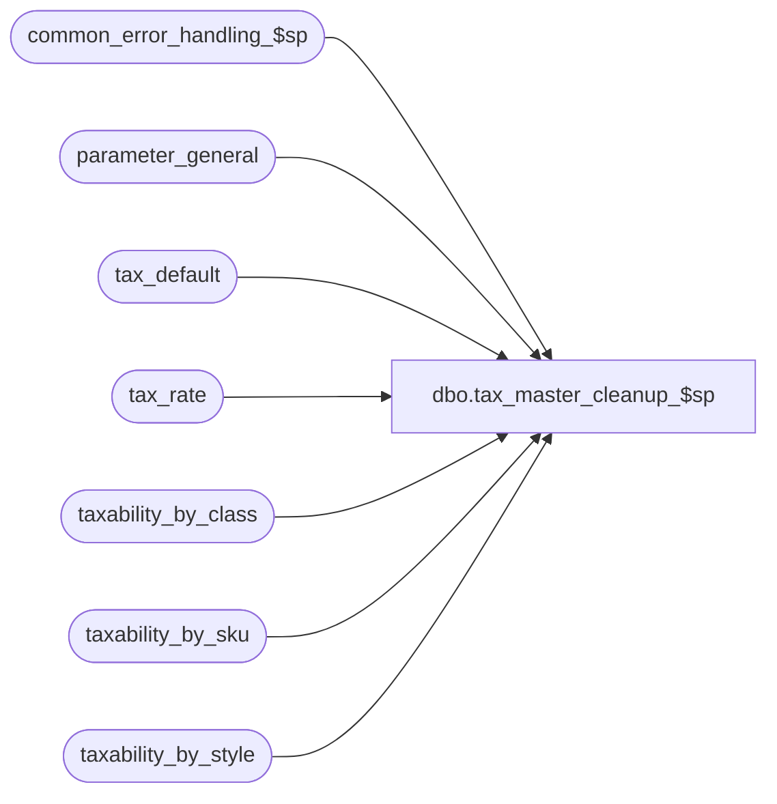

# dbo.tax_master_cleanup_$sp

**Database:** auditworks_external  
**Server:** bedrockdb01  

## Architecture Diagram



## Table Dependencies

| Referenced Table |
|---|
| common_error_handling_$sp |
| parameter_general |
| tax_default |
| tax_rate |
| taxability_by_class |
| taxability_by_sku |
| taxability_by_style |

## Stored Procedure Code

```sql
create proc [dbo].[tax_master_cleanup_$sp]
AS
DECLARE
  @tax_history_days	smallint,
  @cleanup_day		smalldatetime,
  @errmsg		nvarchar(255),
  @errno		int,
  @message_id		int,
  @object_name		nvarchar(255),
  @operation_name	nvarchar(100),
  @process_name		nvarchar(100)

/* Proc name:  tax_master_cleanup_$sp

Description: Cleans tax master tables where the effective_until_date is less than 
                system date minus the tax historys to be retaind.
                Called by period_end_$sp

HISTORY
Date     Name		Def#  Desc
Nov30,01 Phu		8931  Error handling
Mar16,01 Maryam		7435  Author
*/

SELECT @message_id = 201068,
	@process_name = 'tax_master_cleanup_$sp'

SELECT @tax_history_days = ISNULL(tax_days, 0)
  FROM parameter_general

SELECT @errno = @@error
IF @errno !=0 
  BEGIN
    SELECT @errmsg='Failed to select from parameter_general.',
	   @object_name = 'parameter_general',
	   @operation_name = 'SELECT'
    GOTO error
  END
 
SELECT @cleanup_day = DATEADD(dd, @tax_history_days * -1, CONVERT(smalldatetime, CONVERT(nchar(8),getdate(),112)))

DELETE tax_default
 WHERE effective_until_date < @cleanup_day

SELECT @errno = @@error
IF @errno !=0 
  BEGIN
    SELECT @errmsg = 'Failed to delete from tax_default.',
	   @object_name = 'tax_default',
	   @operation_name = 'DELETE'
    GOTO error
  END

DELETE tax_rate
 WHERE effective_until_date < @cleanup_day

SELECT @errno = @@error
IF @errno !=0 
  BEGIN
    SELECT @errmsg = 'Failed to delete from tax_rate.',
	   @object_name = 'tax_rate',
	   @operation_name = 'DELETE'
    GOTO error
  END

DELETE taxability_by_class
 WHERE effective_until_date < @cleanup_day

SELECT @errno = @@error
IF @errno !=0 
  BEGIN
    SELECT @errmsg = 'Failed to delete from taxability_by_class.',
	   @object_name = 'taxability_by_class',
	   @operation_name = 'DELETE'
    GOTO error
  END

DELETE taxability_by_sku
 WHERE effective_until_date < @cleanup_day

SELECT @errno = @@error
IF @errno !=0 
  BEGIN
    SELECT @errmsg = 'Failed to delete from taxability_by_sku.',
	   @object_name = 'taxability_by_sku',
	   @operation_name = 'DELETE'
    GOTO error
  END

DELETE taxability_by_style
 WHERE effective_until_date < @cleanup_day

SELECT @errno = @@error
IF @errno !=0 
  BEGIN
    SELECT @errmsg = 'Failed to delete from taxability_by_style.',
	   @object_name = 'taxability_by_style',
	   @operation_name = 'DELETE'
    GOTO error
  END

RETURN

error:
	EXEC common_error_handling_$sp 0, @errno, @errmsg, 0, @message_id, 
	@process_name, @object_name, @operation_name, 1
	RETURN
```

