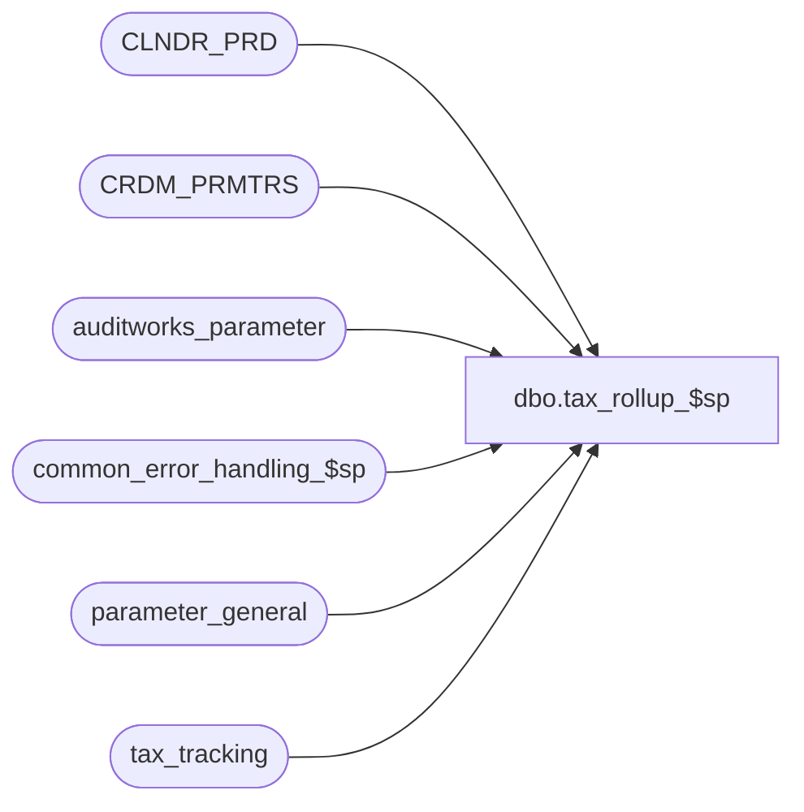

# dbo.tax_rollup_$sp

**Database:** auditworks_external  
**Server:** bedrockdb01  

## Architecture Diagram



## Table Dependencies

| Referenced Table |
|---|
| CLNDR_PRD |
| CRDM_PRMTRS |
| auditworks_parameter |
| common_error_handling_$sp |
| parameter_general |
| tax_tracking |

## Stored Procedure Code

```sql
create proc [dbo].[tax_rollup_$sp] 

AS
/*      Proc name:  Tax_Rollup_$sp

	Parameter:  company number.  It will need this to determine which parameter to look at from
				parameter_general table

	Description:  This is the tax rollup function.  It will determined if
	roll up is necessary.  If will check the tax_periods to see how many 
	periods are outstanding.  If it exceeds the tax_periods, it will determine
	from which date to which date to do the roll up.

HISTORY:
Date		Name		Def	Desc
Nov06,06	Paul            74790   read CRDM_PRMTRS to get CLNDR_ID
May12,04	David		DV-1071 Use new Calendar table.
30-Nov-01	Phu		8931	Error handling
10-Feb-00	Vicci de T.	5889	Add explicit field list to INSERT into tax_tracking
21-Apr-97	Author		n/a	
*/


DECLARE 
	@tax_periods            tinyint,
	@counter                tinyint,
	@mdate                  smalldatetime,          /* max date - to determine the last date of period */
	@bdate                  smalldatetime,
	@edate                  smalldatetime,
	@errmsg                 nvarchar(255),
	@errno                  int,
	@process_no		int,
	@message_id		int,
	@object_name		nvarchar(255),
	@operation_name		nvarchar(100),
	@process_name		nvarchar(100),
	@rows			int,
	@clndr_id		binary(16),
	@lvl_month		binary(16)

SELECT @counter = 0,
	@process_no = 87,
	@message_id = 201068,
	@process_name = 'tax_rollup_$sp'

SELECT @tax_periods = tax_periods,
	@bdate = period_end_date
FROM parameter_general

SELECT @errno = @@error
IF @errno != 0
  BEGIN
    SELECT @errmsg='Failed to select tax_periods from parameter_general',
	   @object_name = 'tax_periods',
	   @operation_name = 'SELECT'
    GOTO error
  END

SELECT @clndr_id = PRMTR_VAL_BIN
  FROM CRDM_PRMTRS
 WHERE PRMTR_NAME = 'GL_PSTNG_CLNDR_ID'

SELECT @errno = @@error, @rows = @@rowcount
IF @rows = 0 AND @errno = 0
  SELECT @errno = 201612
IF @errno <> 0
  BEGIN
    SELECT @errmsg = 'Unable to select calendar id',
           @object_name = 'CRDM_PRMTRS',
           @operation_name = 'SELECT'
    GOTO error
  END

SELECT @lvl_month = par_bin_value
  FROM auditworks_parameter
 WHERE par_name = 'clndr_lvl_month'

  SELECT @errno = @@error
  IF @errno <> 0
  BEGIN
    SELECT @errmsg = 'Unable to select month level type id',
           @object_name = 'auditworks_parameter',
           @operation_name = 'SELECT'
    GOTO error
  END

IF      @tax_periods != 0       
BEGIN   /* tax rollup is activated */
 
	WHILE @counter <= @tax_periods + 1
	BEGIN
		SELECT @mdate = DATEADD( day, -1, CONVERT(SMALLDATETIME, convert(nvarchar, MAX(END_DATE_TIME), 101)) )
		  FROM CLNDR_PRD
		 WHERE CLNDR_ID = @clndr_id
		   AND CLNDR_LVL_TYPE_ID = @lvl_month
		   AND CONVERT(SMALLDATETIME, convert(nvarchar, END_DATE_TIME, 101)) <= @bdate 

		SELECT @errno = @@error
		IF @errno != 0
		  BEGIN
		    SELECT @errmsg='Failed to last period end date',
			   @object_name = 'CLNDR_PRD',
			   @operation_name = 'SELECT'
		    GOTO error
		  END

		SELECT @edate=@bdate
		SELECT @bdate=@mdate
		SELECT @counter=@counter+1

	END /* while */


	BEGIN TRANSACTION

		INSERT INTO tax_tracking(tax_level, store_no, tax_category, tax_jurisdiction,
                                         tax_rate_code, combined_rate, tax_on_tax_level,
                                         tax_on_combined_rate, transaction_date,
                                         taxable_merchandise_amount, taxable_fee_amount, 
                                         nontaxable_merchandise_amount, nontaxable_fee_amount, 
                                         tax_amount_collected, tax_amount_expected, rollup_flag)    
		SELECT tax_level,store_no,tax_category,tax_jurisdiction,
				tax_rate_code,combined_rate,tax_on_tax_level,tax_on_combined_rate,
				@edate,sum(taxable_merchandise_amount),
				sum(taxable_fee_amount),sum(nontaxable_merchandise_amount),
				sum(nontaxable_fee_amount),sum(tax_amount_collected),
				sum(tax_amount_expected),1
		FROM tax_tracking
		WHERE   transaction_date <=@edate and 
				transaction_date >  @bdate and
				rollup_flag=0
		GROUP BY        tax_level,store_no,tax_category,tax_jurisdiction,
				tax_rate_code,combined_rate,tax_on_tax_level,
				tax_on_combined_rate

		SELECT @errno=@@error
		IF @errno != 0
		BEGIN
			SELECT @errmsg='Failed to insert on tax_tracking',
			       @object_name = 'tax_tracking',
			       @operation_name = 'INSERT'
			GOTO error
		END

		DELETE tax_tracking
		WHERE   transaction_date <=@edate and 
				transaction_date        >  @bdate and 
				rollup_flag=0           

		SELECT @errno=@@error
		IF @errno != 0
		BEGIN
			SELECT @errmsg='Failed to delete on tax_tracking',
			       @object_name = 'tax_tracking',
			       @operation_name = 'DELETE'
			GOTO error
		END

	COMMIT

END /* tax rollup activated */

RETURN


error:
	EXEC common_error_handling_$sp @process_no, @errno, @errmsg, 0, @message_id, 
	@process_name, @object_name, @operation_name, 1
	RETURN
```

