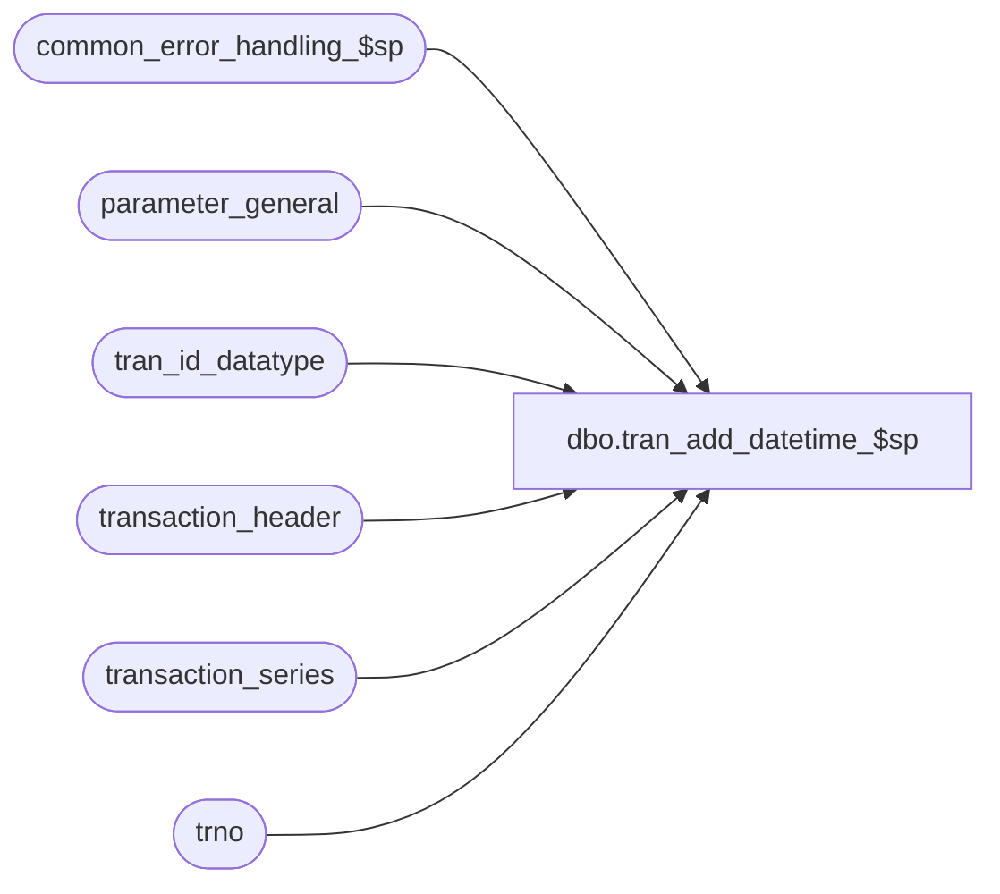

# dbo.tran_add_datetime_$sp

**Database:** auditworks_external  
**Server:** bedrockdb01  

## Architecture Diagram



## Table Dependencies

| Referenced Table |
|---|
| common_error_handling_$sp |
| parameter_general |
| tran_id_datatype |
| transaction_header |
| transaction_series |
| trno |

## Stored Procedure Code

```sql
create proc [dbo].[tran_add_datetime_$sp] 
@process_id	                binary(16),
@user_id                        int,
@transaction_id			tran_id_datatype,
@errmsg				nvarchar(255) OUTPUT,
@function_no			tinyint = 150

AS

/* 
  Proc Name: tran_add_datetime_$sp
Description: Assigns an appropriate entry_date_time (splitting difference between
             prev txn no and next txn no's entry_date_times) when the entry_date_time is NOT
             keyed in by the user (Front End Default)
             Uses 00:00:01 and 23:59:59 as default when there are no previous 
             or next txns
             Rollover scenario: if txn = min, sets prev = max
                                if txn = max, sets next = min          
                                
              
             This will permit sorting on entry_date_time in transaction_missing_$sp
   
             Called by transaction_add_$sp for manually added txns that are part of a
             sequential series. 
   
  HISTORY:  
Date     Name	      Def# Desc
Dec08,10 Vicci      122425 use defaults defined in parameter_general when no override is specified in transaction_series.
Dec08,08 Paul     1-3Z4Z6K read min_tran_no from transaction_series.
Mar10,06 Paul        68490 apply 68485 to SA5
Nov23,05 Paul        63726 apply 63725 to SA5
Apr28,05 Paul      DV-1234 expand transaction_id to use tran_id_datatype
Sep15,04 IanK      DV-1146 Use user_id
May29,04 Maryam    DV-1071 get max_tran_no from transaction_series table, receive @process_id
Mar02,06 Daphna   68487/68485 Ensure EDT set correctly for last txn (error in 63701/63725)
Nov22,05 Daphna   63701/63725 Ensure EDT set correctly when new txn # is only txn and = min txn #  
Dec29,03 Maryam    DV-1007 As the datatype of last_modified_date_time in transaction_header is smalldatetime,
                              convert the entry_date_time to smalldatetime before comparing against the last_modified_date_time.
                              @last_modified_date_time will be set by F/E as of 04.00.12 exe.
Mar11,02 Paul      1-BJM6Z set variables using rowcount to ensure compatibility with 12.5,
				 add R3 error handling
Oct31,01 Daphna       8629 Set next_tran = min before looking up date
                           Set prev_tran = max before looking up date
Oct23,01 Daphna       8729 Add checks to prev_date_time and next_date_time in same tran date
                           to get correct result when called by add-a-missing-txn screen and 
                           missing txns are mass-added 
Oct15,01 Daphna       8841 Author
*/

DECLARE
  @cutoff1_date_time		datetime,
  @cutoff2_date_time		datetime,
  @date_diff			numeric(20,0),
  @date_reject_id		tinyint,
  @errno			int,
  @entry_date_time		datetime,  -- with millisec
  @last_modified_date_time	datetime, 
  @max_tran_no			trno,
  @message_id			int,
  @min_tran_no			trno,
  @object_name			nvarchar(255),
  @operation_name		nvarchar(100),
  @process_name			nvarchar(100),
  @next_date_time		datetime,  -- for next txn
  @next_tran_no			trno,		-- for next txn
  @prev_date_time		datetime,  -- for prev txn
  @prev_tran_no			trno,  -- for prev txn
  @register_no			smallint,
  @rows				int,
  @store_no			int,  
  @transaction_no		trno,
  @transaction_date		smalldatetime,
  @transaction_series		char 
  
SELECT @process_name = 'tran_add_datetime_$sp',
	@message_id = 201068

SELECT @store_no = store_no,
	@transaction_date = transaction_date,
	@date_reject_id = date_reject_id,
	@transaction_series = transaction_series,
	@register_no = register_no,
	@transaction_no = transaction_no,
	@entry_date_time = entry_date_time,
	@last_modified_date_time = last_modified_date_time
  FROM transaction_header
 WHERE transaction_id = @transaction_id

SELECT @errno = @@error
IF @errno != 0 OR @store_no IS NULL
BEGIN
  SELECT @errmsg = 'Failed to select transaction_header',
         @object_name = 'transaction_header',
         @operation_name = 'SELECT'
  GOTO error
END

              
SELECT @max_tran_no = NULL,
	@min_tran_no = NULL

SELECT @max_tran_no = COALESCE(t.max_tran_num,p.max_transaction_no),
       @min_tran_no = COALESCE(t.min_tran_num,abs(p.transaction_zero_flag-1))
  FROM transaction_series t, parameter_general p
 WHERE t.transaction_series = @transaction_series

SELECT @errno = @@error
IF @errno != 0 OR @max_tran_no IS NULL
BEGIN
  SELECT @errmsg = 'Failed to select max_tran_no from transaction_series',
         @object_name = 'transaction_series',
         @operation_name = 'SELECT'
  GOTO error
END

-- If the proc is installed ahead of the Front End Mod allowing the user to key in an
-- EDT, this will populate @last_modified_date_time so that the EDT correction is made

SELECT @last_modified_date_time = ISNULL(@last_modified_date_time, @entry_date_time)


IF CONVERT(smalldatetime, @entry_date_time) = @last_modified_date_time --  Front End Default EDT
BEGIN  

 -- set the first possible EDT = YYMMDD00:00:01

  SELECT @cutoff1_date_time = CONVERT(datetime, convert(nvarchar, @transaction_date,102))
  SELECT @cutoff1_date_time = DATEADD(hh, 00, @cutoff1_date_time)  
  SELECT @cutoff1_date_time = DATEADD(mi, 00, @cutoff1_date_time)
  SELECT @cutoff1_date_time = DATEADD(ss, 01, @cutoff1_date_time)  

  -- set the last possible datetime = YYYYMMDD23:59:59
  
  SELECT @cutoff2_date_time = CONVERT(datetime, convert(nvarchar, @transaction_date,102))

  SELECT @cutoff2_date_time = DATEADD(hh, 23, @cutoff2_date_time)  
  SELECT @cutoff2_date_time = DATEADD(mi, 59, @cutoff2_date_time)
  SELECT @cutoff2_date_time = DATEADD(ss, 59, @cutoff2_date_time)  
  
  SELECT @errno = @@error
  IF @errno != 0
  BEGIN
    SELECT @errmsg = 'Failed to SELECT @cutoff2_date_time = YYYYMMDD23:59:59'
    GOTO error
  END  

 -- get next txn in series 

   IF @transaction_no = @max_tran_no
     SELECT @next_tran_no = @min_tran_no
   ELSE
   BEGIN
     SELECT @next_tran_no = NULL

     SELECT @next_tran_no = MIN(transaction_no)
       FROM transaction_header
      WHERE store_no = @store_no
        AND transaction_date = @transaction_date
        AND register_no = @register_no
        AND date_reject_id = @date_reject_id
        AND transaction_series = @transaction_series
        AND transaction_no > @transaction_no
        AND entry_date_time BETWEEN @cutoff1_date_time AND @cutoff2_date_time  -- def 8729

     SELECT @errno = @@error
     IF @errno != 0
     BEGIN
       SELECT @errmsg = 'Failed to select next_tran_no from transaction_header',
         @object_name = 'transaction_header',
         @operation_name = 'SELECT'
       GOTO error
     END  
     
     IF @next_tran_no IS NULL -- def 1-BJM6Z
       SELECT @next_tran_no = @max_tran_no   -- def  68485/68487
   END  -- NOT the max tran no

  SELECT @next_date_time = entry_date_time
    FROM transaction_header
   WHERE store_no = @store_no
     AND transaction_date = @transaction_date
     AND register_no = @register_no
     AND date_reject_id = @date_reject_id
     AND transaction_series = @transaction_series
     AND transaction_no = @next_tran_no
     AND transaction_no <> @transaction_no  -- do not select new txn

  SELECT @errno = @@error,
         @rows = @@rowcount
  IF @errno != 0
  BEGIN
    SELECT @errmsg = 'Failed to select @next_date_time from transaction_header',
         @object_name = 'transaction_header',
         @operation_name = 'SELECT'
    GOTO error
  END

  IF @rows = 0
    SELECT @next_date_time = @cutoff2_date_time,       
           @next_tran_no =  @max_tran_no
  
   -- get prev txn in series 
  
  IF @transaction_no = @min_tran_no
    SELECT @prev_tran_no = @max_tran_no
  ELSE
  BEGIN
 SELECT @prev_tran_no = MAX(transaction_no)
      FROM transaction_header
     WHERE store_no = @store_no
       AND transaction_date = @transaction_date
AND register_no = @register_no
       AND date_reject_id = @date_reject_id
       AND transaction_series = @transaction_series
       AND transaction_no < @transaction_no
       AND entry_date_time BETWEEN @cutoff1_date_time AND @cutoff2_date_time  -- def 8729
       
    SELECT @errno = @@error,
           @rows = @@rowcount
    IF @errno != 0
    BEGIN
      SELECT @errmsg = 'Failed to select @prev_tran_no from transaction_header',
         @object_name = 'transaction_header',
         @operation_name = 'SELECT'
      GOTO error
    END
    
    IF @rows = 0  -- def 1-BJZDX
      SELECT @prev_tran_no = @max_tran_no
  END  -- NOT the min_tran_no

  SELECT @prev_date_time = entry_date_time
    FROM transaction_header
   WHERE store_no = @store_no
     AND transaction_date = @transaction_date
     AND register_no = @register_no
     AND date_reject_id = @date_reject_id
     AND transaction_series = @transaction_series
     AND transaction_no = @prev_tran_no

  SELECT @errno = @@error,
         @rows = @@rowcount
  IF @errno != 0
  BEGIN
    SELECT @errmsg = 'Failed to select @prev_date_time from transaction_header',
         @object_name = 'transaction_header',
         @operation_name = 'SELECT'
    GOTO error
  END     

  IF @rows = 0
    SELECT @prev_date_time = @cutoff1_date_time,
           @prev_tran_no =  @min_tran_no
  
  IF @next_date_time < @prev_date_time
  BEGIN
    IF @transaction_no = @min_tran_no
      SELECT @next_date_time = @cutoff2_date_time
    ELSE     
    BEGIN
      IF @transaction_no = @max_tran_no
        SELECT @prev_date_time = @cutoff1_date_time
      ELSE  -- @tran_no NOT = min OR max
      BEGIN
        IF ABS(@transaction_no - @prev_tran_no) <= ABS(@transaction_no - @next_tran_no)
           /* if new txn # is closer to prev # set next_date_time = cutoff2 (latest)
           eg prev = 5 at 17:00, next = 9997 at 07:00, new = 7, sets next = late cutoff 
           so new EDT between 17:00:00 and 23:59:59 */ 
          SELECT @next_date_time = @cutoff2_date_time
        ELSE       
          /* new txn # is closer to next #, set prev_date_time = cutoff1 (earliest) 
          eg prev = 5 at 17:00, next = 9997 at 07:00, new = 9995, sets prev = early cutoff 
          so new EDT between 00:00:01 and 07:00:00 */
          SELECT @prev_date_time = @cutoff1_date_time    
      END -- @tran_no NOT = min OR max
    END -- @transaction_no NOT @min_tran_no
    
  END -- @next_date_time < @prev_date_time

  SELECT @date_diff = DATEDIFF(ss, @prev_date_time, @next_date_time)
  
  -- split diff between prev EDT and next EDT
   
  SELECT @date_diff = ROUND((@date_diff/2), 0)
   
  -- calculate new EDT        

  SELECT @entry_date_time = DATEADD(ss, @date_diff, @prev_date_time)   

    -- Reset new txn's entry_date_time as calculated

  UPDATE transaction_header
     SET entry_date_time = @entry_date_time,
         last_modified_date_time = @last_modified_date_time
   WHERE transaction_id = @transaction_id

  SELECT @errno = @@error
  IF @errno != 0
  BEGIN
    SELECT @errmsg = 'Failed to UPDATE transaction_header',
         @object_name = 'transaction_header',
         @operation_name = 'UPDATE'
    GOTO error
  END       
END -- Front End Default EDT 

RETURN

error:   /* Common error handler. */

	EXEC common_error_handling_$sp @function_no, @errno, @errmsg, 0, @message_id, 
	@process_name, @object_name, @operation_name, 0, 1, 0, null, 0, null, null, 
	null, null, null, null, 0, @process_id, @user_id

	RETURN
```

