# dbo.transaction_add_$sp

**Database:** auditworks_external  
**Server:** bedrockdb01  

## Architecture Diagram

```mermaid
flowchart LR
    SP["dbo.transaction_add_$sp"]
    Ex_Queue(["Ex_Queue"]) --> SP
    T_ID(["T_ID"]) --> SP
    archive_adjustment(["archive_adjustment"]) --> SP
    audit_status(["audit_status"]) --> SP
    authorization_detail(["authorization_detail"]) --> SP
    calc_guided_start_date__sp(["calc_guided_start_date_$sp"]) --> SP
    common_error_handling__sp(["common_error_handling_$sp"]) --> SP
    create_function_status__sp(["create_function_status_$sp"]) --> SP
    customer_detail(["customer_detail"]) --> SP
    discount_detail(["discount_detail"]) --> SP
    exception_post__sp(["exception_post_$sp"]) --> SP
    exception_reason(["exception_reason"]) --> SP
    exception_rule(["exception_rule"]) --> SP
    function_status(["function_status"]) --> SP
    if_rejection_reason(["if_rejection_reason"]) --> SP
    interface_control(["interface_control"]) --> SP
    interface_directory(["interface_directory"]) --> SP
    interface_status(["interface_status"]) --> SP
    line_amount(["line_amount"]) --> SP
    line_note(["line_note"]) --> SP
    line_object_action_association(["line_object_action_association"]) --> SP
    line_object_action_attachment(["line_object_action_attachment"]) --> SP
    merchandise_detail(["merchandise_detail"]) --> SP
    missing_transactions_exec__sp(["missing_transactions_exec_$sp"]) --> SP
    modify_interface__sp(["modify_interface_$sp"]) --> SP
    payroll_detail(["payroll_detail"]) --> SP
    post_void_detail(["post_void_detail"]) --> SP
    process_error_log(["process_error_log"]) --> SP
    pwork_plu(["pwork_plu"]) --> SP
    rec_manual__sp(["rec_manual_$sp"]) --> SP
    return_detail(["return_detail"]) --> SP
    sa_rejection_reason(["sa_rejection_reason"]) --> SP
    special_order_detail(["special_order_detail"]) --> SP
    stock_control_detail(["stock_control_detail"]) --> SP
    store_audit_status(["store_audit_status"]) --> SP
    tax_override_detail(["tax_override_detail"]) --> SP
    tran_add_datetime__sp(["tran_add_datetime_$sp"]) --> SP
    tran_id_datatype(["tran_id_datatype"]) --> SP
    transaction_header(["transaction_header"]) --> SP
    transaction_line(["transaction_line"]) --> SP
    transaction_line_link(["transaction_line_link"]) --> SP
    transaction_validate__sp(["transaction_validate_$sp"]) --> SP
    trno(["trno"]) --> SP
    update_if_reject_memo__sp(["update_if_reject_memo_$sp"]) --> SP
    verify_dw_store_status__sp(["verify_dw_store_status_$sp"]) --> SP
    verify_register__sp(["verify_register_$sp"]) --> SP
    work_control_interfaces(["work_control_interfaces"]) --> SP
```



## Table Dependencies

| Referenced Table |
|---|
| Ex_Queue |
| T_ID |
| archive_adjustment |
| audit_status |
| authorization_detail |
| calc_guided_start_date_$sp |
| common_error_handling_$sp |
| create_function_status_$sp |
| customer_detail |
| discount_detail |
| exception_post_$sp |
| exception_reason |
| exception_rule |
| function_status |
| if_rejection_reason |
| interface_control |
| interface_directory |
| interface_status |
| line_amount |
| line_note |
| line_object_action_association |
| line_object_action_attachment |
| merchandise_detail |
| missing_transactions_exec_$sp |
| modify_interface_$sp |
| payroll_detail |
| post_void_detail |
| process_error_log |
| pwork_plu |
| rec_manual_$sp |
| return_detail |
| sa_rejection_reason |
| special_order_detail |
| stock_control_detail |
| store_audit_status |
| tax_override_detail |
| tran_add_datetime_$sp |
| tran_id_datatype |
| transaction_header |
| transaction_line |
| transaction_line_link |
| transaction_validate_$sp |
| trno |
| update_if_reject_memo_$sp |
| verify_dw_store_status_$sp |
| verify_register_$sp |
| work_control_interfaces |

## Stored Procedure Code

```sql
CREATE proc [dbo].[transaction_add_$sp] @process_id		binary(16),
@user_id		int,
@transaction_id		tran_id_datatype,
@errmsg			nvarchar(2000) OUTPUT,
@ENTRY_ID		T_ID,
@function_no		tinyint = 150,
@function_status	tinyint = 1,
@rec_process_id		numeric(12,0) = NULL -- NULL unless recovering halted process.

AS
 
/*
PROC NAME: transaction_add_$sp
     DESC: Post a new transaction (tran details inserted previously).
           Called by frontend add transaction, frontend av transaction modify,
           mass_correct_*_$sp, verify_transl_error_$sp, function_cleanup_$sp.
           For the add, n-tier will lock store-reg-date and insert to function_status.

  HISTORY:
Date     Name           Defect# Desc
Apr28,15 Vicci       TFS-118970 Don't unlock store if called by mass_correct_line_object (82) or translate error verification (112).  
                                They will do so themselves when done.
Sep10,14 Vicci           139695 Correct unit of measure logging (was missing transaction_id = @transaction_id where-clause!!).
Sep05,14 Vicci        TFS-76395 Take line note 9106 (serial# override) into account.
Sep23,13 Vicci           146826 Expand @errmsg since expanded in modify_interface_$sp.
Jul09,13 Vicci           139695 Add unit_of_measure logging and take it into account when validating transaction balance.
Aug23,13 Vicci           146198 Set pos_discount_serial_no in same manner as Edit when not already set manually by auditor, 
                                to compensate for UI no longer doing so as of S/A 5.0
Nov27,12 Vicci           139911 Don't treat treat call with function status 5 from mass correct geninfo (124) as being in recovery mode.
                                Don't call rec_manual_$sp in recovery mode if no rec_process_id was passed in.
Aug22,12 Vicci           137795 Remove SET NOCOUNT OFF from after the call to the common error handling to avoid @@error being reset before the calling proc can see it.
Mar05,10 Vicci           115599 Receive @rec_process_id to allow for recovery of status 35.
Mar04,10 Vicci           106158 Delete those specific missing attachment S/A rejects which are no longer applicable
                                despite the fact other missing attachments might still be present.
Mar17,09 Vicci           106158 Delete those missing attachment/reference_no S/A rejects which are no longer applicable.
Apr05,07 Phu              84934 transaction_range table incorrectly populated causing incorrect missings.
Jan15,07 Paul             81764 Apply 76394 to SA5, removed unused variables, ensure #table gets dropped.
Jul27,06 Tim		  69753 Uplift Defect 62313 and 1-37V7OJ to SA5
Nov01,05 Paul             62153 only call update_if_reject_memo_$sp if transaction is an i/f reject
Sep06,05 Paul           DV-1312 apply 45032 to SA5. Cleanup sa_rejection_reason when lineobj and lineact <> 0.
Aug03,05 Paul           DV-1295 fix error recovery for mass correct functions
Jul05,05 Paul           DV-1239 pass @transaction_id to exception_post_$sp
Jun28,05 Paul           DV-1286 improve performance by reducing locking
May09,05 David/Sab      DV-1202 Clean-up sa_rejection_reason for reason #19. expand transaction_id to use tran_id_datatype
				Call new procedure verify_dw_store_status_$sp, add new function_status = 35 for media rec.
Jan10,05 Paul           DV-1191 added nocount and nolock hints
Dec02,04 Paul           DV-1181 look at ACTV in exception_rule
Sep15,04 IanK           DV-1146 Use user_id
Sep02,04 David          DV-1129 apply 29561 to SA5
Jul30,04 David          DV-1071 Pass in @ENTRY_ID, @process_id, include Rollforward logic.
Apr08,04 Sab		DV-1068 remove code for old customer liability, old media rec
Sep05,06 Vicci            76394 removed missing and transaction range logic instead allowing
                                it to be assessed in missing_transactions_exec_$sp
Mar24,06 Daphna           62313 Ensure last-mod-datetime is same in txn as in audit trail (current system datetime)
Feb27,06 Daphna        1-37V7OJ Ensure record is unlocked when trickle-audit (IF @bypass_mediarec_update >= 1...) 
                        / 68318
Jul15,04 Vicci            29561  Handle line_object_type 23 (PLU subtotal discounts)
Dec29,03 Maryam		DV-1007	remove non-sequential last_mod_datetime update which has been
                                redundant since defect 1-FGEBP
Aug06,03 Paul             11627 call new media rec after calculating missing tran
Jun13,03 Paul           1-KX549 call new media rec, call verify_register_$sp
Oct16,02 Sab		1-FGEBP entry date-time not set correctly in tran add for non-sequential transaction series.
Oct07,02 Sab		AW-4464 When adding a tran for a closed date (now status edited), make sure all reg with closed status get set to unused
Jul26,02 Paul           1-E7L7M populate key_11 in Ex_Queue with entry_date_time
APR19,02 Daphna         1-CE89X Pass @cashier_no in call to media_reconciliation_$sp
Mar14,02 Henry		1-A8XPT	To add corrected translate rejected trxns, type SA rejected reason = 8.
Jan30,02 David C        1-9DI2T Lay foundation for archive transaction modification; 
                                 Change function_status values to 0,1,10,20,30,40,50,60.
Dec18,01 Winnie		8927    calculate the correct amount for plu_price,
				 only call tran_add_datetime_$sp if @function_no != 82
Dec04,01 David C        1-9ATXP Move call to cust_liability_edit_$sp to modify_interface_$sp AND
                                 change code for New error handling.
Oct18,01 Daphna         8629 Call transaction_missing_exec_$sp 
                 On Rollover (@last < @first), change criteria for 'in range'
                             to NOT BETWEEN @last AND @first
Oct15,01 Daphna         8841 Call tran_add_datetime_$sp to reset default entry_date_time
                             for sequential series new txn
                             Update to transaction_header.last_modified_date_time done in
          tran_add_datetime_$sp for sequential or immediately afterwards
                             for non-sequential series                             
Sep26,01 Maryam         8780 treat I/F reject transaction as a valid transaction. Change
                             data type of tinyint to tinyint.
Sep10,01 Winnie		8698 Remove the extra code for delete transaction_missing before calling transaction_missings_add_$sp 
Aug24,01 Winnie		8591 Pass the right number parameters to missing_transactions_add_$sp
Aug03,01 David C        8462 Call cust_liability_edit_$sp for R3 customer liability
May01,01 David M	7589 Missing transactions by transaction series Version 1.0 (first/last handling). 
Apr09,01 Bayani D	7376 Remove lines which accesses HO tables and proc.
Mar16,01 David M	7447 pass cashier_no to petty_cash_$sp (when cashier balancing)
Mar15,01 Phu		7501 Use system function to retrieve user name
Jan02,00 Louise         7151 included call to update_if_reject_memo_$sp
Dec15,00 Paul		7117 pass function_no to media_reconciliation_$sp
Dec04/00 Phu		7011 Call petty_cash_$sp to build petty_cash_reconciliation table
Nov20/00 Maryam		6795 tax_override_flag is no longer used, so do not set it.
Sep21/00 Maryam		6729 Set the tax_override_flag  if there exists any tax_override_detail
                             for the transaction with a tax_category other than 0.        
Jul04/00 Phu	   	6455 Remove GROUP BY clause where there is no aggregate function
Jun08/00 Vicci   	6410 Replaced call to glc_$sp with call to Glc_$sp
Jun05/00 Vicci		6389 modify call to modify_interface_$sp for new passing params;
Feb04/00 Daphna F	5944 update edit_progress_flag = 0 before calculating missing
				     txns
Feb04/00 Daphna F	4671 include line_action 56 (balance forward) in defn of
				     petty cash transaction	
Oct13,99 Paul S		5412 speed improvements
Sep22,99 Daphna F	5410 definition of petty cash txn includes line_obj_typ 
				= 21 (store funds)
Sep01,99 Daphna F	5332 remove update of missing_qty, first and last txn for audit_status
				remove unneccessary insert to transaction_missing
				add call to missing_transaction_$sp for current date 
				where new txn no > last txn no  --> correct 4907
Jul08,99 Daphna F	4907 call missing_transactions_$sp for current date where
				new txn no < first txn no
				update audit_status set last txn no = new txn no
				before calling missing_transactions_$sp for next date
				where new txn no > last txn no
Jun14,99 Louise M	4526 Added code to bypass media rec when register is trickling in
Mar17,99 Mat C	     	n/a  Added @function_no as parameter to modify_interface_$sp
Mar03,99 Andrew V   	4322 Corrected error messages to identify calls to 
				missing_transactions_$sp
Dec23,98 Andrew V
Jan07,97 Sebastiano V	author version 1.27				
*/


DECLARE
  @date_reject_id		tinyint,
  @effective_date		smalldatetime, --1-9DI2T
  @errno			int,
  @entry_date_time		datetime,
  @exception_flag		tinyint,
  @exceptions_verified		tinyint,
  @if_rejection_flag		tinyint,
  @interface_in			tinyint,
  @interface_out		tinyint,
  @register_no			smallint,
  @register_trickle_flag	tinyint,
  @rows				int,
  @sa_reject_add		smallint,
  @store_no			int,
  @tender_total			money,
  @transaction_balance		line_amount,
  @transaction_category		tinyint,
  @transaction_date		smalldatetime,
  @transaction_no		trno,
  @transaction_series		nchar,
  @transaction_void_flag	smallint,
  @trickle_in_progress_flag	tinyint,
  @message_id			int,
  @object_name			nvarchar(255),
  @operation_name		nvarchar(100),
  @process_name			nvarchar(100),  
  @recovery_flag		tinyint,
  @rec_recovery_flag		tinyint,
  @verify_store_status          tinyint

SET NOCOUNT ON
  
SELECT @trickle_in_progress_flag =0,
       @register_trickle_flag = 0,
       @interface_in = 1,
       @interface_out = 0,
       @process_name = 'transaction_add_$sp',
       @message_id = 201068,
       @recovery_flag = 0,
       @rec_recovery_flag = 0,
       @sa_reject_add = 0

SELECT transaction_id, line_id, gross_line_amount, net_amount 
  INTO #calc_plu
  FROM pwork_plu WITH (NOLOCK)

SELECT @errno = @@error
IF @errno != 0
BEGIN
  SELECT @errmsg         = 'Failed to create temp table #calc_plu',
         @object_name    = '#calc_plu',
    @operation_name = 'CREATE'
  GOTO error
END


IF @function_status > 1 -- error recovery
BEGIN
   IF @function_status > 5 OR @function_no <> 124 --139911:  mass correct geninfo creates its own function status with status 5 before call tran add
     SELECT @recovery_flag = 1
     
   IF @rec_process_id IS NOT NULL
     SELECT @rec_recovery_flag = 1
     
   IF @function_no IN (82,112,124)  /* mass correct functions */
     SELECT @sa_reject_add = -1
END

SELECT	@store_no = store_no,
	@register_no = register_no,
	@transaction_date = transaction_date,
	@date_reject_id = date_reject_id,
	@transaction_category = transaction_category,
	@transaction_series = transaction_series,
	@transaction_no = transaction_no,
	@transaction_void_flag = transaction_void_flag,
	@entry_date_time = entry_date_time,
	@if_rejection_flag = if_rejection_flag
  FROM transaction_header WITH (NOLOCK)
 WHERE transaction_id = @transaction_id
SELECT @errno = @@error, @rows = @@rowcount
IF @errno != 0 OR @rows = 0
BEGIN
  SELECT @errmsg = 'Failed to select from transaction_header',
	 @object_name = 'transaction_header',
	 @operation_name = 'SELECT'
 GOTO error
END

IF @function_no = 154 AND @function_status < 20
BEGIN -- set line_modified_flag for all lines where the line_sequence is reversed
  UPDATE transaction_line 
     SET line_modified_flag = 1
    FROM transaction_line tl1, transaction_line
   WHERE tl1.transaction_id = @transaction_id 
     AND tl1.line_modified_flag = 1 
     AND tl1.line_sequence > 0 
     AND tl1.transaction_id = transaction_line.transaction_id 
     AND tl1.line_sequence = transaction_line.line_sequence * -1

  SELECT @errno = @@error
  IF @errno != 0
  BEGIN
    SELECT @errmsg = 'Failed to set line_modified_flag for reversal lines',
	   @object_name = 'transaction_line',
	   @operation_name = 'UPDATE'
    GOTO error
  END
END -- if coming from archive transaction modification (154)

SELECT @trickle_in_progress_flag = ISNULL(trickle_in_progress_flag,0)
  FROM store_audit_status 
 WHERE store_no = @store_no
   AND sales_date = @transaction_date
   AND date_reject_id = @date_reject_id
SELECT @errno = @@error
IF @errno != 0
BEGIN
 IF @errmsg IS NULL /* then */
   SELECT @errmsg = 'Failed to select trickle flag from store_audit_status'
   
 SELECT @object_name = 'store_audit_status',
    @operation_name = 'SELECT'
 GOTO error
END

  /* Check if register is currently tricking in */
IF @trickle_in_progress_flag = 1 
  BEGIN
    SELECT @register_trickle_flag = ISNULL(trickle_in_progress_flag ,0)
      FROM audit_status
     WHERE store_no = @store_no
       AND register_no = @register_no
       AND sales_date = @transaction_date
       AND date_reject_id = @date_reject_id
       
	SELECT @errno = @@error
	IF @errno != 0
	BEGIN
	 IF @errmsg IS NULL /* then */
	   SELECT @errmsg = 'Failed to select trickle flag from audit_status'
	   
         SELECT @object_name = 'audit_status',
                @operation_name = 'SELECT'
	 GOTO error
	END
  END


IF @function_status < 20 -- ************************** rollforward if @function_status >= 10 ************************
BEGIN

  IF @function_no = 150  --Transaction Add
  BEGIN
    --Since coupon-triggered promotions have a promo number logged in the format 9999999999999999:PromoName for Coalition (146198)
    UPDATE discount_detail
       SET pos_discount_serial_no = CASE WHEN CHARINDEX(':', ln.line_note) BETWEEN 1 AND 21 
            				 THEN CASE WHEN IsNumeric(SUBSTRING(ln.line_note, 1, CHARINDEX(':', ln.line_note) - 1)) = 1
            				           THEN CONVERT(nvarchar(20), CONVERT(numeric(20,0), SUBSTRING(ln.line_note, 1, CHARINDEX(':', ln.line_note) - 1)))
            				           ELSE SUBSTRING(ln.line_note, 1, CHARINDEX(':', ln.line_note) - 1)
            				           END
			                 ELSE SUBSTRING(ln.line_note, 1, 20) END
      FROM line_note ln
     WHERE discount_detail.transaction_id = @transaction_id
       AND ln.transaction_id = @transaction_id
       AND ln.note_type = 9006  --Coupon/Promotion type
       AND ln.line_note IS NOT NULL
       AND ln.line_id = discount_detail.applied_by_line_id
       AND discount_detail.pos_discount_serial_no IS NULL
     SELECT @errno = @@error
     IF @errno != 0
     BEGIN
       SELECT @errmsg = 'Failed to set pos_discount_serial_no base on note-type 9006',
              @object_name = 'discount_detail',
              @operation_name = 'UPDATE'
       GOTO error
     END
     
       --Since discount_detail attachments (and therefore their pos_discount_serial_no) are lost if the line is voided and unvoided.
     UPDATE discount_detail
        SET pos_discount_serial_no = SUBSTRING(ln.line_note, 1, 20)
       FROM line_note ln
      WHERE discount_detail.transaction_id = @transaction_id
        AND ln.transaction_id = @transaction_id
        AND ln.note_type = 9106  --Discount serial# override
        AND ln.line_id = discount_detail.applied_by_line_id
     SELECT @errno = @@error
     IF @errno != 0
     BEGIN
       SELECT @errmsg = 'Failed to override pos_discount_serial_no base on note-type 9106',
              @object_name = 'discount_detail',
              @operation_name = 'UPDATE'
       GOTO error
     END
  END  --IF @function_no = 150
  
  /* update media_count_flag = 1 if count transaction added */
  IF EXISTS (SELECT transaction_id
	       FROM transaction_line WITH (NOLOCK)
	      WHERE transaction_id = @transaction_id
	        AND line_action = 246)
  BEGIN
	UPDATE transaction_header
	  SET media_count_flag = 1
	 WHERE transaction_id = @transaction_id
  END /* IF EXISTS .... */

  UPDATE transaction_line
     SET unit_of_measure = x.unit_of_measure
    FROM line_object_action_association x
   WHERE transaction_line.transaction_id = @transaction_id
     AND x.transaction_category = @transaction_category
     AND x.line_object = transaction_line.line_object
     AND x.line_action = transaction_line.line_action
     AND COALESCE(transaction_line.unit_of_measure, 1) <> COALESCE(x.unit_of_measure, 1)
  SELECT @errno = @@error
  IF @errno != 0
  BEGIN
    SELECT @errmsg = 'Failed to set unit_of_measure on behalf of UI',
	   @object_name = 'transaction_line',
	   @operation_name = 'unit_of_measure'
    GOTO error
  END 

  IF @function_no IN (82,112,124) -- mass correct functions
  BEGIN
   SELECT @sa_reject_add = -1

   SELECT @tender_total = ISNULL(SUM(gross_line_amount * db_cr_none * voiding_reversal_flag), 0)
     FROM transaction_line
    WHERE transaction_id = @transaction_id
      AND line_void_flag = 0
      AND line_object_type = 6
      AND COALESCE(unit_of_measure, 1) = 1
      
   SELECT @transaction_balance = 
        ISNULL(SUM((gross_line_amount - pos_discount_amount) * db_cr_none * voiding_reversal_flag), 0)
     FROM transaction_line
    WHERE transaction_id = @transaction_id
      AND line_void_flag = 0
      AND db_cr_none != 0
      AND COALESCE(unit_of_measure, 1) = 1

   BEGIN TRANSACTION

   IF @function_no = 82  --mass correct line-objects
   BEGIN
     DELETE sa_rejection_reason
       FROM sa_rejection_reason rr, line_object_action_association loa
      WHERE rr.transaction_id = @transaction_id
        AND rr.violated_sareject_rule IN (6, 19)   --invalid association, line_object not approved
        AND rr.line_object = loa.line_object
        AND rr.line_action = loa.line_action
        AND rr.transaction_category = loa.transaction_category
        AND loa.auto_config_verified > 0 -- will be 1 if not using autoconfig
        AND loa.line_object_type != 0
        AND loa.active_flag = 1
        AND rr.line_object != 0
        AND rr.line_action != 0 
     SELECT @errno = @@error
     IF @errno != 0
     BEGIN
       SELECT @errmsg = 'Failed to delete sa_rejection_reason',
	      @object_name = 'sa_rejection_reason',
	      @operation_name = 'DELETE'
       GOTO error
     END
     
     -- Remove rejections for mandatory attachments which are no longer mandatory
     DELETE sa_rejection_reason
      WHERE transaction_id = @transaction_id
        AND violated_sareject_rule IN (21, 22, 23, 24, 25, 26, 27, 28, 29, 30, 31, 33) 
        AND line_id * 100000 + violated_sareject_rule NOT IN (SELECT q.line_id * 100000 + q.attachment_type + 20
       		              FROM (SELECT tl.transaction_id,
     	     				   tl.line_id,
     	     				   la.attachment_type,
     	     		                   la.note_type
				    FROM transaction_header th WITH (NOLOCK), transaction_line tl WITH (NOLOCK), line_object_action_attachment la
				     WHERE th.transaction_void_flag IN (0,8)
				       AND th.transaction_id = @transaction_id
			               AND th.transaction_id = tl.transaction_id
	          		       AND tl.line_void_flag = 0
				       AND th.transaction_category = ISNULL(la.transaction_category, th.transaction_category)
				       AND tl.line_object = la.line_object
				       AND tl.line_action = la.line_action
				       AND la.attachment_mandatory = 1
				       AND la.attachment_type >= 1
				       AND la.attachment_type != 12 -- ignore attachments that should never be mandatory (setup mistake)
				     UNION
				    SELECT th.transaction_id,				       
			                   0 as line_id,
				         la.attachment_type, 
				           la.note_type
			     	      FROM transaction_header th WITH (NOLOCK), line_object_action_attachment la
				     WHERE th.transaction_void_flag IN (0,8)
				       AND th.transaction_id = @transaction_id
				       AND th.transaction_category = ISNULL(la.transaction_category, th.transaction_category)
				       AND la.line_object = -1
				       AND la.attachment_mandatory = 1
				    AND la.attachment_type >= 1
				       AND la.attachment_type not in (7, 12, 13) -- ignore attachments that should never be mandatory (setup mistake)
				     ) q
			       WHERE ( (q.attachment_type = 1 AND NOT EXISTS (SELECT 1 FROM merchandise_detail a WHERE a.transaction_id = @transaction_id AND a.transaction_id = q.transaction_id AND a.line_id = q.line_id))
         			  OR
				        (q.attachment_type = 2 AND NOT EXISTS (SELECT 1 FROM authorization_detail a WHERE a.transaction_id = @transaction_id AND a.transaction_id = q.transaction_id AND a.line_id = q.line_id))        
				       OR
				        (q.attachment_type = 3 AND NOT EXISTS (SELECT 1 FROM stock_control_detail a WHERE a.transaction_id = @transaction_id AND a.transaction_id = q.transaction_id AND a.line_id = q.line_id AND a.display_def_id = q.note_type))        
				       OR
				        (q.attachment_type = 4 AND NOT EXISTS (SELECT 1 FROM special_order_detail a WHERE a.transaction_id = @transaction_id AND a.transaction_id = q.transaction_id AND a.line_id = q.line_id))        
				       OR
				        (q.attachment_type = 5 AND NOT EXISTS (SELECT 1 FROM post_void_detail a WHERE a.transaction_id = @transaction_id AND a.transaction_id = q.transaction_id AND a.line_id = q.line_id))        
				       OR
        			        (q.attachment_type = 6 AND NOT EXISTS (SELECT 1 FROM payroll_detail a WHERE a.transaction_id = @transaction_id AND a.transaction_id = q.transaction_id AND a.line_id = q.line_id))        
				       OR
        				(q.attachment_type = 8 AND NOT EXISTS (SELECT 1 FROM tax_override_detail a WHERE a.transaction_id = @transaction_id AND a.transaction_id = q.transaction_id AND a.line_id = q.line_id))        
				       OR
				        (q.attachment_type = 9 AND NOT EXISTS (SELECT 1 FROM return_detail a WHERE a.transaction_id = @transaction_id AND a.transaction_id = q.transaction_id AND a.line_id = q.line_id))        
				       OR
				        (q.attachment_type = 10 AND NOT EXISTS (SELECT 1 FROM line_note a WHERE a.transaction_id = @transaction_id AND a.transaction_id = q.transaction_id AND a.line_id = q.line_id AND a.note_type = q.note_type))        
				       OR
				        (q.attachment_type = 11 AND NOT EXISTS (SELECT 1 FROM customer_detail a WHERE a.transaction_id = @transaction_id AND a.transaction_id = q.transaction_id AND a.line_id = q.line_id))        
				       OR
				        (q.attachment_type = 13 AND NOT EXISTS (SELECT 1 FROM transaction_line_link k, transaction_line l WHERE k.transaction_id = @transaction_id AND k.transaction_id = q.transaction_id AND k.line_id = q.line_id AND k.transaction_id = l.transaction_id and k.line_id = l.line_id AND l.line_object * 1000 + l.line_action = q.note_type))        
				      )
                               )
     SELECT @errno = @@error
     IF @errno != 0
     BEGIN
       SELECT @errmsg = 'Failed to delete sa_rejection_reason for mandatory attachments which are no longer mandatory',
	      @object_name = 'sa_rejection_reason',
	      @operation_name = 'DELETE'
       GOTO error
     END

     -- Remove rejections for mandatory reference# which are no longer missing
     DELETE sa_rejection_reason
      WHERE transaction_id = @transaction_id
        AND violated_sareject_rule = 9
        AND line_id NOT IN (SELECT tl.line_id 
                              FROM transaction_header th WITH (NOLOCK), 
                                   transaction_line tl WITH (NOLOCK), 
                                   line_object_action_association loa WITH (NOLOCK)
                             WHERE th.transaction_void_flag IN (0,8)
                               AND th.transaction_id = @transaction_id
        AND th.transaction_id = tl.transaction_id
                               AND tl.line_void_flag = 0
                               AND th.transaction_category = loa.transaction_category
                               AND tl.line_object = loa.line_object
                               AND tl.line_action = loa.line_action
                               AND tl.reference_type <> 0
                               AND COALESCE(tl.reference_no, '') = ''
                               AND loa.reference_type <> 0 
                               AND COALESCE(reference_no_option, 1) = 0 )
     SELECT @errno = @@error
     IF @errno != 0
     BEGIN
       SELECT @errmsg = 'Failed to delete sa_rejection_reason for mandatory reference numbers which are no longer mandatory',
	      @object_name = 'sa_rejection_reason',
	      @operation_name = 'DELETE'
       GOTO error
     END
   END  --IF @function_no = 82

   IF @function_no = 112  --mass correct translate rejects 
   BEGIN
    DELETE sa_rejection_reason
     WHERE transaction_id = @transaction_id
       AND violated_sareject_rule = 8

      SELECT @errno = @@error
      IF @errno != 0
      BEGIN
	SELECT @errmsg = 'Failed to REMOVE sa_rejection_reason (type 8)',
	       @object_name = 'sa_rejection_reason',
	       @operation_name = 'DELETE'
        GOTO error
      END
   END -- IF @function_no = 112

   IF @transaction_balance = 0 /* now in balance */
   BEGIN
    /* now in balance so delete out of balance reason */
    DELETE sa_rejection_reason
     WHERE transaction_id = @transaction_id
       AND violated_sareject_rule = 5

    SELECT @errno = @@error
    IF @errno != 0
      BEGIN
       SELECT @errmsg = 'Failed to delete sa_rejection_reason (type 5)',
		 @object_name = 'sa_rejection_reason',
		 @operation_name = 'DELETE'
       GOTO error
      END
   END -- @transaction_balance = 0

   IF EXISTS (SELECT 1 FROM sa_rejection_reason
                WHERE transaction_id = @transaction_id)
   BEGIN
      UPDATE transaction_header
         SET tender_total = @tender_total
       WHERE transaction_id = @transaction_id

      SELECT @errno = @@error
      IF @errno != 0
	BEGIN
	   SELECT @errmsg = 'Failed to update transaction_header (tender_total)',
		  @object_name = 'transaction_header',
		  @operation_name = 'UPDATE'
	   GOTO error
	END

     COMMIT TRANSACTION
     DROP TABLE #calc_plu
     RETURN
     
     --WIPWIPWIP  if recovery then remove function status and unlock before returning?  Although theoretically the function status entry should not exist if there were S/A rejects... (at least if this is 82)
     
   END -- tran is still a sa reject

   UPDATE transaction_header
     SET tender_total = @tender_total,
         sa_rejection_flag = 0
    WHERE transaction_id = @transaction_id

   SELECT @errno = @@error
   IF @errno != 0
	BEGIN
	   SELECT @errmsg = 'Failed to update transaction_header (sa_rejection_flag)',
		  @object_name = 'transaction_header',
		  @operation_name = 'UPDATE'
	   GOTO error
	END

   UPDATE transaction_line
    SET line_modified_flag = 1 -- used in interface posting
    WHERE transaction_id = @transaction_id

   SELECT @errno = @@error
   IF @errno != 0
   BEGIN
    SELECT @errmsg = 'Failed to update transaction_line (set line_modified_flag = 1)',
           @object_name = 'transaction_line',
           @operation_name = 'UPDATE'
    GOTO error
   END

   -- create function_status with status = 5 (rollforward)
   IF @function_no != 124 AND @recovery_flag = 0  --mass-correct GENINFO
   BEGIN
     EXEC create_function_status_$sp @process_id, @user_id, @function_no, @transaction_id, @errmsg OUTPUT,
       0, null, 0, 0, 5
     SELECT @errno = @@error
     IF @errno != 0
     BEGIN
      IF @errmsg IS NULL /* then */
        SELECT @errmsg = 'Failed to execute stored proc create_function_status_$sp'
      
      SELECT @object_name = 'create_function_status_$sp',
         @operation_name = 'EXECUTE'
      GOTO error
     END
   END -- If @function_no != 124

   COMMIT TRANSACTION
  END -- If @function_no in 82,112,124
ELSE
BEGIN -- If not mass correct then validate Sales Audit Reject Criteria
  EXEC transaction_validate_$sp @process_id, @user_id, @transaction_id, @errmsg OUTPUT, @function_no

  SELECT @errno = @@error
  IF @errno != 0
  BEGIN
    IF @errmsg IS NULL /* then */
    SELECT @errmsg = 'Failed to execute stored procedure transaction_validate_$sp'
    SELECT @object_name = 'transaction_validate_$sp',
           @operation_name = 'EXECUTE'
    GOTO error
  END

  -- reset entry_date_time where appropriate
  EXEC tran_add_datetime_$sp @process_id, @user_id, @transaction_id, @errmsg OUTPUT, @function_no

  SELECT @errno = @@error
  IF @errno != 0
   BEGIN
     IF @errmsg IS NULL /* then */
	SELECT @errmsg = 'Failed to EXEC tran_add_datetime_$sp'
	SELECT @object_name = 'tran_add_datetime_$sp', @operation_name = 'EXECUTE'
	GOTO error
   END
END -- else of If @function_no in 82,112,124 (not mass correct_line_object or SA Reject reason = 8)

--- Update plu_price defect 8927 ---

INSERT #calc_plu
       (transaction_id,
        line_id,
        gross_line_amount,
        net_amount)
SELECT transaction_id,
       line_id,
       gross_line_amount,
       gross_line_amount - pos_discount_amount
 FROM transaction_line WITH (NOLOCK)
 WHERE transaction_id = @transaction_id
  AND line_object_type = 1
SELECT @rows = @@rowcount,
       @errno = @@error
IF @errno != 0
BEGIN
  SELECT @errmsg         = 'Failed to insert temp table #calu_plu',
         @object_name    = '#calu_plu',
         @operation_name = 'INSERT'
  GOTO error
END


IF @rows > 0
  BEGIN
    UPDATE merchandise_detail
       SET plu_price = CONVERT(NUMERIC(12,4),(c.gross_line_amount 
             - (SELECT ISNULL(SUM(d.pos_discount_amount),0)
 	          FROM discount_detail d WITH (NOLOCK)
	         WHERE m.transaction_id = d.transaction_id
	           AND m.transaction_id = c.transaction_id
	           AND m.line_id = d.line_id
	           AND m.line_id = c.line_id
	           AND d.pos_discount_level in (22, 23))) / m.units),
           sold_at_price = CONVERT(NUMERIC(12,4), net_amount / m.units),
           ticket_price = CONVERT(NUMERIC(12,4),c.gross_line_amount / m.units)
     FROM  #calc_plu c WITH (NOLOCK), merchandise_detail m
    WHERE  m.transaction_id = c.transaction_id
      AND  m.line_id = c.line_id

    SELECT @errno = @@error
    IF @errno != 0
      BEGIN
       SELECT @errmsg = 'Failed to update merchandise_detail (plu_amount)',
              @object_name = 'merchandise_edit',
              @operation_name = 'UPDATE'          
       GOTO error
      END
  END -- If @rows > 0


IF @function_status < 10
BEGIN
   EXEC modify_interface_$sp @process_id, @user_id, @transaction_id, @errmsg OUTPUT, @function_no, 
			@interface_in, @interface_out, @function_status  

   SELECT @errno = @@error
   IF @errno != 0
   BEGIN
    IF @errmsg IS NULL /* then */
      SELECT @errmsg = 'Failed to execute stored procedure modify_interface_$sp'
    
    SELECT @object_name = 'modify_interface_$sp',
         @operation_name = 'EXECUTE'
    GOTO error
   END

  /* If system crashes after this point, transaction has to rollforward as modify_interface_$sp 
     has already posted R3 customer liability. IF status = 10, Function_cleanup_$sp will call
     transaction_add_$sp again, and modify_interface_$sp will NOT post interface_id 28 again. */

   UPDATE function_status
     SET status = 10,
         ENTRY_ID = @ENTRY_ID
    WHERE process_id = @process_id
      AND user_id = @user_id
      AND transaction_id = @transaction_id
      AND function_no = @function_no

   SELECT @errno = @@error
   IF @errno != 0
   BEGIN
    SELECT @errmsg = 'Failed to set status to 10',
           @object_name = 'function_status',
    @operation_name = 'UPDATE'
    GOTO error
   END
END -- If @function_status < 10

SELECT @effective_date = @transaction_date

IF @function_no = 154 
BEGIN
  SELECT @effective_date = av_transaction_date
    FROM archive_adjustment WITH (NOLOCK)
   WHERE adjustment_transaction_id = @transaction_id
  
  SELECT @errno = @@error
  IF @errno != 0
  BEGIN
    SELECT @errmsg = 'Failed to select av_transaction_date',
    @object_name = 'archive_adjustment',
           @operation_name = 'SELECT'
    GOTO error
  END

  IF @effective_date IS NULL /* then */
    SELECT @effective_date = @transaction_date
END --IF @function_no = 154 

BEGIN TRANSACTION

INSERT interface_control (
	transaction_id, interface_id, interface_status_flag)
SELECT entry_no, interface_id, interface_control_flag
  FROM work_control_interfaces WITH (NOLOCK)
 WHERE process_id = @process_id
   AND type = 'c'
SELECT @errno = @@error
IF @errno != 0
BEGIN
  SELECT @errmsg = 'Failed to insert interface_control',
         @object_name = 'interface_control',
         @operation_name = 'INSERT'
  GOTO error
END

INSERT Ex_Queue (
		queue_id, -- interface_id
    		key_1, --if_entry_no
		key_2, --interface_control_flag
		key_9, -- effective_date
		key_10, -- interface_posting_date
		key_11) -- entry_date_time
SELECT interface_id,
	entry_no,
	interface_control_flag,
	@effective_date,
	getdate(),
	@entry_date_time
  FROM work_control_interfaces WITH (NOLOCK)
 WHERE process_id = @process_id
   AND type = 'i'
SELECT @errno = @@error
IF @errno != 0
BEGIN
  SELECT @errmsg = 'Failed to insert Ex_Queue',
    @object_name = 'Ex_Queue',
    @operation_name = 'INSERT'
  GOTO error
END

UPDATE function_status
  SET status = 20
 WHERE process_id = @process_id
   AND user_id = @user_id
   AND transaction_id = @transaction_id
   AND function_no = @function_no
SELECT @errno = @@error
IF @errno != 0
BEGIN
  SELECT @errmsg = 'Failed to set status to 20',
           @object_name = 'function_status',
           @operation_name = 'UPDATE'
  GOTO error
END

COMMIT TRANSACTION

SELECT @function_status = 20

END --IF @function_status < 20 *****************************************************************

/* new glc is called by modify_interface_$sp */

IF @function_status = 20 -- rollforward starts here
BEGIN

  UPDATE interface_status
   SET last_posting_datetime = getdate()
    FROM interface_directory id, interface_status st
   WHERE update_timing = 1
     AND st.interface_id = id.interface_id
  SELECT @errno = @@error
  IF @errno != 0
  BEGIN
     SELECT @errmsg = 'Failed to update interface_status',
            @object_name = 'interface_status',
       @operation_name = 'UPDATE'
     GOTO error
  END

  /* Re-evaluate sa_reject_qty, if_reject_qty, exception_qty, valid_qty */

  DELETE work_control_interfaces
   WHERE process_id = @process_id
  SELECT @errno = @@error
  IF @errno != 0
  BEGIN
   SELECT @errmsg = 'Failed to DELETE on work_control_interfaces',
         @object_name = 'work_control_interfaces',
         @operation_name = 'DELETE'
   GOTO error
  END

  IF @recovery_flag = 1
  BEGIN
    DELETE exception_reason
     WHERE transaction_id = @transaction_id
    SELECT @errno = @@error
    IF @errno != 0
    BEGIN
     SELECT @errmsg = 'Failed to delete exception_reason',
           @object_name = 'exception_reason',
           @operation_name = 'DELETE'
     GOTO error
    END
  END

  SELECT @if_rejection_flag = 0,
	@exception_flag = 0 

  IF EXISTS(SELECT transaction_id
	    FROM if_rejection_reason WITH (NOLOCK)
	   WHERE transaction_id = @transaction_id)
    SELECT @if_rejection_flag = 1

  INSERT exception_reason (
	transaction_id,
	line_id,
	violated_exception_rule,
	verified,
	exception_type)
  SELECT transaction_id, line_id, exception_reason, 0, er.exception_type
  FROM transaction_line tl WITH (NOLOCK), line_object_action_association lo, exception_rule er
  WHERE transaction_id = @transaction_id
   AND tl.line_object = lo.line_object
   AND tl.line_action = lo.line_action
   AND transaction_category = @transaction_category
   AND exception_reason IS NOT NULL --
   AND line_void_flag = 0
   AND exception_reason = er.exception_rule
   AND er.exception_type >= 1
   AND er.ACTV = 1 
  SELECT @errno = @@error
  IF @errno != 0
  BEGIN
    SELECT @errmsg = 'Failed to INSERT on exception_reason',
           @object_name = 'exception_reason',
           @operation_name = 'INSERT'
    GOTO error
   END

  EXEC exception_post_$sp @process_id, @user_id, @errmsg OUTPUT, @transaction_id
  SELECT @errno = @@error
  IF @errno != 0
  BEGIN
    IF @errmsg IS NULL /* then */
      SELECT @errmsg = 'Failed to execute stored procedure exception_post_$sp'
    
    SELECT @object_name = 'exception_post_$sp',
           @operation_name = 'EXECUTE'
    GOTO error
  END

  SELECT @exceptions_verified = exceptions_verified
    FROM audit_status
   WHERE store_no = @store_no
     AND register_no = @register_no
     AND sales_date = @transaction_date
     AND date_reject_id = @date_reject_id
     
  IF EXISTS (SELECT transaction_id
             FROM exception_reason WITH (NOLOCK)
            WHERE transaction_id = @transaction_id
              AND exception_type = 1)
    SELECT @exception_flag = 1,
           @exceptions_verified = 0

  UPDATE transaction_header
     SET edit_progress_flag = 0
   WHERE transaction_id = @transaction_id
  SELECT @errno = @@error
  IF @errno != 0
  BEGIN
    SELECT @errmsg = 'Failed to UPDATE transaction_header: edit_progress_flag = 0',
           @object_name = 'transaction_header',
           @operation_name = 'UPDATE'
    GOTO error
  END

  IF @register_trickle_flag = 0
  BEGIN
    IF @function_no = 150
    BEGIN
      EXEC missing_transactions_exec_$sp @process_id, @user_id, @store_no, @transaction_date, 
    				      @register_no, @date_reject_id, @errmsg OUTPUT, 
    				      0, --all_series false
                                      100, --function_no 
                                      @transaction_series,
                                      0, --log_error_flag, 
                                      1, --edit_process_no, 
                                      0  --all_registers false
      SELECT @errno = @@error
      IF @errno <> 0
      BEGIN
        SELECT @errmsg = 'Failed to EXEC missing_transactions_exec_$sp'
        SELECT @object_name = 'missing_transactions_exec_$sp',
               @operation_name = 'EXECUTE'
        GOTO error
      END            
    END -- IF @function_no = 150
  END --  IF @register_trickle_flag = 0

  UPDATE transaction_line -- reset flags where necessary
   SET line_modified_flag = 0, exception_flag = 0
  WHERE transaction_id = @transaction_id
   AND (line_modified_flag != 0 OR exception_flag != 0)
  SELECT @errno = @@error
  IF @errno != 0
  BEGIN
    SELECT @errmsg = 'Failed to UPDATE transaction_line: line_modified_flag',
           @object_name = 'transaction_line',
           @operation_name = 'UPDATE'
    GOTO error
  END

  UPDATE transaction_line
   SET exception_flag = 1
  FROM transaction_line tl, exception_reason er WITH (NOLOCK)
  WHERE tl.transaction_id = @transaction_id
   AND tl.transaction_id = er.transaction_id
   AND tl.line_id = er.line_id
   AND er.exception_type = 1 
  SELECT @errno = @@error
  IF @errno != 0
  BEGIN
    SELECT @errmsg = 'Failed to UPDATE transaction_line: exception_flag',
           @object_name = 'transaction_line',
           @operation_name = 'UPDATE'
    GOTO error
  END

  BEGIN TRANSACTION

  UPDATE transaction_header
     SET sa_rejection_flag = 0,
         if_rejection_flag = @if_rejection_flag,
         exception_flag = @exception_flag,
         updated_by_user_id = @user_id,
         edit_progress_flag = 0,
        last_modified_date_time = getdate()
   WHERE transaction_id = @transaction_id
  SELECT @errno = @@error
  IF @errno != 0
  BEGIN
    SELECT @errmsg = 'Failed to UPDATE on transaction_header',
           @object_name = 'transaction_header',
           @operation_name = 'UPDATE'
    GOTO error
  END

  /* update audit status table */
  UPDATE audit_status
     SET if_reject_qty = if_reject_qty + @if_rejection_flag,
  	 exception_qty = exception_qty + @exception_flag,
	 valid_qty = valid_qty + 1,
         sa_reject_qty = sa_reject_qty + @sa_reject_add,
 	 audit_status = 100,
	 exceptions_verified = @exceptions_verified
   WHERE store_no = @store_no
     AND register_no = @register_no
     AND sales_date = @transaction_date
     AND date_reject_id = @date_reject_id
  SELECT @errno = @@error
  IF @errno != 0
  BEGIN
    SELECT @errmsg = 'Failed to UPDATE on audit_status',
           @object_name = 'audit_status',
           @operation_name = 'UPDATE'
    GOTO error
  END

  SELECT @function_status = 35

  UPDATE function_status
     SET status = @function_status
   WHERE process_id = @process_id
     AND user_id = @user_id
     AND transaction_id = @transaction_id
     AND function_no = @function_no
  SELECT @errno = @@error
  IF @errno != 0
  BEGIN
    SELECT @errmsg = 'Failed to set status to 35',
           @object_name = 'function_status',
           @operation_name = 'UPDATE'
    GOTO error
  END

  COMMIT TRANSACTION

END --IF @function_status = 20

IF @function_status = 35
BEGIN

EXEC rec_manual_$sp @function_no, @process_id, @rec_process_id, 1, @errmsg OUTPUT, @rec_recovery_flag, @user_id, @ENTRY_ID, @transaction_id
SELECT @errno = @@error
IF @errno != 0
  BEGIN
    IF (@errmsg IS NULL OR @errmsg = '')
	SELECT @errmsg = 'Failed to execute rec_manual_$sp'
    SELECT @object_name = 'rec_manual_$sp',
	   @operation_name = 'EXECUTE'
    GOTO error
  END

/* update audit status table Defect AW-4464 */
UPDATE audit_status
   SET audit_status = 900
 WHERE store_no = @store_no
   AND sales_date = @transaction_date
   AND date_reject_id = @date_reject_id
   AND audit_status = 901

SELECT @errno = @@error
IF @errno != 0
BEGIN
  SELECT @errmsg = 'Failed to UPDATE on audit_status (900)',
         @object_name = 'audit_status',
         @operation_name = 'UPDATE'
  GOTO error
END

--Mass correct line object locks store/date once then calls add for each trans in store/date -it does not want the store/date unlocked!
IF @function_no IN (112, 82) AND @recovery_flag = 0
BEGIN
  SELECT @verify_store_status = 0
END
ELSE
BEGIN
  SELECT @verify_store_status = 3
END    
/* @verify_store_status values:
   0 = don't call verify_store_status_$sp because calling proc will do it later
   1 = call verify_store_status_$sp
   2 = called by move (acts like 1)
   3 = call verify_store_status_$sp and unlock store-date (new media rec) 
*/

EXEC verify_register_$sp @process_id, @user_id,@store_no, @register_no, @transaction_date, @date_reject_id, @errmsg OUTPUT, @verify_store_status
SELECT @errno = @@error
IF @errno != 0
  BEGIN
    IF (@errmsg IS NULL OR @errmsg = '')
      SELECT @errmsg = 'Failed to execute stored procedure verify_register_$sp'
    SELECT @object_name = 'verify_register_$sp',
	   @operation_name = 'EXECUTE'
    GOTO error
  END

SELECT @function_status = 40

UPDATE function_status
   SET status = @function_status
 WHERE process_id = @process_id
   AND user_id = @user_id
   AND transaction_id = @transaction_id
   AND function_no = @function_no

SELECT @errno = @@error
IF @errno != 0
BEGIN
 SELECT @errmsg = 'Failed to set status to 40',
       @object_name = 'function_status',
         @operation_name = 'UPDATE'
  GOTO error
END

END --IF @function_status = 35

-- audit trail done by FE now.

IF @function_status = 40
BEGIN

EXEC verify_dw_store_status_$sp @process_id, @user_id,@store_no, @transaction_date, @errmsg OUTPUT

SELECT @errno = @@error
IF @errno != 0
  BEGIN
    IF (@errmsg IS NULL OR @errmsg = '')
      SELECT @errmsg = 'Failed to execute procedure verify_dw_store_status_$sp'
    SELECT @object_name = 'verify_dw_store_status_$sp',
	   @operation_name = 'EXECUTE'
    GOTO error
  END

IF @if_rejection_flag > 0
BEGIN
  EXEC update_if_reject_memo_$sp @process_id, @user_id,@store_no, @register_no, @transaction_date,
		@date_reject_id, @transaction_id , @errmsg = @errmsg OUTPUT

  SELECT @errno = @@error
  IF @errno != 0
    BEGIN
    IF @errmsg IS NULL /* then */
      SELECT @errmsg = 'Failed to execute stored procedure update_if_reject_memo_$sp'
    
    SELECT @object_name = 'update_if_reject_memo_$sp',
         @operation_name = 'EXECUTE'
    GOTO error
    END
END -- If @if_rejection_flag > 0

SELECT @function_status = 60

UPDATE function_status
   SET status = @function_status
 WHERE process_id = @process_id
   AND user_id = @user_id
   AND transaction_id = @transaction_id
   AND function_no = @function_no

SELECT @errno = @@error
IF @errno != 0
BEGIN
  SELECT @errmsg = 'Failed to set status to 60',
         @object_name = 'function_status',
         @operation_name = 'UPDATE'
  GOTO error
END

END --IF @function_status = 40


IF @recovery_flag = 1
BEGIN
  UPDATE process_error_log
     SET verified = 1
   WHERE process_id = @process_id
     AND process_no = @function_no

  SELECT @errno = @@error
  IF @errno != 0
  BEGIN
    SELECT @errmsg = 'Failed to set verified to 1',
           @object_name = 'process_error_log', 
           @operation_name = 'UPDATE'
  GOTO error
  END
END

EXEC calc_guided_start_date_$sp @process_id, @user_id,@transaction_date, @errmsg OUTPUT

SELECT @errno = @@error
IF @errno != 0
 BEGIN
  IF @errmsg IS NULL /* then */
    SELECT @errmsg = 'Failed to execute stored procedure calc_guided_start_date_$sp'
    
  SELECT @object_name = 'calc_guided_start_date_$sp',
         @operation_name = 'EXECUTE'
  GOTO error
 END

DELETE FROM function_status
 WHERE process_id = @process_id
   AND user_id = @user_id
   AND transaction_id = @transaction_id
   AND function_no = @function_no
SELECT @errno = @@error
IF @errno != 0
 BEGIN
  SELECT @errmsg = 'Failed to DELETE on function_status',
         @object_name = 'function_status',
         @operation_name = 'DELETE'
  GOTO error
 END

DROP TABLE #calc_plu -- remove table since spid gets reused

SET NOCOUNT OFF
RETURN

error:   /* Common error handler. */

	DROP TABLE #calc_plu

	SET NOCOUNT OFF
	
	EXEC common_error_handling_$sp @function_no, @errno, @errmsg, 0, @message_id, 
	@process_name, @object_name,  @operation_name, 0, 1, 0, null, 0, null, null, null,
	  null, null, null, 0, @process_id, @user_id

	RETURN
```

