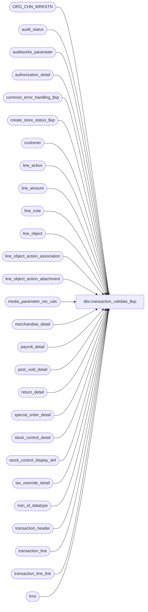

# dbo.transaction_validate_$sp

**Database:** auditworks_external  
**Server:** bedrockdb01  

## Architecture Diagram



## Table Dependencies

| Referenced Table |
|---|
| ORG_CHN_WRKSTN |
| audit_status |
| auditworks_parameter |
| authorization_detail |
| common_error_handling_$sp |
| create_store_status_$sp |
| customer |
| line_action |
| line_amount |
| line_note |
| line_object |
| line_object_action_association |
| line_object_action_attachment |
| media_parameter_rec_calc |
| merchandise_detail |
| payroll_detail |
| post_void_detail |
| return_detail |
| special_order_detail |
| stock_control_detail |
| stock_control_display_def |
| tax_override_detail |
| tran_id_datatype |
| transaction_header |
| transaction_line |
| transaction_line_link |
| trno |

## Stored Procedure Code

```sql
create proc dbo.transaction_validate_$sp 
@process_id	        binary(16),
@user_id                int,
@transaction_id		tran_id_datatype,
@errmsg			nvarchar(2000) OUTPUT,
@function_no		tinyint = 100

AS

/* Proc Name: transaction_validate_$sp
   Description: This stored procedure will validate if transaction is in
                balance, line_object/line_action/transaction_category exist,
		and verify if store and register/store exist. If a non-zero
                value is returned then the transaction is not valid.
   Called from transaction_modify_$sp and transaction_add_$sp. 
   
  HISTORY:  
Date     Name		Def# Desc
May06,14 Vicci        151821 Auto-repair UPC Lookup Division to make it 0 when Transaction Add / Modify erroneously inserts it as null.
Jul09,13 Vicci        139695 Take unit_of_measure into account when determining if transaction is in balance.
Oct09,12 Vicci 	      121947 Raise error if transaction is marked as a successful post-voiding transaction but the the corresponding transaction 
                             to be post-voided cannot be found or is not void in order avoid the the S/A Rejection reason 17 from disappearing.
Oct05,11 Vicci      1-47N6AB Compensate for UI defect whereby the object_type, reference_type, db_cr_none are not re-looked up when a transaction
                             category is modified by raising an error if this has occurred.
Apr25,11 Vicci        126452 Skip most validations for voided transactions.  Pass correct function to process error log.
Nov20,09 Vicci        106158 Check for missing attachments, reference_no.
Oct12,06 Paul        DV-1344 apply 75868 to SA5
Sep06,05 Paul        DV-1312 apply 56345 to SA5
Jun20,05 Paul        54934   apply 54931. Disallow saving tran without lines.
Apr28,05 Paul        DV-1234 expand transaction_id to use tran_id_datatype
Nov18,04 Maryam      DV-1167 Put back the reference to active flag.
Sep15,04 David       DV-1146 Use user_id instead of user_name. Remove reference to active flags.
May29,04 Maryam      DV-1071 Use ORG_CHN_WRKSTN instead of register table.
Apr29,04 Maryam      DV-1071 Receive @process_id and @user_name and pass it to the sub procs
Aug14,06 Daphna        75868 Add check for quantity counted too high
Jul13,05 ShuZ          56345 Change messeage_id from 203151 to 202016
May27,05 Daphna        54931 Check stock_control for missing mandatory fields
May01,02 Paul        1-CD0IX added R3 error handling
Oct11,01 Paul		8834 speed improvements to match Oracle
Mar13,01 Winnie		7305 Reject transaction whose transaction number already exist for the same store/register/
   		             date combination.   
Dec17,97 Paul
Jun25,97 Seb		     author
*/

DECLARE
  @audit_status			smallint,
  @date_reject_id		tinyint,
  @errno			int,
  @lines_exist			int,
  @reject_recur_tran		smallint,
  @register_no			smallint,
  @rows_line_object_action	int,
  @rows_transaction_line	int,
  @status_reject_reason		tinyint,
  @store_audit_status		smallint,
  @store_no			int,
  @transaction_category		tinyint,
  @transaction_no		trno,
  @transaction_date		smalldatetime,
  @transaction_total		line_amount,
  @transaction_void_flag	smallint,
  @object_name			nvarchar(255),
  @process_name			nvarchar(100),
  @operation_name		nvarchar(100),
  @message_id			int,
  @voided_transaction_void_flag smallint

SELECT @process_name = 'transaction_validate_$sp',
	@message_id = 201068

--Auto-repair UPC Lookup Division when Transaction Add / Modify erroneously inserts it as null instead of zero until they get around to fixing UI.
UPDATE stock_control_detail
   SET upc_lookup_division = 0
 WHERE transaction_id = @transaction_id
   AND upc_lookup_division IS NULL
SELECT @errno = @@error
IF @errno != 0
BEGIN
  SELECT @errmsg = 'Failed to auto-correct stock_control_detail UPC lookup division',
         @object_name = 'stock_control_detail',
         @operation_name = 'UPDATE'
  GOTO error
END
   
SELECT	@transaction_category = transaction_category,
	@store_no = store_no,
	@transaction_date = transaction_date,
	@date_reject_id = date_reject_id,
	@register_no = register_no,
	@transaction_void_flag = transaction_void_flag,
	@transaction_no = transaction_no
  FROM transaction_header
 WHERE transaction_id = @transaction_id
SELECT @errno = @@error
IF @errno != 0
  BEGIN
   SELECT @errmsg = 'Failed to select from transaction_header',
           @object_name = 'transaction_header',
           @operation_name = 'SELECT'
   GOTO error
  END

/*  If voiding reversal then set voiding reversal_flag = -1 if not already set. */

IF @transaction_void_flag = 8
  BEGIN
   UPDATE transaction_line
    SET voiding_reversal_flag = -1
    WHERE transaction_id = @transaction_id
      AND voiding_reversal_flag != -1

 SELECT @errno = @@error
   IF @errno != 0
   BEGIN
     SELECT @errmsg = 'Failed to update transaction_line (voiding_reversal_flag)',
           @object_name = 'transaction_line',
           @operation_name = 'UPDATE'
     GOTO error
   END
  END

--121947:  If the current transaction is marked as a successful post-voiding transaction determine if the transaction it attempted to void is void.
IF @transaction_void_flag = 5 AND @date_reject_id = 0
   AND EXISTS (SELECT 1 
                FROM post_void_detail v
                     LEFT OUTER JOIN transaction_line l
                       ON v.transaction_id = l.transaction_id
                      AND v.line_id = l.line_id 
               WHERE v.transaction_id = @transaction_id
                 AND v.post_void_successful = 1
                 AND COALESCE(l.line_void_flag, 0) = 0)
BEGIN 
  SELECT @voided_transaction_void_flag = MAX(vh.transaction_void_flag)
    FROM post_void_detail v
         INNER JOIN transaction_header vh
            ON vh.store_no = @store_no
           AND vh.register_no = v.post_voided_register
           AND vh.transaction_date >= dateadd(dd, -1, @transaction_date)
           AND vh.transaction_date <= @transaction_date
           AND vh.transaction_no = v.post_voided_trans_no
         LEFT OUTER JOIN transaction_line l
           ON v.transaction_id = l.transaction_id
          AND v.line_id = l.line_id 
   WHERE v.transaction_id = @transaction_id
     AND v.post_void_successful = 1
     AND COALESCE(l.line_void_flag, 0) = 0
  SELECT @errno = @@error
  IF @errno != 0
  BEGIN
    SELECT @errmsg = 'Failed to determine if transaction that should have been post-voided has been',
           @object_name = 'transaction_header',
           @operation_name = 'SELECT'
     GOTO error
  END
  
  IF @voided_transaction_void_flag IN (0,8)  --i.e. if transaction to be voided is not void
  BEGIN
    SELECT @errmsg = 'Transaction marked as successfully post-voided is NOT void.',
           @errno = 201755,
           @message_id = 201755
    GOTO error
  END
  ELSE
  BEGIN
    IF @voided_transaction_void_flag IS NULL
    BEGIN
      SELECT @errmsg = 'Transaction to be post-voided cannot be found.',
             @errno = 201756,
             @message_id = 201756
      GOTO error
    END
  END
END  --IF @transaction_void_flag = 5 AND @date_reject_id = 0

IF @transaction_void_flag = 5 --Don't do rest of validations for post-voiding transactions
  RETURN 

/* Check whether transaction is in balance */
SELECT @transaction_total = ISNULL(SUM (CASE WHEN COALESCE(unit_of_measure, 1) = 1 
                                             THEN db_cr_none * voiding_reversal_flag * (gross_line_amount - pos_discount_amount) 
                                             ELSE 0 END), 0),
       @rows_transaction_line = ISNULL(SUM(1 - line_void_flag),0) -- number of nonvoid lines
  FROM transaction_line
 WHERE transaction_id = @transaction_id 
   AND line_void_flag = 0
SELECT @errno = @@error
IF @errno != 0
  BEGIN
   SELECT @errmsg = 'Failed to select transaction_total',
  @object_name = 'transaction_line',
           @operation_name = 'SELECT'
   GOTO error
  END

IF @transaction_total != 0 AND @transaction_void_flag in (0, 8)
BEGIN
  SELECT @errmsg = 'Transaction being modified is out of balance.',
         @errno = 201505,
         @message_id = 201505
  GOTO error
END

/* Count number of lines that exist in line_object_action_association */
SELECT @rows_line_object_action = COUNT(transaction_id)
  FROM transaction_line tl, line_object_action_association lo
 WHERE tl.transaction_id = @transaction_id
   AND line_void_flag = 0
   AND tl.line_object != 0
   AND tl.line_action != 0
   AND tl.line_object = lo.line_object
   AND tl.line_action = lo.line_action
   AND lo.transaction_category = @transaction_category
SELECT @errno = @@error
IF @errno != 0
  BEGIN
   SELECT @errmsg = 'Failed to select lines from line_object_action_association',
           @object_name = 'line_object_action_association',
           @operation_name = 'SELECT'
   GOTO error
  END

/* Make sure that lines in transaction_line = line_object_action_association */
IF (@rows_line_object_action != @rows_transaction_line
  OR @transaction_category < 1)
BEGIN
  IF @transaction_void_flag in (0, 8)
  BEGIN
    SELECT @errmsg = 'Transaction has an invalid line_object/line_action.',
           @errno = 201504,
           @message_id = 201504
    GOTO error
  END
END

/* 1-47N6AB:  Find any lines whose transaction line settings don't match those in line_object_action_association (for example config changed or never looked up) */
SELECT @errmsg = NULL
SELECT @errmsg = MIN(COALESCE(o.line_object_description, convert(nvarchar, tl.line_object)) + ' ' + COALESCE(a.line_action_display_descr, convert(nvarchar, tl.line_action)))
  FROM transaction_line tl  
       INNER JOIN line_object_action_association lo
          ON tl.line_object = lo.line_object
	 AND tl.line_action = lo.line_action
  	 AND lo.transaction_category = @transaction_category   
        LEFT OUTER JOIN line_object o
          ON tl.line_object = o.line_object
        LEFT OUTER JOIN line_action a
          ON tl.line_action = a.line_action
 WHERE tl.transaction_id = @transaction_id
   AND tl.line_void_flag = 0
   AND tl.line_object > 0
   AND tl.line_action != 0
   AND (tl.reference_type <> lo.reference_type
        OR tl.line_object_type <> lo.line_object_type
	OR tl.db_cr_none <> lo.db_cr_none)
SELECT @errno = @@error
IF @errno != 0
BEGIN
  SELECT @errmsg = 'Failed to select lines with changed config from line_object_action_association',
         @object_name = 'line_object_action_association',
         @operation_name = 'SELECT'
  GOTO error
END
IF @errmsg IS NOT NULL
BEGIN
  SELECT @errmsg = 'Transaction has an Object/Action whose configuration has been modified since being entered.  Please void and re-enter these lines. Example:  ' + @errmsg,
         @errno = 201782, 
         @message_id = 201782  
  GOTO error
END

SELECT @audit_status = audit_status
  FROM audit_status
 WHERE sales_date = @transaction_date
   AND store_no = @store_no 
   AND register_no = @register_no
   AND date_reject_id = @date_reject_id
SELECT @errno = @@error
IF @errno != 0
  BEGIN
   SELECT @errmsg = 'Failed to select audit_status',
           @object_name = 'audit_status',
           @operation_name = 'SELECT'
   GOTO error
  END

IF @transaction_void_flag in (0, 8)
BEGIN
  -- Ensure that stock control mandatory fields are not missing
  IF EXISTS (SELECT 1
           FROM stock_control_detail sc, stock_control_display_def sd, transaction_line tl
           WHERE sc.transaction_id = @transaction_id
           AND tl.line_void_flag = 0
           AND tl.transaction_id = sc.transaction_id
           AND tl.line_id = sc.line_id
           AND sc.display_def_id = sd.display_def_id
           AND ( (sd.merchandise_key_mandatory = 1 AND sc.merchandise_key IS NULL)
              OR (sd.units_mandatory = 1 AND sc.units IS NULL)
              OR (sd.other_store_no_mandatory = 1 AND sc.other_store_no IS NULL)
              OR (sd.location_no_mandatory = 1 AND sc.location_no IS NULL)
              OR (sd.vendor_no_mandatory = 1 AND sc.vendor_no IS NULL)
              OR (sd.count_date_mandatory = 1 AND sc.count_date IS NULL)
              OR (sd.pos_identifier_mandatory = 1 AND sc.pos_identifier IS NULL)
              OR (sd.pos_id_type_mandatory = 1 AND sc.pos_identifier_type IS NULL)
              OR (sd.pos_deptclass_mandatory = 1 AND sc.pos_deptclass IS NULL)
              OR (sd.upc_division_mandatory = 1 AND sc.upc_lookup_division IS NULL)
              OR (sd.originating_str_mandatory = 1 AND sc.originating_store_no IS NULL)
              OR (sd.imrd_mandatory = 1 AND sc.imrd IS NULL)
              OR( sd.reason_mandatory = 1 AND sc.reason IS NULL)      
               )       
          )
  BEGIN
    SELECT @errmsg = 'Transaction is missing a mandatory field in the Information Set Attachment.',
           @errno = 202016,
           @message_id = 202016
    GOTO error
  END

  -- Ensure that mandatory attachments are not missing
  IF EXISTS (
  SELECT 1
    FROM (
  SELECT tl.transaction_id,
  	  tl.line_id,
	  la.attachment_type,
  	  la.note_type
    FROM transaction_header th WITH (NOLOCK), transaction_line tl WITH (NOLOCK), line_object_action_attachment la
   WHERE th.transaction_void_flag IN (0,8)
   AND th.transaction_id = @transaction_id
   AND th.transaction_id = tl.transaction_id
   AND tl.line_void_flag = 0
   AND th.transaction_category = ISNULL(la.transaction_category, th.transaction_category)
   AND tl.line_object = la.line_object
   AND tl.line_action = la.line_action
   AND la.attachment_mandatory = 1
   AND la.attachment_type >= 1
   AND la.attachment_type != 12 -- ignore attachments that should never be mandatory (setup mistake)
  UNION
  SELECT th.transaction_id,
	 0 as line_id,
	 la.attachment_type,
	 la.note_type
    FROM transaction_header th WITH (NOLOCK), line_object_action_attachment la
   WHERE th.transaction_void_flag IN (0,8)
     AND th.transaction_id = @transaction_id
     AND th.transaction_category = ISNULL(la.transaction_category, th.transaction_category)
     AND la.line_object = -1
     AND la.attachment_mandatory = 1
     AND la.attachment_type >= 1
     AND la.attachment_type not in (7, 12, 13) -- ignore attachments that should never be mandatory (setup mistake)
         ) q
   WHERE (
          (q.attachment_type = 1 AND NOT EXISTS (SELECT 1 FROM merchandise_detail a WHERE a.transaction_id = @transaction_id AND a.transaction_id = q.transaction_id AND a.line_id = q.line_id))
          OR
          (q.attachment_type = 2 AND NOT EXISTS (SELECT 1 FROM authorization_detail a WHERE a.transaction_id = @transaction_id AND a.transaction_id = q.transaction_id AND a.line_id = q.line_id))        
          OR
          (q.attachment_type = 3 AND NOT EXISTS (SELECT 1 FROM stock_control_detail a WHERE a.transaction_id = @transaction_id AND a.transaction_id = q.transaction_id AND a.line_id = q.line_id AND a.display_def_id = q.note_type))        
          OR
          (q.attachment_type = 4 AND NOT EXISTS (SELECT 1 FROM special_order_detail a WHERE a.transaction_id = @transaction_id AND a.transaction_id = q.transaction_id AND a.line_id = q.line_id))        
          OR
          (q.attachment_type = 5 AND NOT EXISTS (SELECT 1 FROM post_void_detail a WHERE a.transaction_id = @transaction_id AND a.transaction_id = q.transaction_id AND a.line_id = q.line_id))        
          OR
          (q.attachment_type = 6 AND NOT EXISTS (SELECT 1 FROM payroll_detail a WHERE a.transaction_id = @transaction_id AND a.transaction_id = q.transaction_id AND a.line_id = q.line_id))        
          OR
          (q.attachment_type = 8 AND NOT EXISTS (SELECT 1 FROM tax_override_detail a WHERE a.transaction_id = @transaction_id AND a.transaction_id = q.transaction_id AND a.line_id = q.line_id))        
          OR
          (q.attachment_type = 9 AND NOT EXISTS (SELECT 1 FROM return_detail a WHERE a.transaction_id = @transaction_id AND a.transaction_id = q.transaction_id AND a.line_id = q.line_id))        
          OR
          (q.attachment_type = 10 AND NOT EXISTS (SELECT 1 FROM line_note a WHERE a.transaction_id = @transaction_id AND a.transaction_id = q.transaction_id AND a.line_id = q.line_id AND a.note_type = q.note_type))        
          OR
          (q.attachment_type = 11 AND NOT EXISTS (SELECT 1 FROM customer a WHERE a.transaction_id = @transaction_id AND a.transaction_id = q.transaction_id AND a.line_id = q.line_id))        
          OR
          (q.attachment_type = 13 AND NOT EXISTS (SELECT 1 FROM transaction_line_link k, transaction_line l WHERE k.transaction_id = @transaction_id AND k.transaction_id = q.transaction_id AND k.line_id = q.line_id AND k.transaction_id = l.transaction_id and k.line_id = l.line_id AND l.line_object * 1000 + l.line_action = q.note_type))        
         )
  )
  BEGIN
    SELECT @errmsg = 'Transaction is missing a mandatory attachment.',
           @errno = 202020,
           @message_id = 202020
    GOTO error
  END

  -- Ensure that mandatory reference_no are not missing
  IF EXISTS (SELECT 1
 FROM transaction_header th WITH (NOLOCK), transaction_line tl WITH (NOLOCK), line_object_action_association loa
              WHERE th.transaction_void_flag IN (0,8)
                AND th.transaction_id = @transaction_id
                AND th.transaction_id = tl.transaction_id
                AND tl.line_void_flag = 0
                AND th.transaction_category = loa.transaction_category
                AND tl.line_object = loa.line_object
                AND tl.line_action = loa.line_action
                AND tl.reference_type <> 0
                AND COALESCE(tl.reference_no, '') = ''
                AND loa.reference_type <> 0 
                AND COALESCE(reference_no_option, 1) = 0
  )
  BEGIN
    SELECT @errmsg = 'Transaction is missing a mandatory reference number.',
           @errno = 202021,
           @message_id = 202021
    GOTO error
  END
END --IF @transaction_void_flag in (0, 8)

  /* disallow entering a transaction without lines */

  SELECT @lines_exist = @rows_transaction_line -- nonvoid lines
  IF @lines_exist = 0
  BEGIN
    IF EXISTS(SELECT 1
                FROM transaction_line
               WHERE transaction_id = @transaction_id)
      SELECT @lines_exist = 1

    IF @lines_exist = 0
    BEGIN
      SELECT @errmsg = 'Transaction does not contain any lines',
	     @errno = 201760,
	     @message_id = 201760
      GOTO error
    END
  END -- If @lines_exist = 0

  /* If register status does not exist then do further verification */


IF @audit_status NOT IN (100,200) OR @date_reject_id > 0
BEGIN
  /* Verify that store exists */
  EXEC create_store_status_$sp @process_id, @user_id, @store_no, @transaction_date, @date_reject_id OUTPUT,
	@status_reject_reason OUTPUT, @errmsg OUTPUT, 0, @function_no

   SELECT @errno = @@error
   IF @errno != 0
   BEGIN
     IF @errmsg IS NULL /* then */
       SELECT @errmsg = 'Failed to execute stored procedure create_store_status.'
     SELECT @object_name = 'create_store_status_$sp',
           @operation_name = 'EXEC'
     GOTO error
   END

   IF (@status_reject_reason != 0 AND @status_reject_reason != 99)
     BEGIN
      SELECT @errmsg = 'Store/Date has invalid status.',
		@errno = 201519 -- default error message
      IF (@status_reject_reason = 2)
	SELECT @errmsg = 'Period closed.',
		@errno = 201507

    IF (@status_reject_reason = 3)
	SELECT @errmsg = 'Transaction date is a future date.',
		@errno = 201508

      IF (@status_reject_reason = 4)
	SELECT @errmsg = 'Store/Date has already been completed.',
		@errno = 201519

      IF (@status_reject_reason = 7)
	SELECT @errmsg = 'Store does not exist.',
		@errno = 201509

      IF (@status_reject_reason = 8)
	SELECT @errmsg = 'Invalid Register. Store/Register does not exist in the Register_table',
		@errno = 201516

      IF (@status_reject_reason = 11)
	SELECT @errmsg = 'Transaction date has already been accepted.',
		@errno = 201522

      SELECT @message_id = @errno,
           @object_name = 'audit_status',
           @operation_name = 'SELECT'      
      GOTO error
     END

    /* Verify if store/register exists */
    IF NOT EXISTS (SELECT 1
                     FROM ORG_CHN_WRKSTN
		    WHERE ORG_CHN_NUM = @store_no
		      AND WRKSTN_NUM = @register_no
		      AND ACTV = 1)
      BEGIN
       SELECT @errmsg = 'Store/Register does not exist in register table',
		@errno = 201516,
		@message_id = 201516
       GOTO error
      END

  END -- If @audit_status NOT IN (100,200) ...


IF @function_no = 150
  BEGIN
   SELECT @reject_recur_tran = CONVERT(smallint, par_value)
     FROM auditworks_parameter
    WHERE par_name = 'reject_recurring_trans_number'
      
   SELECT @errno = @@error
   IF @errno != 0
     BEGIN
      SELECT @errmsg = 'Failed to select from auditworks_parameter',
           @object_name = 'auditworks_parameter',
           @operation_name = 'SELECT'
      GOTO error
     END 

   IF @reject_recur_tran = 1 
     BEGIN
      IF EXISTS (SELECT transaction_id FROM transaction_header
              WHERE store_no = @store_no
                AND register_no = @register_no
                AND transaction_date = @transaction_date
                AND transaction_no = @transaction_no
                AND transaction_id <> @transaction_id)
        BEGIN 
         SELECT @errmsg = 'Store/Register/transaction date/transaction no already exists',
           @errno = 201515,
                @message_id = 201515
         GOTO error
        END               
     END

  END -- If @function_no = 150

/* reject when counted quantity too high  */

IF EXISTS
   (SELECT tl.transaction_id
    FROM transaction_line tl, media_parameter_rec_calc m
    WHERE tl.transaction_id = @transaction_id
    AND line_void_flag = 0
    AND tl.line_object = m.line_object
    AND tl.line_action = m.line_action
    AND m.rec_amount_type = 2  -- quantity
    AND tl.gross_line_amount > 32767)

BEGIN
         SELECT @errmsg = 'Quantity Counted exceeds valid range',
                @errno = 202017,
                @message_id = 202017
         GOTO error

END


RETURN

error:   /* Common error handler. */

	EXEC common_error_handling_$sp @function_no, @errno, @errmsg, 0, @message_id, 
	     @process_name, @object_name, @operation_name, 0, 1, 0, null, 0, null,
	     null, null, null, null, null, 0, @process_id, @user_id
	     
	RETURN
```

