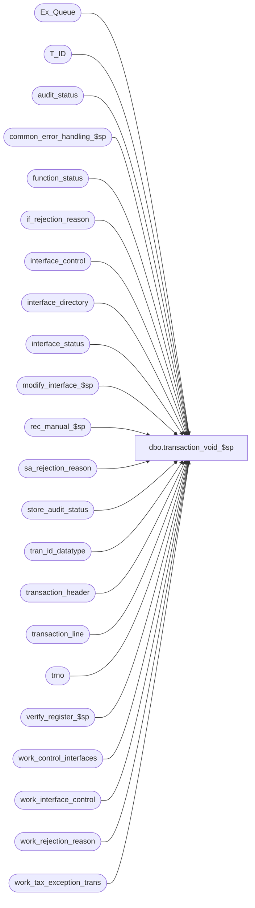

# dbo.transaction_void_$sp

**Database:** auditworks_external  
**Server:** bedrockdb01  

## Architecture Diagram



## Table Dependencies

| Referenced Table |
|---|
| Ex_Queue |
| T_ID |
| audit_status |
| common_error_handling_$sp |
| function_status |
| if_rejection_reason |
| interface_control |
| interface_directory |
| interface_status |
| modify_interface_$sp |
| rec_manual_$sp |
| sa_rejection_reason |
| store_audit_status |
| tran_id_datatype |
| transaction_header |
| transaction_line |
| trno |
| verify_register_$sp |
| work_control_interfaces |
| work_interface_control |
| work_rejection_reason |
| work_tax_exception_trans |

## Stored Procedure Code

```sql
create proc dbo.transaction_void_$sp @process_id		binary(16),
@user_id		int,
@transaction_id		tran_id_datatype,
@errmsg			nvarchar(2000) OUTPUT,
@ENTRY_ID		T_ID,
@function_status	tinyint  = 1, 
@rec_process_id		numeric(12,0) = NULL -- NULL unless recovering.

AS

/* Proc Name: transaction_void_$sp

   Description: Void a transaction.
     Called by front end and function_cleanup_$sp.

HISTORY:
Date     Name        Defect# Desc
Sep23,13 Vicci        146826 Expand @errmsg since expanded in modify_interface_$sp.
Mar03,11 Vicci        125568 delete work_tax_exception_trans table used for restores once done with it.
Aug17,10 Paul         120039 delete work_interface_control moved here from modify_interface_$sp to support error recovery scenarios
Jun27,05 Paul        DV-1286 update interface_control rows (to 98) where interface_status_flag was 1 and avoid deleting
				 them. Also reduce size of begin tran to reduce locking.
Apr28,05 Paul        DV-1234 expand transaction_id to use tran_id_datatype
Dec01,04 David       DV-1181 Fix rollforward logic when transaction was an SA reject before.
Sep15,04 IanK        DV-1146 Use user_id
Jul30,04 David/Paul  DV-1071 Remove Insert to old audit trail tables, pass @ENTRY_ID,
                             Include Rollforward logic, Use ORG_CHN table as new Store table.
May29,04 Maryam      DV-1071 Use ORG_CHN_WRKSTN instead of register table. Modified to @process_id
                              as input parameters and pass it to the sub procs.
Apr08,04 Sab	     DV-1068 remove code for old customer liability and old media rec code
Feb10,04 Paul          22943 abort if can't find transaction (frontend problem),
			     avoid locked status when new media rec for trickle,
			     correct determination of old vs new media rec
Aug06,03 Paul          11627 add begin tran
Jun13,03 Paul        1-KX549 call new media rec, call verify_register_$sp
Jan30,03 Winnie	        5815 update audit_trail_detail when voiding a promotion transaction.
Jul26,02 Paul        1-E7L7M populate key_11 in Ex_Queue with entry_date_time
04-Dec-01  David C   1-9ATXP Move call to cust_liability_edit_$sp to modify_interface_$sp AND
                                change code for New error handling.
03-Aug-01  David C      8462 Call cust_liability_edit_$sp for R3 customer liability
09-Apr-01  Bayani D	7376 Remove lines which accesses 'HO' tables and proc.
29-Mar-01  Phu		7501 Use system function to retrieve user name
04-Dec-00  Phu		7011 Call calc_drawer_discrepancy_$sp to re-calculate drawer discrepancy
04-Jul-00  Phu   	6455 Remove GROUP BY clause where there is no aggregate function
08-Jun-00  Vicci   	6410 Replaced call to glc_$sp with call to Glc_$sp
05-Jun-00  Vicci	6389 modify call to modify_interface_$sp for new passing params;
04-Feb-00  Daphna F	4671 include line_action 56 (bal forward) and line_obj_type 21 
				(petty cash) in defn of petty cash txn delete petty_cash_rec 
				for voided txn and recalculate drawer discrepancy
30-Nov-99  Daphna F	5652 Pass parameter transaction_id = -6 in call to 
				media_reconciliation to force recalculation of all amounts. 
				Pass function_no to media_rec to prevent early unlocking of store.
				Remove condition of bypass_media_rec = 1 on unlock.
15-JUN-99  Louise M	4526 Added code to handle trickle edit processing.
07-Apr-99  Daphna F	4423 Added simulated cursor to control update on media_reconciliation
				for expected amounts
17-Mar-99  Mat C 	n/a  Added @function_no to parameters of modify_interface_$sp
12-Mar-99  Paul S	4355 Fixed voiding sarejects and cleanup logic
23-Jan-97  Seb		
07-Jan-97  Seb               Author

*/
DECLARE
  @audit_status			smallint,
  @cashier_no			int,
  @cashier_no1			int,
  @copy_transaction_id		tran_id_datatype,
  @date_reject_id		tinyint,
  @defer_flag			tinyint,
  @entry_date_time		datetime,
  @errno			int,
  @exception_flag		tinyint,
  @if_rejection_flag		tinyint,
  @in_out_both_flag		tinyint,
  @interface_in			tinyint,
  @interface_out		tinyint,
  @line_object                  int,
  @old_sa_rejection_flag	tinyint,
  @recovery_flag		tinyint,
  @register_no			smallint,
  @register_trickle_flag	tinyint,
  @rows				int,
  @sa_rejection_flag		tinyint,
  @sa_reject_qty_neg		tinyint,
  @store_no			int,
  @transaction_category		tinyint,
  @transaction_date		smalldatetime,
  @transaction_no		trno,
  @transaction_series		nchar(1),
  @trickle_in_progress_flag	tinyint,
  @key_value			nvarchar(255),
  @key_value_descr		nvarchar(255),
  @table_name			nvarchar(25),
  @before_value			nvarchar(255),
  @after_value			nvarchar(255),
  @function_no			tinyint,
  @action			tinyint,
  @message_id			int,
  @object_name			nvarchar(255),
  @operation_name		nvarchar(100),
  @process_name			nvarchar(100)

SET NOCOUNT ON

SELECT @function_no = 110,
	@interface_in = 0,
	@interface_out = 1,
	@process_name = 'transaction_void_$sp',
	@message_id = 201068,
	@in_out_both_flag = 3,
	@trickle_in_progress_flag = 0,
	@register_trickle_flag = 0,
	@recovery_flag = 0

IF @function_status > 1
  SELECT @recovery_flag = 1
ELSE
  BEGIN
   UPDATE function_status
     SET ENTRY_ID = @ENTRY_ID
    WHERE process_id = @process_id
     AND user_id = @user_id
     AND function_no = @function_no

   SELECT @errno = @@error
   IF @errno != 0
      BEGIN
       SELECT @errmsg = 'Failed to set ENTRY_ID',
              @object_name = 'function_status',
              @operation_name = 'UPDATE'
       GOTO error
      END
  END
	
SELECT	@store_no = store_no,
	@transaction_date = transaction_date,
	@date_reject_id = date_reject_id,
	@register_no = register_no,
	@old_sa_rejection_flag = sa_rejection_flag,
	@if_rejection_flag = if_rejection_flag,
	@exception_flag = exception_flag,
	@copy_transaction_id = copy_transaction_id,
	@entry_date_time = entry_date_time,
	@cashier_no = cashier_no,
	@transaction_no = transaction_no,
	@transaction_series = transaction_series,
	@transaction_category = transaction_category
  FROM transaction_header
 WHERE transaction_id = @transaction_id

SELECT @errno = @@error,
	@rows = @@rowcount
IF @errno != 0 OR @rows = 0
  BEGIN
   SELECT @errmsg = 'Failed to select from transaction_header',
	  @object_name = 'transaction_header',
	  @operation_name = 'SELECT'
   GOTO error
  END

SELECT @trickle_in_progress_flag = ISNULL(trickle_in_progress_flag,0)
  FROM store_audit_status 
 WHERE store_no = @store_no
   AND sales_date = @transaction_date
   AND date_reject_id = @date_reject_id

SELECT @errno = @@error
IF @errno != 0
  BEGIN
   SELECT @errmsg = 'Failed to select trickle flag from store_audit_status',
	  @object_name = 'store_audit_status',
	  @operation_name = 'SELECT'
   GOTO error
  END

/* Check if register is currently trickling in if reg or reg/cashier balancing - if not
       trickling , then media rec will be updated */
IF @trickle_in_progress_flag = 1 
  BEGIN
   SELECT @register_trickle_flag= ISNULL(trickle_in_progress_flag ,0)
     FROM audit_status
    WHERE store_no = @store_no
      AND register_no = @register_no
      AND sales_date = @transaction_date
      AND date_reject_id = @date_reject_id
       
   SELECT @errno = @@error
   IF @errno != 0
     BEGIN
      SELECT @errmsg = 'Failed to select trickle flag from audit_status',
	 @object_name = 'audit_status',
	 @operation_name = 'SELECT'
      GOTO error
     END
  END

IF @function_status = 1 
BEGIN

  IF @old_sa_rejection_flag = 0 
  BEGIN
    EXEC modify_interface_$sp @process_id, @user_id, @transaction_id, @errmsg OUTPUT, @function_no, @interface_in, @interface_out 

    SELECT @errno = @@error
    IF @errno != 0
    BEGIN
      IF (@errmsg IS NULL OR @errmsg = '')
  	SELECT @errmsg = 'Failed to execute stored procedure modify_interface_$sp'
      SELECT @object_name = 'modify_interface_$sp',
           @operation_name = 'EXECUTE'
  GOTO error
    END
  END -- If @old_sa_rejection_flag = 0

  BEGIN TRANSACTION

  IF @old_sa_rejection_flag = 0 
  BEGIN

    INSERT Ex_Queue (
 		queue_id, -- interface_id
 		key_1, --if_entry_no
		key_2, --interface_control_flag
		key_9, -- effective_date
		key_10, -- interface_posting_date
		key_11) -- entry_date_time
    SELECT interface_id,
   	   entry_no,
    	   interface_control_flag,
    	   @transaction_date,
	   getdate(),
	   @entry_date_time
      FROM work_control_interfaces
     WHERE process_id = @process_id
       AND type = 'i'

    SELECT @errno = @@error
    IF @errno != 0
    BEGIN
      SELECT @errmsg = 'Failed to insert Ex_Queue',
       @object_name = 'Ex_Queue',
	     @operation_name = 'INSERT'
	GOTO error
    END
  END -- IF @old_sa_rejection_flag = 0

  SELECT @function_status = 10
    
  UPDATE function_status
     SET status = @function_status -- 10
   WHERE process_id = @process_id
     AND function_no = @function_no

    SELECT @errno = @@error
    IF @errno != 0
      BEGIN
       SELECT @errmsg = 'Failed to set status = 10',
              @object_name = 'function_status',
              @operation_name = 'UPDATE'
       GOTO error
      END
  
  COMMIT TRANSACTION
END -- IF @function_status = 1 
 

IF @function_status = 10 -- rollforward starts here
BEGIN
  IF @old_sa_rejection_flag = 0 
  BEGIN
    UPDATE interface_status
       SET last_posting_datetime = getdate()
      FROM interface_directory id, interface_status st
     WHERE update_timing = 1
       AND st.interface_id = id.interface_id

    SELECT @errno = @@error
    IF @errno != 0
    BEGIN
      SELECT @errmsg = 'Failed to update interface_status',
             @object_name = 'function_status',
             @operation_name = 'UPDATE'
      GOTO error
    END
  END -- @old_sa_rejection_flag = 0 

  DELETE work_interface_control
   WHERE process_id = @process_id

  SELECT @errno = @@error
  IF @errno != 0
  BEGIN
    SELECT @errmsg = 'Failed to clean up work_interface_control',
           @object_name = 'work_interface_control',
           @operation_name = 'DELETE'
    GOTO error
  END

  DELETE work_tax_exception_trans
   WHERE process_id = @process_id
  SELECT @errno = @@error
  IF @errno != 0
  BEGIN
    SELECT @errmsg = 'Unable to delete work_tax_exception_trans',
  	   @object_name = 'work_tax_exception_trans',
	   @operation_name = 'DELETE'
    GOTO error
  END

  SELECT @function_status = 20

  UPDATE function_status
     SET status = @function_status -- 20
   WHERE process_id = @process_id
     AND function_no = @function_no

    SELECT @errno = @@error
    IF @errno != 0
    BEGIN
      SELECT @errmsg = 'Failed to set status = 20',
             @object_name = 'function_status',
             @operation_name = 'UPDATE'
      GOTO error
    END
END -- @function_status = 10 


IF @function_status = 20 
BEGIN

  UPDATE interface_control
     SET interface_status_flag = 98 -- flag interfaces that were already fed before the tran was voided
   WHERE transaction_id = @transaction_id
     AND interface_status_flag = 1

  SELECT @errno = @@error
  IF @errno != 0
  BEGIN
    SELECT @errmsg = 'Failed to UPDATE interface_control',
           @object_name = 'interface_control',
           @operation_name = 'UPDATE'
    GOTO error
  END

  -- clean up rows that were needed to rollback the transaction
  DELETE FROM interface_control
   WHERE transaction_id = @transaction_id
     AND interface_status_flag != 98

  SELECT @errno = @@error
  IF @errno != 0
  BEGIN
    SELECT @errmsg = 'Failed to DELETE on interface_control',
           @object_name = 'interface_control',
           @operation_name = 'DELETE'
    GOTO error
  END

  DELETE FROM if_rejection_reason
   WHERE transaction_id = @transaction_id

  SELECT @errno = @@error
  IF @errno != 0
  BEGIN
    SELECT @errmsg = 'Failed to DELETE on if_rejection_reason',
           @object_name = 'if_rejection_reason',
 @operation_name = 'DELETE'
    GOTO error
  END

  DELETE FROM sa_rejection_reason 
   WHERE transaction_id = @transaction_id
     AND violated_sareject_rule >= 5
     AND violated_sareject_rule != 7

  SELECT @errno = @@error
  IF @errno != 0
  BEGIN
    SELECT @errmsg = 'Failed to DELETE on sa_rejection_reason',
           @object_name = 'sa_rejection_reason',
        @operation_name = 'DELETE'
    GOTO error
  END

  UPDATE transaction_line
     SET interface_rejection_flag = 0,
         exception_flag = 0
   WHERE transaction_id = @transaction_id
     AND (interface_rejection_flag = 1 OR exception_flag = 1)

  SELECT @errno = @@error
  IF @errno != 0
  BEGIN
    SELECT @errmsg = 'Failed to UPDATE on transaction_line',
           @object_name = 'transaction_line',
           @operation_name = 'UPDATE'
    GOTO error
  END

  SELECT @function_status = 30

  UPDATE function_status
     SET status = @function_status -- 30
   WHERE process_id = @process_id
     AND function_no = @function_no

  SELECT @errno = @@error
  IF @errno != 0
  BEGIN
    SELECT @errmsg = 'Failed to set status to 30',
           @object_name = 'function_status',
           @operation_name = 'UPDATE'
    GOTO error
  END 

END -- IF @function_status = 20 


SELECT @sa_reject_qty_neg = 0,
       @sa_rejection_flag = 0

IF @old_sa_rejection_flag = 1
BEGIN
  SELECT @sa_reject_qty_neg = 1, 
         @in_out_both_flag = 1
    
  IF EXISTS (SELECT transaction_id
               FROM sa_rejection_reason
     WHERE transaction_id = @transaction_id)
 SELECT @sa_rejection_flag = 1, /* rejects still exist */
           @sa_reject_qty_neg = 0
END


IF @function_status = 30 
BEGIN
  EXEC rec_manual_$sp @function_no, @process_id, @rec_process_id, @in_out_both_flag, @errmsg OUTPUT, 
                      @recovery_flag, @user_id, @ENTRY_ID, @transaction_id

  SELECT @errno = @@error
  IF @errno != 0
  BEGIN
    IF (@errmsg IS NULL OR @errmsg = '')
	SELECT @errmsg = 'Failed to execute rec_manual_$sp'
    SELECT @object_name = 'rec_manual_$sp',
           @operation_name = 'EXECUTE'
    GOTO error
  END

  SELECT @function_status = 40

  UPDATE function_status
     SET status = @function_status
   WHERE process_id = @process_id
     AND function_no = @function_no

  SELECT @errno = @@error
  IF @errno != 0
  BEGIN
    SELECT @errmsg = 'Failed to set status to 40',
           @object_name = 'function_status',
           @operation_name = 'UPDATE'
    GOTO error
  END  
END -- IF @function_status = 30 


IF @function_status = 40 
BEGIN
  DELETE FROM work_rejection_reason
   WHERE if_entry_no = @copy_transaction_id

  SELECT @errno = @@error
  IF @errno != 0
  BEGIN
    IF @errmsg IS NULL /* then */
      SELECT @errmsg = 'Failed to DELETE on work_rejection_reason'
    SELECT @object_name = 'work_rejection_reason',
           @operation_name = 'DELETE'
    GOTO error
  END

  SELECT @defer_flag = MIN(deferred)
    FROM if_rejection_reason
   WHERE transaction_id = @transaction_id

  UPDATE audit_status
     SET audit_status = 100
   WHERE store_no = @store_no
     AND register_no = @register_no
     AND sales_date = @transaction_date
     AND date_reject_id = @date_reject_id
     AND (audit_status >= 101 AND audit_status <= 300)

  SELECT @errno = @@error
  IF @errno != 0
  BEGIN
    SELECT @errmsg = 'Failed to set audit_status',
           @object_name = 'audit_status',
           @operation_name = 'UPDATE'
    GOTO error
  END

  BEGIN TRAN

  UPDATE transaction_header
     SET exception_flag = 0,
         sa_rejection_flag = @sa_rejection_flag,
         if_rejection_flag = 0,
         edit_progress_flag = 0,
         last_modified_date_time = getdate(),
         transaction_void_flag = 4,
         updated_by_user_id = @user_id
   WHERE transaction_id = @transaction_id

  SELECT @errno = @@error
  IF @errno != 0
  BEGIN
  SELECT @errmsg = 'Failed to UPDATE on transaction_header',
           @object_name = 'transaction_header',
           @operation_name = 'UPDATE'
    GOTO error
  END

  UPDATE audit_status
     SET sa_reject_qty = sa_reject_qty - @sa_reject_qty_neg,
         if_reject_qty = if_reject_qty - @if_rejection_flag + ISNULL(@defer_flag,0),
         exception_qty = exception_qty - @exception_flag, 
         valid_qty = valid_qty + @sa_reject_qty_neg
   WHERE store_no = @store_no
     AND register_no = @register_no
     AND sales_date = @transaction_date
     AND date_reject_id = @date_reject_id

  SELECT @errno = @@error
  IF @errno != 0
  BEGIN
    SELECT @errmsg = 'Failed to UPDATE on audit_status',
           @object_name = 'audit_status',
           @operation_name = 'UPDATE'
    GOTO error
  END

  EXEC verify_register_$sp @process_id, @user_id, @store_no, @register_no, @transaction_date, @date_reject_id, @errmsg OUTPUT, 3

  SELECT @errno = @@error
  IF @errno != 0
  BEGIN
    IF (@errmsg IS NULL OR @errmsg = '')
      SELECT @errmsg = 'Failed to execute stored procedure verify_register_$sp'
    SELECT @object_name = 'verify_register_$sp',
           @operation_name = 'EXECUTE'
    GOTO error
  END

  /* Unlock store date in store_audit_status since not unlocked by media rec */
  UPDATE store_audit_status
     SET update_in_progress = 0,
         process_id         = @process_id
   WHERE store_no       = @store_no
     AND sales_date     = @transaction_date
     AND date_reject_id = @date_reject_id

  SELECT @errno = @@error
  IF @errno != 0
  BEGIN
    SELECT @errmsg = 'Failed to update (unlock) store_audit_status',
           @object_name = 'store_audit_status',
           @operation_name = 'UPDATE'	
    GOTO error
  END

  DELETE FROM function_status
   WHERE process_id = @process_id 
     AND function_no = @function_no

  SELECT @errno = @@error
  IF @errno != 0
  BEGIN
    SELECT @errmsg = 'Failed to DELETE on function_status',
           @object_name = 'function_status',
           @operation_name = 'DELETE' 
    GOTO error
  END

  COMMIT TRAN

END -- IF @function_status = 40 


RETURN

error:   /* Common error handler. */


	EXEC common_error_handling_$sp @function_no, @errno, @errmsg, 0, @message_id, 
	@process_name, @object_name, @operation_name, 0, 1, 0, null, 0, null, null, null,
	  null, null, null, 0, @process_id, @user_id
	RETURN
```

