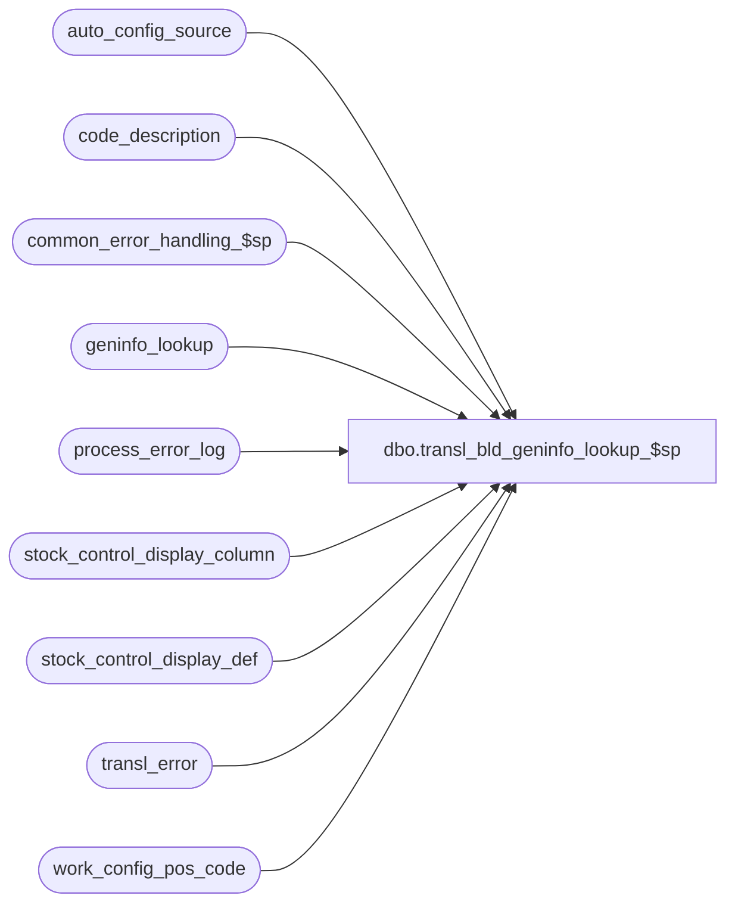

# dbo.transl_bld_geninfo_lookup_$sp

**Database:** auditworks_external  
**Server:** bedrockdb01  

## Architecture Diagram



## Table Dependencies

| Referenced Table |
|---|
| auto_config_source |
| code_description |
| common_error_handling_$sp |
| geninfo_lookup |
| process_error_log |
| stock_control_display_column |
| stock_control_display_def |
| transl_error |
| work_config_pos_code |

## Stored Procedure Code

```sql
create proc dbo.transl_bld_geninfo_lookup_$sp @request_id		binary(16),
@process_no		smallint

AS

/* 
PROC NAME: transl_bld_geninfo_lookup_$sp
     DESC: This proc will try to populate geninfo_lookup and stock_control_display_def.
           The proc is called from transl_auto_configure_$sp and runs on the TM database.            
     
 HISTORY: 
Date      Name          Defect# Desc
Mar03,15  Vicci      TFS-108714 Set correct message_id for error_code 201684 (should be 201684 Invalid passing arguments..., not 201687 dayend is skipping...)
Nov17,14  Vicci       TFS-92961 Validate that datatype received from POS is valid.  If not, substitute a datatype of S=String and log a translate reject.
Sep05,13  Vicci          146455 Track the transaction which caused Information Set Display Labels to be auto-configured in code_description.
May22,13  Vicci          144074 Avoid Msg 515 "Cannot insert the value NULL into column 'process_id', table 'process_error_log'".
Apr18,13  Vicci		 143421 Avoid error 515 "Cannot insert the value NULL into column 'item_code', table 'auto_config_source'" 
                                by set work_config_pos_code.code to geninfo_lookup.form_code.
Mar01,13  Vicci          142151 Avoid error 8152 "String or binary data would be truncated" on insert of GENINFO.FIELD.Name > 20 characters for
                                code-type 223 alpha code.
Feb01,13  Vicci          141488 Populate auto_config_source based on source transaction info from work_config_pos_code.
Feb17,12  Vicci          133087 Remove references to CRDM datatypes from procs installed in multi-stream S/A databases where CRDM is not installed.
Sep16,11  Vicci          129791 Set code-types to 5 (free-form) explicitly since table defaults are different.
Mar20,06  David         DV-1332 Create any new display_def_id in the 1000+ range.
Jun27,05  David         DV-1285 Get form_name from new column in work table instead of lookup_pos_code.
Mar18,05  David         DV-1202 Author
*/

DECLARE  
  @column_name 			nvarchar(30), 
  @cursor_open                  tinyint,
  @errno                        int,
  @errmsg                       nvarchar(255),
  @display_def_id		smallint,
  @form_name			nvarchar(255),
  @field_name			nvarchar(255),
  @field_datatype		nvarchar(1),
  @message_id			int,
  @object_name			nvarchar(255),
  @operation_name		nvarchar(100),
  @part_no			smallint,
  @prior_form_name		nvarchar(255),
  @process_name			nvarchar(100),
  @process_id                   binary(16),
  @resource_code		smallint,
  @resource_column_name 	nvarchar(30),
  @resource_code_type_col_name 	nvarchar(30),
  @selection_key		int,
  @sql_command			nvarchar(2000)

SELECT @process_name = 'transl_bld_geninfo_lookup_$sp',
       @message_id   = 201068,
       @prior_form_name = 'none', 
       @form_name = 'none',
       @process_id = newid()

CREATE TABLE #display_def 
 (display_def_id smallint not null)

  SELECT @errno = @@error
  IF @errno <> 0
  BEGIN
    SELECT @errmsg         = 'Unable to create temp table #display_def',
           @object_name    = '#display_def',
           @operation_name = 'CREATE'
    GOTO error
  END
 
CREATE TABLE #available_column
 (priority_id tinyint not null,
  display_def_id smallint not null, 
  column_name nvarchar(30) not null, 
  datatype nchar(1) not null, 
  resource_column_name nvarchar(30) not null)

  SELECT @errno = @@error
  IF @errno <> 0
  BEGIN
    SELECT @errmsg         = 'Unable to create temp table #available_column',
           @object_name    = '#available_column',
           @operation_name = 'CREATE'
    GOTO error
  END


DECLARE geninfo_lookup_crsr CURSOR FAST_FORWARD
    FOR
 SELECT DISTINCT form_name, pos_description, IsNull(card_type,'S')
   FROM work_config_pos_code
  WHERE request_id = @request_id
    AND table_name = 'geninfo_lookup'
    AND new_code_flag = 1
  ORDER BY form_name

  SELECT @errno = @@error
  IF @errno <> 0
  BEGIN
    SELECT @errmsg         = 'Unable to declare cursor geninfo_lookup_crsr',
           @object_name    = 'geninfo_lookup_crsr',
 @operation_name = 'DECLARE'
    GOTO error
  END
  
OPEN geninfo_lookup_crsr 

  SELECT @errno = @@error
  IF @errno <> 0
  BEGIN
    SELECT @errmsg         = 'Unable to open cursor geninfo_lookup_crsr',
           @object_name    = 'geninfo_lookup_crsr',
           @operation_name = 'OPEN'
    GOTO error
  END

SELECT @cursor_open = 1
    
WHILE 1 = 1
BEGIN
  FETCH geninfo_lookup_crsr 
   INTO @form_name,
        @field_name,
        @field_datatype

  IF @@fetch_status <> 0
    BREAK
  
  IF @field_datatype NOT IN (SELECT DISTINCT datatype FROM stock_control_display_column)  --invalid datatype
  BEGIN
    -- Translate reject 44 Invalid field parameter (invalid datatype specified as GENINFO.FIELD.Name suffix)
    INSERT transl_error (
 	   store_no,
	   register_no,
	   entry_date_time,
	   transaction_series,
	   transaction_no,
	   line_id,
	   output_file_code,
	   output_file_column,
	   transl_reject_reason,  
	   posting_start_date_time,
	   posting_end_date_time,
	   transl_error_msg,
	   bad_data_output)
    SELECT DISTINCT store_no, register_no, entry_date_time, transaction_series, transaction_no, line_id,
	   'G', --geninfo_detail
	   9,  --field_name
	   44, --Invalid field parameter
	   getdate(),
	   getdate(),
	   'GENINFO.FIELD.Name for ' + @form_name + ' ' + @field_name + ' suffixed with invalid datatype.',
	   @field_datatype
      FROM work_config_pos_code
     WHERE request_id = @request_id
       AND table_name = 'geninfo_lookup'
       AND new_code_flag = 1
       AND form_name = @form_name
       AND pos_description = @field_name
       AND card_type = @field_datatype
    SELECT @errno = @@error
    IF @errno <> 0
    BEGIN
      SELECT @errmsg         = 'Failed to insert Translate reject 44. ',
             @object_name    = 'transl_error',
             @operation_name = 'INSERT'
      GOTO error
    END
    
    SELECT @field_datatype = 'S'    
  END

  IF LEN(@field_name) > 20
  BEGIN
    INSERT INTO process_error_log (
           process_no,
           error_code,
           error_timestamp,
           process_id,
           verified,
           error_msg,
           user_id,
           message_id,
           process_name,
           object_name,
           operation_name,
           memo1)
    VALUES(@process_no,
           201684,
           getdate(),
           @process_id,
           0,
           'FIELD.NAME length for GENINFO form ' + @form_name + ' field ' + @field_name + ' exceeds 20 characters and cannot be recorded as the in code_description as the alpha-code for code-type 223.  Please manually correct POS config and code-type 223 alpha code.',
           null,
           201684,
           @process_name,
           'work_config_pos_code',
           'SELECT',
           @field_name)
  END

  IF @form_name <> @prior_form_name
  BEGIN
    SELECT @prior_form_name = @form_name

    TRUNCATE TABLE #display_def
    SELECT @errno = @@error
    IF @errno <> 0
    BEGIN
      SELECT @errmsg         = 'Unable to truncate #display_def.',
             @object_name    = '#display_def',
             @operation_name = 'TRUNCATE'
      GOTO error
    END

    TRUNCATE TABLE #available_column
    SELECT @errno = @@error
    IF @errno <> 0
    BEGIN
      SELECT @errmsg         = 'Unable to truncate #available_column.',
             @object_name    = '#available_column',
             @operation_name = 'TRUNCATE'
      GOTO error
    END

    INSERT INTO #display_def
    SELECT distinct display_def_id
      FROM geninfo_lookup
     WHERE form_name = @form_name
    SELECT @errno = @@error, @part_no = @@rowcount
    IF @errno <> 0
    BEGIN
      SELECT @errmsg         = 'Unable to populate #display_def.',
             @object_name   = '#display_def',
             @operation_name = 'INSERT'
      GOTO error
    END

    IF @part_no = 0
    BEGIN
      BEGIN TRAN

      SELECT @display_def_id = MAX(display_def_id) + 1
        FROM stock_control_display_def
       WHERE display_def_id >= 1000
      SELECT @errno = @@error
      IF @errno <> 0
      BEGIN
        SELECT @errmsg         = 'Unable to get next display def id.',
               @object_name    = 'stock_control_display_def',
               @operation_name = 'SELECT'
        GOTO error
      END
      
      IF @display_def_id IS NULL 
        SELECT @display_def_id = 1000 

      INSERT INTO stock_control_display_def (display_def_id, display_def_descr,
             other_store_no_code_type, pos_id_type_code_type, originating_str_code_type,
             initiated_by_code_type, reason_code_type)
      VALUES (@display_def_id, REPLACE(@form_name,'_',' '), 5, 5, 5, 5, 5)
      SELECT @errno = @@error
      IF @errno <> 0
      BEGIN
        SELECT @errmsg         = 'Unable to populate stock_control_display_def.',
               @object_name    = 'stock_control_display_def',
               @operation_name = 'INSERT'
        GOTO error
      END
  
      INSERT INTO #available_column (priority_id, display_def_id, column_name, datatype, resource_column_name)
      SELECT priority_id, @display_def_id, column_name, datatype, resource_column_name
        FROM stock_control_display_column
      SELECT @errno = @@error
      IF @errno <> 0
      BEGIN
        SELECT @errmsg         = 'Unable to populate #available_column.',
               @object_name    = '#available_column',
               @operation_name = 'INSERT'
        GOTO error
      END

      SELECT @part_no = @part_no + 1        

      COMMIT TRAN
    END -- @part_no = 0
    ELSE --there is already a display_definition created so find its available columns:
    BEGIN
      DECLARE processing_cursor CURSOR
         FOR
      SELECT 'INSERT INTO #available_column (priority_id, display_def_id, column_name, datatype, resource_column_name) ' + 
              ' SELECT ' + convert(nvarchar, c.priority_id) + ', s.display_def_id, ''' + c.column_name + 
              ''', ''' + c.datatype + ''', ''' + c.resource_column_name + 
              ''' FROM stock_control_display_def s ' + 
              '  WHERE display_def_id IN (SELECT display_def_id FROM geninfo_lookup WHERE form_name = ''' + @form_name + ''') ' + 
              '    AND ' + c.resource_column_name + ' = 0' 
         FROM stock_control_display_column c

        SELECT @errno = @@error
        IF @errno <> 0
        BEGIN
          SELECT @errmsg         = 'Unable to declare processing_cursor.',
                 @object_name    = 'processing_cursor',
                 @operation_name = 'DECLARE'
          GOTO error
        END
    
      OPEN processing_cursor

        SELECT @errno = @@error
        IF @errno <> 0
        BEGIN
          SELECT @errmsg         = 'Unable to open processing_cursor.',
                 @object_name    = 'processing_cursor',
                 @operation_name = 'OPEN'
          GOTO error
        END

      SELECT @cursor_open = 2

      WHILE 2 = 2
      BEGIN
        FETCH processing_cursor
         INTO @sql_command

        IF @@fetch_status <> 0
          BREAK

        EXEC sp_executesql @sql_command

        SELECT @errno = @@error
        IF @errno <> 0
        BEGIN
          SELECT @errmsg         = 'Unable to execute dynamic sql @sql_command (#available_column).',
                 @object_name    = 'sp_executesql',
                 @operation_name = 'EXEC'
          GOTO error
        END
      END -- while 2=2 

      CLOSE processing_cursor
      DEALLOCATE processing_cursor
      SELECT @cursor_open = 1
    END -- ELSE @part_no != 0

  END -- IF @form_name <> @prior_form_name

  --Find the most suitable column available for the the datatype: 
  SELECT @selection_key = MIN(priority_id * 100000 + display_def_id) 
  FROM #available_column
   WHERE datatype = @field_datatype

    SELECT @errno = @@error
    IF @errno <> 0
    BEGIN
      SELECT @errmsg         = 'Unable to get selection_key.',
             @object_name    = '#available_column',
             @operation_name = 'SELECT'
      GOTO error
    END
  
  IF @selection_key IS NULL --
  BEGIN
    BEGIN TRAN

    SELECT @display_def_id = MAX(display_def_id) + 1
      FROM stock_control_display_def

        SELECT @errno = @@error
        IF @errno <> 0
        BEGIN
          SELECT @errmsg         = 'Unable to get next display def id (2).',
                 @object_name    = 'stock_control_display_def',
                 @operation_name = 'SELECT'
          GOTO error
        END
      
    INSERT INTO stock_control_display_def (display_def_id, display_def_descr,
             other_store_no_code_type, pos_id_type_code_type, originating_str_code_type,
             initiated_by_code_type, reason_code_type)
    VALUES (@display_def_id, REPLACE(@form_name,'_',' ') + '-' + CONVERT(nvarchar,@part_no), 5, 5, 5, 5, 5 )

        SELECT @errno = @@error
        IF @errno <> 0
        BEGIN
          SELECT @errmsg         = 'Unable to populate stock_control_display_def (2).',
                 @object_name    = 'stock_control_display_def',
                 @operation_name = 'INSERT'
          GOTO error
        END
   
    INSERT INTO #available_column (priority_id, display_def_id, column_name, datatype, resource_column_name)
    SELECT priority_id, @display_def_id, column_name, datatype, resource_column_name
      FROM stock_control_display_column

        SELECT @errno = @@error
        IF @errno <> 0
        BEGIN
          SELECT @errmsg         = 'Unable to populate #available_column (2).',
                 @object_name    = '#available_column',
                 @operation_name = 'INSERT'
          GOTO error
        END
        
    SELECT @selection_key = MIN(priority_id * 100000 + display_def_id) 
      FROM #available_column
     WHERE datatype = @field_datatype

      SELECT @errno = @@error
      IF @errno <> 0
      BEGIN
        SELECT @errmsg         = 'Unable to get selection_key (2).',
               @object_name    = '#available_column',
               @operation_name = 'SELECT'
        GOTO error
      END

    SELECT @part_no = @part_no + 1

    COMMIT TRAN
  END -- IF @selection_key IS NULL

  SELECT @display_def_id = display_def_id, 
         @column_name = column_name, 
         @resource_column_name = resource_column_name
    FROM #available_column
   WHERE (priority_id * 100000 + display_def_id)  = @selection_key

    SELECT @errno = @@error
    IF @errno <> 0
    BEGIN
      SELECT @errmsg         = 'Unable to get available columns.',
             @object_name    = '#available_column',
             @operation_name = 'SELECT'
      GOTO error
    END


  SELECT @sql_command = 'INSERT INTO geninfo_lookup ' 
                        + '(form_name, field_name, field_datatype, display_def_id, auto_config_verified, column_name, ' + @column_name + '_flag) ' 
                        +  'VALUES (''' + @form_name + ''', ''' + @field_name + ''', ''' + @field_datatype + ''', ' + CONVERT(nvarchar,@display_def_id) + ', 0, ''' + @column_name + ''', 1)'

  EXEC sp_executesql @sql_command

    SELECT @errno = @@error
    IF @errno <> 0
    BEGIN
      SELECT @errmsg         = 'Unable to execute dynamic sql (geninfo_lookup).',
             @object_name    = 'sp_executesql',
             @operation_name = 'EXEC'
      GOTO error
    END

  DELETE #available_column
   WHERE column_name = @column_name 
     AND display_def_id = @display_def_id

    SELECT @errno = @@error
    IF @errno <> 0
    BEGIN
      SELECT @errmsg         = 'Unable to delete row that is no longer available.',
@object_name   = '#available_column',
    @operation_name = 'DELETE'
      GOTO error
    END

  SELECT @resource_code = NULL --

  SELECT @resource_code = code
    FROM code_description
   WHERE code_type = 223
     AND alpha_code = SUBSTRING(@field_name, 1, 20)

    SELECT @errno = @@error
    IF @errno <> 0
 BEGIN
      SELECT @errmsg      = 'Unable to get existing code.',
             @object_name    = 'code_description',
             @operation_name = 'SELECT'
      GOTO error
    END

  IF @resource_code IS NULL --
  BEGIN
    BEGIN TRAN

    SELECT @resource_code = MAX(code) + 1
      FROM code_description
     WHERE code_type = 223
       AND code < 200
          
      SELECT @errno = @@error
      IF @errno != 0
      BEGIN
        SELECT @errmsg = 'Failed to get the next available no from code_description for code_type 223.',
               @object_name = 'code_description',
               @operation_name = 'SELECT'
        GOTO error
      END
          
    IF @resource_code >= 200         
    BEGIN
      SELECT @resource_code = 1
            
      WHILE 1 = 1
      BEGIN          

        IF NOT EXISTS(SELECT 1
                        FROM code_description
                       WHERE code_type = 223
                         AND code = @resource_code)
          BREAK
        ELSE
          SELECT @resource_code = @resource_code + 1        
      END --WHILE 1=1
    END --IF @resource_code >= 200   

    INSERT INTO code_description
           (code_type, code, code_display_descr,code_meaning_control, code_system_descr, alpha_code, auto_config_verified)
    VALUES (223, @resource_code, REPLACE(@field_name,'_',' ') + ':', 'U', null, SUBSTRING(@field_name, 1, 20), 0)
    SELECT @errno = @@error
    IF @errno <> 0
    BEGIN
        SELECT @errmsg         = 'Unable to insert new code for code type 223.',
               @object_name    = 'code_description',
               @operation_name = 'INSERT'
        GOTO error
    END
    
    COMMIT TRAN
  END -- IF @resource_code IS NULL

  -- Update the stock_control_display_def to assign the field label to the column selected
  SELECT @sql_command = 'UPDATE stock_control_display_def' +
                        '   SET ' + @resource_column_name + ' = ' + CONVERT(nvarchar,@resource_code) +  
                        ' WHERE display_def_id = ' + CONVERT(nvarchar,@display_def_id)
				
  EXEC sp_executesql @sql_command

    SELECT @errno = @@error
    IF @errno <> 0
    BEGIN
      SELECT @errmsg         = 'Unable to execute dynamic sql (stock_control_display_def).',
             @object_name    = 'sp_executesql',
             @operation_name = 'EXEC'
      GOTO error
    END

END -- WHILE 1=1

CLOSE geninfo_lookup_crsr
DEALLOCATE geninfo_lookup_crsr
   
SELECT @cursor_open = 0

UPDATE work_config_pos_code
   SET note_type = g.display_def_id,
       code = g.form_code
  FROM work_config_pos_code w, geninfo_lookup g
 WHERE w.request_id = @request_id
   AND w.table_name = 'line_object_action_attachment'
   AND w.attachment_type = 3
   AND w.note_type = -3
   AND w.form_name = g.form_name
   AND w.pos_description = g.field_name
SELECT @errno = @@error
IF @errno <> 0
BEGIN
  SELECT @errmsg         = 'Unable to set note_type for new display_def_id.',
         @object_name    = 'work_config_pos_code',
         @operation_name = 'UPDATE'
  GOTO error
END

UPDATE work_config_pos_code
   SET code = g.form_code
  FROM work_config_pos_code w, geninfo_lookup g
 WHERE w.request_id = @request_id
   AND w.table_name = 'geninfo_lookup'
   AND w.code IS NULL
   AND w.form_name = g.form_name
   AND w.pos_description = g.field_name
SELECT @errno = @@error
IF @errno <> 0
BEGIN
  SELECT @errmsg         = 'Unable to set code for new geninfo_lookup.',
         @object_name    = 'work_config_pos_code',
         @operation_name = 'UPDATE'
  GOTO error
END

INSERT into auto_config_source(
      config_type,
       item_type,
       item_code,
       attachment_type,
       attachment_subtype,
       desc_update_flag, 
       store_no,
  register_no,
       entry_date_time,
       transaction_series,
       transaction_no,
       line_id,
       transaction_date)
SELECT 3 config_type,  --geninfo lookup
       0 item_type, 
       code, --form_code
       attachment_type, 
       attachment_type * 100000 + note_type attachment_subtype,  --i.e. display_def_id
       desc_update_flag,
       store_no, register_no, entry_date_time, transaction_series, transaction_no, line_id, CONVERT(smalldatetime, CONVERT(nchar(8), entry_date_time,112)) transaction_date
  FROM work_config_pos_code
 WHERE request_id = @request_id
   AND table_name = 'geninfo_lookup'
   AND new_code_flag = 1
SELECT @errno = @@error
IF @errno != 0
BEGIN
  SELECT @errmsg = 'Failed to log transaction which was source of geninfo auto-config.',
         @object_name = 'auto_config_source',
         @operation_name = 'INSERT'
  GOTO error
END

INSERT into auto_config_source(
       config_type,
       item_type,
       item_code,
       attachment_type,
       attachment_subtype,
       desc_update_flag, 
       store_no,
       register_no,
       entry_date_time,
       transaction_series,
       transaction_no,
       line_id,
       transaction_date)
SELECT 2 config_type,  --code_description
       223 item_type,  --stock controld display def field labels
       c.code, --form_code
       NULL attachment_type, 
       NULL attachment_subtype, 
       w.desc_update_flag,
       w.store_no, register_no, w.entry_date_time, w.transaction_series, w.transaction_no, w.line_id, CONVERT(smalldatetime, CONVERT(nchar(8), w.entry_date_time,112)) transaction_date
  FROM work_config_pos_code w
       INNER JOIN code_description c
          ON c.code_type = 223
         AND c.auto_config_verified = 0
         AND c.alpha_code = SUBSTRING(pos_description, 1, 20)        
 WHERE request_id = @request_id
   AND table_name = 'geninfo_lookup'
   AND new_code_flag = 1
SELECT @errno = @@error
IF @errno != 0
BEGIN
  SELECT @errmsg = 'Failed to log transaction which was source of geninfo field label code_description auto-config.',
         @object_name = 'auto_config_source',
         @operation_name = 'INSERT'
  GOTO error
END
   
DELETE FROM work_config_pos_code
 WHERE request_id = @request_id
   AND table_name = 'geninfo_lookup'
   AND new_code_flag = 1

  SELECT @errno = @@error
  IF @errno <> 0
  BEGIN
    SELECT @errmsg         = 'Unable to clean up work_config_pos_code.',
           @object_name    = 'work_config_pos_code',
           @operation_name = 'DELETE'
    GOTO error
  END

RETURN

error:
        
  IF @cursor_open > 0
  BEGIN
    CLOSE geninfo_lookup_crsr
    DEALLOCATE geninfo_lookup_crsr
    
    IF @cursor_open = 2
    BEGIN
      CLOSE processing_cursor
      DEALLOCATE processing_cursor
    END
  END	  
	
  EXEC common_error_handling_$sp @process_no, @errno, @errmsg, 0, @message_id, 
	@process_name, @object_name, @operation_name, 1, 1, 0,
	null, 0, null, null, null, null, null, null, 0, @process_id, NULL
	
RETURN
```

