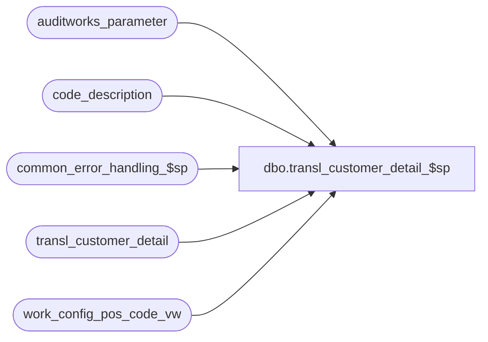

# dbo.transl_customer_detail_$sp

**Database:** auditworks_external  
**Server:** bedrockdb01  

## Architecture Diagram



## Table Dependencies

| Referenced Table |
|---|
| auditworks_parameter |
| code_description |
| common_error_handling_$sp |
| transl_customer_detail |
| work_config_pos_code_vw |

## Stored Procedure Code

```sql
create proc dbo.transl_customer_detail_$sp @process_id		binary(16),
@process_no		smallint,
@lookup_pass		tinyint,
@request_id             binary(16),
@auto_config_required   tinyint OUTPUT,
@errmsg                 nvarchar(255) OUTPUT


AS

/* 
PROC NAME: transl_customer_detail_$sp
     DESC: This proc will try to replace any customer_info_type of -3 with code found in code_description 
           for code_type 8. If code is not found, then it will create a new one. 
           The proc is called from transl_pre_processing and runs on each peripheral database. 
           
**************** NOTE: must be scripted with SET ANSI_NULLS ON ********************************     
     
 HISTORY: 
Date       Name         Defect# Desc
Feb01,13  Vicci          141488 Log identification of the transaction that was the source of the auto-config to the work_config_pos_code_vw.
Feb17,12  Vicci          133087 Remove references to CRDM datatypes from procs installed in multi-stream S/A databases where CRDM is not installed.
Mar01,06  David         DV-1328 Do not configure null pos code.
Mar15,05  David         DV-1202 Author
*/

DECLARE  
  @base_language_id             smallint,  
  @errno                        int,
  @fixed_count                  int,
  @issue_count                  int,
  @max_retry                    int,
  @message_id			int,
  @object_name			nvarchar(255),
  @operation_name		nvarchar(100),
  @process_name			nvarchar(100),
  @rows                         int,
  @try_no                       int,
  @wait_time                    nchar(8)

SELECT @process_name = 'transl_customer_detail_$sp',
       @message_id   = 201068,       
       @fixed_count = 0,
       @issue_count = 0,
       @base_language_id = 1033,
       @try_no = 0,
       @max_retry = 10,
       @wait_time = '00:00:10'
       
      
-- Find out how many rows exist with customer_info_type = -3
SELECT @issue_count = count(row_sequence_no)
  FROM transl_customer_detail
 WHERE customer_info_type = -3
   AND lookup_pos_code IS NOT NULL
   
SELECT @errno = @@error
IF @errno != 0
  BEGIN
    SELECT @errmsg = 'Failed to select the issue_count.',
           @object_name = 'transl_customer_detail',
	   @operation_name = 'SELECT'
    GOTO error
  END
  
IF @issue_count = 0
  RETURN


-- Get the count and also update those rows that already have S/A configuration. 
UPDATE transl_customer_detail
   SET customer_info_type = c.code
  FROM transl_customer_detail t, code_description c
 WHERE t.customer_info_type = -3
   AND t.lookup_pos_code IS NOT NULL
   AND t.lookup_pos_code = c.alpha_code
   AND c.code_type = 8

SELECT @errno = @@error, @fixed_count = @@rowcount
IF @errno != 0
  BEGIN
    SELECT @errmsg = 'Failed to set the customer_info_type.',
           @object_name = 'transl_customer_detail',
	   @operation_name = 'UPDATE'
    GOTO error
  END

/* If the proc has been called for the second time and the replication has been instantaneous, the issue_count will be equal
   to fixed count and the autoconfig is complete. 
   Note: The proc will be called for the second time when a new code is configured and now the corresponding
   transl tables needs to be updated with the new S/A config. The actual configuration which is a insert to our S/A master
   tables happens in TM database which in scaleout environment exist in different server. After successful insertion the rows
   get replicated to peripheral databases. Most of the time the replication is instantaneous, but there is always a chance
   that replication happens with delays so the proc has to waitfor some delays and then try to update the transl tables again.
   As we do not want to wait for ever, maximum of retry will be defined and if we reach the max retry, a warning message
   will be issued to inform the user that the process was not able to auto configure all the rows and we process the next
   batch. */
   
IF @issue_count = @fixed_count AND @lookup_pass = 2
  RETURN


WHILE @issue_count <> @fixed_count AND @lookup_pass = 2 
BEGIN
  
  SELECT @try_no = @try_no + 1
  
  IF @try_no > @max_retry
  BEGIN
    SELECT @errmsg = 'Maximum retry |1 has reached. The edit was not able to auto configure all the data.',
           @errno = 202015,
           @message_id = 202015, 
           @object_name = 'transl_customer_detail',
           @operation_name = 'update'
    
    EXEC common_error_handling_$sp @process_no, @errno, @errmsg, 3, @message_id, @process_name,
                                   @object_name, @operation_name, 1, NULL, NULL, NULL, NULL, @max_retry
    RETURN
  END
    
  WAITFOR DELAY @wait_time
  
  UPDATE transl_customer_detail
     SET customer_info_type = c.code
    FROM transl_customer_detail t, code_description c
   WHERE t.customer_info_type = -3
     AND t.lookup_pos_code IS NOT NULL
     AND t.lookup_pos_code = c.alpha_code
     AND c.code_type = 8

  SELECT @errno = @@error,
         @fixed_count = @fixed_count + @@rowcount
  IF @errno != 0
    BEGIN
      SELECT @errmsg = 'Failed to set the customer_info_type.',
   	     @object_name = 'transl_customer_detail',
	     @operation_name = 'UPDATE'
      GOTO error
    END

END --WHILE @issue_count <> @fixed_count AND @lookup_pass = 2

    
IF @issue_count = @fixed_count 
  RETURN
ELSE 
  SELECT @auto_config_required = 1

SELECT @base_language_id = IsNull(convert(smallint, par_value), 1033)
  FROM auditworks_parameter
 WHERE par_name = 'base_language_id'

SELECT @errno = @@error
IF @errno != 0
  BEGIN
    SELECT @errmsg = 'Failed to select the base_language_id.',
	   @object_name = 'auditworks_parameter',
	   @operation_name = 'SELECT'
    GOTO error
  END
              
-- list of the new codes which need to be auto configured
INSERT work_config_pos_code_vw(
           request_id,
           table_name,
           code_type,
           lookup_pos_code,
           pos_description,
           language_id,
           resource_id,
           new_code_flag,
           desc_update_flag,
           transaction_line_string)
SELECT 
           @request_id,
           'code_description',
           8,
           t.lookup_pos_code,
           t.lookup_pos_code,
           @base_language_id,
           NULL,
           1,
           0,
           MIN(convert(nvarchar, t.entry_date_time, 109) + '|' + convert(nvarchar, t.store_no)  + '|' + convert(nvarchar, t.register_no)  + '|' + t.transaction_series  + '|' +  convert(nvarchar, t.transaction_no) + '|' + convert(nvarchar, t.line_id))
  FROM transl_customer_detail t
 WHERE t.customer_info_type = -3
   AND t.lookup_pos_code IS NOT NULL
 GROUP BY t.lookup_pos_code

     SELECT @errno = @@error
     IF @errno != 0
       BEGIN
         SELECT @errmsg = 'Failed to insert new codes which need to be auto configured',
	        @object_name = 'work_config_pos_code_vw',
	        @operation_name = 'INSERT'
         GOTO error
       END


RETURN

error:
        
	  
	EXEC common_error_handling_$sp @process_no, @errno, @errmsg, 0, @message_id, 
	@process_name, @object_name, @operation_name, 1, 1, 0,
	null, 0, null, null, null, null, null, null, 0, @process_id, NULL
	
        RETURN
```

