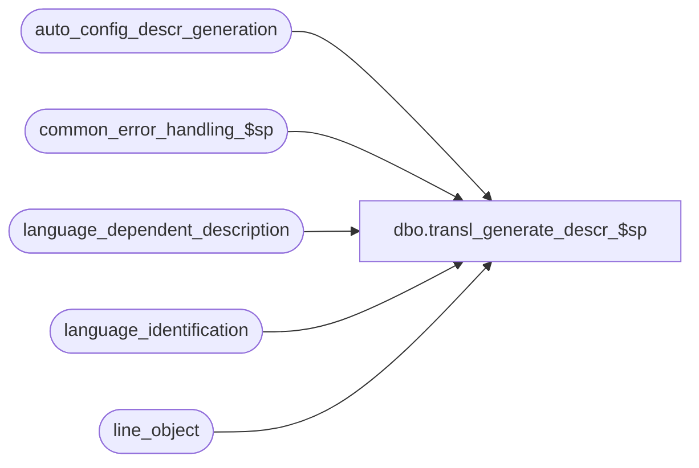

# dbo.transl_generate_descr_$sp

**Database:** auditworks_external  
**Server:** bedrockdb01  

## Architecture Diagram



## Table Dependencies

| Referenced Table |
|---|
| auto_config_descr_generation |
| common_error_handling_$sp |
| language_dependent_description |
| language_identification |
| line_object |

## Stored Procedure Code

```sql
create proc dbo.transl_generate_descr_$sp @process_no                 int,
@process_id                 binary(16),
@table_name                 nvarchar(30),
@lookup_pos_code            nvarchar(500),
@description_key            nvarchar(20),
@pos_description_token_list nvarchar(500),
@language_id                smallint,
@base_language_id           smallint,
@disregard_pos_descr_change tinyint, 
@desc                       nvarchar(255) OUTPUT,
@errmsg                     nvarchar(255) OUTPUT

AS

/* 
PROC NAME: transl_generate_descr_$sp
     NOTE: Must be scripted with SET ANSI_NULLS ON 
     DESC: This proc is called from transl_auto_configure_$sp and runs only on TM server/database.
           Given the name of the table which will hold the description to be generated (e.g. 'line_object', 'code_description'),
           the POS Code and the POS Description List associated with the new element to be created and the Language ID 
           of the store whose transactions contained the new POS Code in question, with a description key set to positions 
           1 to 3 of the POS Code, the proc will find the description mask from auto_config_descr_generation table and 
           will Substitute the tokens found in this description mask with the corresponding values provided in the 
           POS Description Token list given. Tokens are in the format {#D...D} where # is the token number and D...D is
           the description of the type of information that is provided by the Translate in the token; 
           the resulting description which is changed to have its first character in upper case and the remainder in lower case,
           will be outputed.
             

HISTORY: 
Date      Name          Def# Desc
Apr22,13  Vicci       143421 Handle the fact that in compatibility mode 80 the IF NULL <> 0 condition tests true instead of unknown.
Sep24,12  Vicci       129153 Add alternate descriptions for Order Management functions.   
Feb17,12  Vicci       133087 Remove references to CRDM datatypes from procs installed in multi-stream S/A databases where CRDM is not installed.
Jul12,11  Vicci       128421 Since POS never did the enhancement to log Name to their CASHOFF.TENDER element (the way they do POS.TRADE.TENDER),
                             if a float line-object with a description set by the translate to a dummy "Idx= " value comes in then see if we have 
                             a tender with the same IDx whose description we could "borrow".
Jun20,11  Vicci       127716 Activate language required to hold POS descriptions.
May03,11  Vicci       126716 Recognize the fact that for most code-description code-types no mask applies.  Clarify missing language error message.
Apr28,10  Vicci       117462 Received @disregard_pos_descr_change and handle new setting of 2 indicating that alternate description mask is to be used.
Oct08,08  Vicci       105533 Return error if language not supported by the configuration has been assigned to a store.
Jun07,05  David      DV-1263 Set word 'plu' to upper case.
Feb28,05  Maryam     DV-1202 Author
*/

DECLARE
  @alt_description_key          nvarchar(20),
  @description_mask             nvarchar(500),
  @base_lang_descr_mask         nvarchar(500),
  @errno                        int,
  @message_id			int,
  @num_of_token                 int,
  @object_name			nvarchar(255),
  @operation_name		nvarchar(100),
  @process_name			nvarchar(100),
  @start_of_des_token           smallint, 
  @end_of_des_token             smallint,
  @start_of_mask_token          smallint,
  @end_of_mask_token            smallint,
  @desc_token                   nvarchar(250),
  @mask_token                   nvarchar(250),
  @token                        nvarchar(250),
  @token_number 		smallint,
  @rows				int,
  @lang_active_flag		tinyint,
  @pos_descr_tender_token_list  nvarchar(500)
  
SELECT @process_name = 'transl_generate_descr_$sp',
  @message_id   = 201068,
       @token_number = 0,
       @num_of_token = 3,
       @errno= 0

IF @disregard_pos_descr_change = 2  --use alternate description
BEGIN
  SELECT @alt_description_key = @description_key + '.ALT'
END --IF @disregard_pos_descr_change = 2

IF @base_language_id IS NULL
BEGIN
  SELECT @errmsg = ':LOG The base language for the S/A database has not yet been defined.  This must be configured in S/A Parameters before proceeding.',
         @object_name = 'auditworks_parameter',
         @operation_name = 'SELECT'
  GOTO error 
END

SELECT @lang_active_flag = active_flag 
  FROM language_identification
 WHERE language_id = @language_id
  SELECT @errno = @@error
IF @errno != 0
BEGIN
  SELECT @errmsg = 'Failed to determine if language is active',
         @object_name = 'language_identification',
         @operation_name = 'SELECT'
  GOTO error
END

IF @lang_active_flag = 0
BEGIN
  UPDATE language_identification
     SET active_flag = 1
   WHERE language_id = @language_id
     AND active_flag = 0
  SELECT @errno = @@error
  IF @errno != 0
  BEGIN
    SELECT @errmsg = 'Failed to active language ' + COALESCE(CONVERT(nvarchar, @language_id), ''),
           @object_name = 'language_identification',
           @operation_name = 'UPDATE'
    GOTO error
  END
END
ELSE
BEGIN
  IF @lang_active_flag IS NULL
    BEGIN
      SELECT @errmsg = 'Language ' + CONVERT(nvarchar, @language_id) + ' does not exist in S/A.  Please correct store master.',
             @errno = 201510, 
             @message_id = 201510
       GOTO error
    END
END

IF @description_key = '014' AND @lookup_pos_code  like '%ORDER_COMMENTS%'
  SELECT @description_key = '014.ORDER_COMMENTS'

IF @description_key = '014' AND @lookup_pos_code  like '%ORDER_FOLLOW_UP%'
  SELECT @description_key = '014.ORDER_EXTENDDATE'

IF @description_key = '014' AND @lookup_pos_code  like '%ORDER_COMMENTS%'
  SELECT @description_key = '014.ORDER_FOLLOW_UP'
    
IF @description_key = '016' AND @lookup_pos_code  like '%PRICEMOD%'
  SELECT @description_key = '016.PRICEMOD'

IF @description_key = '002' AND @lookup_pos_code  like '%WOFF%'
  SELECT @description_key = '002.WOFF'

IF @description_key = '007' AND @lookup_pos_code  like '%FreightCostCode%'
  SELECT @description_key = '007.Freight'

--128421:  If no description provided in TOb for float and translate has just copied in the IDx  
IF @description_key = '021' AND @pos_description_token_list like '{0Idx=%'
BEGIN
  SELECT @pos_descr_tender_token_list =  pos_description_token_list
    FROM line_object
   WHERE lookup_pos_code like '%'+SUBSTRING(@pos_description_token_list, 3, CHARINDEX('}', @pos_description_token_list)-3) + '.%'
     AND line_object_type = 6
     AND pos_description_token_list like '{0%'
  IF @pos_descr_tender_token_list IS NOT NULL
    SELECT @pos_description_token_list = @pos_descr_tender_token_list    
END  --IF @description_key = '021' AND @pos_description_token_list like '{0Idx=%'

IF @description_key = '021' AND @lookup_pos_code  like '%FLOAT%'
  SELECT @description_key = '021.FLOAT'

IF @description_key = '021' AND @lookup_pos_code  like '%RECEIPT%'
  SELECT @description_key = '021.Bank'
  
IF @language_id = @base_language_id
BEGIN
  IF @alt_description_key IS NOT NULL
  BEGIN
    SELECT @description_mask = description_mask
      FROM auto_config_descr_generation
     WHERE table_name = @table_name
       AND description_key = @alt_description_key
    SELECT @errno = @@error
    IF @errno != 0
    BEGIN
      SELECT @errmsg = 'Failed to select the alternate description mask.',
             @object_name = 'auto_config_descr_generation',
             @operation_name = 'SELECT'
      GOTO error
    END
  END  --IF @alt_description_key IS NOT NULL
  
  IF @description_mask IS NULL
  BEGIN
    SELECT @description_mask = description_mask
      FROM auto_config_descr_generation
     WHERE table_name = @table_name
       AND description_key = @description_key
    SELECT @errno = @@error
    IF @errno != 0
    BEGIN
      SELECT @errmsg = 'Failed to select the description mask.',
             @object_name = 'auto_config_descr_generation',
             @operation_name = 'SELECT'
      GOTO error
    END     
  END  --IF @description_mask IS NULL
END
ELSE --ELSE of IF @language_id = @base_language_id
BEGIN
  SELECT @base_lang_descr_mask = NULL 
  
  IF @alt_description_key IS NOT NULL
  BEGIN
    SELECT @description_mask = l.display_description
      FROM auto_config_descr_generation a, language_dependent_description l
     WHERE a.table_name = @table_name
       AND a.description_key = @alt_description_key
       AND a.resource_id = l.resource_id
       AND @language_id = l.language_id
    SELECT @errno = @@error
    IF @errno != 0
    BEGIN
      SELECT @errmsg = 'Failed to select the description mask.',
             @object_name = 'language_dependent_description',
             @operation_name = 'SELECT'
      GOTO error
    END
  END --IF @alt_description_key IS NOT NULL    

  IF @description_mask IS NULL
  BEGIN
    SELECT @description_mask = l.display_description, @base_lang_descr_mask = a.description_mask 
      FROM auto_config_descr_generation a
           LEFT OUTER JOIN language_dependent_description l
             ON a.resource_id = l.resource_id
       	    AND @language_id = l.language_id
     WHERE a.table_name = @table_name
       AND a.description_key = @description_key
    SELECT @errno = @@error
    IF @errno != 0
    BEGIN
      SELECT @errmsg = 'Failed to select the description mask.',
             @object_name = 'language_dependent_description',
             @operation_name = 'SELECT'
      GOTO error
    END
  END --IF @alt_description_key IS NOT NULL    
  
  IF @description_mask IS NULL AND @base_lang_descr_mask IS NOT NULL
  BEGIN
    SELECT @errno = 201510, 
           @message_id = 201510,
           @errmsg = 'No description mask was found for language ' + convert(nvarchar, @language_id) + ' for ' + COALESCE(@table_name, 'NULL') + ' ' + COALESCE(@description_key, 'NULL') + '.  Please enter translations for all resource strings related to the auto_config_descr_generation.  The mask for U.S. English (10333) will be used to proceed.',
           @object_name = 'language_dependent_description',
           @operation_name = 'SELECT'
    EXEC common_error_handling_$sp @process_no, @errno, @errmsg, 3, @message_id, 
	 @process_name, @object_name, @operation_name, 1, 1, 0,
	 null, 0, null, null, null, null, null, null, 0, @process_id, NULL
  END  --IF @description_mask IS NULL AND @base_lang_descr_mask IS NOT NULL
  
END  --ELSE of IF @language_id = @base_language_id

IF @description_mask IS NOT NULL
BEGIN
  WHILE @token_number < @num_of_token
  BEGIN
    SELECT @start_of_mask_token = COALESCE(charindex('{' + convert(nvarchar,@token_number), @description_mask), 0)
    IF @start_of_mask_token <> 0
    BEGIN
      SELECT @end_of_mask_token = charindex('}', @description_mask, @start_of_mask_token + 1)
      SELECT @mask_token = substring (@description_mask, @start_of_mask_token , @end_of_mask_token - @start_of_mask_token + 1)
      SELECT @start_of_des_token = COALESCE(charindex('{'+convert(nvarchar,@token_number), @pos_description_token_list), 0)
      IF @start_of_des_token <> 0
      BEGIN
        SELECT @end_of_des_token = charindex('}', @pos_description_token_list, @start_of_des_token + 1)
        SELECT @desc_token = substring (@pos_description_token_list, @start_of_des_token + 2, @end_of_des_token - @start_of_des_token - 2) + ' '
        SELECT @desc_token = COALESCE(@desc_token, '')
      END
      ELSE
        SELECT @desc_token = ''      
      
      SELECT @description_mask = REPLACE(@description_mask, @mask_token, @desc_token ) 
    END --IF @start_of_mask_token <> 0
    
    SELECT @token_number = @token_number + 1

  END -- WHILE @token_number < @num_of_token
END  --IF @description_mask IS NOT NULL

SELECT @description_mask = RTRIM(LTRIM(@description_mask))

IF @description_mask IS NULL OR @description_mask = ''
BEGIN
  SELECT @description_mask = RTRIM(LTRIM(@pos_description_token_list))
END  

IF @description_mask IS NULL OR @description_mask = ''
BEGIN
  SELECT @desc = COALESCE(@lookup_pos_code, '')
END  
ELSE
BEGIN  
  SELECT @desc = upper(substring (@description_mask,1,1)) + lower(substring (@description_mask,2,len(@description_mask)))
END

SELECT @desc = REPLACE (@desc, 'plu','PLU')	
SELECT @desc = REPLACE (@desc, 'Plu','PLU')	

--SELECT 'Test, @desc=', @desc
RETURN 

error:
	  
	EXEC common_error_handling_$sp @process_no, @errno, @errmsg, 0, @message_id, 
	@process_name, @object_name, @operation_name, 1, 1, 0,
	null, 0, null, null, null, null, null, null, 0, @process_id, NULL
	
        RETURN
```

