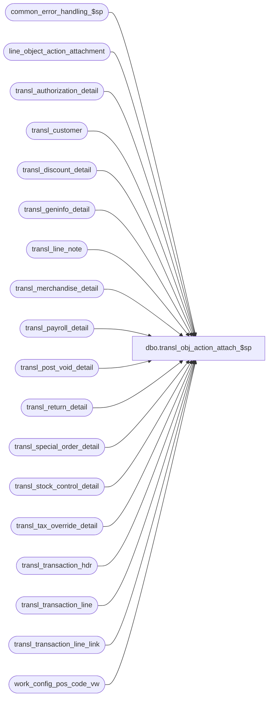

# dbo.transl_obj_action_attach_$sp

**Database:** auditworks_external  
**Server:** bedrockdb01  

## Architecture Diagram



## Table Dependencies

| Referenced Table |
|---|
| common_error_handling_$sp |
| line_object_action_attachment |
| transl_authorization_detail |
| transl_customer |
| transl_discount_detail |
| transl_geninfo_detail |
| transl_line_note |
| transl_merchandise_detail |
| transl_payroll_detail |
| transl_post_void_detail |
| transl_return_detail |
| transl_special_order_detail |
| transl_stock_control_detail |
| transl_tax_override_detail |
| transl_transaction_hdr |
| transl_transaction_line |
| transl_transaction_line_link |
| work_config_pos_code_vw |

## Stored Procedure Code

```sql
create proc dbo.transl_obj_action_attach_$sp 

@process_id		binary(16),
@process_no		smallint,
@lookup_pass		tinyint,
@request_id             binary(16),
@auto_config_required   tinyint OUTPUT,
@errmsg                 nvarchar(255) OUTPUT


AS

/* 
PROC NAME: transl_obj_action_attach_$sp
     DESC: This proc is called from transl_pre_processing and runs on each peripheral database. 
           
**************** NOTE: must be scripted with SET ANSI_NULLS ON ********************************     

 HISTORY: 
Date      Name          Def# Desc
Aug28,13  Vicci       146147 Set card_type for authorization_detail attachment
Feb01,13  Vicci       141488 Log identification of the transaction that was the source of the auto-config to the work_config_pos_code_vw.
Feb17,12  Vicci       133087 Remove references to CRDM datatypes from procs installed in multi-stream S/A databases where CRDM is not installed.
May16,11  Vicci       127116 Handle corrupt transl_transaction_line entries (i.e. orphaned entries with no header).
Jul07,10  Vicci       119250 If the display definition to be configured is 0=Unknown, then configure it a 1=Table Dump
			     since leaving it as 0 causes the line-object-action-attachment insert trigger to think
			     that the attachment config is being created by pre-R3 table-maintenance and causes it to
			     try guessing at the display definition ID to use sometimes resulting in 
			     Dup key on insert error 2601 in line_object_action_attach_$trI.
Jun27,05  David      DV-1285 Log form_name to new column in work table instead of lookup_pos_code.
May03,05  David      DV-1202 Do not insert entries for stock control detail with NULL display def ids.
                             Added Distinct to selects.
Mar22,05  Maryam     DV-1202 Author
*/

DECLARE  
  @base_language_id             smallint,  
  @desc_update_count            int,
  @errno                        int,
  @fixed_count                  int,
  @issue_count                  int,
  @max_retry                    int,
  @message_id			int,
  @object_name			nvarchar(255),
  @operation_name		nvarchar(100),
  @process_name			nvarchar(100),
  @rows                         int,
  @try_no                       int,
  @wait_time                    nchar(8),
  @trace_msg			nvarchar(255)

SELECT 
       @process_name = 'transl_obj_action_attach_$sp',
       @message_id   = 201068,       
       @rows = 0,
       @try_no = 0,
       @max_retry = 10,
       @wait_time = '00:00:10'
       
  IF @lookup_pass = 2
  BEGIN
    WHILE @try_no < @max_retry
    BEGIN
      DELETE work_config_pos_code_vw
        FROM work_config_pos_code_vw w, line_object_action_attachment l
       WHERE request_id = @request_id
         AND table_name = 'line_object_action_attachment'
         AND w.line_object = l.line_object
         AND w.line_action = l.line_action
         AND (w.transaction_category = l.transaction_category OR l.transaction_category IS NULL 
              OR w.transaction_category IS NULL)  --note:  w.transaction_category would only be null in the case of orphaned transl_transction_line entries with no corresponding transl_transaction_hdr.
         AND w.attachment_type = l.attachment_type
         AND w.note_type = l.note_type
    
      SELECT @errno = @@error
      IF @errno != 0
        BEGIN
          SELECT @errmsg = 'Failed to remove the rows from work_config_pos_code_vw for the line_object_action_attachment.',
                 @object_name = 'work_config_pos_code_vw',
	         @operation_name = 'DELETE'
          GOTO error
        END
      
      IF NOT EXISTS (SELECT 1
                       FROM work_config_pos_code_vw
                      WHERE request_id = @request_id
                        AND table_name = 'line_object_action_attachment')
        RETURN
      ELSE
        WAITFOR DELAY @wait_time
      
      SELECT @try_no = @try_no + 1   
    END -- WHILE @try_no < @max_retry
    
    SELECT @errmsg = 'Maximum retry |1 has reached. The edit was not able to auto configure all the data.',
           @errno = 202015,
           @message_id = 202015,
           @object_name = 'work_config_pos_code_vw',
           @operation_name = 'DELETE'
    
    EXEC common_error_handling_$sp @process_no, @errno, @errmsg, 3, @message_id, @process_name,
                         @object_name, @operation_name, 1, NULL, NULL, NULL, NULL,
                                   @max_retry
    DELETE work_config_pos_code_vw
     WHERE request_id = @request_id
       AND table_name = 'line_object_action_attachment'
    
    SELECT @errno = @@error
      IF @errno != 0
        BEGIN
          SELECT @errmsg = 'Failed to clean up work_config_pos_code_vw.',
                 @object_name = 'work_config_pos_code_vw',
	         @operation_name = 'DELETE'
          GOTO error
        END   
    RETURN
        
  END --IF @lookup_pass = 2
  
  -- Set transaction category to avoid join to transl_transaction_hdr
  UPDATE transl_transaction_line
     SET transaction_category = h.transaction_category
    FROM transl_transaction_line l, transl_transaction_hdr h
   WHERE h.store_no = l.store_no
     AND h.register_no = l.register_no
     AND h.entry_date_time = l.entry_date_time
     AND h.transaction_series = l.transaction_series
     AND h.transaction_no = l.transaction_no

  SELECT @errno = @@error
  IF @errno != 0
    BEGIN
      SELECT @errmsg = 'Failed to set transaction_category.',
             @object_name = 'transl_transaction_line',
	     @operation_name = 'UPDATE'
      GOTO error
    END     

     
  INSERT work_config_pos_code_vw(
         request_id,
         table_name,
         line_object,
         lookup_pos_code,
         line_action, 
         transaction_category,
         attachment_type,
         transaction_line_string)
  SELECT @request_id,
         'line_object_action_attachment',
         l.line_object,
         l.lookup_pos_code,
         l.line_action,
         l.transaction_category,
         1, --Merchandise_detail
         MIN(convert(nvarchar, l.entry_date_time, 109) + '|' + convert(nvarchar, l.store_no)  + '|' + convert(nvarchar, l.register_no)  + '|' + l.transaction_series  + '|' +  convert(nvarchar, l.transaction_no) + '|' + convert(nvarchar, l.line_id))
    FROM transl_transaction_line l,
         transl_merchandise_detail m
   WHERE l.store_no = m.store_no
     AND l.register_no = m.register_no
     AND l.entry_date_time = m.entry_date_time
     AND l.transaction_series = m.transaction_series
     AND l.transaction_no = m.transaction_no
     AND l.line_id = m.line_id
     AND NOT EXISTS (SELECT 1
                      FROM line_object_action_attachment loa
                     WHERE l.line_object = loa.line_object
                       AND l.line_action = loa.line_action
                       AND (l.transaction_category = loa.transaction_category OR loa.transaction_category IS NULL)
                       AND loa.attachment_type = 1)
   GROUP BY l.line_object,
         l.lookup_pos_code,
         l.line_action,
         l.transaction_category
  
  SELECT @errno = @@error,
         @rows = @rows + @@rowcount
  IF @errno != 0
    BEGIN
      SELECT @errmsg = 'Failed to insert the rows for merchandise attachment.',
             @object_name = 'work_config_pos_code_vw',
	     @operation_name = 'INSERT'
      GOTO error
    END     


  INSERT work_config_pos_code_vw(
         request_id,
         table_name,
         line_object,
         lookup_pos_code,
         line_action, 
         transaction_category,
         attachment_type,
         transaction_line_string,
         card_type)
  SELECT @request_id,
         'line_object_action_attachment',
         l.line_object,
         l.lookup_pos_code,
         l.line_action,
         l.transaction_category,
         2, --Authorization Detail 
         MIN(convert(nvarchar, l.entry_date_time, 109) + '|' + convert(nvarchar, l.store_no) + '|' + convert(nvarchar, l.register_no)  + '|' + l.transaction_series  + '|' +  convert(nvarchar, l.transaction_no) + '|' + convert(nvarchar, l.line_id)),
         MAX(CASE WHEN a.card_type = '?' THEN NULL ELSE a.card_type END)
    FROM transl_transaction_hdr h,
         transl_transaction_line l,
         transl_authorization_detail a
   WHERE h.store_no = l.store_no
     AND h.register_no = l.register_no
     AND h.entry_date_time = l.entry_date_time
     AND h.transaction_series = l.transaction_series
     AND h.transaction_no = l.transaction_no
     AND l.store_no = a.store_no
     AND l.register_no = a.register_no
     AND l.entry_date_time = a.entry_date_time
     AND l.transaction_series = a.transaction_series
     AND l.transaction_no = a.transaction_no
     AND l.line_id = a.line_id
     AND NOT EXISTS (SELECT 1
                       FROM line_object_action_attachment loa
                      WHERE l.line_object = loa.line_object
                        AND l.line_action = loa.line_action
               AND (l.transaction_category = loa.transaction_category OR loa.transaction_category IS NULL)
                        AND loa.attachment_type = 2)
   GROUP BY l.line_object,
         l.lookup_pos_code,
         l.line_action,
         l.transaction_category            
  SELECT @errno = @@error,
         @rows = @rows + @@rowcount
  IF @errno != 0
    BEGIN
      SELECT @errmsg = 'Failed to insert the rows for authorization detail attachment.',
             @object_name = 'work_config_pos_code_vw',
	     @operation_name = 'INSERT'
      GOTO error
    END     

  INSERT work_config_pos_code_vw(
         request_id,
         table_name,
         line_object,
         lookup_pos_code,
         line_action, 
         transaction_category,
         attachment_type,
         note_type,
         transaction_line_string)
  SELECT @request_id,
         'line_object_action_attachment',
         l.line_object,
         l.lookup_pos_code,
         l.line_action,
         l.transaction_category,
         3, --stock control detail 
         CASE WHEN s.display_def_id = 0 THEN 1 ELSE s.display_def_id END,  --log with a display def of "table dump" if not known.
         MIN(convert(nvarchar, l.entry_date_time, 109) + '|' + convert(nvarchar, l.store_no)  + '|' + convert(nvarchar, l.register_no)  + '|' + l.transaction_series  + '|' +  convert(nvarchar, l.transaction_no) + '|' + convert(nvarchar, l.line_id))
    FROM transl_transaction_line l,
         transl_stock_control_detail s
   WHERE l.store_no = s.store_no
     AND l.register_no = s.register_no
     AND l.entry_date_time = s.entry_date_time
     AND l.transaction_series = s.transaction_series
     AND l.transaction_no = s.transaction_no
     AND l.line_id = s.line_id
     AND s.display_def_id IS NOT NULL --
     AND NOT EXISTS (SELECT 1
                       FROM line_object_action_attachment loa
                      WHERE l.line_object = loa.line_object
                        AND l.line_action = loa.line_action
                        AND (l.transaction_category = loa.transaction_category OR loa.transaction_category IS NULL)
                        AND loa.attachment_type = 3
                        AND CASE WHEN s.display_def_id = 0 THEN 1 ELSE s.display_def_id END = loa.note_type)
    GROUP BY l.line_object,
         l.lookup_pos_code,
         l.line_action,
         l.transaction_category,
         CASE WHEN s.display_def_id = 0 THEN 1 ELSE s.display_def_id END
  
  SELECT @errno = @@error,
         @rows = @rows + @@rowcount
  IF @errno != 0
    BEGIN
      SELECT @errmsg = 'Failed to insert the rows for stock control detail attachment.',
             @object_name = 'work_config_pos_code_vw',
	     @operation_name = 'INSERT'
      GOTO error
    END


  INSERT work_config_pos_code_vw(
         request_id,
         table_name,
         line_object,
         lookup_pos_code,
         form_name,
         pos_description, -- field_name
         line_action, 
         transaction_category,
         attachment_type,
         note_type,
         transaction_line_string)
  SELECT @request_id,
         'line_object_action_attachment',
         l.line_object,
         l.lookup_pos_code,
         g.form_name,
         g.field_name, -- pos_description
         l.line_action,
         l.transaction_category,
         3, --stock control detail 
         ISNULL(display_def_id,-3),
         MIN(convert(nvarchar, l.entry_date_time, 109) + '|' + convert(nvarchar, l.store_no)  + '|' + convert(nvarchar, l.register_no)  + '|' + l.transaction_series  + '|' +  convert(nvarchar, l.transaction_no) + '|' + convert(nvarchar, l.line_id))
    FROM transl_transaction_line l,
         transl_geninfo_detail g
   WHERE l.store_no = g.store_no
     AND l.register_no = g.register_no
     AND l.entry_date_time = g.entry_date_time
     AND l.transaction_series = g.transaction_series
     AND l.transaction_no = g.transaction_no
     AND l.line_id = g.line_id
     AND NOT EXISTS (SELECT 1
                       FROM line_object_action_attachment loa
                      WHERE l.line_object = loa.line_object
                        AND l.line_action = loa.line_action
                        AND (l.transaction_category = loa.transaction_category OR loa.transaction_category IS NULL)
                        AND loa.attachment_type = 3
                        AND ISNULL(display_def_id,-3)= loa.note_type)
   GROUP BY l.line_object,
         l.lookup_pos_code,
         g.form_name,
         g.field_name, 
         l.line_action,
         l.transaction_category, 
         ISNULL(display_def_id,-3)
  SELECT @errno = @@error,
         @rows = @rows + @@rowcount
  IF @errno != 0
    BEGIN
      SELECT @errmsg = 'Failed to insert the rows for stock control detail attachment(geninfo).',
             @object_name = 'work_config_pos_code_vw',
	     @operation_name = 'INSERT'
      GOTO error
    END

  INSERT work_config_pos_code_vw(
         request_id,
         table_name,
         line_object,
         lookup_pos_code,
         line_action, 
         transaction_category,
         attachment_type,
         transaction_line_string)
  SELECT @request_id,
         'line_object_action_attachment',
         l.line_object,
         l.lookup_pos_code,
         l.line_action,
         l.transaction_category,
         4, --special order detail 
         MIN(convert(nvarchar, l.entry_date_time, 109) + '|' + convert(nvarchar, l.store_no)  + '|' + convert(nvarchar, l.register_no)  + '|' + l.transaction_series  + '|' +  convert(nvarchar, l.transaction_no) + '|' + convert(nvarchar, l.line_id))
    FROM transl_transaction_line l,
         transl_special_order_detail o
   WHERE l.store_no = o.store_no
     AND l.register_no = o.register_no
     AND l.entry_date_time = o.entry_date_time
     AND l.transaction_series = o.transaction_series
     AND l.transaction_no = o.transaction_no
     AND l.line_id = o.line_id
     AND NOT EXISTS (SELECT 1
                       FROM line_object_action_attachment loa
                      WHERE l.line_object = loa.line_object
                        AND l.line_action = loa.line_action
                        AND (l.transaction_category = loa.transaction_category OR loa.transaction_category IS NULL)
                        AND loa.attachment_type = 4)
    GROUP BY l.line_object,
         l.lookup_pos_code,
         l.line_action,
         l.transaction_category
  SELECT @errno = @@error,
         @rows = @rows + @@rowcount
  IF @errno != 0
    BEGIN
      SELECT @errmsg = 'Failed to insert the rows for special order detail attachment.',
             @object_name = 'work_config_pos_code_vw',
	     @operation_name = 'INSERT'
      GOTO error
    END

  INSERT work_config_pos_code_vw(
         request_id,
         table_name,
         line_object,
         lookup_pos_code,
         line_action, 
         transaction_category,
         attachment_type,
         transaction_line_string)
  SELECT @request_id,
         'line_object_action_attachment',
         l.line_object,
         l.lookup_pos_code,
         l.line_action,
         l.transaction_category,
         5, --post void detail 
         MIN(convert(nvarchar, l.entry_date_time, 109) + '|' + convert(nvarchar, l.store_no)  + '|' + convert(nvarchar, l.register_no)  + '|' + l.transaction_series  + '|' +  convert(nvarchar, l.transaction_no) + '|' + convert(nvarchar, l.line_id))
    FROM transl_transaction_line l,
         transl_post_void_detail p
   WHERE l.store_no = p.store_no
     AND l.register_no = p.register_no
     AND l.entry_date_time = p.entry_date_time
     AND l.transaction_series = p.transaction_series
     AND l.transaction_no = p.transaction_no
     AND l.line_id = p.line_id
     AND NOT EXISTS (SELECT 1
                       FROM line_object_action_attachment loa
                      WHERE l.line_object = loa.line_object
                        AND l.line_action = loa.line_action
                        AND (l.transaction_category = loa.transaction_category OR loa.transaction_category IS NULL)
                        AND loa.attachment_type = 5)
   GROUP BY l.line_object,
         l.lookup_pos_code,
         l.line_action,
         l.transaction_category
  SELECT @errno = @@error,
         @rows = @rows + @@rowcount
  IF @errno != 0
    BEGIN
      SELECT @errmsg = 'Failed to insert the rows for post void detail attachment.',
             @object_name = 'work_config_pos_code_vw',
	     @operation_name = 'INSERT'
      GOTO error
    END

  INSERT work_config_pos_code_vw(
         request_id,
         table_name,
         line_object,
         lookup_pos_code,
         line_action, 
         transaction_category,
         attachment_type,
         transaction_line_string)
  SELECT @request_id,
         'line_object_action_attachment',
         l.line_object,
         l.lookup_pos_code,
         l.line_action,
         l.transaction_category,
         6, --payroll detail 
         MIN(convert(nvarchar, l.entry_date_time, 109) + '|' + convert(nvarchar, l.store_no)  + '|' + convert(nvarchar, l.register_no)  + '|' + l.transaction_series  + '|' +  convert(nvarchar, l.transaction_no) + '|' + convert(nvarchar, l.line_id))
    FROM transl_transaction_line l,
         transl_payroll_detail p
   WHERE l.store_no = p.store_no
     AND l.register_no = p.register_no
     AND l.entry_date_time = p.entry_date_time
     AND l.transaction_series = p.transaction_series
     AND l.transaction_no = p.transaction_no
     AND l.line_id = p.line_id
     AND NOT EXISTS (SELECT 1
                       FROM line_object_action_attachment loa
                      WHERE l.line_object = loa.line_object
                        AND l.line_action = loa.line_action
                        AND (l.transaction_category = loa.transaction_category OR loa.transaction_category IS NULL)
                        AND loa.attachment_type = 6)
    GROUP BY l.line_object,
         l.lookup_pos_code,
         l.line_action,
         l.transaction_category
  SELECT @errno = @@error,
         @rows = @rows + @@rowcount
  IF @errno != 0
    BEGIN
      SELECT @errmsg = 'Failed to insert the rows for payroll detail attachment.',
             @object_name = 'work_config_pos_code_vw',
	     @operation_name = 'INSERT'
      GOTO error
    END

  INSERT work_config_pos_code_vw(
         request_id,
         table_name,
         line_object,
         lookup_pos_code,
         line_action, 
         transaction_category,
         attachment_type,
         transaction_line_string)
  SELECT @request_id,
         'line_object_action_attachment',
l.line_object,
         l.lookup_pos_code,
         l.line_action,
         l.transaction_category,
         7, --discount detail 
         MIN(convert(nvarchar, l.entry_date_time, 109) + '|' + convert(nvarchar, l.store_no)  + '|' + convert(nvarchar, l.register_no)  + '|' + l.transaction_series  + '|' +  convert(nvarchar, l.transaction_no) + '|' + convert(nvarchar, l.line_id))
    FROM transl_transaction_line l,
         transl_discount_detail d
   WHERE l.store_no = d.store_no
     AND l.register_no = d.register_no
     AND l.entry_date_time = d.entry_date_time
     AND l.transaction_series = d.transaction_series
     AND l.transaction_no = d.transaction_no
     AND l.line_id = d.line_id     
     AND NOT EXISTS (SELECT 1
                       FROM line_object_action_attachment loa
                      WHERE l.line_object = loa.line_object
                        AND l.line_action = loa.line_action
                        AND (l.transaction_category = loa.transaction_category OR loa.transaction_category IS NULL)
                        AND loa.attachment_type = 7)
    GROUP BY l.line_object,
         l.lookup_pos_code,
         l.line_action,
         l.transaction_category
  SELECT @errno = @@error,
         @rows = @rows + @@rowcount
  IF @errno != 0
    BEGIN
      SELECT @errmsg = 'Failed to insert the rows for discount detail attachment.',
             @object_name = 'work_config_pos_code_vw',
	     @operation_name = 'INSERT'
      GOTO error
    END


  INSERT work_config_pos_code_vw(
         request_id,
         table_name,
         line_object,
         lookup_pos_code,
         line_action, 
         transaction_category,
         attachment_type,
         transaction_line_string)
  SELECT @request_id,
         'line_object_action_attachment',
         l.line_object,
         l.lookup_pos_code,
         l.line_action,
         l.transaction_category,
         8, --Tax override detail 
         MIN(convert(nvarchar, l.entry_date_time, 109) + '|' + convert(nvarchar, l.store_no)  + '|' + convert(nvarchar, l.register_no)  + '|' + l.transaction_series  + '|' +  convert(nvarchar, l.transaction_no) + '|' + convert(nvarchar, l.line_id))
    FROM transl_transaction_line l,
         transl_tax_override_detail t
   WHERE l.store_no = t.store_no
     AND l.register_no = t.register_no
     AND l.entry_date_time = t.entry_date_time
     AND l.transaction_series = t.transaction_series
     AND l.transaction_no = t.transaction_no
     AND l.line_id = t.line_id
     AND NOT EXISTS (SELECT 1
                       FROM line_object_action_attachment loa
                      WHERE l.line_object = loa.line_object
                        AND l.line_action = loa.line_action
                        AND (l.transaction_category = loa.transaction_category OR loa.transaction_category IS NULL)
                        AND loa.attachment_type = 8)
    GROUP BY l.line_object,
         l.lookup_pos_code,
         l.line_action,
         l.transaction_category
  SELECT @errno = @@error,
         @rows = @rows + @@rowcount
  IF @errno != 0
    BEGIN
      SELECT @errmsg = 'Failed to insert the rows for Tax override detail attachment.',
             @object_name = 'work_config_pos_code_vw',
	     @operation_name = 'INSERT'
      GOTO error
    END

  INSERT work_config_pos_code_vw(
         request_id,
         table_name,
         line_object,
         lookup_pos_code,
         line_action, 
         transaction_category,
         attachment_type,
         transaction_line_string)
  SELECT @request_id,
         'line_object_action_attachment',
         l.line_object,
         l.lookup_pos_code,
         l.line_action,
         l.transaction_category,
         9, --return detail 
         MIN(convert(nvarchar, l.entry_date_time, 109) + '|' + convert(nvarchar, l.store_no)  + '|' + convert(nvarchar, l.register_no)  + '|' + l.transaction_series  + '|' + convert(nvarchar, l.transaction_no) + '|' + convert(nvarchar, l.line_id))
    FROM transl_transaction_line l,
         transl_return_detail r
   WHERE l.store_no = r.store_no
     AND l.register_no = r.register_no
     AND l.entry_date_time = r.entry_date_time
     AND l.transaction_series = r.transaction_series
     AND l.transaction_no = r.transaction_no
     AND l.line_id = r.line_id
     AND NOT EXISTS (SELECT 1
                     FROM line_object_action_attachment loa
                      WHERE l.line_object = loa.line_object
                        AND l.line_action = loa.line_action
                        AND (l.transaction_category = loa.transaction_category OR loa.transaction_category IS NULL)
                        AND loa.attachment_type = 9)
    GROUP BY l.line_object,
         l.lookup_pos_code,
         l.line_action,
         l.transaction_category
  SELECT @errno = @@error,
         @rows = @rows + @@rowcount
  IF @errno != 0
    BEGIN
      SELECT @errmsg = 'Failed to insert the rows for return detail attachment.',
             @object_name = 'work_config_pos_code_vw',
	     @operation_name = 'INSERT'
      GOTO error
    END                    

  INSERT work_config_pos_code_vw(
         request_id,
         table_name,
         line_object,
         lookup_pos_code,
         line_action, 
         transaction_category,
         attachment_type,
         note_type,
         transaction_line_string)
  SELECT @request_id,
         'line_object_action_attachment',
         l.line_object,
         l.lookup_pos_code,
         l.line_action,
         l.transaction_category,
         10, --line note
         n.note_type,
         MIN(convert(nvarchar, l.entry_date_time, 109) + '|' + convert(nvarchar, l.store_no)  + '|' + convert(nvarchar, l.register_no)  + '|' + l.transaction_series  + '|' +  convert(nvarchar, l.transaction_no) + '|' + convert(nvarchar, l.line_id))
    FROM transl_transaction_line l,
         transl_line_note n
   WHERE l.store_no = n.store_no
     AND l.register_no = n.register_no
     AND l.entry_date_time = n.entry_date_time
     AND l.transaction_series = n.transaction_series
     AND l.transaction_no = n.transaction_no
     AND l.line_id = n.line_id
     AND NOT EXISTS (SELECT 1
                       FROM line_object_action_attachment loa
                      WHERE l.line_object = loa.line_object
                        AND l.line_action = loa.line_action
                        AND (l.transaction_category = loa.transaction_category OR loa.transaction_category IS NULL)
                        AND loa.attachment_type = 10
                        AND n.note_type = loa.note_type)
    GROUP BY l.line_object,
         l.lookup_pos_code,
         l.line_action,
         l.transaction_category,
         n.note_type
  SELECT @errno = @@error,
         @rows = @rows + @@rowcount
  IF @errno != 0
    BEGIN
      SELECT @errmsg = 'Failed to insert the rows for line note attachment.',
             @object_name = 'work_config_pos_code_vw',
	     @operation_name = 'INSERT'
      GOTO error
    END


  INSERT work_config_pos_code_vw(
         request_id,
         table_name,
         line_object,
         lookup_pos_code,
         line_action, 
         transaction_category,
         attachment_type,
         note_type,
         transaction_line_string)
  SELECT @request_id,
         'line_object_action_attachment',
         l.line_object,
         l.lookup_pos_code,
         l.line_action,
         l.transaction_category,
         11, --customer 
         c.customer_role,
         MIN(convert(nvarchar, l.entry_date_time, 109) + '|' + convert(nvarchar, l.store_no)  + '|' + convert(nvarchar, l.register_no)  + '|' + l.transaction_series  + '|' +  convert(nvarchar, l.transaction_no) + '|' + convert(nvarchar, l.line_id))
    FROM transl_transaction_line l,
         transl_customer c
   WHERE l.store_no = c.store_no
     AND l.register_no = c.register_no
     AND l.entry_date_time = c.entry_date_time
     AND l.transaction_series = c.transaction_series
     AND l.transaction_no = c.transaction_no
     AND l.line_id = c.line_id     
     AND NOT EXISTS (SELECT 1
                       FROM line_object_action_attachment loa
                      WHERE l.line_object = loa.line_object
                        AND l.line_action = loa.line_action
                        AND (l.transaction_category = loa.transaction_category OR loa.transaction_category IS NULL)
                        AND loa.attachment_type = 11
                        AND c.customer_role = loa.note_type)


    GROUP BY l.line_object,
         l.lookup_pos_code,
         l.line_action,
         l.transaction_category,
         c.customer_role
  SELECT @errno = @@error,
         @rows = @rows + @@rowcount
  IF @errno != 0
    BEGIN
      SELECT @errmsg = 'Failed to insert the rows for customer attachment.',
             @object_name = 'work_config_pos_code_vw',
	     @operation_name = 'INSERT'
      GOTO error
    END

  INSERT work_config_pos_code_vw(
         request_id,
         table_name,
         line_object,
         lookup_pos_code,
         line_action, 
         transaction_category,
         attachment_type,
         note_type,
         transaction_line_string)
  SELECT @request_id,
         'line_object_action_attachment',
         l.line_object,
         l.lookup_pos_code,
         l.line_action,
         l.transaction_category,
         13, --linked line 
         lk.line_object * 1000 + lk.line_action,
         MIN(convert(nvarchar, l.entry_date_time, 109) + '|' + convert(nvarchar, l.store_no)  + '|' + convert(nvarchar, l.register_no)  + '|' + l.transaction_series  + '|' +  convert(nvarchar, l.transaction_no) + '|' + convert(nvarchar, l.line_id))
    FROM transl_transaction_line l,
         transl_transaction_line_link k,
         transl_transaction_line lk
   WHERE l.store_no = k.store_no
     AND l.register_no = k.register_no
     AND l.entry_date_time = k.entry_date_time
     AND l.transaction_series = k.transaction_series
     AND l.transaction_no = k.transaction_no
     AND l.line_id = k.line_id
     AND k.store_no = lk.store_no
     AND k.register_no = lk.register_no
     AND k.entry_date_time = lk.entry_date_time
     AND k.transaction_series = lk.transaction_series
     AND k.transaction_no = lk.transaction_no
     AND k.linked_line_id = lk.line_id 
     AND NOT EXISTS (SELECT 1
    FROM line_object_action_attachment loa
                      WHERE l.line_object = loa.line_object
                        AND l.line_action = loa.line_action
                        AND (l.transaction_category = loa.transaction_category OR loa.transaction_category IS NULL)
                        AND loa.attachment_type = 13
                        AND (lk.line_object * 1000 + lk.line_action) = loa.note_type)
    GROUP BY l.line_object,
         l.lookup_pos_code,
         l.line_action,
         l.transaction_category,
         lk.line_object * 1000 + lk.line_action
  SELECT @errno = @@error,
         @rows = @rows + @@rowcount
  IF @errno != 0
    BEGIN
      SELECT @errmsg = 'Failed to insert the rows for linked line attachment.',
             @object_name = 'work_config_pos_code_vw',
	     @operation_name = 'INSERT'
      GOTO error
    END

-- HEADER LEVEL RETURN DETAIL ATTACHMENT
  INSERT work_config_pos_code_vw(
         request_id,
         table_name,
         line_object,
         line_action, 
         transaction_category,
         attachment_type,
         transaction_line_string)
  SELECT @request_id,
         'line_object_action_attachment',
         -1,
         0,
         h.transaction_category,
         9, --return detail 
         MIN(convert(nvarchar, r.entry_date_time, 109) + '|' + convert(nvarchar, r.store_no)  + '|' + convert(nvarchar, r.register_no)  + '|' + r.transaction_series  + '|' +  convert(nvarchar, r.transaction_no) + '|' + convert(nvarchar, r.line_id))
    FROM transl_transaction_hdr h,
         transl_return_detail r
   WHERE h.store_no = r.store_no
     AND h.register_no = r.register_no
     AND h.entry_date_time = r.entry_date_time
     AND h.transaction_series = r.transaction_series
     AND h.transaction_no = r.transaction_no
     AND r.line_id = 0
     AND NOT EXISTS (SELECT 1
                       FROM line_object_action_attachment loa
                      WHERE loa.line_object = -1
                        AND loa.line_action = 0
                        AND (h.transaction_category = loa.transaction_category OR loa.transaction_category IS NULL)
                        AND loa.attachment_type = 9)
    GROUP BY h.transaction_category
  SELECT @errno = @@error,
      @rows = @rows + @@rowcount
  IF @errno != 0
    BEGIN
      SELECT @errmsg = 'Failed to insert the rows for heder level return detail attachment.',
             @object_name = 'work_config_pos_code_vw',
	    @operation_name = 'INSERT'
      GOTO error
    END

-- HEADER LEVEL TAX OVERRIDE DETAIL ATTACHMENT

  INSERT work_config_pos_code_vw(
         request_id,
         table_name,
         line_object,
         line_action, 
         transaction_category,
         attachment_type,
         transaction_line_string)
  SELECT @request_id,
         'line_object_action_attachment',
         -1,
         0,
         h.transaction_category,
         8, --tax override detail 
         MIN(convert(nvarchar, t.entry_date_time, 109) + '|' + convert(nvarchar, t.store_no)  + '|' + convert(nvarchar, t.register_no)  + '|' + t.transaction_series  + '|' +  convert(nvarchar, t.transaction_no) + '|' + convert(nvarchar, t.line_id))
    FROM transl_transaction_hdr h,
         transl_tax_override_detail t
   WHERE h.store_no = t.store_no
     AND h.register_no = t.register_no
     AND h.entry_date_time = t.entry_date_time
     AND h.transaction_series = t.transaction_series
     AND h.transaction_no = t.transaction_no
     AND t.line_id = 0
     AND NOT EXISTS (SELECT 1
                       FROM line_object_action_attachment loa
                      WHERE loa.line_object = -1
                        AND loa.line_action = 0
                        AND (h.transaction_category = loa.transaction_category OR loa.transaction_category IS NULL)
                        AND loa.attachment_type = 8)

    GROUP BY h.transaction_category

  SELECT @errno = @@error,
         @rows = @rows + @@rowcount
  IF @errno != 0
    BEGIN
      SELECT @errmsg = 'Failed to insert the rows for heder level tax override detail attachment.',
             @object_name = 'work_config_pos_code_vw',
	     @operation_name = 'INSERT'
      GOTO error
    END

-- HEADER LEVEL CUSTOMER DETAIL ATTACHMENT

  INSERT work_config_pos_code_vw(
         request_id,
         table_name,
         line_object,
         line_action, 
         transaction_category,
         attachment_type,
         note_type,
         transaction_line_string)
  SELECT @request_id,
         'line_object_action_attachment',
         -1,
         0,
         h.transaction_category,
         11, --customer detail
         c.customer_role,
         MIN(convert(nvarchar, c.entry_date_time, 109) + '|' + convert(nvarchar, c.store_no)  + '|' + convert(nvarchar, c.register_no)  + '|' + c.transaction_series  + '|' +  convert(nvarchar, c.transaction_no) + '|' + convert(nvarchar, c.line_id))
    FROM transl_transaction_hdr h,
         transl_customer c
   WHERE h.store_no = c.store_no
     AND h.register_no = c.register_no
     AND h.entry_date_time = c.entry_date_time
     AND h.transaction_series = c.transaction_series
     AND h.transaction_no = c.transaction_no
     AND c.line_id = 0
     AND NOT EXISTS (SELECT 1
                       FROM line_object_action_attachment loa
           WHERE loa.line_object = -1
                        AND loa.line_action = 0
                        AND (h.transaction_category = loa.transaction_category OR loa.transaction_category IS NULL)
                        AND loa.attachment_type = 11
                        AND c.customer_role = loa.note_type)
    GROUP BY h.transaction_category,
         c.customer_role
  SELECT @errno = @@error,
         @rows = @rows + @@rowcount
  IF @errno != 0
    BEGIN
      SELECT @errmsg = 'Failed to insert the rows for heder level customer detail attachment.',
             @object_name = 'work_config_pos_code_vw',
	     @operation_name = 'INSERT'
      GOTO error
    END

-- HEADER LEVEL LINE NOTE ATTACHMENT

  INSERT work_config_pos_code_vw(
         request_id,
         table_name,
         line_object,
         line_action, 
         transaction_category,
         attachment_type,
         note_type,
         transaction_line_string)
  SELECT  @request_id,
         'line_object_action_attachment',
         -1,
         0,
         h.transaction_category,
         10, --line note
         n.note_type,
         MIN(convert(nvarchar, h.entry_date_time, 109) + '|' + convert(nvarchar, h.store_no)  + '|' + convert(nvarchar, h.register_no)  + '|' + h.transaction_series  + '|' +  convert(nvarchar, h.transaction_no) + '|0')
    FROM transl_transaction_hdr h,
         transl_line_note n
   WHERE h.store_no = n.store_no
     AND h.register_no = n.register_no
     AND h.entry_date_time = n.entry_date_time
     AND h.transaction_series = n.transaction_series
     AND h.transaction_no = n.transaction_no
     AND n.line_id = 0
     AND NOT EXISTS (SELECT 1
                       FROM line_object_action_attachment loa
                      WHERE loa.line_object = -1
                        AND loa.line_action = 0
                        AND (h.transaction_category = loa.transaction_category OR loa.transaction_category IS NULL)
                        AND loa.attachment_type = 10
                        AND n.note_type = loa.note_type)
    GROUP BY h.transaction_category,
          n.note_type
  SELECT @errno = @@error,
         @rows = @rows + @@rowcount
  IF @errno != 0
    BEGIN
      SELECT @errmsg = 'Failed to insert the rows for heder level line note attachment.',
             @object_name = 'work_config_pos_code_vw',
	     @operation_name = 'INSERT'
      GOTO error
    END

-- HEADER LEVEL STOCK CONTROL ATTACHMENT

  INSERT work_config_pos_code_vw(
         request_id,
         table_name,
         line_object,
         line_action, 
         transaction_category,
         attachment_type,
         note_type,
         transaction_line_string)
  SELECT @request_id,
         'line_object_action_attachment',
         -1,
         0,
         h.transaction_category,
         3, --stock control detail 
         s.display_def_id,
         MIN(convert(nvarchar, h.entry_date_time, 109) + '|' + convert(nvarchar, h.store_no)  + '|' + convert(nvarchar, h.register_no)  + '|' + h.transaction_series  + '|' +  convert(nvarchar, h.transaction_no) + '|0')
    FROM transl_transaction_hdr h,
         transl_stock_control_detail s
   WHERE h.store_no = s.store_no
     AND h.register_no = s.register_no
     AND h.entry_date_time = s.entry_date_time
     AND h.transaction_series = s.transaction_series
     AND h.transaction_no = s.transaction_no
     AND s.line_id = 0
     AND s.display_def_id IS NOT NULL
     AND NOT EXISTS (SELECT 1
                       FROM line_object_action_attachment loa
                      WHERE loa.line_object = -1
                        AND loa.line_action = 0
                        AND (h.transaction_category = loa.transaction_category OR loa.transaction_category IS NULL)
                        AND loa.attachment_type = 3
                        AND s.display_def_id = loa.note_type)
    GROUP BY h.transaction_category,
  s.display_def_id  
  SELECT @errno = @@error,
         @rows = @rows + @@rowcount
  IF @errno != 0
    BEGIN
      SELECT @errmsg = 'Failed to insert the rows for header level stock control attachment.',
             @object_name = 'work_config_pos_code_vw',
	     @operation_name = 'INSERT'
      GOTO error
    END

-- HEADER LEVEL STOCK_CONTROL(GENINFO) ATTACHMENT

  INSERT work_config_pos_code_vw(
         request_id,
         table_name,
         line_object,
         form_name,
         pos_description, -- field_name
         line_action, 
         transaction_category,
         attachment_type,
         note_type,
         transaction_line_string)
  SELECT @request_id,
         'line_object_action_attachment',
         -1,
         g.form_name,
         g.field_name, -- pos_description
         0,
         h.transaction_category,
         3, --stock control detail 
         ISNULL(g.display_def_id, -3),
         MIN(convert(nvarchar, h.entry_date_time, 109) + '|' + convert(nvarchar, h.store_no)  + '|' + convert(nvarchar, h.register_no)  + '|' + h.transaction_series  + '|' +  convert(nvarchar, h.transaction_no) + '|0')
    FROM transl_transaction_hdr h,
         transl_geninfo_detail g
   WHERE h.store_no = g.store_no
     AND h.register_no = g.register_no
     AND h.entry_date_time = g.entry_date_time
     AND h.transaction_series = g.transaction_series
     AND h.transaction_no = g.transaction_no
     AND g.line_id = 0
     AND NOT EXISTS (SELECT 1
                       FROM line_object_action_attachment loa
                      WHERE loa.line_object = -1
                        AND loa.line_action = 0
                        AND (h.transaction_category = loa.transaction_category OR loa.transaction_category IS NULL)
                        AND loa.attachment_type = 3
                        AND ISNULL(display_def_id, -3) = loa.note_type)
    GROUP BY g.form_name,
         g.field_name, 
         h.transaction_category,
         ISNULL(g.display_def_id, -3)  
  SELECT @errno = @@error, 
         @rows = @rows + @@rowcount
  IF @errno != 0
    BEGIN
      SELECT @errmsg = 'Failed to insert the rows for header level stock control detail attachment(geninfo).',
             @object_name = 'work_config_pos_code_vw',
	     @operation_name = 'INSERT'
      GOTO error
    END

IF @rows > 0 
  SELECT @auto_config_required = 1


RETURN

error:
        
	  
	EXEC common_error_handling_$sp @process_no, @errno, @errmsg, 0, @message_id, 
	@process_name, @object_name, @operation_name, 1, 1, 0,
	null, 0, null, null, null, null, null, null, 0, @process_id, NULL
	
        RETURN
```

