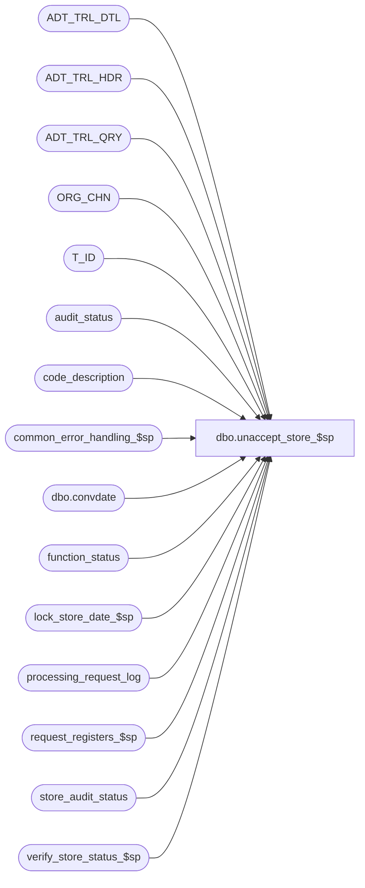

# dbo.unaccept_store_$sp

**Database:** auditworks_external  
**Server:** bedrockdb01  

## Architecture Diagram



## Table Dependencies

| Referenced Table |
|---|
| ADT_TRL_DTL |
| ADT_TRL_HDR |
| ADT_TRL_QRY |
| ORG_CHN |
| T_ID |
| audit_status |
| code_description |
| common_error_handling_$sp |
| dbo.convdate |
| function_status |
| lock_store_date_$sp |
| processing_request_log |
| request_registers_$sp |
| store_audit_status |
| verify_store_status_$sp |

## Stored Procedure Code

```sql
create proc [dbo].[unaccept_store_$sp] 
(@process_id		binary(16),
 @user_id		int,
 @datetime_of_request 	datetime = NULL)
 
AS

/* Proc name : unaccept_store_$sp
 Desc: Set status of each store/reg/sales_date in audit_status to
 	100 (edited) if it has a status of 300 (accepted). The
 	register status will be set to 200 (verified) if the register meets
 	the verified criteria. Status in store_audit_status will be set
 	to verified if all registers for a particular store/sales_date
 	are all set to verified.
 	Called by Power Builder. Frontend populates table processing_request_log with a 
        list of registers or one row for the store (register_no <= 0).

HISTORY
Date     Name		Def# Desc
Jan18,12 Vicci        132439 Remove references to CRDM user-defined string datatypes from S/A since CRDM is not changing them to support unicode.
Aug30,10 Vicci        115428 Use @datetime_of_request (datetime) for all processing_request_log updates, not 
			     @request_datetime which is a smalldatetime to match function_status.
Mar16,10 Vicci        115428 Make @datetime_of_request a datetime to match UI.
Jul10,07 Phu           88928 Fix error: Arithmetic overflow error for data type tinyint. Cannot insert the value NULL into column 'TBL_KEY'.
Apr05.07 Daphna      DV-1360 uplift 84045 add param @called_by_edit = 3 when calling verify_store_status,
                             change all variables declared as bit to tinyint
Mar07,07 Paul        DV-1273 corrected audit trail, removed duplicate variable name
Dec02,04 Maryam      DV-1181 Avoid the duplicate error when inserting to ADT_TRL_HDR.
Sep15,04 IanK        DV-1146 Change user_name to user_id
Aug31,04 Maryam      DV-1120 Use convdate function for dates when logging the audit trail, change audit trail query
Jul27,04 Maryam      DV-1071 avoid error converting the varchar value to a column of data type smallint
                             Modify the insert into ADT_TRL_HDR to include APP_ID, FNCTTN_NUM.
May29,04 Maryam      DV-1071 Use ORG_CHN_WRKSTN instead of register table.
May20,04 David       DV-1071 Use ORG_CHN table as new the Store table.
Apr21,04 Maryam      DV-1071 Modified to receive @user_name and @process_id as input parameters and 
 			     pass it to the sub procs.modify the call to lock_store_date_$sp
 			     as it no longer outputs the user_name
Oct29,02 Winnie	     1-FGESD Include Moved Invalid Register in the logic.
Mar07,02 Daphna      AW-8467 Update function_status set entry_date = datetime of request
Feb07,02 Paul        1-AVFFQ Clean up audit trail logic
Dec11,01 Daphna      1-9I4IJ Remove deletion of function status, now done by Front End (03.00)
                             Add audit trail tracking, add R3 Error Handling
Nov28,01 Paul           8910 set status_set_by in store_audit_status to user name
Oct15,01 Henry          8837 Retrofit of DEF 8832 for Build 2.46.25
Oct12,01 Henry          8832 Skip store/dates where date_reject_id != 0 to avoid leaving locked stores
Aug10,01 Daphna         8466 Insert/Update/Delete function status for recovery
                             Ignore requests for invalid store, reg or date
                             processing status 200 renamed 77
Mar28,01 David C        7425 avoid unaccepting all registers for store/date combination
May25,00 John G         5864 Change '= NULL' to 'IS NULL' where applicable to mirror Oracle.         
May08,00 Paul           6293 call verify_store_status_$sp
Mar01,00 Phu            5900 Change @@fetch_status > 0 to @@fetch_status <> 0 for MS SQL compatibility
Sep15,98 Shapoor
*/


DECLARE
	@after_description		nvarchar(255),
        @all_register			tinyint,
	@audit_status 			smallint,
	@before_description		nvarchar(255),
	@bypass_store                   int,
	@current_date 			smalldatetime,
	@cursor_open 			tinyint,
	@date_reject_id	 		tinyint,
	@duplicate_qty 			smallint,
	@duplicate_verified 		tinyint,
	@errmsg 			nvarchar(255),
	@errno 				int,
	@exception_qty 			smallint,
	@exceptions_verified 		tinyint,
	@if_reject_qty 			smallint,
	@media_rec_verified 		tinyint,
	@missing_qty 			numeric(12,0),
	@missing_verified		tinyint,
	@opening_drawer_discrepancy 	tinyint,
	@prev_sales_date		smalldatetime,
	@prev_store_no 			int,
	@processing_status 		smallint,
	@process_no 			smallint,
	@register_no	        	smallint,
	@request_datetime 		smalldatetime,
	@rows				int, 
	@sales_date 			smalldatetime,
	@sa_reject_qty 			smallint,
	@sep				nchar(1),
	@short_by_tender_over_limit 	tinyint,
	@store_no 			int,
	@store_name			nvarchar(255),
	-- error handling
	@process_name			nvarchar(100),
	@object_name			nvarchar(255),
	@operation_name			nvarchar(100),
	@message_id			int,
	@log_error_flag			tinyint,
	-- new audit trail tables
	@ENTRY_ID			T_ID,
	@TBL_NAME			nvarchar(255),
	@TBL_KEY			nvarchar(255),
	@TBL_KEY_RSRC_NAME		nvarchar(255),
	@TBL_KEY_RSRC_PRMS		nvarchar(255)
        

SELECT	@current_date 		= getdate(),
	@cursor_open 		= 0,
	@errmsg 		= NULL,
	@process_no 		= 77,
        @prev_store_no	 	= -1,
        @prev_sales_date 	= null,
        @bypass_store		= 0,
        @process_name		= 'unaccept_store_$sp',
        @message_id		= 201068, -- Db Error
        @log_error_flag	= 0, -- not called by smartload
        @sep = nchar(12) -- audit trail seperator

SELECT @TBL_NAME = 'AUDIT_STATUS', 
       @TBL_KEY_RSRC_NAME = 'TK_STOR_TRAN_DATE_REGI_DATE_REJE_ID'


IF @datetime_of_request IS NULL /* then */
BEGIN
  SELECT @errno = 201510,
         @message_id = 201510,
         @errmsg = 'Invalid passing arguments',
         @object_name = 'unaccept_store_$sp',
         @operation_name = 'EXECUTE PROCEDURE'
  GOTO error
END

       
/* if unaccepting a store, insert registers into processing_request_log */
EXEC request_registers_$sp @process_id, @user_id, @datetime_of_request,
	@process_no, @errmsg OUTPUT

SELECT @errno = @@error
IF @errno <> 0
BEGIN
   SELECT @errmsg = 'When unaccepting a store',
          @object_name = 'request_registers_$sp',
          @operation_name = 'EXECUTE'
   GOTO error
END

-- def 8832
UPDATE processing_request_log
   SET processing_status = 76 -- invalid date
 WHERE user_id = @user_id
   AND request_datetime = @datetime_of_request
   AND date_reject_id != 0

SELECT @errno = @@error
IF @errno <> 0
BEGIN
   SELECT @errmsg = 'processing_status = 76',
          @object_name = 'processing_request_log',
          @operation_name = 'UPDATE'
   GOTO error
END

DECLARE process_unaccept_store_crsr CURSOR FAST_FORWARD
FOR
SELECT DISTINCT
	request_datetime,
	store_no,
	register_no,
	sales_date,
	date_reject_id
  FROM processing_request_log WITH (NOLOCK)
 WHERE user_id = @user_id
   AND request_datetime = @datetime_of_request
   AND processing_status = 0
 ORDER BY sales_date, store_no

SELECT @errno = @@error
IF @errno <> 0
BEGIN
  SELECT @errmsg = 'Unable to declare cursor process_unaccept_store_crsr',
         @object_name = 'process_unaccept_store_crsr',
         @operation_name = 'DECLARE CURSOR'
  GOTO error
END

OPEN process_unaccept_store_crsr
SELECT  @cursor_open = 1

WHILE 1 = 1
BEGIN
  FETCH process_unaccept_store_crsr INTO
	@request_datetime,
	@store_no,
	@register_no,
	@sales_date,
	@date_reject_id

  IF @@fetch_status <> 0
  SELECT @store_no = -2

  IF @store_no <> @prev_store_no  OR @sales_date <> @prev_sales_date
  BEGIN

    IF @prev_store_no >= 0 AND @bypass_store = 0
    BEGIN
      EXEC verify_store_status_$sp @process_id, @user_id, @prev_store_no, @prev_sales_date, @date_reject_id,
                                   @errmsg OUTPUT, NULL, 3
      SELECT @errno = @@error
      IF @errno != 0
      BEGIN
        SELECT @errmsg = 'Where @prev_store_no >= 0 AND @bypass_store = 0',
               @object_name = 'verify_store_status_$sp',
               @operation_name = 'EXECUTE'
        GOTO error
      END	

      UPDATE store_audit_status
         SET update_in_progress = 0,
             status_set_by_user_id = @user_id
       WHERE store_no = @prev_store_no
         AND sales_date = @prev_sales_date
         AND date_reject_id = @date_reject_id

      SELECT @errno = @@error
      IF @errno <> 0
      BEGIN
 	   SELECT @errmsg = 'update_in_progress = 0',
	          @object_name = 'store_audit_status',
	          @operation_name = 'UPDATE'
	   GOTO error
      END

    END --if prev_store_no >= 0
    
    IF @store_no = -2
   BREAK
    
    ELSE
    BEGIN
      SELECT @prev_store_no = @store_no,
             @prev_sales_date = @sales_date
             
      UPDATE function_status
         SET store_no = @store_no,
             transaction_date = @sales_date,
             date_reject_id = @date_reject_id,
             status = 1,
             entry_date = @request_datetime   -- def 8467
       WHERE user_id = @user_id
         AND function_no = @process_no
         AND process_id = @process_id
     
      SELECT @errno = @@error,
             @rows = @@rowcount
      IF @errno <> 0
      BEGIN
        SELECT @errmsg = 'store_no, date, status = 1',
               @operation_name = 'UPDATE',
               @object_name = 'function_status'
        GOTO error
      END
  
      IF @rows = 0 -- no status row
      BEGIN
        INSERT function_status
            (user_id, process_id, function_no, status, entry_date, store_no,
            register_no, transaction_date, date_reject_id)
        VALUES (@user_id, @process_id, @process_no, 1,@request_datetime, @store_no,
            @register_no, @sales_date, @date_reject_id)
  
        SELECT @errno = @@error
        IF @errno <> 0
        BEGIN
          SELECT @errmsg = 'store_no, date, status = 1',
              @operation_name = 'INSERT',
                 @object_name = 'function_status'
          GOTO error
        END          
      END -- @rows = 0:  no status row
      
      SELECT @errno = 0,
             @bypass_store = 0
      EXEC lock_store_date_$sp @process_id, @user_id, @store_no, @sales_date, @date_reject_id,
           @process_no, @message_id OUTPUT

      SELECT @errno = @@error
      IF @errno <> 0 AND @errno <> 201550
      BEGIN
        SELECT @errmsg = 'Unable to execute lock_store_date_$sp',
               @operation_name = 'EXECUTE',
               @object_name = 'lock_store_date_$sp'
        GOTO error
      END

      IF @message_id = 201550 /* store_date currently in use. bypass it. */
         SELECT @bypass_store = 1,
                @message_id = 201068
              
      IF @bypass_store = 1
      BEGIN
        UPDATE processing_request_log
           SET processing_status = 77
         WHERE store_no = @store_no
           AND sales_date = @sales_date
           AND date_reject_id = @date_reject_id
           AND user_id = @user_id
           AND request_datetime = @datetime_of_request

        SELECT @errno = @@error
        IF @errno <> 0
        BEGIN
          SELECT @errmsg = 'processing_status = 77',
                 @operation_name = 'UPDATE',
                 @object_name = 'processing_request_log'
          GOTO error
        END
      END  -- bypass_store = 1      
    END -- else if store = -2
  END -- change in store/date combination
  
  -- same store/date, diff register

  IF @bypass_store = 1 
    CONTINUE

  SELECT @audit_status = audit_status,
	    @duplicate_qty = duplicate_qty,
  	    @duplicate_verified = duplicate_verified,
	    @exception_qty = exception_qty,
	    @exceptions_verified = exceptions_verified,
	    @if_reject_qty = if_reject_qty,
	    @missing_qty = missing_qty,
	    @missing_verified = missing_verified,
	    @media_rec_verified = media_rec_verified,
	    @opening_drawer_discrepancy = opening_drawer_discrepancy,
	    @sa_reject_qty = sa_reject_qty,
	    @short_by_tender_over_limit = short_by_tender_over_limit
    FROM audit_status
   WHERE store_no = @store_no
     AND sales_date = @sales_date
     AND date_reject_id = @date_reject_id
   AND register_no = @register_no
 
  SELECT @processing_status = 0   
 
  IF @audit_status < 300
    SELECT @processing_status = 70  -- not accepted, cannot unaccept

  IF @audit_status IN (900,901)
    SELECT @processing_status = 71  -- closed/unused

  IF @audit_status IN (902,904)
    SELECT @processing_status = 72  -- deleted

  IF @audit_status IN (903,905,906)
    SELECT @processing_status = 73  -- moved

  IF @audit_status = 7
    SELECT @processing_status = 74  -- invalid store

  IF @audit_status = 8
    SELECT @processing_status = 75  -- invalid register
    
  IF @audit_status > 300  AND @audit_status < 900
    SELECT @processing_status = 80   -- dayend, period end

  IF @audit_status = 300
  BEGIN
    SELECT @audit_status = 100,
           @processing_status = 60
    
  IF  @sa_reject_qty = 0  AND @if_reject_qty = 0
        AND ( @missing_qty = 0 OR @missing_verified = 1 )
        AND ( @exception_qty = 0 OR @exceptions_verified = 1 )
        AND ( @duplicate_qty = 0 OR @duplicate_verified = 1 )
        AND ( @short_by_tender_over_limit = 0 OR @media_rec_verified = 1 )
        AND ( @opening_drawer_discrepancy = 0 OR @media_rec_verified = 1 )
    SELECT @audit_status = 200
  END
      
  BEGIN TRAN
  
    UPDATE processing_request_log
       SET processing_status = @processing_status
     WHERE user_id = @user_id
       AND request_datetime = @datetime_of_request
       AND store_no = @store_no
       AND sales_date = @sales_date
       AND date_reject_id = @date_reject_id
       AND register_no = @register_no

    SELECT @errno = @@error         
    IF @errno <> 0
    BEGIN
      SELECT @errmsg = 'processing_status = @processing_status',
             @object_name = 'processing_request_log',
             @operation_name = 'UPDATE'
      GOTO error
    END
    
    SELECT @rows = 0
    
    IF @processing_status = 60  
    BEGIN
    
      UPDATE audit_status
         SET audit_status = @audit_status,
	        status_date = @current_date,
	        status_set_by_user_id = @user_id
       WHERE store_no = @store_no
         AND register_no = @register_no
         AND sales_date = @sales_date
         AND date_reject_id = @date_reject_id

      SELECT @errno = @@error,
             @rows = @@rowcount
      IF @errno <> 0
      BEGIN
	   SELECT @errmsg = 'audit_status = @audit_status (100)',
	          @object_name = 'audit_status',
	          @operation_name = 'UPDATE'
	   GOTO error
      END

    END -- @processing_status = 60   

     /*  Def 1-9I4IJ:  Audit Trail */
      
    IF @rows > 0 -- reg was unaccepted
    BEGIN
      SELECT @ENTRY_ID = NEWID()
       
      SELECT @after_description = code_display_descr, 
             @before_description = 'Accepted'
        FROM code_description
       WHERE code_type = 13 -- audit_status
         AND code = @audit_status    
  
      SELECT @store_name = ORG_CHN_NAME
        FROM ORG_CHN
       WHERE ORG_CHN_NUM = @store_no

      SELECT @TBL_KEY = convert(nvarchar, @store_no) 
                         + @sep + dbo.convdate(@sales_date)
                         + @sep + convert(nvarchar,@register_no)
                         + @sep + convert(nvarchar,@date_reject_id), 
             @TBL_KEY_RSRC_PRMS = convert(nvarchar, @store_no) + ' - ' + @store_name 
                                   + @sep + dbo.convdate(@sales_date)
                                   + @sep + convert(nvarchar,@register_no)
                                   + @sep + convert(nvarchar,@date_reject_id)

      INSERT ADT_TRL_HDR (
		ENTRY_ID,
		ENTRY_DATE_TIME,
		USER_ID,
		APP_ID,
		ROOT_TBL_NAME,
		ROOT_TBL_KEY,
		ROOT_TBL_KEY_RSRC_NAME,
		ROOT_TBL_KEY_RSRC_PRMS,
		FNCTN_NUM)
       VALUES (
		@ENTRY_ID,
		@current_date,
		@user_id,
		300,
		@TBL_NAME,
		@TBL_KEY,
		@TBL_KEY_RSRC_NAME,
		@TBL_KEY_RSRC_PRMS,
		@process_no)

      SELECT @errno = @@error 
      IF @errno !=0
      BEGIN
        SELECT @errmsg = 're: audit_status.',
               @operation_name ='INSERT',
               @object_name = 'ADT_TRL_HDR' 
        GOTO error
      END   

      INSERT ADT_TRL_DTL (
		ENTRY_ID,
		TBL_NAME,
		TBL_KEY,
		TBL_KEY_RSRC_NAME,	
		TBL_KEY_RSRC_PRMS,
		ACTN_CODE,
		CLMN_NAME,
		OLD_VAL,
		NEW_VAL)
       SELECT	
		@ENTRY_ID,
		@TBL_NAME,
		@TBL_KEY,
		@TBL_KEY_RSRC_NAME,
		@TBL_KEY_RSRC_PRMS,
		'M',
		'AUDIT_STATUS',
		@before_description,
		@after_description

      SELECT @errno = @@error
      IF @errno !=0
      BEGIN
        SELECT @errmsg = 're:audit_status.',
		@operation_name = 'INSERT',
		@object_name = 'ADT_TRL_DTL'
        GOTO error
      END

      INSERT ADT_TRL_QRY (
		ENTRY_ID,
		QRY_KEY_NUM,
		KEY_PART_VAL_1,
		KEY_PART_VAL_2,
		KEY_PART_VAL_3)
       SELECT	
		@ENTRY_ID,
		301,
		@store_no,
		@register_no,
		dbo.convdate(@sales_date)

      SELECT @errno = @@error
      IF @errno !=0
      BEGIN
        SELECT @errmsg = 're:audit_status, type = 1',
               @operation_name = 'INSERT',
        @object_name = 'ADT_TRL_QRY'

        GOTO error
      END

    END -- if @rows > 0

    COMMIT TRAN

  END /* While 1 = 1 */

CLOSE process_unaccept_store_crsr
DEALLOCATE process_unaccept_store_crsr

/* def 1-9i4ij: removed delete of function_status */

RETURN


error:   /* Common error handler */

	IF @@trancount > 0
		ROLLBACK TRANSACTION

	IF @cursor_open <> 0
	BEGIN
	  CLOSE process_unaccept_store_crsr
	  DEALLOCATE process_unaccept_store_crsr
	END

	EXEC common_error_handling_$sp @process_no, @errno, @errmsg, 0,  @message_id,
                @process_name, @object_name, @operation_name, @log_error_flag, 1, 0, null, 0, null, null, null,
	  null, null, null, 0, @process_id, @user_id

	RETURN
```

