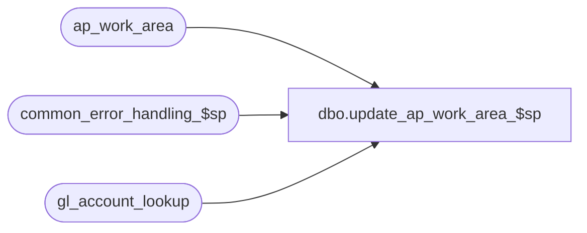

# dbo.update_ap_work_area_$sp

**Database:** auditworks_external  
**Server:** bedrockdb01  

## Architecture Diagram



## Table Dependencies

| Referenced Table |
|---|
| ap_work_area |
| common_error_handling_$sp |
| gl_account_lookup |

## Stored Procedure Code

```sql
create proc [dbo].[update_ap_work_area_$sp] ( @row_updated 			int 		OUTPUT,
  @errmsg 			nvarchar(255) 	OUTPUT )

AS

/* Proc name:   update_ap_work_area_$sp
** Description: Updates the ap_work_area with gl_account_id retrieved
** 		from gl_account_lookup table which is built by
**              create_gl_account_id_$sp procedure.
** 		Called from basic_ap_interface_$sp

HISTORY:
Date     Name        Def# Desc
May10,02 Paul     1-CD0IX added R3 error handling
Sep25,97

*/

DECLARE
	@errno 				int,
	@process_no 			smallint,
	@message_id			int,
	@object_name			nvarchar(255),
	@process_name			nvarchar(100),
	@operation_name			nvarchar(100)

SELECT @process_name = 'update_ap_work_area_$sp',
	@message_id = 201068,
	@process_no = 206

UPDATE ap_work_area
  SET 	gl_account_id = g.gl_account_id
  FROM ap_work_area a, gl_account_lookup g
 WHERE a.gl_account_id = -1
   AND a.store_no = g.store_no
   AND a.transaction_category = g.transaction_category
   AND a.line_object = g.line_object
   AND a.line_action = g.line_action
   AND a.class_code = g.class_code
   AND a.tax_jurisdiction = g.tax_jurisdiction
   AND a.store_deposit_destination = g.store_deposit_destination
   AND a.discounted_line_object = g.discounted_line_object
   AND a.return_from_store = g.return_from_store
   AND a.card_type = g.card_type

SELECT @row_updated = @@rowcount,
	@errno = @@error
IF @errno != 0
  BEGIN
   SELECT @errmsg = 'Failed to update ap_work_area',
          @object_name = 'ap_work_area',
          @operation_name = 'UPDATE'
   GOTO error
  END

RETURN

error:   /* Common error handler */

	EXEC common_error_handling_$sp 206, @errno, @errmsg, 0, @message_id, 
	  @process_name, @object_name, @operation_name, 1
	RETURN
```

