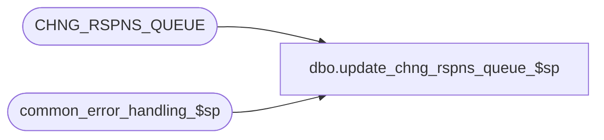

# dbo.update_chng_rspns_queue_$sp

**Database:** auditworks_external  
**Server:** bedrockdb01  

## Architecture Diagram



## Table Dependencies

| Referenced Table |
|---|
| CHNG_RSPNS_QUEUE |
| common_error_handling_$sp |

## Stored Procedure Code

```sql
create proc dbo.update_chng_rspns_queue_$sp 
( 
  @ENTY_TYPE		nvarchar(50)
)

AS

/* Proc name: update_chng_rspns_queue_$sp
   Desc: Update the change response queue table to fire off the mass revalidation/correction. 
   Called from table maintenance triggers.

HISTORY
Date     Name        Def# Desc
Aug14,13 Paul      145958 call common_error_handling_$sp, use try .. catch
Feb16,05 David    DV-1206 New

*/

DECLARE 
  @errmsg                  nvarchar(1024),
  @errno                   int,
  @rows                    int,
  @object_name		nvarchar(255),
  @process_name		nvarchar(100),
  @operation_name		nvarchar(100),
  @message_id		int;


  SELECT @process_name = 'update_chng_rspns_queue_$sp',
	@operation_name = 'UPDATE',
	@object_name = 'CHNG_RSPNS_QUEUE',
	@message_id = 201068;

  BEGIN TRY

    SELECT @errmsg = 'Unable to update CHNG_RSPNS_QUEUE.';
  UPDATE CHNG_RSPNS_QUEUE
     SET CHNG_DATE_TIME = getdate()
   WHERE ENTY_TYPE = @ENTY_TYPE;

  SELECT @rows = @@rowcount;
  
  IF @rows = 0
  BEGIN
       SELECT @errmsg = 'Unable to insert CHNG_RSPNS_QUEUE.',
              @operation_name = 'INSERT';
    INSERT CHNG_RSPNS_QUEUE (ENTY_TYPE, ENTY_ID, ENTY_NUM, ENTY_CODE, STS, LCKD, CHNG_DATE_TIME)
    VALUES (@ENTY_TYPE, null, null, null, null, 0, getdate());

  END; -- IF @rows = 0

  RETURN;

END TRY

BEGIN CATCH;

     /* Common error handler. appending proc name since called by triggers. */

	SELECT @errno = ERROR_NUMBER(),
		@errmsg = 'update_chng_rspns_queue_$sp:' + COALESCE(@errmsg, ' ') + ERROR_MESSAGE();

	EXEC common_error_handling_$sp 0, @errno, @errmsg, 0, @message_id, 
	  @process_name, @object_name, @operation_name, 0, 1, 0, null, 0, null, null, 
	  null, null, null, null, 0, null, 0;

	RETURN;
END CATCH;
```

