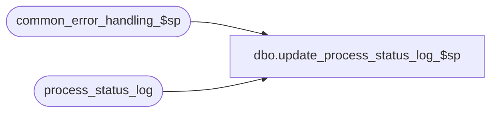

# dbo.update_process_status_log_$sp

**Database:** auditworks_external  
**Server:** bedrockdb01  

## Architecture Diagram



## Table Dependencies

| Referenced Table |
|---|
| common_error_handling_$sp |
| process_status_log |

## Stored Procedure Code

```sql
create proc [dbo].[update_process_status_log_$sp]  ( @process_no                     smallint = NULL,
  @expected_workload              int = NULL,
  @completed_workload             int = NULL,
  @completed_flag                 tinyint = NULL,
  @abort_requested                tinyint = NULL,
  @transaction_qty                int = NULL,
  @process_start_time             datetime = NULL)

AS

/* Proc name: update_process_status_log_$sp
   Desc:      To update an entry in process_status_log table if the entry exists,
              else create.
              Called by all.

History:
Date     Name           Def# Desc
May17,02 Paul        1-CD0IX added R3 error handling
Nov12,01 Phu            8931 Author
*/

DECLARE
	@errmsg 				nvarchar(255),
	@errno 					int,
	@message_id				int,
	@object_name				nvarchar(255),
	@operation_name				nvarchar(100),
	@process_name				nvarchar(100),
	@rows					int


IF @process_no IS NULL

RETURN

SELECT @message_id = 201068,
       @process_name = 'update_process_status_log_$sp'

-- To increment completed_workload by 1, pass null value
UPDATE process_status_log
SET process_start_time = ISNULL(@process_start_time, process_start_time),
    expected_workload = ISNULL(@expected_workload, expected_workload),
    completed_workload = ISNULL(@completed_workload, completed_workload + 1),
    completed_flag = ISNULL(@completed_flag, completed_flag),
    abort_requested = ISNULL(@abort_requested, abort_requested),
    transaction_qty = ISNULL(@transaction_qty, transaction_qty)
WHERE process_no = @process_no

SELECT @errno = @@error, @rows = @@rowcount
IF @errno <> 0
  BEGIN
    SELECT @errmsg = 'Unable to update process_status_log',
           @object_name = 'process_status_log',
           @operation_name = 'UPDATE'
    GOTO error
  END

IF @rows = 0
BEGIN
  INSERT INTO process_status_log (
    process_no,
    process_start_time,
    expected_workload,
    completed_workload,
    completed_flag,
    abort_requested,
    transaction_qty )
  VALUES (
    @process_no,
    ISNULL(@process_start_time, getdate()),
    ISNULL(@expected_workload, 0),
    ISNULL(@completed_workload, 0),
    ISNULL(@completed_flag, 0),
    ISNULL(@abort_requested, 0),
    ISNULL(@transaction_qty, 0) )

  SELECT @errno = @@error
  IF @errno <> 0
    BEGIN
      SELECT @errmsg = 'Unable to insert process_status_log',
             @object_name = 'process_status_log',
             @operation_name = 'INSERT'
      GOTO error
    END

END


RETURN

error:

	EXEC common_error_handling_$sp @process_no, @errno, @errmsg, 0, @message_id, 
	@process_name, @object_name, @operation_name, 1
	RETURN
```

