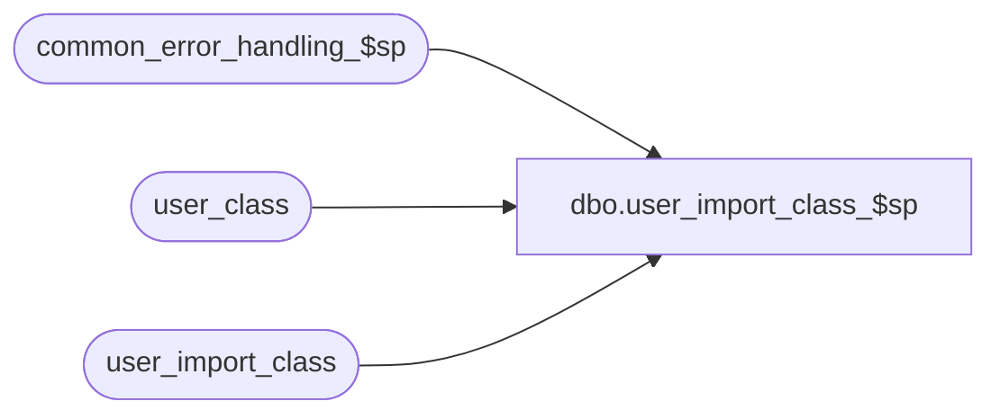

# dbo.user_import_class_$sp

**Database:** auditworks_external  
**Server:** bedrockdb01  

## Architecture Diagram



## Table Dependencies

| Referenced Table |
|---|
| common_error_handling_$sp |
| user_class |
| user_import_class |

## Stored Procedure Code

```sql
create proc [dbo].[user_import_class_$sp] AS

/* 
PROC NAME: user_import_class_$sp
     DESC: This program will post classes received from  a client or 3rd party to the 
           AW user_class table based on the I'nsert U'pdate D'elete R'eplacement_file 
           entry_type 
           Called by ICT_IMPORT smartload: standard_import.ict

  HISTORY:
Date     Name       Def# Desc
Mar18,03 Phu        5425 Remove @errmsg from parameter list to standardize import
Dec09,02 Winnie  1-H56TW avoid raise error on business rule warning message
JUL29,02 Daphna  AW-8143 New Import layout including upc_lookup_division, class_short_description,
                         tax_item_group_id
Jun07,02 Winnie  1-CD0IX Standardize R3.5 error handling
Feb05,02 Paul    1-9MQ0V use upper, add R3 error handling
Feb26,01 Phu        7371 Change double quotes to single quotes for MS SQL compatibility
Apr07,00 Daphna     6165 use of identity col in user_import table to handle
			  insert/update/deletes to same class code in the order 
			  they are in import file
Mar01,00 Phu        5900 Change @@fetch_status > 0 to @@fetch_status <> 0 for MS SQL compatibility
Feb08,00 Maryam     5895 Check for invalid entry type, and trap duplicate rows on update.
Mar01,99 Henry W
Feb09,98 Vicci       n/a author
*/

DECLARE
  @errmsg			nvarchar(255),
  @errno			int,
  @open_cursor			int,
  @class_code   		numeric(20,0),
  @import_id    		numeric(12,0),
  @entry_type   		nchar(1),
  @rows				int,
  @object_name			nvarchar(255),
  @process_name			nvarchar(100),
  @operation_name		nvarchar(100),
  @message_id			int,
  @upc_lookup_division		tinyint,
  @log_flag			tinyint,
  @memo  			nvarchar(50) 


SELECT	@process_name = 'user_import_class_$sp',
        @message_id = 201068,
        @open_cursor = 0,
        @log_flag = 1  -- called by smartload

IF EXISTS(SELECT entry_type 
	    FROM user_import_class
	   WHERE UPPER(entry_type) NOT IN ('I', 'R', 'D', 'U'))
BEGIN
  SELECT @errmsg =
   'An invalid entry-type was encountered in the import file. Please verify the |1 table and import data file.'

  EXEC common_error_handling_$sp 7, 201735, @errmsg, 3, 201735, 
	@process_name, 'user_import_class', NULL, @log_flag, 1, 0, NULL, 0, 'user_import_class'
END

IF EXISTS(SELECT entry_type
            FROM  user_import_class
           WHERE UPPER(entry_type) = 'R')
   TRUNCATE TABLE user_class

SELECT @errno = @@error
IF @errno != 0
BEGIN
   SELECT @errmsg = 'Failed to TRUNCATE table user_class.',
          @object_name = 'user_import_class',
          @operation_name = 'TRUNCATE'
   GOTO error
END

UPDATE user_import_class
SET upc_lookup_division = 1
WHERE upc_lookup_division IS NULL /* */
SELECT @errno = @@error
IF @errno != 0
BEGIN
   SELECT @errmsg = 'set upc_lookup_division = 1 where NULL',
          @object_name = 'user_import_class',
          @operation_name = 'UPDATE'
   GOTO error
END


/* find occurences of same class being inserted/updated/deleted more than once in import file */

DECLARE dup_class_crsr CURSOR
FOR SELECT class_code, upc_lookup_division
FROM user_import_class
GROUP BY class_code, upc_lookup_division
HAVING count(*) > 1

OPEN dup_class_crsr

SELECT @errno = @@error
IF @errno != 0 
BEGIN
   SELECT @errmsg = 'Failed to open cursor dup_class_crsr.',
          @object_name = 'dup_class_crsr',
          @operation_name = 'OPEN'
   GOTO error
END

SELECT @open_cursor = 1

WHILE 1=1
BEGIN
  FETCH dup_class_crsr
   INTO @class_code, @upc_lookup_division

  IF @@fetch_status <> 0    /* if eof, then exit */
    BREAK

  /* get all instances for the class, in order of import file */
  
  DECLARE dup_row_crsr CURSOR
  FOR SELECT import_id, UPPER(entry_type)
        FROM user_import_class
       WHERE class_code = @class_code
       AND upc_lookup_division = @upc_lookup_division 
      ORDER BY import_id

  OPEN dup_row_crsr
  SELECT @errno = @@error
  IF @errno != 0 
  BEGIN
   SELECT @errmsg = 'Failed to open cursor dup_row_crsr.',
          @object_name = 'dup_row_crsr',
          @operation_name = 'OPEN'
    GOTO error
  END

  SELECT @open_cursor = 2  -- both cursors are open 

 /* process all rows returned in the cursor set for duplicate rows on user_import_class table */

  WHILE 2=2
  BEGIN
    FETCH dup_row_crsr
     INTO @import_id, @entry_type

    IF @@fetch_status <> 0    /* if eof, then exit */
      BREAK
  
    IF @entry_type IN ('U', 'I')
    BEGIN
      UPDATE user_class
         SET class_code = bcp.class_code,
 	     class_description = bcp.class_description,
	     department_code = bcp.department_code,
	     upc_lookup_division = bcp.upc_lookup_division,
	     class_short_description = bcp.class_short_description,
	     tax_item_group_id = bcp.tax_item_group_id	     
        FROM user_import_class bcp, user_class c
       WHERE bcp.import_id = @import_id
         AND bcp.class_code = c.class_code
         AND c.upc_lookup_division = bcp.upc_lookup_division

         
      SELECT @errno = @@error,
             @rows = @@rowcount
      IF @errno != 0
      BEGIN
        SELECT @errmsg = 'Failed to UPDATE user_class (dup_row_crsr).',
          @object_name = 'user_class',
          @operation_name = 'UPDATE'
        GOTO error
      END
    
      IF @rows = 0  -- no rows updated
      BEGIN 
        INSERT user_class (class_code,class_description, department_code, 
               upc_lookup_division, class_short_description, tax_item_group_id)
        SELECT class_code,class_description,department_code, upc_lookup_division,
               class_short_description, tax_item_group_id
          FROM user_import_class
         WHERE import_id = @import_id

        SELECT @errno = @@error
        IF @errno != 0
        BEGIN
          SELECT @errmsg = 'Failed to INSERT user_class (dup_row_crsr).',
            @object_name = 'user_class',
            @operation_name = 'INSERT'
          GOTO error
        END
      END -- @rows = 0: no rows updated
    END
    ELSE  -- @entry_type NOT U,I
    BEGIN
      IF @entry_type = 'D'
      BEGIN
        DELETE user_class
          FROM user_import_class bcp, user_class c
         WHERE bcp.class_code = c.class_code
           AND bcp.import_id = @import_id
           AND bcp.upc_lookup_division = c.upc_lookup_division
	
        SELECT @errno = @@error
        IF @errno != 0
        BEGIN
          SELECT @errmsg = 'Failed to DELETE user_class (dup_row_crsr).',
            @object_name = 'user_class',
            @operation_name = 'DELETE'
          GOTO error
        END
     
      END -- @entry_type = 'D'
    END  -- @entry_type NOT U,I
  END /* While 2=2 */

  CLOSE dup_row_crsr
  DEALLOCATE dup_row_crsr
  SELECT @open_cursor = 1  -- only dup_class_crsr is open 
 
  DELETE user_import_class
   WHERE class_code = @class_code
   AND upc_lookup_division = @upc_lookup_division
	
  SELECT @errno = @@error
  IF @errno != 0
  BEGIN
    SELECT @errmsg = 'Failed to DELETE user_import_class (dup_class_crsr).',
            @object_name = 'user_import_class',
            @operation_name = 'DELETE'
    GOTO error
  END
  
  SELECT @errmsg = 
    'Multiple entries for the same key were imported. Please verify key |1 in the |2 table.',
        @memo = convert(nvarchar, @class_code)

  EXEC common_error_handling_$sp 7, 201736, @errmsg, 3, 201736, 
	@process_name, 'user_import_class', NULL, @log_flag, 1, 0, NULL, 0, 
	@memo, 'user_class'

END /* While 1=1 */

CLOSE dup_class_crsr
DEALLOCATE dup_class_crsr
SELECT @open_cursor = 0  -- all cursors closed

/* remaining entries in user_import_class are one per class code */

UPDATE user_import_class
   SET entry_type = 'I'
 WHERE UPPER(entry_type) = 'U'

SELECT @errno = @@error
IF @errno != 0
BEGIN
    SELECT @errmsg = 'Failed to set entry_type = I.',
     @object_name = 'user_import_class',
           @operation_name = 'UPDATE'
   GOTO error
END

UPDATE user_import_class
   SET entry_type = 'U'
  FROM user_import_class uic,
       user_class uc
 WHERE uic.class_code = uc.class_code
   AND uic.upc_lookup_division = uc.upc_lookup_division
   AND UPPER(entry_type) = 'I'

SELECT @errno = @@error
IF @errno != 0
BEGIN
   SELECT @errmsg = 'Failed to set entry_type = U.',
          @object_name = 'user_import_class',
          @operation_name = 'UPDATE'
   GOTO error
END

/* mass insert or replace */

INSERT user_class (class_code, class_description, department_code,upc_lookup_division,
        class_short_description, tax_item_group_id )
SELECT	class_code, class_description, 	department_code, upc_lookup_division,
        class_short_description, tax_item_group_id
  FROM  user_import_class
 WHERE UPPER(entry_type) IN ('I','R')

SELECT @errno = @@error
IF @errno != 0
BEGIN
   SELECT @errmsg = 'Failed to insert user_class.',
          @object_name = 'user_class',
          @operation_name = 'INSERT'
   GOTO error
END

/* mass update */
 
UPDATE user_class
   SET class_code = bcp.class_code,
       class_description = bcp.class_description,
       department_code = bcp.department_code,
       upc_lookup_division = bcp.upc_lookup_division,
       class_short_description = bcp.class_short_description, 
       tax_item_group_id = bcp.tax_item_group_id
  FROM user_import_class bcp, user_class c
 WHERE bcp.class_code = c.class_code
   AND bcp.upc_lookup_division = c.upc_lookup_division
   AND UPPER(bcp.entry_type) = 'U'

SELECT @errno = @@error
IF @errno != 0
BEGIN
   SELECT @errmsg = 'Failed to update user_class.',
          @object_name = 'user_class',
          @operation_name = 'UPDATE'
   GOTO error
END

/* mass delete */

DELETE user_class
  FROM user_import_class bcp, user_class c
 WHERE bcp.class_code = c.class_code
   AND bcp.upc_lookup_division = c.upc_lookup_division
   AND UPPER(bcp.entry_type) = 'D'
	
SELECT @errno = @@error
IF @errno != 0
BEGIN
   SELECT @errmsg = 'Failed to delete user_class.',
          @object_name = 'user_class',
          @operation_name = 'DELETE'
   GOTO error
END

RETURN

error:   /* Common error handler. */

	IF @open_cursor >= 1
	BEGIN
	  CLOSE dup_class_crsr
	  DEALLOCATE dup_class_crsr
	END
	
	IF @open_cursor = 2
	BEGIN
	  CLOSE dup_row_crsr
	  DEALLOCATE dup_row_crsr
	END

	IF @@trancount > 0
	  ROLLBACK TRANSACTION

	EXEC common_error_handling_$sp 7, @errno, @errmsg, 0, @message_id, 
	  @process_name, @object_name, @operation_name, @log_flag

	RETURN
```

