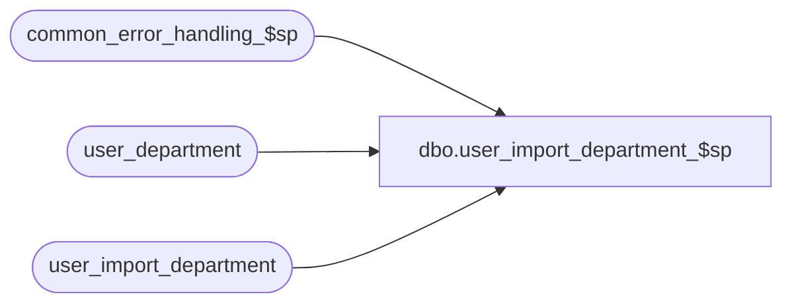

# dbo.user_import_department_$sp

**Database:** auditworks_external  
**Server:** bedrockdb01  

## Architecture Diagram



## Table Dependencies

| Referenced Table |
|---|
| common_error_handling_$sp |
| user_department |
| user_import_department |

## Stored Procedure Code

```sql
create proc [dbo].[user_import_department_$sp] AS


/* 
PROC NAME: user_import_department_$sp
     DESC: This program will post departments received from a client or 3rd party to the 
           AW user_department table based on the I'nsert U'pdate D'elete R'eplacement_file 
           entry_type 
           called by ICT_IMPORT smartload: standard_import.ict
		
HISTORY:
Date     Name          Def# Desc
Mar18,03 Phu           5425 Remove @errmsg from parameter list to standardize import
Dec09,02 Winnie     1-H56TW avoid raise error on business rule warning message
JUL29,02 Daphna     AW-8143 New Import layout including upc_lookup_division
Jun07,02 Winnie	    1-CD0IX Standardize R3.5 error handling
May17,02 Paul       1-CD0IX added R3 error handling
Jul27/00 Maryam        6531 Fixed the cursor to prevent the error of duplicate key.
Apr10/00 Daphna        6165 use of identity col in user_import table to handle
				insert/update/deletes to same dept in the order 
				they are in import file
Mar01/00 Phu           5900 Change @@fetch_status > 0 to @@fetch_status <> 0 for MS SQL compatibility
Feb08/00 Maryam        5895 Check for invalid entry type, and trap duplicate rows on update.
Mar01/99 Henry W
Sep02/98 Vicci          n/a author
*/

DECLARE
  @errno		int,
  @errmsg		nvarchar(255),
  @open_cursor  	int,
  @department_code	numeric(20,0),
  @import_id		numeric(12,0),
  @entry_type		nchar(1),
  @rows			int,
  @message_id		int,
  @object_name		nvarchar(255),
  @process_name		nvarchar(100),
  @process_no		smallint,
  @operation_name	nvarchar(100),
  @upc_lookup_division  tinyint,
  @log_flag             tinyint,
  @memo			nvarchar(50)

SELECT @process_name = 'user_import_department_$sp',
	@message_id = 201068,
        @open_cursor = 0,
        @process_no = 7,
        @log_flag = 1  -- called by smartload

IF EXISTS(SELECT entry_type 
	    FROM user_import_department
	   WHERE UPPER(entry_type) NOT IN ('I', 'R', 'D', 'U'))
BEGIN
  SELECT @errmsg =
   'An invalid entry-type was encountered in the import file. Please verify the |1 table and import data file.'

  EXEC common_error_handling_$sp @process_no, 201735, @errmsg, 3, 201735, 
	@process_name, 'user_import_department', NULL, @log_flag, 1, 0, NULL, 0, 'user_import_department'
END
      
IF EXISTS(SELECT entry_type
            FROM user_import_department
           WHERE UPPER(entry_type) = 'R')
   TRUNCATE TABLE user_department

SELECT @errno = @@error
IF @errno != 0
BEGIN
  SELECT @errmsg = 'Failed to truncate table user_department',
         @object_name = 'user_department',
         @operation_name = 'TRUNCATE'
  GOTO error
END

UPDATE user_import_department
SET upc_lookup_division = 1
WHERE upc_lookup_division IS NULL /* */
SELECT @errno = @@error
IF @errno != 0
BEGIN
  SELECT @errmsg = 'SET upc_lookup_division = 1 when NULL',
         @object_name = 'user_import_department',
         @operation_name = 'UPDATE'
  GOTO error
END

/* find occurences of same dept being inserted/updated/deleted more than once in import file */

DECLARE dup_dept_crsr CURSOR
FOR SELECT department_code, upc_lookup_division
      FROM user_import_department
      GROUP BY department_code, upc_lookup_division
    HAVING COUNT(*) > 1

OPEN dup_dept_crsr

SELECT @errno = @@error
IF @errno != 0 
BEGIN
  SELECT @errmsg = 'Failed to open dup_dept_crsr',
         @object_name = 'dup_dept_crsr',
         @operation_name = 'OPEN'
  GOTO error
END

SELECT @open_cursor = 1

WHILE 1=1
BEGIN
  FETCH dup_dept_crsr
   INTO @department_code, @upc_lookup_division

  IF @@fetch_status <> 0    /* if eof, then exit */
    BREAK

  /* get all instances for the class, in order of import file */

  DECLARE dup_row_crsr CURSOR
  FOR SELECT import_id, entry_type
         FROM user_import_department
        WHERE department_code = @department_code
        AND upc_lookup_division = @upc_lookup_division
   ORDER BY import_id

  OPEN dup_row_crsr
  SELECT @errno = @@error
  IF @errno != 0 
  BEGIN
    SELECT @errmsg = 'Failed to open dup_row_crsr cursor',
         @object_name = 'dup_row_crsr',
         @operation_name = 'OPEN'
    GOTO error
  END

  SELECT @open_cursor = 2 -- both cursors open

 /* process all rows returned in the cursor set for duplicate rows on user_import_department table */

  WHILE 2=2
  BEGIN
    FETCH dup_row_crsr
     INTO @import_id, @entry_type

    IF @@fetch_status <> 0    /* if eof, then exit */
      BREAK

    IF @entry_type IN ('I','U')
    BEGIN
      UPDATE user_department
         SET department_code = bcp.department_code,
	     department_description = bcp.department_description
        FROM user_import_department bcp, user_department d
       WHERE bcp.department_code = d.department_code 
         AND bcp.upc_lookup_division = d.upc_lookup_division
         AND bcp.import_id = @import_id

      SELECT @errno = @@error,
             @rows = @@rowcount
      IF @errno != 0
      BEGIN
        SELECT @errmsg = 'Failed to update user_department (dup_row_crsr)',
           @object_name = 'user_department',
           @operation_name = 'UPDATE'
        GOTO error
      END
      
      IF @rows = 0 -- no rows updated
      BEGIN
        INSERT user_department (
   	       department_code,
   	       department_description,
   	       upc_lookup_division)
        SELECT department_code,
   	       department_description,
   	       upc_lookup_division
          FROM user_import_department
         WHERE import_id = @import_id

        SELECT @errno = @@error
        IF @errno != 0
        BEGIN
          SELECT @errmsg = 'Failed to insert user_department (dup_row_crsr)',
             @object_name = 'user_department',
             @operation_name = 'INSERT'
          GOTO error
        END
      END -- @rows = 0: no rows updated
    END -- @entry_type IN ('I','U')
    ELSE 
    BEGIN
      IF  @entry_type = 'D'
      BEGIN
        DELETE user_department
          FROM user_import_department bcp, user_department d
         WHERE bcp.department_code = d.department_code 
           AND bcp.upc_lookup_division = d.upc_lookup_division
           AND bcp.import_id = @import_id
	
        SELECT @errno = @@error
        IF @errno != 0
        BEGIN
          SELECT @errmsg = 'Failed to delete user_department (dup_row_crsr)',
             @object_name = 'user_department',
             @operation_name = 'DELETE'
          GOTO error
        END
      END -- @entry_type = 'D'
    END -- @entry_type NOT IN ('I','U')
  END /* While 2=2*/

  CLOSE dup_row_crsr
  DEALLOCATE dup_row_crsr
  SELECT @open_cursor = 1  -- only one cursor open

  SELECT @errmsg = 
    'Multiple entries for the same key were imported. Please verify key |1/|3 in the |2 table.',
         @memo = convert(nvarchar, @department_code)

  EXEC common_error_handling_$sp @process_no, 201736, @errmsg, 3, 201736, 
	@process_name, 'user_import_department', NULL, @log_flag, 1, 0, NULL, 0, 
	@memo, 'user_department'

  DELETE user_import_department
   WHERE department_code = @department_code
    AND upc_lookup_division = @upc_lookup_division

  SELECT @errno = @@error
  IF @errno != 0
  BEGIN
    SELECT @errmsg = 'Failed to delete user_import_department (dup_row_crsr)',
             @object_name = 'user_import_department',
             @operation_name = 'DELETE'
    GOTO error
  END
   
END /* While 1=1 */

CLOSE dup_dept_crsr
DEALLOCATE dup_dept_crsr 
SELECT @open_cursor = 0  -- ALL cursors closed 

/* remaining entries in user_import_class are one per class code */

UPDATE user_import_department
   SET entry_type = 'I'
 WHERE UPPER(entry_type) = 'U'

SELECT @errno = @@error
IF @errno != 0
BEGIN
  SELECT @errmsg = 'Failed to update user_import_department to insert',
         @object_name = 'user_import_department',
     @operation_name = 'UPDATE'
  GOTO error
END

UPDATE user_import_department
   SET entry_type = 'U'
  FROM user_import_department uid,
       user_department ud
 WHERE uid.department_code = ud.department_code
   AND uid.upc_lookup_division = ud.upc_lookup_division
   AND UPPER(entry_type) = 'I'

SELECT @errno = @@error
IF @errno != 0
BEGIN
  SELECT @errmsg = 'Failed to update user_import_department to update',
         @object_name = 'user_import_department',
         @operation_name = 'UPDATE'
  GOTO error
END

/* mass insert */

INSERT user_department (
	department_code,
	department_description,
	upc_lookup_division)
SELECT	department_code,
   	department_description,
   	upc_lookup_division
  FROM  user_import_department
 WHERE UPPER(entry_type) IN ('I','R')

SELECT @errno = @@error
IF @errno != 0
BEGIN
  SELECT @errmsg = 'Failed to mass insert user_department',
         @object_name = 'user_department',
         @operation_name = 'INSERT'
  GOTO error
END

/* mass update */
UPDATE user_department
   SET 	   department_code = bcp.department_code,
	   department_description = bcp.department_description,
	   upc_lookup_division = bcp.upc_lookup_division
  FROM user_import_department bcp, user_department d
 WHERE bcp.department_code = d.department_code 
 AND bcp.upc_lookup_division = d.upc_lookup_division
 AND UPPER(bcp.entry_type) = 'U'

SELECT @errno = @@error
IF @errno != 0
BEGIN
  SELECT @errmsg = 'Failed to mass update user_department',
         @object_name = 'user_department',
         @operation_name = 'UPDATE'
  GOTO error
END

/* mass delete */

DELETE user_department
  FROM  user_import_department bcp, user_department d
 WHERE bcp.department_code = d.department_code 
 AND bcp.upc_lookup_division = d.upc_lookup_division
 AND UPPER(bcp.entry_type) = 'D'
	
SELECT @errno = @@error
IF @errno != 0
BEGIN
  SELECT @errmsg = 'Failed to mass delete user_department',
         @object_name = 'user_department',
         @operation_name = 'DELETE'
  GOTO error
END


RETURN

error:   /* Common error handler. */

	IF @open_cursor = 1
	BEGIN
	  CLOSE dup_dept_crsr
          DEALLOCATE dup_dept_crsr 
	END
	
	IF @open_cursor = 2
        BEGIN
	  CLOSE dup_row_crsr
	  DEALLOCATE dup_row_crsr
	  CLOSE dup_dept_crsr
          DEALLOCATE dup_dept_crsr 
	END

	EXEC common_error_handling_$sp @process_no, @errno, @errmsg, 0, @message_id, 
	  @process_name, @object_name, @operation_name, @log_flag
	RETURN
```

