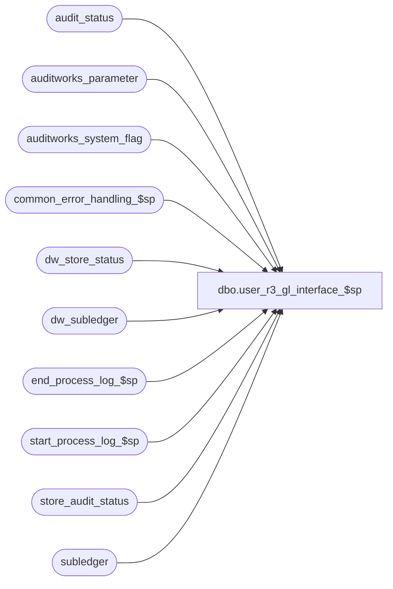

# dbo.user_r3_gl_interface_$sp

**Database:** auditworks_external  
**Server:** bedrockdb01  

## Architecture Diagram



## Table Dependencies

| Referenced Table |
|---|
| audit_status |
| auditworks_parameter |
| auditworks_system_flag |
| common_error_handling_$sp |
| dw_store_status |
| dw_subledger |
| end_process_log_$sp |
| start_process_log_$sp |
| store_audit_status |
| subledger |

## Stored Procedure Code

```sql
create proc [dbo].[user_r3_gl_interface_$sp] 
@period_ending_date		smalldatetime,
@journal_entry_description 	nchar(29),
@last_date_closed		smalldatetime,
@period_end_date		smalldatetime

 AS

/* Proc name: user_r3_gl_interface_$sp
** Description: Builds a custom gl interface from subledger table according a range of 
**      transaction dates, which is retrieved from parameter_general. 
** 		Called from period_end_$sp
**
**             ***   B A S E    P R O G R A M  FOR RELEASE 5.0 AND ABOVE ***
** THIS PROCEDURE IS A CUSTOM PROCEDURE. CONTENTS ARE DIFFERENT FROM ONE CLIENT 
** TO ANOTHER SO THIS PROC CANNOT BE UPGRADED ONSITE.
** TO USE THIS PROC, the glc_export_procedure parameter must be set to 'user_r3_gl_interface_$sp'
** WHEN CREATING THIS PROCEDURE FOR A CLIENT - SET THE APPL ON THE DEFECT SHEET
** TO SACUS.
**

HISTORY:
Date     Name        Def# Desc
Nov12,10 Paul      121833 Add missing gl_posting_datetime setting; remove usage of BETWEEN date range since
                          @last_date_closed should be excluded;  also update dw_subledger on consolidated
Apr20,10 Vicci     117228 Don't set Last Date Closed since this is already done but with correct condition in reset_period_end_$sp.
			  Update status to 500 and set posted to G/L flag based on i_period_ending_date instead of i_period_end_date since for some
			  clients the G/L posting takes place daily, not just at period end and since preliminary period end is available.
Oct18,05 Paul       60970 correctly initialize @current_date
May04,05 Sab	  DV-1254 Added new code to update dw_store_status set store_status = 3
May17,02 Paul     1-CD0IX added R3 error handling
Jul05,01 Winnie      8169 Remove the date format of status_date
Mar23,01 Winnie      7450 Check gl_interface_timing for daily GL, move out all the recurring logic of all the GL interface and put it in period end. 

*/

DECLARE
	@current_date 				smalldatetime,
	@errmsg 				nvarchar(255),
	@errno 					int,
	@instance_id				int,
	@loop_date				smalldatetime,
	@process_log_entry 			bit,
	@process_no 				smallint,
	@process_timestamp 			float,
	@transaction_count 			numeric(12,0),
	@scaleout_flag				int,
	@scaleout_gl_export_on_peri		tinyint,
	@message_id				int,
	@object_name				nvarchar(255),
	@process_name				nvarchar(100),
	@operation_name				nvarchar(100)

SELECT @process_name = 'user_r3_gl_interface_$sp',
	@message_id = 201068,
	@process_no = 205,
	@current_date = getdate()

EXEC start_process_log_$sp @process_no, @process_timestamp OUTPUT, @errmsg OUTPUT

SELECT @errno = @@error
IF @errno <> 0
  BEGIN
   IF @errmsg IS NULL /* then */
     SELECT @errmsg = 'Failed to exec start_process_log_$sp'
   SELECT @object_name = 'start_process_log_$sp',
          @operation_name = 'EXECUTE'
   GOTO error
  END

SELECT @process_log_entry = 1,
	@scaleout_flag = 0,
	@scaleout_gl_export_on_peri = 0,
	@instance_id = 0

SELECT @scaleout_flag = flag_numeric_value
  FROM auditworks_system_flag
 WHERE flag_name = 'scaleout_flag'

SELECT @scaleout_gl_export_on_peri = CONVERT(tinyint,par_value)
  FROM auditworks_parameter 
 WHERE par_name = 'scaleout_gl_export_on_peri'

SELECT @instance_id = flag_numeric_value
  FROM auditworks_system_flag
 WHERE flag_name = 'instance_id'


BEGIN TRANSACTION

/********************************************************************************/
/**                                                                            **/
/**                                                                            **/
/**                                                                            **/
/**                          BODY OF CODE HERE                                 **/
/**                                                                            **/
/**                                                                            **/
/**           **/
/********************************************************************************/

/* Set subledger posting status to yes */
  
  UPDATE subledger
    SET posting_status = 1,
	gl_posting_datetime = @current_date
   WHERE posting_status = 0
     AND transaction_date > @last_date_closed
     AND transaction_date <= @period_end_date

  SELECT @errno = @@error
  IF @errno <> 0
    BEGIN
     SELECT @errmsg = 'Failed to update subledger with posting_status to 1',
	@object_name = 'subledger',
        @operation_name = 'UPDATE'
     GOTO error
    END

  /* If running export on peripheral, also need to set posted_status in subledger on consolidated */
  IF @scaleout_gl_export_on_peri = 1 AND @scaleout_flag = 1 -- THEN 
    BEGIN
    /* Using loop to batch by date and to improve scaleout query plan */
    SELECT @loop_date = DATEADD(dd,1,@last_date_closed)

    WHILE @loop_date <= @period_end_date
    BEGIN
	      UPDATE dw_subledger
	         SET posting_status = 1,
	             gl_posting_datetime = @current_date
	       WHERE posting_status = 0
	         AND transaction_date = @loop_date 
	         AND store_no
	             IN (SELECT DISTINCT store_no
	                 FROM subledger
	                 WHERE transaction_date = @loop_date
	                   AND posting_status >= 1)

		  SELECT @errno = @@error
		  IF @errno <> 0
		    BEGIN
		     SELECT @errmsg = 'Failed to update dw_subledger with posting_status to 1',
			@object_name = 'dw_subledger',
			@operation_name = 'UPDATE'
			GOTO error
		    END
	SELECT @loop_date = DATEADD(dd,1,@loop_date)
    END -- While
    END -- If @scaleout_gl_export_on_peri = 1


  UPDATE audit_status
    SET audit_status = 500,
       status_date =  @current_date
   WHERE audit_status = 400
     AND sales_date > @last_date_closed
     AND sales_date <= @period_end_date

  SELECT @errno = @@error
  IF @errno <> 0
    BEGIN
     SELECT @errmsg = 'Failed to update audit_status to 500 from 400',
	@object_name = 'audit_status',
        @operation_name = 'UPDATE'
     GOTO error
    END

  UPDATE store_audit_status
    SET store_audit_status = 500,
        store_status_date = @current_date
   WHERE store_audit_status = 400
     AND sales_date > @last_date_closed
     AND sales_date <= @period_end_date

  SELECT @errno = @@error
  IF @errno <> 0
    BEGIN
     SELECT @errmsg = 'Failed to update store_audit_status to 500 from 400',
	@object_name = 'store_audit_status',
        @operation_name = 'UPDATE'
     GOTO error
    END

  UPDATE dw_store_status
     SET store_status = 3
   WHERE store_status = 2 
     AND subledger_copied_flag = 1
     AND sales_date > @last_date_closed
     AND sales_date <= @period_end_date
     AND instance_id = @instance_id

  SELECT @errno = @@error
  IF @errno <> 0
    BEGIN
	SELECT @errmsg = 'Unable to set store_status to 3 from 2',
	       @object_name = 'dw_store_status',
	       @operation_name = 'UPDATE'
	GOTO error
    END

COMMIT TRAN

IF @process_log_entry = 1
  BEGIN
    EXEC end_process_log_$sp @process_no, @process_timestamp, @transaction_count
    SELECT @errno = @@error
    IF @errno <> 0
      BEGIN
       SELECT @errmsg = 'Failed to EXECUTE end_process_log_$sp',
  	      @object_name = 'end_process_log_$sp',
              @operation_name = 'EXECUTE'
       GOTO error
      END
  END


RETURN

/* Common error handler */
error:  

	EXEC common_error_handling_$sp @process_no, @errno, @errmsg, 0, @message_id, 
	  @process_name, @object_name, @operation_name, 1, 1, 1, @process_timestamp, @transaction_count

	RETURN
```

