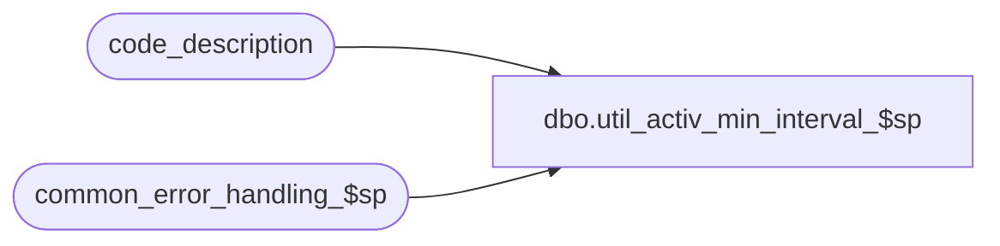

# dbo.util_activ_min_interval_$sp

**Database:** auditworks_external  
**Server:** bedrockdb01  

## Architecture Diagram



## Table Dependencies

| Referenced Table |
|---|
| code_description |
| common_error_handling_$sp |

## Stored Procedure Code

```sql
create proc dbo.util_activ_min_interval_$sp 

  

( @new_activity_minute_interval		smallint = 0,
  @new_register_activity_am_pm		bit = 0,
  @old_activity_minute_interval		smallint = 0,
  @old_register_activity_am_pm		bit = 0)

AS 

/*
Proc Name: util_activ_min_interval_$sp
Desc: This code used to be part of the parameter_general_$trbur trigger. 
      It is now a separate utility, to rebuild the activity_minute_intervals in code_description table
      for code_type = 49. Can use this utility, until front-end fixes are completed (def 8544).
      This proc does not need to be converted yto Unicode.

HISTORY:  
Date     Name              Def# Desc
Aug15,13 Paul            145958 call common_error_handling_$sp, use try .. catch
Aug21,01	Henry             8543 Utility to rebuild the register_activity intervals in code_description
				for code-type 49. Once front-end fix is done (def 8544), won't need to
				use this utility anymore.


Note:	Get the 'old' values from parameter_general.

	SELECT activity_minute_interval, register_activity_am_pm FROM parameter_general

	Then set the 'new' values and execute the utility.
*/


DECLARE
  @interval_id				smallint,
  @reg_activity_rebuild			tinyint,
  @time					smalldatetime,
  @time_flag				bit,
  @time_from				nvarchar(10),
  @time_temp				nvarchar(30),
  @time_to				nvarchar(10),
  @errmsg                       	nvarchar(1024),
  @errno                        	int, 
  @message_id			int,
  @object_name			nvarchar(255),
  @operation_name			nvarchar(100),
  @process_name			nvarchar(100),
  @process_id                     binary(16),
  @user_id                        int


SELECT @reg_activity_rebuild = 0,
	@process_name = 'util_activ_min_interval_$sp',
	@message_id = 201068,
	@process_id = @@spid, -- only used for logging errors in sub procs
	@user_id = null;

SELECT @errmsg = 'Failed to calculate before loop',
	@operation_name = 'SELECT',
	@object_name = 'code_description';

BEGIN TRY

  IF (
   (@old_activity_minute_interval != @new_activity_minute_interval) OR
   (@old_register_activity_am_pm  != @new_register_activity_am_pm)  
   )
  BEGIN
   SELECT @reg_activity_rebuild = 1;

     SELECT @errmsg = 'Failed to DELETE from code_description',
	@operation_name = 'DELETE';
   DELETE FROM code_description
    WHERE code_type = 49;

  IF @new_activity_minute_interval = 0
     SELECT @reg_activity_rebuild = 0;
  END

  IF @reg_activity_rebuild = 1
  BEGIN
   SELECT @interval_id = 0,
	@time = '01/01/96 00:00',
	@time_flag = 0;

   WHILE (@time_flag = 0)
   BEGIN
	SELECT @errmsg = 'Failed to calculate time',
		@operation_name = 'LOOP'
     IF @new_register_activity_am_pm = 0
       BEGIN
        SELECT @time_temp = CONVERT(nchar(20), @time, 8);
        SELECT @time_from = SUBSTRING(@time_temp,1,5);
       END;
     ELSE
       BEGIN
        SELECT @time_temp = CONVERT(nchar(20), @time, 0);
        SELECT @time_from = SUBSTRING(@time_temp,13,5);
       END;

     SELECT @time = DATEADD(minute, @new_activity_minute_interval - 1, @time);
     IF @new_register_activity_am_pm = 0
       BEGIN
        IF @time < '01/01/96 23:59'
          BEGIN
	   SELECT @time_temp = CONVERT(nchar(20), @time, 8);
	   SELECT @time_to = SUBSTRING(@time_temp,1,5);
          END;
        ELSE
          BEGIN
	   SELECT @time_to = '23:59',
	          @time_flag = 1;
          END;
       END
     ELSE
      BEGIN
        IF @time < '01/01/96 23:59'
          BEGIN
           SELECT @time_temp = CONVERT(nchar(20), @time, 0);
           SELECT @time_to = SUBSTRING(@time_temp,13,5) + ' ' + SUBSTRING(@time_temp,18,2);
          END;
        ELSE
          BEGIN
	   SELECT @time_to = '11:59 PM',
	          @time_flag = 1;
          END; 
      END

        SELECT @errmsg = 'Failed to INSERT code_description',
		@operation_name = 'INSERT',
		@object_name = 'code_description';
     INSERT code_description (
	code_type,
	code,
	code_display_descr,
	code_meaning_control,
	code_system_descr)
     SELECT
	49,
	@interval_id,
	@time_from + ' - ' + @time_to,
	'S',
	@time_from + ' - ' + @time_to;

     SELECT @time = DATEADD(minute, 1, @time),
            @interval_id = @interval_id + 1; 

   END; /* While */

  END; /* If @reg_activity_rebuild = 1 */

RETURN;

END TRY

BEGIN CATCH;

     /* Common error handler. */

	SELECT @errno = ERROR_NUMBER(),
		@errmsg = COALESCE(@errmsg, ' ') + ERROR_MESSAGE();

	EXEC common_error_handling_$sp 0, @errno, @errmsg, 0, @message_id, 
	  @process_name, @object_name, @operation_name, 0, 1, 0, null, 0, null, null, 
	  null, null, null, null, 0, null, 0;

	RETURN;
END CATCH;
```

