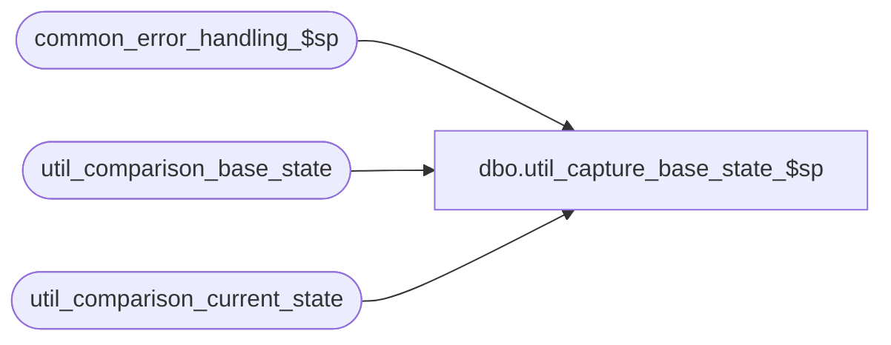

# dbo.util_capture_base_state_$sp

**Database:** auditworks_external  
**Server:** bedrockdb01  

## Architecture Diagram



## Table Dependencies

| Referenced Table |
|---|
| common_error_handling_$sp |
| util_comparison_base_state |
| util_comparison_current_state |

## Stored Procedure Code

```sql
create proc [dbo].[util_capture_base_state_$sp] @comparison_id int,
@process_id int,
@errmsg nvarchar(255) = null OUTPUT
AS

/*
NAME:	util_capture_base_state_$sp
DESCRIPTION: To save the current state as the base state.
HISTORY:
Date		Author		Defect	Desc
Jan21,02	Vicci		1-ADFD5	Create interface comparison utility
*/

DECLARE
	@errno				int,
	@message_id		        int,	
	@object_name			nvarchar(255),
	@operation_name			nvarchar(100),
	@process_no			int,
	@process_name		        nvarchar(100),
	@row_count			int,
	@print_message			nvarchar(255)

SELECT @process_name = 'util_capture_base_state_$sp',
       @process_no = 36,
       @message_id = 201068

DELETE util_comparison_base_state
 WHERE comparison_id = @comparison_id
SELECT @errno = @@error
  IF @errno != 0
    BEGIN
      SELECT @errmsg = 'Failed to clean util_comparison_base_state',
             @object_name = 'util_comparison_base_state',
             @operation_name = 'DELETE'      
      GOTO error
    END

INSERT util_comparison_base_state( comparison_id, table_name, validation_area, 
  		comparison_key, 
  		comparison_text1, 
  		comparison_text2,
  		comparison_text_minor)
SELECT comparison_id, table_name, validation_area, 
  		comparison_key, 
  		comparison_text1, 
  		comparison_text2,
  		comparison_text_minor
  FROM util_comparison_current_state
 WHERE process_id = @process_id
   AND comparison_id = @comparison_id

SELECT @errno = @@error, @row_count = @@rowcount
  IF @errno != 0
    BEGIN
      SELECT @errmsg = 'Failed to save current current state as base state',
             @object_name = 'util_comparison_base_state',
             @operation_name = 'INSERT'      
      GOTO error
    END

SELECT @print_message = convert(nvarchar, @row_count) + ' rows were saved as new base state for comparison_id ' + convert(nvarchar,@comparison_id)

PRINT @print_message

RETURN

error:
	EXEC common_error_handling_$sp @process_no, @errno, @errmsg, 0, @message_id, 
	@process_name, @object_name, @operation_name, 1
	RETURN
```

