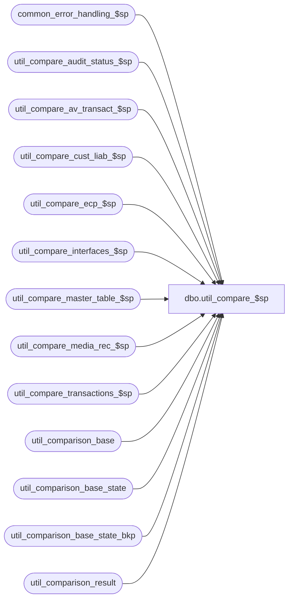

# dbo.util_compare_$sp

**Database:** auditworks_external  
**Server:** bedrockdb01  

## Architecture Diagram



## Table Dependencies

| Referenced Table |
|---|
| common_error_handling_$sp |
| util_compare_audit_status_$sp |
| util_compare_av_transact_$sp |
| util_compare_cust_liab_$sp |
| util_compare_ecp_$sp |
| util_compare_interfaces_$sp |
| util_compare_master_table_$sp |
| util_compare_media_rec_$sp |
| util_compare_transactions_$sp |
| util_comparison_base |
| util_comparison_base_state |
| util_comparison_base_state_bkp |
| util_comparison_result |

## Stored Procedure Code

```sql
create proc [dbo].[util_compare_$sp] 
@comparison_id int,
@capture_base_state tinyint = 0,   --1=capture base state, 2=capture it and back it up
@from_interface_posting_date datetime = '01/01/2002',
@to_interface_posting_date datetime = null
AS

/*
NAME:	util_compare_$sp
DESCRIPTION: To capture the current data in a set of tables (in util_comparison_current_state)
	     and optionally compare it to a base state saved earlier.
	     Looks up the @comparison_id passed in util_comparison_base to determine what set 
	     of tables to look at and for what store/date range.
HISTORY:
Date		Author		Defect	Desc
Jun18,07	Phu		88098	Port 86867 to SA5. Enhance utility to support employee commission productivity.
Feb21,06	David		DV-1328	Enhance utility to support master tables. 
Jun10,03 	Vicci		9504 	Enhance utility to support audit status and media rec
Mar03,03	Winnie		6554	Enhance utility to support customer liability, archived transactions
Jan28,03	Vicci		5791	author


*/


DECLARE
	@errno				int,
	@message_id		        int,	
	@object_name			nvarchar(255),
	@operation_name			nvarchar(100),
	@process_no			int,
	@process_name		        nvarchar(100),
	@capture_base_state_input	tinyint,
	@comparison_time		datetime,
	@from_store_no 			int,
	@from_transaction_date 		datetime,
	@to_store_no 			int,
	@to_transaction_date		datetime,
	@interface_id			tinyint,
	@process_id 			int,
	@comparison_type		smallint,
	@row_count			int,
	@status_message 		nvarchar(255),
	@extra_count int,
	@missing_count int,
	@different_count int,
	@minor_difference_count int,
	@errmsg nvarchar(255),
	@reference_type			tinyint


SELECT @process_name = 'util_compare_$sp',
       @process_no = 36,
       @message_id = 201068,
       @process_id = IsNull(@process_id, @@spid),
       @comparison_time = getdate(),
       @capture_base_state_input = sign(@capture_base_state)

DELETE util_comparison_result
 WHERE process_id = @process_id
    OR comparison_id = @comparison_id

SELECT @errno = @@error
  IF @errno != 0
    BEGIN
      SELECT @errmsg = 'Failed to clean util_comparison_result',
             @object_name = 'util_comparison_result',
             @operation_name = 'DELETE'      
      GOTO error
    END

SELECT 	@from_store_no = from_store_no,
	@to_store_no = to_store_no,
	@from_transaction_date = from_transaction_date,
	@to_transaction_date = to_transaction_date,
	@interface_id = interface_id,
	@comparison_type = comparison_type,
	@reference_type = reference_type
  FROM  util_comparison_base
 WHERE	comparison_id = @comparison_id
 
SELECT @errno = @@error, @row_count = @@rowcount
  IF @errno != 0 or @row_count = 0
    BEGIN
      SELECT @errmsg = 'Failed to locate comparison_id in util_comparison_base',
             @object_name = 'util_comparison_base',
             @operation_name = 'SELECT'      
      GOTO error
    END


IF @comparison_type = 1
BEGIN
	EXEC util_compare_interfaces_$sp @comparison_id, 
					 0, 
					 @capture_base_state_input,
					 @from_interface_posting_date,
					 @to_interface_posting_date,
					 @from_store_no,
					 @from_transaction_date,
					 @to_store_no,
					 @to_transaction_date,
					 @interface_id,
					 @status_message OUTPUT ,
				         @extra_count OUTPUT,
					 @missing_count OUTPUT,
					 @different_count OUTPUT,
				 	 @minor_difference_count OUTPUT,
					 @process_id OUTPUT,
					 @errmsg OUTPUT
    	SELECT @errno = @@error
    	IF @errno != 0
      	BEGIN
        IF @errmsg IS NULL /* then */
          SELECT @errmsg = 'Failed to execute stored procedure util_compare_interfaces_$sp'
 	SELECT @object_name = 'util_compare_interfaces_$sp',
               @operation_name = 'EXECUTE'
        GOTO error
      	END
END --@comparison_type = 1
ELSE

  IF @comparison_type = 2
  BEGIN
	EXEC util_compare_transactions_$sp @comparison_id, 
					 0, 
					 @capture_base_state_input,
					 @from_interface_posting_date,
					 @to_interface_posting_date,					 
					 @from_store_no,
					 @from_transaction_date,
					 @to_store_no,
					 @to_transaction_date,
					 @interface_id,
					 @status_message OUTPUT ,
				         @extra_count OUTPUT,
					 @missing_count OUTPUT,
					 @different_count OUTPUT,
				 	 @minor_difference_count OUTPUT,
					 @process_id OUTPUT,
					 @errmsg OUTPUT
    	SELECT @errno = @@error
    	IF @errno != 0
      	BEGIN
        IF @errmsg IS NULL /* then */
          SELECT @errmsg = 'Failed to execute stored procedure util_compare_transactions_$sp'
 	SELECT @object_name = 'util_compare_transactions_$sp',
               @operation_name = 'EXECUTE'
        GOTO error
      	END
  END --@comparison_type = 2

ELSE

  IF @comparison_type = 3
  BEGIN
	EXEC util_compare_av_transact_$sp @comparison_id, 
					 0, 
					 @capture_base_state_input,
					 @from_interface_posting_date,
					 @to_interface_posting_date, 
					 @from_store_no, 
					 @from_transaction_date,
					 @to_store_no,
					 @to_transaction_date,
					 @interface_id,
					 @status_message OUTPUT ,
				         @extra_count OUTPUT,
					 @missing_count OUTPUT,
					 @different_count OUTPUT,
				 	 @minor_difference_count OUTPUT,
					 @process_id OUTPUT,
					 @errmsg OUTPUT
    	SELECT @errno = @@error
    	IF @errno != 0
      	BEGIN
        IF @errmsg IS NULL /* then */
          SELECT @errmsg = 'Failed to execute stored procedure util_compare_transactions_$sp'
 	SELECT @object_name = 'util_compare_av_transact_$sp',
               @operation_name = 'EXECUTE'
        GOTO error
      	END
  END --@comparison_type = 3

ELSE

  IF @comparison_type = 4
  BEGIN
	EXEC util_compare_cust_liab_$sp @comparison_id, 
					 0, 
					 @capture_base_state_input,
					 @from_interface_posting_date,
					 @to_interface_posting_date,					 
					 @from_store_no,
					 @from_transaction_date,
					 @to_store_no,
					 @to_transaction_date,
					 @reference_type,
					 @status_message OUTPUT ,
				         @extra_count OUTPUT,
					 @missing_count OUTPUT,
					 @different_count OUTPUT,
				 	 @minor_difference_count OUTPUT,
					 @process_id OUTPUT,
					 @errmsg OUTPUT
    	SELECT @errno = @@error
    	IF @errno != 0
      	BEGIN
        IF @errmsg IS NULL /* then */
          SELECT @errmsg = 'Failed to execute stored procedure util_compare_transactions_$sp'
 	SELECT @object_name = 'util_compare_cust_liab_$sp',
               @operation_name = 'EXECUTE'
        GOTO error
      	END
  END --@comparison_type = 4

ELSE

  IF @comparison_type = 5
  BEGIN
	EXEC util_compare_audit_status_$sp @comparison_id, 
					 0, 
					 @capture_base_state_input,
					 @from_interface_posting_date,
					 @to_interface_posting_date, 
					 @from_store_no,
					 @from_transaction_date,
					 @to_store_no,
					 @to_transaction_date,
					 @status_message OUTPUT ,
				         @extra_count OUTPUT,
					 @missing_count OUTPUT,
					 @different_count OUTPUT,
				 	 @minor_difference_count OUTPUT,
					 @process_id OUTPUT,
					 @errmsg OUTPUT
    	SELECT @errno = @@error
    	IF @errno != 0
      	BEGIN
        IF @errmsg IS NULL /* then */
          SELECT @errmsg = 'Failed to execute stored procedure util_compare_audit_status_$sp'
 	SELECT @object_name = 'util_compare_audit_status_$sp',
               @operation_name = 'EXECUTE'
        GOTO error
      	END
  END --@comparison_type = 5

ELSE

  IF @comparison_type = 6
  BEGIN
	EXEC util_compare_media_rec_$sp @comparison_id, 
					 0, 
					 @capture_base_state_input,
					 @from_store_no, 
					 @from_transaction_date, 
					 @to_store_no, 
					 @to_transaction_date, 
					 @status_message OUTPUT ,
				         @extra_count OUTPUT,
					 @missing_count OUTPUT,
					 @different_count OUTPUT,
				 	 @minor_difference_count OUTPUT,
					 @process_id OUTPUT,
					 @errmsg OUTPUT
    	SELECT @errno = @@error
   	IF @errno != 0
      	BEGIN
        IF @errmsg IS NULL /* then */
          SELECT @errmsg = 'Failed to execute stored procedure util_compare_media_rec_$sp'
 	SELECT @object_name = 'util_compare_media_rec_$sp',
               @operation_name = 'EXECUTE'
        GOTO error
      	END
  END --@comparison_type = 6

ELSE

  IF @comparison_type = 7
  BEGIN
	EXEC util_compare_master_table_$sp @comparison_id, 
					 0, 
					 @capture_base_state_input,
					 @status_message OUTPUT ,
				         @extra_count OUTPUT,
					 @missing_count OUTPUT,
					 @different_count OUTPUT,
				 	 @minor_difference_count OUTPUT,
					 @process_id OUTPUT,
					 @errmsg OUTPUT
    	SELECT @errno = @@error
    	IF @errno != 0
      	BEGIN
        IF @errmsg IS NULL /* then */
          SELECT @errmsg = 'Failed to execute stored procedure util_compare_master_table_$sp'
 	SELECT @object_name = 'util_compare_master_table_$sp',
               @operation_name = 'EXECUTE'
        GOTO error
      	END
  END --@comparison_type = 7

ELSE

  IF @comparison_type = 8
  BEGIN
	EXEC util_compare_ecp_$sp @comparison_id, 
				0,
				@capture_base_state_input,
				@from_transaction_date,
				@to_transaction_date,
				@status_message OUTPUT,
				@extra_count OUTPUT,
				@missing_count OUTPUT,
				@different_count OUTPUT,
				@minor_difference_count OUTPUT,
				@process_id OUTPUT,
				@errmsg OUTPUT
    	SELECT @errno = @@error
    	IF @errno != 0
      	BEGIN
        IF @errmsg IS NULL /* then */
          SELECT @errmsg = 'Failed to execute stored procedure util_compare_ecp_$sp'
 	SELECT @object_name = 'util_compare_ecp_$sp',
               @operation_name = 'EXECUTE'
        GOTO error
      	END
  END --@comparison_type = 8

UPDATE util_comparison_base
SET status_message = @status_message,
extra_count = @extra_count,
missing_count = @missing_count,
different_count = @different_count,
minor_difference_count = @minor_difference_count,
last_comparison_datetime = getdate()
WHERE comparison_id = @comparison_id
SELECT @errno = @@error
  IF @errno != 0
    BEGIN
      SELECT @errmsg = 'Failed to log comparison results to util_comparison_base',
             @object_name = 'util_comparison_base',
             @operation_name = 'UPDATE'      
      GOTO error
    END

IF @capture_base_state = 2
BEGIN

DELETE util_comparison_base_state_bkp

SELECT @errno = @@error
  IF @errno != 0
    BEGIN
      SELECT @errmsg = 'Failed to clean base state backup',
             @object_name = 'util_comparison_base_state_bkp',
             @operation_name = 'DELETE'      
      GOTO error
    END

INSERT util_comparison_base_state_bkp( comparison_id, table_name, validation_area, 
  		comparison_key, 
  		comparison_text1, 
  		comparison_text2,
  		comparison_text_minor)
SELECT comparison_id, table_name, validation_area, 
  		comparison_key, 
  		comparison_text1, 
  		comparison_text2,
  		comparison_text_minor
  FROM util_comparison_base_state

SELECT @errno = @@error
  IF @errno != 0
    BEGIN
      SELECT @errmsg = 'Failed to save backup of base state in auditworks_work',
             @object_name = 'util_comparison_base_state_bkp',
             @operation_name = 'INSERT'      
      GOTO error
    END
END --if @capture_base_state = 2


RETURN

error:
	EXEC common_error_handling_$sp @process_no, @errno, @errmsg, 0, @message_id, 
	@process_name, @object_name, @operation_name, 1
	RETURN
```

