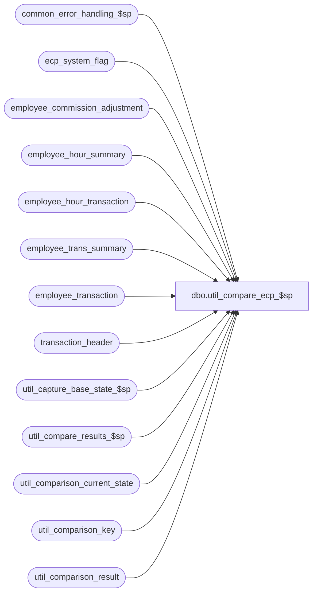

# dbo.util_compare_ecp_$sp

**Database:** auditworks_external  
**Server:** bedrockdb01  

## Architecture Diagram



## Table Dependencies

| Referenced Table |
|---|
| common_error_handling_$sp |
| ecp_system_flag |
| employee_commission_adjustment |
| employee_hour_summary |
| employee_hour_transaction |
| employee_trans_summary |
| employee_transaction |
| transaction_header |
| util_capture_base_state_$sp |
| util_compare_results_$sp |
| util_comparison_current_state |
| util_comparison_key |
| util_comparison_result |

## Stored Procedure Code

```sql
create proc [dbo].[util_compare_ecp_$sp] 
( @comparison_id                   int = 18,
  @dump_result                     tinyint = 0,
  @capture_base_state              tinyint = 0,
  @from_transaction_date           datetime = null,
  @to_transaction_date             datetime = null,
  @status_message                  varchar(255) = null OUTPUT,
  @extra_count                     int = 0 OUTPUT,
  @missing_count                   int = 0 OUTPUT,
  @different_count                 int = 0 OUTPUT,
  @minor_difference_count          int = 0 OUTPUT,
  @process_id                      int = NULL OUTPUT,
  @errmsg                          varchar(255) = null OUTPUT
)

AS

/*
NAME: util_compare_ecp_$sp
DESCRIPTION: To capture the entries of the employee commission productivity tables: employee_commission_adjustment,
             employee_trans_summary, employee_hour_summary, employee_transaction, employee_hour_transaction, ecp_system_flag
             that are posted/loaded within the time interval, and compare it to a base state saved earlier.

HISTORY:
Date     Author         Defect Desc
Jun18,07 Phu             88098 Port 86867 to SA5. Initial development.

*/
DECLARE
  @transaction_key               numeric(12,0),
  @comparison_key                varchar(255),
  @cursor_open                   tinyint,
  @errno                         int,
  @message_id                    int,	
  @object_name                   varchar(255),
  @operation_name                varchar(100),
  @previous_comparison_key       varchar(255),
  @print_message                 varchar(255),
  @process_no                    int,
  @process_name                  varchar(100),
  @sequence_no                   int

SET CONCAT_NULL_YIELDS_NULL OFF

SELECT @process_name = 'util_compare_ecp_$sp',
       @process_no = 36,
       @message_id = 201068,
       @from_transaction_date = ISNULL(@from_transaction_date, convert(datetime, '01/01/1996')),
       @to_transaction_date = ISNULL(@to_transaction_date, convert(datetime, '12/31/' + convert(varchar,datepart(yy, getdate())))),
       @process_id = ISNULL(@process_id, @@spid),
       @sequence_no = 0, @cursor_open = 0

DELETE util_comparison_result
 WHERE process_id = @process_id
    OR comparison_id = @comparison_id

SELECT @errno = @@error
IF @errno != 0
BEGIN
  SELECT @errmsg = 'Failed to clean util_comparison_result',
         @object_name = 'util_comparison_result',
         @operation_name = 'DELETE'
  GOTO error
END

DELETE util_comparison_current_state
 WHERE process_id = @process_id
    OR comparison_id = @comparison_id

SELECT @errno = @@error
IF @errno != 0
BEGIN
  SELECT @errmsg = 'Failed to clean util_comparison_current_state',
         @object_name = 'util_comparison_current_state',
         @operation_name = 'DELETE'
  GOTO error
END

DELETE util_comparison_key
 WHERE process_id = @process_id

SELECT @errno = @@error
IF @errno != 0
BEGIN
  SELECT @errmsg = 'Failed to clean util_comparison_key',
         @object_name = 'util_comparison_key',
         @operation_name = 'DELETE'
  GOTO error
END

INSERT util_comparison_key (
  process_id, 
  transaction_key,
  comparison_key )
SELECT
  @process_id,
  commission_adj_id,
  CONVERT(varchar, employee_no) + ' _ ' + CONVERT(varchar, pay_period_end_datetime, 120) + ' _ ' + 
  CONVERT(varchar, auto_commission_adj_id) + ' _ ' + CONVERT(varchar, auto_rev_pay_pd_end_datetime, 120)
FROM employee_commission_adjustment
WHERE auto_commission_adj_id IS NOT NULL --
AND ((entry_datetime >= ISNULL(@from_transaction_date, entry_datetime) AND entry_datetime <= ISNULL(@to_transaction_date, entry_datetime))
     OR (pay_period_end_datetime >= ISNULL(@from_transaction_date, pay_period_end_datetime) AND pay_period_end_datetime <= ISNULL(@to_transaction_date, pay_period_end_datetime)))
ORDER BY entry_datetime

SELECT @errno = @@error
IF @errno != 0
BEGIN
  SELECT @errmsg = 'Failed to build list of comparison keys from employee_commission_adjustment',
         @object_name = 'util_comparison_key',
         @operation_name = 'DELETE'
  GOTO error
END

DECLARE multiple_key_cursor CURSOR
FOR
SELECT transaction_key, comparison_key
FROM util_comparison_key
WHERE process_id = @process_id
AND comparison_key IN (SELECT m.comparison_key
                       FROM util_comparison_key m
                       WHERE m.process_id = @process_id
                       GROUP BY m.comparison_key
                       HAVING COUNT(m.transaction_key) > 1)
ORDER BY comparison_key, sequence_datetime, transaction_key

SELECT @errno = @@error
IF @errno != 0
BEGIN
  SELECT @errmsg = 'Failed to declare multiple_key_cursor CURSOR',
         @object_name = 'multiple_key_cursor',
         @operation_name = 'DECLARE'
  GOTO error
END
   
OPEN multiple_key_cursor
SELECT @errno = @@error
IF @errno != 0
BEGIN
  SELECT @errmsg = 'Failed to open CURSOR',
         @object_name = 'multiple_key_cursor',
         @operation_name = 'OPEN'
  GOTO error
END

SELECT @cursor_open = 1

FETCH multiple_key_cursor
 INTO @transaction_key, @comparison_key

WHILE @@fetch_status = 0
BEGIN
  IF @previous_comparison_key != @comparison_key
  BEGIN
    SELECT @previous_comparison_key = @comparison_key,
           @sequence_no = 0
  END

  SELECT @sequence_no = @sequence_no + 1
  UPDATE util_comparison_key
     SET comparison_key = comparison_key + 'Seq' + CONVERT(varchar, @sequence_no)
   WHERE process_id = @process_id 
     AND transaction_key = @transaction_key

  SELECT @errno = @@error
  IF @errno != 0
  BEGIN
    SELECT @errmsg = 'Failed to add a sequence number to the comparison_key',
 	   @object_name = 'util_comparison_key',
	   @operation_name = 'UPDATE'
    GOTO error
  END
   
FETCH multiple_key_cursor
 INTO @transaction_key, @comparison_key

END -- while not end of multiple_key_cursor

CLOSE multiple_key_cursor
DEALLOCATE multiple_key_cursor
SELECT @cursor_open = 0


-- Log employee_commission_adjustment
INSERT INTO util_comparison_current_state( 
  process_id, comparison_id, table_name, validation_area, 
  comparison_key, 
  comparison_text1, 
  comparison_text2,
  comparison_text_minor)
SELECT @process_id, @comparison_id, 'employee_commission_adjustment', 'Employee Commission Adjustment', 
  k.comparison_key,
  e.primary_position + ' _ ' + CONVERT(varchar, e.primary_selling_area_no) + ' _ ' + 
    CONVERT(varchar, e.commission_adj_amount) + ' _ ' + CONVERT(varchar, e.user_id) + ' _ ' + e.adjustment_description,
  e.adjustment_comment,
  NULL
FROM util_comparison_key k, employee_commission_adjustment e
WHERE k.process_id = @process_id
AND k.transaction_key = e.commission_adj_id

SELECT @errno = @@error
IF @errno != 0
BEGIN
  SELECT @errmsg = 'Failed to list current content of employee_commission_adjustment',
         @object_name = 'util_comparison_current_state',
         @operation_name = 'INSERT'
  GOTO error
END


-- Log employee_trans_summary
INSERT INTO util_comparison_current_state( 
  process_id, comparison_id, table_name, validation_area, 
  comparison_key, 
  comparison_text1, 
  comparison_text2,
  comparison_text_minor)
SELECT @process_id, @comparison_id, 'employee_trans_summary', 'Employee Trans Summary', 
  CONVERT(varchar, employee_no) + ' _ ' + CONVERT(varchar, period_end_datetime, 120) + ' _ ' +
    CONVERT(varchar, pay_period_end_datetime, 120) + ' _ ' + CONVERT(varchar, calendar_level) + ' _ ' + 
    CONVERT(varchar, transaction_store_no) + ' _ ' + CONVERT(varchar, tier_id) + ' _ ' + 
    employee_transaction_role + ' _ ' + transaction_commission_code + ' _ ' + 
    employee_commission_code + ' _ ' + item_commission_code + ' _ ' + 
    store_commission_code + ' _ ' + CONVERT(varchar, tier_id) + ' _ ' + 
    primary_position + CONVERT(varchar, primary_selling_area_no) + ' _ ' + 
    CONVERT(varchar, commission_rate) + ' _ ' + CONVERT(varchar, commission_amount_per_item),
  CONVERT(varchar, transaction_net_amount) + ' _ ' + 
    CONVERT(varchar, transaction_discount_amount) + ' _ ' + CONVERT(varchar, transaction_units) + ' _ ' + CONVERT(varchar, transaction_quantity) + ' _ ' +
    CONVERT(varchar, transaction_quantity_adj) + ' _ ' + source_allocation_type,	
  NULL,
  NULL
FROM employee_trans_summary
WHERE (period_end_datetime >= ISNULL(@from_transaction_date, period_end_datetime) AND period_end_datetime <= ISNULL(@to_transaction_date, period_end_datetime))
   OR (pay_period_end_datetime >= ISNULL(@from_transaction_date, pay_period_end_datetime) AND pay_period_end_datetime <= ISNULL(@to_transaction_date, pay_period_end_datetime))

SELECT @errno = @@error
IF @errno != 0
BEGIN
  SELECT @errmsg = 'Failed to list current content of employee_trans_summary',
         @object_name = 'util_comparison_current_state',
         @operation_name = 'INSERT'
  GOTO error
END


-- Log employee_hour_summary
INSERT INTO util_comparison_current_state( 
  process_id, comparison_id, table_name, validation_area, 
  comparison_key, 
  comparison_text1, 
  comparison_text2,
  comparison_text_minor)
SELECT @process_id, @comparison_id, 'employee_hour_summary', 'Employee Hour Summary', 
  CONVERT(varchar, employee_no) + ' _ ' + CONVERT(varchar, period_end_datetime, 120) + ' _ ' +
    CONVERT(varchar, calendar_level) + ' _ ' + CONVERT(varchar, pay_period_end_datetime, 120) + ' _ ' + 
    CONVERT(varchar, store_no) + ' _ ' + CONVERT(varchar, payroll_entry_hour_type) + ' _ ' +
    CONVERT(varchar, payroll_entry_selling_area_no) + ' _ ' + payroll_entry_position,
  primary_position + ' _ ' + CONVERT(varchar, primary_selling_area_no) + ' _ ' + 
    CONVERT(varchar, productive_selling_hours) + ' _ ' + 
    CONVERT(varchar, productive_non_selling_hours) + ' _ ' + CONVERT(varchar, non_productive_hours),
  NULL,
  NULL
FROM employee_hour_summary
WHERE (period_end_datetime >= ISNULL(@from_transaction_date, period_end_datetime) AND period_end_datetime <= ISNULL(@to_transaction_date, period_end_datetime))
   OR (pay_period_end_datetime >= ISNULL(@from_transaction_date, pay_period_end_datetime) AND pay_period_end_datetime <= ISNULL(@to_transaction_date, pay_period_end_datetime))

SELECT @errno = @@error
IF @errno != 0
BEGIN
  SELECT @errmsg = 'Failed to list current content of employee_hour_summary',
         @object_name = 'util_comparison_current_state',
         @operation_name = 'INSERT'
  GOTO error
END


-- Log employee_transaction
INSERT INTO util_comparison_current_state( 
  process_id, comparison_id, table_name, validation_area, 
  comparison_key, 
  comparison_text1, 
  comparison_text2,
  comparison_text_minor)
SELECT @process_id, @comparison_id, 'employee_transaction', 'Employee Transaction', 
  CONVERT(varchar, et.employee_no) + ' _ ' + CONVERT(varchar, et.transaction_date, 120) + ' _ ' +
    et.employee_transaction_role + ' _ ' + CONVERT(varchar, et.line_id) + ' _ ' +
    CONVERT(varchar, h.store_no) + ' _ ' +  CONVERT(varchar, h.register_no) + ' _ ' +  CONVERT(varchar, h.transaction_no) + ' _ ' +  h.transaction_series,
  CONVERT(varchar, COUNT(et.current_flag)),
  NULL,
  NULL
FROM employee_transaction et
     LEFT JOIN transaction_header h ON (et.transaction_id = h.transaction_id)
WHERE (et.transaction_date >= ISNULL(@from_transaction_date, et.transaction_date) AND et.transaction_date <= ISNULL(@to_transaction_date, et.transaction_date))
GROUP BY
  CONVERT(varchar, et.employee_no) + ' _ ' + CONVERT(varchar, et.transaction_date, 120) + ' _ ' +
    et.employee_transaction_role + ' _ ' + CONVERT(varchar, et.line_id) + ' _ ' +
    CONVERT(varchar, h.store_no) + ' _ ' +  CONVERT(varchar, h.register_no) + ' _ ' +  CONVERT(varchar, h.transaction_no) + ' _ ' +  h.transaction_series

SELECT @errno = @@error
IF @errno != 0
BEGIN
  SELECT @errmsg = 'Failed to list current content of employee_transaction',
  @object_name = 'util_comparison_current_state',
         @operation_name = 'INSERT'
  GOTO error
END


-- Log employee_hour_transaction
INSERT INTO util_comparison_current_state( 
  process_id, comparison_id, table_name, validation_area, 
  comparison_key, 
  comparison_text1, 
  comparison_text2,
  comparison_text_minor)
SELECT @process_id, @comparison_id, 'employee_hour_transaction', 'Employee Hour Transaction', 
  CONVERT(varchar, employee_no) + ' _ ' + CONVERT(varchar, payroll_date, 120),
  CONVERT(varchar, SUM(hours)) + ' _ ' +  CONVERT(varchar, COUNT(line_id)),
  NULL,
  NULL
FROM employee_hour_transaction
WHERE (payroll_date >= ISNULL(@from_transaction_date, payroll_date) AND payroll_date <= ISNULL(@to_transaction_date, payroll_date))
GROUP BY
  CONVERT(varchar, employee_no) + ' _ ' + CONVERT(varchar, payroll_date, 120)

SELECT @errno = @@error
IF @errno != 0
BEGIN
  SELECT @errmsg = 'Failed to list current content of employee_hour_transaction',
         @object_name = 'util_comparison_current_state',
         @operation_name = 'INSERT'
  GOTO error
END


-- Log ecp_system_flag
INSERT INTO util_comparison_current_state( 
  process_id, comparison_id, table_name, validation_area, 
  comparison_key, 
  comparison_text1, 
  comparison_text2,
  comparison_text_minor)
SELECT @process_id, @comparison_id, 'ecp_system_flag', 'ECP System Flag', 
  flag_name,
  CONVERT(varchar, flag_numeric_value) + ' _ ' + CONVERT(varchar, flag_datetime_value, 120) + ' _ ' +
    CONVERT(varchar, code_type) + ' _ ' + CONVERT(varchar, flag_numeric_initialize_value) + ' _ ' +
    CONVERT(varchar, flag_datetime_initialize_value, 120) + ' _ ' + flag_alpha_initialize_value,
  flag_comment,
  SUBSTRING(flag_alpha_value, 1, 255)
FROM ecp_system_flag

SELECT @errno = @@error
IF @errno != 0
BEGIN
  SELECT @errmsg = 'Failed to list current content of ecp_system_flag',
         @object_name = 'util_comparison_current_state',
         @operation_name = 'INSERT'
  GOTO error
END


IF @capture_base_state <> 1
BEGIN
  EXEC util_compare_results_$sp @comparison_id, @status_message OUTPUT, @extra_count OUTPUT,
    @missing_count OUTPUT, @different_count OUTPUT, @minor_difference_count OUTPUT, @process_id, @errmsg OUTPUT

  SELECT @errno = @@error
  IF @errno != 0
  BEGIN
    IF @errmsg IS NULL --
      SELECT @errmsg = 'Failed to obtain comparison of current results and base state'
    SELECT @object_name = 'util_compare_results_$sp',
           @operation_name = 'EXECUTE'
    GOTO error
  END
END
ELSE
BEGIN
  EXEC util_capture_base_state_$sp @comparison_id, @process_id, @errmsg OUTPUT

  SELECT @errno = @@error
  IF @errno != 0
  BEGIN
    IF @errmsg IS NULL --
      SELECT @errmsg = 'Failed to save current results as base state'
    SELECT @object_name = 'util_capture_base_state_$sp',
           @operation_name = 'EXECUTE'
    GOTO error
  END
END

IF @capture_base_state <> 1
BEGIN
  SELECT @print_message = ':LOG Results for process_id ' + CONVERT(varchar,@process_id) +
    ', comparison_id ' + CONVERT(varchar,@comparison_id) +
    ':  ' + @status_message + 
    ', Extra entries = ' + CONVERT(varchar,@extra_count) +
    ', Missing entries = ' + CONVERT(varchar,@missing_count) +
    ', Different entries = ' + CONVERT(varchar,@different_count) +
    ', Minor differences = ' + CONVERT(varchar,@minor_difference_count)

  PRINT @print_message

  IF @dump_result = 1
     SELECT process_id, comparison_id, comparison_time, status, table_name, validation_area, comparison_key, comparison_text1, comparison_text2, comparison_text_minor, new_comparison_text1, new_comparison_text2, new_comparison_text_minor
     FROM util_comparison_result
     WHERE process_id = @process_id
     AND comparison_id = @comparison_id
END

DELETE util_comparison_key
WHERE process_id = @process_id

SELECT @errno = @@error
IF @errno != 0
BEGIN
  SELECT @errmsg = 'Failed to do final cleanup of util_comparison_key',
         @object_name = 'util_comparison_key',
         @operation_name = 'DELETE'
  GOTO error
END

RETURN

error:
  IF @cursor_open = 1
  BEGIN
    CLOSE multiple_key_cursor
    DEALLOCATE multiple_key_cursor
  END

  EXEC common_error_handling_$sp @process_no, @errno, @errmsg, 0, @message_id, @process_name, @object_name, @operation_name, 1
  RETURN
```

