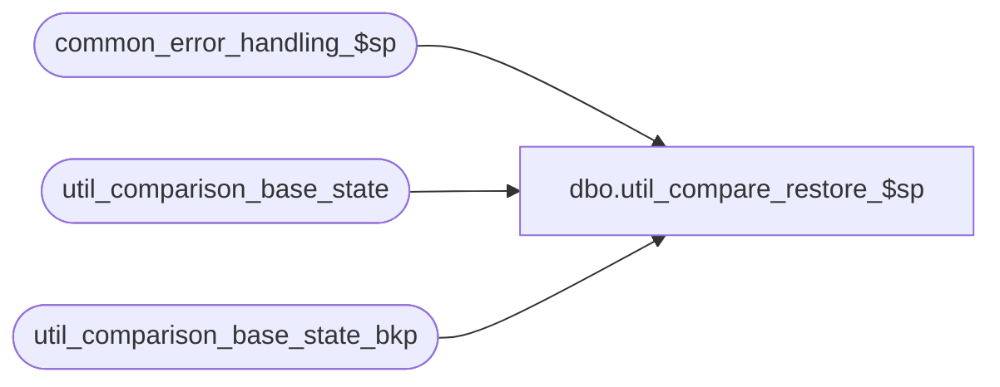

# dbo.util_compare_restore_$sp

**Database:** auditworks_external  
**Server:** bedrockdb01  

## Architecture Diagram



## Table Dependencies

| Referenced Table |
|---|
| common_error_handling_$sp |
| util_comparison_base_state |
| util_comparison_base_state_bkp |

## Stored Procedure Code

```sql
create proc [dbo].[util_compare_restore_$sp] @comparison_id int = null
AS

/*
NAME:	util_compare_restore$sp
DESCRIPTION: To copy base state from auditworks_work to current database.
HISTORY:
Date		Author		Defect	Desc
Mar05,03	Vicci		6554	author

*/


DECLARE
	@errno				int,
	@message_id		        int,	
	@msg				nvarchar(255),
	@object_name			nvarchar(255),
	@operation_name			nvarchar(100),
	@process_id			int,
	@process_no			int,
	@process_name		        nvarchar(100),
	@errmsg 			nvarchar(255)

SELECT @process_name = 'util_compare_restore_$sp',
       @process_no = 36,
       @message_id = 201068,
       @process_id = @@spid


DELETE util_comparison_base_state
WHERE comparison_id = @comparison_id 
   OR @comparison_id IS NULL

SELECT @errno = @@error, @msg = convert(nvarchar,@@rowcount)
  IF @errno != 0
    BEGIN
      SELECT @errmsg = 'Failed to clean util_comparison_base_state',
             @object_name = 'util_comparison_base_state',
             @operation_name = 'DELETE'      
      GOTO error
    END

SELECT @msg = @msg + ' original rows were removed'
PRINT @msg

INSERT util_comparison_base_state(comparison_id, table_name, validation_area, 
       comparison_key, comparison_text1, comparison_text2, comparison_text_minor)
SELECT comparison_id, table_name, validation_area, comparison_key, comparison_text1, 
       comparison_text2, comparison_text_minor
FROM util_comparison_base_state_bkp
WHERE comparison_id = @comparison_id 
   OR @comparison_id IS NULL

SELECT @errno = @@error, @msg = convert(nvarchar,@@rowcount)
  IF @errno != 0
    BEGIN
      SELECT @errmsg = 'Failed to populate util_comparison_base_state',
             @object_name = 'util_comparison_base_state',
             @operation_name = 'INSERT'      
      GOTO error
    END

SELECT @msg = @msg + ' new rows replaced the original rows that were removed'
PRINT @msg

RETURN

error:
	EXEC common_error_handling_$sp @process_no, @errno, @errmsg, 0, @message_id, 
	@process_name, @object_name, @operation_name, 1
	RETURN
```

