# dbo.util_config_base_as_client_$sp

**Database:** auditworks_external  
**Server:** bedrockdb01  

## Architecture Diagram

```mermaid
flowchart LR
    SP["dbo.util_config_base_as_client_$sp"]
    GEOG_ADRS(["GEOG_ADRS"]) --> SP
    GEOG_CNTRY(["GEOG_CNTRY"]) --> SP
    LANG_IDNTFCTN(["LANG_IDNTFCTN"]) --> SP
    ORG_CHN(["ORG_CHN"]) --> SP
    ORG_CHN_APLCTN_USG(["ORG_CHN_APLCTN_USG"]) --> SP
    ORG_CHN_HRCHY(["ORG_CHN_HRCHY"]) --> SP
    ORG_CHN_HRCHY_APP(["ORG_CHN_HRCHY_APP"]) --> SP
    ORG_CHN_HRCHY_LVL(["ORG_CHN_HRCHY_LVL"]) --> SP
    ORG_CHN_HRCHY_LVL_GRP_A(["ORG_CHN_HRCHY_LVL_GRP_A"]) --> SP
    PRTY_ADRS(["PRTY_ADRS"]) --> SP
    auditworks_parameter(["auditworks_parameter"]) --> SP
    auditworks_system_flag(["auditworks_system_flag"]) --> SP
    code_description(["code_description"]) --> SP
    country(["country"]) --> SP
    currency(["currency"]) --> SP
    currency_conversion(["currency_conversion"]) --> SP
    currency_conversion_type(["currency_conversion_type"]) --> SP
    cust_liability_type(["cust_liability_type"]) --> SP
    export_format(["export_format"]) --> SP
    gl_account_cross_reference(["gl_account_cross_reference"]) --> SP
    gl_account_lookup(["gl_account_lookup"]) --> SP
    gl_account_segment_lookup(["gl_account_segment_lookup"]) --> SP
    interface_directory(["interface_directory"]) --> SP
    interface_status(["interface_status"]) --> SP
    language_dependent_description(["language_dependent_description"]) --> SP
    language_identification(["language_identification"]) --> SP
    language_resource(["language_resource"]) --> SP
    line_action(["line_action"]) --> SP
    line_object(["line_object"]) --> SP
    line_object_action_association(["line_object_action_association"]) --> SP
    line_object_action_attachment(["line_object_action_attachment"]) --> SP
    line_object_action_lookup(["line_object_action_lookup"]) --> SP
    media_parameter_rec_group(["media_parameter_rec_group"]) --> SP
    parameter_general(["parameter_general"]) --> SP
    release_interface__sp(["release_interface_$sp"]) --> SP
    smartload_var(["smartload_var"]) --> SP
    tax_default(["tax_default"]) --> SP
    tax_jurisdiction(["tax_jurisdiction"]) --> SP
    tax_jurisdiction_post_code(["tax_jurisdiction_post_code"]) --> SP
    tax_jurisdiction_remittance(["tax_jurisdiction_remittance"]) --> SP
    tax_level(["tax_level"]) --> SP
    tax_rate(["tax_rate"]) --> SP
    taxability_by_class(["taxability_by_class"]) --> SP
    taxability_by_item_group(["taxability_by_item_group"]) --> SP
    taxability_by_sku(["taxability_by_sku"]) --> SP
    taxability_by_style(["taxability_by_style"]) --> SP
    dbo_util_grant_permissions__sp(["dbo.util_grant_permissions_$sp"]) --> SP
    dbo_util_init_pipeline__sp(["dbo.util_init_pipeline_$sp"]) --> SP
    dbo_util_init_tax_master__sp(["dbo.util_init_tax_master_$sp"]) --> SP
    dbo_util_load_logins__sp(["dbo.util_load_logins_$sp"]) --> SP
```



## Table Dependencies

| Referenced Table |
|---|
| GEOG_ADRS |
| GEOG_CNTRY |
| LANG_IDNTFCTN |
| ORG_CHN |
| ORG_CHN_APLCTN_USG |
| ORG_CHN_HRCHY |
| ORG_CHN_HRCHY_APP |
| ORG_CHN_HRCHY_LVL |
| ORG_CHN_HRCHY_LVL_GRP_A |
| PRTY_ADRS |
| auditworks_parameter |
| auditworks_system_flag |
| code_description |
| country |
| currency |
| currency_conversion |
| currency_conversion_type |
| cust_liability_type |
| export_format |
| gl_account_cross_reference |
| gl_account_lookup |
| gl_account_segment_lookup |
| interface_directory |
| interface_status |
| language_dependent_description |
| language_identification |
| language_resource |
| line_action |
| line_object |
| line_object_action_association |
| line_object_action_attachment |
| line_object_action_lookup |
| media_parameter_rec_group |
| parameter_general |
| release_interface_$sp |
| smartload_var |
| tax_default |
| tax_jurisdiction |
| tax_jurisdiction_post_code |
| tax_jurisdiction_remittance |
| tax_level |
| tax_rate |
| taxability_by_class |
| taxability_by_item_group |
| taxability_by_sku |
| taxability_by_style |
| dbo.util_grant_permissions_$sp |
| dbo.util_init_pipeline_$sp |
| dbo.util_init_tax_master_$sp |
| dbo.util_load_logins_$sp |

## Stored Procedure Code

```sql
create proc dbo.util_config_base_as_client_$sp ( @preview_only tinyint = 1, -- (Set to 1 to preview new settings, or to any other value to apply new settings)
  @country_code_list nvarchar(255) = 'US-CA-GB-AU-NZ-MX-CN', -- (Must be valid codes from country master, 
  						--  dash-delimited;  The currency of the 1st
  						--  code listed is used as the base currency).
  						--  Base tax entries for countries not listed
  						--  are removed from the base.
  						--  CN=China)
  @base_language_code nvarchar(10) = 'ENG', --Select from one of these available languages 'ENG', 'FRE', 'UKENG', 'SPA', 'CHIN'
  @remove_language_code_list nvarchar(255) = NULL,  --Example, 'FRE-UKENG-SPA-CHIN'.  To disable multi-language enter dash-delimited list of languages to remove.
  @deactivate_order_type_list nvarchar(255) = NULL,  --Example, '6-7-201-202-221' (where 6=Layaways, 7=Orders, 201=Rentals, 202=Loans, 221=Alterations).  To disable order types which will not initially be used, while preserving their configuration, by deactivating object/action associations.
  @client_has_loss_prevention tinyint = 0, --If you set to true(1) then Loss Prevention interface is activated  
  @smtp_server nvarchar(255) = 'BKSVRx-MS-MTL', --leave blank if Mail Server name unknown;  x varies by client for SAAS.
  @initialize_play_master_data  tinyint = 1,  --1=Yes (i.e. remove stores, calendar, etc), 
					      --0=No (i.e. leave play master table data around, util_init_pipeline_$sp, util_init_tax_master_$sp and util_init_gl_accnt_config_$sp will be run manually later on to clean up)
  @client_has_epicor_merch smallint = 1,  --If you answer 1=Yes, the standard Xpress config applies
  					  --If you answer 0=No, the accounting output for A/P, G/L output will not be redirected to the Merch server left on smartload server under output/financials
  					  --                    the Epicor Merch interface will be deactivated and the upc lookup division set to 1.
  @client_has_epicor_crm smallint = 1,  --If you answer 1=Yes, interface 26 remains active and its hierarchies are preserved, otherwise it is disabled and they are dropped.

--The responses to the following prompts should generally remain untouched i.e. default should be retained
  @client_has_no_flash_sales tinyint = 1,  --If you set to true(1) then skips Flash config and turns off flash interface
  @override_acctng_output_path nvarchar(255) = NULL, --Leave null to accept default SAAS or Xpress location for output for A/P and G/L, specify full path including server otherwise (e.g. "//APPSVR1-LC-MTL/SA2GL_TST")
  @override_smartload_server nvarchar(255) = NULL, --Leave null to accept default SAAS or Xpress name for S/A Smartload server, specify another name otherwise (e.g. APPSVR2-XX-MTL)
  @override_sa_db_server_alias nvarchar(255) = NULL, --Leave null to accept default SAAS or Xpress name for S/A Database server alias, specify another name otherwise (e.g. DBSVR1-XX-MTL)
  @override_transl_prefix nvarchar(255) = NULL, --Leave null to accept default SAAS or Xpress name for work tables into which edit import translate output, specify another prefix without trailing underscore otherwise (e.g. base1)  
  @override_smartlook_db nvarchar(255) = NULL, --Leave null to accept default SAAS or Xpress name for smartlook database, specify another database name otherwise (e.g. fn_xpr_01)  
  @override_flash_db nvarchar(255) = NULL, --Leave null to accept default SAAS or Xpress name for flash database, specify another database name otherwise (e.g. fs_xpr_01)    
  @override_SrMain_path nvarchar(255) = NULL  --Leave null to accept default SAAS or Xpress path for SRMAIN directory (e.g. d:/Epicor/SRMAIN01) under which the SRDW and SRTranslate subdirectories have been created.
)
AS

/*
Description:  This procedure is intended for use following a restore of the SaaS/Xpress
              base config into a newly created client database.
              It will update the client-specific parameters according to the
              standards set forth by SaaS/Xpress, and will replace the transl views with
              view referencing the correct auditworks_work tables defined for the client.
  It will create the logins required by S/A.

	      =================================================================================
              ======= Only valid for SA 5.0+ releases, does not support SA 4.1 and under ======
	      =================================================================================

HISTORY: 
Sep02,14  Vicci TFS-75401 If @client_has_epicor_crm is 0=No, Turn off interface 26,  clean up ORG_CHN_HRCHY_APP for app 200 (CRM) (first removing store 9999 from the hierarchies specified if @initialize_play_master_data is true so that the util_init_pipeline removes them).
Mar11,14  Vicci 150527  Add support for Chinese -People's Republic of China (2052).
Apr02,13  Vicci 143019  Avoid need for compatibility level 80 (Msg 4147-query uses non-ANSI outer join operators) in smartview_interface view definition.
Mar25,13  Vicci 142092  Remove Mexican tax jurisdiction if Mexico not on country list.
Feb27,13  Vicci 142092  Add support for Mexican Spanish (2058).
Jan29,13  Vicci 141463  Correct util_config_base_as_client_$sp to deactivate object action associations instead of deleting them.
Jan15,13  Vicci ERICK   Topology changed as of Express 4.1 (which implement S/A 5.1):  Smartloads for S/A moved to 3rd app server.
Jan03,12  Vicci 140831  Apply language deactivation to CRDM language table as well.
Nov28,12  Vicci 140831  Remove double quotes (nchar(34)) from around translate directory export path
May23,12  Vicci 135296  Allow utility to be run against a database which follows neither the Managed Services nor the Enterprise Express naming conventions,
                        for example one installed via DevStudio or via restoring an express database backup into another database.  Also, do not bother
                        settting parameter_general sv_ view IDs since they are no longer used for Exception TM in SA 5.0+ (they are now hard-coded in the UI).
Mar28,12  Vicci 134079  Remove prompts  --derive from database name instead. 
                        Database naming convention for Managed Services is aw_XXl_01/aw_XXt_02 where XX is client initials;
                        Database naming convention for Enterprise Express is aw_xpr_01/aw_xpr_02;
Mar27,12  Vicci 134079  Continues to call util_load_logins_$sp but with defaults, therefore doesn't really have any effect.
		 	Default for @SrMain_token changed to d:/Epicor/SRMAIN
			@Accounting_output_server_path setting changed not to put a single quote in the middle of the path and to override smartload_var entries for accounting paths regardless of their original setting.
			Adding code redirecting work_config_pos_code_vw to point at current database (needed due to SAAS db renaming).
			Added code to remove references to non-existent databases from transl_prefix_database_xref (they result from SAAS db renaming).
			Modified @transl_pfx to use a baseX prefix with X matching the last digit of @company_no whenever this is available
Jan16,12   Vicci 132412 Include tax jurisdictions in initialization of play data.
Jun14,11   Vicci 127064 Correct some erroneous nchar(39) placements and add SET CONCAT_NULL_YIELDS_NULL OFF;  
			correct positionning of Print regarding flash to be within begin/end
May13,11   Paul  127064 replaced double quotes with nchar(39) to avoid dependency on quoted_identifier setting
May03,11   Vicci 126716 Missing begin/end around disabling of languages.  If all languages other than English are deactivated the language_dependent_description
                        table must be truncated otherwise the descriptions of the remaining 1033 entries will never be updated (since multi-language off) but
                        will be displayed in the UI.
Apr27,11   Vicci 125402 Since tax jurisdiction delete trigger now prevents deletions of jurisdictions referenced in the store master,
                        change the order of the updates in this utility to correct the store master first.
Apr05,11   Vicci 125989 Allow order types to be disabled (deactivates corresponding codes and object/action associations).
Nov11,10   Vicci 121092 Allow multi-language to be disabled or individual language other than 1033 or the base to be removed.
Nov10,10   Vicci 122509 For clients wishing to operate in a base language other than 1033 (U.S. English) it is 
			important to set set the base language immediately, otherwise any table maintenance done
                        to adjust descriptions will be reflected in 1033 but not any other language... so add a prompt.
Jun15,10   Vicci        Defect 118633. Do not only activate countries selected, also deactivate those not selected to handle variances
                        in the base.  Reflect country settings in GEOG_CNTRY.
Feb05,10   ErickS	Added NULL value when calling release_interface_$sp for both process_id and user_id.
Feb02,10   ErickS	Added section to hold interface posting prior to execution and release interfaces after.
Dec29,09   JohnR	Modified to conform to Xpress 3.0 naming conventions and paths
Nov10,09   Vicci        Define customer and customer_detail views as simple select *. Ensure upgrade in progress flag is turned on in order to avoid
                        TM from this script being exported to Coalition as config updates given that no full download would yet have been sent.
Nov05,09   Vicci        Correct tax cleanup
Nov05,09   Vicci        Remove reference to obsolete employee_core view;  pass db parameter to Flash S/A Schema Name setting.
Oct16,09   Vicci        Set @SA2GL_token to empty string if it is null
Oct15,09   Vicci        Correct country code string comparison to include quotes.
Oct13,09   Vicci        Replace references to obsolete S/A master tables with references to CRDM tables;  
			provide option to retain play master data.
Sep01,09   Vicci        Store Express is now the base so no need to call util_config_base_for_store_express_$sp.
Apr20,09   JohnR	Changed @ftp_user_name to use FTPUser instead of NSBFtpSA user
Aug07,08   Vicci Activate new nickel rounding expense line-object if Australia is an included country.
Jul18,08   Vicci        Do not delete tax-level just mark it as inactive, since there is no way to reassociate it with the line-object in TM.
Jun23,08   Vicci        Set tax update timing to be Edit if tax-stripping in play;  raise error if attempt made to re-run utility without restoring;
                        change layaway to layby for Australia and New Zealand.
Jun13,08   Vicci        Support Australia and New Zealand
Jan24,08   JohnR        Fixed bugs reported, when Flash not installed and smartload_var values that weren't being changed for aw_tst_02 only
Oct24,07   JohnR        Added @smtp_server to select (in order to display value)
Sep26,07   JohnR        Changed flash DB name to use @company_code, changes references of MGS and Managed Services to SaaS
Aug30,07   JohnR        Changed @ftp_user_name to use NSBFtpSA instead of NSBUser for PCI compliance
Aug29,07   JohnR	Added SQL syntax for update to flash_schema table and changed the population of the @Flash_db_name and @Smartlook_db_name tokens
Jun29,07   JohnR	Changed @ftp_user_name and @ftp_password to use NSBUser instead of 
			NSBSystem due to special characters in the NSBSystem users' password
			which would fail decryption by Express Add during the ftp process 
Jun26,07   JohnR	Added update to flash_schema table
Jun13,07   JohnR	Created @SA2GL_token used for SA2GL GL output path for test company ONLY
Jun05,07   JohnR	Modified many areas to use new arguments
May25,07   JohnR	Fixed print statement for ftp user name and fixed variable for GL output path
Feb01,07   Vicci        Add update to export format destination path for Great Plains A/R
Dec13,06   Vicci        fix store express paths and ftp user-name
Sep27,06   Vicci        add option to turn on LP.
Sep20,06   Vicci	provide option to leave the naming conventions at the SaaS
                        defaults but still support the Store Express config
May26,06   Vicci        deactivate unused tax-levels
May24,06   Vicci        set upc-lookup-division to 1 if NSB Merchandising not active
May05,06   Vicci	fix language resource for tax-rate.
May04,06   Vicci	add parameter for whether flash installed, fix selection of auditworks_work work-prefix
May03,06   Vicci	change output directory for Great Plains.
Apr14,06   Vicci	change flash updates to run via dynamic sql to avoid errors when
                 in preview mode and views have not yet been updated.
Apr06,06   Vicci	update flash_parameters; run util_init_pipeline;
Feb16,06   Vicci	allow auditworks_work database name to be aw_work instead;
			create logins in auditworks work database as well;
			associate transl views with first available set of auditworks work
			base tables;  take S/A database name from current database instead of
			assuming it has client-token and company-code in it.
Feb10 06   Vicci	store-express support;  company number setting;  SmartLook view id setting in parameter_general
Feb06 06   Vicci	added country-code-list to input parameters
Jan05 05   Vicci	added employee_core view adjustment
Dec19 05 Vicci/John 	removed company code from smartlook database naming; changed expectation to be that implementation's name (DB group label
			instead of datasource) be defined to match the corresponding S/A database name.
Dec12 05   Vicci	Added adjustment of smartview_interface view
*/
DECLARE @SA_db_name nvarchar(255), --(S/A database name )
        @ftp_user_name nvarchar(255), --(for Express Add to FTP to ICT_EDIT01 and for ICT_EXPORT01 to ftp to translate)
        @ftp_pass nvarchar(255), --(for Express Add to FTP to ICT_EDIT01 and for ICT_EXPORT01 to ftp to translate)
	@Flash_db_name nvarchar(255), --(Flash Sales database name)
	@flash_budget_detail nvarchar(1), 
	@Smartlook_db_name nvarchar(255), --(SmartLook database name)
	@SA_db_server_instance_alias nvarchar(255), --	(S/A database server instance alias as defined on server running smartloads)
	@SA_SmartLoad_server_name nvarchar(255), --	(S/A Smartload server name needed for Express Add)
	@Accounting_output_server_path nvarchar(255), -- (Merch server name and path for output for Great Plains)
	@transl_pfx nvarchar(255), --			(Prefix of auditworks_work tables associated with company in question excluding underscore)
	@sawork_prefix nvarchar(255), -- taken from existing transl_transaction_hdr view
	@sa_company_name nvarchar(255), --		(S/A company name)
	@translate_path nvarchar(255),
	@directory_watcher_path nvarchar(255),
	@edit_path nvarchar(255),
	@sql_command nvarchar(4000),
	@view_name nvarchar(255),		
	@table_name nvarchar(255),			
	@db_name nvarchar(255),
	@db_group_id int,		--(SmartLook Group ID for S/A database, usually 1401--Co.1, 1402, Co.2)
	@common_currency_id numeric(12,0),
	@default_country_id numeric(12,0),
	@default_country_code nvarchar(2),
	@multi_currency	tinyint,
	@transaction_category tinyint,
	@line_object smallint,
	@line_action tinyint,
	@gl_company_no tinyint,
	@ap_company_no tinyint,
	@auditworks_work_db_name nvarchar(255),  --validated for existence
	@sawork_database_name nvarchar(255),  --taken from existing transl_transaction_hdr view
	@default_host nvarchar(255),
        @upc_lookup_division tinyint,
        @upgrade_in_progress tinyint,
        @base_language_id smallint,
        @base_language_desc nvarchar(50),
	    @client_token nvarchar(3), -- (XPR for XPR; 2-letter code assigned to represent SaaS client in question)
	    @company_no nvarchar(2),  -- (Usually set to 01 for Live, 02 for Test;  used as S/A, A/P, and G/L company number) -- 070605 JR
	    @client_token_pos tinyint,
	    @cmp_token_pos tinyint,
	    @SrMain_token nvarchar(255),
	    @db_server nvarchar(255), -- 'RETDBS1_or_DBSVR1-XX-MTL'
	    @app2_server nvarchar(255),  -- 'RETAPP2_or_APPSVR2-XX-MTL'
	    @app1_server nvarchar(255), --'RETAPP1_or_APPSVR1-XX-MTL'
	    @app3_server nvarchar(255),  -- 'RETAPP3_or_APPSVR3-XX-MTL'
        @implementation_type nvarchar(4), --XPR=Enterprise Express naming conventions followed, SAAS=Managed Services / Software-as-a-service naming conventions followed, OTHR=Non-standard implementation
        @release_no nvarchar(20)

	    
	   
SET NOCOUNT ON
SET CONCAT_NULL_YIELDS_NULL OFF
-- place interfaces on hold
UPDATE interface_status
   SET hold_datetime = getdate()
WHERE interface_id in (45, 46, 47, 48, 49, 16)
        
SELECT @upgrade_in_progress = COALESCE(upgrade_in_progress , 0), 
       @release_no = release_no
  FROM parameter_general

IF @upgrade_in_progress = 0
  UPDATE parameter_general
     SET upgrade_in_progress = 1

SELECT @SA_db_name = db_name()

--Determine implementation-type
IF lower(substring(@SA_db_name, 1, 7)) = 'aw_xpr_' AND IsNumeric(substring(@SA_db_name, 8, 2)) = 1
  SELECT @implementation_type = 'XPR'  --Express
ELSE
BEGIN
  IF lower(substring(@SA_db_name, 1, 3)) = 'aw_' AND lower(substring(@SA_db_name, 6, 2)) IN ('l_', 't_') AND IsNumeric(substring(@SA_db_name, 8, 2)) = 1
    SELECT @implementation_type = 'SAAS' --Managed Services
  ELSE
    SELECT @implementation_type = 'OTHR' --Non-standard naming conventions
END

SELECT @Accounting_output_server_path = @override_acctng_output_path,
       @transl_pfx = @override_transl_prefix

IF EXISTS (SELECT 1 from sysobjects WHERE type = 'V' and name = 'transl_transaction_hdr')
BEGIN  
  SELECT @sawork_database_name = SUBSTRING(VIEW_DEFINITION, CHARINDEX('FROM', UPPER(VIEW_DEFINITION)) + 5, CHARINDEX('.', UPPER(VIEW_DEFINITION), CHARINDEX('FROM', UPPER(VIEW_DEFINITION))) - (CHARINDEX('FROM', UPPER(VIEW_DEFINITION)) + 5))
    FROM INFORMATION_SCHEMA.VIEWS
   WHERE TABLE_NAME = 'transl_transaction_hdr'
     AND VIEW_DEFINITION like '%.%'
  SELECT @sawork_database_name = LTRIM(@sawork_database_name)
  IF NOT EXISTS (SELECT 1 FROM sys.databases WHERE name = @sawork_database_name)
    SELECT @sawork_database_name = NULL
  ELSE 
    SELECT @auditworks_work_db_name = @sawork_database_name
END
IF @sawork_database_name IS NOT NULL  --therefore the transl_transaction_hdr view exists and points to a valid work database
BEGIN
  --excludes trailing underscore
  SELECT @sawork_prefix = SUBSTRING(VIEW_DEFINITION, CHARINDEX(@sawork_database_name, VIEW_DEFINITION) + len(@sawork_database_name) + 1, CHARINDEX('_', UPPER(VIEW_DEFINITION), CHARINDEX(@sawork_database_name, VIEW_DEFINITION) + len(@sawork_database_name) + 1) - (CHARINDEX(@sawork_database_name, VIEW_DEFINITION) + len(@sawork_database_name) + 1))
    FROM INFORMATION_SCHEMA.VIEWS
   WHERE TABLE_NAME = 'transl_transaction_hdr'
  SELECT @sawork_prefix = REPLACE(@sawork_prefix, 'dbo.', '')
  SELECT @sawork_prefix = REPLACE(@sawork_prefix, '.', '')  
END

IF @implementation_type <> 'OTHR'
BEGIN
  SELECT @client_token_pos = CHARINDEX('_', @SA_db_name) + 1
  SELECT @cmp_token_pos = CHARINDEX('_', @SA_db_name, @client_token_pos) + 1

  SELECT @client_token = SUBSTRING(@SA_db_name, @client_token_pos, 3),
         @company_no = SUBSTRING(@SA_db_name, @cmp_token_pos, 2)
END
ELSE
BEGIN
  SELECT @client_token = 'sa'
  SELECT @company_no = RIGHT('00' + convert(nvarchar, sa_company_no), 2)
    FROM parameter_general
    
  IF @transl_pfx IS NULL AND @sawork_prefix IS NOT NULL  --therefore no override prefix provided but the transl_transaction_hdr view exists and provides one
  BEGIN        
    SELECT @transl_pfx = @sawork_prefix
  END
END

IF @implementation_type = 'SAAS'
BEGIN
  SELECT @client_token = SUBSTRING(@client_token, 1, 2),
         @Smartlook_db_name = COALESCE(@override_smartlook_db, 'fn_' + @client_token + 'l_01'),
         @SrMain_token = COALESCE(@override_SrMain_path, 'd:/Program Files/NSB/SRMAIN' + CASE WHEN @company_no = '02' THEN 'TST' ELSE 'XPR' END),
         @db_server = 'DBSVR1-' + UPPER(@client_token) + '-MTL',
         @app1_server = 'APPSVR1-' + UPPER(@client_token) + '-MTL',
         @app2_server = 'APPSVR2-' + UPPER(@client_token) + '-MTL',
         @app3_server = 'APPSVR3-' + UPPER(@client_token) + '-MTL'
         
  IF @override_acctng_output_path IS NULL
    SELECT @Accounting_output_server_path = '//' + @app1_server + '/SA2GL' + CASE WHEN @company_no = '02' THEN '_TST' ELSE '' END
END
ELSE
BEGIN
  SELECT @Smartlook_db_name = COALESCE(@override_smartlook_db, 'fn_' + @client_token + '_01'),
         @SrMain_token = COALESCE(@override_SrMain_path, 'd:/Epicor/SRMAIN' + @company_no),
         @db_server = @@SERVERNAME,  -- changed from 'RETDBS1' to allow to work in other environments,
         @app1_server = 'RETAPP1',
         @app2_server = 'RETAPP2',
         @app3_server = 'RETAPP3'
  
  IF @override_acctng_output_path IS NULL
    SELECT @Accounting_output_server_path = '//' + @app1_server + '/SA2GL_' + @company_no
END
  

IF @client_has_epicor_merch = 0
  SELECT @upc_lookup_division = 1
ELSE
  SELECT @upc_lookup_division = 2
  
IF @auditworks_work_db_name IS NULL
BEGIN
  SELECT @auditworks_work_db_name = min(name)
    FROM master..sysdatabases
   WHERE name in ('aw_work', 'auditworks_work')
END
IF @auditworks_work_db_name IS NULL
BEGIN
  PRINT 'The S/A work database has not yet been created.  Please create it first and try again.'
  RETURN
END

SELECT @sql_command = 'if not exists (select 1 from ' +  @auditworks_work_db_name + '.dbo.sysobjects where id = Object_id(' + nchar(39)
  +  @auditworks_work_db_name + '.dbo.transl_prefix_database_xref' + nchar(39) + ') '
  + ' and type in (' + nchar(39) + 'U' + nchar(39) + ',' + nchar(39) + 'S' + nchar(39) + ') )
  begin
    create table ' + @auditworks_work_db_name + '.dbo.transl_prefix_database_xref (
           database_name nvarchar(255) not null,
           transl_prefix nvarchar(255) not null)
    create unique clustered index transl_prefix_database_xref_x0 on ' + @auditworks_work_db_name + '.dbo.transl_prefix_database_xref(transl_prefix)
  end
  ELSE
  BEGIN
    DELETE ' + @auditworks_work_db_name + '.dbo.transl_prefix_database_xref
     WHERE database_name NOT IN (SELECT name FROM sys.databases)
  END'
EXEC sp_executesql @sql_command

SELECT @Flash_db_name = COALESCE(@override_flash_db, 'fs_' + @client_token + '_' + @company_no), 
	@flash_budget_detail = 'D',
	@SA_db_server_instance_alias = COALESCE(@override_sa_db_server_alias, @db_server),  --usually DBSVR1 or NSBDB
	@SA_SmartLoad_server_name = COALESCE(@override_smartload_server, CASE WHEN SUBSTRING(@release_no, 1, 3) < '5.1' THEN @app2_server ELSE @app3_server END),  -- used for express-add, usually APPSVR2 or NSBAPP2 for 5.0 OR APPSVR3 or NSBAPP3 for 5.1
	@default_host = @default_host, --used for ftp default destination
	@directory_watcher_path = @SrMain_token + '/SRDW/Translate',
	@translate_path = @SrMain_token + '/SRTranslate/Files',
	@ftp_user_name = 'FTPUser',  --usually FTPUser for Xpress, smrtload for SaaS --070629 JR  --070830 JR 
	@ftp_pass = 'yTY6cbi2A', --usually yTY6cbi2A (used to be this for NSBSystem user) yTYsYvH09ls9wxeI for Xpress, Blcbzcui(smrtload) for SaaS --070629 JR
	@ap_company_no = @company_no,
	@gl_company_no = @company_no,
	@db_group_id = NULL
	
  IF @client_has_epicor_merch = 0 AND @override_acctng_output_path IS NULL
    SELECT @Accounting_output_server_path = '../OUTPUT/Financials'

IF @default_host IS NULL
  SELECT @default_host = @SA_SmartLoad_server_name

SET NOCOUNT ON
SELECT	@edit_path = '/HostData/' + @SA_db_name + '/ICT_EDIT01' --091229 JR

IF @sa_company_name IS NULL
SELECT	@sa_company_name = @SA_db_server_instance_alias + ' -' + @SA_db_name

SELECT @common_currency_id = currency_id, @default_country_id = country_id
  FROM country
 WHERE country_code = substring(@country_code_list, 1, 2)
IF @common_currency_id IS NULL
BEGIN
  PRINT 'Invalid country code list specified.  Please enter dash delimited list of valid 2-character country-codes.'
  RETURN
END

SELECT @base_language_id = language_id, @base_language_desc = language_description
  FROM language_identification
 WHERE language_id = CASE @base_language_code
 		       WHEN 'ENG' THEN 1033
 		       WHEN 'FRE' THEN 3084
 		       WHEN 'UKENG' THEN 2057
 		       WHEN 'SPA' THEN 2058
 		       WHEN 'CHIN' THEN 2052
 		     END
   AND active_flag = 1
IF @base_language_id IS NULL
BEGIN
  PRINT 'Invalid base language specified.  Please enter one of the following valid codes:  ENG, FRE, UKENG, SPA, CHIN.'
  RETURN
END

CREATE TABLE #country_list(currency_id numeric(12,0) null, country_id numeric(12,0) null, country_code nvarchar(3) null, CNTRY_CODE_ISO3 nvarchar(3) null)

SELECT @sql_command = '
  INSERT #country_list(currency_id, country_id, country_code, CNTRY_CODE_ISO3)
  SELECT c.currency_id, c.country_id, c.country_code, gc.CNTRY_CODE_ISO3
    FROM country c
         LEFT OUTER JOIN GEOG_CNTRY gc
           ON c.country_code = gc.CNTRY_CODE_ISO2
   WHERE c.country_code IN (''' + REPLACE(@country_code_list, '-', ''',''') + ''')'

EXEC sp_executesql @sql_command

CREATE TABLE #remove_lang_list(language_id smallint not null)

IF @remove_language_code_list IS NOT NULL AND LTRIM(@remove_language_code_list) <> ''
BEGIN
  SELECT @sql_command = '
  INSERT #remove_lang_list(language_id)
  SELECT l.language_id
    FROM language_identification l
   WHERE l.active_flag = 1
     AND l.language_id <> 1033
     AND (l.language_id <> @base_language_id OR @base_language_id IS NULL)
     AND CASE l.language_id 
         WHEN 2057 THEN ''UKENG''
         WHEN 3084 THEN ''FRE''
         WHEN 2058 THEN ''SPA''
         WHEN 2052 THEN ''CHIN''
         ELSE ''OTHER''
         END IN (''' + REPLACE(@remove_language_code_list, '-', ''',''') + ''')'

  EXEC sp_executesql @sql_command, N'@base_language_id smallint', @base_language_id
END

CREATE TABLE #deactivate_order_type_list(reference_type smallint not null)

IF @deactivate_order_type_list IS NOT NULL AND LTRIM(@deactivate_order_type_list) <> ''
SELECT @sql_command = '
  INSERT #deactivate_order_type_list(reference_type)
  SELECT c.code
    FROM code_description c
   WHERE c.active_flag = 1
     AND c.code_type = 22
     AND c.code IN (''' + REPLACE(@deactivate_order_type_list, '-', ''',''') + ''')'

EXEC sp_executesql @sql_command


IF @preview_only = 1
  PRINT '******************  PREVIEW ONLY, CODE NOT EXECUTED ***************'


IF substring(@country_code_list, 3, 1) <> '-'
  SELECT @multi_currency = 0
ELSE
  SELECT @multi_currency = 1

SELECT currency_conversion_type_id, exchange_rate, effective_date_from
  INTO #base_rate
  FROM currency_conversion
 WHERE currency_id = @common_currency_id

SELECT @sql_command = 'IF NOT EXISTS (SELECT 1
		 FROM ' + @auditworks_work_db_name + '..sysobjects
		WHERE name like ' + nchar(39) + COALESCE(@transl_pfx, '') + '_transaction_hdr' + nchar(39) + ')
BEGIN
  SELECT @transl_pfx = substring(min(name), 1, 5)
    FROM ' + @auditworks_work_db_name + '..sysobjects 
   WHERE (name like ' + nchar(39) + 'base' + RIGHT(@company_no, 1) + '%' + nchar(39) +')
     AND type = ' + nchar(39) + 'U' + nchar(39) + '
     AND substring(name, 1, 5) not in (SELECT transl_prefix 
 FROM ' + @auditworks_work_db_name + '.dbo.transl_prefix_database_xref
                                        WHERE database_name <> db_name())
  IF @transl_pfx IS NULL OR SUBSTRING(@transl_pfx,1, 4) <> ''base''
  BEGIN
    SELECT @transl_pfx = substring(min(name), 1, 5)
      FROM ' + @auditworks_work_db_name + '..sysobjects 
     WHERE (name like ' + nchar(39) + 'base%' + nchar(39) +')
       AND type = ' + nchar(39) + 'U' + nchar(39) + '
       AND substring(name, 1, 5) not in (SELECT transl_prefix 
   FROM ' + @auditworks_work_db_name + '.dbo.transl_prefix_database_xref
                                          WHERE database_name <> db_name())
  END

END '

EXEC sp_executesql @sql_command, N'@transl_pfx nvarchar(255) OUT', @transl_pfx OUT

IF @transl_pfx IS NULL
BEGIN
  print @sql_command

  PRINT '***** ERROR ********:  
  	There is no set of base translate tables/procedures available for use with this database'
  RETURN
END

SELECT 'Base language:                   ' + @base_language_desc  

IF NOT EXISTS (SELECT 1 FROM language_identification WHERE active_flag = 1 and language_id <> 1033 AND language_id NOT IN (SELECT language_id FROM #remove_lang_list))
  SELECT 'Multi-language:		 disabled' 
ELSE
BEGIN
  SELECT 'Multi-language:		 active'
  SELECT 'Active languages:		 '
  SELECT '				 ' + language_description FROM language_identification WHERE active_flag = 1 AND language_id NOT IN (SELECT language_id FROM #remove_lang_list)
END
SELECT 'Base currency ID:		 ' +  convert(nvarchar, @common_currency_id) + '- ' + currency_code
  FROM currency
  WHERE currency_id = @common_currency_id
SELECT 'Base country ID:		 ' +  convert(nvarchar, @default_country_id) + '- ' + country_code
  FROM country
  WHERE country_id = @default_country_id
SELECT 'Multi-currency:		 ' +  convert(nvarchar, @multi_currency) + '-' + substring('No Yes', (@multi_currency * 3) + 1, 3) + ': ' + @country_code_list
  FROM country
  WHERE country_id = @default_country_id
SELECT 'Default currency exchanges rates:'
SELECT c.currency_id, c.currency_code, cc.effective_date_from, convert(numeric(12,6),cc.exchange_rate/br.exchange_rate) as exchange_rate, convert(nvarchar,cc.currency_conversion_type_id) + ' -' + cct.currency_conversion_type_descr as conversion_type
  FROM currency c, currency_conversion cc, #base_rate br, currency_conversion_type cct
 WHERE c.currency_id = cc.currency_id 
   AND cc.currency_conversion_type_id = br.currency_conversion_type_id
   AND cc.effective_date_from = br.effective_date_from
   AND cc.currency_conversion_type_id = cct.currency_conversion_type_id
ORDER BY c.currency_id, c.currency_code, cc.currency_conversion_type_id, cc.effective_date_from 
  
IF CHARINDEX('CA', @country_code_list) = 0 
  PRINT 'Canadian Tax-jurisdictions and PST/GST line-objects will be removed'
IF CHARINDEX('AU', @country_code_list) = 0 AND CHARINDEX('NZ', @country_code_list) = 0 
  PRINT 'Australian and New-Zealand Tax-jurisdictions and GST included line-object will be removed'
IF CHARINDEX('AU', @country_code_list) = 0 AND CHARINDEX('NZ', @country_code_list) <> 0 
  PRINT 'Australian Tax-jurisdiction will be removed'
IF CHARINDEX('AU', @country_code_list) <> 0 AND CHARINDEX('NZ', @country_code_list) = 0 
  PRINT 'New-Zealand Tax-jurisdiction will be removed'
IF CHARINDEX('GB', @country_code_list) = 0 AND CHARINDEX('MX', @country_code_list) = 0
  PRINT 'UK and Mexican Tax-jurisdictions and VAT line-object will be removed'
IF CHARINDEX('GB', @country_code_list) = 0 AND CHARINDEX('MX', @country_code_list) = 1
  PRINT 'UK Tax-jurisdiction will be removed'
IF CHARINDEX('GB', @country_code_list) = 1 AND CHARINDEX('MX', @country_code_list) = 0
  PRINT 'Mexican Tax-jurisdiction will be removed'
IF CHARINDEX('US', @country_code_list) = 0
  PRINT 'US Tax-jurisdictions and Sales Tax / PIF tax line-objects will be removed'

IF @client_has_no_flash_sales = 1 SELECT @Flash_db_name = 'N/A'

SELECT  'S/A Database name:			 '+ @SA_db_name + '
Flash Database name:			 '+	@Flash_db_name + '
S/A Database Server Instance alias name: ' +  @SA_db_server_instance_alias + '
S/A Work prefix in ' + @auditworks_work_db_name + ':	 ' + @transl_pfx + '
S/A company name:			 ' + @sa_company_name 

SELECT 'S/A configuration will be adjusted to reflect Enterprise Express naming conventions'
  
SELECT  'S/A company number:	' + convert(nvarchar, @ap_company_no) + '
A/P company number:	' + convert(nvarchar, @ap_company_no) + '
G/L company number:	' + convert(nvarchar, @gl_company_no) + '
UPC lookup division:	' + convert(nvarchar, @upc_lookup_division)


SELECT 'SmartLook Database name:		 ' +  @Smartlook_db_name

SELECT 'S/A SmartLoad Server name:		 ' +  @SA_SmartLoad_server_name + '
S/A Edit path:				 ' + @edit_path + '
FTP user name:				 ' + @ftp_user_name + '
SMTP Server name:			 ' + @smtp_server 

SELECT 'S/A export destination default server name:		 ' +  @default_host

SELECT 'S/A Translate Directory Watcher path:	 ' + @directory_watcher_path +'
S/A Translate path:			 ' + @translate_path

SELECT 'S/A A/P and G/L Output server and path:	' + @Accounting_output_server_path

IF @client_has_no_flash_sales = 0
  SELECT 'Flash parameters:	 
Budget detail Daily/Weekly:  ' + @flash_budget_detail

IF @client_has_loss_prevention = 1
  SELECT 'Loss Prevention will be activated.'

IF @client_has_epicor_merch = 0
  SELECT 'Merchandising and Stock interfaces will be deactivated.'
  
IF @client_has_epicor_crm = 0
BEGIN
  SELECT 'CRM interface will be deactivated and its hierarchies deleted.  '
  SELECT '	' + HRCHY_DESC       
    FROM ORG_CHN_HRCHY
   WHERE (   HRCHY_ID IN (SELECT RPRT_HRCHY_ID FROM ORG_CHN_HRCHY_APP)
          OR HRCHY_ID IN (SELECT l.HRCHY_ID
  	     		    FROM ORG_CHN_HRCHY_APP a, ORG_CHN_HRCHY_LVL l
			   WHERE a.DVSN_HRCHY_LVL_ID = l.HRCHY_LVL_ID))
END --IF @client_has_epicor_crm = 0

IF @db_group_id IS NULL
BEGIN
SELECT @sql_command = N'SELECT @db_group_id = db_group_id
	                 FROM ' + @Smartlook_db_name + '..Md_DatabaseGroup
		        WHERE topic_id = 14
			  AND db_group_label_1 = ' + nchar(39) + @SA_db_name + nchar(39)
		  EXEC sp_executesql @sql_command, N'@db_group_id int OUT', @db_group_id OUT
END

IF @db_group_id IS NOT NULL
  SELECT 'SL Database Group ID for S/A:				 ' + convert(nvarchar,@db_group_id)
ELSE
BEGIN
  PRINT @sql_command
  SELECT 'SL Database Group ID for S/A:		*****  ERROR *****'
END

IF EXISTS (SELECT 1 FROM #deactivate_order_type_list)
BEGIN
  SELECT 'Order types to be deactivated (Note, these may later be re-activated via Code Description TM for code-type 22=Reference Types):		 '
  SELECT '				 ' + convert(nvarchar, code) + '=' + code_display_descr 
    FROM code_description 
   WHERE code_type = 22 
     AND code IN (SELECT reference_type FROM #deactivate_order_type_list)
END

SELECT 'Order types remaining active (Note, these may later be de-activated via Code Description TM for code-type 22=Reference Types):		 '
  SELECT '				 ' + convert(nvarchar, code) + '=' + code_display_descr 
    FROM code_description 
   WHERE code_type = 22 
     AND code NOT IN (SELECT reference_type FROM #deactivate_order_type_list)
     AND code IN (SELECT reference_type FROM line_object_action_association WHERE line_object_type = 20 AND active_flag = 1)

SET NOCOUNT OFF

IF @preview_only <> 1
BEGIN

  IF EXISTS (SELECT 1 FROM auditworks_system_flag WHERE flag_name = 'util_config_base_as_client_$sp')
  BEGIN
    PRINT 'ERROR:  THIS UTILITY HAS ALREADY BEEN EXECUTED!!  PLEASE RESTORE TO BASE STATE PRIOR TO RE-RUNNING THIS SCRIPT.'
    RETURN
  END
  ELSE
  BEGIN
    INSERT into auditworks_system_flag(flag_name,
    				       flag_datetime_value,
                                       flag_comment)
    VALUES('util_config_base_as_client_$sp', getdate(), 'Presence of this flag indicates that the utility has already been run and that a restore is required before running it again')
  END
  
  IF @ftp_user_name is not null
  BEGIN
    UPDATE auditworks_parameter
       SET par_value = @ftp_pass
     WHERE par_name = 'edit01_svr_PWD'
   
    UPDATE auditworks_parameter
       SET par_value = @ftp_user_name
     WHERE par_name = 'edit01_svr_login'

    UPDATE smartload_var
       SET var_value = @ftp_pass
     WHERE ict_name = 'DEFAULT'
       AND var_name = 'HPWD'
       
    UPDATE smartload_var
       SET var_value = @ftp_user_name
     WHERE ict_name = 'DEFAULT'
       AND var_name = 'hid'
  END
  
  UPDATE ORG_CHN
     SET EXTRNL_RFRNC_NUM = 1  --Merch location_id
   WHERE ORG_CHN_NUM = 9999

  UPDATE ORG_CHN
     SET DFLT_CRNCY_CODE = cu.currency_code
    FROM currency cu
   WHERE cu.currency_id = @common_currency_id
     AND IsNull(DFLT_CRNCY_CODE, '') <> cu.currency_code
     AND IsNull(DFLT_CRNCY_CODE, '') NOT IN (SELECT currency_code FROM #country_list)

  UPDATE GEOG_ADRS
     SET CNTRY_CODE_ISO3 = COALESCE(gc.CNTRY_CODE_ISO3,'USA')
    FROM GEOG_CNTRY gc
   WHERE gc.CNTRY_CODE_ISO2 = @default_country_code
     AND ADRS_ID IN (SELECT x.ADRS_ID
  		       FROM ORG_CHN o
		            INNER JOIN PRTY_ADRS x 
	                       ON o.PRTY_ID = x.PRTY_ID)
    AND GEOG_ADRS.CNTRY_CODE_ISO3 NOT IN (SELECT CNTRY_CODE_ISO3 FROM #country_list)

  UPDATE auditworks_parameter
     SET par_value = @smtp_server
   WHERE par_name = 'smtp_server_name'
  UPDATE parameter_general
     SET sa_company_no = @company_no
   WHERE sa_company_no <> @company_no
  UPDATE parameter_general
     SET ap_company_no = @ap_company_no
   WHERE ap_company_no <> @ap_company_no
  UPDATE parameter_general
     SET default_gl_company_no = @gl_company_no
   WHERE default_gl_company_no <> @gl_company_no
  UPDATE auditworks_parameter
     SET par_value = convert(nvarchar(255), @default_country_id)
  WHERE par_name = 'default_country_id'
     AND par_value <> convert(nvarchar(255), @default_country_id)
  UPDATE auditworks_parameter
     SET par_value = convert(nvarchar, @multi_currency)
   WHERE par_name = 'multi_currency'
     AND par_value <> convert(nvarchar, @multi_currency)
  UPDATE auditworks_parameter
     SET par_value = convert(nvarchar(255), @common_currency_id)
   WHERE par_name = 'common_currency'
     AND par_value <> convert(nvarchar(255), @common_currency_id)
  UPDATE currency
     SET active_flag = 1
   WHERE currency_id IN (SELECT currency_id FROM #country_list)
     AND active_flag = 0
  UPDATE currency
     SET active_flag = 0
   WHERE currency_id NOT IN (SELECT currency_id FROM #country_list)
     AND currency_id NOT IN (SELECT foreign_currency_id 
     			       FROM media_parameter_rec_group g, line_object o 
     			     WHERE g.rec_group_line_object = o.line_object
				AND g.foreign_currency_id is not null
				AND o.active_flag = 1)
     AND active_flag = 1
  UPDATE country
     SET active_flag = 1
   WHERE country_id IN (SELECT country_id FROM #country_list)
     AND active_flag = 0
  UPDATE GEOG_CNTRY
     SET OPRTNG_CNTRY = 1
   WHERE CNTRY_CODE_ISO3 IN (SELECT CNTRY_CODE_ISO3 FROM #country_list)
     AND OPRTNG_CNTRY = 0
  UPDATE country
     SET active_flag = 0
   WHERE country_id NOT IN (SELECT country_id FROM #country_list)
     AND active_flag = 1
  UPDATE GEOG_CNTRY
     SET OPRTNG_CNTRY = 0
   WHERE CNTRY_CODE_ISO3 NOT IN (SELECT CNTRY_CODE_ISO3 FROM #country_list)
     AND OPRTNG_CNTRY = 1
     AND LTRIM(CNTRY_CODE_ISO3) <> ''
  UPDATE currency_conversion 
     SET exchange_rate = convert(numeric(12,6), currency_conversion.exchange_rate/br.exchange_rate)
    FROM #base_rate br
   WHERE currency_conversion.currency_conversion_type_id = br.currency_conversion_type_id
     AND currency_conversion.effective_date_from = br.effective_date_from

CREATE TABLE #del_tax_obj(line_object smallint not null)
CREATE TABLE #del_tax_jur(tax_jurisdiction nchar(5) not null)

IF CHARINDEX('CA', @country_code_list) = 0
BEGIN
  INSERT INTO #del_tax_obj(line_object)
  SELECT line_object
    FROM tax_level
   WHERE tax_level in (2, 3, 5, 9)  --GST, HST, PST, Resort
  INSERT INTO #del_tax_jur(tax_jurisdiction)
  SELECT tax_jurisdiction
    FROM tax_jurisdiction_remittance
   WHERE tax_level in (2, 3, 5, 9)  --GST, HST, PST, Resort
  UPDATE code_description
     SET active_flag = 0
   WHERE code_type = 41
     AND active_flag = 1
     AND code in (2, 3, 5, 9)
  
END

IF CHARINDEX('MX', @country_code_list) = 0
BEGIN
  INSERT INTO #del_tax_jur(tax_jurisdiction)
  SELECT tax_jurisdiction
    FROM tax_jurisdiction_remittance
   WHERE tax_jurisdiction = 'MX001'
END

IF CHARINDEX('AU', @country_code_list) = 0
BEGIN
  INSERT INTO #del_tax_jur(tax_jurisdiction)
  SELECT tax_jurisdiction
    FROM tax_jurisdiction_remittance
   WHERE tax_jurisdiction = 'AU001'
END
IF CHARINDEX('NZ', @country_code_list) = 0
BEGIN
  INSERT INTO #del_tax_jur(tax_jurisdiction)
  SELECT tax_jurisdiction
    FROM tax_jurisdiction_remittance
   WHERE tax_jurisdiction = 'NZ001'
END
IF CHARINDEX('AU', @country_code_list) = 0 AND CHARINDEX('NZ', @country_code_list) = 0 
BEGIN
  INSERT INTO #del_tax_obj(line_object)
 SELECT line_object
    FROM tax_level
   WHERE tax_level = 8 --GST included
UPDATE code_description
     SET active_flag = 0
WHERE code_type = 41
     AND active_flag = 1
     AND code in (8)
END
ELSE
BEGIN
  UPDATE line_object
     SET active_flag = 1
   WHERE line_object = 799 --nickel rounding expense
END

IF CHARINDEX('GB', @country_code_list) = 0 AND CHARINDEX('MX', @country_code_list) = 0
BEGIN
  INSERT INTO #del_tax_obj(line_object)
  SELECT line_object
   FROM tax_level
   WHERE tax_level = 6 --VAT
INSERT INTO #del_tax_jur(tax_jurisdiction)
  SELECT tax_jurisdiction
    FROM tax_jurisdiction_remittance
   WHERE tax_level = 6 --VAT
  UPDATE code_description
     SET active_flag = 0
  WHERE code_type = 41
     AND active_flag = 1
     AND code in (6)
END

IF CHARINDEX('US', @country_code_list) = 0
BEGIN
  INSERT INTO #del_tax_obj(line_object)
  SELECT line_object
    FROM tax_level
   WHERE tax_level in (1, 4, 7)  --Sales Tax, PIF Tax, RSF
  INSERT INTO #del_tax_jur(tax_jurisdiction)
  SELECT tax_jurisdiction
    FROM tax_jurisdiction_remittance
   WHERE tax_level in (1, 4, 7)  --Sales Tax, PIF Tax, RSF
  UPDATE code_description
SET active_flag = 0
   WHERE code_type = 41
     AND active_flag = 1
     AND code in (1, 4, 7)
END

UPDATE ORG_CHN
   SET TAX_JRSDCTN_CODE = (SELECT min(tax_jurisdiction) 
     	   		     FROM tax_jurisdiction_remittance
     	   		    WHERE tax_jurisdiction NOT IN (SELECT tax_jurisdiction from #del_tax_jur))
 WHERE ORG_CHN.TAX_JRSDCTN_CODE NOT IN  (SELECT tax_jurisdiction
			     		   FROM tax_jurisdiction
			     		  WHERE tax_jurisdiction NOT IN (SELECT tax_jurisdiction from #del_tax_jur))
UPDATE ORG_CHN_APLCTN_USG
   SET VLDTY = 0
 WHERE APLCTN_ID = 300
   AND VLDTY <> 0
   AND ORG_CHN_NUM IN (SELECT ORG_CHN_NUM FROM ORG_CHN WHERE TAX_JRSDCTN_CODE IS NULL)

  DELETE taxability_by_item_group
   WHERE tax_jurisdiction in (SELECT tax_jurisdiction
                                FROM #del_tax_jur)
  DELETE taxability_by_style
   WHERE tax_jurisdiction in (SELECT tax_jurisdiction
                                FROM #del_tax_jur)
  DELETE taxability_by_class
   WHERE tax_jurisdiction in (SELECT tax_jurisdiction
                                FROM #del_tax_jur)
  DELETE taxability_by_sku
   WHERE tax_jurisdiction in (SELECT tax_jurisdiction
                 FROM #del_tax_jur)
  DELETE tax_default
   WHERE tax_jurisdiction in (SELECT tax_jurisdiction
                                FROM #del_tax_jur)
  DELETE tax_rate
   WHERE tax_jurisdiction in (SELECT tax_jurisdiction
                    FROM #del_tax_jur)


  DELETE tax_jurisdiction_remittance
   WHERE tax_jurisdiction in (SELECT tax_jurisdiction
                                FROM #del_tax_jur)
  DELETE tax_jurisdiction_post_code
   WHERE tax_jurisdiction in (SELECT tax_jurisdiction
                                FROM #del_tax_jur)
  DELETE tax_jurisdiction
   WHERE tax_jurisdiction in (SELECT tax_jurisdiction
                   FROM #del_tax_jur)
--  DELETE line_object_action_attachment	Removed since the object will be deactivated instead of being deleted.
--   WHERE line_object in (SELECT line_object
--                           FROM #del_tax_obj)

  DELETE language_dependent_description
   WHERE resource_id IN (SELECT resource_id 
                           FROM language_resource 
          WHERE table_name = 'tax_rate'
                            AND resource_id NOT IN (SELECT resource_id
                                                     FROM tax_rate))
  DELETE language_resource 
   WHERE table_name = 'tax_rate'
     AND resource_id NOT IN (SELECT resource_id
                               FROM tax_rate)

  DECLARE processing_cursor CURSOR
  FOR
  SELECT transaction_category, line_object, line_action
    FROM line_object_action_association
   WHERE line_object in (SELECT line_object
                       FROM #del_tax_obj)
  OPEN processing_cursor

   FETCH processing_cursor
    INTO @transaction_category, @line_object, @line_action

   WHILE @@fetch_status = 0 
   BEGIN
     UPDATE line_object_action_association
        SET active_flag = 0
      WHERE line_object = @line_object
        AND line_action = @line_action
        AND transaction_category = @transaction_category
  
   FETCH processing_cursor
      INTO @transaction_category, @line_object, @line_action
   END 

  CLOSE processing_cursor
  DEALLOCATE processing_cursor 

 UPDATE line_object
     SET active_flag = 0
   WHERE line_object in (SELECT line_object
                           FROM #del_tax_obj)
     

IF @default_country_id = 226 and @multi_currency = 0  --For U.S.-only clients, map unknown tax to sales-tax
BEGIN
  UPDATE line_object_action_lookup
SET line_object = 501
   WHERE line_object = 500
END
IF @default_country_id in (24, 157) and @multi_currency = 0  --For Australia/New-Zealand-only clients, map unknown tax to GST inclusive
BEGIN
  UPDATE line_object_action_lookup
     SET line_object = 1508
   WHERE line_object = 500
  UPDATE line_object
     SET line_object_description = 'G.S.T.'
   WHERE line_object in (508, 1508)
  UPDATE code_description
     SET code_display_descr = 'G.S.T.'
   WHERE code_type = 41
     AND code = 8
END
IF @default_country_id = 143 and @multi_currency = 0  --For Mexico-only clients, map unknown tax to VAT
BEGIN
  UPDATE line_object_action_lookup
     SET line_object = 1506
   WHERE line_object = 500
END

IF @default_country_id in (24, 157) AND EXISTS (SELECT 1 FROM auditworks_parameter WHERE par_name = 'base_language_id' AND par_value IN ('1033', '2057'))
BEGIN
UPDATE line_object
   SET line_object_description = CASE WHEN line_object_description like '%layaway%' THEN stuff(line_object_description, charindex('layaway', line_object_description), 7, 'layby') ELSE stuff(line_object_description, charindex('Layaway', line_object_description), 7, 'Layby') END
 WHERE line_object_description like '%layaway%' or line_object_description like '%Layaway%'
UPDATE code_description
   SET code_display_descr = CASE WHEN code_display_descr like '%layaway%' THEN stuff(code_display_descr, charindex('layaway', code_display_descr), 7, 'layby') ELSE stuff(code_display_descr, charindex('Layaway', code_display_descr), 7, 'Layby') END
 WHERE code_display_descr like '%layaway%' or code_display_descr like '%Layaway%'
UPDATE cust_liability_type
   SET tracking_id_description = CASE WHEN tracking_id_description like '%layaway%' THEN stuff(tracking_id_description, charindex('layaway', tracking_id_description), 7, 'layby') ELSE stuff(tracking_id_description, charindex('Layaway', tracking_id_description), 7, 'Layby') END
 WHERE tracking_id_description like '%layaway%' or tracking_id_description like '%Layaway%'
UPDATE language_dependent_description
   SET display_description = CASE WHEN display_description like '%layaway%' THEN stuff(display_description, charindex('layaway', display_description), 7, 'layby') ELSE stuff(display_description, charindex('Layaway', display_description), 7, 'Layby') END
  WHERE display_description like '%layaway%' or display_description like '%Layaway%'
UPDATE line_action
   SET line_action_display_descr = CASE WHEN line_action_display_descr like '%layaway%' THEN stuff(line_action_display_descr, charindex('layaway', line_action_display_descr), 7, 'layby') ELSE stuff(line_action_display_descr, charindex('Layaway', line_action_display_descr), 7, 'Layby') END
 WHERE line_action_display_descr like '%layaway%' or line_action_display_descr like '%Layaway%'
END

IF @base_language_id <> 1033
BEGIN
  UPDATE auditworks_parameter
     SET par_value = convert(nvarchar, @base_language_id)
WHERE par_name = 'base_language_id'
     AND par_value <> convert(nvarchar, @base_language_id)
END

UPDATE ORG_CHN
   SET PRMRY_LANG_ID = NULL 
 WHERE PRMRY_LANG_ID IN (SELECT language_id FROM #remove_lang_list)
   
UPDATE LANG_IDNTFCTN
   SET ACTV = 0
 WHERE LANG_ID IN (SELECT language_id FROM #remove_lang_list)
 
UPDATE language_identification
   SET active_flag = 0
WHERE language_id in (SELECT language_id FROM #remove_lang_list)
 
IF EXISTS (SELECT 1 FROM language_identification WHERE language_id <> 1033 AND active_flag > 0)
BEGIN
  DELETE language_dependent_description
   WHERE language_id in (SELECT language_id FROM #remove_lang_list)
END
ELSE
BEGIN
  TRUNCATE TABLE language_dependent_description
END
     
IF @default_country_id in (52) and @multi_currency = 0  --For UK-only clients, map unknown tax to GST inclusive
BEGIN
  UPDATE line_object_action_lookup
     SET line_object = 1506
   WHERE line_object = 500
END

IF EXISTS (SELECT 1 FROM tax_rate WHERE item_tax_strip_flag = 1)
BEGIN
  UPDATE interface_directory
     SET update_timing = 6
   WHERE interface_id = 12
     AND update_timing <>6
END

UPDATE code_description  --Note:  code_description trigger will also cause corresponding line_object_action_association entries to be de-activated.
   SET active_flag = 0
 WHERE code_type = 22
   AND code in (SELECT reference_type FROM #deactivate_order_type_list)
   
END --IF @preview_only <> 1

IF @preview_only <> 1
BEGIN
  IF @client_has_loss_prevention = 1
  BEGIN
    PRINT 'Loss Prevention activated'
    UPDATE interface_directory
       SET update_timing = 3
     WHERE interface_id = 15
  END

  SELECT @sql_command = 'IF NOT EXISTS (SELECT transl_prefix 
   		   FROM ' + @auditworks_work_db_name + '.dbo.transl_prefix_database_xref
	            WHERE database_name = db_name())
    BEGIN
      INSERT INTO ' + @auditworks_work_db_name + '.dbo.transl_prefix_database_xref(database_name, transl_prefix)
      VALUES(db_name(), ''' + @transl_pfx + ''')
    END
    '
  EXEC sp_executesql @sql_command

  UPDATE smartload_var
     SET var_value = @Accounting_output_server_path
   WHERE var_value like '%SA2GL%'
      OR var_value = '../OUTPUT/Financials'
      OR (ict_name = 'bscintface1.ict' AND var_name = 'dest_ap_path')
      OR (ict_name = 'dayend.ict' AND var_name IN ('dest_auwks_path', 'gl_if_path', 'hpath'))

  UPDATE export_format
     SET export_destination_path = @Accounting_output_server_path
   WHERE export_destination_path = '../OUTPUT/Financials'

  UPDATE smartload_var
     SET var_value = @SA_db_name
   WHERE var_value = 'aw_xpr_01'
      OR (ict_name = 'DEFAULT' and var_name = 'TMdb')
      OR (ict_name = 'flashpost.ict' and var_name = 'db')
      
  UPDATE auditworks_system_flag
     SET flag_alpha_value =  @SA_db_name,
         flag_alpha_initialize_value =  @SA_db_name
   WHERE flag_name = 'sa_tm_database_name'

  IF EXISTS (SELECT 1 FROM sysobjects WHERE type = 'U' and name = 'auditworks_system_flag_stream')
  BEGIN
    SELECT @sql_command = '
    UPDATE auditworks_system_flag_stream
       SET flag_alpha_value = ''' + @SA_db_name + ''',
           flag_alpha_initialize_value = ''' + @SA_db_name + '''
     WHERE flag_name = ''sa_main_database_name''
    '
    EXEC sp_executesql @sql_command
  END

  UPDATE smartload_var
     SET var_value = @Flash_db_name
   WHERE var_value = 'fs_xpr_01'
      OR (ict_name IN ('flashbatch.ict', 'flashbudget.ict', 'flashhistory.ict')  
     AND var_name = 'db')
        
  UPDATE smartload_var
     SET var_value = @SA_db_server_instance_alias
   WHERE var_value = 'NSBDB'
      OR (ict_name = 'DEFAULT' and var_name IN ('TM_server', 'server'))

  UPDATE smartload_var
     SET var_value = @default_host
   WHERE var_value = 'NSBAPP1'
      OR (ict_name = 'DEFAULT' and var_name = 'host')
 
  UPDATE smartload_var
     SET var_value = @transl_pfx
   WHERE var_value = 'base1'
      OR (ict_name IN ('edit.ict', 'standard_import.ict') and var_name = 'work_pfx')
      
  IF EXISTS (SELECT 1 FROM sysobjects WHERE type = 'U' and name = 'auditworks_system_flag_stream')
  BEGIN
    SELECT @sql_command = '
    UPDATE auditworks_system_flag_stream
       SET flag_alpha_value = ''' + @transl_pfx + '_''
     WHERE flag_name = ''sa_work_database_table_prefix''
    '
    EXEC sp_executesql @sql_command
  END

   
  UPDATE parameter_general
     SET sa_company_name = @sa_company_name

  UPDATE auditworks_parameter
     SET par_value = @edit_path
   WHERE par_name = 'edit01_path_name'
  UPDATE auditworks_parameter
     SET par_value = @SA_SmartLoad_server_name
   WHERE lower(par_value) = 'DemoMSApp1'
      OR par_name IN ('edit01_server_name', 'ej_server')

  UPDATE export_format
     SET export_destination_path = @directory_watcher_path
   WHERE export_destination_path = '"c:/Program Files/NSB/Smartlook Server/Live/SRDW/Translate"'
      OR interface_id = 45
  UPDATE export_format
     SET export_destination_path = @translate_path
   WHERE export_destination_path = '"c:/Program Files/NSB/Smartlook Server/Live/SRDW/Translate"'
      OR interface_id = 47

  IF @client_has_epicor_merch = 0
  BEGIN
    UPDATE interface_directory
       SET update_timing = 0
     WHERE interface_id in (27, 43)
    UPDATE code_description
       SET active_flag = 0
     WHERE code_type = 205
       AND code <> 0
       AND code <> @upc_lookup_division
    UPDATE code_description
       SET active_flag = 1
     WHERE code_type = 205
       AND code = @upc_lookup_division
    UPDATE line_object_action_attachment
       SET upc_lookup_division = @upc_lookup_division
     WHERE upc_lookup_division <> @upc_lookup_division
       AND upc_lookup_division <> 0
  END --IF @client_has_epicor_merch = 0
  
  IF @client_has_epicor_crm = 0
  BEGIN
    UPDATE interface_directory
       SET update_timing = 0
     WHERE interface_id = 26
    UPDATE ORG_CHN_HRCHY  --if the hierarchy is about to be deleted, mark is as non-mandatory
       SET DFLT_GRP_ID = NULL, 
           MNDTRY_ASGNMNT = 0
     WHERE DFLT_GRP_ID IS NOT NULL
       AND (   HRCHY_ID IN (SELECT RPRT_HRCHY_ID FROM ORG_CHN_HRCHY_APP)
            OR HRCHY_ID IN (SELECT l.HRCHY_ID
  	     		      FROM ORG_CHN_HRCHY_APP a, ORG_CHN_HRCHY_LVL l
			     WHERE a.DVSN_HRCHY_LVL_ID = l.HRCHY_LVL_ID))
    DELETE ORG_CHN_HRCHY_LVL_GRP_A
     WHERE ORG_CHN_NUM = 9999
       AND (   HRCHY_ID IN (SELECT RPRT_HRCHY_ID FROM ORG_CHN_HRCHY_APP)
            OR HRCHY_ID IN (SELECT l.HRCHY_ID
  	     		      FROM ORG_CHN_HRCHY_APP a, ORG_CHN_HRCHY_LVL l
			     WHERE a.DVSN_HRCHY_LVL_ID = l.HRCHY_LVL_ID))
    DELETE ORG_CHN_HRCHY_APP
     WHERE APP_ID = 200
  END --IF @client_has_epicor_crm = 0    
  
END
ELSE
  PRINT ' 
  ****  Note:  PREVIEW ONLY MODE  ****
  ** THESE CHANGES WERE NOT APPLIED **
  '
SET NOCOUNT ON

CREATE TABLE #sysobjects(view_name nvarchar(255) not null, table_name nvarchar(255) not null, db_name nvarchar(255) not null)

IF @transl_pfx = @sawork_prefix
  PRINT 'Views are already point to ' + @transl_pfx
ELSE
BEGIN
  INSERT INTO #sysobjects(view_name, table_name, db_name)
  SELECT name as view_name, @transl_pfx + substring(name, 7, 30) as table_name, @auditworks_work_db_name + '.dbo.' as db_name
    FROM sysobjects 
   WHERE (name like 'transl%' or name = 'util_comparison_base_state_bkp')
     AND type = 'V'

  INSERT INTO #sysobjects(view_name, table_name, db_name)
  SELECT name, @transl_pfx +'_'+name as table_name, @auditworks_work_db_name + '.dbo.' as db_name
    FROM sysobjects 
   WHERE (name like 'user_import%')
    AND type = 'V'
END

IF @client_has_no_flash_sales = 0
BEGIN
INSERT INTO #sysobjects(view_name, table_name, db_name)
SELECT name, name as table_name, @Flash_db_name + '..'
  FROM sysobjects 
 WHERE name like 'flash%'
   AND name <> 'flash_sales_postings'
   AND type = 'V'

INSERT INTO #sysobjects(view_name, table_name, db_name)
SELECT name, 'flash_sales_data' as table_name, @Flash_db_name + '..'
  FROM sysobjects 
 WHERE name = 'flash_sales_postings'
   AND type = 'V'
END

INSERT INTO #sysobjects(view_name, table_name, db_name)
SELECT name as view_name, 'work_config_pos_code' as table_name, @SA_db_name + '.dbo.' as db_name
  FROM sysobjects 
 WHERE name = 'work_config_pos_code_vw'
   AND type = 'V'

INSERT INTO #sysobjects(view_name, table_name, db_name)
VALUES ('smartview_interface', @Smartlook_db_name + '..Sv_QueueReg sv LEFT OUTER JOIN ' + @Smartlook_db_name + '..Sv_Object so ON sv.object_id = so.object_id ', '')

SET NOCOUNT OFF

UPDATE #sysobjects
   SET table_name = @transl_pfx + '_comparison_base_state'
 WHERE view_name = 'util_comparison_base_state_bkp'

DECLARE processing_cursor CURSOR FAST_FORWARD
 FOR
  SELECT view_name, table_name, db_name
  from #sysobjects WITH (NOLOCK)

OPEN processing_cursor

 FETCH processing_cursor
  INTO @view_name, @table_name, @db_name

   IF @preview_only = 1     
     PRINT 'Commands that would be executed:'
     
 WHILE @@fetch_status = 0
 BEGIN

   SELECT @sql_command = 'DROP view ' + @view_name

   PRINT @sql_command
  IF @preview_only <> 1     
      EXEC sp_executesql @sql_command
        
   IF @view_name not in ('smartview_interface')
     SELECT @sql_command = 'CREATE view dbo.' + @view_name + ' AS SELECT * FROM ' + @db_name + @table_name 
   ELSE
   BEGIN
     IF @view_name = 'smartview_interface'
       SELECT @sql_command = 'CREATE view dbo.' + @view_name + ' AS 
 SELECT queue_id, sv.object_id, description = label_1
          FROM ' + @db_name + @table_name + '
          WHERE sv.db_group_id = ' + convert(nvarchar,@db_group_id) + '' 
   END
   PRINT @sql_command
   IF @preview_only <> 1     
     EXEC sp_executesql @sql_command	

  FETCH processing_cursor
  INTO @view_name, @table_name, @db_name
 END 

CLOSE processing_cursor
DEALLOCATE processing_cursor 

PRINT '
CREATION of default logins'
IF @preview_only <> 1
BEGIN
  PRINT '
  CREATING default logins'
  
  exec dbo.util_load_logins_$sp   
  
  SELECT @sql_command = 'exec ' + @auditworks_work_db_name + '.dbo.util_load_logins_$sp'
  EXEC sp_executesql @sql_command	 
END
ELSE
  PRINT '
  Default logins would be created'

IF @preview_only <> 1
  PRINT '
  GRANTING permissions'
ELSE
  PRINT '
  Preview of permissions which would be granted'

exec dbo.util_grant_permissions_$sp @preview_only, 'FULL', 'awusers' 
exec dbo.util_grant_permissions_$sp @preview_only, 'BROWSER', 'awbrowsers' 

SELECT @sql_command = 'exec ' + @auditworks_work_db_name + '.dbo.util_grant_permissions_$sp ' + convert(nvarchar,@preview_only)
    + ', ' + nchar(39) + 'FULL' + nchar(39) + ', ' + nchar(39) + 'awusers' + nchar(39)
  EXEC sp_executesql @sql_command	 
SELECT @sql_command = 'exec ' + @auditworks_work_db_name + '.dbo.util_grant_permissions_$sp ' + convert(nvarchar,@preview_only)
    + ', ' + nchar(39) + 'BROWSER' + nchar(39) + ', ' + nchar(39) + 'awbrowsers' + nchar(39)
  EXEC sp_executesql @sql_command	 

IF @client_has_no_flash_sales = 0
-- added update of the Sales Audit schemaname in the Flash db, for instances where the db get renamed from the original --070829 JR 
-- modified to account for the situation where Flash is not installed, otherwise an error woudl occur --080124 JR 
BEGIN
  PRINT 'sa_schema_name View has been updated'

  Select @sql_command = 'update sa_schema_name
     set aw_schema_name =  @SA_db_name'
  
  IF @preview_only <> 1  
    EXEC sp_executesql @sql_command, N'@SA_db_name nvarchar(255)', @SA_db_name 

  SELECT @sql_command = 'UPDATE flash_parameters
     SET flash_budget_detail = ' + nchar(39) + 'D' + nchar(39) + ',
    	 multi_currency = ' + convert(nvarchar,@multi_currency) + ',
    	 common_currency = ' + convert(nvarchar,@common_currency_id) + ',
    	 history_days = 735,
    	 upc_division = ' + convert(nvarchar,@upc_lookup_division) + ',
    	 time_after_midnight = 0,
    	 forward_days = ' + nchar(39) + 'M' + nchar(39) + ',
    	 include_voids = 0,
    	 flash_calendar_import = 0,
    	 report_group_import = 0'
  

    	 
  IF @preview_only <> 1  
    EXEC sp_executesql @sql_command	 
  ELSE 
  BEGIN
    PRINT '
    The following 3 commands would be executed:  '
  END
  PRINT @sql_command

  SELECT @sql_command = 'IF NOT EXISTS (SELECT 1 FROM flash_update_parameters)
  			BEGIN
			    INSERT INTO flash_update_parameters(rolling_history, common_currency)
			    VALUES(31, ' + convert(nvarchar,@common_currency_id) + ')
			END
			ELSE
			    UPDATE flash_update_parameters
			       SET rolling_history = 31, 
			           common_currency= ' + convert(nvarchar, @common_currency_id)

	
  PRINT @sql_command
    	 
  IF @preview_only <> 1  
    EXEC sp_executesql @sql_command	 
    
END

IF @preview_only <> 1 AND @initialize_play_master_data = 1 
BEGIN
  PRINT 'Master table data related to stores, employees, merchandise, and calendar is being initialized via util_init_pipeline_$sp' 
  EXEC dbo.util_init_pipeline_$sp
  
  PRINT 'Master table data related to G/L accounts is being initialized' 
  UPDATE line_object_action_association
     SET gl_account_segment1 = null, gl_account_segment2 = null, gl_account_segment3 = null,
         gl_account_segment4 = null, gl_account_segment5 = null, gl_account_segment6 = null, 
         gl_account_segment7 = null, gl_account_segment8 = null,
         lookup_segment1 = 0, lookup_segment2 = 0, lookup_segment3 = 0, lookup_segment4 = 0,
         lookup_segment5 = 0, lookup_segment6 = 0, lookup_segment7 = 0, lookup_segment8 = 0

  TRUNCATE TABLE gl_account_lookup
  TRUNCATE TABLE gl_account_cross_reference
  TRUNCATE TABLE gl_account_segment_lookup
  
  PRINT 'Master table data related to tax for jurisdictions no longer referenced in the store master is being initialized via util_init_tax_master_$sp' 
  EXEC dbo.util_init_tax_master_$sp 

END
ELSE 
BEGIN
  IF @initialize_play_master_data = 1 
  BEGIN 
    PRINT 'Master table data data related to stores, merchandise, and calendar would be initialized by executing util_init_pipeline_$sp' 
    PRINT 'Master table data related to G/L accounts would be initialized' 
    PRINT 'Master table data related to tax for jurisdictions no longer referenced in the store master would be initialized by executing util_init_tax_master_$sp' 
  END
  ELSE
  BEGIN
    PRINT 'Sample master table data related to stores, merchandise, calendar, tax and G/L accounts will be retained for demo purposes.'
    PRINT 'It may be initialized manually at a later date by running util_init_pipeline_$sp, util_init_tax_master_$sp and util_init_gl_accnt_config_$sp'
  END
END

DROP TABLE #country_list
DROP TABLE #remove_lang_list
DROP TABLE #deactivate_order_type_list

IF @upgrade_in_progress = 0
  UPDATE parameter_general
     SET upgrade_in_progress = 0

EXEC release_interface_$sp 16, 1, NULL, NULL  --clear remove hold and don't release
EXEC release_interface_$sp 46, 1, NULL, NULL  --clear and don't release
EXEC release_interface_$sp 48, 1, NULL, NULL  --clear and don't release
EXEC release_interface_$sp 49, 1, NULL, NULL  --clear and don't release
EXEC release_interface_$sp 45, 2, NULL, NULL  --clear and release full download
EXEC release_interface_$sp 47, 2, NULL, NULL  --clear and release full download

RETURN
```

