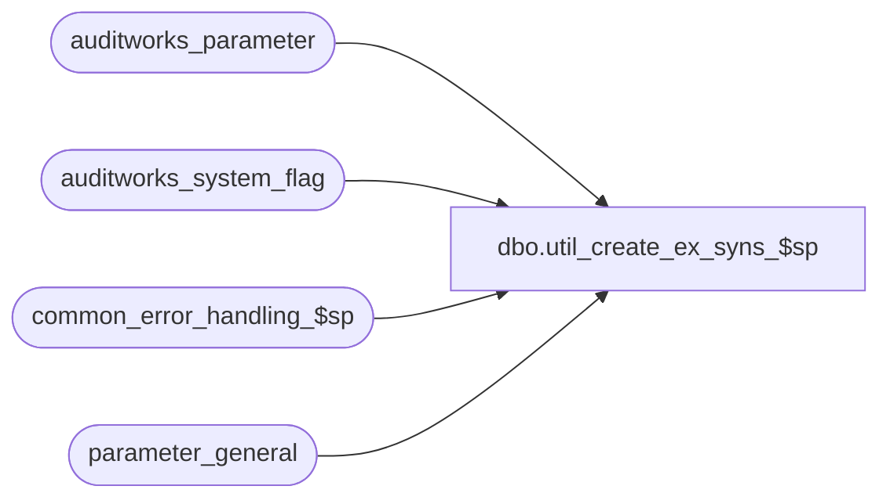

# dbo.util_create_ex_syns_$sp

**Database:** auditworks_external  
**Server:** bedrockdb01  

## Architecture Diagram



## Table Dependencies

| Referenced Table |
|---|
| auditworks_parameter |
| auditworks_system_flag |
| common_error_handling_$sp |
| parameter_general |

## Stored Procedure Code

```sql
create proc dbo.util_create_ex_syns_$sp    @schema_name nvarchar(100), -- db name of external archive db
   @server_name nvarchar(100) = NULL, -- instance name where external db resides (or null if on same instance as SA)
   @user_name   nvarchar(100) = NULL, -- sql login name for db link server (or null if using Windows auth for current login)
   @rmt_pwd     nvarchar(100) = NULL  -- pwd for db link server (or null if using Windows auth for current login)
   
AS

  /*
        Proc Name : util_create_ex_syns_$sp
      Description : Activates parameters for external archive 
           and creates the ex* synonyms that are needed for an external archive configuration
           that points to another SA db where the external copy of the av_* tables and of the subledger table resides.
           Run this proc only in the main SA db (only on consolidated if using scaleout).

      The external db may reside either on the same instance as the SA db or on a separate instance on a separate server.
      
      This utility proc is re-runnable in the event of errors.

      Pre-requisites : 
       1) the external db must exist with CRDM and SA tables already installed there (5.1.004.010 and higher).
       2) user / schemaowner that is running this proc must have permission to create a dblink / linked server
           or the dblink / linked server must already exist.
       3) If using a separate db on same instance as SA, should use a separate logical device for the external db
          so that the device can possibly be mapped to use a less expensive disk subsystem.
          
  After running this install proc in the SA db, replace the table auditworks_parameter in the external archive db with a 
    synonym of the same name that points to table auditworks_parameter in the SA db. The purge proc in the external
    archive db will read parameters from that synonym.

  HISTORY :
Date     Name         Defect#  Description
May20,15 Vicci     TFS-121281  Add synonyms for process error log and process log of external archive schema.
Apr13,15 Phu           116654  create synonym for av_interface_control
Feb13,15 Paul           94760  turn on external archive parameters, use try catch, check existence of synonyms,
                                    support option of using a separate db on same instance as SA
Oct02,14 Ian K          63833  add brackets to server name, handle SQL authentication
Jul01,14 Ian K                 Initial Creation
  */

DECLARE
  @cursor_open       smallint,
  @db_path           nvarchar(100),
  @message_id        int,
  @object_name       nvarchar(255),
  @operation_name    nvarchar(100),
  @process_name      nvarchar(100),
  @errline           int,
  @errno             int,
  @errmsg            nvarchar(2000),
  @errmsg2           nvarchar(2000),
  @external_archive_in_use int,
  @external_archive_flag   int,
  @process_no        int,
  @abort_flag        int,
  @table_name        nvarchar(100),
  @exists            int,
  @sql_cmd           nvarchar(2000);

      
  SELECT @message_id = 201068,
     @process_name = 'util_create_ex_syns_$sp',
     @abort_flag = 0,
     @operation_name = 'SELECT';

BEGIN TRY

/* safety check whether external database is in use */

  SELECT @errmsg = 'Unable to select external_archive_in_use from auditworks_system_flag',
	 @object_name = 'auditworks_system_flag';
SELECT @external_archive_in_use = flag_numeric_value
  FROM auditworks_system_flag
 WHERE flag_name = 'external_archive_in_use';

IF @external_archive_in_use IS NULL
  SELECT @external_archive_in_use = 0;

  SELECT @errmsg = 'Unable to select external_archive_flag';
SELECT @external_archive_flag = flag_numeric_value
  FROM auditworks_system_flag
 WHERE flag_name = 'external_archive_flag';

IF @external_archive_flag = 1
  RETURN; -- safety check : do not run this utility when inside an external archive db

IF @schema_name IS NULL
BEGIN
   SELECT @errmsg = 'Unable to continue. Need a value for external archive db name.';
   GOTO business_error;
  END;


  /* First check existence of the db link / linked server */
  SELECT @exists = 0;
      
  BEGIN TRY

    SELECT @exists = 1
      FROM sys.servers
     WHERE name = @server_name;
         
  END TRY
  BEGIN CATCH;
    SELECT @errmsg = 'Failed to find specified db link server - ' + ERROR_MESSAGE();
    GOTO business_error;
  END CATCH;

  --  syntax to drop a linked server (if needed) : 
  --  EXEC sp_dropserver @server = @server_name, @droplogins = 'droplogins';

  SELECT @db_path = @schema_name + '.dbo.';
  IF @server_name IS NOT NULL
    SELECT @db_path = '[' + @server_name + '].' + @schema_name + '.dbo.';


  /* If a linked server name has been passed in, and if it doesn't already exist, then create it now */

  SELECT @errmsg = 'Unable to create linked server ' + @server_name,
           @object_name = 'sp_addlinkedserver ' + @server_name,
           @operation_name ='EXEC';

  IF @server_name IS NOT NULL AND @exists = 0
  BEGIN
    EXEC sp_addlinkedserver @server = @server_name;

    SELECT @errmsg = 'Unable to set login for linked server ' + @server_name,
           @object_name = 'sp_addlinkedsrvlogin ' + @server_name,
           @operation_name ='EXEC';

    IF @user_name IS NOT NULL
      BEGIN
         SELECT @errmsg = 'Unable to set sql login = ' + COALESCE(@user_name,'null') + ' for linked server ' + @server_name;
       EXEC master.dbo.sp_addlinkedsrvlogin @rmtsrvname=@server_name,@useself=N'False',@locallogin=NULL,@rmtuser=@user_name,@rmtpassword=@rmt_pwd;
      END;
    ELSE
      BEGIN
       EXEC master.dbo.sp_addlinkedsrvlogin @rmtsrvname=@server_name,@useself=N'True',@locallogin=NULL,@rmtuser=NULL,@rmtpassword=NULL;
       EXEC master.dbo.sp_addlinkedsrvlogin @rmtsrvname=@server_name,@useself=N'True',@locallogin=@user_name,@rmtuser=NULL,@rmtpassword=NULL;
     END;

    SELECT @errmsg = 'Unable to set server options for ' + @server_name,
           @object_name = 'sp_serveroption ' + @server_name,
           @operation_name ='EXEC';
  
    EXEC master.dbo.sp_serveroption @server=@server_name, @optname=N'data access', @optvalue=N'true';
    EXEC master.dbo.sp_serveroption @server=@server_name, @optname=N'dist', @optvalue=N'false';
  
  END; -- If @server_name IS NOT NULL


  /* Designate the specified remote db as the external archive db */ 

  SELECT @errmsg = 'Unable to update auditworks_system_flag table in the external archive db',
           @object_name = @db_path + 'auditworks_system_flag',
           @operation_name ='UPDATE',
      @sql_cmd = 'UPDATE ' + @db_path + 'auditworks_system_flag SET flag_numeric_value = 1 WHERE flag_name = ''external_archive_flag''';

  EXEC sp_executesql @sql_cmd;

  
  /* Now get the list of the av_* tables for which ex_* synonyns need to be created */

    SELECT @errmsg = 'Unable to open synonym cursor',
           @object_name = 'c_ex_cursor',
           @operation_name = 'OPEN';
  DECLARE c_ex_cursor CURSOR FAST_FORWARD
    FOR 
     SELECT SUBSTRING(name,3,99) name
       FROM sys.tables
      WHERE name LIKE 'av%'
        AND substring(name, 3, 1) = '_'
     UNION
     SELECT '_' + name name
       FROM sys.tables
      WHERE lower(name) IN ('process_log', 'process_error_log')
      ORDER BY name;

  OPEN c_ex_cursor;
  SELECT @cursor_open = 1;
    
  FETCH c_ex_cursor
   INTO @table_name;
     

    SELECT @errmsg = 'Unable to fetch record from c_ex_cursor',
           @object_name = 'c_ex_cursor',
           @operation_name ='FETCH'                
     
  WHILE @@FETCH_STATUS = 0
  BEGIN

    SELECT @exists = COUNT(1) from sys.synonyms WHERE name = 'ex' + @table_name;
  
    IF @exists > 0
    BEGIN
      SELECT @errmsg = 'Unable to drop synonym ex_subledger',
             @object_name = 'ex' + @table_name,
             @operation_name ='DROP';
      SELECT @sql_cmd = 'DROP SYNONYM ' + @object_name;  

      EXEC sp_executesql @sql_cmd;
    END; -- If @exists > 0
        
    SELECT @errmsg = 'Unable to create synonym ex' + @table_name,
           @object_name = 'ex' + @table_name,
           @operation_name ='CREATE';

    SELECT @sql_cmd = 'CREATE SYNONYM ex' + @table_name + ' FOR ' + @db_path + 'av' + @table_name;
  
    EXEC sp_executesql @sql_cmd;
    
    FETCH c_ex_cursor
     INTO @table_name;
     
  END; -- While
  
  CLOSE c_ex_cursor;
  DEALLOCATE c_ex_cursor;
  SELECT @cursor_open = 0;
  
  /* Create subledger synonyn */

  SELECT @exists = COUNT(1) from sys.synonyms WHERE name = 'ex_subledger';
  
  IF @exists > 0
  BEGIN
    SELECT @errmsg = 'Unable to drop synonym ex_subledger',
           @object_name = 'ex_subledger',
           @operation_name ='DROP';
    SELECT @sql_cmd = 'DROP SYNONYM ex_subledger';

    EXEC sp_executesql @sql_cmd;  
  END;

    SELECT @errmsg = 'Unable to create synonym for ex_subledger',
           @object_name = 'ex_subledger',
           @operation_name ='CREATE';
      
  SELECT @sql_cmd = 'CREATE SYNONYM ex_subledger FOR ' + @db_path + 'subledger';

  EXEC sp_executesql @sql_cmd;
    
  /* Create partition maintenance synonym */

  SELECT @exists = COUNT(1) from sys.synonyms WHERE name = 'ex_partition_maint_$sp';
  
  IF @exists > 0
  BEGIN
    SELECT @errmsg = 'Unable to drop synonym ex_partition_maint_$sp',
           @object_name = 'ex_partition_maint_$sp',
           @operation_name ='DROP';
    SELECT @sql_cmd = 'DROP SYNONYM ex_partition_maint_$sp';

    EXEC sp_executesql @sql_cmd;  
  END;

    SELECT @errmsg = 'Unable to create synonym for partition_maintenance_$sp',
           @object_name = 'partition_maintenance_$sp',
           @operation_name ='CREATE';

  SELECT @sql_cmd = 'CREATE SYNONYM ex_partition_maint_$sp FOR ' + @db_path + 'partition_maint_$sp'

  EXEC sp_executesql @sql_cmd;


  /* flag external archive posting as active in current SA db */
    SELECT @errmsg = 'Unable to activate external_archive',
           @object_name = 'auditworks_system_flag',
           @operation_name ='UPDATE';
 
  UPDATE auditworks_system_flag
    SET flag_numeric_value = 1
  WHERE flag_name = 'external_archive_in_use';


  /* Activate parameters in SA db so that they are visible in tm, and set default values. */

    SELECT @errmsg = 'Unable to activate parameters',
           @object_name = 'auditworks_parameter',
           @operation_name ='UPDATE';

    UPDATE auditworks_parameter
      SET par_value = (SELECT archive_days_retained FROM parameter_general)
     WHERE par_name = 'ext_archive_days_retained'
       AND par_value = '0';

    UPDATE auditworks_parameter
      SET par_value = (SELECT subledger_periods FROM parameter_general)
     WHERE par_name = 'ext_subledger_periods'
       AND par_value = '0';

    UPDATE auditworks_parameter
      SET active_flag = 1
     WHERE (par_name LIKE 'ext_arch%' OR par_name LIKE 'ext_subl%')
       AND active_flag = 0;

  RETURN;

 
business_error:   /* Business Rule handler. */

  SELECT @errmsg2 = @errmsg;

	/* Could include similar cleanup code to system error trap when needed (example is from move_store_$sp).
	   However, could also exclude the cleanup code here since the outer system error catch should fire again after the exec below. */

  EXEC common_error_handling_$sp 36, @errno, @errmsg, 0, @message_id, 
	@process_name, @object_name, @operation_name, 1;
	  /* Note: when the exec above raises an error, that action also fires the system error trap (below) */
	RETURN;
END TRY

BEGIN CATCH; -- trap system errors
    /* common error handling. Appending proc name here because a rollback could occur if called within a transaction. */

  SELECT @errno = ERROR_NUMBER(),
		@errline = ERROR_LINE();

  SELECT @errmsg = CONVERT(nvarchar, @errno) + ':' + @process_name + ':' + CONVERT(nvarchar, @errline) + ':'
               + COALESCE(@errmsg, ' ') + ':' + ERROR_MESSAGE();

	 /* this condition will only be true when raise error in traps above fire this general catch */
  IF @errmsg2 IS NOT NULL
	  SELECT @errmsg = @errmsg2;

IF @cursor_open = 1
  BEGIN
	 CLOSE c_ex_cursor;
	 DEALLOCATE c_ex_cursor;
  END;
  
  EXEC common_error_handling_$sp 36, @errno, @errmsg, 0, @message_id, 
	@process_name, @object_name, @operation_name, 1;

  RETURN;
END CATCH;
```

