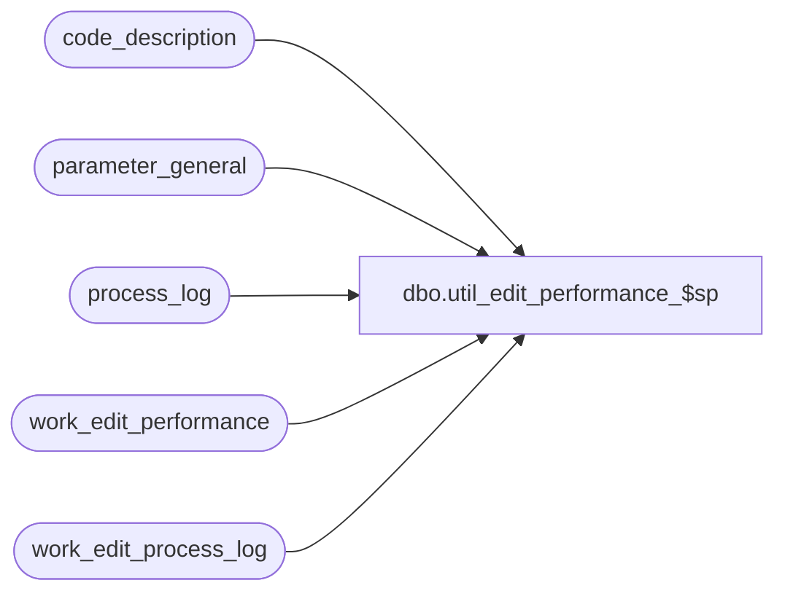

# dbo.util_edit_performance_$sp

**Database:** auditworks_external  
**Server:** bedrockdb01  

## Architecture Diagram



## Table Dependencies

| Referenced Table |
|---|
| code_description |
| parameter_general |
| process_log |
| work_edit_performance |
| work_edit_process_log |

## Stored Procedure Code

```sql
create proc [dbo].[util_edit_performance_$sp] 

     @days  INT = NULL

AS
DECLARE
@effective_date               DATETIME,
@session_id                   INT,
@start_time                   DATETIME,
@end_time                     DATETIME,
@duration                     NUMERIC(12,2),
@process_duration             NUMERIC(12,2),
@process_no                   INT,
@session_start                DATETIME,
@session_end                  DATETIME,
@session_store_count          INT,
@session_tran_count           INT,
@session_duration             NUMERIC(12,2),
@stream_start                 DATETIME,
@stream_end                   DATETIME,
@stream_store_count           INT,
@stream_tran_count            INT,
@stream_duration              NUMERIC(12,2),
@concurrent_edit_processes    INT,
@stream_no                    INT,
@other_process_no             INT,
@other_process_count          INT,
@other_process_desc           nvarchar(60),
@process_desc                 nvarchar(60),
@session_per_hour             NUMERIC(12,2),
@stream_per_hour              NUMERIC(12,2),
@overall                      NUMERIC(12,2),
@overall_stream1              NUMERIC(12,2),
@overall_stream2              NUMERIC(12,2),
@transaction_count            INT,
@blanks                       nvarchar(60),
@other_process_duration       INT


/************************************************************************************
   Name: util_edit_performance_$sp
   Author: Shapoor (Ported to Sybase by David C.)
   Description: To Monitor Edit Performance.
   Arguments: @days - number of days from current date to monitor performance.
                
**************************************************************************************

Jan20,03 Paul           5594 prevent division by zero
Dec06,02 Winnie      1-H4466 Move declaration of cursor for MSSQL
*/

DECLARE calc_sessions CURSOR 
FOR
SELECT start_time,
       process_no
  FROM work_edit_process_log
 ORDER BY start_time       

DECLARE performance_output CURSOR 
FOR
SELECT distinct session_id
  FROM work_edit_process_log
 ORDER BY session_id

BEGIN  -- MAIN

set nocount on -- suppress display message (* rows affected)

SELECT @blanks = '                                                            '

TRUNCATE TABLE work_edit_process_log
TRUNCATE TABLE work_edit_performance

SELECT @concurrent_edit_processes = concurrent_edit_processes
  FROM parameter_general

SELECT @effective_date = dateadd(day,-@days,getdate())
  
INSERT work_edit_process_log (
	stream_no,
	process_no,
	start_time,
	end_time,
	duration,
	transaction_count,
	session_id,
	status )
SELECT  batch_process_id,
        process_no,
        process_start_time,
        process_end_time,
        datediff(second, process_start_time, process_end_time),
        transaction_count,
        0,
        process_status_flag
  FROM process_log
 WHERE process_start_time >= @effective_date
   AND process_no IN (1,2,5)

DELETE work_edit_process_log
 WHERE process_no = 5 
   AND stream_no = 2
   
SELECT @session_id = 0
       
OPEN calc_sessions
  
WHILE 1=1
BEGIN
  FETCH calc_sessions 
   INTO @start_time, @process_no

  IF @@fetch_status != 0 BREAK
   
  UPDATE work_edit_process_log
     SET session_id = @session_id
   WHERE start_time = @start_time
     AND process_no = @process_no

  IF @process_no = 5
    SELECT @session_id = @session_id + 1
         
END --While 1=1

CLOSE calc_sessions
DEALLOCATE calc_sessions

DELETE work_edit_process_log
 WHERE session_id = 0

-------------------------------------------------------------------------------------------
OPEN performance_output
  
WHILE 2=2
BEGIN
  FETCH performance_output 
   INTO @session_id

  IF @@fetch_status != 0 BREAK
    
  SELECT @session_start = MIN(start_time),
         @session_end = MAX(end_time)
    FROM work_edit_process_log
   WHERE session_id = @session_id

  -- time for each session in seconds.
  SELECT @session_duration = datediff(second,@session_start,@session_end)
  IF @session_duration = 0
    SELECT @session_duration = 1
      
  SELECT @session_tran_count = SUM(transaction_count)
    FROM work_edit_process_log
   WHERE process_no = 1
     AND session_id = @session_id

  SELECT @session_per_hour = convert(decimal(8,2),(@session_tran_count/(@session_duration)) * 60 * 60)
      
  INSERT work_edit_performance VALUES 
      (@session_id,
      0, --stream_no
      @session_start,
      @session_end,
      ISNULL(@session_duration,0),
      ISNULL(@session_tran_count,0),
      ISNULL(@session_store_count,0),
      ISNULL(@session_per_hour,0) )
      
  SELECT 'Session ID : ' + convert(nvarchar,@session_id)
  SELECT 'Start Time : ' + convert(nvarchar,@session_start, 9) + 
         '  End Time : ' + convert(nvarchar,@session_end, 9)
  SELECT 'Transactions Processed : ' + convert(nvarchar,@session_tran_count) + 
         '  Transactions/hour : ' + convert(nchar(10), @session_per_hour) 

  -- Other processes
  DECLARE other_processes CURSOR 
      FOR
   SELECT process_no, COUNT(*), SUM(datediff(second, process_start_time, process_end_time))
     FROM process_log
    WHERE process_start_time BETWEEN @session_start AND @session_end
      AND process_no NOT IN (1,2,5)
    GROUP BY process_no

  OPEN other_processes

  WHILE 4=4
  BEGIN
    FETCH other_processes 
     INTO @other_process_no,
          @other_process_count,
          @other_process_duration

    IF @@fetch_status != 0 BREAK

    SELECT @other_process_desc = code_display_descr
      FROM code_description
     WHERE code_type = 31
       AND code = @other_process_no

  END -- WHILE 4=4

  CLOSE other_processes 
  DEALLOCATE other_processes

  IF @concurrent_edit_processes >= 1
  BEGIN

    SELECT 'Multi Stream Statistics :' 

    DECLARE multistream CURSOR 
        FOR
     SELECT distinct stream_no
       FROM work_edit_process_log
      WHERE stream_no >= 1
        AND session_id = @session_id
    ORDER BY stream_no

    OPEN multistream

    WHILE 3=3 
    BEGIN
      FETCH multistream 
       INTO @stream_no

      IF @@fetch_status != 0 BREAK

      SELECT 'Stream Number : ' + convert(nvarchar,@stream_no)

      SELECT @stream_start = MIN(start_time),
             @stream_end = MAX(end_time)
        FROM work_edit_process_log
       WHERE session_id = @session_id
         AND stream_no = @stream_no

      SELECT @stream_duration = SUM(duration)
        FROM work_edit_process_log
       WHERE session_id = @session_id
         AND stream_no = @stream_no
         AND process_no IN (1,2)

      SELECT @stream_tran_count = SUM(transaction_count)
        FROM work_edit_process_log
       WHERE process_no = 1
         AND session_id = @session_id
         AND stream_no = @stream_no

      IF @stream_duration = 0
        SELECT @stream_duration = 1
      SELECT @stream_per_hour = convert(decimal(8,2),(@stream_tran_count/@stream_duration) * 60 * 60)
    
      INSERT work_edit_performance VALUES 
		(@session_id,
		@stream_no, --stream_no
		@stream_start,
		@stream_end,
		ISNULL(@stream_duration,0),
		ISNULL(@stream_tran_count,0),
		ISNULL(@stream_store_count,0),
		ISNULL(@stream_per_hour,0) )

      SELECT 'Start Time : ' + convert(nvarchar,@stream_start, 9) +
             '  End Time : ' + convert(nvarchar,@stream_end, 9)
      SELECT 'Transactions Processed : ' + convert(nvarchar,@stream_tran_count) +
             '   Transactions/hour : ' + convert(nchar(10), @stream_per_hour)

      DECLARE stream_processes CURSOR 
          FOR
       SELECT process_no,
              duration
         FROM work_edit_process_log
        WHERE session_id = @session_id
          AND stream_no = @stream_no
      ORDER BY start_time

      OPEN stream_processes

      WHILE 7=7 
      BEGIN
        FETCH stream_processes 
         INTO @process_no,
              @process_duration

        IF @@fetch_status != 0 BREAK

        SELECT @process_desc = code_display_descr
          FROM code_description
         WHERE code_type = 31
           AND code = @process_no

      END -- WHILE 7=7

      CLOSE stream_processes
      DEALLOCATE stream_processes 
          
    END -- WHILE 3=3 

    CLOSE multistream 
    DEALLOCATE multistream 

  END -- IF multi-stream

  SELECT '*******************************************************************************'

END -- WHILE 2=2

CLOSE performance_output
DEALLOCATE performance_output
-------------------------------------------------------------------------------------------
--Overall Results....
select @duration = sum(duration)
  FROM work_edit_performance
 WHERE stream_no = 0

SELECT @overall = convert(decimal(12,2),(SUM(transaction_count)/(@duration + 0.0000001)*60*60))
  FROM work_edit_performance
 WHERE stream_no = 0

SELECT 'Summary Results : '
SELECT 'Overall Edit (transactions/hour) : ' + convert(nchar(7),@overall)

select @stream_no = 1

while @stream_no <= @concurrent_edit_processes
BEGIN
  select @duration = sum(duration)
    FROM work_edit_performance
   WHERE stream_no = @stream_no

  SELECT @overall_stream1 = convert(decimal(12,2),(SUM(transaction_count)/(@duration + 0.0000001)*60*60))
    FROM work_edit_performance
   WHERE stream_no = @stream_no

  SELECT 'STREAM ' + convert(nvarchar,@stream_no) + ' (transactions/hour) : ' + convert(nchar(7),@overall_stream1)
  
  select @stream_no = @stream_no + 1
END -- while display all streams


END
```

