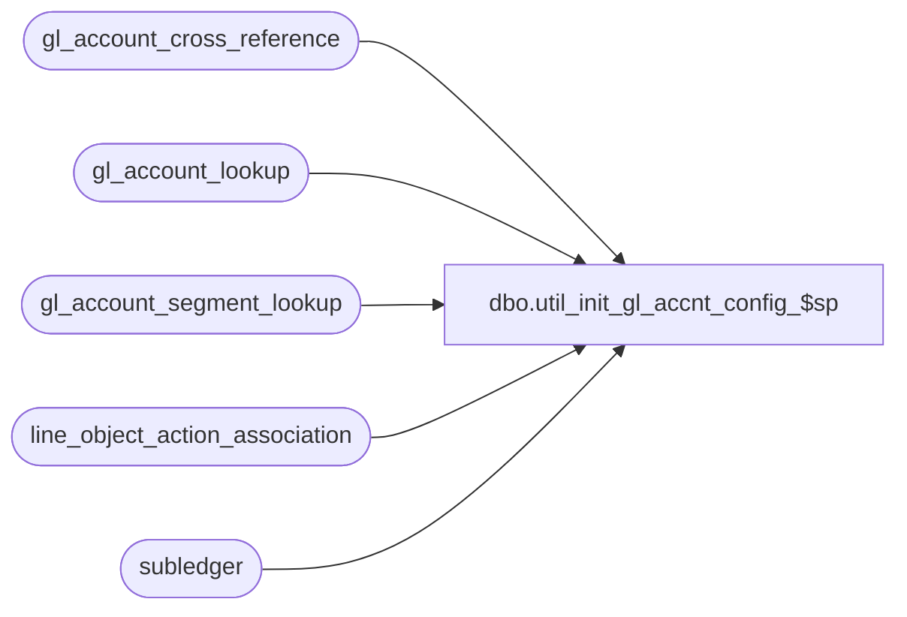

# dbo.util_init_gl_accnt_config_$sp

**Database:** auditworks_external  
**Server:** bedrockdb01  

## Architecture Diagram



## Table Dependencies

| Referenced Table |
|---|
| gl_account_cross_reference |
| gl_account_lookup |
| gl_account_segment_lookup |
| line_object_action_association |
| subledger |

## Stored Procedure Code

```sql
create proc [dbo].[util_init_gl_accnt_config_$sp] AS

/*
Description:  This procedure is intended for use to clean up the sample G/L account configuration which is
              installed with the SaaS/Xpress S/A base.
HISTORY:
Oct13,09   Vicci        Author.
*/

PRINT 'Master table data related to G/L accounts is being initialized' 
UPDATE line_object_action_association
   SET gl_account_segment1 = null, gl_account_segment2 = null, gl_account_segment3 = null,
       gl_account_segment4 = null, gl_account_segment5 = null, gl_account_segment6 = null, 
       gl_account_segment7 = null, gl_account_segment8 = null,
       lookup_segment1 = 0, lookup_segment2 = 0, lookup_segment3 = 0, lookup_segment4 = 0,
       lookup_segment5 = 0, lookup_segment6 = 0, lookup_segment7 = 0, lookup_segment8 = 0

TRUNCATE TABLE gl_account_lookup
TRUNCATE TABLE gl_account_segment_lookup
IF NOT EXISTS (SELECT 1 FROM subledger)
BEGIN
  TRUNCATE TABLE gl_account_cross_reference
END
ELSE
BEGIN
  DELETE gl_account_cross_reference
   WHERE gl_account_id NOT IN (SELECT gl_account_id FROM subledger)
END
RETURN
```

