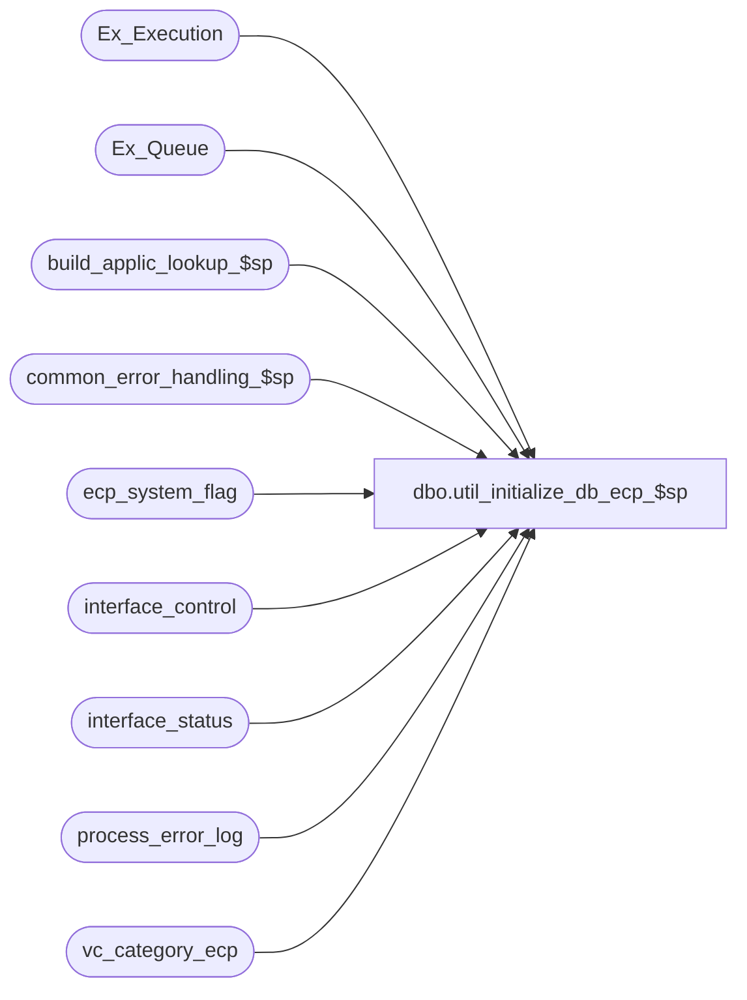

# dbo.util_initialize_db_ecp_$sp

**Database:** auditworks_external  
**Server:** bedrockdb01  

## Architecture Diagram



## Table Dependencies

| Referenced Table |
|---|
| Ex_Execution |
| Ex_Queue |
| build_applic_lookup_$sp |
| common_error_handling_$sp |
| ecp_system_flag |
| interface_control |
| interface_status |
| process_error_log |
| vc_category_ecp |

## Stored Procedure Code

```sql
create proc [dbo].[util_initialize_db_ecp_$sp] AS

/* Proc Name: util_initialize_db_ecp_$sp
   DESC: truncate work and data tables
   

HISTORY
Date     Name         Defect# Desc
Jul04,07 Vicci        	      Author
*/


DECLARE
@errmsg				VARCHAR(225),
@errno				INT,
@rows				INT,
@tb_name		        varchar(40),
@process_no			int,
@process_id			int,
@process_name		        varchar(100),
@message_id		        int,	
@object_name			varchar(255),
@operation_name			varchar(255),
@sql_command 			nvarchar(2000),
@cursor_open			tinyint

SELECT @process_name = 'util_initialize_db_ecp_$sp',
       @process_no = 36,
       @message_id = 201068,
       @process_id = @@spid,
       @object_name = 'unknown',
       @operation_name = 'unknown',
       @cursor_open = 0

  UPDATE interface_status
     SET immediate_posting_requested = 0,  posting_in_progress = 0, 
         retrieval_in_progress = 0, 
         last_retrieval_datetime = '01/01/1970', last_posting_datetime = '01/01/1970'
   WHERE interface_id = 44

  DELETE Ex_Queue
   WHERE queue_id = 44
   
  DELETE Ex_Execution
   WHERE queue_id = 44

  DELETE interface_control
   WHERE interface_id = 44

  IF EXISTS (select 1
	     from sysobjects t
	    where t.type = 'U' and t.name = 'ecp_system_flag')
  BEGIN
    UPDATE ecp_system_flag
       SET flag_datetime_value = flag_datetime_initialize_value,
           flag_numeric_value = flag_numeric_initialize_value,
           flag_alpha_value = flag_alpha_initialize_value
  END
  
DELETE from process_error_log
 WHERE process_no  = 282
    OR process_name like '%ecp_%'
    OR error_msg like '%ecp_%'
    OR error_msg like '%Skip interface id 44%'

DECLARE processing_cursor CURSOR
    FOR
 SELECT tb_name 
   FROM vc_category_ecp v, sysobjects t
  WHERE (v.tb_type = 'Data' OR v.tb_type = 'Work')
    AND UPPER(v.tb_name) = UPPER(t.name)
    AND t.type = 'U'
 ORDER BY v.tb_name

OPEN processing_cursor
 SELECT @cursor_open = 1
 
 FETCH processing_cursor
  INTO @tb_name

 WHILE @@fetch_status = 0 
 BEGIN
    SELECT @sql_command = 'truncate table ' + @tb_name
    EXEC sp_executesql @sql_command
	
  FETCH processing_cursor
  INTO @tb_name
 END /* while not end of cursor */

CLOSE processing_cursor
DEALLOCATE processing_cursor 
SELECT @cursor_open = 0

EXEC build_applic_lookup_$sp @errmsg output, 1

RETURN

error:
        IF @cursor_open = 1
        BEGIN
	  CLOSE processing_cursor
	  DEALLOCATE processing_cursor 
	END        

	EXEC common_error_handling_$sp @process_no, @errno, @errmsg, 0, @message_id, 
	@process_name, @object_name, @operation_name, 1
	RETURN
```

