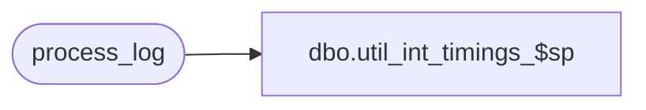

# dbo.util_int_timings_$sp

**Database:** auditworks_external  
**Server:** bedrockdb01  

## Architecture Diagram



## Table Dependencies

| Referenced Table |
|---|
| process_log |

## Stored Procedure Code

```sql
create proc [dbo].[util_int_timings_$sp] @start_date smalldatetime = '01/01/96'
AS
/* Version:1.00 Date:1997/06/10 */
/* Desc: Display timings for interface exports. */

SELECT  process_no,
	process_start_time, transaction_count,
	seconds= DATEDIFF(ss, process_start_time, process_end_time),
	'tran/second'=
	transaction_count / (DATEDIFF(ss, process_start_time, process_end_time)+.0001)
  FROM process_log
  WHERE process_no >= 201
  AND process_no <= 299
  AND process_start_time >= @start_date

RETURN
```

