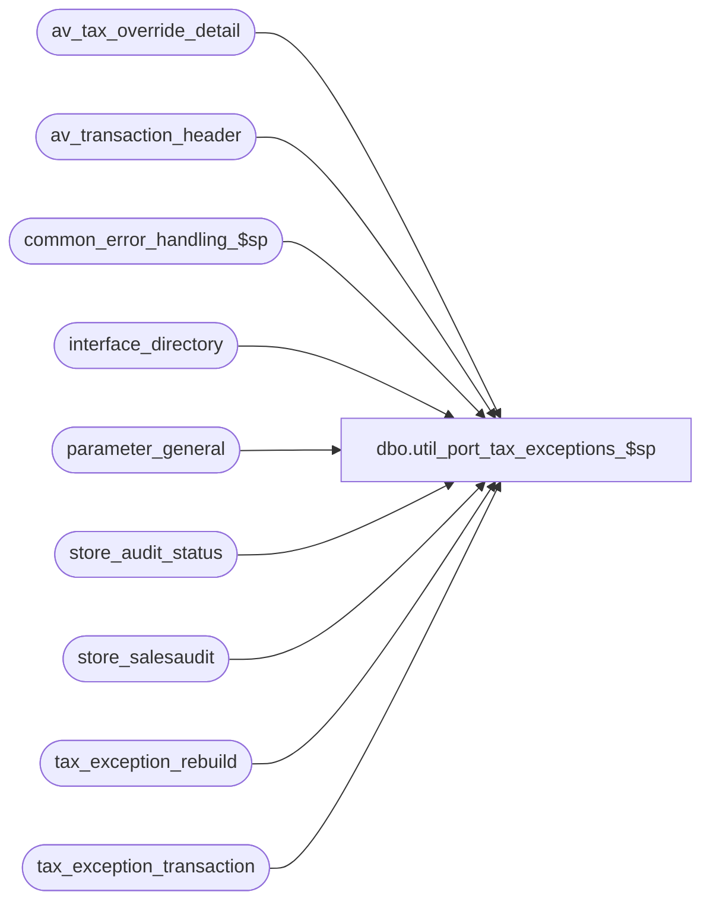

# dbo.util_port_tax_exceptions_$sp

**Database:** auditworks_external  
**Server:** bedrockdb01  

## Architecture Diagram



## Table Dependencies

| Referenced Table |
|---|
| av_tax_override_detail |
| av_transaction_header |
| common_error_handling_$sp |
| interface_directory |
| parameter_general |
| store_audit_status |
| store_salesaudit |
| tax_exception_rebuild |
| tax_exception_transaction |

## Stored Procedure Code

```sql
create proc dbo.util_port_tax_exceptions_$sp 

  AS
DECLARE
	@applicability_method		tinyint,
	@cursor_open			tinyint,
	@transaction_date			smalldatetime,
	@current_day		        smalldatetime,
	@history_days		        smalldatetime,
	@errno				int,
	@errmsg			        nvarchar(1024),
	@message_id			int,
	@object_name			nvarchar(255),
	@operation_name			nvarchar(100),
	@process_name			nvarchar(100),
	@process_id                     binary(16),
	@update_timing 			smallint,
	@tax_days                       smallint,
	@user_id                        int


/* 
PROC NAME: util_port_tax_exceptions_$sp  5.0/5.1
     DESC: To populate tax_exception_transaction table with pre-2.5 history. 
	   This proc can be killed and restarted at any time.

HISTORY:
Date     Name      Def#  Desc
Aug15,13 Paul    145958  call common_error_handling_$sp, use try .. catch
Oct25,06 Phu      77931  Fix outer join for SQL 2005 Mode 90.
Sep21,01 Maryam    8774  Author

*/


SELECT @process_name = 'util_port_tax_exceptions_$sp',
	@message_id = 201068,
	@process_id = @@spid, -- only used for logging errors in sub procs
	@user_id = null;

BEGIN TRY

   SELECT @errmsg = 'Failed to get update_timing',
	@operation_name = 'SELECT',
	@object_name = 'interface_directory';
SELECT @update_timing = update_timing
  FROM interface_directory
 WHERE interface_id = 12;

IF @update_timing = 0
  RETURN;

   SELECT @errmsg = 'Failed to get tax_days',
	@operation_name = 'SELECT',
	@object_name = 'parameter_general'; 
SELECT @tax_days = tax_days
  FROM parameter_general;


SELECT @current_day = CONVERT(smalldatetime, CONVERT(nchar(8),getdate(),112));
SELECT @tax_days = -1 * @tax_days;
SELECT @history_days = DATEADD(DD, @tax_days, @current_day);

   SELECT @object_name = 'tax_exception_rebuild';

IF NOT EXISTS (SELECT 1
                 FROM tax_exception_rebuild)
  BEGIN
       SELECT @errmsg = 'Unable to insert tax_exception_rebuild',
              @operation_name = 'INSERT';
    INSERT tax_exception_rebuild(
           transaction_date,
           completed_flag)
    SELECT DISTINCT
           sales_date,
           0                      
      FROM store_audit_status
     WHERE date_reject_id = 0
       AND store_audit_status IN (400,500)
       AND sales_date > @history_days;

  END; -- IF NOT EXISTS ...

SELECT @errmsg = 'Failed to open tax_exceptions_crsr',
	@operation_name = 'OPEN',
	@object_name = 'tax_exceptions_crsr';
      
DECLARE tax_exceptions_crsr CURSOR FAST_FORWARD
FOR
SELECT transaction_date
  FROM tax_exception_rebuild
 WHERE completed_flag = 0;
       
OPEN tax_exceptions_crsr
SELECT @cursor_open = 1,
	@operation_name = 'FETCH'; 

WHILE 1=1
BEGIN
  FETCH tax_exceptions_crsr
   INTO @transaction_date;

  IF @@fetch_status != 0
    BREAK;
   
  SELECT @errmsg = 'Failed to insert tax_exception_transaction',
	@operation_name = 'INSERT',
	@object_name = 'tax_exception_transaction';
  BEGIN TRAN;

  INSERT INTO tax_exception_transaction(
         av_transaction_id,
         transaction_date,
         store_no,
         tax_level,
         tax_category,
         tax_jurisdiction,
         tax_rate_code,
         combined_tax_rate,
         tax_on_tax_level,
         tax_on_combined_rate,
         tax_amount_collected,
         tax_amount_expected,
         history_flag)
  SELECT DISTINCT th.av_transaction_id,
         th.transaction_date,
         th.store_no,
         ISNULL(tod.tax_level, 0),
         ISNULL(tod.tax_category, 0),
         ISNULL(tod.exception_tax_jurisdiction, ss.tax_jurisdiction),
         0,
         0.00,
         0,
         0.00,
         0.00,
         0.00,
         1
    FROM av_transaction_header th
         INNER JOIN store_salesaudit ss ON (th.store_no = ss.store_no)
         LEFT JOIN av_tax_override_detail tod ON (th.av_transaction_id = tod.av_transaction_id)
   WHERE tax_override_flag = 1
     AND date_reject_id = 0
     AND th.transaction_date = @transaction_date
     AND th.av_transaction_id NOT IN (SELECT av_transaction_id
                                        FROM tax_exception_transaction);

    SELECT @errmsg = 'Failed to update tax_exception_rebuild',
	@operation_name = 'UPDATE',
	@object_name = 'tax_exception_rebuild';                                    
  UPDATE tax_exception_rebuild
     SET completed_flag = 1
   WHERE transaction_date = @transaction_date;
  
  COMMIT TRAN;

END; --While 1=1

SELECT @errmsg = 'Failed to close tax_exceptions_crsr',
	@operation_name = 'CLOSE',
	@object_name = 'tax_exceptions_crsr';
CLOSE tax_exceptions_crsr;
DEALLOCATE tax_exceptions_crsr;
SELECT @cursor_open = 0;

RETURN;

END TRY

BEGIN CATCH;

     /* Common error handler. */

	SELECT @errno = ERROR_NUMBER(),
		@errmsg = COALESCE(@errmsg, ' ') + ERROR_MESSAGE();

	IF @cursor_open <> 0
	BEGIN
	  CLOSE tax_exceptions_crsr;
	  DEALLOCATE tax_exceptions_crsr;
	END

	EXEC common_error_handling_$sp 0, @errno, @errmsg, 0, @message_id, 
	  @process_name, @object_name, @operation_name, 0, 1, 0, null, 0, null, null, 
	  null, null, null, null, 0, null, 0;

	RETURN;
END CATCH;
```

