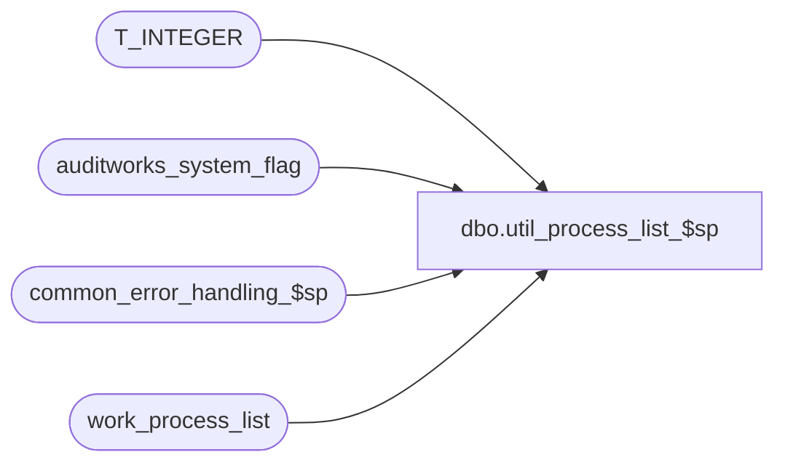

# dbo.util_process_list_$sp

**Database:** auditworks_external  
**Server:** bedrockdb01  

## Architecture Diagram



## Table Dependencies

| Referenced Table |
|---|
| T_INTEGER |
| auditworks_system_flag |
| common_error_handling_$sp |
| work_process_list |

## Stored Procedure Code

```sql
create proc [dbo].[util_process_list_$sp] 
@process_id		binary(16),
@user_id		int
     
AS

/* Proc Name: util_process_list_$sp
   Desc: To populate work table with the currently active system processes which includes spid, status, loginame, 
   hostname, blk, cmd and dbname. Called by frontend.

HISTORY
Date     Name		Def# Desc
Jan16,06 Paul        DV-1329 populate instance_id column
Sep23,04 Paul        DV-1146 receive user_id
Apr20,04 Maryam      DV-1071 Modified to receive @user_name and @process_id as input parameters
                             and pass it to the common_error_handling_$sp.
Nov14,01 Winnie		8846 Author
*/
DECLARE
	@errmsg				nvarchar(255),
	@errno				int,
	@instance_id			T_INTEGER,
	@message_id			int,
	@object_name			nvarchar(255),
	@operation_name			nvarchar(100),
	@process_name			nvarchar(100)

SELECT @process_name = 'util_process_list_$sp',
       @message_id = 201068

DELETE FROM work_process_list
 WHERE process_id = @process_id

SELECT @errno = @@error
IF @errno != 0
  BEGIN
    SELECT @errmsg = 'Failed to delete from work_process_list',
           @object_name = 'work_process_list',
           @operation_name = 'DELETE'
    GOTO error
  END  

SELECT @instance_id = CONVERT(int,flag_numeric_value)
  FROM auditworks_system_flag
 WHERE flag_name = 'instance_id'


INSERT work_process_list
       (process_id,
        spid,
        status,
        loginame,
        hostname,
        blk,
        cmd,
        dbname,
        instance_id)
 SELECT @process_id,
 	spid,
        SUBSTRING(status,1,12),
        SUBSTRING(loginame,1,30),
        SUBSTRING(hostname,1,10),
	blocked, 
	SUBSTRING(cmd,1,16),
	SUBSTRING(db_name(dbid),1,16),
	@instance_id
   FROM master..sysprocesses
  WHERE db_name(dbid) = db_name(db_id())

SELECT @errno = @@error
IF @errno != 0
  BEGIN
    SELECT @errmsg = 'Failed to insert into work_process_list',
           @object_name = 'work_process_list',
           @operation_name = 'INSERT'
    GOTO error
  END  

RETURN

error:
                    
	EXEC common_error_handling_$sp 0, @errno, @errmsg, 0, @message_id, 
	@process_name, @object_name, @operation_name, 0, 1, 0, null, 0, null, null, null,
	  null, null, null, 0, @process_id, @user_id
	RETURN
```

