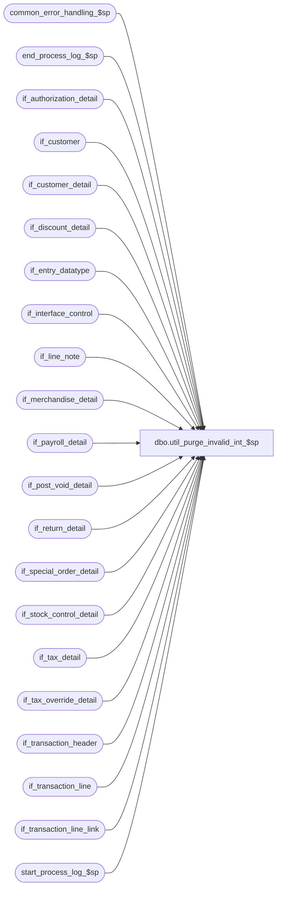

# dbo.util_purge_invalid_int_$sp

**Database:** auditworks_external  
**Server:** bedrockdb01  

## Architecture Diagram



## Table Dependencies

| Referenced Table |
|---|
| common_error_handling_$sp |
| end_process_log_$sp |
| if_authorization_detail |
| if_customer |
| if_customer_detail |
| if_discount_detail |
| if_entry_datatype |
| if_interface_control |
| if_line_note |
| if_merchandise_detail |
| if_payroll_detail |
| if_post_void_detail |
| if_return_detail |
| if_special_order_detail |
| if_stock_control_detail |
| if_tax_detail |
| if_tax_override_detail |
| if_transaction_header |
| if_transaction_line |
| if_transaction_line_link |
| start_process_log_$sp |

## Stored Procedure Code

```sql
create proc [dbo].[util_purge_invalid_int_$sp] 

AS

/*
NAME	   	util_purge_invalid_int_$sp
DESCRIPTION	Delete invalid (dead) transactions in the interface tables
HISTORY
Date  	  Name	   Defect#  Description
Jul05,05  Paul     DV-1239  Use if_entry_datatype
Mar17,05  Maryam   DV-1202  Delete if_transaction_line_link
Apr25,02  Phu      1-C9P5S  Remove entry in if_tax_detail
Apr19,02  Winnie   1-CD0IX  R3 error handling  
May25,00  John G   5864	    Change '= NULL' to 'IS NULL' where applicable to mirror Oracle.
*/

DECLARE @errmsg			nvarchar(255),
	@errno			int,
	@max_if_entry_no	if_entry_datatype,
	@min_if_entry_no	if_entry_datatype,
	@process_log_entry	tinyint,
	@process_no 		smallint,
	@process_timestamp 	float,
	@rows 			int,
	@transaction_count 	numeric(12,0),
	@message_id		int,	
        @object_name		nvarchar(255),
        @operation_name		nvarchar(100),
        @process_name		nvarchar(100)
 

SELECT @process_no = 41,
	@transaction_count = 0,
	@max_if_entry_no = 0,
	@process_name = 'util_purge_invalid_int_$sp',
       @message_id = 201068

EXEC start_process_log_$sp @process_no, @process_timestamp OUTPUT, @errmsg OUTPUT

SELECT @errno = @@error
IF @errno <> 0
  BEGIN
    IF @errmsg IS NULL 
      SELECT @errmsg = 'Unable to execute start_process_log_$sp'
    SELECT @object_name = 'start_process_log_$sp',
           @operation_name = 'EXECUTE'    	
    GOTO error
  END

SELECT @process_log_entry = 1

SELECT DISTINCT if_entry_no
INTO #if_dead_tran
FROM if_transaction_header

SELECT @errno = @@error,
	@rows = @@rowcount
IF @errno != 0
  BEGIN
     SELECT @errmsg = 'Failed to select into #if_dead_tran dt',
            @object_name = '#if_dead_tran',
            @operation_name = 'CREATE'    	
     GOTO error
  END

IF @rows = 0
	RETURN

SELECT DISTINCT if_entry_no
INTO #if_int_ctl
FROM if_interface_control

SELECT @errno = @@error,
	@rows = @@rowcount
IF @errno != 0
  BEGIN
     SELECT @errmsg = 'Failed to select into #if_int_ctl',
            @object_name = '#if_int_ctl',
            @operation_name = 'CREATE'    	
     GOTO error
  END

IF @rows <> 0
BEGIN

  DELETE #if_dead_tran
  FROM #if_dead_tran dt, #if_int_ctl ic
  WHERE dt.if_entry_no = ic.if_entry_no

  SELECT @errno = @@error
  IF @errno != 0
  BEGIN
     SELECT @errmsg = 'Unable to delete #if_dead_tran',
            @object_name = '#if_dead_tran',
            @operation_name = 'DELETE'    	
     GOTO error
  END
END

IF EXISTS (SELECT if_entry_no
	   FROM #if_dead_tran )
  BEGIN

	DELETE if_authorization_detail
	FROM  #if_dead_tran dt, if_authorization_detail a
	WHERE dt.if_entry_no = a.if_entry_no

	SELECT @errno = @@error
	IF @errno <> 0
	  BEGIN
		SELECT @errmsg = 'Unable to delete if_authorization_detail',
                       @object_name = 'if_authorization_detail',
                       @operation_name = 'DELETE'    	
		GOTO error
	  END

	DELETE if_customer
	FROM #if_dead_tran dt, if_customer c
	WHERE dt.if_entry_no = c.if_entry_no

	SELECT @errno = @@error
	IF @errno <> 0
	  BEGIN
		SELECT @errmsg = 'Unable to delete if_customer',
                       @object_name = 'if_customer',
                       @operation_name = 'DELETE'    	
		GOTO error
	  END

	DELETE if_customer_detail
	FROM #if_dead_tran dt, if_customer_detail cd
	WHERE dt.if_entry_no = cd.if_entry_no

	SELECT @errno = @@error
	IF @errno <> 0
	  BEGIN
		SELECT @errmsg = 'Unable to delete if_customer_detail',
                       @object_name = 'if_customer_detail',
                       @operation_name = 'DELETE'    	
		GOTO error
	  END

	DELETE if_discount_detail
	FROM #if_dead_tran dt, if_discount_detail dd
	WHERE dt.if_entry_no = dd.if_entry_no

	SELECT @errno = @@error
	IF @errno <> 0
	  BEGIN
		SELECT @errmsg = 'Unable to delete if_discount_detail',
                       @object_name = 'if_discount_detail',
   @operation_name = 'DELETE'    	
		GOTO error
	  END

	DELETE if_line_note
	FROM #if_dead_tran dt, if_line_note ln 
	WHERE dt.if_entry_no = ln.if_entry_no

	SELECT @errno = @@error
	IF @errno <> 0
	  BEGIN
		SELECT @errmsg = 'Unable to delete if_line_note',
                       @object_name = 'if_line_note',
                       @operation_name = 'DELETE'    	
		GOTO error
	  END

	DELETE if_merchandise_detail
	FROM #if_dead_tran dt, if_merchandise_detail md
	WHERE dt.if_entry_no = md.if_entry_no

	SELECT @errno = @@error
	IF @errno <> 0
	  BEGIN
		SELECT @errmsg = 'Unable to delete if_merchandise_detail',
                       @object_name = 'if_merchandise_detail',
                       @operation_name = 'DELETE'    	
		GOTO error
	  END

	DELETE if_payroll_detail
	FROM #if_dead_tran dt, if_payroll_detail pd
	WHERE dt.if_entry_no = pd.if_entry_no

	SELECT @errno = @@error
	IF @errno <> 0
	  BEGIN
		SELECT @errmsg = 'Unable to delete if_payroll_detail',
                       @object_name = 'if_payroll_detail',
                       @operation_name = 'DELETE'    	
		GOTO error
	  END

	DELETE if_post_void_detail
	FROM #if_dead_tran dt, if_post_void_detail pv
	WHERE dt.if_entry_no = pv.if_entry_no 

	SELECT @errno = @@error
	IF @errno <> 0
	  BEGIN
		SELECT @errmsg = 'Unable to delete if_post_void_detail',
                       @object_name = 'if_post_void_detail',
                       @operation_name = 'DELETE'    	
		GOTO error
	  END

	DELETE if_return_detail
	FROM #if_dead_tran dt, if_return_detail rd
	WHERE dt.if_entry_no = rd.if_entry_no

	SELECT @errno = @@error
	IF @errno <> 0
	  BEGIN
		SELECT @errmsg = 'Unable to delete if_return_detail',
                       @object_name = 'if_return_detail',
                       @operation_name = 'DELETE'    	
		GOTO error
	  END

	DELETE if_special_order_detail
	FROM #if_dead_tran dt, if_special_order_detail so 
	WHERE dt.if_entry_no = so.if_entry_no

	SELECT @errno = @@error
	IF @errno <> 0
	  BEGIN
		SELECT @errmsg = 'Unable to delete if_special_order_detail',
                       @object_name = 'if_special_order_detail',
                       @operation_name = 'DELETE'    	
		GOTO error
	  END

	DELETE if_stock_control_detail
	FROM #if_dead_tran dt, if_stock_control_detail sc 
	WHERE dt.if_entry_no = sc.if_entry_no

	SELECT @errno = @@error
	IF @errno <> 0
	  BEGIN
		SELECT @errmsg = 'Unable to delete if_stock_control_detail',
                       @object_name = 'if_stock_control_detail',
                       @operation_name = 'DELETE'    	
		GOTO error
	  END

	DELETE if_tax_override_detail
	FROM #if_dead_tran dt, if_tax_override_detail t 
	WHERE dt.if_entry_no = t.if_entry_no

	SELECT @errno = @@error
	IF @errno <> 0
	  BEGIN
		SELECT @errmsg = 'Unable to delete if_tax_override_detail',
                       @object_name = 'if_tax_override_detail',
                       @operation_name = 'DELETE'    	
		GOTO error
	  END

	DELETE if_tax_detail
	FROM #if_dead_tran dt, if_tax_detail t 
	WHERE dt.if_entry_no = t.if_entry_no

	SELECT @errno = @@error
	IF @errno <> 0
	  BEGIN
		SELECT @errmsg = 'Unable to delete if_tax_detail',
                       @object_name = 'if_tax_detail',
                       @operation_name = 'DELETE'    	
		GOTO error
	  END

	DELETE if_transaction_line_link
	FROM #if_dead_tran dt, if_transaction_line_link k
	WHERE dt.if_entry_no = k.if_entry_no

	SELECT @errno = @@error
	IF @errno <> 0
	  BEGIN
		SELECT @errmsg = 'Unable to delete if_transaction_line_link',
                       @object_name = 'if_transaction_line_link',
                       @operation_name = 'DELETE'    	
		GOTO error
	  END
	
	DELETE if_transaction_line
	FROM #if_dead_tran dt, if_transaction_line t
	WHERE dt.if_entry_no = t.if_entry_no

	SELECT @errno = @@error
	IF @errno <> 0
	  BEGIN
		SELECT @errmsg = 'Unable to delete if_transaction_line',
                       @object_name = 'if_transaction_line',
                       @operation_name = 'DELETE'    	
		GOTO error
	  END

	DELETE if_transaction_header
	FROM #if_dead_tran dt, if_transaction_header ih
	WHERE dt.if_entry_no = ih.if_entry_no

	SELECT @errno = @@error,
	@transaction_count = @transaction_count + @@rowcount
	IF @errno != 0
	  BEGIN
		SELECT @errmsg = 'Failed to delete if_transaction_header',
                       @object_name = 'if_transaction_header',
                       @operation_name = 'DELETE'    	
		GOTO error
	  END
  END

EXEC end_process_log_$sp @process_no, @process_timestamp, @transaction_count

SELECT @errno = @@error
IF @errno <> 0
  BEGIN
    SELECT @errmsg = 'Unable to execute end_process_log_$sp',
           @object_name = 'end_process_log_$sp',
           @operation_name = 'EXECUTE'    	
    GOTO error
  END


RETURN

error:

	EXEC common_error_handling_$sp @process_no, @errno, @errmsg, 0, @message_id, 
  	@process_name, @object_name, @operation_name, 0, 1,
  	@process_log_entry, @process_timestamp, @transaction_count
	RETURN
```

