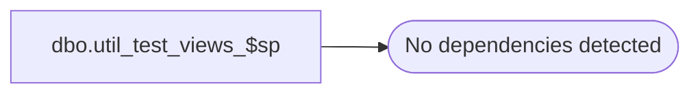

# dbo.util_test_views_$sp

**Database:** auditworks_external  
**Server:** bedrockdb01  

## Architecture Diagram



## Table Dependencies

_No table dependencies detected._

## Stored Procedure Code

```sql
create proc dbo.util_test_views_$sp 

AS
/* Proc Name: util_test_views_$sp 
   Desc: Identifies views that are broken, i.e. are pointing to objects that don't exist or to which select permission has not been granted.

HISTORY
Date     Name             Def#  Desc
Dec12,13 Paul           147019  author


*/

DECLARE @errmsg			nvarchar(2000),
	@stmt nvarchar(max),
	@vw_name varchar(255);

CREATE TABLE #badViews 
(    
    view_name VARCHAR(255)   
);

CREATE TABLE #nullData
(  
    null_data varchar(1)
);


DECLARE tbl_cursor CURSOR FAST_FORWARD
    FOR select name 
        from sys.views
 ORDER BY name;

OPEN tbl_cursor;
FETCH NEXT FROM tbl_cursor
INTO @vw_name;

WHILE @@FETCH_STATUS = 0
BEGIN
    set @stmt = 'select top 1 null from ' + @vw_name
    BEGIN TRY
      -- silently execute the "select from view" query
        insert into #nullData execute sp_executesql @stmt;
--      PRINT @vw_name;
    END TRY
    BEGIN CATCH;
     insert into #badViews (view_name) values (@vw_name);
    END CATCH;


    FETCH NEXT FROM tbl_cursor 
    INTO @vw_name;
end;
CLOSE tbl_cursor;
DEALLOCATE tbl_cursor;    

-- print the views with errors when executed
select view_name as 'Invalid_View_Name - Verify view definition and permissions' 
 from #badViews;

drop table #badViews;
drop table #nullData;

RETURN;
```

