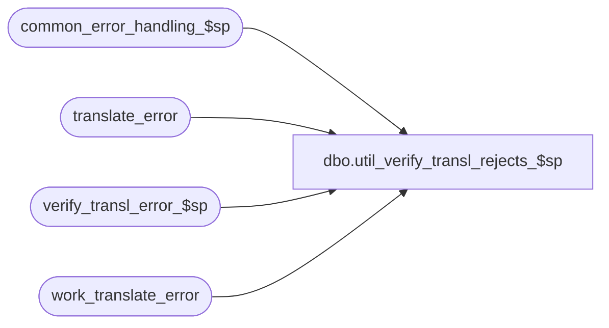

# dbo.util_verify_transl_rejects_$sp

**Database:** auditworks_external  
**Server:** bedrockdb01  

## Architecture Diagram



## Table Dependencies

| Referenced Table |
|---|
| common_error_handling_$sp |
| translate_error |
| verify_transl_error_$sp |
| work_translate_error |

## Stored Procedure Code

```sql
create proc dbo.util_verify_transl_rejects_$sp 
   
AS

/* Proc Name: util_verify_transl_rejects_$sp  5.0/5.1
   Description: Verify all outstanding translate errors.
     The purpose of this proc is to allow efficiently verifying large numbers of translate rejects.
     Calls the same proc that is used by the gui function that verifies translate rejects.

HISTORY
Date     Name            Def# Desc
-----------------------------------------------------------------------------
Aug15,13  Paul         145958 call common_error_handling_$sp, use try .. catch
Jun18,10  Paul         114682 author

*/


DECLARE
	@action				tinyint,
	@errno 				int,
	@errmsg				nvarchar(1024),
	@message_id			int,
	@object_name			nvarchar(255),
	@operation_name			nvarchar(100),
	@process_name			nvarchar(100),
	@process_id                     binary(16),
	@user_id                        int

/* Proc Name: util_verify_transl_rejects_$sp
   Description: Verify all outstanding translate errors.
     The purpose of this proc is to allow efficiently verifying large numbers of translate rejects.
     Calls the same proc that is used by the gui function that verifies translate rejects.

HISTORY
Date     Name            Def# Desc
-----------------------------------------------------------------------------
Aug15,13  Paul         145958 call common_error_handling_$sp, use try .. catch
Jun18,10  Paul         114682 author

*/


  /* Alternate syntax to manually delete rows for a particular guid :
	DELETE FROM work_translate_error
	WHERE process_id = 0xED2EC5EAD94A3847849D64018AA387D3
  */


SELECT @process_name = 'util_verify_transl_rejects_$sp',
	@message_id = 201068,
	@process_id = @@spid, -- only used for logging errors in sub procs
	@user_id = null,
	@action = 1; -- verify

BEGIN TRY

SELECT @errmsg = 'Unable to delete work_translate_error',
	@operation_name = 'DELETE',
	@object_name = 'work_translate_error';

DELETE FROM work_translate_error
WHERE process_id = @process_id;

   SELECT @errmsg = 'Unable to populate work_translate_error',
	@operation_name = 'INSERT'

INSERT INTO work_translate_error (process_id, translate_error_id)
SELECT @process_id, translate_error_id
  FROM translate_error
 WHERE verified = 0;

   SELECT @errmsg = 'Unable to execute verify_transl_error_$sp',
	@operation_name = 'EXECUTE',
	@object_name = 'verify_transl_error_$sp';

EXEC verify_transl_error_$sp @process_id, @user_id, @action;

   SELECT @errmsg = 'Unable to clean up work_translate_error',
	@operation_name = 'DELETE',
	@object_name = 'work_translate_error';

DELETE FROM work_translate_error
WHERE process_id = @process_id;

RETURN;

END TRY

BEGIN CATCH;

     /* Common error handler. */

	SELECT @errno = ERROR_NUMBER(),
		@errmsg = COALESCE(@errmsg, ' ') + ERROR_MESSAGE();

	EXEC common_error_handling_$sp 0, @errno, @errmsg, 0, @message_id, 
	  @process_name, @object_name, @operation_name, 0, 1, 0, null, 0, null, null, 
	  null, null, null, null, 0, null, 0;

	RETURN;
END CATCH;
```

