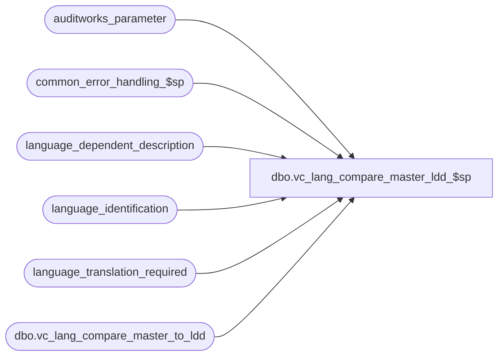

# dbo.vc_lang_compare_master_ldd_$sp

**Database:** auditworks_external  
**Server:** bedrockdb01  

## Architecture Diagram



## Table Dependencies

| Referenced Table |
|---|
| auditworks_parameter |
| common_error_handling_$sp |
| language_dependent_description |
| language_identification |
| language_translation_required |
| dbo.vc_lang_compare_master_to_ldd |

## Stored Procedure Code

```sql
create procedure [dbo].[vc_lang_compare_master_ldd_$sp] 
  @correct_immediately tinyint = 0,
	/*  0=No
	 1=Entries for sys resource_id only (requires first setting master_description_correct flag)
	 2=Entries for user resource_id only (requires first setting master_description_correct flag)
	 3=Entries for all resource_id  (requires first setting master_description_correct flag) */
 @comparison_language_id smallint = null
   /* if left null, master table descriptions will be compared or synchronized with base language entries
	if 1033, 2057 or 3084 specified, master table descriptions will be compared or synchronized with entries for the language specified */
AS

/* 
PROC NAME:   vc_lang_compare_master_ldd_$sp
PROC DESC:   Utility used to synchronize language descriptions (for example if changes have been made to US Eng which
             would also apply to UK Eng.
	     Because of cross-server queries, script with:
	     	SET ANSI_NULLS ON
		SET ANSI_WARNINGS ON

	     This procedure compares descriptions in the actual master tables with the corresponding descriptions in 
	     language_dependent_description for the language specified and reports any difference.
	     If this procedure is then re-run with the @correct_immediately set to 1, 2 or 3, then the master table
	     descriptions and language_dependent_description entries will be synchronized in accordance with the
	     master_description_correct flag of each discrepancy row.  
	     By default, the master table descriptions are assumed to be correct, however for any given row the 
	     master_description_correct flag may be overriden manually as necessary prior to running this proc with 
	     @correct_immediately set > 0 in order to indicate which table requires correction.  
HISTORY
Date     Name   Def# 	Desc
Nov10,10 Vicci  122509  Version looking at language_dependent_description instead of language_dependent_desc_eng
                        for use in enterprise express.
*/

DECLARE @errmsg 			nvarchar(255),
	@errno				int,
	@log_error_flag			tinyint,
	@message_id			int,
	@object_name			nvarchar(255),
	@operation_name     		nvarchar(100),
	@process_no			int,
	@process_name			nvarchar(100),
	@vc_language_compare_sql_cmd	nvarchar(2000),
	@vc_lang_correct_master_sql_cmd nvarchar(2000),
	@rows				int,
	@cursor_open			tinyint

/* The following is required for cross-server queries */
SET ANSI_NULLS ON
SET ANSI_WARNINGS ON

SELECT @log_error_flag = 1, -- called by smartload
       @process_no = 0, -- Table Maintenance
       @process_name = 'vc_lang_compare_master_to_ldd_$sp',
       @message_id = 201068,
       @errno = 0
/*
DROP TABLE dbo.vc_lang_compare_master_to_ldd

CREATE TABLE dbo.vc_lang_compare_master_to_ldd ( 
    resource_id numeric(12,0) not null, 
    table_name nvarchar(30) not null, 
    master_description nvarchar(1000) null,
    ldd_description nvarchar(1000) null,
    master_description_correct tinyint DEFAULT 1 not null,
    description_column_name nvarchar(30) not null,
    resource_column_name nvarchar(30) not null) 
CREATE unique clustered index vc_lang_compare_master_to_ldd_x0 on dbo.vc_lang_compare_master_to_ldd(resource_id)

*/
SELECT @comparison_language_id = language_id
  FROM language_identification
 WHERE language_id = @comparison_language_id
   AND active_flag = 1
SELECT @errno = @@error
IF @errno <> 0
BEGIN
  SELECT @errmsg = 'Unable to verify validity of language specified',
         @object_name = 'language_identification',
         @operation_name = 'SELECT'      
  GOTO error
END
   
IF @comparison_language_id IS NULL
BEGIN
  SELECT @comparison_language_id = l.language_id
    FROM auditworks_parameter p, language_identification l
   WHERE p.par_name = 'base_language_id'
     AND p.par_value = convert(nvarchar, l.language_id)
     AND l.active_flag = 1
  SELECT @errno = @@error
  IF @errno <> 0
  BEGIN
    SELECT @errmsg = 'Unable to determine base language',
           @object_name = 'auditworks_parameter',
           @operation_name = 'SELECT'      
    GOTO error
  END
  IF @comparison_language_id IS NULL
    SELECT @comparison_language_id = 1033
END
  
IF @correct_immediately > 0
BEGIN

  DECLARE processing_cursor CURSOR
      FOR
   SELECT 'UPDATE ' + table_name + ' SET ' + description_column_name + ' = ''' + REPLACE(ldd_description, '''', '''''') + ''' WHERE ' + resource_column_name + ' = ' + convert(nvarchar,resource_id)
     FROM dbo.vc_lang_compare_master_to_ldd 
    WHERE master_description_correct = 0
      AND (   (resource_id < 10000000 AND @correct_immediately = 1)
           OR (resource_id >= 10000000 AND @correct_immediately = 2)
           OR @correct_immediately = 3 )
      AND COALESCE(ldd_description, '') <> ''
   SELECT @errno = @@error
   IF @errno <> 0
   BEGIN
     SELECT @errmsg = 'Unable to create statement to update master descriptions',
            @object_name = 'processing_cursor',
            @operation_name = 'DECLARE'      
     GOTO error
   END

   OPEN processing_cursor
   SELECT @cursor_open = 1

   FETCH processing_cursor
    INTO @vc_lang_correct_master_sql_cmd

   WHILE @@fetch_status = 0 
   BEGIN
     --  PRINT @vc_lang_correct_master_sql_cmd

     EXEC sp_executesql @vc_lang_correct_master_sql_cmd	
     SELECT @errno = @@error, @rows = @@rowcount
     IF @errno <> 0
     BEGIN
        PRINT @vc_lang_correct_master_sql_cmd
        SELECT @errmsg = 'Unable to execute dynamic sql in @vc_lang_correct_master_sql_cmd',
               @object_name = 'sp_executesql',
               @operation_name = 'EXEC'      
        GOTO error
     END

     PRINT '(' + convert(nvarchar,@rows) + ' master table rows affected) ' 

  
     FETCH processing_cursor
      INTO @vc_lang_correct_master_sql_cmd 
   END /* while not end of cursor */

   CLOSE processing_cursor
   DEALLOCATE processing_cursor
   SELECT @cursor_open = 0 

   UPDATE language_dependent_description
      SET display_description = master_description
     FROM dbo.vc_lang_compare_master_to_ldd c
    WHERE language_dependent_description.language_id = @comparison_language_id
      AND c.master_description_correct = 1
      AND c.resource_id = language_dependent_description.resource_id
      AND (   (c.resource_id < 10000000 AND @correct_immediately = 1)
           OR (c.resource_id >= 10000000 AND @correct_immediately = 2)
           OR @correct_immediately = 3 )

   SELECT @errno = @@error
   IF @errno <> 0
   BEGIN
     SELECT @errmsg = 'Unable to create statement to update ldd descriptions',
            @object_name = 'language_dependent_description',
            @operation_name = 'UPDATE'      
     GOTO error
   END

END  --IF @correct_immediately > 0

TRUNCATE TABLE dbo.vc_lang_compare_master_to_ldd

DECLARE processing_cursor CURSOR
 FOR
 SELECT 'INSERT INTO dbo.vc_lang_compare_master_to_ldd(resource_id, table_name, master_description, ldd_description, description_column_name, resource_column_name) 
         SELECT ldd.resource_id, ''' + table_name + ''', m.' + description_column_name + ', ldd.display_description, ''' + description_column_name + ''', ''' + resource_column_name + ''' FROM ' + table_name +  ' m, language_dependent_description ldd WHERE m.' + resource_column_name + ' = ldd.resource_id AND ldd.language_id = @comparison_language_id AND m.' + description_column_name + ' <> ldd.display_description '
   FROM language_translation_required ltr
        INNER JOIN sysobjects s
            ON s.type = 'U'
           AND s.name = ltr.table_name
  SELECT @errno = @@error
  IF @errno <> 0
  BEGIN
 SELECT @errmsg = 'Unable to determine which descriptions are mismatched',
        @object_name = 'processing_cursor',
        @operation_name = 'DECLARE'      
    GOTO error
  END

OPEN processing_cursor
SELECT @cursor_open = 1

 FETCH processing_cursor
  INTO @vc_language_compare_sql_cmd

 WHILE @@fetch_status = 0 
 BEGIN

--  PRINT @vc_language_compare_sql_cmd

    EXEC sp_executesql @vc_language_compare_sql_cmd, N'@comparison_language_id smallint', @comparison_language_id
    SELECT @errno = @@error, @rows = @@rowcount
    IF @errno <> 0
    BEGIN
      SELECT @errmsg = 'Unable to execute dynamic sql in @vc_language_compare_sql_cmd',
             @object_name = 'sp_executesql',
             @operation_name = 'EXEC'      
      GOTO error
   END

    PRINT '(' + convert(nvarchar,@rows) + ' rows affected) ' 

  
    FETCH processing_cursor
     INTO @vc_language_compare_sql_cmd 
 END /* while not end of cursor */

CLOSE processing_cursor
DEALLOCATE processing_cursor
SELECT @cursor_open = 0 

PRINT 'Results may be reviewed in vc_lang_compare_master_to_ldd and the master_description_correct indicator for each row set accordingly.'
SELECT * FROM dbo.vc_lang_compare_master_to_ldd
ORDER BY table_name, resource_id
/*
SELECT e.resource_id, e.display_description eng_desc, u.display_description uk_desc
  FROM language_dependent_description e,
       language_dependent_description u
 WHERE e.resource_id = u.resource_id
   AND IsNull(e.display_description, '') <> IsNull(u.display_description, '')
   AND e.language_id = 1033
   AND u.language_id = 2057
*/
RETURN

error:   /* Common error handler. */

  IF @cursor_open <> 0
  BEGIN
    CLOSE processing_cursor
    DEALLOCATE processing_cursor
  END

  EXEC common_error_handling_$sp @process_no, @errno, @errmsg, 0, @message_id, 
       @process_name, @object_name, @operation_name, @log_error_flag 
  RETURN
```

