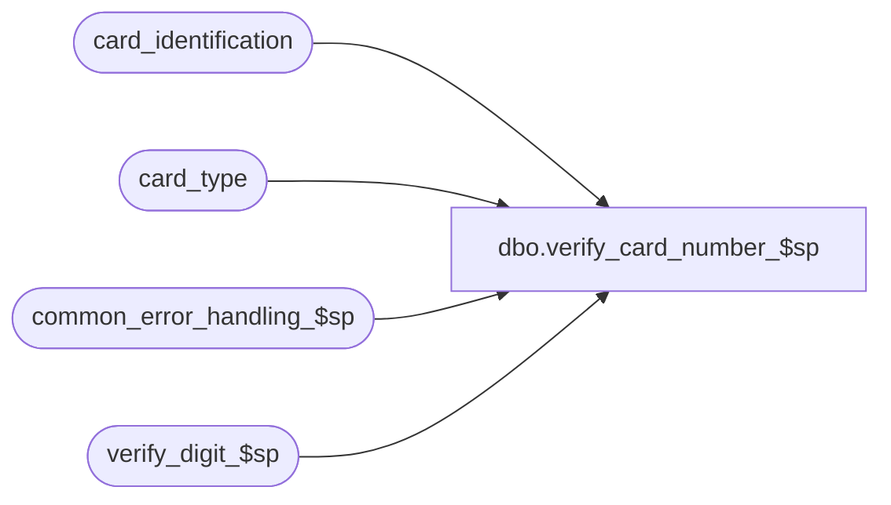

# dbo.verify_card_number_$sp

**Database:** auditworks_external  
**Server:** bedrockdb01  

## Architecture Diagram



## Table Dependencies

| Referenced Table |
|---|
| card_identification |
| card_type |
| common_error_handling_$sp |
| verify_digit_$sp |

## Stored Procedure Code

```sql
create proc [dbo].[verify_card_number_$sp] 
@process_id      binary(16),
@user_id         int,
@card_no         nvarchar(20),
@reference_type  tinyint

AS

/* Proc Name: verify_card_number_$sp 
   Desc: Subroutine to verify the check digit on a credit card.
         return status = 1 indicates that card no is invalid.
   Called by FRONT END

HISTORY
 Date    Name            Defect Desc
Feb27,07 Paul           DV-1357 uplift 60266 to SA5
Sep22,04 Paul           DV-1146 receive user_id
Jul09,04 Maryam         DV-1071 Modified to receive @process_id as input parameter
                                and pass it to sub procs.
Sep16,05 David            60266 Check for reference_type when identifying card_type.
JUL18,02 Daphna         AW-8812 Separate into 2 procedures for use by Service Desk Module, 
                                check digit calculation performed by verify_digit_$sp 
May01,02 Paul           1-CD0IX added R3 error handling
Nov10,00 Phu               6943 Correct I/F reject due to leading/trailing spaces in card numbers
Apr09,99 Paul              4446 avoid division by zero
Jan02,96
*/

DECLARE 
  @check_digit_routine_no  tinyint,
  @card_number		numeric(20,0),
  @card_type		nchar(1),
  @errmsg		nvarchar(255),
  @errno		int,
  @result		tinyint,  -- DEF AW-8812
  @object_name		nvarchar(255),
  @process_name		nvarchar(100),
  @function_no		tinyint,			
  @operation_name	nvarchar(100),
  @message_id		int


/* Description: To verify credit card account numbers */

SELECT @card_type = '?',
	@card_number = CONVERT( numeric(20,0), ISNULL(@card_no,'0')),
	@card_no = RIGHT('00000000000000000000' + LTRIM(RTRIM(@card_no)),20),
	@process_name = 'verify_card_number_$sp',
	@function_no = 100,  -- tran mod
	@message_id = 201068
	

SELECT @card_type = card_type
  FROM card_identification
 WHERE @card_number >= from_account_no
   AND @card_number <= to_account_no
   AND @reference_type = reference_type

SELECT @errno = @@error
IF @errno != 0
BEGIN
  SELECT @errmsg = 'Unable to select from card_identification',
         @object_name = 'card_identification',
         @operation_name = 'SELECT'
  GOTO error
END

IF @card_type = '?'
  RETURN 1

SELECT @check_digit_routine_no = check_digit_routine_number
  FROM card_type
 WHERE card_type = @card_type

SELECT @errno = @@error
IF @errno != 0
BEGIN
  SELECT @errmsg = 'Unable to select from card_type',
         @object_name = 'card_type',
         @operation_name = 'SELECT'
  GOTO error
END

IF @check_digit_routine_no = 0
  RETURN 0

-- DEF AW-8812

EXEC @result = verify_digit_$sp @process_id, @user_id, @card_no, @check_digit_routine_no, @function_no, @errmsg OUTPUT

SELECT @errno = @@error
IF @errno != 0
BEGIN
  SELECT @errmsg = 'Unable to calculate check digit',
         @object_name = 'verify_digit_$sp',
         @operation_name = 'EXECUTE'
  GOTO error
END

RETURN @result

error:   /* Common error handler */

	EXEC common_error_handling_$sp @function_no, @errno, @errmsg, 0, @message_id, 
	  @process_name, @object_name, @operation_name, 0, 1, 0, null, 0, null, null, null,
	  null, null, null, 0, @process_id, @user_id
	RETURN
```

