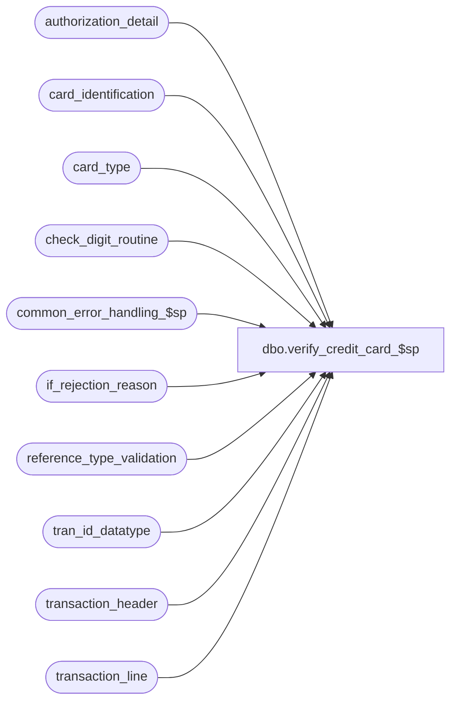

# dbo.verify_credit_card_$sp

**Database:** auditworks_external  
**Server:** bedrockdb01  

## Architecture Diagram



## Table Dependencies

| Referenced Table |
|---|
| authorization_detail |
| card_identification |
| card_type |
| check_digit_routine |
| common_error_handling_$sp |
| if_rejection_reason |
| reference_type_validation |
| tran_id_datatype |
| transaction_header |
| transaction_line |

## Stored Procedure Code

```sql
create proc dbo.verify_credit_card_$sp 
@process_id             binary(16),
@user_id                int,
@transaction_id		tran_id_datatype,
@errmsg			nvarchar(255) OUTPUT

AS

/* Proc Name: verify_credit_card_$sp
   Description: To verify credit card account numbers.
   Called by modify_interface_$sp.

HISTORY
 Date    Name       Defect Desc
Jan22,14 Vicci      149479 Reject alpha-numeric credit cards (which can happen when called from mass reval functions such as translate error verification) 
                           without attempting to verify their length, check-digit, etc in order to avoid Error:8114 Message:Error converting data type nvarchar to numeric.
Jan19,12 Vicci      132481 Remove usage of data length function for substring extraction from unicode strings since it returns a length
                           of double that corresponding to the character positions within the string in the case of nvarchar and nchar data types.
Oct30,07 Paul        94266 Do not reject if transaction is void (matches edit functionality)
Feb27,07 Paul      DV-1357 uplift 65796 to SA5
Nov01,05 Paul        62153 apply 61728 to SA5
Sep22,05 Paul        60471 apply 60266, DV-1298 to SA5
Jul05,05 Paul      DV-1239 Use tran_id_datatype
Mar24,05 David     DV-1202 Avoid ambiguous column error by specifying aliases.
Feb23,05 David     DV-1206 apply DV-1298 to SA5
Oct28,04 David     DV-1159 Check for ORG_CHN active flag. 
Sep22,04 Paul      DV-1146 receive user_id
Aug23,04 Sab	   DV-1120 Remove local variable @aplctn_id and aplctn_id in auditwork_parameter since we hardcode aplctn_id to 300.
May25,04 David     DV-1071 Use ORG_CHN table as new the Store table. Added logic for encrypted credit cards.
Apr23,04 Maryam    DV-1071 Receive @process_id and @user_name and pass it to common_error_handling_$sp.
Apr16,04 Sab	   DV-1068 Remove variables @legacy_media_rec_active_flag, @media_rec_not_converted
Jan12,06 Daphna      65796 Do not limit validation to reference_type in (1,3)
Oct21,05 David       61728 Do not join to LOAA when getting card_type.
Sep28,05 David       60266 Check for reference_type when identifying card_type.
                           Validate using invalid_reference_no if available.
Jul14,05 David     DV-1298 Only validate card numbers that haven't already been validated by FE.
Jun18,03 Winnie	      9250 Media Reconciliation enhancements.	 
Apr01,03 Vicci	      7340 Prevent arithmetic overflow by changing @digit datatype to be smallint
May01,02 Paul      1-CD0IX added R3 error handling
Nov10,00 Phu          6943 Correct I/F reject due to leading/trailing spaces in card numbers
Mar30,00 Phu          6158 Remove alias name attached to column being updated for MS SQL compatibility
Apr06,99 Paul         4446 avoid division by zero
May13,98 Vicci
         Seb               Author
*/

DECLARE 
  @card_length 		smallint,
  @card_no		nvarchar(20),
  @card_type		nchar(1),
  @check_sum	 	numeric(6,2),
  @digit		smallint,
  @errno		int,
  @line_id		numeric(5,0),
  @multiplier_flag	tinyint,
  @pointer 		tinyint,
  @product		tinyint,
  @quotient	 	numeric(6,2),
  @return_code		tinyint,
  @rows			int,
  @object_name		nvarchar(255),
  @process_name		nvarchar(100),
  @operation_name	nvarchar(100),
  @message_id		int

SELECT @digit = 0,
	@return_code = 0,
	@process_name = 'verify_credit_card_$sp',
	@message_id = 201068

CREATE TABLE #credit_card
(line_id numeric(5,0),
 line_object smallint,
 check_digit_routine smallint,
 card_no  numeric(20,0),
 card_no_char nchar(20),
 card_type nchar(1),
 digit1  smallint,
 digit2  smallint,
 digit3  smallint,
 digit4  smallint,
 digit5  smallint,
 digit6  smallint,
 digit7  smallint,
 digit8  smallint,
 digit9  smallint,
 digit10  smallint,
 digit11  smallint,
 digit12  smallint,
 digit13  smallint,
 digit14  smallint,
 digit15  smallint,
 digit16  smallint,
 digit17  smallint,
 digit18  smallint,
 digit19  smallint,
 digit20  smallint,
 sum_of_digits  smallint,
 remainder_value  smallint,
 reference_type tinyint)
SELECT @errno = @@error
IF @errno != 0
  BEGIN 
    SELECT @errmsg = 'Failed to create temp table #credit_card',
           @object_name = '#credit_card',
           @operation_name = 'CREATE'
    GOTO error 
  END

INSERT #credit_card
         (line_id,
          line_object,
	  check_digit_routine,
	  card_no, 
	  card_no_char,
	  card_type,
	  digit1,
	  digit2,
	  digit3,
	  digit4,
	  digit5,
	  digit6,
	  digit7,
	  digit8,
	  digit9,
	  digit10,
	  digit11,
	  digit12,
	  digit13,
	  digit14,
	  digit15,
	  digit16,
	  digit17,
	  digit18,
	  digit19,
	  digit20,
 	  sum_of_digits,
	  remainder_value,
	  reference_type)
  SELECT tl.line_id,
         tl.line_object,
	 @digit,
	 --CONVERT(numeric(20,0), ISNULL(ISNULL(invalid_reference_no, reference_no),'0')),
	 CASE WHEN IsNumeric(ISNULL(ISNULL(invalid_reference_no, reference_no),'0')) = 0 
	      THEN 0
	      ELSE CONVERT(numeric(20,0), ISNULL(ISNULL(invalid_reference_no, reference_no),'0') )
	 END,
 	 RIGHT('00000000000000000000'+LTRIM(RTRIM(ISNULL(invalid_reference_no, reference_no))),20),
	 '?',
	 @digit,
	 @digit,
	 @digit,
	 @digit,
	 @digit,
	 @digit,
	 @digit,
	 @digit,
	 @digit,
	 @digit,
	 @digit,
	 @digit,
	 @digit,
	 @digit,
	 @digit,
	 @digit,
	 @digit,
	 @digit,
	 @digit,
	 @digit,
 	 CASE -- set to 1 for voids. will be overlayed later
          WHEN th.transaction_void_flag > 0 AND th.transaction_void_flag <> 8 THEN 1
          WHEN tl.line_void_flag = 1 THEN 1
          ELSE 0
         END,  
	 @digit,
	 tl.reference_type
    FROM transaction_header th WITH (NOLOCK), transaction_line tl WITH (NOLOCK),
 	 reference_type_validation r
   WHERE th.transaction_id = @transaction_id
     AND th.transaction_id = tl.transaction_id
     AND tl.reference_type = r.reference_type
     AND r.validation_type = 1
     AND r.manual_active_flag = 1
     AND (len(tl.reference_no) <= 20 OR tl.invalid_reference_no IS NOT NULL)
  SELECT @errno = @@error, @rows = @@rowcount
  IF @errno != 0
    BEGIN
      SELECT @errmsg = 'Unable to insert #credit_card',
             @object_name = '#credit_card',
        @operation_name = 'INSERT'
      GOTO error
    END

IF @rows = 0 
BEGIN
  DROP TABLE #credit_card
  RETURN @return_code
END

UPDATE #credit_card
   SET card_type = ci.card_type
  FROM #credit_card ec, card_identification ci
 WHERE ec.card_no >= ci.from_account_no
   AND ec.card_no <= ci.to_account_no
   AND ec.reference_type = ci.reference_type

SELECT @errno = @@error
IF @errno != 0
  BEGIN
    SELECT @errmsg = 'Unable to update #credit_card (card_type)',
           @object_name = '#credit_card',
           @operation_name = 'UPDATE'
    GOTO error
  END

/* Update all card_types */
UPDATE authorization_detail
   SET card_type = ec.card_type
  FROM #credit_card ec, authorization_detail ad
 WHERE transaction_id = @transaction_id
   AND ec.line_id = ad.line_id
   AND ec.card_type != '?'

SELECT @errno = @@error
IF @errno != 0
BEGIN
  SELECT @errmsg = 'Failed to UPDATE on authorization_detail',
         @object_name = 'authorization_detail',
         @operation_name = 'UPDATE'
  GOTO error
END

DELETE #credit_card
WHERE sum_of_digits = 1 -- remove voided transactions and voided lines

SELECT @errno = @@error
IF @errno != 0
  BEGIN
    SELECT @errmsg = 'Unable to delete #credit_card (voided transactions)',
           @object_name = '#credit_card',
           @operation_name = 'DELETE'
    GOTO error
  END

UPDATE #credit_card
   SET check_digit_routine = check_digit_routine_number
  FROM #credit_card wc, card_type ct
 WHERE wc.card_type = ct.card_type
   AND ct.check_digit_routine_number >= 1

SELECT @errno = @@error
IF @errno != 0
  BEGIN
    SELECT @errmsg = 'Unable to update #credit_card (check_digit_routine)',
   @object_name = '#credit_card',
           @operation_name = 'UPDATE'
    GOTO error
  END

  /* Validate Card - Check digit routine */
  UPDATE #credit_card
   SET digit20= ISNULL(CONVERT(tinyint, SUBSTRING(card_no_char, 20, 1 )),0) * multiplier20,
	digit19= (ISNULL(CONVERT(tinyint, SUBSTRING(card_no_char, 19, 1 )),0) * multiplier19)
	- (sum_of_product_digits * SIGN(SIGN(ISNULL(CONVERT(tinyint, SUBSTRING(card_no_char, 19, 1 )),0) - 5)+1)),
	digit18= ISNULL(CONVERT(tinyint, SUBSTRING(card_no_char, 18, 1 )),0) * multiplier18,
	digit17= (ISNULL(CONVERT(tinyint, SUBSTRING(card_no_char, 17, 1 )),0) * multiplier17)
	- (sum_of_product_digits * SIGN(SIGN(ISNULL(CONVERT(tinyint, SUBSTRING(card_no_char, 17, 1 )),0) - 5)+1)),
	digit16= ISNULL(CONVERT(tinyint, SUBSTRING(card_no_char, 16, 1 )),0) * multiplier16,
	digit15= (ISNULL(CONVERT(tinyint, SUBSTRING(card_no_char, 15, 1 )),0) * multiplier15)
	- (sum_of_product_digits * SIGN(SIGN(ISNULL(CONVERT(tinyint, SUBSTRING(card_no_char, 15, 1 )),0) - 5)+1)),
	digit14= ISNULL(CONVERT(tinyint, SUBSTRING(card_no_char, 14, 1 )),0) * multiplier14,
	digit13= (ISNULL(CONVERT(tinyint, SUBSTRING(card_no_char, 13, 1 )),0) * multiplier13)
	- (sum_of_product_digits * SIGN(SIGN(ISNULL(CONVERT(tinyint, SUBSTRING(card_no_char, 13, 1 )),0) - 5)+1)),
	digit12= ISNULL(CONVERT(tinyint, SUBSTRING(card_no_char, 12, 1 )),0) * multiplier12,
	digit11= (ISNULL(CONVERT(tinyint, SUBSTRING(card_no_char, 11, 1 )),0) * multiplier11)
	- (sum_of_product_digits * SIGN(SIGN(ISNULL(CONVERT(tinyint, SUBSTRING(card_no_char, 11, 1 )),0) - 5)+1))
   FROM #credit_card wc, check_digit_routine cr
  WHERE wc.check_digit_routine = cr.check_digit_routine_no
    AND IsNumeric(card_no_char) = 1
  SELECT @errno = @@error
  IF @errno != 0
   BEGIN
    SELECT @errmsg = 'Unable to update #credit_card (digit20)',
           @object_name = '#credit_card',
          @operation_name = 'UPDATE'
    GOTO error
   END

  UPDATE #credit_card
  SET digit10= ISNULL(CONVERT(tinyint, SUBSTRING(card_no_char, 10, 1 )),0) * multiplier10,
	digit9= (ISNULL(CONVERT(tinyint, SUBSTRING(card_no_char, 9, 1 )),0) * multiplier9)
	- (sum_of_product_digits * SIGN(SIGN(ISNULL(CONVERT(tinyint, SUBSTRING(card_no_char, 9, 1 )),0) - 5)+1)),
	digit8= ISNULL(CONVERT(tinyint, SUBSTRING(card_no_char, 8, 1 )),0) * multiplier8,
	digit7= (ISNULL(CONVERT(tinyint, SUBSTRING(card_no_char, 7, 1 )),0) * multiplier7)
	- (sum_of_product_digits * SIGN(SIGN(ISNULL(CONVERT(tinyint, SUBSTRING(card_no_char, 7, 1 )),0) - 5)+1)),
	digit6= ISNULL(CONVERT(tinyint, SUBSTRING(card_no_char, 6, 1 )),0) * multiplier6,
	digit5= (ISNULL(CONVERT(tinyint, SUBSTRING(card_no_char, 5, 1 )),0) * multiplier5)
	- (sum_of_product_digits * SIGN(SIGN(ISNULL(CONVERT(tinyint, SUBSTRING(card_no_char, 5, 1 )),0) - 5)+1)),
	digit4= ISNULL(CONVERT(tinyint, SUBSTRING(card_no_char, 4, 1 )),0) * multiplier4,
	digit3= (ISNULL(CONVERT(tinyint, SUBSTRING(card_no_char, 3, 1 )),0) * multiplier3)
	- (sum_of_product_digits * SIGN(SIGN(ISNULL(CONVERT(tinyint, SUBSTRING(card_no_char, 3, 1 )),0) - 5)+1)),
	digit2= ISNULL(CONVERT(tinyint, SUBSTRING(card_no_char, 2, 1 )),0) * multiplier2,
	digit1= (ISNULL(CONVERT(tinyint, SUBSTRING(card_no_char, 1, 1 )),0) * multiplier1)
	- (sum_of_product_digits * SIGN(SIGN(ISNULL(CONVERT(tinyint, SUBSTRING(card_no_char, 1, 1 )),0) - 5)+1))
   FROM #credit_card wc, check_digit_routine cr
  WHERE wc.check_digit_routine = cr.check_digit_routine_no
    AND IsNumeric(card_no_char) = 1
  SELECT @errno = @@error
  IF @errno != 0
   BEGIN
    SELECT @errmsg = 'Unable to update #credit_card (digit10)',
           @object_name = '#credit_card',
           @operation_name = 'UPDATE'
    GOTO error
   END

  UPDATE #credit_card
     SET sum_of_digits = digit1 + digit2 + digit3 + digit4 + digit5 + digit6
	+ digit7 + digit8 + digit9 + digit10 + digit11 + digit12 + digit13
	+ digit14 + digit15 + digit16 + digit17 + digit18 + digit19 + digit20
   FROM #credit_card wc, check_digit_routine cr
  WHERE wc.check_digit_routine = cr.check_digit_routine_no
    AND sum_of_products = 1

  SELECT @errno = @@error
  IF @errno != 0
   BEGIN
    SELECT @errmsg = 'Unable to update #credit_card (digit1)',
           @object_name = '#credit_card',
           @operation_name = 'UPDATE'
    GOTO error
   END

  UPDATE #credit_card
     SET remainder_value = sum_of_digits % divisor
    FROM #credit_card wc, check_digit_routine cr
   WHERE wc.check_digit_routine = cr.check_digit_routine_no
     AND divisor >= 1

  SELECT @errno = @@error
  IF @errno != 0
   BEGIN
    SELECT @errmsg = 'Unable to update #credit_card (remainder_value)',
           @object_name = '#credit_card',
           @operation_name = 'UPDATE'
    GOTO error
   END

-- Log I/F reject if card_type is '?' or card no did not pass check digit routine.
INSERT if_rejection_reason (
	transaction_id,
	line_id,
	if_reject_reason)
 SELECT @transaction_id, line_id, 2
   FROM #credit_card
  WHERE card_type = '?'
     OR remainder_value <> 0

SELECT @errno = @@error, @rows = @@rowcount
IF @errno != 0
BEGIN
 SELECT @errmsg = 'Unable to insert if_rejection_reason (card_type)',
	@object_name = 'if_rejection_reason',
	@operation_name = 'INSERT'
 GOTO error
END

-- No check for I/F reject 113, since FE would have already checked and replaced the LO already.

IF @rows >= 1
BEGIN
  UPDATE transaction_line
     SET interface_rejection_flag = 1
    FROM transaction_line tl, #credit_card wc
   WHERE transaction_id = @transaction_id
     AND tl.line_id = wc.line_id
     AND (wc.card_type = '?' OR wc.remainder_value <> 0)

  SELECT @errno = @@error
  IF @errno != 0
  BEGIN
    SELECT @errmsg = 'Unable to update transaction_line (1)',
           @object_name = 'transaction_line',
           @operation_name = 'UPDATE'
    GOTO error
  END

  SELECT @return_code = 1
END /* If @rows >= 1 */
ELSE
BEGIN
  UPDATE transaction_line
     SET invalid_reference_no = NULL --
    FROM transaction_line tl, #credit_card wc
   WHERE transaction_id = @transaction_id
     AND tl.line_id = wc.line_id

  SELECT @errno = @@error
  IF @errno != 0
  BEGIN
    SELECT @errmsg = 'Unable to clean invalid_reference_no.',
           @object_name = 'transaction_line',
           @operation_name = 'UPDATE'
    GOTO error
  END

  SELECT @return_code = 0
END -- else of If @rows >= 1

DROP TABLE #credit_card

SELECT @errno = @@error
IF @errno != 0
  BEGIN
    SELECT @errmsg = 'Unable to drop table #credit_card (4)',
    @object_name = '#credit_card',
           @operation_name = 'DROP'
    GOTO error
  END

RETURN @return_code

error:   /* Common error handler. */
	DROP TABLE #credit_card

	EXEC common_error_handling_$sp 100, @errno, @errmsg, 0, @message_id, 
	  @process_name, @object_name, @operation_name, 0, 1, 0, null, 0,
	  null, null, null, null, null, null, 0, @process_id, @user_id

	RETURN
```

