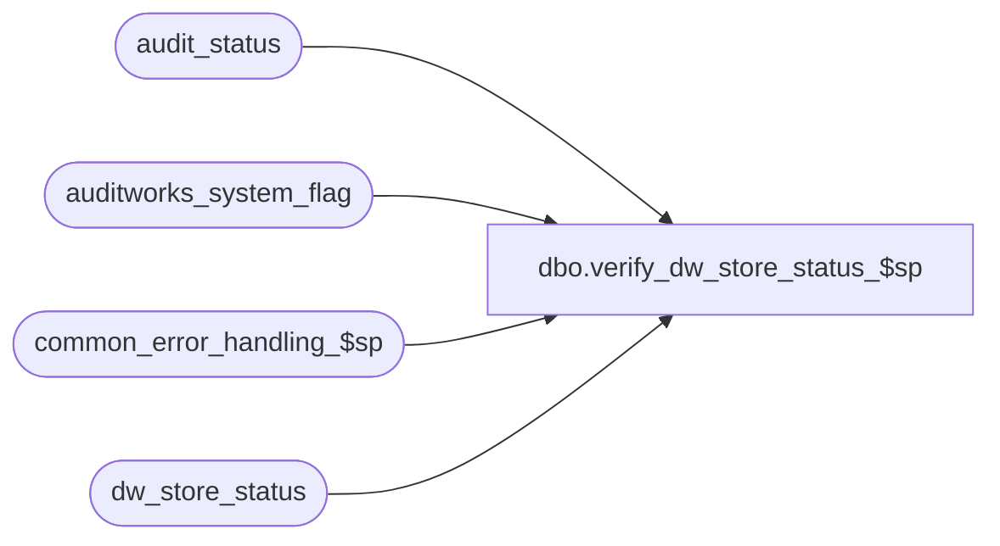

# dbo.verify_dw_store_status_$sp

**Database:** auditworks_external  
**Server:** bedrockdb01  

## Architecture Diagram



## Table Dependencies

| Referenced Table |
|---|
| audit_status |
| auditworks_system_flag |
| common_error_handling_$sp |
| dw_store_status |

## Stored Procedure Code

```sql
create proc dbo.verify_dw_store_status_$sp (@process_id            binary(16),
 @user_id               int,
 @store_no		int,
 @transaction_date	smalldatetime,
 @errmsg 		nvarchar(255) OUTPUT) 

AS

/*
Proc Name: verify_dw_store_status_$sp.
     Desc: Recalculates store_status and updates if necessary.
	   Releases ownership (by instance) of store-date when all transactions are deleted or moved except for the
	   special scenario of deleting/moving an invalid date (when sa rejects exist for date_reject_id > 0 because 
	   store-date was already accepted/completed).
	   Called by delete, mass delete, move, modify.

HISTORY:
Date     Name         Def# Desc
Feb17,12 Vicci      133087 Remove references to CRDM datatypes from procs installed in multi-stream S/A databases where CRDM is not installed.
Sep07,10 Paul       119817 scaleout: turn on xact abort setting only when needed since it aborts error logging
Sep28,09 Paul       111900 do not reset instance_id back to zero (retain ownership for missing purposes),
				check all values of date_reject_id to handle invalid dates.
Jan16,08 Paul        94350 avoid reseting status if already archived, handle move/delete of invalid date rejects
May06,05 Sab	   DV-1254 Recalculates store_status (dw_store_status) and updates if necessary.
*/

DECLARE
  @errno			int,
  @instance_id			smallint,
  @message_id			int,
  @object_name			nvarchar(255),
  @operation_name		nvarchar(100),
  @process_name			nvarchar(100),
  @rows				int,
  @store_audit_status		smallint,
  @store_status			smallint

SELECT @process_name = 'verify_store_status_$sp',
	@message_id = 201068

SELECT @instance_id = CONVERT(int,flag_numeric_value)
  FROM auditworks_system_flag
  WHERE flag_name = 'instance_id'

SELECT @rows = @@rowcount, @errno = @@error
IF @errno != 0
  BEGIN
    SELECT @errmsg = 'Failed to select instance_id from auditworks_system_flag',
           @object_name = 'auditworks_system_flag',
           @operation_name = 'SELECT'
    GOTO error
  END

IF @rows = 0
  BEGIN
    SELECT @errmsg = 'Invalid setup. Missing instance_id.',
	   @object_name = 'auditworks_system_flag',
	   @operation_name = 'SELECT'
    GOTO error
  END

-- read existing status of store-date

SELECT @store_status = store_status
  FROM dw_store_status 
 WHERE store_no = @store_no
   AND sales_date = @transaction_date

SELECT @errno = @@error
IF @errno != 0
 BEGIN
   SELECT @errmsg = 'Failed to select from audit_status',
	  @object_name = 'audit_status',
	  @operation_name = 'SELECT'
   GOTO error
 END

IF @instance_id > 0 -- scaleout
	BEGIN
	SET XACT_ABORT ON
	END

IF EXISTS (SELECT 1 FROM audit_status
	    WHERE store_no = @store_no
	      AND sales_date = @transaction_date
	      AND audit_status BETWEEN 6 AND 899)
 BEGIN
   IF @store_status = 0
    BEGIN -- claim ownership of store-date by current instance
      UPDATE dw_store_status
	 SET store_status = 1,
		instance_id = @instance_id
       WHERE store_no = @store_no
	 AND sales_date = @transaction_date
	 AND store_status = 0 -- avoid possible timing issues

      SELECT @errno = @@error
      IF @errno != 0
      BEGIN
	SELECT @errmsg = 'Failed to update dw_store_status (0)',
		@object_name = 'dw_store_status',
		@operation_name = 'UPDATE'
	GOTO error
      END
    END
 END
ELSE
 BEGIN
   IF @store_status = 1
    BEGIN -- release the store-date if all trans were deleted or moved (except for invalid date scenario)
      UPDATE dw_store_status
	 SET store_status = 0
       WHERE store_no = @store_no
	 AND sales_date = @transaction_date
	 AND store_status < 2 -- not already archived (safety check)
	 AND instance_id = @instance_id -- was owned by current instance (safety check)

      SELECT @errno = @@error
      IF @errno != 0
      BEGIN
	SELECT @errmsg = 'Failed to update dw_store_status (1)',
		@object_name = 'dw_store_status',
		@operation_name = 'UPDATE'
	GOTO error
      END
    END
 END

IF @instance_id > 0 -- scaleout
	BEGIN
	SET XACT_ABORT OFF
	END

RETURN

error:
	EXEC common_error_handling_$sp 36, @errno, @errmsg, 0, @message_id, 
	  @process_name, @object_name, @operation_name, 0, 1, 0, null, 0, null, null, null,
	  null, null, null, 0, @process_id, @user_id
	RETURN
```

